# Mind Framework v2 — Canonical Design Specification

> **Purpose**: Authoritative design document for the Mind Framework's canonical manifest system (`mind.toml`), its lock file (`mind.lock`), the URI-based artifact registry, the reactive dependency graph, and the reconciliation engine that ties them together.
>
> **Status**: Final design — ready for implementation
> **Date**: 2026-02-24
> **Supersedes**: `nix-os-analysis.md`, prior mind.yaml proposal, `framework-architecture.md`

---

## Table of Contents

1. [Design Philosophy](#1-design-philosophy)
2. [Comparative Analysis — Prior Proposals](#2-comparative-analysis)
3. [Architecture Overview](#3-architecture-overview)
4. [Format Decision — Why TOML](#4-format-decision)
5. [The Mind Manifest — `mind.toml`](#5-the-mind-manifest)
6. [The Lock File — `mind.lock`](#6-the-lock-file)
7. [Canonical URI Scheme](#7-canonical-uri-scheme)
8. [Reactive Dependency Graph](#8-reactive-dependency-graph)
9. [Reconciliation Engine](#9-reconciliation-engine)
10. [Project File Organization](#10-project-file-organization)
11. [Workflow Lifecycle](#11-workflow-lifecycle)
12. [Quality Gate Architecture](#12-quality-gate-architecture)
13. [Session & Context Management](#13-session--context-management)
14. [Iteration Lifecycle](#14-iteration-lifecycle)
15. [Profiles & Modularity](#15-profiles--modularity)
16. [Layered Adoption Strategy](#16-layered-adoption-strategy)
17. [Implementation Roadmap](#17-implementation-roadmap)

---

## 1. Design Philosophy

### The Core Insight

NixOS's power isn't "one config file." It's three properties working together: **declarative** (describe what should exist), **reactive** (change one input, the system computes the minimum rebuild set), and **single-entry-point** (the config is the only way to change the system).

Applied to the Mind Framework:

> **The manifest declares the desired project state. The lock file captures actual state. The orchestrator computes the delta and dispatches the minimum agent set to converge.**

This is `nixos-rebuild` for knowledge artifacts.

### Design Principles

| # | Principle | Rationale |
|---|-----------|-----------|
| P1 | **Declarative over imperative** | The manifest describes WHAT should exist. Agents figure out HOW. |
| P2 | **Reactive dependency tracking** | Change one artifact, the system propagates staleness transitively. |
| P3 | **Single source of truth** | If it isn't in `mind.toml`, agents don't know about it. |
| P4 | **Data, not code** | The manifest is pure data (TOML). Computed state lives in the lock file. No runtime required. |
| P5 | **Layered adoption** | Works at Level 0 with no manifest at all. Each level adds optional capability. |
| P6 | **Agents read, orchestrator writes** | Only the orchestrator modifies `mind.toml`. Agents consume it. |
| P7 | **Git is version control** | Don't duplicate git. The manifest tracks current state; full history is `git log -- mind.toml`. |

---

## 2. Comparative Analysis

Two independent analyses produced different approaches to the canonical file concept. This section synthesizes the best of both.

### 2.1 Proposal A — YAML-Based (`mind.yaml`)

**Source**: Prior brainstorming session (this conversation)

| Strength | Detail |
|----------|--------|
| `@`-prefixed shorthand IDs | `@reqs`, `@dm.Product` — memorable, grep-friendly, natural in prose |
| Layered adoption (Level 0-3) | Framework works without manifest; projects grow into it |
| Cross-referencing in markdown | `@spec/requirements` usable inside any `.md` file |
| Format comparison depth | Evaluated 8 formats with honest tradeoffs |
| What-to-reject discipline | Explicit about over-engineering risks |

| Weakness | Detail |
|----------|--------|
| YAML footguns | Whitespace sensitivity, implicit typing, "Norway problem" |
| No reconciliation engine | Described the graph but not the delta-computation mechanics |
| Lock file was optional | Presented as Level 3 enhancement, not core design |
| No profiles concept | No module-like activation pattern |
| No self-validation | No manifest invariants |

### 2.2 Proposal B — TOML-Based (`mind.toml`)

**Source**: `nix-os-analysis.md`

| Strength | Detail |
|----------|--------|
| TOML format choice | Unambiguous typing, section headers, Cargo.toml precedent |
| `doc:` URI scheme | Systematic namespacing: `doc:`, `agent:`, `gate:`, `workflow:` |
| Lock file with upstream hashes | Staleness detection via hash comparison of dependency chain |
| Reconciliation engine | manifest → lock → delta → orchestrator pipeline |
| Profiles (NixOS modules) | `profiles.active = ["backend-api"]` activates component bundles |
| Self-validation invariants | Manifest validates its own consistency |
| Generations | NixOS-style state transitions with monotonic counter |
| Hooks (declarative) | `post-analyst = ["gate:micro-a"]` |

| Weakness | Detail |
|----------|--------|
| No layered adoption | Assumes full manifest from day one |
| TOML nesting limits | Deep structures become `[a.b.c.d]` header chains |
| `doc:` URIs verbose in prose | Writing `doc:spec/requirements#FR-12` in a markdown paragraph is clunky |
| No agent reading protocol | Describes what agents see but not how they query |
| Lock file adds tooling dependency | Requires a `mind lock` command to generate |

### 2.3 Synthesis Decisions

| Aspect | Decision | Source |
|--------|----------|--------|
| **Format** | TOML | Proposal B — unambiguous, section-navigable, Cargo precedent |
| **Canonical IDs** | `doc:zone/name` scheme in manifest | Proposal B — systematic, typed namespaces |
| **Prose references** | `@`-prefixed shorthand in markdown content | Proposal A — ergonomic for humans writing documents |
| **Lock file** | Core design, committed to git | Proposal B — upstream hash tracking is the key innovation |
| **Reconciliation engine** | Adopted as orchestrator behavior | Proposal B — the killer architectural insight |
| **Layered adoption** | Level 0-3 progression | Proposal A — pragmatic for onboarding |
| **Profiles** | Adopted | Proposal B — clean modularity |
| **Self-validation** | Adopted as invariants | Proposal B — manifest checks its own consistency |
| **Cross-referencing** | Dual: `doc:` in manifest, `@` in prose | Both — formal in data, ergonomic in text |
| **Generations** | Adopted | Proposal B — strategic changelog within the manifest |

---

## 3. Architecture Overview

### 3.1 System Architecture Diagram

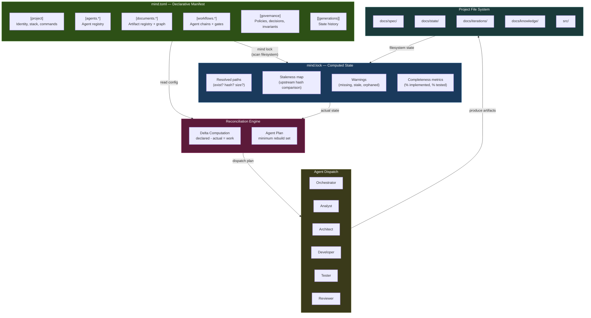

### 3.2 Data Flow — Single Request Lifecycle

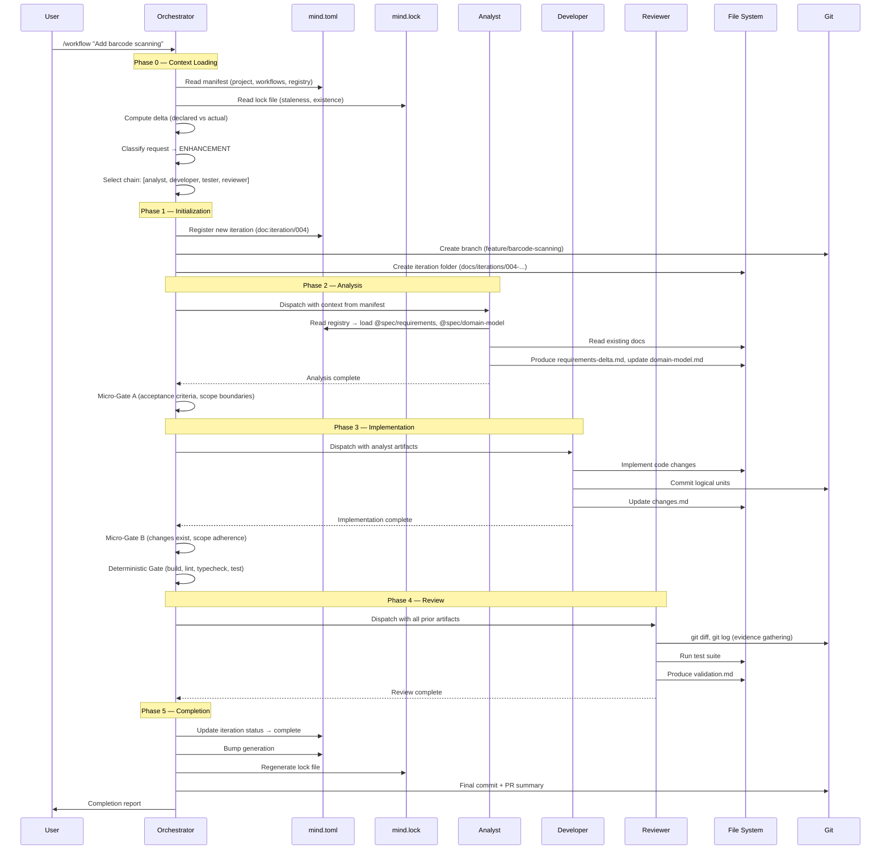

---

## 4. Format Decision

### Why TOML Over YAML

Both formats are viable. TOML wins for this specific use case — a governance file that is the single source of truth for an entire system — because of three properties:

| Property | TOML | YAML |
|----------|------|------|
| **Typing** | Explicit. `name = "api"` is always a string. `port = 8080` is always an integer. | Implicit. `NO` becomes `false`. `3.10` becomes `3.1`. `on` becomes `true`. |
| **Structure visibility** | Section headers (`[project.stack]`) make the file navigable by scanning headers. | Indentation defines structure — a misaligned space changes meaning silently. |
| **Merge conflicts** | Line-oriented. Sections are independent blocks. | Indentation-sensitive. Conflicts in nested structures require understanding the full tree. |

**The decisive argument**: For a file where a subtle type coercion could cause an agent to misinterpret a project configuration, TOML's explicitness is a safety feature, not verbosity. YAML's `enable: no` silently becoming `enable: false` is exactly the kind of bug a governance file must never have.

**Precedent**: Cargo.toml (Rust's build manifest), pyproject.toml (Python's project config), Hugo's config.toml. Build-system manifests — the closest analog to our use case — have converged on TOML.

### Format Comparison Matrix

| Format | Human Readable | Comments | LLM Fluency | Unambiguous Types | Deep Nesting | Git Diffs | Ecosystem |
|--------|:-:|:-:|:-:|:-:|:-:|:-:|:-:|
| **TOML** | Good | Yes | Good | Excellent | Moderate | Excellent | Strong |
| YAML | Excellent | Yes | Excellent | Poor | Excellent | Moderate | Massive |
| JSON | Poor | No | Excellent | Good | Good | Poor | Universal |
| JSONC | Moderate | Yes | Good | Good | Good | Poor | Moderate |
| Lua | Good | Yes | Good | N/A (code) | Excellent | Good | Moderate |
| KDL | Excellent | Yes | Poor | Good | Excellent | Good | Minimal |
| Nix | Poor | Yes | Poor | Excellent | Excellent | Good | Niche |

### TOML Nesting Mitigation

TOML's weakness is deep nesting (`[a.b.c.d]` header chains). We mitigate this by design:

- **Maximum 3 levels** of nesting in the manifest structure
- **Dotted keys** for leaf properties instead of nested tables
- **Flat arrays** with `[[array]]` syntax for collections (iterations, generations, dependencies)
- **URI-based IDs** carry hierarchy in the ID string, not in TOML structure

---

## 5. The Mind Manifest — `mind.toml`

### 5.1 Complete Structure

```toml
# ╔══════════════════════════════════════════════════════════════════╗
# ║  MIND MANIFEST — Single Source of Truth                         ║
# ║                                                                 ║
# ║  This file declares the complete system state.                  ║
# ║  Agents read it. Orchestrator enforces it. Git versions it.     ║
# ║  If it isn't in mind.toml, agents don't know about it.          ║
# ╚══════════════════════════════════════════════════════════════════╝

# ─────────────────────────────────────────────────────────────────
# MANIFEST METADATA
# ─────────────────────────────────────────────────────────────────

[manifest]
schema     = "mind/v2.0"
generation = 4                      # Monotonic counter (NixOS-style)
updated    = 2026-02-24T14:30:00Z

# ─────────────────────────────────────────────────────────────────
# PROJECT IDENTITY
# ─────────────────────────────────────────────────────────────────

[project]
name        = "inventory-api"
description = "Warehouse inventory management with barcode scanning"
domain      = "manufacturing"
type        = "backend"              # backend | frontend | fullstack | library | cli
created     = 2026-02-20

[project.stack]
language  = "python@3.12"
framework = "fastapi"
database  = "postgresql"
testing   = "pytest"

[project.commands]
dev       = "uvicorn app.main:app --reload"
test      = "pytest --cov=app"
lint      = "ruff check ."
typecheck = "mypy app/"
build     = "docker build -t inventory ."

# ─────────────────────────────────────────────────────────────────
# PROFILES — NixOS module-like activation bundles
# ─────────────────────────────────────────────────────────────────

[profiles]
active = ["backend-api"]
# backend-api activates:
#   - conventions: backend-patterns
#   - templates:   domain-model, api-contract
#   - specialists: database (available, not auto-included)

# ─────────────────────────────────────────────────────────────────
# AGENT REGISTRY
# ─────────────────────────────────────────────────────────────────

[agents.orchestrator]
id       = "agent:orchestrator"
path     = ".claude/agents/orchestrator.md"
role     = "dispatch"
loads    = "always"

[agents.analyst]
id       = "agent:analyst"
path     = ".claude/agents/analyst.md"
role     = "analysis"
loads    = "on-demand"
produces = ["doc:spec/requirements", "doc:spec/domain-model"]

[agents.architect]
id       = "agent:architect"
path     = ".claude/agents/architect.md"
role     = "design"
loads    = "conditional"
produces = ["doc:spec/architecture", "doc:spec/api-contracts"]

[agents.developer]
id       = "agent:developer"
path     = ".claude/agents/developer.md"
role     = "implementation"
loads    = "on-demand"
produces = ["doc:iteration/changes"]

[agents.tester]
id       = "agent:tester"
path     = ".claude/agents/tester.md"
role     = "verification"
loads    = "on-demand"

[agents.reviewer]
id       = "agent:reviewer"
path     = ".claude/agents/reviewer.md"
role     = "verification"
loads    = "on-demand"
produces = ["doc:iteration/validation"]

[agents.discovery]
id       = "agent:discovery"
path     = ".claude/agents/discovery.md"
role     = "exploration"
loads    = "on-demand"
produces = ["doc:spec/project-brief"]

# ─── Specialists (project-specific) ───

[agents.database-specialist]
id           = "specialist:database"
path         = ".claude/specialists/database-specialist.md"
role         = "analysis"
loads        = "conditional"
triggers     = ["database", "schema", "migration", "SQL", "query", "index"]
inserts-after = "analyst"

# ─────────────────────────────────────────────────────────────────
# WORKFLOW DEFINITIONS
# ─────────────────────────────────────────────────────────────────

[workflows.new-project]
chain             = ["analyst", "architect", "developer", "tester", "reviewer"]
session-split-after = "architect"
gates.after-analyst   = "gate:micro-a"
gates.after-developer = "gate:micro-b"
gates.before-reviewer = "gate:deterministic"

[workflows.bug-fix]
chain = ["analyst", "developer", "tester", "reviewer"]
gates.after-developer = "gate:micro-b"
gates.before-reviewer = "gate:deterministic"

[workflows.enhancement]
chain = ["analyst", "developer", "tester", "reviewer"]
# architect inserted dynamically if structural change detected
gates.after-analyst   = "gate:micro-a"
gates.after-developer = "gate:micro-b"
gates.before-reviewer = "gate:deterministic"

[workflows.refactor]
chain = ["analyst", "developer", "reviewer"]
gates.after-developer = "gate:micro-b"
gates.before-reviewer = "gate:deterministic"

# ─────────────────────────────────────────────────────────────────
# DOCUMENT REGISTRY — The Knowledge Graph
#
# Every artifact gets a canonical URI: doc:{zone}/{name}
# Physical paths are resolved relative to project root.
# ─────────────────────────────────────────────────────────────────

# ── Zone 1: Specifications (stable, versioned intent) ──

[documents.spec.project-brief]
id          = "doc:spec/project-brief"
path        = "docs/spec/project-brief.md"
zone        = "spec"
status      = "active"           # draft | active | stale | archived
owner       = "agent:discovery"
tags        = ["core", "planning"]
depends-on  = []

[documents.spec.requirements]
id          = "doc:spec/requirements"
path        = "docs/spec/requirements.md"
zone        = "spec"
status      = "active"
owner       = "agent:analyst"
depends-on  = ["doc:spec/project-brief"]
consumed-by = ["agent:architect", "agent:developer", "agent:tester"]
tags        = ["core"]
sections.FR-1 = { title = "Barcode scanning adds inventory",  status = "implemented", implemented-by = ["iter.001"] }
sections.FR-2 = { title = "Auto-calculate reorder points",    status = "implemented", implemented-by = ["iter.002"] }
sections.FR-3 = { title = "Real-time stock level dashboard",  status = "in-progress", implemented-by = ["iter.003"] }
sections.FR-4 = { title = "Export reports as CSV/PDF",         status = "pending" }

[documents.spec.domain-model]
id          = "doc:spec/domain-model"
path        = "docs/spec/domain-model.md"
zone        = "spec"
status      = "active"
owner       = "agent:analyst"
depends-on  = ["doc:spec/requirements"]
consumed-by = ["agent:architect", "agent:developer", "agent:tester"]
tags        = ["core", "domain", "entities"]
entities    = ["Product", "Warehouse", "StockLevel", "ScanEvent", "ReorderRule"]

[documents.spec.architecture]
id          = "doc:spec/architecture"
path        = "docs/spec/architecture.md"
zone        = "spec"
status      = "active"
owner       = "agent:architect"
depends-on  = ["doc:spec/requirements", "doc:spec/domain-model"]
consumed-by = ["agent:developer"]
tags        = ["core", "design"]

[documents.spec.api-contracts]
id          = "doc:spec/api-contracts"
path        = "docs/spec/api-contracts.md"
zone        = "spec"
status      = "draft"
owner       = "agent:architect"
depends-on  = ["doc:spec/domain-model", "doc:spec/architecture"]
consumed-by = ["agent:developer", "agent:tester"]
tags        = ["api"]

# ── Zone 2: Runtime State (volatile) ──

[documents.state.current]
id     = "doc:state/current"
path   = "docs/state/current.md"
zone   = "state"
status = "active"
owner  = "agent:orchestrator"

[documents.state.workflow]
id     = "doc:state/workflow"
path   = "docs/state/workflow.md"
zone   = "state"
status = "active"
owner  = "agent:orchestrator"

# ── Zone 3: Iterations (append-only history) ──

[documents.iterations.001-new-barcode-scanning]
id         = "doc:iteration/001"
path       = "docs/iterations/001-new-barcode-scanning/"
zone       = "iteration"
status     = "complete"
type       = "new-project"
branch     = "feature/barcode-scanning"
implements = ["doc:spec/requirements#FR-1"]
created    = 2026-02-20
artifacts  = ["overview.md", "changes.md", "validation.md"]

[documents.iterations.002-enhancement-reorder]
id         = "doc:iteration/002"
path       = "docs/iterations/002-enhancement-reorder/"
zone       = "iteration"
status     = "complete"
type       = "enhancement"
branch     = "feature/reorder-points"
implements = ["doc:spec/requirements#FR-2"]
created    = 2026-02-22
artifacts  = ["overview.md", "changes.md", "validation.md"]

[documents.iterations.003-enhancement-dashboard]
id         = "doc:iteration/003"
path       = "docs/iterations/003-enhancement-dashboard/"
zone       = "iteration"
status     = "active"
type       = "enhancement"
branch     = "feature/realtime-dashboard"
implements = ["doc:spec/requirements#FR-3"]
created    = 2026-02-24
artifacts  = ["overview.md", "changes.md"]

# ── Zone 4: Domain Knowledge (stable reference) ──

[documents.knowledge.glossary]
id     = "doc:knowledge/glossary"
path   = "docs/knowledge/glossary.md"
zone   = "knowledge"
status = "active"
owner  = "agent:discovery"
tags   = ["domain", "reference"]

# ─────────────────────────────────────────────────────────────────
# DEPENDENCY GRAPH — Explicit typed relationships
# ─────────────────────────────────────────────────────────────────

[[graph]]
from = "doc:spec/requirements"
to   = "doc:spec/project-brief"
type = "derives-from"

[[graph]]
from = "doc:spec/domain-model"
to   = "doc:spec/requirements"
type = "derives-from"

[[graph]]
from = "doc:spec/architecture"
to   = "doc:spec/requirements"
type = "derives-from"

[[graph]]
from = "doc:spec/architecture"
to   = "doc:spec/domain-model"
type = "derives-from"

[[graph]]
from = "doc:spec/api-contracts"
to   = "doc:spec/domain-model"
type = "derives-from"

[[graph]]
from = "doc:iteration/001"
to   = "doc:spec/requirements#FR-1"
type = "implements"

[[graph]]
from = "doc:iteration/002"
to   = "doc:spec/requirements#FR-2"
type = "implements"

[[graph]]
from = "doc:iteration/003"
to   = "doc:spec/requirements#FR-3"
type = "implements"

# ─────────────────────────────────────────────────────────────────
# GOVERNANCE
# ─────────────────────────────────────────────────────────────────

[governance]
max-retries     = 2
review-policy   = "evidence-based"
commit-policy   = "conventional"
branch-strategy = "type-descriptor"

[governance.gates.micro-a]
type   = "probabilistic"
checks = ["acceptance-criteria-present", "scope-boundaries-defined", "no-ambiguous-terms"]

[governance.gates.micro-b]
type   = "probabilistic"
checks = ["changes-md-exists", "all-files-exist", "scope-adherence"]

[governance.gates.deterministic]
type     = "deterministic"
commands = ["build", "lint", "typecheck", "test"]

[[governance.decisions]]
id       = "ADR-001"
title    = "FastAPI over Django"
status   = "accepted"
date     = 2026-02-20
document = "docs/spec/decisions/001-fastapi.md"

[governance.conventions]
active = ["code-quality", "documentation", "git-discipline", "severity", "temporal", "backend-patterns"]

# ─────────────────────────────────────────────────────────────────
# MANIFEST INVARIANTS — Self-validation rules
# ─────────────────────────────────────────────────────────────────

[manifest.invariants]
every-document-has-owner       = true
every-iteration-has-validation = true
no-orphan-dependencies         = true   # Every depends-on target must exist in registry
no-circular-dependencies       = true

# ─────────────────────────────────────────────────────────────────
# GENERATIONS — Strategic state history
# ─────────────────────────────────────────────────────────────────

[[generations]]
number = 4
date   = 2026-02-24
event  = "iteration-start"
detail = "003-enhancement-dashboard created, FR-3 in progress"

[[generations]]
number = 3
date   = 2026-02-23
event  = "iteration-complete"
detail = "002-enhancement-reorder completed, FR-2 implemented"

[[generations]]
number = 2
date   = 2026-02-22
event  = "iteration-start"
detail = "002-enhancement-reorder created"

[[generations]]
number = 1
date   = 2026-02-20
event  = "project-initialized"
detail = "Project created with barcode scanning scope (FR-1 through FR-4)"
```

### 5.2 Manifest Section Map

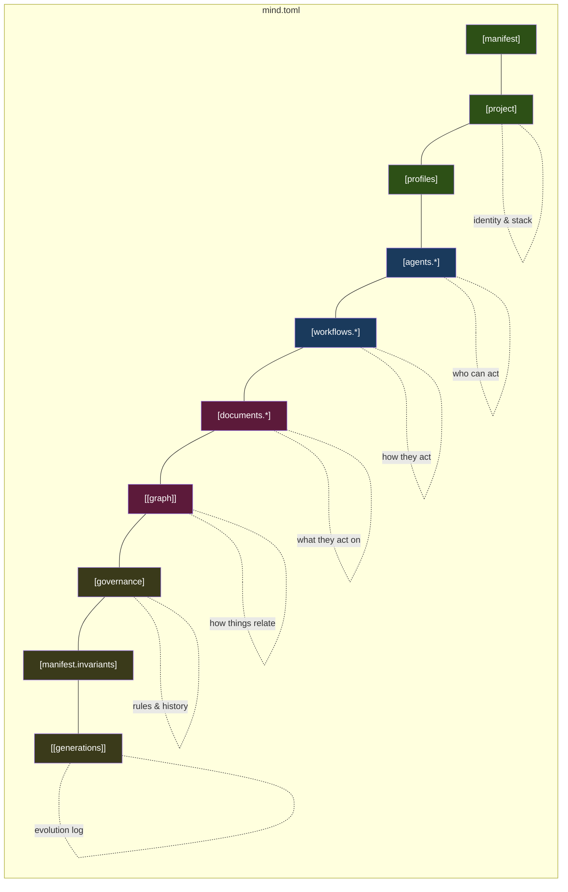

---

## 6. The Lock File — `mind.lock`

The lock file is a JSON snapshot of actual filesystem state, generated by scanning the disk against the manifest. It is auto-generated, committed to git, and never hand-edited.

### 6.1 Structure

```json
{
  "lockVersion": 1,
  "generatedAt": "2026-02-24T14:35:00Z",
  "generation": 4,

  "resolved": {
    "doc:spec/project-brief": {
      "path": "docs/spec/project-brief.md",
      "exists": true,
      "hash": "sha256:a3f2b1c8",
      "size": 2847,
      "lastModified": "2026-02-20T10:00:00Z",
      "stale": false
    },
    "doc:spec/requirements": {
      "path": "docs/spec/requirements.md",
      "exists": true,
      "hash": "sha256:d4e7f0a3",
      "size": 5231,
      "lastModified": "2026-02-24T09:00:00Z",
      "stale": false,
      "upstreamHashes": {
        "doc:spec/project-brief": "sha256:a3f2b1c8"
      }
    },
    "doc:spec/api-contracts": {
      "path": "docs/spec/api-contracts.md",
      "exists": false,
      "stale": true,
      "reason": "declared but not yet created"
    }
  },

  "warnings": [
    "doc:spec/api-contracts — declared but missing on disk",
    "doc:spec/requirements#FR-4 — status: pending, no implements edge"
  ],

  "completeness": {
    "requirements": { "total": 4, "implemented": 2, "in-progress": 1, "pending": 1, "percentage": 50 },
    "iterations": { "total": 3, "complete": 2, "active": 1 }
  },

  "integrity": "sha256:full-lock-hash"
}
```

### 6.2 Lock File Mechanics

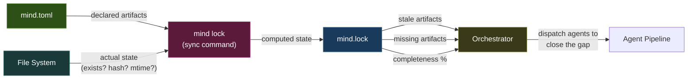

### 6.3 Staleness Detection — Upstream Hash Tracking

Each resolved artifact records the hashes of its dependencies *at the time it was last updated*. When a dependency changes, everything downstream becomes stale:

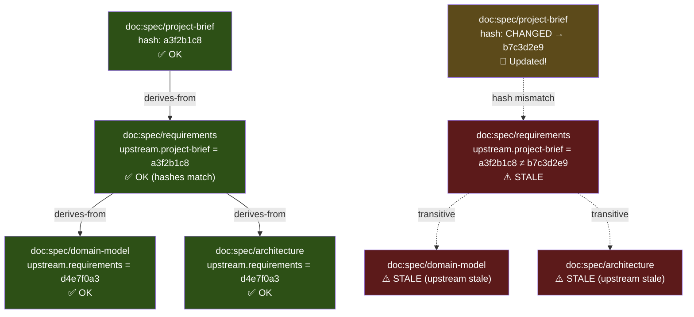

---

## 7. Canonical URI Scheme

### 7.1 URI Format

Every artifact in the system gets a canonical identifier that is stable, semantic, and path-independent.

```
{type}:{zone}/{name}              Document artifact
{type}:{zone}/{name}#{fragment}   Section within a document
{type}:{name}                     Non-document artifact
```

### 7.2 Namespace Registry

| Prefix | Scope | Example |
|--------|-------|---------|
| `doc:spec/` | Stable specifications | `doc:spec/requirements`, `doc:spec/domain-model` |
| `doc:state/` | Volatile runtime state | `doc:state/current`, `doc:state/workflow` |
| `doc:iteration/` | Immutable history | `doc:iteration/003` |
| `doc:knowledge/` | Domain reference | `doc:knowledge/glossary` |
| `agent:` | Agent definitions | `agent:analyst`, `agent:architect` |
| `specialist:` | Specialist agents | `specialist:database` |
| `gate:` | Quality gates | `gate:micro-a`, `gate:deterministic` |
| `workflow:` | Workflow definitions | `workflow:enhancement`, `workflow:bug-fix` |

### 7.3 Fragment Addressing

URIs support fragment identifiers for sub-artifact precision:

```
doc:spec/requirements#FR-3        → Functional Requirement 3
doc:spec/domain-model#Product     → Product entity
doc:spec/domain-model#BR-5        → Business Rule 5
doc:spec/architecture#ADR-002     → Architecture Decision Record 2
```

### 7.4 `@`-Shorthand for Prose References

In markdown documents, authors use `@`-prefixed shorthand:

```markdown
## Implementation Notes

This component implements @spec/requirements#FR-3 (real-time dashboard).
The data model follows the @spec/domain-model#StockLevel entity.
See @spec/architecture#ADR-001 for the framework choice rationale.
```

**Resolution rule**: `@{zone}/{name}` → `doc:{zone}/{name}` → look up `path` in `mind.toml` registry.

Agents can search for references: `grep -rn "@spec/requirements#FR-3" docs/` finds every document that mentions this requirement.

### 7.5 Why Path-Independent IDs Matter

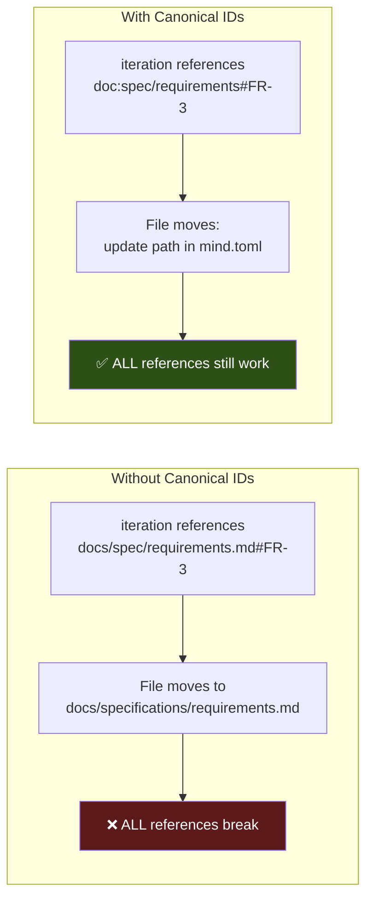

---

## 8. Reactive Dependency Graph

### 8.1 Graph Visualization

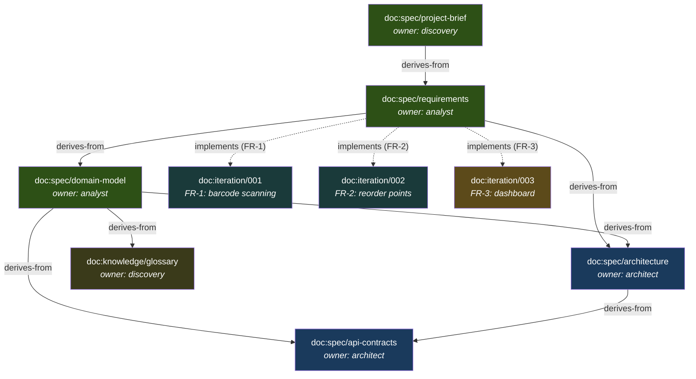

### 8.2 Edge Types and Their Semantics

| Edge | Direction | Meaning | Staleness Propagation |
|------|-----------|---------|----------------------|
| `derives-from` | downstream → upstream | This was created based on that | If upstream changes, downstream is stale |
| `implements` | iteration → requirement | This work fulfills that requirement | If requirement changes, implementation may need revision |
| `validates` | test → requirement | This test proves that requirement | If requirement changes, test needs review |
| `supersedes` | new-decision → old-decision | This replaces that | Old decision marked as superseded |
| `informs` | knowledge → spec | This context helps understand that | Advisory — no staleness propagation |

### 8.3 Graph Queries (Agent Capabilities)

| Query | How Agent Computes It | Use Case |
|-------|----------------------|----------|
| "What's stale?" | Read `mind.lock`, filter `stale: true` | Orchestrator decides what to rebuild |
| "What implements FR-3?" | Traverse `implements` edges from `doc:spec/requirements#FR-3` | Reviewer traces implementation |
| "What breaks if I change domain-model?" | Follow all `derives-from` edges forward from `doc:spec/domain-model` | Impact analysis before changes |
| "Is FR-4 tested?" | Check if any `validates` edge points to `doc:spec/requirements#FR-4` | Tester gap analysis |
| "What should analyst read?" | From the active iteration's `implements` targets, walk backward through `derives-from` edges | Smart context loading |
| "Project completion %" | Count requirement sections by status | Status reporting |

---

## 9. Reconciliation Engine

This is the core architectural innovation — the NixOS-rebuild equivalent for knowledge artifacts.

### 9.1 The Reconciliation Loop

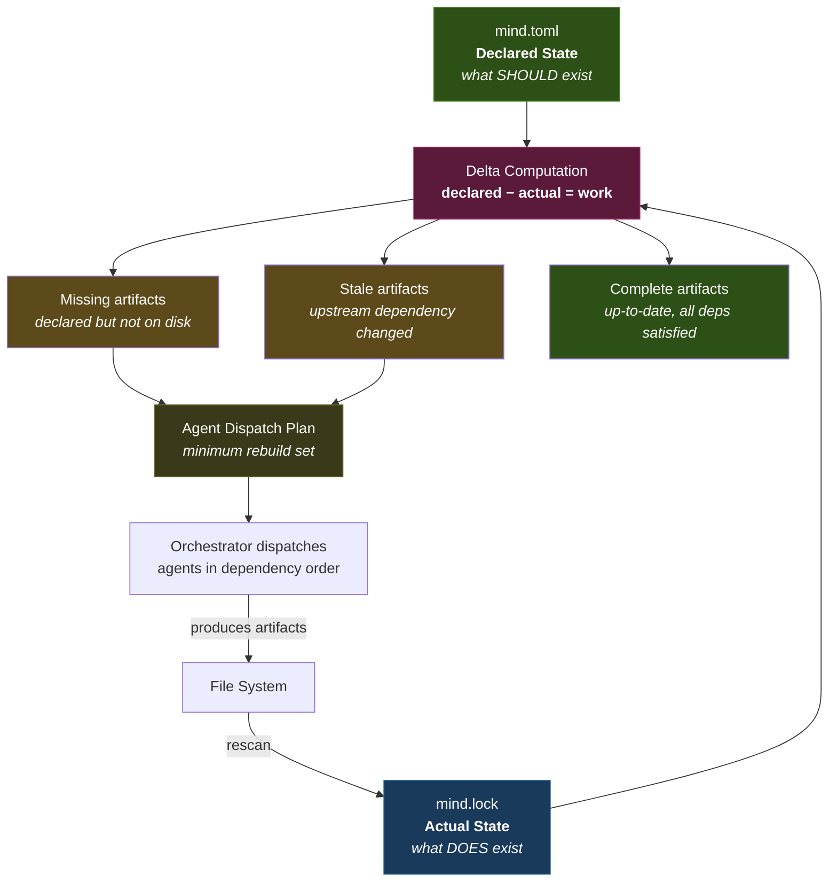

### 9.2 Example: Change Propagation

**Scenario**: User revises the project brief after discovery.

```
1. User edits docs/spec/project-brief.md
2. mind lock detects hash change: a3f2b1c8 → b7c3d2e9
3. Staleness propagation:
   └─ doc:spec/project-brief    → CHANGED
      └─ doc:spec/requirements  → STALE (upstream changed)
         ├─ doc:spec/domain-model    → STALE (transitive)
         ├─ doc:spec/architecture    → STALE (transitive)
         │   └─ doc:spec/api-contracts → STALE (transitive)
         └─ doc:iteration/003        → STALE (implements stale req)

4. Orchestrator computes rebuild plan:
   Step 1: agent:analyst      → refresh doc:spec/requirements, doc:spec/domain-model
   Step 2: agent:architect    → refresh doc:spec/architecture, doc:spec/api-contracts
   Step 3: agent:developer    → review active iteration against refreshed specs
   
   Skipped: doc:knowledge/glossary (no dependency edge to project-brief)
```

### 9.3 Reconciliation as Orchestrator Behavior

The reconciliation engine is not a separate tool — it's a **behavior pattern** within the orchestrator agent. When the orchestrator reads `mind.toml` + `mind.lock`, it effectively executes:

1. **Status**: Identify all stale, missing, and orphaned artifacts
2. **Plan**: Compute the minimum set of agents needed to resolve staleness, in dependency order
3. **Dispatch**: Execute the plan, updating the lock file after each agent completes

This means the `mind lock` sync can be:
- A pre-commit hook (automated)
- A script the user runs manually
- Or computed by the orchestrator at the start of every `/workflow` invocation

---

## 10. Project File Organization

### 10.1 Complete Project Layout

```
project-root/
│
├── mind.toml                          ← Declarative manifest (human-edited)
├── mind.lock                          ← Computed state (auto-generated)
├── CLAUDE.md                          ← Project constitution (routing table)
├── README.md
├── .gitignore
│
├── .claude/                           ← Agent framework (installed)
│   ├── CLAUDE.md                      ← Framework index
│   ├── agents/
│   │   ├── orchestrator.md
│   │   ├── analyst.md
│   │   ├── architect.md
│   │   ├── developer.md
│   │   ├── tester.md
│   │   ├── reviewer.md
│   │   └── discovery.md
│   ├── conventions/
│   │   ├── CLAUDE.md
│   │   ├── code-quality.md
│   │   ├── documentation.md
│   │   ├── git-discipline.md
│   │   ├── severity.md
│   │   ├── temporal.md
│   │   └── backend-patterns.md        ← Optional (activated by profile)
│   ├── skills/
│   │   ├── CLAUDE.md
│   │   ├── planning/SKILL.md
│   │   ├── debugging/SKILL.md
│   │   ├── refactoring/SKILL.md
│   │   └── quality-review/SKILL.md
│   ├── commands/
│   │   ├── discover.md
│   │   └── workflow.md
│   ├── specialists/
│   │   ├── _contract.md               ← Specialist creation guide
│   │   └── database-specialist.md     ← Example (project-specific)
│   └── templates/
│       ├── domain-model.md
│       ├── iteration-overview.md
│       └── retrospective.md
│
├── docs/
│   ├── spec/                          ← ZONE 1: Stable specifications
│   │   ├── project-brief.md
│   │   ├── requirements.md
│   │   ├── domain-model.md
│   │   ├── architecture.md
│   │   ├── api-contracts.md
│   │   └── decisions/
│   │       ├── _template.md
│   │       └── 001-fastapi.md
│   │
│   ├── state/                         ← ZONE 2: Volatile runtime
│   │   ├── current.md
│   │   └── workflow.md
│   │
│   ├── iterations/                    ← ZONE 3: Immutable history
│   │   ├── 001-new-barcode-scanning/
│   │   │   ├── overview.md
│   │   │   ├── changes.md
│   │   │   └── validation.md
│   │   ├── 002-enhancement-reorder/
│   │   │   ├── overview.md
│   │   │   ├── changes.md
│   │   │   └── validation.md
│   │   └── 003-enhancement-dashboard/
│   │       ├── overview.md
│   │       └── changes.md             ← In progress (no validation yet)
│   │
│   └── knowledge/                     ← ZONE 4: Domain reference
│       ├── glossary.md
│       └── integrations.md
│
└── src/                               ← Application source code
    └── ...
```

### 10.2 Zone Architecture

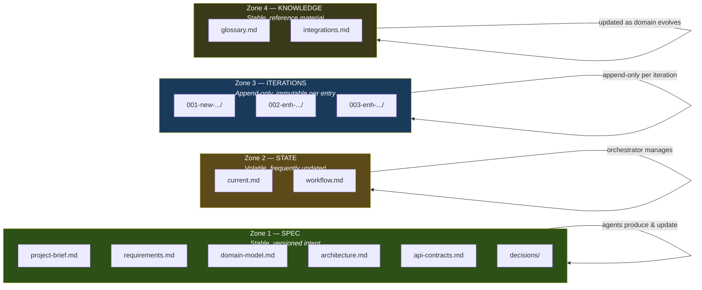

---

## 11. Workflow Lifecycle

### 11.1 Complete Workflow — NEW_PROJECT

```mermaid
flowchart TD
    START([User: /workflow "Create inventory API"]) --> READ_MT["Orchestrator reads mind.toml + mind.lock"]
    READ_MT --> CHECK["Check for interrupted workflow<br/>(state/workflow.md)"]
    CHECK -->|"No interrupted"| CLASSIFY["Classify request → NEW_PROJECT"]
    CHECK -->|"Interrupted found"| RESUME["Resume from last agent"]
    
    CLASSIFY --> CHAIN["Select chain:<br/>analyst → architect → developer → tester → reviewer"]
    CHAIN --> SPEC_SCAN["Scan for specialists<br/>(match triggers against request)"]
    SPEC_SCAN -->|"'database' matched"| INSERT_SPEC["Insert specialist:database<br/>after analyst"]
    SPEC_SCAN -->|"No match"| SKIP_SPEC["Continue with core chain"]
    
    INSERT_SPEC --> INIT
    SKIP_SPEC --> INIT
    
    INIT["Initialize iteration<br/>• Create docs/iterations/004-.../<br/>• Create git branch<br/>• Register in mind.toml<br/>• Bump generation"]
    
    INIT --> ANA["Agent: ANALYST<br/>• Read @spec/project-brief<br/>• Produce requirements.md<br/>• Produce domain-model.md"]
    ANA --> GA["MICRO-GATE A<br/>✓ Acceptance criteria?<br/>✓ Scope boundaries?<br/>✓ No ambiguous terms?"]
    GA -->|PASS| DB_SPEC["Agent: DATABASE-SPECIALIST<br/>(if activated)"]
    GA -->|FAIL| ANA
    
    DB_SPEC --> ARCH["Agent: ARCHITECT<br/>• Read requirements + domain model<br/>• Produce architecture.md<br/>• Produce api-contracts.md"]
    
    ARCH --> SPLIT{{"SESSION SPLIT RECOMMENDED<br/>Planning complete.<br/>Start new session for implementation."}}
    
    SPLIT -->|"Continue or resume"| DEV["Agent: DEVELOPER<br/>• Read all specs<br/>• Implement code<br/>• Commit at checkpoints<br/>• Produce changes.md"]
    DEV --> GB["MICRO-GATE B<br/>✓ changes.md exists?<br/>✓ Files exist on disk?<br/>✓ Scope adherence?"]
    GB -->|PASS| TEST
    GB -->|FAIL| DEV
    
    TEST["Agent: TESTER<br/>• Derive tests from domain model<br/>• Coverage verification"]
    TEST --> DET["DETERMINISTIC GATES<br/>✓ Build passes?<br/>✓ Lint clean?<br/>✓ Type-check passes?<br/>✓ All tests pass?"]
    DET -->|PASS| REV
    DET -->|FAIL<br/>return to developer| DEV
    
    REV["Agent: REVIEWER<br/>• git diff evidence<br/>• Requirement traceability<br/>• Validation report"]
    REV -->|APPROVED| COMPLETE
    REV -->|NEEDS_REVISION<br/>max 2 retries| DEV
    
    COMPLETE["COMPLETION<br/>• Update iteration status → complete<br/>• Bump generation<br/>• Regenerate mind.lock<br/>• Final commit + PR summary"]

    style START fill:#1a3a5c,color:#fff
    style GA fill:#5c4a1a,color:#fff
    style GB fill:#5c4a1a,color:#fff
    style DET fill:#5c1a1a,color:#fff
    style SPLIT fill:#3a1a5c,color:#fff
    style COMPLETE fill:#2d5016,color:#fff
```

### 11.2 Workflow Chains by Request Type

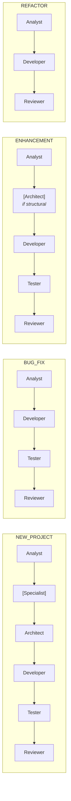

---

## 12. Quality Gate Architecture

### 12.1 Gate Types and Placement

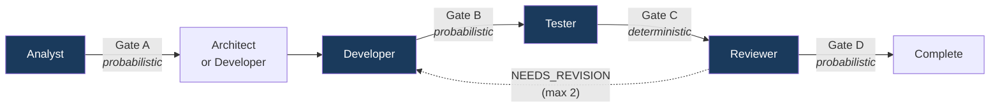

### 12.2 Gate Definitions

| Gate | Type | When | Checks | Blocks? |
|------|------|------|--------|---------|
| **Micro-Gate A** | Probabilistic | After analyst | Acceptance criteria present, scope boundaries defined, no ambiguous terms | Yes (retry analyst) |
| **Micro-Gate B** | Probabilistic | After developer | `changes.md` exists, all listed files exist, scope matches analyst's declared boundaries | Yes (retry developer) |
| **Deterministic** | Deterministic | Before reviewer | Build passes, lint clean, type-check passes, all tests pass | Yes (return to developer) |
| **Reviewer** | Probabilistic | After reviewer | Evidence-based MUST/SHOULD/COULD findings, dual-path verification | Yes if MUST findings (max 2 retries total) |

### 12.3 Gate Failure Flow

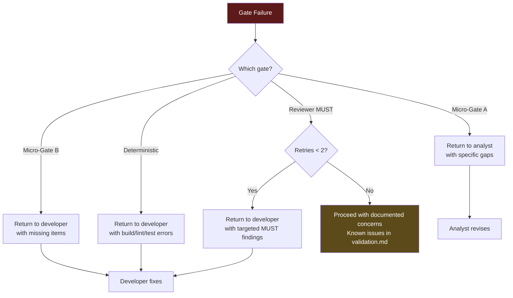

---

## 13. Session & Context Management

### 13.1 Session Split Strategy

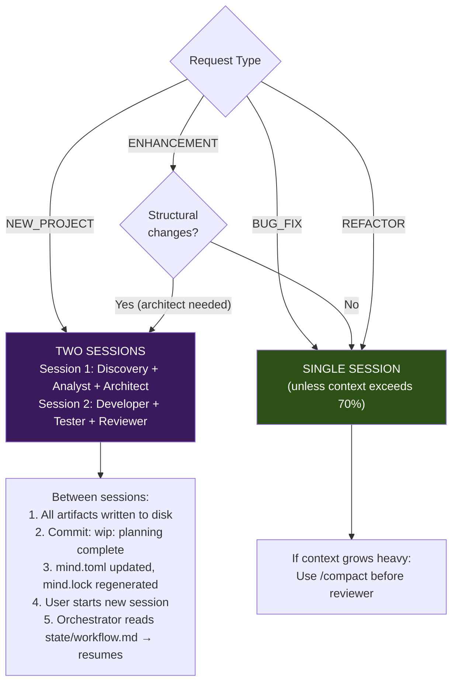

### 13.2 Context Loading per Agent

Each agent loads only the manifest sections relevant to its role:

| Agent | Reads from mind.toml | Reads from mind.lock |
|-------|---------------------|---------------------|
| Orchestrator | `[project]`, `[workflows]`, `[agents]`, `[governance]`, `[[generations]]` | Full: staleness, completeness, warnings |
| Analyst | `[documents.spec.*]`, `[[graph]]` (dependencies for spec zone) | Staleness of spec documents |
| Architect | `[documents.spec.*]`, `[project.stack]` | Staleness of architecture + domain model |
| Developer | `[project.commands]`, active iteration entry | Nothing (reads code, not manifest state) |
| Tester | Active iteration entry, `[documents.spec.domain-model]` | Nothing |
| Reviewer | `[governance]`, active iteration entry | Staleness, completeness |

---

## 14. Iteration Lifecycle

### 14.1 Iteration State Machine

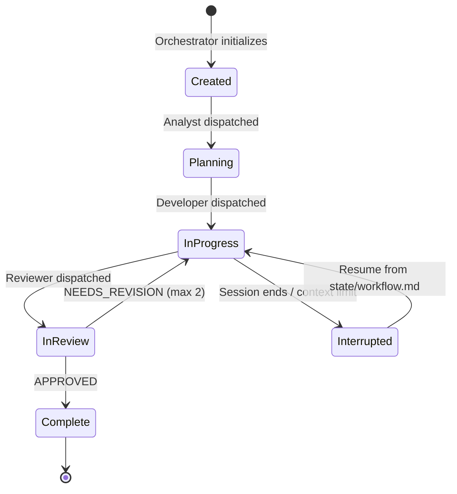

### 14.2 Iteration Artifacts by Type

| Request Type | overview.md | changes.md | validation.md | retrospective.md |
|:---:|:---:|:---:|:---:|:---:|
| NEW_PROJECT | Required | Required | Required | Recommended |
| BUG_FIX | Required | Required | Required | — |
| ENHANCEMENT | Required | Required | Required | — |
| REFACTOR | Required | Required | Required | — |

### 14.3 Iteration Registration in Manifest

When the orchestrator creates an iteration, it appends to `mind.toml`:

```toml
[documents.iterations.004-enhancement-barcode]
id         = "doc:iteration/004"
path       = "docs/iterations/004-enhancement-barcode/"
zone       = "iteration"
status     = "active"
type       = "enhancement"
branch     = "feature/barcode-scanning"
implements = ["doc:spec/requirements#FR-1"]
created    = 2026-02-24
artifacts  = ["overview.md"]
```

And adds a graph edge:

```toml
[[graph]]
from = "doc:iteration/004"
to   = "doc:spec/requirements#FR-1"
type = "implements"
```

And bumps the generation:

```toml
[[generations]]
number = 5
date   = 2026-02-24
event  = "iteration-start"
detail = "004-enhancement-barcode created, FR-1 in progress"
```

---

## 15. Profiles & Modularity

### 15.1 Profile Concept

Profiles are NixOS module-like activation bundles. Activating a profile enables a coherent set of conventions, templates, and specialist availability.

```toml
[profiles]
active = ["backend-api", "event-driven"]
```

### 15.2 Profile Definitions (shipped with framework)

| Profile | Activates | Use When |
|---------|-----------|----------|
| `backend-api` | `conventions/backend-patterns.md`, `templates/domain-model.md`, `templates/api-contract.md`, `specialist:database` (available) | Project type is backend or fullstack |
| `event-driven` | Messaging patterns guidance, async workflow awareness | Project uses message queues, event sourcing |
| `minimal` | Core agents + conventions only, no specialists, no optional templates | Small scripts, utilities, documentation projects |

### 15.3 Profile Resolution

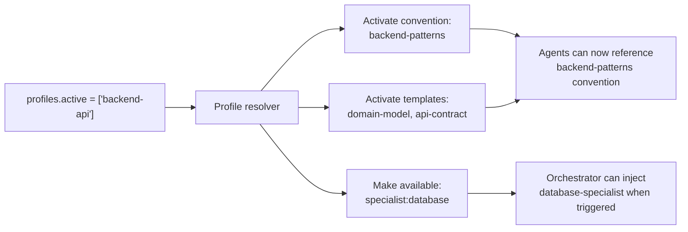

---

## 16. Layered Adoption Strategy

The manifest system is designed for gradual adoption. Projects start at Level 0 and add capabilities as needed.

### 16.1 Adoption Levels

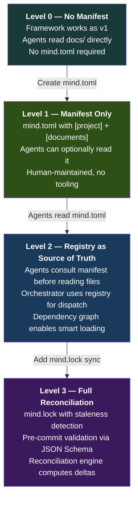

### 16.2 Level Comparison

| Capability | L0 | L1 | L2 | L3 |
|:---|:---:|:---:|:---:|:---:|
| Framework agents work | Yes | Yes | Yes | Yes |
| Artifact registry | — | Yes | Yes | Yes |
| Dependency graph | — | Optional | Yes | Yes |
| Smart context loading | — | — | Yes | Yes |
| Staleness detection | — | — | — | Yes |
| Completeness metrics | — | — | — | Yes |
| Pre-commit validation | — | — | — | Yes |
| Reconciliation engine | — | — | — | Yes |
| **Tooling required** | None | None | None | `mind lock` script |

### 16.3 Minimal mind.toml for Level 1

A new project starts with ~20 lines:

```toml
[manifest]
schema = "mind/v2.0"
generation = 1

[project]
name = "my-project"
type = "backend"

[project.stack]
language = "python@3.12"
framework = "fastapi"

[project.commands]
test = "pytest"
lint = "ruff check ."

[profiles]
active = ["backend-api"]
```

Everything else (document registry, graph, governance, generations) grows organically as the project evolves.

---

## 17. Implementation Roadmap

### 17.1 Phased Delivery

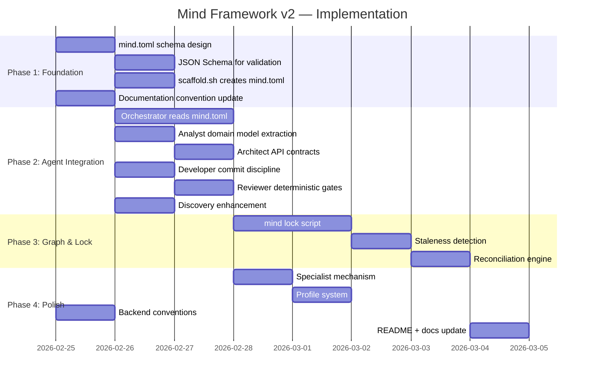

### 17.2 Deliverables per Phase

| Phase | Deliverables | Enables |
|-------|-------------|---------|
| **1. Foundation** | `mind.toml` schema, JSON Schema, scaffold creates manifest | Level 1 adoption |
| **2. Agent Integration** | All 7 agents updated with manifest awareness, micro-gates, git integration | Level 2 adoption |
| **3. Graph & Lock** | `mind lock` script, staleness detection, reconciliation engine behavior | Level 3 adoption |
| **4. Polish** | Specialist contract, profiles, backend conventions, documentation | Full framework |

### 17.3 Success Criteria

| Criterion | Measurement |
|-----------|------------|
| Framework remains lean | Total agent lines < 1,500 (currently ~1,100) |
| Manifest is optional | Framework works identically at Level 0 without mind.toml |
| Manifest is useful | At Level 2+, agents load 40% fewer irrelevant documents |
| Staleness detection works | Changed upstream → downstream marked stale within one `mind lock` run |
| Format is stable | mind.toml schema v2.0 handles all tested project shapes without breaking changes |

---

*This document is the canonical design specification for the Mind Framework v2 manifest system. It supersedes all prior proposals regarding the canonical file concept, format choice, and architectural approach.*
