# Mind Framework — Unified Specification

> **Version**: 2.0  
> **Date**: 2026-02-25  
> **Status**: Canonical — supersedes all prior architecture documents  
> **Purpose**: Complete, authoritative specification for the Mind Framework: design philosophy, manifest system, agent orchestration, implementation architecture, operational layer, and phased roadmap.

---

## Table of Contents

1. [Design Philosophy](#1-design-philosophy)
2. [Architectural Overview](#2-architectural-overview)
3. [The Mind Manifest](#3-the-mind-manifest)
4. [The Lock File](#4-the-lock-file)
5. [Canonical URI Scheme](#5-canonical-uri-scheme)
6. [Reactive Dependency Graph](#6-reactive-dependency-graph)
7. [Reconciliation Engine](#7-reconciliation-engine)
8. [Agent Orchestration](#8-agent-orchestration)
9. [Quality Gate Architecture](#9-quality-gate-architecture)
10. [Iteration Lifecycle](#10-iteration-lifecycle)
11. [Session & Context Management](#11-session--context-management)
12. [Framework Structure](#12-framework-structure)
13. [Project File Organization](#13-project-file-organization)
14. [Governance & Versioning](#14-governance--versioning)
15. [Profiles & Extensibility](#15-profiles--extensibility)
16. [Layered Adoption Strategy](#16-layered-adoption-strategy)
17. [Implementation Architecture](#17-implementation-architecture)
18. [Integration Architecture](#18-integration-architecture)
19. [Operational Layer](#19-operational-layer)
20. [Implementation Roadmap](#20-implementation-roadmap)
21. [Risk Assessment](#21-risk-assessment)
22. [Design Decisions & Rationale](#22-design-decisions--rationale)
23. [Migration Strategy](#23-migration-strategy)

---

## 1. Design Philosophy

### 1.1 The Core Insight

NixOS's power comes from three properties working together: **declarative** (describe what should exist), **reactive** (change one input, the system computes the minimum rebuild set), and **single-entry-point** (the configuration is the only way to change system state).

Applied to the Mind Framework:

> **`mind.toml` declares the desired project state. `mind.lock` captures actual state. The orchestrator computes the delta and dispatches the minimum agent set to converge.**

This is `nixos-rebuild` for knowledge artifacts.

### 1.2 Core Principles

| # | Principle | Rationale |
|---|-----------|-----------|
| P1 | **Declarative over imperative** | The manifest describes WHAT should exist. Agents determine HOW. |
| P2 | **Reactive dependency tracking** | Change one artifact; staleness propagates transitively through the graph. |
| P3 | **Single source of truth** | If it is not in `mind.toml`, agents do not know about it. |
| P4 | **Data, not code** | The manifest is pure data (TOML). Computed state lives in the lock file. No runtime dependency. |
| P5 | **Layered adoption** | Works at Level 0 with no manifest. Each level adds optional capability. |
| P6 | **Agents read, orchestrator writes** | Only the orchestrator modifies `mind.toml`. Agents consume it for context. |
| P7 | **Git is version control** | The manifest tracks current state. Full history lives in `git log -- mind.toml`. |
| P8 | **Add governance, not complexity** | Every addition must justify its token cost in every session that loads it. |

### 1.3 Operating Principles

| Principle | Meaning |
|-----------|---------|
| **Filesystem is the API** | No database, no daemon — plain files that bash, jq, and Python can query |
| **Agents read, CLI writes** | Agents consume operational state; CLI commands and hooks produce it |
| **Committed vs. ephemeral** | `mind.toml` and `mind.lock` are committed; `.mind/` contents are local and disposable |
| **Progressive cost** | Operations scale with project complexity — a 5-file project costs almost nothing |
| **CLI is the state engine, agents are the decision engine** | The `mind` binary computes state. Agents decide what to do with that state. |

### 1.4 Decision Rules and Guardrails

1. **Agent line count**: If any agent exceeds 300 lines, split into agent + loadable supplement
2. **Manifest nesting**: Maximum 3 levels in TOML structure; dotted keys for leaf properties
3. **Token budget**: Framework overhead per agent session must stay under 4,000 tokens at Level 3
4. **Retry limit**: Maximum 2 retries per workflow, with targeted feedback to specific agents
5. **Convention hierarchy** (conflict resolution):
   - User instruction (explicit override)
   - Project docs (`docs/spec/`, `docs/knowledge/`, project `CLAUDE.md`)
   - Codebase patterns (existing code conventions)
   - Framework conventions (`conventions/*.md`)
   - Best practices (community standards)

### 1.5 Competitive Position

| Dimension | Mind v1 | Mind v2 | Skynet Benchmark | Spec-Agent Benchmark |
|-----------|---------|---------|------------------|---------------------|
| Tech agnosticism | Strong | Strong | Weak (.NET) | Moderate (TS) |
| Adaptive routing | Yes | Yes | Yes | No (always full chain) |
| Evidence-based review | Yes | Yes | No (numerical scores) | No (numerical scores) |
| Declarative manifest | No | Yes (`mind.toml`) | No | No |
| Dependency graph | No | Yes (reactive) | No | No |
| Domain model artifact | No | Yes | Partial (C#-specific) | No |
| Semantic doc zones | No | Yes (4 zones) | Partial (hierarchical) | No (flat) |
| Deterministic quality gates | No | Yes | No | No |
| Context budget management | No | Yes | No | No |
| Total token footprint | ~2,058 lines | ~2,500 lines | ~7,000+ lines | ~7,200 lines |

---

## 2. Architectural Overview

### 2.1 Three-Layer Architecture

The system operates on a manifest-lock-reconcile loop:

```
mind.toml (declared state) + mind.lock (actual state) → delta → agent dispatch → artifact production → lock regeneration
```

| Layer | Components | Responsibility |
|-------|-----------|----------------|
| **Governance Layer** | `mind.toml`, `[[graph]]`, `[governance]`, `[[generations]]` | Declares desired project state, policies, and relationships |
| **Reconciliation Layer** | `mind.lock`, delta computation, agent dispatch plan | Computes actual state, detects drift, determines minimum rebuild set |
| **Execution Layer** | Agent pipeline, quality gates, CLI/MCP tools, hooks | Produces artifacts that converge actual state toward declared state |

### 2.2 System Architecture

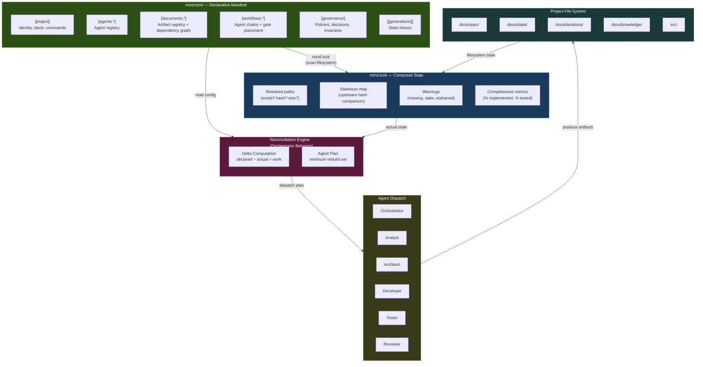

### 2.3 Request Lifecycle

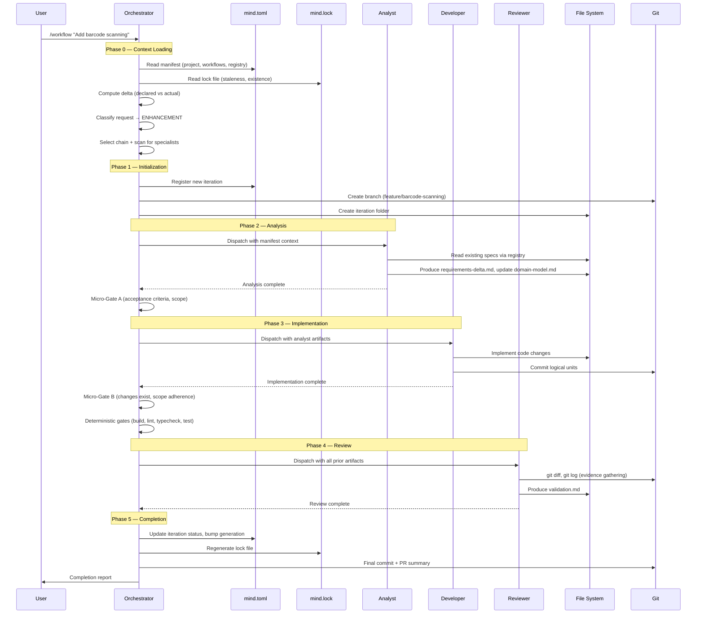

---

## 3. The Mind Manifest

### 3.1 Format Decision: TOML

The manifest format was evaluated against five constraints: LLM-parseable, human-editable, machine-parseable, comment-friendly, and diff-friendly.

| Property | TOML | YAML |
|----------|------|------|
| **Typing** | Explicit. `name = "api"` is always a string. `port = 8080` is always an integer. | Implicit. `NO` becomes `false`. `3.10` becomes `3.1`. `on` becomes `true`. |
| **Structure visibility** | Section headers (`[project.stack]`) make the file navigable by scanning headers. | Indentation defines structure — a misaligned space changes meaning silently. |
| **Merge conflicts** | Line-oriented. Sections are independent blocks. | Indentation-sensitive. Conflicts in nested structures require understanding the full tree. |

**The decisive argument**: For a file where a subtle type coercion could cause an agent to misinterpret a project configuration, TOML's explicitness is a safety feature. YAML's `enable: no` silently becoming `enable: false` is exactly the class of bug a governance file must prevent.

**Precedent**: Cargo.toml, pyproject.toml, Hugo config.toml — build-system manifests have converged on TOML.

**Nesting mitigation**: Maximum 3 levels. Dotted keys for leaf properties. URI-based IDs carry hierarchy in the string, not in TOML structure.

### 3.2 Complete Manifest Structure

```toml
# ╔══════════════════════════════════════════════════════════════════╗
# ║  MIND MANIFEST — Single Source of Truth                         ║
# ║                                                                 ║
# ║  Declares the complete system state.                            ║
# ║  Agents read it. Orchestrator enforces it. Git versions it.     ║
# ╚══════════════════════════════════════════════════════════════════╝

# ─── MANIFEST METADATA ───────────────────────────────────────────

[manifest]
schema     = "mind/v2.0"
generation = 4                      # Monotonic counter (NixOS-style)
updated    = 2026-02-24T14:30:00Z

# ─── PROJECT IDENTITY ────────────────────────────────────────────

[project]
name        = "inventory-api"
description = "Warehouse inventory management with barcode scanning"
domain      = "manufacturing"
type        = "backend"              # backend | frontend | fullstack | library | cli
created     = 2026-02-20

[project.stack]
language  = "python@3.12"
framework = "fastapi"
database  = "postgresql"
testing   = "pytest"

[project.commands]
dev       = "uvicorn app.main:app --reload"
test      = "pytest --cov=app"
lint      = "ruff check ."
typecheck = "mypy app/"
build     = "docker build -t inventory ."

# ─── PROFILES ─────────────────────────────────────────────────────

[profiles]
active = ["backend-api"]

# ─── FRAMEWORK CONFIGURATION ─────────────────────────────────────

[framework]
version = "2.0.0"
path    = ".claude"

[framework.orchestration]
max-retries      = 2
session-strategy = "split"

[framework.quality-gates]
deterministic = true
micro-gates   = true

# ─── AGENT REGISTRY ──────────────────────────────────────────────

[agents.orchestrator]
id     = "agent:orchestrator"
path   = ".claude/agents/orchestrator.md"
role   = "dispatch"
loads  = "always"

[agents.analyst]
id       = "agent:analyst"
path     = ".claude/agents/analyst.md"
role     = "analysis"
loads    = "on-demand"
produces = ["doc:spec/requirements", "doc:spec/domain-model"]

[agents.architect]
id       = "agent:architect"
path     = ".claude/agents/architect.md"
role     = "design"
loads    = "conditional"
produces = ["doc:spec/architecture", "doc:spec/api-contracts"]

[agents.developer]
id       = "agent:developer"
path     = ".claude/agents/developer.md"
role     = "implementation"
loads    = "on-demand"
produces = ["doc:iteration/changes"]

[agents.tester]
id       = "agent:tester"
path     = ".claude/agents/tester.md"
role     = "verification"
loads    = "on-demand"

[agents.reviewer]
id       = "agent:reviewer"
path     = ".claude/agents/reviewer.md"
role     = "verification"
loads    = "on-demand"
produces = ["doc:iteration/validation"]

[agents.discovery]
id       = "agent:discovery"
path     = ".claude/agents/discovery.md"
role     = "exploration"
loads    = "on-demand"
produces = ["doc:spec/project-brief"]

# ─── SPECIALIST AGENTS (project-specific) ────────────────────────

[agents.database-specialist]
id            = "specialist:database"
path          = ".claude/specialists/database-specialist.md"
role          = "analysis"
loads         = "conditional"
triggers      = ["database", "schema", "migration", "SQL", "query", "index"]
inserts-after = "analyst"

# ─── WORKFLOW DEFINITIONS ─────────────────────────────────────────

[workflows.new-project]
chain               = ["analyst", "architect", "developer", "tester", "reviewer"]
session-split-after = "architect"
gates.after-analyst   = "gate:micro-a"
gates.after-developer = "gate:micro-b"
gates.before-reviewer = "gate:deterministic"

[workflows.bug-fix]
chain = ["analyst", "developer", "tester", "reviewer"]
gates.after-developer = "gate:micro-b"
gates.before-reviewer = "gate:deterministic"

[workflows.enhancement]
chain = ["analyst", "developer", "tester", "reviewer"]
gates.after-analyst   = "gate:micro-a"
gates.after-developer = "gate:micro-b"
gates.before-reviewer = "gate:deterministic"

[workflows.refactor]
chain = ["analyst", "developer", "reviewer"]
gates.after-developer = "gate:micro-b"
gates.before-reviewer = "gate:deterministic"

[workflows.complex-new]
chain               = ["conversation-moderator", "analyst", "architect", "developer", "tester", "reviewer"]
session-split-after = "architect"
gates.after-moderator = "gate:convergence"
gates.after-analyst   = "gate:micro-a"
gates.after-developer = "gate:micro-b"
gates.before-reviewer = "gate:deterministic"

# ─── DOCUMENT REGISTRY ────────────────────────────────────────────

# ── Zone 1: Specifications (stable, versioned intent) ──

[documents.spec.project-brief]
id          = "doc:spec/project-brief"
path        = "docs/spec/project-brief.md"
zone        = "spec"
status      = "active"
owner       = "agent:discovery"
depends-on  = []
tags        = ["core", "planning"]

[documents.spec.requirements]
id          = "doc:spec/requirements"
path        = "docs/spec/requirements.md"
zone        = "spec"
status      = "active"
owner       = "agent:analyst"
depends-on  = ["doc:spec/project-brief"]
consumed-by = ["agent:architect", "agent:developer", "agent:tester"]
tags        = ["core"]
sections.FR-1 = { title = "Barcode scanning adds inventory",  status = "implemented", implemented-by = ["iter.001"] }
sections.FR-2 = { title = "Auto-calculate reorder points",    status = "implemented", implemented-by = ["iter.002"] }
sections.FR-3 = { title = "Real-time stock level dashboard",  status = "in-progress", implemented-by = ["iter.003"] }
sections.FR-4 = { title = "Export reports as CSV/PDF",         status = "pending" }

[documents.spec.domain-model]
id          = "doc:spec/domain-model"
path        = "docs/spec/domain-model.md"
zone        = "spec"
status      = "active"
owner       = "agent:analyst"
depends-on  = ["doc:spec/requirements"]
consumed-by = ["agent:architect", "agent:developer", "agent:tester"]
tags        = ["core", "domain", "entities"]
entities    = ["Product", "Warehouse", "StockLevel", "ScanEvent", "ReorderRule"]

[documents.spec.architecture]
id          = "doc:spec/architecture"
path        = "docs/spec/architecture.md"
zone        = "spec"
status      = "active"
owner       = "agent:architect"
depends-on  = ["doc:spec/requirements", "doc:spec/domain-model"]
consumed-by = ["agent:developer"]
tags        = ["core", "design"]

[documents.spec.api-contracts]
id          = "doc:spec/api-contracts"
path        = "docs/spec/api-contracts.md"
zone        = "spec"
status      = "draft"
owner       = "agent:architect"
depends-on  = ["doc:spec/domain-model", "doc:spec/architecture"]
consumed-by = ["agent:developer", "agent:tester"]
tags        = ["api", "contracts"]

# ── Zone 2: Runtime State (volatile) ──

[documents.state.current]
id     = "doc:state/current"
path   = "docs/state/current.md"
zone   = "state"
status = "active"
owner  = "agent:orchestrator"

[documents.state.workflow]
id     = "doc:state/workflow"
path   = "docs/state/workflow.md"
zone   = "state"
status = "active"
owner  = "agent:orchestrator"

# ── Zone 3: Iterations (append-only history) ──

[documents.iterations.001-new-barcode-scanning]
id         = "doc:iteration/001"
path       = "docs/iterations/001-new-barcode-scanning/"
zone       = "iteration"
status     = "complete"
type       = "new-project"
branch     = "feature/barcode-scanning"
implements = ["doc:spec/requirements#FR-1"]
created    = 2026-02-20
artifacts  = ["overview.md", "changes.md", "validation.md"]

# ── Zone 4: Domain Knowledge (stable reference) ──

[documents.knowledge.glossary]
id     = "doc:knowledge/glossary"
path   = "docs/knowledge/glossary.md"
zone   = "knowledge"
status = "active"
owner  = "agent:discovery"
tags   = ["domain", "reference"]

# ─── DEPENDENCY GRAPH ──────────────────────────────────────────────

[[graph]]
from = "doc:spec/requirements"
to   = "doc:spec/project-brief"
type = "derives-from"

[[graph]]
from = "doc:spec/domain-model"
to   = "doc:spec/requirements"
type = "derives-from"

[[graph]]
from = "doc:spec/architecture"
to   = "doc:spec/requirements"
type = "derives-from"

[[graph]]
from = "doc:spec/architecture"
to   = "doc:spec/domain-model"
type = "derives-from"

[[graph]]
from = "doc:spec/api-contracts"
to   = "doc:spec/domain-model"
type = "derives-from"

[[graph]]
from = "doc:iteration/001"
to   = "doc:spec/requirements#FR-1"
type = "implements"

# ─── GOVERNANCE ────────────────────────────────────────────────────

[governance]
max-retries     = 2
review-policy   = "evidence-based"
commit-policy   = "conventional"
branch-strategy = "type-descriptor"

[governance.gates.micro-a]
type   = "probabilistic"
checks = ["acceptance-criteria-present", "scope-boundaries-defined", "no-ambiguous-terms"]

[governance.gates.micro-b]
type   = "probabilistic"
checks = ["changes-md-exists", "all-files-exist", "scope-adherence"]

[governance.gates.deterministic]
type     = "deterministic"
commands = ["build", "lint", "typecheck", "test"]

[[governance.decisions]]
id       = "ADR-001"
title    = "FastAPI over Django"
status   = "accepted"
date     = 2026-02-20
document = "docs/spec/decisions/001-fastapi.md"

[governance.conventions]
active = ["code-quality", "documentation", "git-discipline", "severity", "temporal", "backend-patterns"]

# ─── OPERATIONS ────────────────────────────────────────────────────

[operations]
log-retention = 20
output-retention = 5
cache-strategy = "mtime-first"

[operations.hooks]
pre-commit = [".mind/hooks/verify-lock.sh"]

# ─── MANIFEST INVARIANTS ──────────────────────────────────────────

[manifest.invariants]
every-document-has-owner       = true
every-iteration-has-validation = true
no-orphan-dependencies         = true
no-circular-dependencies       = true

# ─── GENERATIONS ───────────────────────────────────────────────────

[[generations]]
number = 4
date   = 2026-02-24
event  = "iteration-start"
detail = "003-enhancement-dashboard created"

[[generations]]
number = 3
date   = 2026-02-23
event  = "iteration-complete"
detail = "002-enhancement-reorder completed"
```

### 3.3 Manifest Section Map

| Section | Purpose | Maintained By |
|---------|---------|---------------|
| `[manifest]` | Schema version, generation counter | Orchestrator |
| `[project]` | Identity, stack, commands | Human |
| `[profiles]` | Active profile bundles | Human |
| `[framework]` | Framework version, orchestration config, gate toggles | Human |
| `[agents.*]` | Agent registry (path, role, loads, produces) | Framework |
| `[workflows.*]` | Agent chains per request type, gate placement | Framework |
| `[documents.*]` | Artifact registry with URIs, paths, owners, dependencies | Orchestrator |
| `[[graph]]` | Typed dependency edges between artifacts | Orchestrator |
| `[governance]` | Review policy, commit policy, gates, ADRs, conventions | Orchestrator + Human |
| `[operations]` | Runtime configuration: retention, hooks, cache strategy | Human |
| `[manifest.invariants]` | Self-validation rules (no orphan deps, no cycles) | Framework |
| `[[generations]]` | Strategic state history (monotonic counter) | Orchestrator |

---

## 4. The Lock File

### 4.1 Structure

Auto-generated JSON snapshot of actual filesystem state. Committed to git. Never hand-edited.

```json
{
  "lockVersion": 1,
  "generatedAt": "2026-02-24T14:35:00Z",
  "generation": 4,

  "resolved": {
    "doc:spec/project-brief": {
      "path": "docs/spec/project-brief.md",
      "exists": true,
      "hash": "sha256:a3f2b1c8",
      "size": 2847,
      "lastModified": "2026-02-20T10:00:00Z",
      "stale": false
    },
    "doc:spec/requirements": {
      "path": "docs/spec/requirements.md",
      "exists": true,
      "hash": "sha256:d4e7f0a3",
      "size": 5231,
      "lastModified": "2026-02-24T09:00:00Z",
      "stale": false,
      "upstreamHashes": {
        "doc:spec/project-brief": "sha256:a3f2b1c8"
      }
    },
    "doc:spec/api-contracts": {
      "path": "docs/spec/api-contracts.md",
      "exists": false,
      "stale": true,
      "reason": "declared but not yet created"
    }
  },

  "warnings": [
    "doc:spec/api-contracts — declared but missing on disk",
    "doc:spec/requirements#FR-4 — status: pending, no implements edge"
  ],

  "completeness": {
    "requirements": { "total": 4, "implemented": 2, "in-progress": 1, "pending": 1, "percentage": 50 },
    "iterations": { "total": 3, "complete": 2, "active": 1 }
  },

  "operations": {
    "last-lock": "2026-02-24T14:35:00Z",
    "cache-hits": 42,
    "cache-misses": 3
  },

  "integrity": "sha256:full-lock-hash"
}
```

### 4.2 Lock File Mechanics

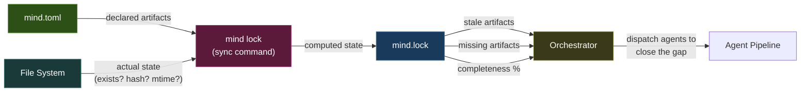

### 4.3 Staleness Detection via Upstream Hash Tracking

Each resolved artifact records the hashes of its dependencies *at the time it was last updated*. When a dependency's hash changes, everything downstream becomes transitively stale:

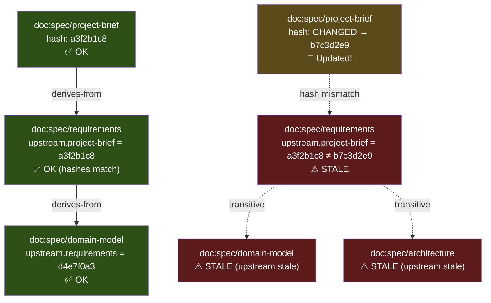

### 4.4 Lock Sync Data Flow

```
mind lock
  → Parse mind.toml → Manifest struct
  → Read previous mind.lock
  → For each declared artifact:
      → stat(path): exists? mtime? size?
      → If mtime + size unchanged → skip hash (fast path)
      → If changed → compute SHA-256 → compare against lock hash
      → If hash differs → mark CHANGED, propagate staleness downstream
  → Compute completeness metrics
  → Generate warnings
  → Write mind.lock (atomic: .tmp → rename)
  → Update .mind/cache/hashes.json
```

---

## 5. Canonical URI Scheme

### 5.1 URI Format

Every artifact gets a stable, path-independent identifier:

```
{type}:{zone}/{name}              Document artifact
{type}:{zone}/{name}#{fragment}   Section within a document
{type}:{name}                     Non-document artifact
```

### 5.2 Namespace Registry

| Prefix | Scope | Example |
|--------|-------|---------|
| `doc:spec/` | Stable specifications | `doc:spec/requirements`, `doc:spec/domain-model` |
| `doc:state/` | Volatile runtime state | `doc:state/current`, `doc:state/workflow` |
| `doc:iteration/` | Immutable history | `doc:iteration/003` |
| `doc:knowledge/` | Domain reference | `doc:knowledge/glossary` |
| `agent:` | Agent definitions | `agent:analyst`, `agent:architect` |
| `specialist:` | Specialist agents | `specialist:database` |
| `gate:` | Quality gates | `gate:micro-a`, `gate:deterministic` |
| `workflow:` | Workflow definitions | `workflow:enhancement`, `workflow:bug-fix` |

### 5.3 Fragment Addressing

```
doc:spec/requirements#FR-3        → Functional Requirement 3
doc:spec/domain-model#Product     → Product entity
doc:spec/domain-model#BR-5        → Business Rule 5
doc:spec/architecture#ADR-002     → Architecture Decision Record 2
```

### 5.4 `@`-Shorthand for Prose References

In markdown documents, authors use `@`-prefixed shorthand:

```markdown
This component implements @spec/requirements#FR-3 (real-time dashboard).
The data model follows @spec/domain-model#StockLevel.
See @spec/architecture#ADR-001 for the framework choice rationale.
```

**Resolution rule**: `@{zone}/{name}` → `doc:{zone}/{name}` → look up `path` in `mind.toml` registry.

### 5.5 Why Path-Independent IDs

If `docs/spec/requirements.md` moves to `docs/specifications/requirements.md`, only the manifest's `path` field changes. Every cross-reference, dependency edge, and `@` shorthand still resolves correctly. Zero broken links.

---

## 6. Reactive Dependency Graph

### 6.1 Graph Structure

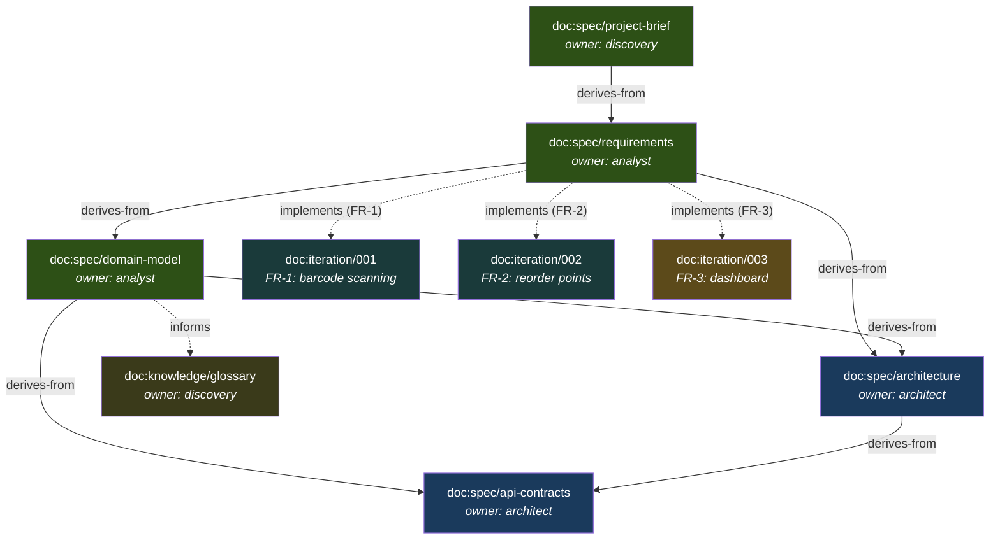

### 6.2 Edge Types

| Edge | Direction | Meaning | Staleness Propagation |
|------|-----------|---------|----------------------|
| `derives-from` | downstream → upstream | Created based on upstream content | Yes — upstream change = downstream stale |
| `implements` | iteration → requirement | Work that fulfills a requirement | Advisory — flagged but not auto-stale |
| `validates` | test → requirement | Test that proves a requirement | Advisory — flagged for review |
| `supersedes` | new → old | Replaces a prior decision/artifact | Old marked as superseded |
| `informs` | knowledge → spec | Reference context | No propagation (advisory only) |

### 6.3 Graph Queries

| Query | Use Case |
|-------|----------|
| "What is stale?" | Orchestrator decides what to rebuild |
| "What implements FR-3?" | Reviewer traces requirement → implementation |
| "What breaks if domain-model changes?" | Impact analysis before modifications |
| "Is FR-4 tested?" | Tester gap analysis |
| "What should analyst read?" | Smart context loading from `depends-on` edges |
| "Project completion %" | Status reporting from `completeness` in lock file |

---

## 7. Reconciliation Engine

The reconciliation engine is the orchestrator's core behavior — the NixOS-rebuild equivalent for knowledge artifacts.

### 7.1 The Reconciliation Loop

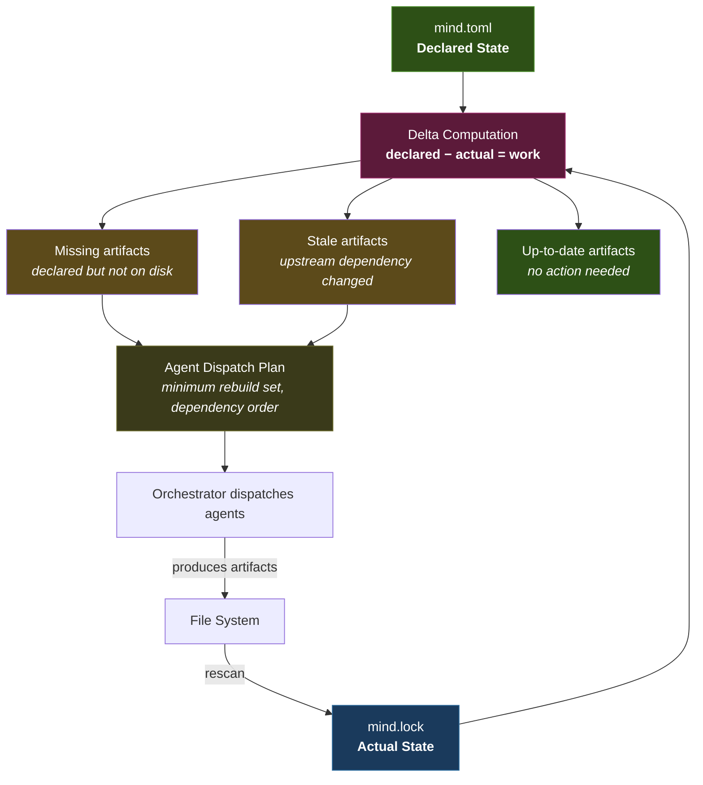

### 7.2 Change Propagation Example

```
1. User edits docs/spec/project-brief.md
2. mind.lock detects hash change: a3f2b1c8 → b7c3d2e9
3. Staleness propagation:
   └─ doc:spec/project-brief        → CHANGED
      └─ doc:spec/requirements      → STALE (upstream changed)
         ├─ doc:spec/domain-model   → STALE (transitive)
         ├─ doc:spec/architecture   → STALE (transitive)
         │   └─ doc:spec/api-contracts → STALE (transitive)
         └─ doc:iteration/003       → FLAGGED (implements stale req)

4. Orchestrator rebuild plan:
   Step 1: agent:analyst   → refresh requirements + domain-model
   Step 2: agent:architect → refresh architecture + api-contracts

   Skipped: doc:knowledge/glossary (no dependency edge to project-brief)
```

### 7.3 Reconciliation as Orchestrator Behavior

The reconciliation engine is not a separate tool — it is a behavior pattern within the orchestrator agent. The `mind lock` sync can be:
- A pre-commit hook (automated)
- A script the user runs manually
- Computed by the orchestrator at the start of every `/workflow` invocation

---

## 8. Agent Orchestration

### 8.1 Agent Registry

| Agent | Role | Loads | Produces | Key v2 Enhancement |
|-------|------|-------|----------|---------------------|
| **Orchestrator** | Dispatch | Always | `doc:state/workflow`, iteration registration | Git integration, micro-gates, reconciliation, session splits |
| **Analyst** | Analysis | On-demand | `doc:spec/requirements`, `doc:spec/domain-model` | Domain model extraction, GIVEN/WHEN/THEN acceptance criteria |
| **Architect** | Design | Conditional | `doc:spec/architecture`, `doc:spec/api-contracts` | API contracts, domain model alignment |
| **Developer** | Implementation | On-demand | `doc:iteration/changes` | Commit discipline protocol, scope cross-reference |
| **Tester** | Verification | On-demand | — | Domain model test derivation |
| **Reviewer** | Verification | On-demand | `doc:iteration/validation` | Deterministic gates, git discipline check |
| **Discovery** | Exploration | On-demand | `doc:spec/project-brief` | Stakeholder mapping, business rules, MVP scoping |
| **Conversation Moderator** | Dialectical analysis | Conditional | `analysis/conversation/*.md` | Multi-persona debate, convergence synthesis, COMPLEX_NEW pre-analysis |

> **Note**: The conversation moderator and its specialist personas (architect, pragmatist, critic, researcher) live in `.github/agents/` (Copilot Chat convention) rather than `agents/`. They form the **conversation module** — a structured dialectical analysis system invoked for architecturally uncertain requests (`COMPLEX_NEW`) or standalone via `/analyze`.

### 8.2 Workflow Chains

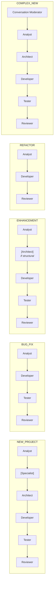

### 8.3 Specialist Injection

Specialists are project-specific agents that activate conditionally based on keyword triggers. Zero specialists ship by default.

**Orchestrator behavior**:
1. For each file in `specialists/*.md`, read frontmatter `triggers`
2. Match triggers against user's request description (case-insensitive)
3. If >= 2 trigger words match: insert specialist after the agent in `inserts-after`
4. Log activation in iteration overview

### 8.4 Agent Context Loading

Each agent loads only relevant manifest sections:

| Agent | Reads from mind.toml | Reads from mind.lock |
|-------|---------------------|---------------------|
| Orchestrator | `[project]`, `[workflows]`, `[agents]`, `[governance]`, `[[generations]]` | Full: staleness, completeness, warnings |
| Analyst | `[documents.spec.*]`, `[[graph]]` | Staleness of spec documents |
| Architect | `[documents.spec.*]`, `[project.stack]` | Staleness of architecture |
| Developer | `[project.commands]`, active iteration | — (reads code directly) |
| Tester | Active iteration, `[documents.spec.domain-model]` | — |
| Reviewer | `[governance]`, active iteration | Staleness, completeness |

---

## 9. Quality Gate Architecture

### 9.1 Gate Placement

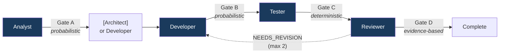

### 9.2 Gate Definitions

| Gate | Type | When | Checks | On Failure |
|------|------|------|--------|------------|
| **Micro-Gate A** | Probabilistic | After analyst | Acceptance criteria present, scope boundaries defined, no ambiguous terms | Retry analyst |
| **Micro-Gate B** | Probabilistic | After developer | `changes.md` exists, all listed files exist, scope matches analyst's boundaries | Retry developer |
| **Deterministic** | Deterministic | Before reviewer | Build passes, lint clean, type-check passes, all tests pass | Return to developer with errors |
| **Reviewer** | Evidence-based | After reviewer | MUST/SHOULD/COULD findings via git diff + test results + requirement traceability | If MUST findings: return to developer (max 2 total retries) |

### 9.3 Gate Failure Flow

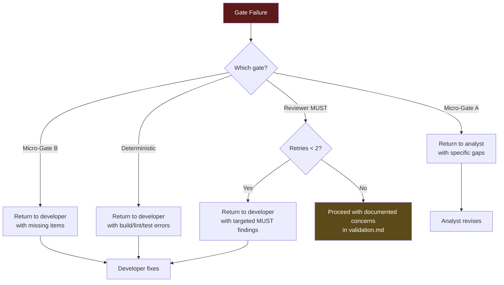

### 9.4 Deterministic Gate Commands

Commands are resolved from `project.commands` in `mind.toml`. Run in order; stop at first failure:

1. **Build**: `project.commands.build` — must exit 0
2. **Lint**: `project.commands.lint` — must produce zero errors
3. **Type-check**: `project.commands.typecheck` — must exit 0
4. **Test**: `project.commands.test` — all tests must pass

If any command is not defined in the manifest, that check is skipped.

---

## 10. Iteration Lifecycle

### 10.1 State Machine

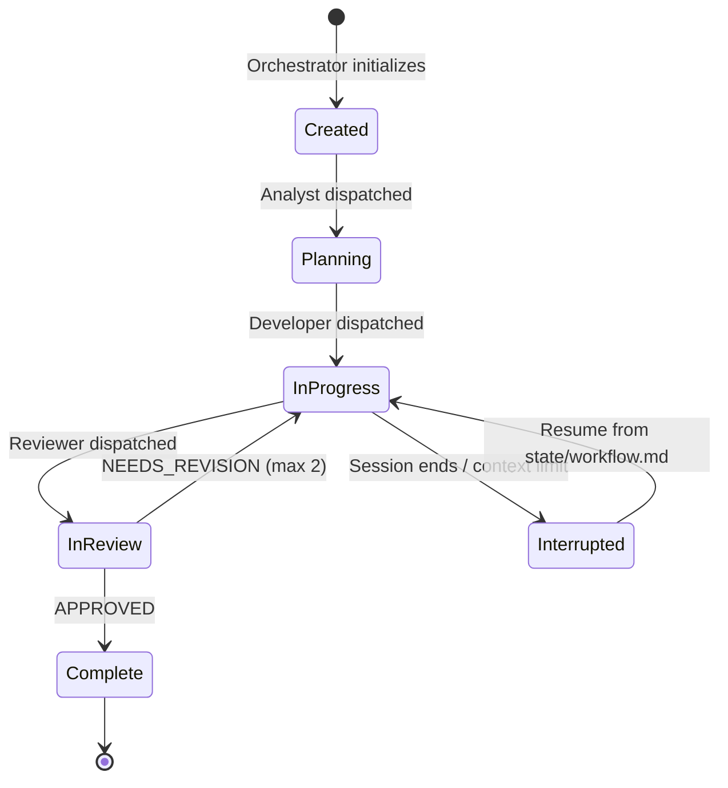

### 10.2 Lifecycle Phases

| Phase | Inputs | Activities | Outputs | Checkpoint |
|-------|--------|-----------|---------|------------|
| **Planning** | User request, manifest context, lock state | Classification, chain selection, specialist scan, initialization | Iteration folder, branch, manifest registration | Generation bump |
| **Analysis** | Project brief, existing specs, domain context | Requirements extraction, domain model, acceptance criteria | requirements-delta.md, domain-model.md | Gate A |
| **Design** (conditional) | Requirements, domain model | Architecture decisions, API contracts | architecture.md, api-contracts.md | Session split (if needed) |
| **Implementation** | All specs, architecture | Code changes, commit at logical units | changes.md, source code | Gate B |
| **Verification** | Domain model, changes | Test derivation, coverage verification | Tests, test results | Deterministic gate |
| **Review** | All artifacts, git diff, test evidence | Evidence-based assessment, traceability | validation.md | Reviewer verdict |
| **Completion** | Reviewer approval | Status update, lock regen, PR summary | Final commit, generation bump | Workflow end |

### 10.3 Iteration Initialization

When the orchestrator creates an iteration:

1. **Create iteration folder**: `docs/iterations/{NNN}-{type}-{descriptor}/`
2. **Create git branch**: `{type}/{descriptor}` (e.g., `feature/barcode-scanning`)
3. **Register in manifest**: append iteration entry to `[documents.iterations.*]`
4. **Add graph edge**: `[[graph]]` entry linking iteration to requirement
5. **Bump generation**: `[[generations]]` entry with `event = "iteration-start"`

### 10.4 Artifact Scaling by Request Type

| Type | overview.md | changes.md | validation.md | retrospective.md |
|:---:|:---:|:---:|:---:|:---:|
| NEW_PROJECT | Required | Required | Required | Recommended |
| BUG_FIX | Required | Required | Required | — |
| ENHANCEMENT | Required | Required | Required | — |
| REFACTOR | Required | Required | Required | — |

### 10.5 Branch Strategy

| Request Type | Branch Prefix | Example |
|:---:|---|---|
| NEW_PROJECT | `feature/` | `feature/inventory-api` |
| BUG_FIX | `bugfix/` | `bugfix/login-500-error` |
| ENHANCEMENT | `feature/` | `feature/barcode-scanning` |
| REFACTOR | `refactor/` | `refactor/data-layer` |

### 10.6 Commit Protocol

| Checkpoint | Message Format | Example |
|---|---|---|
| Iteration created | `docs: initialize iteration {descriptor}` | `docs: initialize iteration barcode-scanning` |
| Each logical implementation unit | `{type}({scope}): {description}` | `feat(inventory): add barcode scan endpoint` |
| Test additions | `test({scope}): {description}` | `test(inventory): validate barcode format` |
| Review artifacts | `docs: add validation for {descriptor}` | `docs: add validation for barcode-scanning` |
| Planning complete (session split) | `wip: planning complete for {descriptor}` | `wip: planning complete for barcode-scanning` |

---

## 11. Session & Context Management

### 11.1 Session Split Strategy

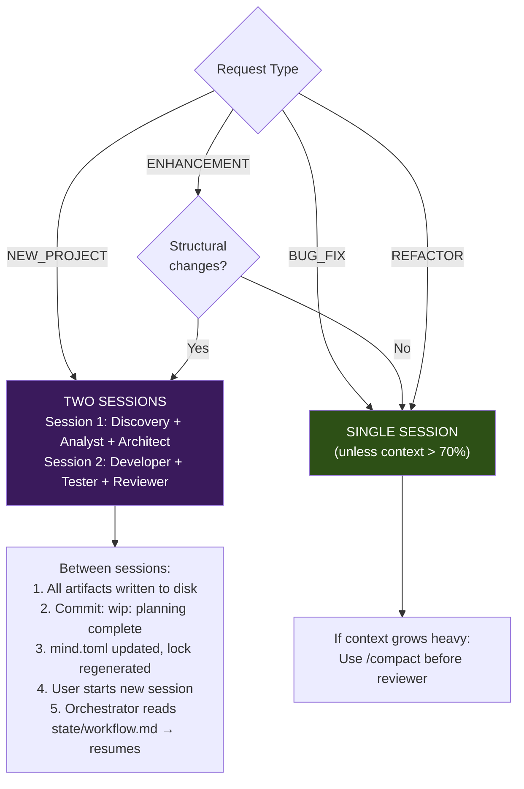

### 11.2 Workflow Resume Protocol

When a workflow is interrupted:

1. Orchestrator writes structured handoff to `docs/state/workflow.md`:
   - Position (type, descriptor, last agent, remaining chain)
   - Completed artifact locations
   - Key decisions made in this session
   - Context guidance for next session
2. Commit with message `wip: planning complete for {descriptor}`
3. On resume: orchestrator reads handoff → selectively loads referenced artifacts → skips completed agents

### 11.3 Token Efficiency Design

| Mechanism | Savings |
|-----------|---------|
| Adaptive routing | BUG_FIX loads 4 agents, not 7 (~40-60% agent token savings) |
| On-demand skill loading | Skills loaded only when agent needs guidance |
| Separate conventions | Update one convention; all agents inherit. No duplication. |
| Manifest context loading | Each agent reads only relevant manifest sections |
| Lean agents | ~200 lines average per agent. Total framework ~2,500 lines |
| Session splits | Long workflows split across sessions to prevent context exhaustion |
| `@`-shorthand | Compact cross-references: `@spec/requirements#FR-3` vs full paths |

---

## 12. Framework Structure

### 12.1 Framework Repository Layout

```
mind-framework/
├── CLAUDE.md                       # Framework index (~200 tokens, pure routing)
├── MIND-FRAMEWORK.md               # Canonical specification
├── README.md                       # Framework documentation
├── install.sh                      # Install framework into project's .claude/
├── scaffold.sh                     # Bootstrap project structure + mind.toml
│
├── agents/                         # Core agents (7)
│   ├── orchestrator.md
│   ├── analyst.md
│   ├── architect.md
│   ├── developer.md
│   ├── tester.md
│   ├── reviewer.md
│   └── discovery.md
│
├── conventions/                    # Universal rules (7)
│   ├── CLAUDE.md
│   ├── shared.md                   # Cross-workflow patterns (evidence, reasoning, scope)
│   ├── code-quality.md
│   ├── documentation.md            # 4-zone model
│   ├── git-discipline.md           # Commit protocol, branch strategy, PR flow
│   ├── severity.md                 # MUST/SHOULD/COULD + intent markers
│   ├── temporal.md                 # Temporal contamination heuristic
│   └── backend-patterns.md         # Optional (activated by profile)
│
├── skills/                         # On-demand deep dives (4)
│   ├── CLAUDE.md
│   ├── planning/SKILL.md
│   ├── debugging/SKILL.md
│   ├── refactoring/SKILL.md
│   └── quality-review/SKILL.md
│
├── commands/                       # User entry points (3)
│   ├── analyze.md                  # /analyze — conversation analysis (Mode A/B)
│   ├── discover.md
│   └── workflow.md
│
├── specialists/                    # Optional domain specialists
│   ├── _contract.md
│   └── examples/
│       └── database-specialist.md
│
├── templates/                      # Reusable document templates
│   ├── domain-model.md
│   ├── api-contract.md
│   ├── iteration-overview.md
│   └── retrospective.md
│
├── bin/                            # CLI dispatcher
│   └── mind
│
├── conversation/                   # Conversation module (dialectical analysis)
│   ├── config/
│   │   ├── conversation.yml        # Core workflow config, phase routing
│   │   ├── extensions.yml          # Skills, protocols, gates, delegation
│   │   ├── personas.yml            # Persona library, presets, variants
│   │   └── quality.yml             # 6-dimension rubric, evaluator-optimizer
│   ├── protocols/
│   │   ├── PROTOCOLS.md
│   │   ├── approval-gates/PROTOCOL.md
│   │   ├── evaluator-optimizer/PROTOCOL.md
│   │   ├── mediated-delegation/PROTOCOL.md
│   │   └── phase-routing/PROTOCOL.md
│   └── skills/
│       ├── SKILLS.md
│       ├── challenge-methodology/SKILL.md
│       ├── decision-documentation/SKILL.md
│       ├── evidence-standards/SKILL.md
│       ├── reasoning-chains/SKILL.md
│       └── scope-discipline/SKILL.md
│
├── .github/                        # Copilot Chat agents and prompts
│   ├── agents/
│   │   ├── conversation-moderator.md
│   │   ├── conversation-persona-architect.md
│   │   ├── conversation-persona-critic.md
│   │   ├── conversation-persona-pragmatist.md
│   │   ├── conversation-persona-researcher.md
│   │   └── conversation-persona.md  # Generic (runtime-configured)
│   └── prompts/
│       ├── analyze.prompt.md        # Mode A (fresh positions)
│       └── analyze-documents.prompt.md  # Mode B (document-as-position)
│
├── analysis/                       # Convergence output (produced by moderator)
│   └── conversation/
│
└── lib/                            # Shared libraries
    ├── mind_lock.py
    ├── mind_validate.py
    ├── mind_graph.py
    ├── mind_summarize.py
    └── common.sh
```

---

## 13. Project File Organization

### 13.1 Target Project Layout

```
project-root/
├── mind.toml                       # Declarative manifest
├── mind.lock                       # Computed state (auto-generated)
├── CLAUDE.md                       # Project routing table
├── .claude/                        # Installed framework
│   ├── agents/, conventions/, skills/, commands/
│   ├── specialists/, templates/
│   ├── bin/mind                    # CLI dispatcher
│   └── lib/                       # Python modules + Bash lib
│
├── docs/
│   ├── spec/                       # Zone 1: Stable specifications
│   │   ├── project-brief.md, requirements.md, domain-model.md
│   │   ├── architecture.md, api-contracts.md
│   │   └── decisions/              # ADRs
│   ├── state/                      # Zone 2: Volatile runtime state
│   │   ├── current.md, workflow.md
│   │   └── gate-results/
│   ├── iterations/                 # Zone 3: Immutable history (append-only)
│   │   └── {NNN}-{type}-{descriptor}/
│   └── knowledge/                  # Zone 4: Domain reference
│       ├── glossary.md
│       └── integrations.md
│
├── .mind/                          # Runtime state (.gitignored)
│   ├── cache/, logs/, outputs/, tmp/, hooks/
│
└── src/                            # Application source code
```

### 13.2 Zone Architecture

| Zone | Mutability | Who Writes | Staleness Tracked |
|------|-----------|------------|:-:|
| **spec/** | Stable — updated after analysis | Analyst, Architect, Discovery | Yes |
| **state/** | Volatile — changes every session | Orchestrator | No (always current) |
| **iterations/** | Append-only — immutable once complete | All agents (within their iteration) | No (historical) |
| **knowledge/** | Stable — evolves with business understanding | Discovery, Analyst | Yes |

---

## 14. Governance & Versioning

### 14.1 Governance Model

| Aspect | Policy | Source |
|--------|--------|--------|
| **Review** | Evidence-based (git diff, git log, test results) — no self-assessed scores | `governance.review-policy` |
| **Commits** | Conventional format: `{type}({scope}): {description}` | `governance.commit-policy` |
| **Branches** | `{type}/{descriptor}` per request classification | `governance.branch-strategy` |
| **Retries** | Max 2 per workflow, with targeted feedback to specific agent | `governance.max-retries` |
| **Severity** | MUST/SHOULD/COULD with dual-path verification for blocking findings | `conventions/severity.md` |
| **Intent markers** | `:PERF:`, `:UNSAFE:`, `:SCHEMA:`, `:TEMP:` — prevent false-positive findings | `conventions/severity.md` |
| **Temporal contamination** | 5-question heuristic to detect reliance on outdated knowledge | `conventions/temporal.md` |

### 14.2 Generations

Every significant state transition is recorded as a generation:

```toml
[[generations]]
number = 5
date   = 2026-02-24
event  = "iteration-start"
detail = "004-enhancement-barcode created"
```

**Generation events**: `iteration-start`, `iteration-complete`, `spec-update`, `decision-made`

Last 5-10 generations are kept inline; full history lives in `git log -- mind.toml`.

### 14.3 Architecture Decision Records

ADRs are registered in the manifest and stored as files in `docs/spec/decisions/`:

```toml
[[governance.decisions]]
id       = "ADR-001"
title    = "FastAPI over Django"
status   = "accepted"               # proposed | accepted | deprecated | superseded
date     = 2026-02-20
document = "docs/spec/decisions/001-fastapi.md"
```

### 14.4 Manifest Self-Validation

```toml
[manifest.invariants]
every-document-has-owner       = true
every-iteration-has-validation = true
no-orphan-dependencies         = true
no-circular-dependencies       = true
```

Checked by the orchestrator at workflow start and by `mind lock` during sync.

### 14.5 Ownership Boundaries

| Artifact | Owner | Write Authority |
|----------|-------|----------------|
| `mind.toml` — `[project]`, `[profiles]` | Human (project lead) | Direct edit |
| `mind.toml` — `[documents]`, `[[graph]]`, `[[generations]]` | Orchestrator | Automated during workflow |
| `mind.toml` — `[governance.decisions]` | Orchestrator + Human | ADRs proposed by agents, accepted by human |
| `mind.lock` | CLI tool (`mind lock`) | Fully automated, never hand-edited |
| Agent definitions | Framework maintainer | Updated via `install.sh --update` |
| Specialist definitions | Project team | Project-specific creation |

### 14.6 Architectural Change Control

- **Schema changes** to `mind.toml`: Require schema version bump; existing projects continue at prior version
- **Agent behavior changes**: Updated via `install.sh --update`; project-specific overrides preserved
- **New agent addition**: Rejected by design — 7 agents cover all needs; additional agents add permanent token cost
- **Profile changes**: New profiles can be added without breaking existing projects

---

## 15. Profiles & Extensibility

### 15.1 Profile Concept

Profiles are NixOS module-like activation bundles. Activating a profile enables a coherent set of conventions, templates, and specialist availability.

```toml
[profiles]
active = ["backend-api"]
```

### 15.2 Available Profiles

| Profile | Activates | Use When |
|---------|-----------|----------|
| `backend-api` | `conventions/backend-patterns.md`, `templates/domain-model.md`, `templates/api-contract.md`, `specialist:database` (available) | Project type is `backend` or `fullstack` |
| `event-driven` | Messaging patterns guidance, async workflow awareness | Project uses message queues, event sourcing |
| `minimal` | Core agents + conventions only, no specialists, no optional templates | Small scripts, utilities, documentation |

### 15.3 Profile Resolution

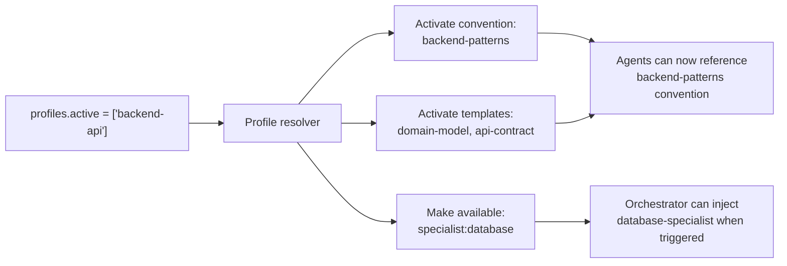

---

## 16. Layered Adoption Strategy

### 16.1 Adoption Levels

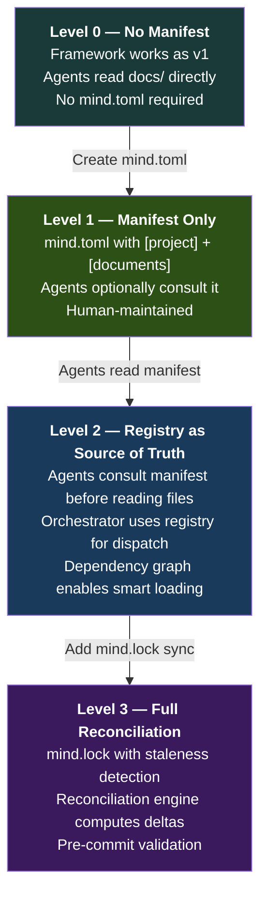

### 16.2 Level Comparison

| Capability | L0 | L1 | L2 | L3 |
|:---|:---:|:---:|:---:|:---:|
| Framework agents work | Yes | Yes | Yes | Yes |
| Artifact registry | — | Yes | Yes | Yes |
| Dependency graph | — | Optional | Yes | Yes |
| Smart context loading | — | — | Yes | Yes |
| Staleness detection | — | — | — | Yes |
| Completeness metrics | — | — | — | Yes |
| Reconciliation engine | — | — | — | Yes |
| **Tooling required** | None | None | None | `mind lock` script |

### 16.3 Minimal Level 1 Manifest (~20 lines)

```toml
[manifest]
schema = "mind/v2.0"
generation = 1

[project]
name = "my-project"
type = "backend"

[project.stack]
language = "python@3.12"
framework = "fastapi"

[project.commands]
test = "pytest"
lint = "ruff check ."

[profiles]
active = ["backend-api"]
```

---

## 17. Implementation Architecture

### 17.1 Technology Decision: Hybrid Incremental

```
Phase 1 (MVP):     Bash + Python scripts      → validates design, zero friction
Phase 2 (Engine):  Rust CLI + MCP server       → performance, cross-platform, agent-agnostic
Phase 3 (Runtime): Rust core + adapter layer   → standalone capability, plugin ecosystem
```

**Why Rust for the engine**: The framework is a developer tool that lives in CLI environments. Developer tools have converged on Rust (ripgrep, fd, bat, delta, biome). Rust offers single-binary distribution, sub-millisecond operations (critical for git hooks), first-class TOML support (the format was designed for Cargo), WASM compilation for sandboxed plugins, and the official MCP SDK (RMCP) is Rust-native.

**Why MCP as the integration surface**: Claude Code, Codex CLI, and Gemini CLI all support MCP. One MCP server replaces three platform-specific adapters.

**Why hybrid incremental**: Each phase is independently valuable. Phase 1 validates the design with zero tooling investment. The community chooses their comfort level.

### 17.2 Technology Stack

| Layer | Technology | Rationale |
|-------|-----------|-----------|
| **Language (Engine)** | Rust 2024 edition | Single binary, sub-ms startup, TOML-native, WASM host |
| **Language (MVP)** | Python 3.11+ (stdlib-only) | Validates design with zero friction |
| **CLI framework** | clap v4 | Derive-based, subcommands, shell completions |
| **TOML parsing** | toml + serde (Rust), tomllib (Python) | De facto standards for each ecosystem |
| **JSON handling** | serde_json | Zero-cost serialization |
| **Git operations** | git2 (libgit2 bindings) | Programmatic git without shell-out |
| **MCP server** | rmcp | Official Rust MCP SDK |
| **WASM runtime** | wasmtime | Production-grade, capability model |
| **Hashing** | sha2 | Pure Rust SHA-256 |

### 17.3 Hexagonal Architecture

The core engine uses ports-and-adapters for testability:

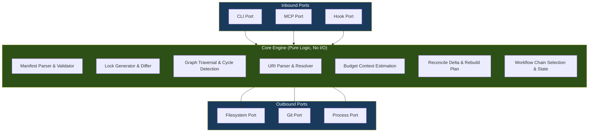

### 17.4 Crate Decomposition (Rust Engine)

```
crates/
├── mind-core/           ← Pure business logic (no I/O)
│   └── manifest/, lock/, graph/, uri/, budget/, reconcile/, workflow/
├── mind-runtime/        ← I/O adapters (filesystem, git, process)
├── mind-cli/            ← CLI binary (clap-based)
├── mind-mcp/            ← MCP server binary (rmcp-based)
└── mind-plugins/        ← Plugin host (wasmtime-based, optional)
```

**Key constraint**: `mind-core` has NO dependency on `mind-runtime`. It defines trait-based ports that `mind-runtime` implements. This makes the core fully testable with in-memory implementations.

### 17.5 CLI Command Interface

| Command | Purpose | Performance Target |
|---------|---------|:--:|
| `mind init` | Scaffold `.mind/`, install hooks, generate first lock | < 0.5s |
| `mind lock` | Sync lock file (mtime fast path + SHA-256) | < 0.5s (50 artifacts) |
| `mind status` | Project state dashboard (human or JSON) | < 0.1s |
| `mind query` | Artifact lookup by URI or term | < 0.1s |
| `mind validate` | Manifest invariant checks | < 0.2s |
| `mind graph` | Dependency visualization (text, Mermaid, JSON) | < 0.1s |
| `mind gate` | Deterministic gate runner with structured capture | Dominated by gate commands |
| `mind clean` | Archive iterations, rotate logs, prune outputs | < 0.5s |
| `mind summarize` | Generate/regenerate document summaries | 1-5s |

**Output protocol**: stdout for content, stderr for diagnostics. Exit codes: 0 (success), 1 (failure), 2 (invalid args), 3 (manifest error), 4 (lock out of sync). All commands support `--json`.

---

## 18. Integration Architecture

### 18.1 MCP Server

The Mind MCP server exposes framework operations as tools any agent CLI can discover and call:

| Tool | Description |
|------|-------------|
| `mind_lock` | Sync lock file with filesystem |
| `mind_status` | Project state dashboard |
| `mind_query` | Search artifacts by term/URI |
| `mind_validate` | Check manifest invariants |
| `mind_graph` | Dependency tree |
| `mind_gate` | Run deterministic gates |
| `mind_context` | Compute optimal read set for agent role |
| `mind_register` | Register new artifact in manifest |
| `mind_generation` | Bump generation counter |

**MCP Configuration** (project `.mcp.json`):

```json
{
  "mcpServers": {
    "mind": {
      "command": "mind-mcp",
      "args": ["--project-root", "."],
      "env": {}
    }
  }
}
```

### 18.2 Platform Adapter Strategy

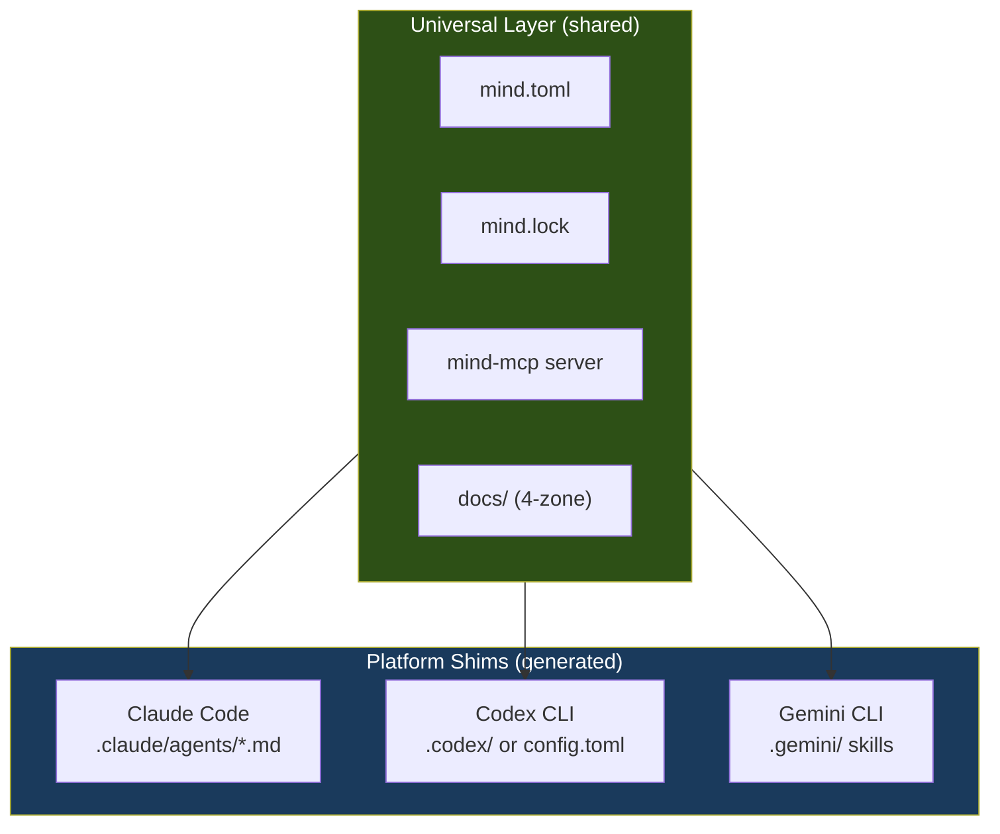

Agent prompt files become thin delegation layers that instruct the agent to call MCP tools. Switching platforms means generating a new shim — core behavior remains identical.

```bash
mind scaffold --platform claude   # Generate .claude/ shims
mind scaffold --platform codex    # Generate .codex/ shims
mind scaffold --platform all      # Generate for all platforms
```

### 18.3 Hook System

Two-tier extensibility:

| Tier | Format | Use Case | Sandboxing |
|------|--------|----------|:---:|
| **Hooks** | Bash scripts | Pre/post workflow, pre-commit, validation | OS-level |
| **Plugins** | WASM modules | Custom gates, specialist logic, report generators | WASM sandbox |

**Lifecycle hooks**: `pre-workflow`, `post-classify`, `pre-agent`, `post-agent`, `pre-gate`, `post-gate`, `post-workflow`

**Git hooks**: `pre-commit`, `post-merge`, `post-checkout`

---

## 19. Operational Layer

### 19.1 `.mind/` Runtime Directory

Local, `.gitignore`d, disposable:

| Directory | Purpose | Retention |
|-----------|---------|-----------|
| `cache/summaries/` | Pre-computed document summaries (~200 tokens each) | Rebuilt on demand |
| `cache/hashes.json` | File hash cache for incremental lock sync | Rebuilt on demand |
| `logs/runs/` | Per-workflow JSONL event streams | Last 20 runs |
| `logs/gates/` | Structured gate result snapshots | Active + last completed iteration |
| `logs/audit.jsonl` | Append-only audit trail | Rotated at threshold |
| `outputs/{type}/` | Captured build/test/lint outputs with `latest` symlink | Last 5 per type |
| `tmp/` | Agent scratch (PLAN.md, WIP.md, LEARNINGS.md) | Deleted on workflow completion |
| `hooks/` | Generated git hook scripts | Regenerated on `mind init` |

### 19.2 Performance Architecture

| Operation | Target | Strategy |
|-----------|--------|----------|
| File existence check | ~1μs | `std::fs::metadata` |
| Mtime check | ~1μs | `metadata().modified()` |
| SHA-256 hash | ~50μs per 10KB | Streaming, skip via mtime fast path |
| `mind lock` (50 artifacts) | < 500ms | Incremental: mtime → skip 95% of hashes |
| `mind status` | < 100ms | Read cached lock file |
| Pre-commit hook | < 5ms | `mind lock --verify` (lock freshness only) |

### 19.3 Multi-Language Support

The framework is language-agnostic. `mind.toml` declares commands, not implementations:

```toml
# Python project                    # Rust project
[project.commands]                  [project.commands]
test = "pytest -v"                  test = "cargo test"
lint = "ruff check src/"            lint = "cargo clippy"
```

The CLI executes configured commands and captures results. Gate verdicts are based on exit codes, not language-specific parsing.

---

## 20. Implementation Roadmap

### 20.1 Phased Delivery

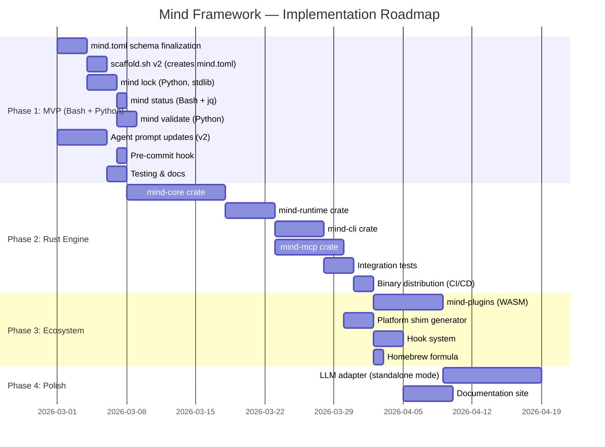

### 20.2 Phase 1: MVP — Validate the Design (2-3 weeks)

| Deliverable | Language | Lines | Purpose |
|-------------|:---:|:---:|---------|
| `mind.toml` JSON Schema | JSON | ~200 | Validation, editor support |
| `scaffold.sh` v2 | Bash | ~500 | Creates `mind.toml`, 4-zone docs, `.mind/` |
| `mind` dispatcher | Bash | ~80 | Subcommand routing |
| `mind-lock.py` | Python | ~200 | Lock file generation (stdlib only) |
| `mind-validate.py` | Python | ~100 | Invariant checks |
| `mind-graph.py` | Python | ~120 | Dependency graph text output |
| `pre-commit` hook | Bash | ~15 | `mind lock --verify` |
| Agent prompt updates | Markdown | ~300 delta | Manifest-aware prompts |
| **Total** | | **~1,500** | |

### 20.3 Phase 2: Rust Engine — Performance & Integration (5-7 weeks)

| Crate | Purpose | Estimated Lines |
|-------|---------|:---:|
| `mind-core` | Manifest, lock, graph, URI, budget, reconcile, workflow | ~3,000 |
| `mind-runtime` | Filesystem, git, process, container, logging | ~1,500 |
| `mind-cli` | CLI commands, output formatting | ~1,200 |
| `mind-mcp` | MCP server with 9 tools + 3 resources | ~800 |
| Tests | Unit + integration | ~2,000 |
| **Total** | | **~8,500** |

### 20.4 Phase 3: Ecosystem (3-4 weeks)

Plugin system (WASM), multi-platform shims, distribution channels (Homebrew, direct download), lifecycle hooks.

### 20.5 Phase 4: Polish (6-8 weeks, optional)

Standalone mode with LLM adapter, documentation site, community onboarding.

### 20.6 Effort Summary

| Phase | Duration | Cumulative Value |
|:---:|:---:|---------|
| **Phase 1** | 2-3 weeks | Working manifest system, validated design |
| **Phase 2** | 5-7 weeks | Fast CLI + MCP server, agent-agnostic |
| **Phase 3** | 3-4 weeks | Plugins, multi-platform, distribution |
| **Phase 4** | 6-8 weeks | Standalone mode, documentation (optional) |

### 20.7 Prioritized Focus Areas

| Priority | Area | Rationale |
|:--------:|------|-----------|
| **P0** | Agent prompt updates (manifest awareness, domain model, micro-gates, git integration) | Core value — agents become manifest-aware |
| **P0** | 4-zone documentation structure + documentation convention update | Foundation for all artifact management |
| **P0** | `mind.toml` schema finalization + scaffold integration | Enables Level 1 adoption |
| **P1** | `mind lock` (Python MVP, mtime fast path) | Enables Level 3 reconciliation |
| **P1** | `mind gate` (structured gate runner with output capture) | Enables deterministic quality gates |
| **P1** | `mind status` (project state dashboard) | Primary user-facing command |
| **P2** | Specialist mechanism + contract | Extensibility for domain-specific needs |
| **P2** | Git discipline convention update | Formalizes git workflow |
| **P3** | Rust CLI rewrite | Performance and distribution |
| **P3** | MCP server implementation | Agent-agnostic integration |
| **P4** | WASM plugin system | Advanced extensibility (deferred) |

---

## 21. Risk Assessment

### 21.1 Architectural Risks

| # | Risk | Probability | Impact | Mitigation |
|---|------|:-:|:-:|-----------|
| R-01 | Manifest becomes maintenance burden | Medium | Medium | Orchestrator maintains most sections automatically; human edits only `[project]` + `[profiles]` |
| R-02 | Agent CLIs build native manifest support | Medium | High | Framework's value is the design, not just tooling; pivot to spec + reference implementation |
| R-03 | MCP protocol changes break integration | Low | Medium | Pin to MCP spec version; adapter layer isolates changes |
| R-04 | Domain model becomes over-engineered ritual | Medium | Medium | Template is optional; created only for NEW_PROJECT and structural ENHANCEMENT |
| R-05 | Python MVP performance insufficient | Medium | Low | Lock sync may exceed 500ms at 100+ artifacts; Rust CLI resolves this |
| R-06 | Lock file diverges between team members | Low | Medium | Pre-commit hook runs `mind lock --verify`; CI validates lock freshness |
| R-07 | Rust learning curve limits contributors | Medium | High | Phase 1 in Python validates design first; Go identified as fallback |

### 21.2 Inferred Decisions Requiring Validation

| Decision | Validation Needed |
|----------|-------------------|
| Python 3.11+ adequate for MVP performance | Run `mind lock` on 50+ artifact project; verify < 500ms |
| Mtime fast path eliminates 95% of hash computations | Measure in real workflows across multiple sessions |
| Context budgeting reduces token usage by 40%+ | Compare agent token consumption v1 vs v2 |
| MCP server can replace direct CLI invocation | Test with all three target agent CLIs |

### 21.3 Open Questions

| Item | Impact | Validation Approach |
|------|--------|-------------------|
| Optimal `context-budget` defaults per agent | Medium | Measure token consumption across 3+ real projects |
| Lock sync performance at scale (100+ artifacts) | Medium | Benchmark with synthetic large project |
| Session resume reliability | Medium | Test split workflows end-to-end |
| `mind.toml` growth limits for large monorepos | Medium | Generate synthetic large manifest |
| Rust vs Go as long-term CLI language | Medium | Assess contributor availability after Phase 2 |

---

## 22. Design Decisions & Rationale

### 22.1 Adopted

| Decision | Rationale |
|----------|-----------|
| TOML manifest format | Unambiguous types, section-navigable, Cargo precedent. YAML's implicit coercion is a governance risk. |
| `doc:` URI scheme + `@`-shorthand | Formal URIs in data, ergonomic shorthand in prose. Path-independent references survive file moves. |
| Lock file as core (committed to git) | Upstream hash tracking enables reactive staleness detection — the key NixOS innovation. |
| Reconciliation as orchestrator behavior | Orchestrator reads manifest + lock → computes delta → dispatches. |
| Hybrid incremental CLI path | Python MVP validates design; Rust CLI follows after real-project validation. |
| Layered adoption (L0-L3) | Framework works without manifest. Zero barrier to entry. |
| Profiles (NixOS modules) | Clean modularity. `backend-api` activates a coherent bundle. |
| 4-zone documentation | Separates stable specs from volatile state from immutable history from reference material. |
| Domain model artifact | Eliminates the #1 backend quality gap. Structured entity + business rule registry. |
| Deterministic gates before reviewer | Build/lint/test failures should never reach the reviewer. |
| Evidence-based review (no scores) | `git diff` + test results > self-assessed scores. |
| 7 core agents (unchanged count) | Current agents cover all workflow needs. Each additional agent adds permanent token cost. |

### 22.2 Explicitly Rejected

| Proposal | Why Rejected |
|----------|-------------|
| YAML format | Implicit typing (`NO` → `false`, `3.10` → `3.1`), whitespace-sensitivity |
| Content-addressable IDs (CIDs) | Git already provides content-addressable storage |
| `.agent/` directory alongside `.claude/` | Two knowledge locations confuses agents |
| 8 slash commands | `/discover` + `/workflow` sufficient. Command proliferation adds surface area. |
| Numerical quality scores | Self-assessed scores are unreliable. Evidence-based review is superior. |
| `documenter`, `deployer`, `researcher` agents | 7 agents cover all needs. Each addition adds permanent token cost. |
| Codegen pipeline from manifest | Deterministic configuration of probabilistic agents provides false confidence |
| Web dashboard (early phases) | Product-level feature for a framework with zero external adoption. Premature. |

---

## 23. Migration Strategy

### 23.1 New Projects

```bash
./scaffold.sh /path/to/project --with-framework
./scaffold.sh /path/to/project --with-framework --backend
```

### 23.2 Existing Projects (v1 → v2)

All agent changes are additive. Agents check both old and new paths during transition.

```bash
mkdir -p docs/spec docs/state docs/knowledge
[ -f docs/project-brief.md ] && mv docs/project-brief.md docs/spec/
[ -f docs/requirements.md ]  && mv docs/requirements.md docs/spec/
[ -f docs/current.md ]       && mv docs/current.md docs/state/
touch docs/knowledge/glossary.md
./install.sh /path/to/project --update
```

### 23.3 Compatibility Period

During transition, agents check both paths:
- `docs/requirements.md` AND `docs/spec/requirements.md`
- `docs/current.md` AND `docs/state/current.md`

Manifest adoption is purely additive — it never gates basic framework functionality.

---

## Appendix A: Domain Model Template

```markdown
# Domain Model

## Entity Registry
| Entity | Type | Description | Owned By |
|--------|------|-------------|----------|
| {name} | Aggregate / Entity / Value Object | {what it represents} | {bounded context} |

## Relationship Map
| From | Relationship | To | Cardinality | Constraint |
|------|-------------|-----|-------------|-----------|

## Business Rules Registry
| ID | Rule | Entities | Enforcement | Priority |
|----|------|----------|-------------|----------|
| BR-1 | {natural language rule} | {affected} | Domain / Application / Database | Critical / Standard |

## State Machines
### {Entity}: {state machine name}
| Current State | Event | Next State | Guard | Side Effects |
|--------------|-------|-----------|-------|-------------|
```

## Appendix B: Convention Hierarchy

When rules conflict, this hierarchy resolves:

1. **User instruction** (explicit override)
2. **Project docs** (`docs/spec/`, `docs/knowledge/`, project `CLAUDE.md`)
3. **Codebase patterns** (existing code conventions)
4. **Framework conventions** (`conventions/*.md`)
5. **Best practices** (community standards)

## Appendix C: Research Cross-Reference

| Research Concept | Mind v2 Implementation |
|-----------------|----------------------|
| ASDLC Three Layers (Context/Agents/Gates) | Context = `docs/spec/` + `docs/knowledge/`; Agents = `.claude/agents/`; Gates = deterministic + reviewer |
| Spec-Driven Development | Analyst always produces spec artifacts before developer. Domain model enforces this. |
| Context as Code | All agent prompts, conventions, templates are version-controlled markdown. |
| State vs Delta | `docs/spec/` = State (how system works); `docs/iterations/` = Delta (what changed) |
| NixOS declarative model | `mind.toml` declares desired state; lock file captures actual; orchestrator reconciles. |
| NixOS generations | `[[generations]]` tracks strategic state transitions. |
| NixOS modules | `[profiles]` activates coherent bundles. |
| Reactive rebuilds | Staleness propagation through dependency graph — minimum rebuild set. |
| Deterministic + Probabilistic Gates | Build/lint/test (deterministic) before reviewer (probabilistic). |
| Sequential + Supervisor topology | Orchestrator as supervisor dispatching sequential chain with conditional architect. |
| Critic Loop | Reviewer as critic with max 2 targeted retries. |

---

*This document is the unified, canonical specification for the Mind Framework v2. It consolidates the canonical design, the final specification, and the implementation architecture into one authoritative reference. It supersedes all prior individual architecture documents for the purpose of system design, backlog creation, and implementation planning.*
