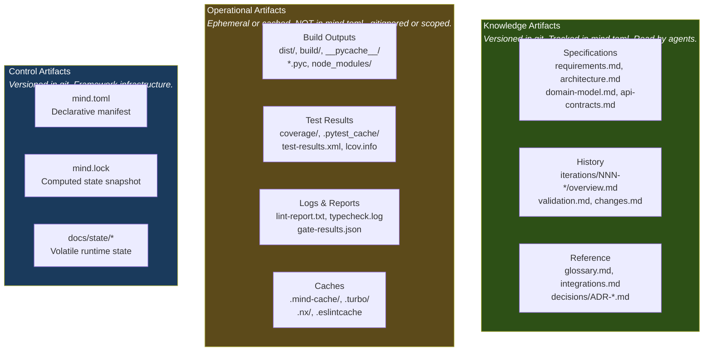
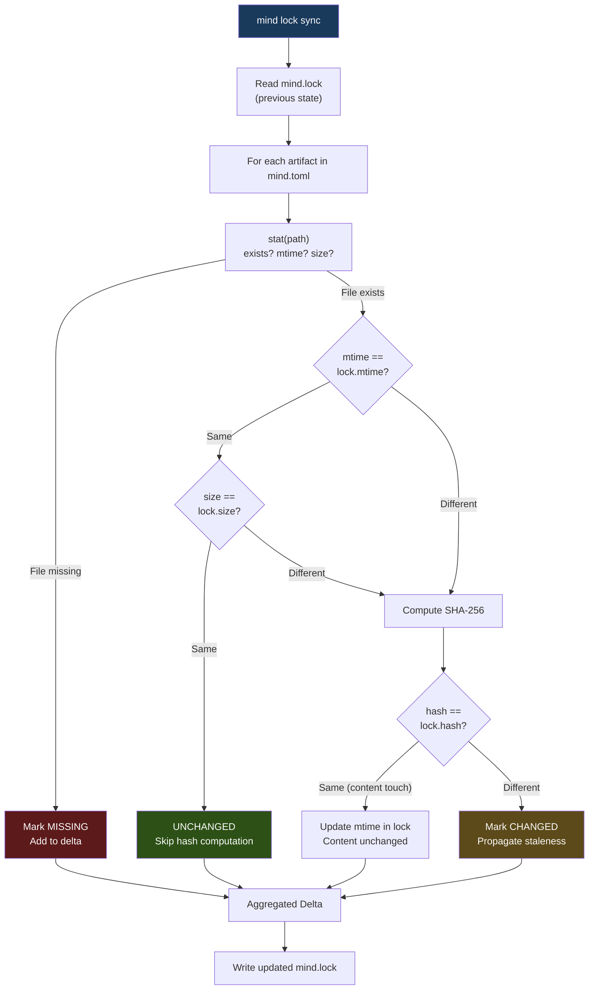
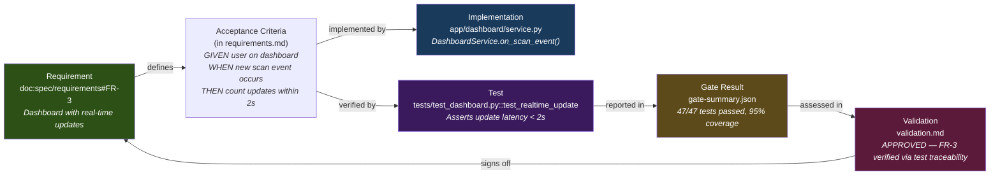
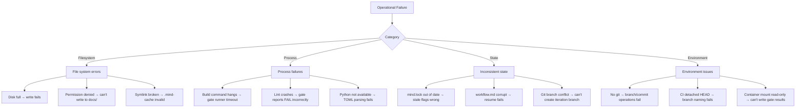
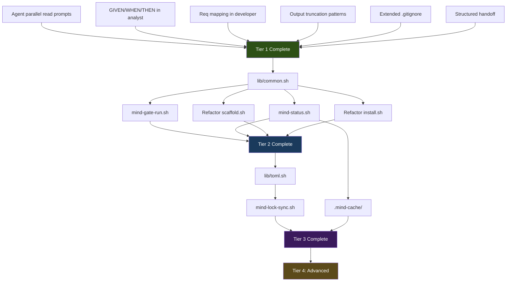

# Operational Layer Design — File Indexing, Performance & Runtime Management

> **Date**: 2026-02-24  
> **Scope**: Deep-dive into the operational layer below the conceptual architecture defined in `MIND-FRAMEWORK.md`  
> **Focus**: Artifact indexing, CLI performance, script architecture, output management, traceability, containers, session persistence  
> **Audience**: Framework implementer

---

## Table of Contents

1. [Problem Statement](#1-problem-statement)
2. [Artifact Taxonomy](#2-artifact-taxonomy)
3. [File Index Architecture](#3-file-index-architecture)
4. [Operational Output Management](#4-operational-output-management)
5. [Script Architecture](#5-script-architecture)
6. [CLI Performance Patterns](#6-cli-performance-patterns)
7. [Container & Environment Strategy](#7-container--environment-strategy)
8. [Session Data Persistence](#8-session-data-persistence)
9. [End-to-End Traceability](#9-end-to-end-traceability)
10. [Failure Modes & Recovery](#10-failure-modes--recovery)
11. [Implementation Priorities](#11-implementation-priorities)

---

## 1. Problem Statement

`MIND-FRAMEWORK.md` defines a clean conceptual architecture: `mind.toml` declares intent, `mind.lock` captures state, agents reconcile the gap. But the specification stops at the *what* and leaves open the *how* of actual filesystem interaction.

In a CLI environment (Claude Code, Gemini CLI, Aider, any agent-in-terminal), every interaction pays a cost:

| Operation | Cost | Frequency | Bottleneck Risk |
|-----------|------|-----------|-----------------|
| Read file from disk | ~1 tool call, 500-2000 tokens output | 5-20× per agent | Token budget exhaustion |
| Scan directory tree | ~1 tool call, variable tokens | 1-3× per agent | Repeated redundant scans |
| Compute file hash | ~1 Bash call | 1× per artifact per sync | O(N) sync time for large projects |
| Run build/test/lint | ~1 Bash call, highly variable output | 1-4× per workflow | Long execution + output truncation |
| Write file | ~1 tool call | 2-8× per agent | Low (but git state matters) |
| Parse mind.toml | ~1 read | 1× per agent | Repeated per agent dispatch |

**The question this document answers**: How does the framework minimize these costs while maximizing traceability, without introducing tooling dependencies that don't exist yet?

### 1.1 Current Gaps

After auditing the existing scripts (`scaffold.sh`: 410 lines, `install.sh`: ~130 lines, `bootstrap-asdlc.sh`: 762 lines) and agent definitions:

| Gap | Impact | Where it manifests |
|-----|--------|--------------------|
| **G-OP-01**: No artifact taxonomy | Agents treat build logs and spec docs identically — no lifecycle distinction | All agents |
| **G-OP-02**: No incremental file scanning | Orchestrator re-scans entire workspace on every workflow start | `orchestrator.md` Step 1 |
| **G-OP-03**: No structured output capture | Build/test/lint outputs are ephemeral — only pass/fail reaches the review | `reviewer.md` Deterministic Gates |
| **G-OP-04**: Monolithic scripts with no reuse | `scaffold.sh` (410 lines) and `bootstrap-asdlc.sh` (762 lines) share zero functions | Root scripts |
| **G-OP-05**: No session context cache | Each agent re-reads `mind.toml`, `requirements.md`, etc. from scratch | Every agent handoff |
| **G-OP-06**: No container/environment awareness | Path resolution assumes local filesystem; no devcontainer/remote support | `scaffold.sh`, `install.sh` |
| **G-OP-07**: No traceability from gate result → artifact → requirement | Reviewer knows pass/fail but can't trace *which test* proved *which requirement* | `reviewer.md` |
| **G-OP-08**: No `.gitignore` strategy for operational outputs | Build caches, coverage reports, and lock files lack ignore rules | `.gitignore` in `scaffold.sh` |
| **G-OP-09**: No parallel read strategy for agents | Agents read 5-8 files sequentially at startup; no guidance on batching | All agents "First Action" |
| **G-OP-10**: No staleness shortcut | mind.lock concept requires full hash recomputation; no mtime-based fast path | Lock file sync |

---

## 2. Artifact Taxonomy

The framework manages two fundamentally different categories of artifacts. Conflating them creates noise at every layer — git history, manifest size, agent token budgets, and human cognitive load.

### 2.1 Classification



### 2.2 Artifact Lifecycle Rules

| Category | Git Tracked | In mind.toml | In mind.lock | Cleanup Policy |
|----------|:-----------:|:------------:|:------------:|----------------|
| **Knowledge — Spec** | Yes | Yes (document registry) | Yes (hash + staleness) | Never auto-deleted |
| **Knowledge — History** | Yes | Yes (iteration registry) | No (immutable, no staleness) | Append-only |
| **Knowledge — Reference** | Yes | Yes (document registry) | Yes (hash) | Manual |
| **Control — Manifest** | Yes | Self | — | Orchestrator-managed |
| **Control — Lock** | Yes | — | Self | Regenerated on sync |
| **Control — State** | Yes | Optional | No | Overwritten per session |
| **Operational — Build** | No | No | No | Cleaned by build tool or `mind clean` |
| **Operational — Test** | No | No | No | Overwritten per run |
| **Operational — Logs** | Scoped | No | No | Rotated (keep last N) |
| **Operational — Cache** | No | No | No | Invalidated on manifest change |

### 2.3 .gitignore Strategy

Current `scaffold.sh` ignores only planning skills WIP files. The operational layer needs comprehensive ignore rules:

```gitignore
# ── Mind Framework — Operational Artifacts ──

# Planning skills (temporary)
docs/iterations/**/WIP.md
docs/iterations/**/PLAN.md
docs/iterations/**/LEARNINGS.md

# Operational outputs (ephemeral)
.mind-cache/
docs/state/gate-results/
*.gate-log

# Build artifacts (tool-specific — project adds its own)
# dist/
# build/
# __pycache__/

# Test artifacts (tool-specific)
# coverage/
# .pytest_cache/
# test-results.xml
```

The `.gitignore` template includes commented-out sections for common stacks. `scaffold.sh --backend` uncomments the Python-specific lines; `scaffold.sh --frontend` uncomments the Node.js-specific lines.

---

## 3. File Index Architecture

### 3.1 The Problem with Naive Scanning

The current orchestrator (Step 1) does:

```
1. Check if docs/ directory exists
2. Check if source code exists (src/, lib/, app/, ...)
3. Read docs/current.md if it exists
4. Note the tech stack from package.json, go.mod, ...
```

At Level 3 adoption (full reconciliation), the lock file sync does:

```
For each document in mind.toml:
  1. Check if file exists on disk
  2. Compute SHA-256 hash
  3. Compare hash against recorded hash
  4. If changed → mark downstream as stale
```

For a project with 30 registered documents and 10 iterations, this is 40+ file reads and 40+ hash computations on every workflow start. That's acceptable on a local SSD but becomes painful when:

- The project has 100+ registered documents (large projects)
- The agent runs in a constrained environment (remote, container, rate-limited API)
- The sync runs repeatedly (e.g., after each agent completes)

### 3.2 Two-Phase Index with mtime Fast Path

**Observation**: Most files don't change between syncs. We can use filesystem modification time (mtime) as a cheap pre-filter, falling back to SHA-256 only when mtime has changed.



**Performance characteristics**:

| Scenario | Naive (hash all) | Two-phase (mtime + hash) |
|----------|:-:|:-:|
| 40 files, 0 changed | 40 hash ops | 40 stat ops, 0 hash ops |
| 40 files, 3 changed | 40 hash ops | 40 stat ops, 3 hash ops |
| 40 files, all changed | 40 hash ops | 40 stat ops, 40 hash ops |

stat() is ~100× cheaper than SHA-256 on a typical file. The fast path eliminates hash computation for ~95% of files in a normal workflow.

### 3.3 Lock File Extended Schema

The lock file gains `mtime` and `size` fields for the fast path:

```json
{
  "lockVersion": 2,
  "generatedAt": "2026-02-24T14:35:00Z",
  "generation": 4,
  "syncStrategy": "mtime-hash",
  "resolved": {
    "doc:spec/requirements": {
      "path": "docs/spec/requirements.md",
      "exists": true,
      "hash": "sha256:d4e7f0a3",
      "size": 5231,
      "mtime": "2026-02-24T09:00:00Z",
      "stale": false,
      "upstreamHashes": {
        "doc:spec/project-brief": "sha256:a3f2b1c8"
      }
    }
  }
}
```

### 3.4 mind.lock as a Bash Implementation

Since the framework explicitly rejects a dedicated CLI tool (see `MIND-FRAMEWORK.md` §13.2), the lock file sync must be implementable as a Bash script callable by agents via the Bash tool.

```bash
#!/usr/bin/env bash
# mind-lock-sync.sh — Regenerate mind.lock from mind.toml + filesystem state
# Called by orchestrator at workflow start and after each agent completes.
#
# Usage: .claude/bin/mind-lock-sync.sh [--full | --fast]
#   --fast  (default) mtime-based fast path, hash only changed files
#   --full  Recompute all hashes (for integrity verification)

set -euo pipefail

PROJECT_ROOT="$(git rev-parse --show-toplevel 2>/dev/null || pwd)"
MANIFEST="$PROJECT_ROOT/mind.toml"
LOCKFILE="$PROJECT_ROOT/mind.lock"

if [ ! -f "$MANIFEST" ]; then
    echo '{"error": "No mind.toml found"}' >&2
    exit 1
fi

# ... (TOML parsing + stat + hash logic)
# Implementation detail: use awk/sed for TOML parsing (no external deps)
# or require Python 3 (available on virtually all dev machines) for robust parsing
```

**Dependency decision**: Bash-only or Python-assisted?

| Approach | Pros | Cons |
|----------|------|------|
| **Pure Bash** (awk/sed for TOML) | Zero dependencies, works in any container | TOML parsing is fragile; nested tables are painful |
| **Python 3 + tomllib** (Python 3.11+) | Robust TOML parsing via stdlib; JSON output trivial | Requires Python 3.11+; won't work in minimal containers |
| **Python 3 + tomli** (any Python 3) | Works on Python 3.7+; `pip install tomli` fallback | Extra dependency, but tiny |

**Recommendation**: Python 3 with `tomllib` (3.11+) and `tomli` as fallback for older Pythons. Python is a near-universal dependency on modern dev machines and CI environments. Pure Bash TOML parsing is a maintenance hazard for nested structures like `[documents.spec.requirements]`.

### 3.5 Incremental Sync vs Full Sync

| Trigger | Sync Type | What Happens |
|---------|-----------|-------------|
| Workflow start | Fast (mtime) | Detect changes since last sync |
| After agent completes | Fast (mtime) | Update hashes for newly written files |
| After `mind.toml` edit | Full | Detect new/removed artifacts; recompute graph |
| Manual / integrity check | Full | Verify all hashes from scratch |
| Lock file missing | Full | Generate from scratch |

### 3.6 Artifact Lookup by URI

The lock file enables O(1) artifact lookup by canonical URI. When an agent needs `doc:spec/requirements`, the resolution path is:

```
1. Look up "doc:spec/requirements" in mind.lock → path = "docs/spec/requirements.md"
2. Check exists/stale flags → decide if the file is trustworthy
3. Read the file at the resolved path
```

Without mind.lock, the agent must:

```
1. Read mind.toml, parse TOML, find the [documents.spec.requirements] section
2. Extract path = "docs/spec/requirements.md"
3. Read the file at that path
```

The lock file serves as a **pre-computed index** — JSON is orders of magnitude cheaper to parse than TOML in most contexts, and the flat key-value structure enables direct lookup.

For Level 0-1 projects (no lock file), agents fall back to convention-based path resolution:

```
doc:spec/{name} → docs/spec/{name}.md
doc:state/{name} → docs/state/{name}.md
doc:iteration/{id} → docs/iterations/{id}/
doc:knowledge/{name} → docs/knowledge/{name}.md
```

This convention means URI resolution works even without parsing `mind.toml`.

---

## 4. Operational Output Management

### 4.1 The Ephemeral Output Problem

When the deterministic gate runs `pytest --cov=app`, the output looks like:

```
============================== test session starts ==============================
collected 47 items

tests/test_inventory.py ....                                            [ 8%]
tests/test_barcode.py ......                                            [21%]
...
---------- coverage: platform linux, python 3.12.0 ----------
Name                      Stmts   Miss  Cover
---------------------------------------------
app/main.py                  23      2    91%
app/inventory/service.py     45      3    93%
...
TOTAL                       234     12    95%
============================== 47 passed in 2.31s ==============================
```

This output is consumed by the reviewer, judged as "tests pass", and then **lost forever**. It's not captured, not linked to the iteration, and not available for comparison in the next iteration.

### 4.2 Structured Gate Result Capture

Introduce a structured capture path for deterministic gate results:

```
docs/state/gate-results/
├── {iteration-id}/
│   ├── build.log               # Raw build output
│   ├── lint.log                # Raw lint output
│   ├── typecheck.log           # Raw type-check output
│   ├── test.log                # Raw test output
│   ├── coverage.json           # Structured coverage data (if available)
│   └── summary.json            # Parseable gate summary
```

The `summary.json` is the key artifact — a machine-readable gate result:

```json
{
  "iteration": "doc:iteration/004",
  "timestamp": "2026-02-24T15:30:00Z",
  "gates": {
    "build": {
      "command": "docker build -t inventory .",
      "exitCode": 0,
      "status": "PASS",
      "durationMs": 12340,
      "logFile": "build.log"
    },
    "lint": {
      "command": "ruff check .",
      "exitCode": 0,
      "status": "PASS",
      "durationMs": 890,
      "logFile": "lint.log",
      "findings": 0
    },
    "typecheck": {
      "command": "mypy app/",
      "exitCode": 0,
      "status": "PASS",
      "durationMs": 3200,
      "logFile": "typecheck.log"
    },
    "test": {
      "command": "pytest --cov=app --cov-report=json",
      "exitCode": 0,
      "status": "PASS",
      "durationMs": 2310,
      "logFile": "test.log",
      "testsRun": 47,
      "testsPassed": 47,
      "testsFailed": 0,
      "coverage": {
        "totalStatements": 234,
        "covered": 222,
        "percentage": 94.9,
        "reportFile": "coverage.json"
      }
    }
  },
  "overallStatus": "PASS",
  "totalDurationMs": 18740
}
```

### 4.3 Git Tracking Policy for Outputs

| Artifact | Git Tracked | Rationale |
|----------|:-:|-----------|
| `summary.json` | **Yes** (per iteration) | Machine-readable gate history. Small. High value for trending. |
| `*.log` | **No** | Verbose, ephemeral. Retained locally during the workflow only. |
| `coverage.json` | **Scoped** | Committed only on iteration completion, into iteration folder. |

On iteration completion, the orchestrator copies the final `summary.json` into the iteration folder:

```
docs/iterations/004-enhancement-barcode/
├── overview.md
├── changes.md
├── validation.md
└── gate-summary.json          # Archived from docs/state/gate-results/004/
```

This gives every iteration a permanent, queryable record of its gate results without bloating git with raw logs.

### 4.4 Output Truncation Strategy

CLI environments truncate command output (Claude Code: ~60KB). Long build/test runs can lose critical information at the tail. Agents should use defensive output patterns:

| Scenario | Current Risk | Mitigation |
|----------|-------------|------------|
| Large test suite output | Pass/fail summary truncated | `pytest --tb=short -q` (brief mode) or redirect to file + read tail |
| Build output for multi-stage Docker | Error at stage 3 lost beyond truncation | `docker build ... 2>&1 \| tee build.log && tail -50 build.log` |
| Lint with many findings | Final summary lost | `ruff check . --output-format=json > lint.log && cat lint.log \| python3 -c "import json,sys; d=json.load(sys.stdin); print(f'{len(d)} findings')"` |
| TypeScript type errors | Errors beyond truncation | `npx tsc --noEmit 2>&1 \| head -100` (first errors are usually most actionable) |

**Pattern**: Always redirect to file, then read the relevant portion:

```bash
# Anti-pattern: raw execution, risk truncation
pytest --cov=app

# Recommended: capture + summarize
pytest --cov=app --cov-report=json -q 2>&1 | tee docs/state/gate-results/004/test.log
tail -20 docs/state/gate-results/004/test.log
```

This should be codified in the orchestrator's deterministic gate execution protocol, not left to individual agent discretion.

### 4.5 Gate Runner Script

The deterministic gate execution is repetitive and error-prone when done ad-hoc by agents. Extract it into a reusable script:

```bash
#!/usr/bin/env bash
# mind-gate-run.sh — Execute deterministic quality gates with structured output
#
# Usage: .claude/bin/mind-gate-run.sh <iteration-id>
# Reads commands from mind.toml [project.commands]
# Writes results to docs/state/gate-results/<iteration-id>/

set -euo pipefail

ITERATION_ID="${1:?Usage: mind-gate-run.sh <iteration-id>}"
PROJECT_ROOT="$(git rev-parse --show-toplevel 2>/dev/null || pwd)"
OUTPUT_DIR="$PROJECT_ROOT/docs/state/gate-results/$ITERATION_ID"
MANIFEST="$PROJECT_ROOT/mind.toml"

mkdir -p "$OUTPUT_DIR"

# ── Parse commands from mind.toml ──

parse_toml_value() {
    # Extract a key from [project.commands] section
    local key="$1"
    # Lightweight: grep-based extraction for flat keys
    # Robust: delegate to Python if available
    if command -v python3 >/dev/null 2>&1; then
        python3 -c "
try:
    import tomllib
except ImportError:
    import tomli as tomllib
with open('$MANIFEST', 'rb') as f:
    m = tomllib.load(f)
print(m.get('project',{}).get('commands',{}).get('$key',''))
"
    else
        # Fallback: grep-based (fragile for complex TOML)
        sed -n '/\[project\.commands\]/,/\[/p' "$MANIFEST" \
            | grep "^${key}" \
            | head -1 \
            | sed 's/.*= *"\(.*\)"/\1/'
    fi
}

# ── Run gates ──

run_gate() {
    local name="$1"
    local cmd
    cmd="$(parse_toml_value "$name")"
    
    if [ -z "$cmd" ]; then
        echo "{\"gate\": \"$name\", \"status\": \"SKIPPED\", \"reason\": \"not configured\"}"
        return 0
    fi

    local log_file="$OUTPUT_DIR/${name}.log"
    local start_ms
    start_ms=$(date +%s%3N 2>/dev/null || date +%s)

    local exit_code=0
    eval "$cmd" > "$log_file" 2>&1 || exit_code=$?

    local end_ms
    end_ms=$(date +%s%3N 2>/dev/null || date +%s)
    local duration=$(( end_ms - start_ms ))

    local status="PASS"
    [ "$exit_code" -ne 0 ] && status="FAIL"

    echo "{\"gate\": \"$name\", \"command\": \"$cmd\", \"exitCode\": $exit_code, \"status\": \"$status\", \"durationMs\": $duration, \"logFile\": \"${name}.log\"}"
    
    # Show tail of output for context
    echo "── $name ($status) ──" >&2
    tail -10 "$log_file" >&2
    echo "" >&2

    return $exit_code
}

# ── Execute in order, stop on first failure ──

RESULTS=()
OVERALL="PASS"
TOTAL_START=$(date +%s%3N 2>/dev/null || date +%s)

for gate in build lint typecheck test; do
    result="$(run_gate "$gate")" || {
        OVERALL="FAIL"
        RESULTS+=("$result")
        break
    }
    RESULTS+=("$result")
done

TOTAL_END=$(date +%s%3N 2>/dev/null || date +%s)
TOTAL_DURATION=$(( TOTAL_END - TOTAL_START ))

# ── Write summary.json ──

{
    echo "{"
    echo "  \"iteration\": \"$ITERATION_ID\","
    echo "  \"timestamp\": \"$(date -u +%Y-%m-%dT%H:%M:%SZ)\","
    echo "  \"overallStatus\": \"$OVERALL\","
    echo "  \"totalDurationMs\": $TOTAL_DURATION,"
    echo "  \"gates\": ["
    local first=true
    for r in "${RESULTS[@]}"; do
        [ "$first" = true ] && first=false || echo "    ,"
        echo "    $r"
    done
    echo "  ]"
    echo "}"
} > "$OUTPUT_DIR/summary.json"

echo ""
echo "Gate results: $OVERALL (${TOTAL_DURATION}ms)"
echo "Details: $OUTPUT_DIR/summary.json"

[ "$OVERALL" = "PASS" ] && exit 0 || exit 1
```

The orchestrator calls this instead of running individual commands:

```markdown
### Deterministic Gate Execution
Run: `.claude/bin/mind-gate-run.sh {iteration-id}`
If exit code is 0 → proceed to reviewer.
If exit code is non-zero → read summary.json, identify failing gate, return to developer with the specific log file content.
```

---

## 5. Script Architecture

### 5.1 Current State Assessment

| Script | Lines | Reusable Functions | Error Recovery | Idempotent |
|--------|:-----:|:------------------:|:--------------:|:----------:|
| `scaffold.sh` | 410 | 0 | `set -euo pipefail` only | Yes (file-exists checks) |
| `install.sh` | ~130 | 1 (`copy_file`) | `set -euo pipefail` only | Yes (file-exists checks) |
| `bootstrap-asdlc.sh` | 762 | 0 | `set -e` only | No (always overwrites) |

**Issues**:
- `scaffold.sh` and `install.sh` are nearly correct in structure but share zero code (both do mkdir + copy + template creation).
- `bootstrap-asdlc.sh` is a reference implementation from the ASDLC proposal, not part of v2, but its 762 lines demonstrate the anti-pattern: monolithic scripts that rewrite everything inline.
- No shared library of common operations (colored output, safe file creation, TOML reading, git helpers).

### 5.2 Proposed Script Organization

```
mind-framework/
├── scaffold.sh                 # Entry point (thin — delegates to lib)
├── install.sh                  # Entry point (thin — delegates to lib)
│
└── lib/                        # Shared Bash library
    ├── common.sh               # Colors, logging, path resolution, guard functions
    ├── fs.sh                   # Safe file creation, directory scaffolding, template rendering
    ├── git.sh                  # Branch creation, commit helpers, merge-base detection
    ├── toml.sh                 # TOML key extraction (grep-based fallback + Python path)
    └── manifest.sh             # mind.toml reading, mind.lock sync, artifact resolution
```

Installed into projects as:

```
.claude/
├── bin/
│   ├── mind-lock-sync.sh      # Lock file regeneration
│   ├── mind-gate-run.sh       # Deterministic gate execution
│   └── mind-status.sh         # Project status summary (for agent context loading)
└── lib/
    ├── common.sh
    ├── fs.sh
    └── toml.sh
```

### 5.3 Shared Library: `lib/common.sh`

```bash
#!/usr/bin/env bash
# common.sh — Shared utilities for Mind Framework scripts

# ── Colors (only if terminal supports them) ──
if [ -t 1 ] && command -v tput >/dev/null 2>&1; then
    RED=$(tput setaf 1)
    GREEN=$(tput setaf 2)
    YELLOW=$(tput setaf 3)
    BLUE=$(tput setaf 4)
    RESET=$(tput sgr0)
    BOLD=$(tput bold)
else
    RED="" GREEN="" YELLOW="" BLUE="" RESET="" BOLD=""
fi

log_info()  { echo "${BLUE}[info]${RESET}  $*"; }
log_ok()    { echo "${GREEN}[ok]${RESET}    $*"; }
log_warn()  { echo "${YELLOW}[warn]${RESET}  $*" >&2; }
log_error() { echo "${RED}[error]${RESET} $*" >&2; }
log_step()  { echo "${BOLD}── $* ──${RESET}"; }

# ── Project root resolution ──
find_project_root() {
    git rev-parse --show-toplevel 2>/dev/null || pwd
}

# ── Guard: require command ──
require_cmd() {
    local cmd="$1"
    command -v "$cmd" >/dev/null 2>&1 || {
        log_error "Required command not found: $cmd"
        exit 1
    }
}

# ── Safe file creation (idempotent) ──
create_if_missing() {
    local path="$1"
    local content="$2"
    if [ ! -f "$path" ]; then
        mkdir -p "$(dirname "$path")"
        printf '%s' "$content" > "$path"
        log_ok "created $path"
        return 0
    else
        return 1  # Already existed
    fi
}

# ── Copy with update mode ──
copy_with_mode() {
    local src="$1"
    local dst="$2"
    local mode="${3:-skip}"  # skip | overwrite | merge
    
    case "$mode" in
        overwrite) cp "$src" "$dst" ;;
        skip)      [ ! -f "$dst" ] && cp "$src" "$dst" ;;
        *)         log_error "Unknown copy mode: $mode"; return 1 ;;
    esac
}
```

### 5.4 Thin Entry Points

With the shared library, `install.sh` becomes:

```bash
#!/usr/bin/env bash
set -euo pipefail
SCRIPT_DIR="$(cd "$(dirname "$0")" && pwd)"
source "$SCRIPT_DIR/lib/common.sh"

# ... (argument parsing unchanged) ...

log_step "Installing Mind Agent Framework"

# Copy framework directories
for dir in agents conventions skills commands; do
    mkdir -p "$CLAUDE_DIR/$dir"
    for f in "$SCRIPT_DIR/$dir"/*.md; do
        copy_with_mode "$f" "$CLAUDE_DIR/$dir/$(basename "$f")" "$UPDATE_MODE"
    done
done

# Copy bin/ and lib/ for operational support
mkdir -p "$CLAUDE_DIR/bin" "$CLAUDE_DIR/lib"
for f in "$SCRIPT_DIR"/lib/*.sh; do
    copy_with_mode "$f" "$CLAUDE_DIR/lib/$(basename "$f")" "$UPDATE_MODE"
done
# ... etc

log_ok "Framework installed to $CLAUDE_DIR/"
```

### 5.5 Idempotency Guarantees

Every script operation must be safe to run multiple times:

| Operation | Idempotency Method | Current | Proposed |
|-----------|-------------------|:-------:|:--------:|
| Create directory | `mkdir -p` | Yes | Yes |
| Create file from template | Guard: `[ ! -f ]` | Yes | Yes |
| Copy file | Guard: `[ ! -f ]` or `--update` flag | Yes | Yes |
| Append to `.gitignore` | Marker check: `grep -q "$MARKER"` | Yes | Yes |
| Create git branch | Guard: `git rev-parse --verify` | No (not impl'd) | Yes |
| Run gate commands | Overwrite previous output | N/A | Yes |
| Regenerate mind.lock | Always full write | N/A | Yes |

---

## 6. CLI Performance Patterns

### 6.1 Agent Context Prefetching

Every agent's "First Action" reads 5-8 files. In a CLI environment, each file read is a separate tool invocation. The framework should guide agents toward parallel reads.

**Current pattern** (sequential):
```
1. Read docs/spec/project-brief.md          → wait for response
2. Read docs/spec/requirements.md           → wait for response
3. Read docs/spec/architecture.md           → wait for response
4. Read docs/state/current.md               → wait for response
5. Read iteration overview.md               → wait for response
```

**Optimized pattern** (parallel batch):
```
Batch 1 (parallel): Read [project-brief.md, requirements.md, architecture.md, current.md, overview.md]
→ All responses arrive together, agent processes in one pass
```

This optimization lives in the **agent prompt**, not in tooling. The "First Action" section must explicitly instruct:

```markdown
### First Action: Load Context (Parallel)

Read ALL of the following files in a single batch (do not read sequentially):
- docs/spec/project-brief.md (if exists)
- docs/spec/requirements.md (if exists)  
- {analyst output for this iteration}

Then process the combined context before writing anything.
```

### 6.2 mind-status.sh — Context Summary for Agents

Instead of each agent reading 5+ files individually, provide a single summary script that an agent can invoke to get a structured context snapshot:

```bash
#!/usr/bin/env bash
# mind-status.sh — Generate a structured context summary for agent consumption
# Output: JSON summary of project state, suitable for a single read

set -euo pipefail
PROJECT_ROOT="$(git rev-parse --show-toplevel 2>/dev/null || pwd)"

echo "{"
echo "  \"project\": {"

# Git state
BRANCH=$(git branch --show-current 2>/dev/null || echo "unknown")
DIRTY=$(git status --porcelain 2>/dev/null | wc -l | tr -d ' ')
echo "    \"branch\": \"$BRANCH\","
echo "    \"uncommittedChanges\": $DIRTY,"

# Tech stack detection
STACK="unknown"
[ -f "$PROJECT_ROOT/package.json" ]    && STACK="node"
[ -f "$PROJECT_ROOT/pyproject.toml" ]  && STACK="python"
[ -f "$PROJECT_ROOT/Cargo.toml" ]      && STACK="rust"
[ -f "$PROJECT_ROOT/go.mod" ]          && STACK="go"
[ -f "$PROJECT_ROOT/pom.xml" ]         && STACK="java"
echo "    \"detectedStack\": \"$STACK\","

# Source code presence
HAS_SRC=false
for d in src lib app cmd pkg; do
    [ -d "$PROJECT_ROOT/$d" ] && HAS_SRC=true && break
done
echo "    \"hasSourceCode\": $HAS_SRC"
echo "  },"

# Documentation state
echo "  \"docs\": {"
for zone in spec state iterations knowledge; do
    count=0
    [ -d "$PROJECT_ROOT/docs/$zone" ] && count=$(find "$PROJECT_ROOT/docs/$zone" -name '*.md' 2>/dev/null | wc -l | tr -d ' ')
    echo "    \"$zone\": $count,"
done

# Active workflow
WORKFLOW="null"
if [ -f "$PROJECT_ROOT/docs/state/workflow.md" ]; then
    WORKFLOW="\"$(head -5 "$PROJECT_ROOT/docs/state/workflow.md" | grep 'Type' | sed 's/.*: //' || echo 'active')\""
fi
echo "    \"activeWorkflow\": $WORKFLOW"
echo "  },"

# Manifest state
echo "  \"manifest\": {"
if [ -f "$PROJECT_ROOT/mind.toml" ]; then
    echo "    \"exists\": true,"
    GEN=$(grep 'generation' "$PROJECT_ROOT/mind.toml" | head -1 | sed 's/.*= *//')
    echo "    \"generation\": ${GEN:-0},"
    LOCK_EXISTS=false
    [ -f "$PROJECT_ROOT/mind.lock" ] && LOCK_EXISTS=true
    echo "    \"lockExists\": $LOCK_EXISTS"
else
    echo "    \"exists\": false"
fi
echo "  },"

# Latest iteration
echo "  \"latestIteration\": "
LATEST=$(ls -1d "$PROJECT_ROOT"/docs/iterations/*/ 2>/dev/null | sort | tail -1)
if [ -n "$LATEST" ] && [ -d "$LATEST" ]; then
    NAME=$(basename "$LATEST")
    echo "    \"$NAME\""
else
    echo "    null"
fi

echo "}"
```

**Token cost comparison**:

| Method | Tool Calls | Tokens (approx) |
|--------|:----------:|:----------------:|
| Sequential file reads (5 files) | 5 | ~3,000-8,000 |
| Parallel file reads (5 files) | 5 (batched) | ~3,000-8,000 |
| `mind-status.sh` (one call) | 1 | ~200-400 |

The status script doesn't replace reading full documents — it provides a triage snapshot so the agent knows **which** documents to read. The orchestrator calls `mind-status.sh` first, then reads only the files relevant to the current request.

### 6.3 Context Cache: `.mind-cache/`

Between agent handoffs within a single workflow, the same files are re-read. A lightweight filesystem cache reduces redundant reads:

```
.mind-cache/
├── context.json                # Last mind-status.sh output
├── manifest-parsed.json        # mind.toml parsed to JSON (avoids re-parsing TOML)
└── session/
    ├── analyst-output.md       # Symlink to analyst's actual output (for quick reference)
    └── architect-output.md     # Symlink to architect's actual output
```

**Key constraint**: The cache is a performance optimization, not a source of truth. Any cache miss falls through to the actual file. The cache is invalidated:
- When `mind.toml` changes (mtime check)
- When an agent writes a new artifact
- When a new workflow starts

**Implementation**: Symlinks for document pointers (zero-copy). JSON for parsed TOML (one-time parse cost amortized across agents).

### 6.4 Token Budget Awareness

The framework should help agents estimate their context consumption:

```markdown
## Context Budget Guidelines

| Adoption Level | Approximate Framework Overhead |
|:---:|---:|
| L0 (no manifest) | ~2,500 tokens (CLAUDE.md + agent prompt) |
| L1 (manifest only) | ~3,000 tokens (L0 + mind.toml) |
| L2 (registry) | ~3,500 tokens (L1 + context cache) |
| L3 (full lock) | ~4,000 tokens (L2 + mind.lock summary) |

Agent context budgets (approximate per-agent):
| Agent | Framework Overhead | Project Context | Working Space | Total |
|-------|:--:|:--:|:--:|:--:|
| Orchestrator | ~3,000 | ~1,000 | ~2,000 | ~6,000 |
| Analyst | ~2,500 | ~3,000 | ~8,000 | ~13,500 |
| Developer | ~2,500 | ~5,000 | ~30,000+ | ~37,500+ |
| Reviewer | ~2,500 | ~3,000 | ~15,000 | ~20,500 |
```

**Actionable rule**: If mind.toml exceeds 200 lines (~2,000 tokens), agents should read only their relevant sections, not the full file. The `manifest-parsed.json` cache enables section-level extraction.

---

## 7. Container & Environment Strategy

### 7.1 Environment Matrix

| Environment | Path Root | Mind Scripts | Build/Test Commands | Git Available |
|-------------|-----------|:---:|:---:|:---:|
| **Local workstation** | `/home/user/project/` | Direct | Direct | Yes |
| **VS Code devcontainer** | `/workspaces/project/` | bind-mounted | In container | Yes |
| **GitHub Codespaces** | `/workspaces/project/` | In repo | In container | Yes |
| **Docker build context** | `/app/` or `/workspace/` | Copied | In container | Maybe |
| **CI/CD (GitHub Actions)** | `$GITHUB_WORKSPACE` | In repo | In runner | Yes |
| **Remote SSH** | Variable | Installed | Remote | Yes |

### 7.2 Path Resolution Strategy

All framework scripts should resolve paths relative to the git root, never absolute:

```bash
# CORRECT: git-relative resolution
PROJECT_ROOT="$(git rev-parse --show-toplevel 2>/dev/null || pwd)"
MANIFEST="$PROJECT_ROOT/mind.toml"

# INCORRECT: hardcoded or assumed paths
MANIFEST="/home/user/project/mind.toml"
MANIFEST="./mind.toml"  # depends on cwd
```

**Fallback when git is unavailable**: If `git rev-parse` fails (e.g., in a Docker build without `.git`), fall back to `pwd` and emit a warning. The framework degrades gracefully — all features work, but git-dependent operations (branch creation, diff, commit) are skipped.

### 7.3 Environment Detection

```bash
# In lib/common.sh
detect_environment() {
    if [ -f /.dockerenv ] || grep -q docker /proc/1/cgroup 2>/dev/null; then
        echo "container"
    elif [ -n "${CODESPACES:-}" ]; then
        echo "codespaces"
    elif [ -n "${REMOTE_CONTAINERS:-}" ] || [ -n "${VSCODE_REMOTE_CONTAINERS_SESSION:-}" ]; then
        echo "devcontainer"
    elif [ -n "${CI:-}" ] || [ -n "${GITHUB_ACTIONS:-}" ]; then
        echo "ci"
    elif [ -n "${SSH_CONNECTION:-}" ]; then
        echo "remote-ssh"
    else
        echo "local"
    fi
}
```

### 7.4 Environment-Specific Behaviors

| Behavior | Local | Container | CI | Remote |
|----------|:-----:|:---------:|:--:|:------:|
| Create git branches | Yes | Yes | No (detached HEAD) | Yes |
| Interactive prompts | Yes | Yes | No | Yes |
| Color output | Auto-detect | Auto-detect | No | Auto-detect |
| Write mind.lock | Yes | Yes | Yes (for cache) | Yes |
| Write gate logs | Yes | Yes | Yes | Yes |
| Open browser/editor | Yes | Maybe | No | No |

---

## 8. Session Data Persistence

### 8.1 The Handoff Problem

When the orchestrator splits a workflow across sessions (e.g., SESSION 1: analyst + architect → SESSION 2: developer + tester + reviewer), the second session starts cold. It must:

1. Reconstruct project context from disk
2. Understand what the prior session accomplished
3. Know where to resume in the workflow chain

Currently, `docs/state/workflow.md` captures only the workflow position. It doesn't capture:
- What the analyst discovered about the codebase (patterns, tech stack details)
- What decisions the architect made and why
- What the orchestrator observed during specialist injection
- The delta between manifest and lock (already computed, now lost)

### 8.2 Structured Handoff Artifact

Extend `docs/state/workflow.md` into a structured handoff document:

```markdown
# Workflow State

## Position
- **Type**: ENHANCEMENT
- **Descriptor**: barcode-scanning
- **Iteration**: docs/iterations/004-enhancement-barcode/
- **Branch**: feature/barcode-scanning
- **Last Agent**: architect
- **Remaining Chain**: [developer, tester, reviewer]
- **Session**: 1 of 2 (split after architect)

## Completed Artifacts
| Agent | Output | Location |
|-------|--------|----------|
| analyst | Requirements delta | docs/iterations/004-enhancement-barcode/requirements-delta.md |
| analyst | Domain model update | docs/spec/domain-model.md (3 new entities) |
| architect | Architecture update | docs/spec/architecture.md (new component: BarcodeService) |
| architect | API contract | docs/spec/api-contracts.md (3 new endpoints) |

## Key Decisions (This Session)
- BarcodeService is a new bounded context (ADR-003)
- Using ZXing library for barcode decoding (analyst recommendation)
- REST endpoints preferred over WebSocket for scanning (architect decision)

## Manifest Delta (at session end)
- Generation: 4 → 5
- New documents: doc:spec/api-contracts (draft → active)
- Stale documents: none
- Missing documents: none

## Context for Next Session
The developer should:
1. Start with docs/iterations/004-enhancement-barcode/requirements-delta.md
2. Reference docs/spec/api-contracts.md for endpoint specifications
3. BarcodeService belongs in app/barcode/ (new module)
4. 3 new entities in domain model: Barcode, ScanEvent, ScanResult
```

### 8.3 Auto-generation

The orchestrator generates this document automatically at session boundaries. It's not a human-authored document — it's a computed checkpoint that agents produce from their own outputs. The orchestrator collects each completed agent's deliverables into the structured format above.

### 8.4 Warm Restart Protocol

On session 2 start:

```
1. Run mind-status.sh (1 tool call → project snapshot)
2. Read docs/state/workflow.md (1 tool call → handoff context)
3. If resuming:
   a. Read only the "Context for Next Session" section first
   b. Then selectively read referenced artifacts
   c. Skip re-reading files the prior session already processed
```

**Token savings**: Instead of re-reading the entire project-brief, requirements, domain-model, and architecture from scratch (~5,000-10,000 tokens), the orchestrator reads the handoff document (~500 tokens) and then reads only the 2-3 files the next agent actually needs.

---

## 9. End-to-End Traceability

### 9.1 The Traceability Chain



### 9.2 Where Traceability Breaks Today

| Link | Current State | Gap |
|------|:---:|-----|
| Requirement → Acceptance Criteria | In same file (good) | No structured format — prose, not parseable |
| Acceptance Criteria → Implementation | Implicit (developer reads then codes) | No explicit mapping in changes.md |
| Acceptance Criteria → Test | Missing entirely | Tester creates tests but doesn't trace to criteria |
| Test → Gate Result | Gate reports pass/fail aggregate | No per-test traceability |
| Gate Result → Validation | Reviewer reads logs manually | No structured reference |
| Validation → Requirement | Reviewer says "requirements met" | No per-requirement verification |

### 9.3 Closing the Gaps

**Gap 1: Structured Acceptance Criteria**

Analyst produces GIVEN/WHEN/THEN format with IDs:

```markdown
## Acceptance Criteria

### FR-3: Real-time dashboard
- **AC-3.1**: GIVEN user is on the dashboard page WHEN a new scan event occurs THEN the item count updates within 2 seconds
- **AC-3.2**: GIVEN user is on the dashboard page WHEN the server is unreachable THEN a "connection lost" banner appears within 5 seconds
```

**Gap 2: Developer maps changes to criteria**

In `changes.md`:

```markdown
## Requirement Mapping
| Criterion | Files | Status |
|-----------|-------|--------|
| AC-3.1 | app/dashboard/service.py, app/dashboard/websocket.py | Implemented |
| AC-3.2 | app/dashboard/components/connection_banner.py | Implemented |
```

**Gap 3: Tester maps tests to criteria**

Test names encode the acceptance criterion:

```python
class TestDashboard:
    def test_ac_3_1_realtime_update_within_2s(self):
        """AC-3.1: Scan event → dashboard count updates < 2s"""
        ...

    def test_ac_3_2_connection_lost_banner(self):
        """AC-3.2: Server unreachable → banner within 5s"""
        ...
```

Or, if naming conventions are too rigid, the tester adds a mapping to changes.md:

```markdown
## Test Mapping
| Criterion | Test | Result |
|-----------|------|--------|
| AC-3.1 | tests/test_dashboard.py::test_realtime_update | PASS |
| AC-3.2 | tests/test_dashboard.py::test_connection_lost | PASS |
```

**Gap 4: Gate result references in validation**

The reviewer references `gate-summary.json`:

```markdown
## Evidence
- Tests: PASS (47/47) — see [gate-summary.json](../../../state/gate-results/004/summary.json)
- Coverage: 95% — see [coverage.json](../../../state/gate-results/004/coverage.json)
- All acceptance criteria verified — see Test Mapping in changes.md
```

### 9.4 Traceability Cost Assessment

| Enhancement | Token Cost per Workflow | Implementation Effort | Value |
|-------------|:---:|:---:|---|
| Structured GIVEN/WHEN/THEN | +200 tokens (analyst) | Low — template change | High — eliminates ambiguous criteria |
| Requirement mapping in changes.md | +150 tokens (developer) | Low — template addition | High — explicit change→requirement link |
| Test mapping | +100 tokens (tester) | Low — convention | High — proves what each test verifies |
| Gate result reference | +50 tokens (reviewer) | Low — path reference | Medium — enables trending |

**Total overhead: ~500 tokens per workflow** (~1-2% of a typical agent session). The traceability payoff — being able to answer "is FR-3 fully verified?" with a concrete chain — far exceeds this cost.

---

## 10. Failure Modes & Recovery

### 10.1 Operational Failure Taxonomy



### 10.2 Recovery Strategies

| Failure | Detection | Recovery | Graceful Degradation |
|---------|-----------|----------|---------------------|
| **Disk full** | Write fails with ENOSPC | Alert user, suggest cleanup | Skip gate log capture; report pass/fail only |
| **Permission denied** | Write fails with EACCES | Check ownership, suggest `chmod` | Operate without writing state files; warn in output |
| **mind.lock corrupt** | JSON parse fails | Delete and regenerate (full sync) | Framework works without lock file at L0-L2 |
| **mind.toml syntax error** | TOML parse fails | Report line number; don't proceed | Fall back to convention-based paths |
| **Build command hangs** | Timeout (configurable, default 5 minutes) | Kill process, mark gate as TIMEOUT | Treat TIMEOUT as FAIL; developer investigates |
| **Python not available** | `command -v python3` fails | Fall back to grep-based TOML parsing | Reduced functionality but operational |
| **Git not available** | `command -v git` fails | Skip all git operations | No branches, no commits, no diffs — agents work on files only |
| **workflow.md corrupt** | Missing required fields | Delete and start fresh | Orchestrator asks user to describe current state |
| **Branch already exists** | `git rev-parse --verify` succeeds | Reuse existing branch | Warn user; offer to force-reset or continue |
| **Lock file missing** | File not found | Generate from scratch (full sync) | Transparent — sync creates it |

### 10.3 Gate Runner Resilience

The `mind-gate-run.sh` script needs specific failure handling:

```bash
# Timeout management for each gate
run_gate_with_timeout() {
    local name="$1"
    local cmd="$2"
    local timeout_sec="${3:-300}"  # Default 5 minutes
    local log_file="$OUTPUT_DIR/${name}.log"

    if command -v timeout >/dev/null 2>&1; then
        timeout "$timeout_sec" bash -c "$cmd" > "$log_file" 2>&1
        local exit_code=$?
        if [ $exit_code -eq 124 ]; then
            echo "{\"gate\": \"$name\", \"status\": \"TIMEOUT\", \"timeoutSec\": $timeout_sec}"
            return 1
        fi
    else
        # No timeout command available — run without guard
        eval "$cmd" > "$log_file" 2>&1
    fi
}
```

### 10.4 Manifest Self-Healing

When the lock file detects inconsistencies, it should offer specific remediation:

| Inconsistency | Detection | Auto-Fix | Manual Fix |
|--------------|-----------|----------|-----------|
| Artifact declared but missing | Lock sync: `exists: false` | Create from template if template exists | Agent produces the artifact |
| Artifact exists but not declared | Filesystem scan finds file not in manifest | Suggest addition to manifest | User decides if intentional |
| Circular dependency | Graph traversal detects cycle | Refuse to lock; report cycle path | User edits `[[graph]]` edges |
| Orphan dependency target | `depends-on` references non-existent URI | Warn in lock file warnings | User fixes reference or adds target |
| Duplicate URI | Two documents share the same `id` | Refuse to lock; report collision | User renames one |

---

## 11. Implementation Priorities

### 11.1 Tiered Rollout

These operational capabilities are ordered by impact-to-effort ratio:

**Tier 1 — Immediate (integrate into v2 agent updates)**

| Item | Effort | Impact | Addresses |
|------|:------:|:------:|-----------|
| Parallel read instructions in agent prompts | 30m | High | G-OP-09 |
| Structured GIVEN/WHEN/THEN in analyst | 30m | High | Traceability §9.3 |
| Requirement mapping in developer changes.md | 15m | High | Traceability §9.3 |
| Output truncation patterns in orchestrator | 30m | High | §4.4 |
| Extended .gitignore template | 15m | Medium | G-OP-08 |
| Structured handoff in workflow.md | 30m | High | G-OP-05, §8.2 |

**Tier 2 — Scripts (create alongside v2 agents)**

| Item | Effort | Impact | Addresses |
|------|:------:|:------:|-----------|
| `lib/common.sh` shared library | 1h | Medium | G-OP-04 |
| `mind-gate-run.sh` | 2h | High | G-OP-03, §4.5 |
| `mind-status.sh` | 1h | Medium | §6.2 |
| Refactor `scaffold.sh` to use lib/ | 1h | Low | G-OP-04 |
| Refactor `install.sh` to use lib/ | 30m | Low | G-OP-04 |

**Tier 3 — Lock File Infrastructure (Level 3 adoption)**

| Item | Effort | Impact | Addresses |
|------|:------:|:------:|-----------|
| `mind-lock-sync.sh` with mtime fast path | 3h | High | G-OP-02, G-OP-10, §3 |
| `lib/toml.sh` (Python-backed TOML parsing) | 1.5h | Medium | §3.4 |
| `.mind-cache/` context cache | 1.5h | Medium | §6.3, G-OP-05 |
| Environment detection in scripts | 1h | Low | G-OP-06, §7 |

**Tier 4 — Advanced (post-adoption feedback)**

| Item | Effort | Impact | Addresses |
|------|:------:|:------:|-----------|
| `gate-summary.json` archival in iterations | 1h | Medium | §4.3 |
| Per-requirement verification in reviewer | 1h | Medium | §9.3 Gap 4 |
| Manifest self-healing warnings | 2h | Medium | §10.4 |
| Token budget estimation per agent | 1h | Low | §6.4 |

### 11.2 Dependency Graph of Implementation



### 11.3 Success Criteria

| Metric | Baseline (v1) | Target (v2 + operational layer) | How to Measure |
|--------|:---:|:---:|---|
| Tool calls per workflow start | ~8-12 | ~3-5 | Count read operations before first agent dispatch |
| Redundant file reads across agents | ~60% overlap | ~20% overlap | Audit tool call logs in a full NEW_PROJECT workflow |
| Gate result persistence | 0% (ephemeral) | 100% (summary.json) | Check iteration folders for gate-summary.json |
| Traceability completeness | ~30% (manual, implicit) | ~90% (structured, auditable) | % of requirements with explicit test mapping |
| Script shared code | 0% | ~60% | LOC in lib/ vs LOC in entry-point scripts |
| Session resume accuracy | ~70% (loses context) | ~95% (structured handoff) | Success rate of workflow resume across session splits |

---

## Appendix A: Complete Proposed Directory Layout

```
.claude/
├── agents/                     # Agent definitions (unchanged from MIND-FRAMEWORK.md)
├── conventions/               
├── skills/                    
├── commands/                  
├── specialists/               
├── templates/                 
│
├── bin/                        # Operational scripts (NEW)
│   ├── mind-gate-run.sh        # Deterministic gate runner
│   ├── mind-lock-sync.sh       # Lock file regeneration (Level 3)
│   └── mind-status.sh          # Project status summary for agents
│
└── lib/                        # Shared Bash library (NEW)
    ├── common.sh               # Colors, logging, path resolution, guards
    ├── fs.sh                   # Safe file creation, template rendering
    └── toml.sh                 # TOML key extraction (Python-backed)

docs/
├── spec/                       # Zone 1 — Knowledge artifacts (stable)
├── state/                      # Zone 2 — Control artifacts (volatile)
│   ├── current.md
│   ├── workflow.md             # Enhanced handoff document (§8.2)
│   └── gate-results/           # Operational output capture (NEW)
│       └── {iteration-id}/
│           ├── summary.json    # Structured gate results
│           ├── build.log       # Raw build output (.gitignored)
│           ├── lint.log        # Raw lint output (.gitignored)
│           ├── typecheck.log   # Raw typecheck output (.gitignored)
│           └── test.log        # Raw test output (.gitignored)
├── iterations/                 # Zone 3 — History (append-only)
│   └── {NNN}-{type}-{descriptor}/
│       ├── overview.md
│       ├── changes.md          # Enhanced with requirement mapping (§9.3)
│       ├── validation.md       # Enhanced with gate result references (§9.3)
│       └── gate-summary.json   # Archived from state/gate-results/ (§4.3)
└── knowledge/                  # Zone 4 — Reference (stable)

.mind-cache/                    # Performance cache (NEW, .gitignored)
├── context.json                # Last mind-status.sh output
├── manifest-parsed.json        # mind.toml as JSON
└── session/                    # Agent output symlinks
```

## Appendix B: Cross-Reference to MIND-FRAMEWORK.md

| MIND-FRAMEWORK.md Section | This Document Deepens |
|---|---|
| §3.3 Lock File | §3 File Index Architecture — mtime fast path, extended schema, Bash implementation |
| §9 Quality Gate Architecture | §4 Operational Output Management — structured capture, truncation, gate runner |
| §11 Session & Context Management | §8 Session Data Persistence — structured handoff, warm restart |
| §14 Implementation Guide | §5 Script Architecture — shared library, thin entry points, idempotency |
| §4-5 File Organization | §2 Artifact Taxonomy — operational vs knowledge vs control classification |
| §6.4 Agent Context Loading | §6 CLI Performance Patterns — prefetching, status script, context cache |
| §7 Data Flows & Dependencies | §9 End-to-End Traceability — closing gaps in the requirement→test chain |
| §15 Migration Strategy | §7 Container & Environment Strategy — environment detection, path resolution |

---

*This document extends `MIND-FRAMEWORK.md` with operational-layer details. It does not supersede the main specification — it deepens the "how" beneath the "what".*
