# Mind Framework — Implementation Architecture

> **Purpose**: Technical blueprint for building the Mind Framework as an executable, scalable system. Moves from conceptual design to concrete implementation: technology stack, component architecture, workflow engine, integration surfaces, deployment models, and phased roadmap.
>
> **Status**: Architecture proposal — ready for decision
> **Date**: 2026-02-24
> **Depends on**: `MIND-FRAMEWORK.md` (canonical spec), `mind-framework-operational-layer.md` (operational design)

---

## Table of Contents

1. [Executive Summary & Recommendation](#1-executive-summary--recommendation)
2. [Architecture Decision Records](#2-architecture-decision-records)
3. [System Architecture](#3-system-architecture)
4. [Technology Stack Analysis](#4-technology-stack-analysis)
5. [Workflow Engine Design](#5-workflow-engine-design)
6. [Deployment Models](#6-deployment-models)
7. [Integration Architecture](#7-integration-architecture)
8. [Adapter Layer](#8-adapter-layer)
9. [Component Specifications](#9-component-specifications)
10. [Operational Integration](#10-operational-integration)
11. [Multi-Language & Multi-Platform Support](#11-multi-language--multi-platform-support)
12. [Implementation Roadmap](#12-implementation-roadmap)
13. [Risk Assessment](#13-risk-assessment)

---

## 1. Executive Summary & Recommendation

### The Question

The Mind Framework has a complete specification (manifest system, dependency graph, reconciliation engine, quality gates, agent orchestration). The question is: **how do we build it so it is operationally fast, agent-agnostic, extensible, and professional?**

### The Recommendation

**Hybrid incremental architecture with a Rust core, delivered in three phases.**

```
Phase 1 (MVP):     Bash + Python scripts      → validates design, zero friction
Phase 2 (Engine):  Rust CLI + MCP server       → performance, cross-platform, agent-agnostic
Phase 3 (Runtime): Rust core + adapter layer   → standalone capability, plugin ecosystem
```

**Why Rust**: The framework is a *developer tool* that lives in CLI environments. Developer tools have converged on Rust (ripgrep, fd, bat, delta, starship, deno, biome). Rust offers single-binary distribution, sub-millisecond operations (critical for git hooks), first-class TOML support (the format was invented for Cargo), WASM compilation for sandboxed plugins, and the official MCP SDK (RMCP v0.16, 3k+ stars) is Rust-native.

**Why MCP as the integration surface**: All three major coding agent CLIs — Claude Code, Codex CLI, and Gemini CLI — support MCP. Exposing the Mind Framework as an MCP server makes it instantly available to every agent platform without writing per-platform adapters. One MCP server replaces three custom integrations.

**Why hybrid incremental**: Each phase is independently valuable. Phase 1 validates the design with zero tooling investment. Phase 2 delivers the performance and integration gains. Phase 3 adds standalone capability for teams that outgrow agent CLIs. No wasted work at any stage. The community chooses their comfort level.

---

## 2. Architecture Decision Records

### ADR-001: Primary Implementation Language

**Decision**: Rust for the core engine and CLI; Bash for thin wrappers and git hooks.

**Context**: The framework needs sub-second CLI operations, cross-platform distribution, minimal runtime dependencies, and native MCP server capability. The implementation language directly determines distribution model, performance characteristics, and contributor accessibility.

**Alternatives evaluated**:

| Criterion | Rust | C# (.NET 8) | Go | Python | TypeScript (Deno) |
|-----------|:---:|:---:|:---:|:---:|:---:|
| **Binary distribution** | Single static binary (~5MB) | Self-contained (~50MB) or requires .NET runtime | Single binary (~10MB) | Requires Python 3.11+ | Requires Deno runtime |
| **CLI startup time** | ~2ms | ~50-100ms (.NET JIT) | ~5ms | ~50-100ms | ~30ms |
| **TOML ecosystem** | Best-in-class (toml, serde) | Adequate (Tomlyn) | Good (pelletier/go-toml) | Adequate (tomllib, read-only) | Adequate (smol-toml) |
| **MCP SDK** | Official (RMCP v0.16, 3k stars) | Community | Community | Community | Official (TypeScript) |
| **WASM for plugins** | Native (wasmtime, wasmer) | Experimental | wasmtime bindings | None | Deno native |
| **Git hook overhead** | ~2ms (pre-commit budget: <1s) | ~80ms | ~5ms | ~80ms | ~40ms |
| **Learning curve** | Steep (ownership, lifetimes) | Moderate | Easy | Easy | Moderate |
| **Dev tool precedent** | ripgrep, fd, bat, delta, biome | None in CLI space | Docker, Hugo, Terraform | pip, black, ruff | Deno itself |
| **Memory footprint** | ~3MB resident | ~30MB (.NET runtime) | ~8MB | ~15MB | ~20MB |

**Why not C#**: C# excels at business applications, cloud services, and enterprise systems. It has poor precedent as a CLI developer tool. The .NET runtime adds 50MB+ to distribution or requires pre-installation. JIT startup adds ~80ms — acceptable for applications, problematic for git hooks that run on every commit. C# would be the right choice if the Mind Framework were a cloud-hosted service with a web UI; it is not.

**Why not Go**: Go is a credible alternative. Single binary, fast startup, simple language. It loses to Rust on: TOML ecosystem quality, WASM plugin support, and performance at scale. Go would be the right fallback if Rust contributor acquisition proves difficult.

**Why not Python**: Python is adequate for the MVP (Phase 1) but insufficient for the engine (Phase 2). Read-only `tomllib`, no TOML writing without external dependencies, slow startup, version compatibility issues, and no single-binary distribution.

**Consequences**: Higher initial development cost. Smaller contributor pool. Steeper onboarding. These costs are acceptable for a developer tool where performance and distribution characteristics directly determine adoption.

---

### ADR-002: Integration Surface

**Decision**: MCP server as the primary integration interface for agent CLIs.

**Context**: The framework must work inside Claude Code, Codex CLI, and Gemini CLI without per-platform adapters.

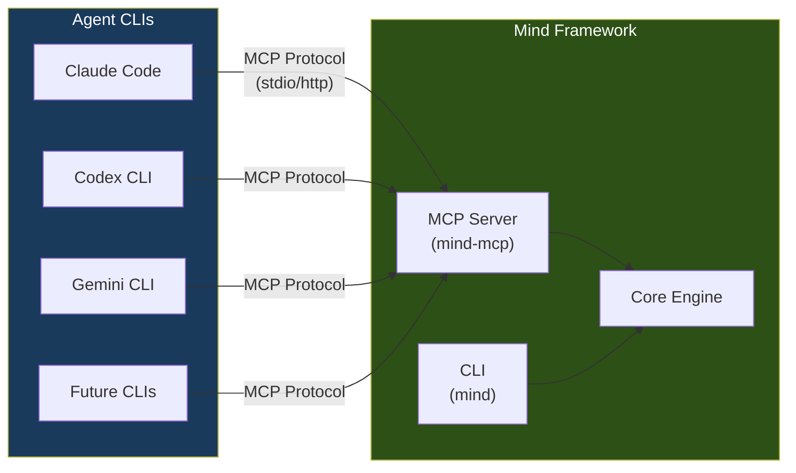

**Rationale**: All three major CLIs support MCP as of 2026. MCP provides tool discovery, typed parameters, and structured responses. One MCP server implementation instantly supports all platforms and any future CLI that adopts MCP.

**Consequences**: The framework cannot depend on CLI-specific features (Claude Code's `/` commands, Gemini's skill system). Agent prompt files (`.claude/agents/`) remain platform-specific but are thin wrappers that delegate to the MCP server for operations.

---

### ADR-003: Plugin Architecture

**Decision**: WASM-based plugins for sandboxed, language-agnostic extensions. Bash scripts for lightweight hooks.

**Context**: The framework needs extensibility (specialists, custom gates, workflow modifications) without compromising security or requiring a specific programming language.

**Two-tier system**:

| Tier | Format | Use Case | Sandboxing | Performance |
|------|--------|----------|:---:|:---:|
| **Hooks** | Bash scripts | Pre/post workflow, pre-commit, validation | OS-level | ~10ms |
| **Plugins** | WASM modules | Custom gates, specialist logic, report generators | WASM sandbox | ~1ms |

**Consequences**: Plugin authors can use any language that compiles to WASM (Rust, Go, C, AssemblyScript, Python via Pyodide). Plugins cannot access the filesystem or network unless explicitly granted capabilities through the WASM capability model.

---

### ADR-004: Deployment Model

**Decision**: Hybrid incremental — starts as CLI + MCP server inside existing agent CLIs, evolves toward standalone capability.

Detailed analysis in [Section 6](#6-deployment-models).

---

## 3. System Architecture

### 3.1 Hexagonal Architecture

The core engine is structured as a hexagonal (ports-and-adapters) architecture. Business logic has zero I/O dependencies — all external interactions flow through defined ports.

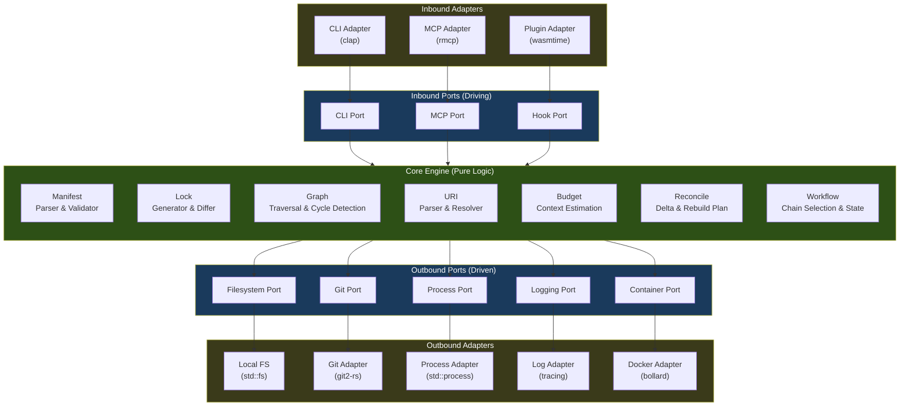

**Why hexagonal**: The core must be testable without a filesystem, without git, without Docker. Ports allow swapping adapters (e.g., in-memory filesystem for tests, mock git for CI). This also enables the hybrid deployment: the same core runs behind a CLI adapter or an MCP adapter.

### 3.2 Crate / Module Decomposition

```
mind-framework/
├── Cargo.toml                     ← Workspace root
│
├── crates/
│   ├── mind-core/                 ← Pure business logic (no I/O)
│   │   ├── src/
│   │   │   ├── manifest/          ← TOML parse, validate, schema
│   │   │   │   ├── mod.rs
│   │   │   │   ├── parse.rs       ← Deserialize mind.toml → Manifest struct
│   │   │   │   ├── validate.rs    ← Invariant checks
│   │   │   │   └── schema.rs      ← Schema versioning
│   │   │   ├── lock/              ← Lock file generation, diff
│   │   │   │   ├── mod.rs
│   │   │   │   ├── generate.rs    ← From manifest + filesystem state → Lock
│   │   │   │   ├── diff.rs        ← Compare two lock files
│   │   │   │   └── staleness.rs   ← Transitive staleness propagation
│   │   │   ├── graph/             ← Dependency graph operations
│   │   │   │   ├── mod.rs
│   │   │   │   ├── traverse.rs    ← BFS/DFS, upstream/downstream queries
│   │   │   │   ├── cycle.rs       ← Cycle detection (Kahn's algorithm)
│   │   │   │   └── impact.rs      ← Impact analysis ("what breaks if X changes?")
│   │   │   ├── uri/               ← Canonical URI parsing
│   │   │   │   ├── mod.rs
│   │   │   │   ├── parse.rs       ← "doc:spec/requirements#FR-3" → Uri struct
│   │   │   │   └── resolve.rs     ← Uri → filesystem path via manifest
│   │   │   ├── budget/            ← Context budgeting
│   │   │   │   ├── mod.rs
│   │   │   │   └── estimate.rs    ← File size → token estimate, priority tiers
│   │   │   ├── reconcile/         ← Delta computation
│   │   │   │   ├── mod.rs
│   │   │   │   ├── delta.rs       ← Declared - actual = work items
│   │   │   │   └── plan.rs        ← Work items → ordered agent dispatch plan
│   │   │   ├── workflow/          ← Workflow chain logic
│   │   │   │   ├── mod.rs
│   │   │   │   ├── classify.rs    ← Request text → RequestType enum
│   │   │   │   ├── chain.rs       ← RequestType → agent chain
│   │   │   │   └── state.rs       ← Workflow state machine
│   │   │   └── lib.rs
│   │   └── Cargo.toml             ← Dependencies: serde, toml, serde_json
│   │
│   ├── mind-cli/                  ← CLI binary
│   │   ├── src/
│   │   │   ├── main.rs
│   │   │   ├── commands/          ← One module per CLI command
│   │   │   │   ├── init.rs
│   │   │   │   ├── lock.rs
│   │   │   │   ├── status.rs
│   │   │   │   ├── query.rs
│   │   │   │   ├── graph.rs
│   │   │   │   ├── validate.rs
│   │   │   │   ├── clean.rs
│   │   │   │   └── scaffold.rs
│   │   │   └── output/            ← Rendering (text, JSON, colored)
│   │   │       ├── text.rs
│   │   │       └── json.rs
│   │   └── Cargo.toml             ← Dependencies: clap, mind-core, mind-runtime
│   │
│   ├── mind-runtime/              ← I/O adapters (filesystem, git, process)
│   │   ├── src/
│   │   │   ├── fs.rs              ← Filesystem scanning, hashing, caching
│   │   │   ├── git.rs             ← Branch, commit, diff, log operations
│   │   │   ├── process.rs         ← Command execution with capture
│   │   │   ├── container.rs       ← Docker/Podman health check, exec
│   │   │   ├── log.rs             ← Structured JSONL logging
│   │   │   └── lib.rs
│   │   └── Cargo.toml             ← Dependencies: git2, sha2, serde_json, bollard
│   │
│   ├── mind-mcp/                  ← MCP server (the integration surface)
│   │   ├── src/
│   │   │   ├── main.rs            ← MCP server entry point
│   │   │   ├── tools.rs           ← MCP tool definitions (lock, status, query, ...)
│   │   │   └── resources.rs       ← MCP resource definitions (manifest, lock)
│   │   └── Cargo.toml             ← Dependencies: rmcp, mind-core, mind-runtime
│   │
│   └── mind-plugins/              ← Plugin host (WASM runtime)
│       ├── src/
│       │   ├── host.rs            ← WASM runtime setup (wasmtime)
│       │   ├── api.rs             ← Plugin API (guest interface)
│       │   └── registry.rs        ← Plugin discovery and loading
│       └── Cargo.toml             ← Dependencies: wasmtime, wit-bindgen
│
├── hooks/                         ← Bash hook scripts (shipped with framework)
│   ├── pre-commit.sh
│   └── post-merge.sh
│
├── prompts/                       ← Agent prompt files (the knowledge layer)
│   ├── agents/
│   ├── conventions/
│   ├── skills/
│   ├── commands/
│   ├── specialists/
│   └── templates/
│
├── conversation/                  ← Dialectical analysis module
│   ├── config/                    ← conversation.yml, personas.yml, quality.yml, extensions.yml
│   ├── protocols/                 ← Phase routing, evaluator-optimizer, approval gates, delegation
│   └── skills/                    ← Evidence standards, reasoning chains, challenge methodology
│
├── .github/                       ← Copilot Chat integration surface
│   ├── agents/                    ← Conversation moderator + specialist personas
│   └── prompts/                   ← /analyze prompt files (Mode A, Mode B)
│
├── scripts/                       ← Installation and scaffolding
│   ├── install.sh
│   └── scaffold.sh
│
└── tests/
    ├── fixtures/                  ← Test mind.toml files, mock filesystems
    └── integration/               ← End-to-end CLI tests
```

### 3.3 Dependency Graph Between Crates

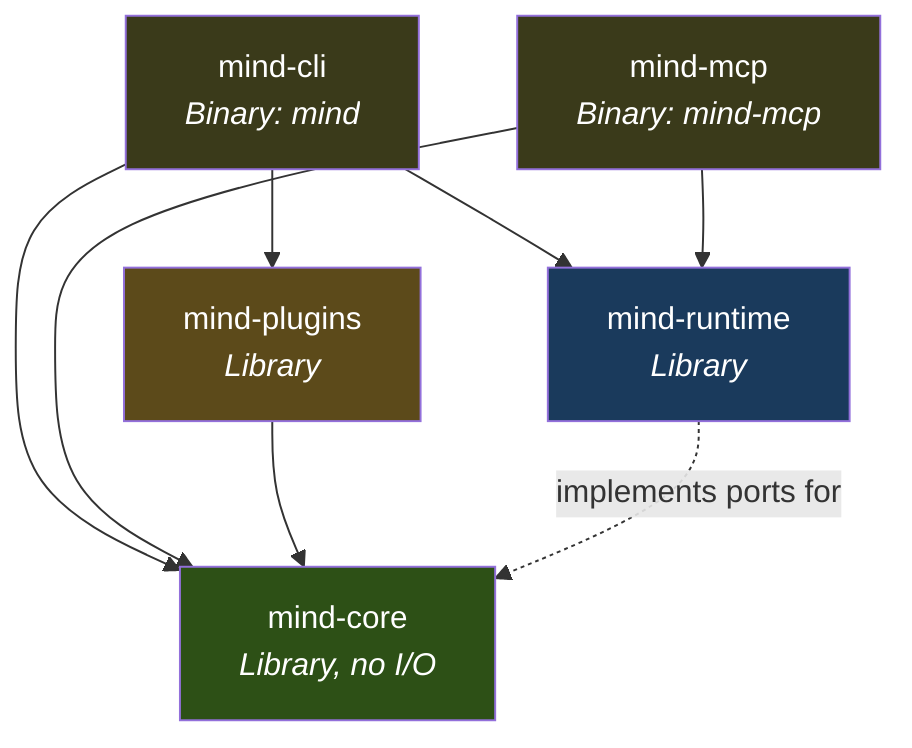

**Key constraint**: `mind-core` has NO dependency on `mind-runtime`. It defines trait-based ports that `mind-runtime` implements. This makes the core fully testable with in-memory implementations.

---

## 4. Technology Stack Analysis

### 4.1 Core Stack

| Layer | Technology | Rationale |
|-------|-----------|-----------|
| **Language** | Rust 2024 edition | Single binary, sub-ms startup, TOML-native, WASM host |
| **CLI framework** | clap v4 | Derive-based, subcommands, shell completions, man pages |
| **TOML parsing** | toml + serde | De facto Rust standard, bi-directional (read + write) |
| **JSON handling** | serde_json | Zero-cost serialization, streaming for large lock files |
| **Git operations** | git2 (libgit2 bindings) | Programmatic git without shell-out, cross-platform |
| **Hashing** | sha2 | Pure Rust SHA-256, no OpenSSL dependency |
| **MCP server** | rmcp v0.16 | Official Rust MCP SDK, async, stdio + HTTP transport |
| **WASM runtime** | wasmtime | Production-grade, WASI support, capability model |
| **Container ops** | bollard | Async Docker API client (optional feature flag) |
| **Logging** | tracing + tracing-subscriber | Structured, async-compatible, JSON output |
| **Terminal output** | owo-colors + comfy-table | Colored output, tables, no heavy TUI dependency |
| **Error handling** | thiserror + miette | Structured errors with source spans and suggestions |

### 4.2 Rust vs C# — Detailed Comparison for This Use Case

| Dimension | Rust | C# (.NET 8) | Winner |
|-----------|------|-------------|:---:|
| **Distribution** | `cargo install mind-cli` or download binary. Zero runtime deps. | `dotnet tool install` requires .NET runtime. Self-contained is 50MB+. | Rust |
| **Pre-commit hook** | `mind lock --verify` completes in ~2ms. Users don't notice. | ~80ms JIT startup. Noticeable on every commit. | Rust |
| **TOML** | `toml` crate: read + write, first-class serde support. TOML was designed for Rust's ecosystem (Cargo.toml). | `Tomlyn`: adequate but less mature. TOML is foreign to .NET culture. | Rust |
| **MCP Server** | RMCP: official SDK, v0.16, 3k stars, async, production-ready. | No official SDK. Community implementations exist but lag behind. | Rust |
| **Plugin sandboxing** | WASM via wasmtime: production-grade, capability model, language-agnostic. | Limited WASM support. Roslyn scripting possible but .NET-only. | Rust |
| **Developer tool precedent** | ripgrep, fd, bat, delta, starship, deno, biome, turbopack. Developers trust Rust CLIs. | dotnet-format exists, but CLI developer tools in C# are rare. | Rust |
| **Enterprise integration** | Weak. No Azure, no MSSQL, no .NET ecosystem. | Excellent. NuGet, Azure DevOps, MSSQL, Entity Framework. | C# |
| **Web UI potential** | Possible via Leptos/Axum, but not natural. | Blazor, ASP.NET — first-class web framework. | C# |
| **Development velocity** | Slower initial development. Borrow checker has a learning curve. | Faster initial development. Rich standard library. | C# |
| **Contributor pool** | Smaller but growing rapidly. High-quality contributors. | Larger pool, especially in enterprise. | C# |

**Verdict**: Rust wins 7 of 10 dimensions that matter for a CLI developer tool. C# wins on enterprise integration, web UI, and development velocity — none of which are primary requirements for the Mind Framework.

### 4.3 Where C# Could Complement

If the framework ever needs a **web dashboard** or **cloud-hosted service** (e.g., a team-wide Mind Framework instance with shared governance), C# becomes relevant:

```
mind-core (Rust library, compiled to native)
    ├── mind-cli (Rust binary)          ← Developer's local tool
    ├── mind-mcp (Rust binary)          ← Agent integration
    └── mind-dashboard (C# ASP.NET)     ← Team dashboard (future)
         ├── Blazor frontend
         ├── SignalR real-time updates
         └── FFI to mind-core via C ABI
```

This is a Phase 4+ concern. The Rust core exposes a C ABI that C# can consume via P/Invoke, enabling a hybrid architecture without rewriting core logic.

---

## 5. Workflow Engine Design

### 5.1 End-to-End Workflow Pipeline

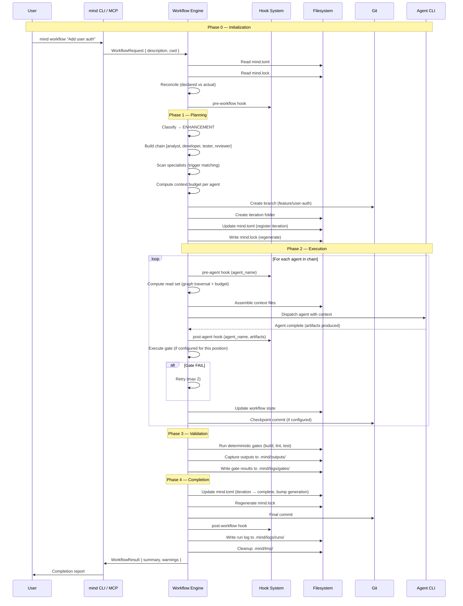

### 5.2 Workflow State Machine

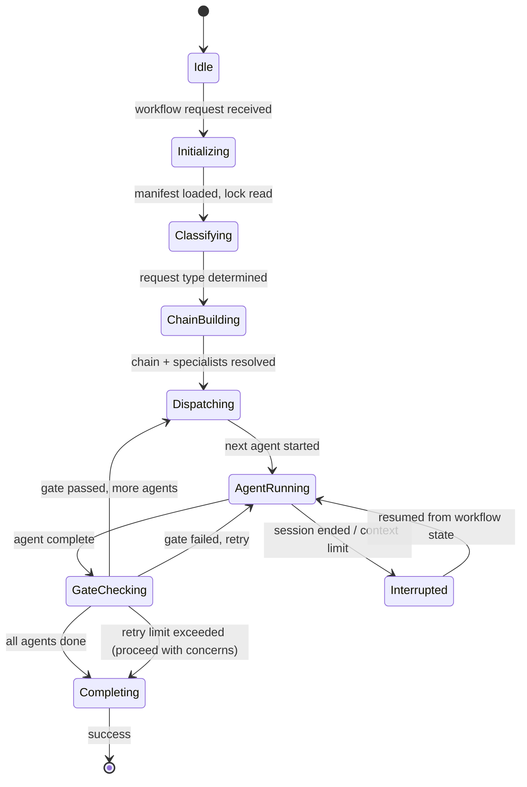

### 5.3 Core Data Types

```rust
// Request classification
enum RequestType {
    NewProject,
    BugFix,
    Enhancement,
    Refactor,
}

// Workflow chain with gate positions
struct WorkflowChain {
    agents: Vec<AgentRef>,
    gates: HashMap<GatePosition, GateRef>,
    session_split_after: Option<AgentRef>,
}

enum GatePosition {
    After(AgentRef),
    Before(AgentRef),
}

// Reconciliation output
struct ReconciliationPlan {
    stale: Vec<ArtifactUri>,
    missing: Vec<ArtifactUri>,
    rebuild_order: Vec<AgentDispatch>,
}

struct AgentDispatch {
    agent: AgentRef,
    read_set: Vec<ArtifactUri>,      // What to load (primary + secondary)
    summary_set: Vec<ArtifactUri>,   // What to summarize (tertiary)
    produce_set: Vec<ArtifactUri>,   // What this agent should create/update
}

// Lock file diff
struct LockDelta {
    changed: Vec<(ArtifactUri, Hash, Hash)>,   // (uri, old_hash, new_hash)
    added: Vec<ArtifactUri>,
    removed: Vec<ArtifactUri>,
    stale_cascade: Vec<ArtifactUri>,            // transitively stale
}
```

### 5.4 Gate Execution

```rust
// Gate trait — implemented by deterministic and probabilistic gates
trait Gate {
    fn name(&self) -> &str;
    fn gate_type(&self) -> GateType;
    fn execute(&self, context: &GateContext) -> GateVerdict;
}

enum GateType {
    Deterministic,  // build, lint, typecheck, test — binary pass/fail
    Probabilistic,  // agent-evaluated checks — judgment-based
}

struct GateVerdict {
    passed: bool,
    checks: Vec<CheckResult>,
    output_path: Option<PathBuf>,   // captured output in .mind/outputs/
}

struct CheckResult {
    name: String,
    passed: bool,
    detail: Option<String>,
    duration: Duration,
}
```

---

## 6. Deployment Models

### 6.1 Four Models Analyzed

```mermaid
graph TD
    subgraph M1["Model 1: Embedded<br/><i>Framework as prompt files</i>"]
        M1_P["Markdown prompts<br/>in .claude/agents/"]
        M1_S["Bash/Python scripts<br/>for operations"]
        M1_C["Agent CLI<br/>loads prompts directly"]
        M1_P --> M1_C
        M1_S --> M1_C
    end
    
    subgraph M2["Model 2: Plugin<br/><i>Framework as MCP server + prompts</i>"]
        M2_P["Markdown prompts"]
        M2_M["MCP Server<br/>(mind-mcp binary)"]
        M2_C["Agent CLI<br/>calls MCP tools"]
        M2_P --> M2_C
        M2_M --> M2_C
    end
    
    subgraph M3["Model 3: Standalone<br/><i>Framework as its own runtime</i>"]
        M3_CLI["mind CLI<br/>(dispatches to LLM APIs)"]
        M3_P["Prompts"]
        M3_LLM["LLM API<br/>(OpenAI, Anthropic, Google)"]
        M3_CLI --> M3_LLM
        M3_P --> M3_CLI
    end
    
    subgraph M4["Model 4: Hybrid<br/><i>Incremental evolution</i>"]
        M4_1["Phase 1: Embedded"]
        M4_2["Phase 2: Plugin"]
        M4_3["Phase 3: Standalone option"]
        M4_1 -->|"add mind CLI<br/>+ MCP server"| M4_2
        M4_2 -->|"add LLM adapter<br/>(optional)"| M4_3
    end

    style M1 fill:#1a3a3a,color:#fff
    style M2 fill:#1a3a5c,color:#fff
    style M3 fill:#3a1a5c,color:#fff
    style M4 fill:#2d5016,color:#fff
```

### 6.2 Comparison Matrix

| Dimension | M1: Embedded | M2: Plugin (MCP) | M3: Standalone | M4: Hybrid |
|-----------|:---:|:---:|:---:|:---:|
| **Setup friction** | Zero | Low (install binary + config MCP) | Moderate (API keys, config) | Incremental |
| **Agent CLI required** | Yes | Yes | No | Optional |
| **CLI operations** | Bash scripts | Rust binary + MCP | Rust binary | Both |
| **Context efficiency** | Manual (agent reads everything) | Automated (MCP serves relevant context) | Full control | Progressive |
| **Gate execution** | Agent runs commands | MCP server runs commands | CLI runs commands | Both |
| **Multi-CLI support** | Per-platform prompt files | One MCP server for all | N/A | One MCP for all |
| **Offline capability** | Full | Full | Needs LLM API | Full |
| **Orchestration control** | Agent CLI decides | Shared (prompts + MCP) | Full control | Progressive |
| **Implementation effort** | Done (v1) | Medium (~4 weeks) | High (~12 weeks) | Phased |
| **Lock-in risk** | High (per-CLI) | Low (MCP is standard) | None | None |

### 6.3 Recommendation: Model 4 (Hybrid Incremental)

**Phase 1 → Model 1**: Already exists. Validates the design with zero investment. Users get value immediately from the framework's markdown prompts.

**Phase 2 → Model 2**: Add the Rust CLI and MCP server. Agents call `mind:lock`, `mind:status`, `mind:query` as MCP tools instead of parsing files manually. Deterministic gates run through the MCP server. Context budgeting is automated.

**Phase 3 → Model 3 (optional)**: For teams that want full control, add an LLM adapter that lets the `mind` CLI dispatch agents directly via API calls. This is a power-user feature, not the default path.

**Why this order**: Each phase builds on the previous. No work is thrown away. The community can stop at any phase that meets their needs.

---

## 7. Integration Architecture

### 7.1 MCP Server — Tool Definitions

The Mind MCP server exposes the framework's operations as MCP tools that any agent CLI can discover and call.

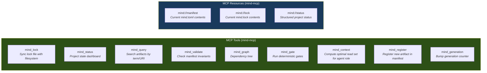

#### Tool Signatures

```json
{
  "name": "mind_context",
  "description": "Compute the optimal set of files an agent should read, based on its role and the dependency graph. Returns prioritized file list with token estimates.",
  "inputSchema": {
    "type": "object",
    "properties": {
      "agent_role": {
        "type": "string",
        "enum": ["analyst", "architect", "developer", "tester", "reviewer"],
        "description": "The role of the agent requesting context"
      },
      "iteration": {
        "type": "string",
        "description": "Active iteration ID (e.g., 'doc:iteration/003')"
      },
      "budget_tokens": {
        "type": "integer",
        "description": "Maximum tokens to load (default: 30000)"
      }
    },
    "required": ["agent_role"]
  }
}
```

```json
{
  "name": "mind_gate",
  "description": "Execute deterministic quality gates (build, lint, typecheck, test). Returns structured results with pass/fail per check.",
  "inputSchema": {
    "type": "object",
    "properties": {
      "gates": {
        "type": "array",
        "items": { "type": "string", "enum": ["build", "lint", "typecheck", "test"] },
        "description": "Which gates to run (default: all configured)"
      },
      "capture_output": {
        "type": "boolean",
        "description": "Save output to .mind/outputs/ (default: true)"
      }
    }
  }
}
```

### 7.2 Conversation Module Integration Surface

The conversation module operates through `.github/agents/` — the standard Copilot Chat agent discovery path. Unlike the MCP tools (which serve the dev workflow agents), conversation agents are invoked via Copilot Chat's sub-agent mechanism:

- **Moderator** spawns specialist personas as sub-agents with context isolation per phase
- **Personas** produce structured position documents; moderator synthesizes into convergence analysis
- **Output** lands in `analysis/conversation/` and is consumed by the dev workflow's analyst and architect
- **Integration**: The orchestrator dispatches conversation-moderator for `COMPLEX_NEW` requests (Gate 0 validates convergence quality ≥ 3.0/5.0 before proceeding to dev pipeline)

This creates a **dual-integration model**: MCP for dev workflow tooling, `.github/agents/` for conversation workflow orchestration.

### 7.3 MCP Configuration

Added to the project's `.mcp.json`:

```json
{
  "mcpServers": {
    "mind": {
      "command": "mind-mcp",
      "args": ["--project-root", "."],
      "env": {}
    }
  }
}
```

Agent prompts then reference MCP tools instead of running bash commands:

```markdown
## Before (v1 — agent runs commands directly)
Run `pytest -v` to check tests. Parse the output manually.

## After (v2 — agent calls MCP tool)
Call the `mind_gate` tool with `gates: ["test"]` to run tests.
The result includes structured pass/fail counts and captured output path.
```

### 7.3 Hook System

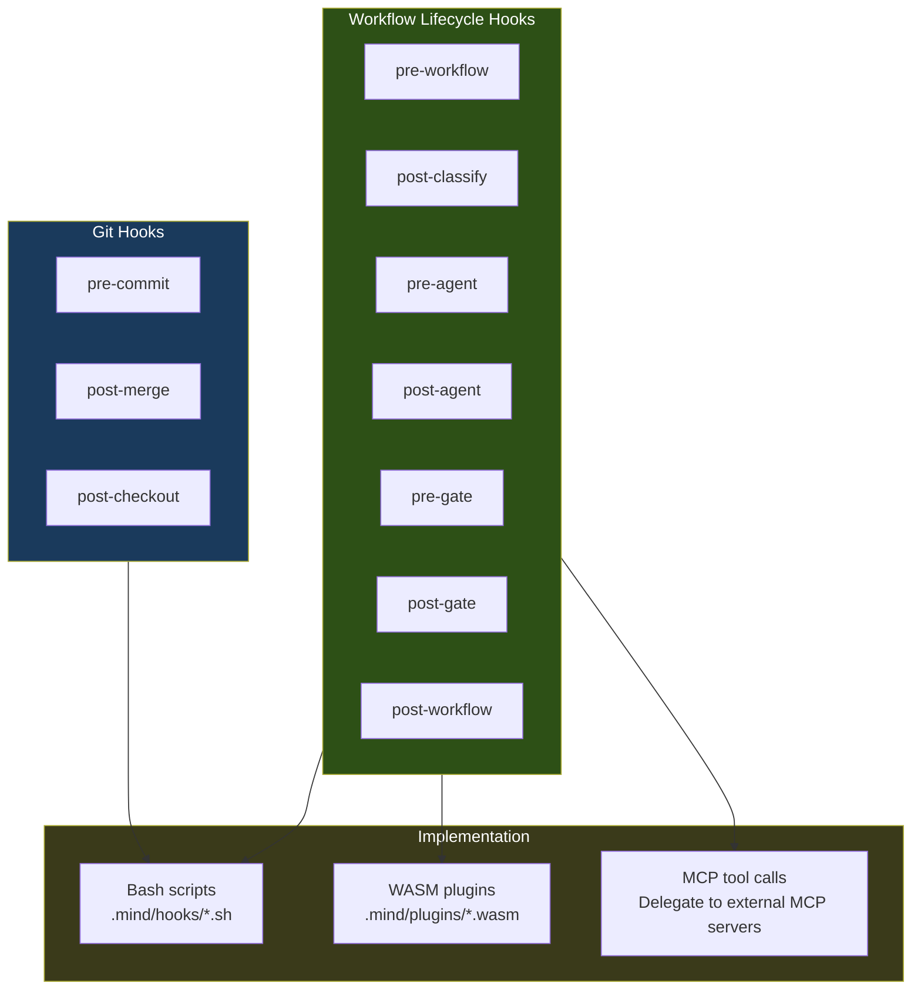

#### Hook Configuration in mind.toml

```toml
[hooks]
pre-workflow   = [".mind/hooks/check-infra.sh"]
post-workflow  = [".mind/hooks/notify-slack.sh"]
pre-commit     = [".mind/hooks/verify-lock.sh"]

[hooks.pre-agent]
analyst  = [".mind/hooks/load-domain-context.sh"]
developer = [".mind/hooks/ensure-branch.sh"]

[hooks.post-gate]
deterministic = [".mind/hooks/upload-coverage.sh"]
```

### 7.4 Plugin API (WASM)

Plugins are compiled to WASM and run in a sandboxed environment. They interact with the framework through a defined interface:

```rust
// Plugin guest interface (what plugin authors implement)
#[wit_bindgen::generate]
trait MindPlugin {
    fn name() -> String;
    fn version() -> String;
    fn hooks() -> Vec<HookPoint>;
    
    fn on_hook(hook: HookPoint, context: HookContext) -> HookResult;
}

struct HookContext {
    project_name: String,
    generation: u32,
    active_iteration: Option<String>,
    agent: Option<String>,
    gate: Option<String>,
    manifest_json: String,        // serialized mind.toml as JSON
    lock_json: Option<String>,    // serialized mind.lock
}

enum HookResult {
    Continue,                     // proceed normally
    Modify(String),               // modify context (JSON patch)
    Abort(String),                // stop workflow with message
}
```

**Capability grants**: Plugins declare required capabilities in a manifest:

```toml
# .mind/plugins/coverage-reporter/plugin.toml
[plugin]
name    = "coverage-reporter"
version = "1.0.0"
wasm    = "coverage-reporter.wasm"
hooks   = ["post-gate"]

[capabilities]
filesystem-read  = ["coverage-report.json", ".mind/outputs/coverage/*"]
filesystem-write = [".mind/outputs/coverage/badge.svg"]
network          = false
```

The WASM runtime only grants the declared capabilities. A plugin that requests no network access cannot make HTTP calls.

---

## 8. Adapter Layer

### 8.1 The Adapter Problem

Each coding agent CLI has its own conventions:

| CLI | Agent Definition | Config File | Prompt Location | Skill System |
|-----|-----------------|-------------|----------------|:---:|
| **Claude Code** | Markdown frontmatter | `CLAUDE.md` | `.claude/agents/` | Skills via markdown |
| **Codex CLI** | `config.toml` roles | `AGENTS.md` | `.codex/agents/` | No native skills |
| **Gemini CLI** | `GEMINI.md` instructions | `GEMINI.md` | Workspace `.gemini/` | Skills directories |

### 8.2 The Solution: Universal Core + Thin Platform Shims

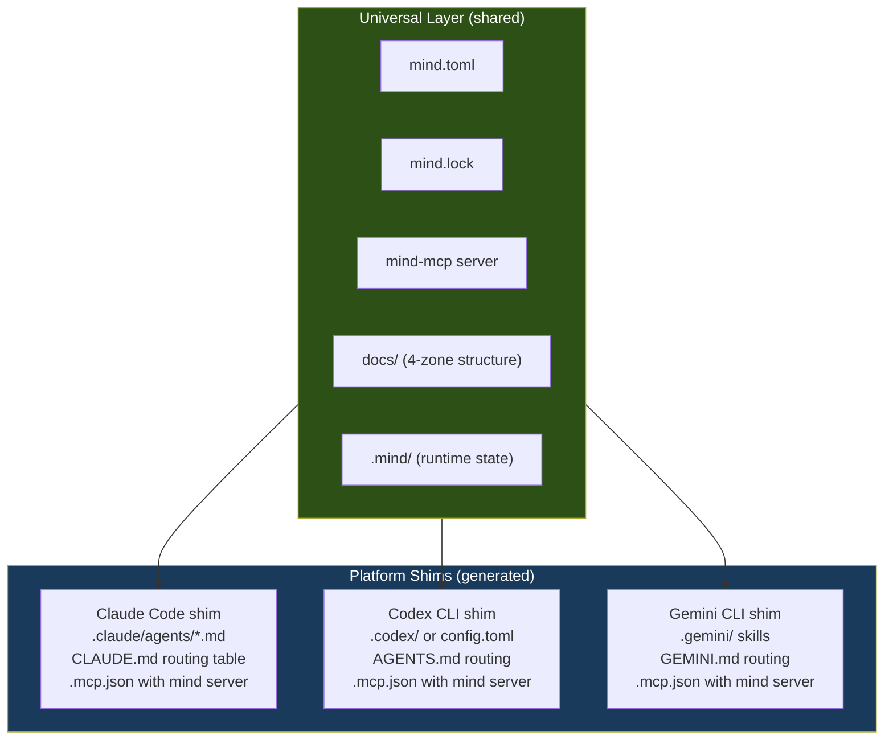

**Key insight**: The agent prompt files become **thin delegation layers**. Instead of containing all orchestration logic, they instruct the agent to call MCP tools:

```markdown
# .claude/agents/orchestrator.md (Claude Code shim — v2)
---
name: orchestrator
description: Classifies requests and dispatches to the correct agent chain.
model: claude-opus-4-1-5
tools: [Read, Bash, mcp]
---

# Orchestrator

You coordinate workflows by calling the Mind Framework MCP tools.

## On every request:

1. Call `mind_status` to understand current project state
2. Call `mind_context` with agent_role="orchestrator" to load relevant context
3. Classify the request type (NEW_PROJECT, BUG_FIX, ENHANCEMENT, REFACTOR)
4. Based on mind.toml workflow definitions, select the agent chain
5. For each agent, call `mind_context` with that agent's role to prepare context
6. After implementation, call `mind_gate` to run deterministic checks
7. On completion, call `mind_generation` to bump the generation counter
```

This shim is ~50 lines. The real logic lives in the MCP server. Switching platforms means generating a new shim for the target CLI — the core behavior remains identical.

### 8.3 Scaffold Command with Platform Target

```bash
mind scaffold --platform claude   # Generate .claude/ shims
mind scaffold --platform codex    # Generate .codex/ shims
mind scaffold --platform gemini   # Generate .gemini/ shims
mind scaffold --platform all      # Generate for all platforms
```

---

## 9. Component Specifications

### 9.1 Manifest Parser (`mind-core/manifest`)

**Responsibility**: Parse `mind.toml` into a strongly-typed `Manifest` struct. Validate schema version. Enforce invariants.

```rust
pub struct Manifest {
    pub manifest: ManifestMeta,
    pub project: Project,
    pub profiles: Profiles,
    pub framework: FrameworkConfig,
    pub agents: HashMap<String, AgentDef>,
    pub workflows: HashMap<String, WorkflowDef>,
    pub documents: DocumentRegistry,
    pub graph: Vec<GraphEdge>,
    pub governance: Governance,
    pub generations: Vec<Generation>,
    pub operations: Option<Operations>,
    pub hooks: Option<HookConfig>,
}

pub struct DocumentRegistry {
    pub spec: HashMap<String, DocumentDef>,
    pub state: HashMap<String, DocumentDef>,
    pub iterations: HashMap<String, IterationDef>,
    pub knowledge: HashMap<String, DocumentDef>,
}

pub struct GraphEdge {
    pub from: ArtifactUri,
    pub to: ArtifactUri,
    pub edge_type: EdgeType,
}

pub enum EdgeType {
    DerivesFrom,
    Implements,
    Validates,
    Supersedes,
    Informs,
}
```

### 9.2 Lock Generator (`mind-core/lock` + `mind-runtime/fs`)

**Responsibility**: Scan the filesystem against the manifest. Compute hashes. Detect staleness. Produce `mind.lock`.

```rust
// Core (no I/O) — defines what a lock file IS
pub struct LockFile {
    pub lock_version: u32,
    pub generated_at: DateTime<Utc>,
    pub generation: u32,
    pub resolved: HashMap<ArtifactUri, ResolvedArtifact>,
    pub warnings: Vec<String>,
    pub completeness: Completeness,
    pub operations: Option<OperationsState>,
    pub integrity: String,
}

pub struct ResolvedArtifact {
    pub path: PathBuf,
    pub exists: bool,
    pub hash: Option<String>,
    pub size: Option<u64>,
    pub last_modified: Option<DateTime<Utc>>,
    pub stale: bool,
    pub stale_reason: Option<String>,
    pub upstream_hashes: HashMap<ArtifactUri, String>,
    pub archived: bool,
}

// Runtime (I/O) — implements the scanning
pub trait FilesystemScanner {
    fn exists(&self, path: &Path) -> bool;
    fn hash(&self, path: &Path) -> Result<String>;
    fn size(&self, path: &Path) -> Result<u64>;
    fn modified(&self, path: &Path) -> Result<DateTime<Utc>>;
}

// Lock generation uses the trait, not concrete I/O
pub fn generate_lock(
    manifest: &Manifest,
    scanner: &dyn FilesystemScanner,
    previous_lock: Option<&LockFile>,
) -> LockFile { /* ... */ }
```

### 9.3 Dependency Graph (`mind-core/graph`)

**Responsibility**: Build a directed graph from `[[graph]]` entries. Provide traversal, cycle detection, impact analysis, and topological ordering.

```rust
pub struct DependencyGraph {
    edges: Vec<GraphEdge>,
    adjacency: HashMap<ArtifactUri, Vec<(ArtifactUri, EdgeType)>>,
    reverse: HashMap<ArtifactUri, Vec<(ArtifactUri, EdgeType)>>,
}

impl DependencyGraph {
    pub fn upstream(&self, uri: &ArtifactUri) -> Vec<&ArtifactUri>;
    pub fn downstream(&self, uri: &ArtifactUri) -> Vec<&ArtifactUri>;
    pub fn stale_cascade(&self, changed: &ArtifactUri) -> Vec<ArtifactUri>;
    pub fn has_cycle(&self) -> Option<Vec<ArtifactUri>>;
    pub fn topological_order(&self) -> Result<Vec<ArtifactUri>>;
    pub fn impact_of(&self, uri: &ArtifactUri) -> ImpactReport;
    pub fn read_set_for_agent(&self, agent: &AgentDef, budget: &Budget) -> ReadSet;
}

pub struct ReadSet {
    pub primary: Vec<(ArtifactUri, PathBuf)>,     // full read
    pub secondary: Vec<(ArtifactUri, PathBuf)>,   // full or summary
    pub skipped: Vec<ArtifactUri>,                 // over budget
    pub estimated_tokens: usize,
}
```

### 9.4 Context Budget (`mind-core/budget`)

```rust
pub struct Budget {
    pub max_tokens: usize,
    pub token_ratio: f64,    // bytes → tokens conversion (default 0.75)
}

impl Budget {
    pub fn estimate_tokens(&self, file_size: u64) -> usize {
        (file_size as f64 * self.token_ratio) as usize
    }
    
    pub fn allocate(
        &self,
        primary: &[(ArtifactUri, u64)],      // (uri, file_size)
        secondary: &[(ArtifactUri, u64)],
        tertiary: &[(ArtifactUri, u64)],
    ) -> BudgetAllocation;
}

pub struct BudgetAllocation {
    pub load_full: Vec<ArtifactUri>,
    pub load_summary: Vec<ArtifactUri>,
    pub skip: Vec<ArtifactUri>,
    pub total_estimated: usize,
    pub budget_remaining: usize,
}
```

---

## 10. Operational Integration

### 10.1 Filesystem Operations

All filesystem operations go through the `FilesystemScanner` trait (testable, mockable):

| Operation | Implementation | Performance |
|-----------|---------------|:---:|
| File existence check | `std::fs::metadata` | ~1μs |
| SHA-256 hash | `sha2` crate, streaming | ~50μs per 10KB file |
| Mtime check | `std::fs::metadata().modified()` | ~1μs |
| Directory scan | `walkdir` crate | ~1ms per 100 files |
| Incremental hash | Mtime check → skip if unchanged | ~1μs (cache hit) |

### 10.2 Git Integration

Via `git2` (libgit2 bindings) — no shell-out, cross-platform:

```rust
pub trait GitOperations {
    fn current_branch(&self) -> Result<String>;
    fn create_branch(&self, name: &str) -> Result<()>;
    fn checkout(&self, branch: &str) -> Result<()>;
    fn add(&self, paths: &[PathBuf]) -> Result<()>;
    fn commit(&self, message: &str) -> Result<String>;  // returns commit SHA
    fn diff_stat(&self) -> Result<DiffStat>;
    fn log(&self, limit: usize) -> Result<Vec<CommitInfo>>;
    fn is_clean(&self) -> Result<bool>;
}
```

### 10.3 Container Integration

Via `bollard` (async Docker API client) — optional feature flag:

```rust
// Only compiled if --features=containers
pub trait ContainerOperations {
    fn health_check(&self, compose_file: &Path) -> Result<Vec<ServiceStatus>>;
    fn start(&self, compose_file: &Path) -> Result<()>;
    fn stop(&self, compose_file: &Path) -> Result<()>;
    fn exec(&self, service: &str, command: &[&str]) -> Result<ProcessOutput>;
    fn logs(&self, service: &str, tail: usize) -> Result<String>;
}

pub struct ServiceStatus {
    pub name: String,
    pub running: bool,
    pub port: Option<u16>,
    pub health: HealthState,
}
```

### 10.4 Command Execution & Output Capture

```rust
pub trait ProcessExecutor {
    fn run(&self, command: &str, capture: CaptureMode) -> Result<ProcessOutput>;
}

pub enum CaptureMode {
    None,               // stream to terminal
    Capture,            // capture stdout + stderr
    CaptureToFile(PathBuf),  // stream to file + capture
}

pub struct ProcessOutput {
    pub exit_code: i32,
    pub stdout: String,
    pub stderr: String,
    pub duration: Duration,
    pub output_path: Option<PathBuf>,
}
```

### 10.5 Structured Logging

```rust
use tracing::{info, warn, error, instrument};

#[instrument(skip(manifest, lock))]
pub fn reconcile(manifest: &Manifest, lock: &LockFile) -> ReconciliationPlan {
    info!(generation = manifest.manifest.generation, "starting reconciliation");
    
    let stale = compute_stale(&manifest, &lock);
    warn!(count = stale.len(), "stale artifacts detected");
    
    // ...
}
```

Output is JSON when `--json` flag is set, human-readable otherwise. Run logs in `.mind/logs/runs/` use JSONL format automatically.

---

## 11. Multi-Language & Multi-Platform Support

### 11.1 Language Agnosticism

The framework is language-agnostic by design. `mind.toml` declares commands, not implementations:

```toml
# Python project
[project.stack]
language = "python@3.12"
[project.commands]
test = "pytest -v"
lint = "ruff check src/"

# Rust project
[project.stack]
language = "rust@1.78"
[project.commands]
test = "cargo test"
lint = "cargo clippy"

# Go project
[project.stack]
language = "go@1.22"
[project.commands]
test = "go test ./..."
lint = "golangci-lint run"

# C# project
[project.stack]
language = "csharp@net8"
[project.commands]
test = "dotnet test"
lint = "dotnet format --check"
build = "dotnet build"
```

The `mind` CLI doesn't know or care what language the project uses. It executes the configured commands and captures results. Gate verdicts are based on exit codes, not language-specific parsing.

### 11.2 Platform Support

| Platform | Binary | Status |
|----------|--------|:---:|
| Linux x86_64 | `mind-linux-amd64` | Primary |
| Linux aarch64 | `mind-linux-arm64` | Primary |
| macOS x86_64 | `mind-darwin-amd64` | Primary |
| macOS aarch64 | `mind-darwin-arm64` | Primary |
| Windows x86_64 | `mind-windows-amd64.exe` | Secondary |
| WASM (browser) | `mind-core.wasm` | Future (dashboard) |

Cross-compilation via `cross` (Rust cross-compilation tool). CI builds all targets on every release.

### 11.3 Installation Methods

```bash
# Method 1: Cargo (Rust developers)
cargo install mind-cli

# Method 2: Homebrew (macOS/Linux)
brew install mind-framework/tap/mind

# Method 3: Direct download
curl -fsSL https://get.mind-framework.dev | sh

# Method 4: From source
git clone https://github.com/mind-framework/mind
cd mind && cargo build --release

# Method 5: Nix (for the NixOS enthusiasts)
nix run github:mind-framework/mind
```

---

## 12. Implementation Roadmap

### 12.1 Phase Overview

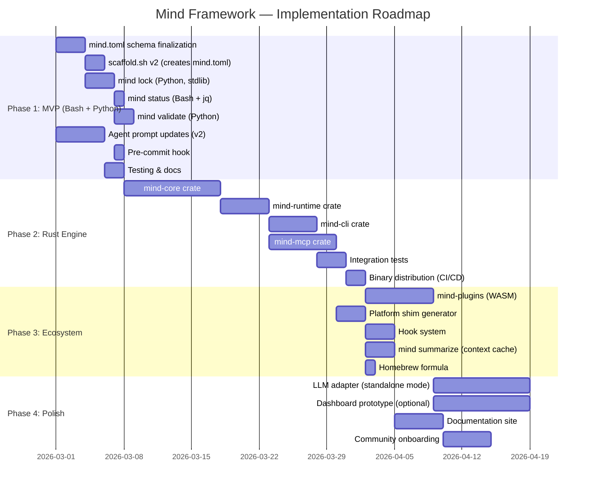

### 12.2 Phase 1: MVP — Validate the Design (2-3 weeks)

**Goal**: Prove the manifest system works end-to-end with zero Rust investment.

**Deliverables**:

| Deliverable | Language | Lines | Purpose |
|-------------|:---:|:---:|---------|
| `mind.toml` JSON Schema | JSON | ~200 | Validation, editor support |
| `scaffold.sh` v2 | Bash | ~500 | Creates `mind.toml`, 4-zone docs, `.mind/` |
| `mind` dispatcher | Bash | ~80 | Subcommand routing |
| `mind-lock.py` | Python | ~200 | Lock file generation (stdlib only) |
| `mind-validate.py` | Python | ~100 | Invariant checks |
| `mind-graph.py` | Python | ~120 | Dependency graph text output |
| `pre-commit` hook | Bash | ~15 | `mind lock --verify` |
| Agent prompt updates | Markdown | ~300 delta | Manifest-aware prompts |
| **Total** | | **~1,500** | |

**Success criteria**:
- `mind lock` generates valid `mind.lock` from `mind.toml` + filesystem
- `mind status` shows project state correctly
- `mind validate` catches invariant violations
- Pre-commit hook blocks commits when lock is stale
- Agents successfully read manifest for context loading

### 12.3 Phase 2: Rust Engine — Performance & Integration (5-7 weeks)

**Goal**: Replace Python/Bash with a single `mind` binary. Add MCP server for agent-agnostic integration.

**Deliverables**:

| Crate | Purpose | Estimated Lines |
|-------|---------|:---:|
| `mind-core` | Manifest, lock, graph, URI, budget, reconcile, workflow | ~3,000 |
| `mind-runtime` | Filesystem, git, process, container, logging adapters | ~1,500 |
| `mind-cli` | CLI commands, output formatting | ~1,200 |
| `mind-mcp` | MCP server with 9 tools + 3 resources | ~800 |
| Tests | Unit + integration | ~2,000 |
| **Total** | | **~8,500** |

**Success criteria**:
- `mind lock` completes in < 100ms for 50 artifacts (10x faster than Python)
- `mind-mcp` serves all MCP tools correctly
- Claude Code, Codex CLI, and Gemini CLI can call MCP tools
- Pre-commit hook adds < 5ms to commit time
- Zero external runtime dependencies (single binary)

### 12.4 Phase 3: Ecosystem — Extensions & Distribution (3-4 weeks)

**Goal**: Plugin system, multi-platform shims, distribution channels.

**Deliverables**:

| Deliverable | Purpose |
|-------------|---------|
| `mind-plugins` crate | WASM plugin host with capability model |
| Shim generator | `mind scaffold --platform {claude,codex,gemini}` |
| Hook system | Lifecycle hooks (pre/post workflow, agent, gate) |
| `mind summarize` | Context summary cache generation |
| Homebrew formula | `brew install mind-framework/tap/mind` |
| Release CI | GitHub Actions: build all targets, publish, checksum |

### 12.5 Phase 4: Polish — Standalone & Dashboard (6-8 weeks, optional)

**Goal**: Enable standalone mode for teams that outgrow agent CLIs. Optional web dashboard.

**Deliverables**:

| Deliverable | Stack | Purpose |
|-------------|:---:|---------|
| LLM adapter | Rust | Direct API calls to OpenAI, Anthropic, Google |
| Standalone orchestrator | Rust | Full workflow execution without agent CLI |
| Dashboard prototype | C# Blazor or Rust Leptos | Team-wide project status, governance visibility |
| Documentation site | mdBook | Framework documentation, guides, API reference |

### 12.6 Effort Summary

| Phase | Duration | Effort | Cumulative Value |
|:---:|:---:|:---:|---------|
| **Phase 1** | 2-3 weeks | 1 developer | Working manifest system, validated design |
| **Phase 2** | 5-7 weeks | 1-2 developers | Fast CLI + MCP server, agent-agnostic |
| **Phase 3** | 3-4 weeks | 1-2 developers | Plugins, multi-platform, distribution |
| **Phase 4** | 6-8 weeks | 2-3 developers | Standalone mode, dashboard (optional) |

**MVP to production**: ~8 weeks with 1 developer. Full ecosystem: ~20 weeks with 2 developers.

---

## 13. Risk Assessment

### 13.1 Technical Risks

| Risk | Likelihood | Impact | Mitigation |
|------|:---:|:---:|-----------|
| **Rust learning curve** limits contributors | Medium | High | Phase 1 in Python validates design first. Core abstractions are well-documented. Go fallback available. |
| **MCP protocol changes** break integration | Low | Medium | Pin to MCP spec version. RMCP SDK handles protocol evolution. Adapters isolate changes. |
| **WASM plugin complexity** delays Phase 3 | Medium | Low | Plugin system is optional. Bash hooks provide 80% of extensibility value. Ship hooks first. |
| **Agent CLI conventions diverge** | Medium | Medium | MCP as integration surface insulates from per-CLI changes. Shim generator abstracts differences. |
| **Large projects exceed performance targets** | Low | Medium | Incremental lock (mtime-based skip) keeps operations sub-second. Profile with real projects in Phase 2. |

### 13.2 Strategic Risks

| Risk | Likelihood | Impact | Mitigation |
|------|:---:|:---:|-----------|
| **Agent CLIs build native manifest support** | Medium | High | Mind Framework's value is the design (reactive graph, reconciliation), not just the tooling. Pivot to spec + reference implementation. |
| **MCP adoption stalls** | Low | Medium | CLI interface works standalone. MCP is additive, not required. |
| **Complexity exceeds "lean" philosophy** | Medium | Medium | Hard line: Phase 2 must ship as a single < 10MB binary. Feature flags for optional capabilities (containers, WASM). |
| **Community prefers different stack** | Medium | Low | Core is isolated behind traits. Alternative runtime implementations possible without changing core logic. |

### 13.3 Risk Mitigation Priority

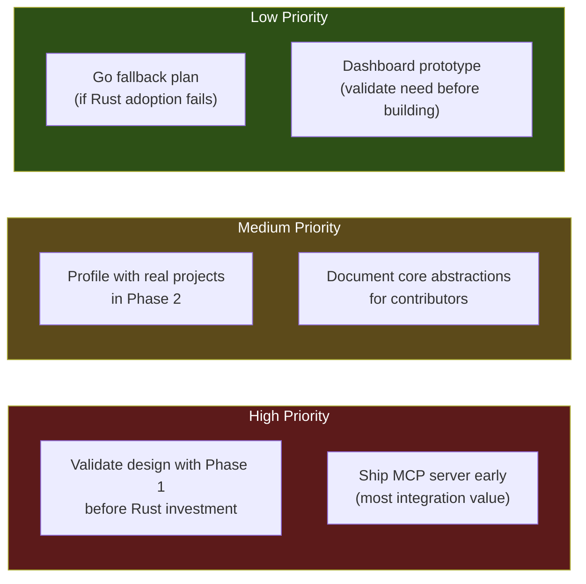

---

## Appendix A: Final Recommendation Matrix

| Decision Point | Recommendation | Confidence | Alternatives |
|---------------|---------------|:---:|------------|
| **Core language** | Rust | High | Go (if contributor pool is a problem) |
| **CLI framework** | clap v4 | High | None needed |
| **Integration surface** | MCP server (rmcp) | High | Direct CLI calls (fallback) |
| **Plugin system** | WASM (wasmtime) | Medium | Bash-only hooks (simpler, less powerful) |
| **Deployment model** | Hybrid incremental | High | Plugin-only (if standalone not needed) |
| **Configuration format** | TOML (already decided) | High | — |
| **Lock file format** | JSON (already decided) | High | — |
| **Git integration** | git2 (libgit2) | High | Shell-out to git (simpler, less portable) |
| **Container integration** | bollard (optional feature) | Medium | Shell-out to docker (simpler) |
| **Distribution** | Cargo + Homebrew + direct download | High | — |
| **Dashboard (future)** | C# Blazor or Rust Leptos | Low | Not needed until Phase 4 |

## Appendix B: Binary Size Estimate

| Crate | Estimated Contribution |
|-------|:---:|
| `mind-core` | ~500KB |
| `mind-runtime` (with git2) | ~3MB |
| `mind-cli` (with clap) | ~800KB |
| `mind-mcp` (with rmcp) | ~1.5MB |
| `mind-plugins` (with wasmtime) | ~4MB |
| **Total (all features)** | **~10MB** |
| **Total (without plugins)** | **~6MB** |

Stripped and compressed: ~4MB without plugins, ~7MB with plugins. Comparable to ripgrep (6MB) and fd (3MB).

---

*This document is the implementation architecture for the Mind Framework. It builds on `MIND-FRAMEWORK.md` (what the system does) and `mind-framework-operational-layer.md` (how operations work at the filesystem level) to specify how the system is built, what technologies it uses, and in what order it should be delivered.*
