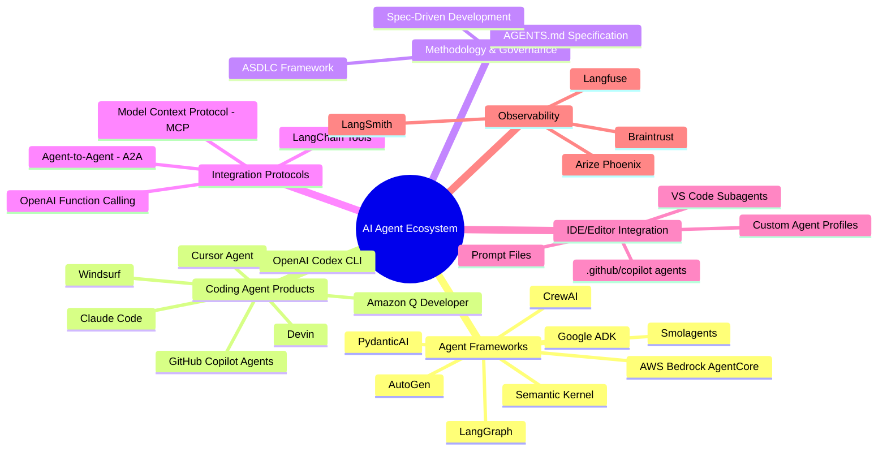
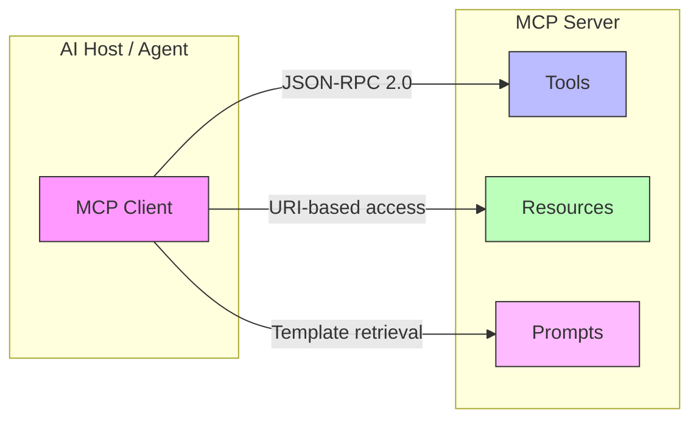
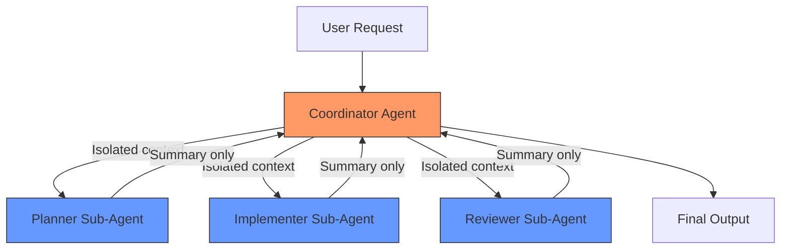
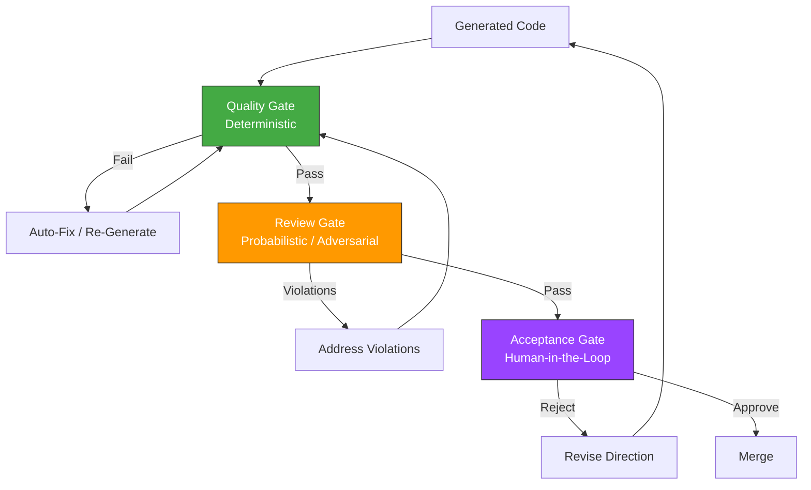
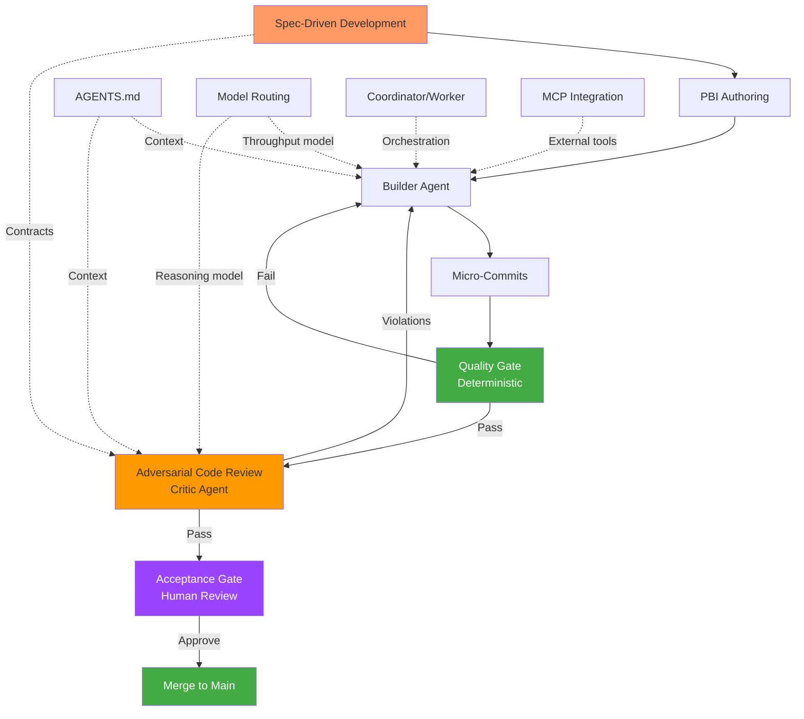
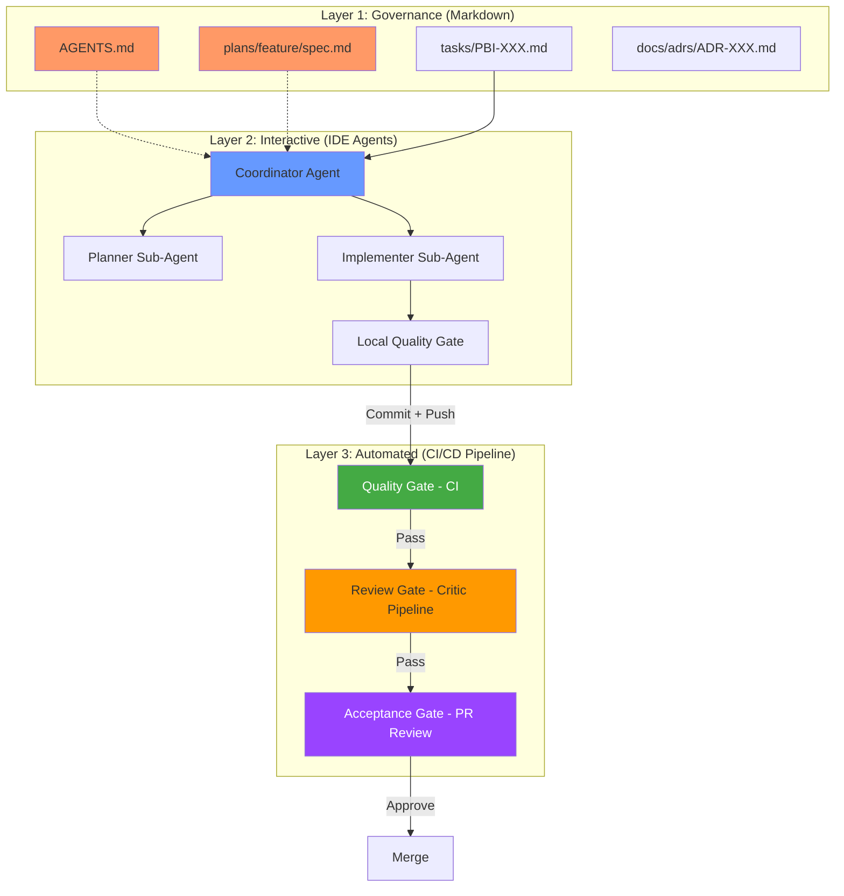

# AI Agent/Sub-Agent Workflow Exploration

## Greenfield Conceptual Analysis — Design Space Discovery & Benchmark Research

**Date:** February 24, 2026
**Type:** Whiteboard / Exploration Exercise
**Scope:** Comprehensive landscape analysis of AI agent/sub-agent development workflows

---

## Table of Contents

- [A) Landscape Overview](#a-landscape-overview)
- [B) Benchmark Analysis](#b-benchmark-analysis)
- [C) Pattern Library](#c-pattern-library)
- [D) Candidate Architecture Directions](#d-candidate-architecture-directions)
- [E) Design Principles for a Future Framework](#e-design-principles-for-a-future-framework)
- [F) Open Questions and Research Gaps](#f-open-questions-and-research-gaps)
- [G) Final Recommendation](#g-final-recommendation)

---

## A) Landscape Overview

### A.1 — The Current State of AI Agent Workflows for Software Development

The AI agent ecosystem for software development has undergone a fundamental transition between 2024 and early 2026. What began as passive autocomplete tools (GitHub Copilot v1, ChatGPT code snippets) has industrialized into autonomous multi-agent systems capable of planning, executing, reviewing, and deploying software across entire repositories.

The shift is best understood through a maturity spectrum:

| Generation | Interaction Model | Example Tools | Capabilities |
|---|---|---|---|
| **Gen 1** — Assistive | Single-turn prompt → response | ChatGPT, early Copilot | Autocomplete, Q&A, snippet generation |
| **Gen 2** — Task-Based | Multi-turn within a single file/context | Cursor Tab, Copilot Chat | File-level refactoring, test generation, debugging |
| **Gen 3** — Conditional Autonomy | Multi-file orchestration with human oversight | Claude Code, Copilot Agents, Devin, Codex CLI | Repository-wide changes, branch management, PR creation, sub-agent delegation |
| **Gen 4** — High Autonomy (Emerging) | Autonomous backlog execution | GitHub Copilot Coding Agent, experimental Devin flows | PBI-to-PR pipelines, autonomous issue resolution |

> **Evidence:** The ASDLC framework (asdlc.io) formalizes this as an SAE J3016-inspired autonomy taxonomy, standardizing at Level 3 (Conditional) as the "practical ceiling" for current production systems. Level 4+ introduces unacceptable risks of silent failure and strategic drift without fundamental advances in verification. [Source: asdlc.io/getting-started]

The ecosystem has fragmented into distinct categories, each addressing different aspects of the agent workflow problem.

### A.2 — Key Categories of Solutions



### A.3 — Major Trends and Recurring Patterns

**Trend 1: From Code Generation to Workflow Orchestration**
The industry has moved past debating whether AI can write code. The frontier is now *how to orchestrate the full software development lifecycle* — from requirements analysis through deployment — with AI agents doing the execution under human governance.

**Trend 2: Spec-Driven Development as the New Paradigm**
Multiple independent sources converge on the same principle: **the specification is the primary source code**, not the implementation. Code becomes a derived artifact that fulfills specification contracts.

> **Evidence:** The ASDLC framework's core axiom is "No Spec, No Build." The Vercel team's AGENTS.md research (2026) confirms that passive context maps outperform active tool retrieval for static knowledge. [Sources: asdlc.io/concepts/spec-driven-development; Vercel Blog, Feb 2026]

**Trend 3: Context Engineering > Prompt Engineering**
The decisive factor in agent effectiveness is not prompt craftsmanship but *context architecture* — what information enters the agent's window, when, and in what form. The Gloaguen et al. (2026) ETH Zurich study on 138 repositories found that LLM-generated context files *reduce* agent task success rates while increasing inference cost by >20%.

> **Evidence:** "Unnecessary requirements in context files actively harm agent performance, not because agents ignore them, but because agents follow them faithfully, broadening exploration and increasing reasoning cost without improving outcomes." [Source: Gloaguen et al., arXiv:2602.11988]

**Trend 4: Separation of Builder and Reviewer Roles**
Production-grade systems consistently separate code generation from code validation into distinct agent sessions. This breaks the "echo chamber" where a model validates its own output.

**Trend 5: Universal Tool Connectivity via MCP**
The Model Context Protocol (Anthropic, now Linux Foundation) has emerged as the "USB-C for AI agents" — a universal client-server protocol that eliminates the M×N integration problem where every framework needed custom connectors for every external tool.

**Trend 6: Token Efficiency as an Architectural Constraint**
Context window management is no longer a nice-to-have but a primary architectural constraint. Sub-agent isolation, context compression, and on-demand loading have become first-class design concerns.

---

## B) Benchmark Analysis

### B.1 — Framework Comparison Matrix

| Dimension | LangGraph | CrewAI | AutoGen | PydanticAI | Semantic Kernel | VS Code Subagents |
|---|---|---|---|---|---|---|
| **Abstraction** | DAG nodes + edges | Role-based personas | Async message passing | Typed function pipelines | Plugin/skill composition | Prompt-file agents |
| **Control Level** | Highly deterministic | Prompt-guided | Dynamic/heuristic | Strict/minimal | Hybrid corporate | Coordinator/worker |
| **State Mgmt** | Persistent checkpointing | Shared crew context | Conversation threads | RunContext injection | Session state | Isolated context windows |
| **Human-in-Loop** | Breakpoints in graph | `human_input=True` | Conversation interrupts | Dependency injection | Plugin hooks | User sees collapsible calls |
| **Type Safety** | Moderate (Python) | Low (prompt-based) | Low | High (Pydantic models) | High (C#/.NET native) | N/A (Markdown config) |
| **MCP Support** | Native integration | `MCPServerStdio` DSL | Limited | Client adapters | Plugin architecture | Built-in MCP servers |
| **Token Efficiency** | Good (graph-scoped) | Poor (full context per agent) | Poor (message accumulation) | Excellent (schema-only) | Good (skill scoping) | Excellent (isolated windows) |
| **Production Readiness** | High | Medium | Medium (research-focused) | High | High | High (IDE-bound) |
| **Learning Curve** | Steep | Low | Very steep | Moderate | Moderate-Steep | Low |
| **Best For** | Auditable enterprise automations | Rapid prototyping, content gen | Multi-agent research | Data processing, API pipelines | .NET/Java enterprise integration | Developer workflow orchestration |

### B.2 — Benchmark: LangGraph (Graph-Based Orchestration)

**What makes it effective:**
- DAG-based execution provides *deterministic* control flow over agent interactions — every transition is an explicit, auditable edge
- Persistent checkpointing enables pause/resume and human-in-the-loop at any node
- Prevents infinite reasoning loops (a critical failure mode in unconstrained agent systems)
- State management is first-class: agents read/write to a shared typed state object

**Strengths:**
- Gold standard for production workflows requiring auditability
- Visual debugging through graph inspection
- Natural fit for quality gate architectures (each gate = a node)

**Weaknesses:**
- Verbose setup for simple workflows; engineering overhead scales with graph complexity
- DAG rigidity can make dynamic task decomposition awkward
- Tightly coupled to the LangChain ecosystem (though improving)

**Reusable idea:** Treat workflow transitions as *explicit, auditable edges* rather than implicit LLM decisions. This is the single most impactful pattern for governance.

### B.3 — Benchmark: CrewAI (Role-Based Collaboration)

**What makes it effective:**
- Anthropomorphized agent roles (with `role`, `goal`, `backstory`) make system design intuitive
- Delegation is organic — the LLM analyzes tool/agent descriptions to route tasks
- Extremely fast prototyping: a working multi-agent crew in <50 lines of code

**Strengths:**
- Lowest barrier to entry for multi-agent workflows
- Natural language agent definitions align with how teams think about roles
- Built-in MCP integration via DSL (`MCPServerStdio`, `MCPServerHTTP`)

**Weaknesses:**
- Non-deterministic routing: the LLM decides delegation, which can be inconsistent in production
- Context sharing is coarse — all agents in a crew share conversation context, causing bloat
- Debugging is difficult when routing decisions are opaque

**Reusable idea:** Role-based agent design with clear `role/goal/backstory` triplets is an excellent *conceptual* model for agent specification, even if the *execution* needs more deterministic control.

**Cautionary lesson:** Organic LLM-based delegation is powerful for exploration but dangerous for production. The gap between "works in demos" and "works reliably at scale" is precisely the delegation determinism.

### B.4 — Benchmark: VS Code Subagents (IDE-Native Orchestration)

**What makes it effective:**
- Subagents run in *isolated context windows* — only the final summary returns to the main agent
- Multiple subagents can execute in *parallel* (e.g., security review + performance review + accessibility review simultaneously)
- Custom agents defined in simple Markdown frontmatter (YAML + instructions)
- Fine-grained tool access: each agent can have restricted tool sets (read-only for reviewers, edit for implementers)
- Agent composition via `agents` frontmatter property restricts which subagents a coordinator can invoke

**Strengths:**
- Zero infrastructure: agents are `.md` files in the repo
- Token efficiency through context isolation is exceptional
- The coordinator/worker pattern is natively supported
- Agent versioning via Git (agent files are version-controlled like code)

**Weaknesses:**
- IDE-bound: the orchestration engine is VS Code, not a standalone runtime
- No persistent state across sessions beyond Git and file system
- Limited to synchronous blocking execution (subagent results must be waited for)
- Experimental features for agent restriction and invocation control

**Reusable ideas:**
1. **Agents-as-Markdown-files** in the repository = version-controlled, peer-reviewed, simple
2. **Context isolation through spawning** = each specialist gets a clean window
3. **Tool restriction per role** = reviewers can only read, implementers can edit
4. **Parallel multi-perspective review** = run 4 reviewers simultaneously, synthesize results

> **Evidence:** The VS Code TDD example (Red → Green → Refactor as separate restricted subagents) demonstrates how workflow patterns can be encoded as agent orchestration constraints. [Source: code.visualstudio.com/docs/copilot/agents/subagents]

### B.5 — Benchmark: ASDLC Framework (Methodology + Governance)

**What makes it effective:**
The ASDLC is not a framework in the programming sense — it is a *methodology* that defines how agent-based development should be governed. Its power lies in treating AI agents as industrial infrastructure rather than assistants.

**Core architecture — three layers:**

| Layer | Function | Human Role |
|---|---|---|
| **Context** | Supply chain of requirements, schemas, specs | Curator |
| **Agents** | Logistics — moving information, generating code, running tests | Operator |
| **Gates** | Quality control — deterministic checks + human oversight | Governor |

**Key innovations:**

1. **Context Gates (Dual-Mandate Architecture)**
   - *Input Gates*: Filter/compress context entering an agent session (Summary Gates for cross-session transfer, Context Filtering for within-session)
   - *Output Gates*: Validate artifacts through three tiers:
     - Quality Gates (deterministic: compilers, tests, linters)
     - Review Gates (probabilistic: Critic Agent validates against Spec)
     - Acceptance Gates (human: strategic fit, product vision)
     - Denial Gates (prevention: block forbidden operations like `git push` without verification)

2. **Adversarial Code Review Pattern**
   - Builder Agent (optimized for throughput) generates code
   - Critic Agent (optimized for reasoning) reviews against spec *in a separate session*
   - Context swap (fresh session) breaks the "echo chamber"
   - Validated in production: Claudio Lassala (Jan 2026) caught `LoadAll().Filter()` anti-pattern that passed all automated tests

3. **Spec-Driven Development (State vs Delta)**
   - The Spec defines *how the system works* (permanent, evolving state)
   - The PBI defines *what changes* (transient execution unit)
   - This separation prevents specification bloat and ensures agents always have a stable reference

4. **AGENTS.md as Minimal Context Anchor**
   - Toolchain-First: if a constraint can be enforced by a linter/compiler, it does NOT belong in AGENTS.md
   - Judgment Boundaries: NEVER / ASK / ALWAYS behavioral rules for decisions tools can't enforce
   - Context Map: orientation tool for architectural understanding, not file navigation

5. **Model Routing**
   - Different model capabilities for different roles:
     - High Reasoning (architecture, debugging): Gemini 3 Deep Think, DeepSeek V3.2
     - High Throughput (code gen, refactoring): Gemini 3 Flash, Claude Haiku 4.5
     - Massive Context (legacy analysis): Gemini 3 Pro (5M), Claude 4.5 Sonnet (500k)

**Strengths:**
- Most rigorous governance framework available
- Evidence-based: cites empirical research (Gloaguen et al. 2026, Lassala 2026)
- Tool-agnostic: works with Cursor, Claude Code, Windsurf, any agent platform
- Addresses the full lifecycle, not just code generation

**Weaknesses:**
- Manual orchestration required (as of Feb 2026 — no automated pipeline tooling)
- High adoption friction for teams not already practicing spec-driven development
- Gate hierarchy is conceptual — no reference implementation for programmatic enforcement
- Heavy documentation burden upfront

**Reusable ideas:**
- Three-tier gate hierarchy is the most robust quality model discovered
- AGENTS.md minimal-by-design philosophy backed by empirical evidence
- State vs Delta separation is a clean, scalable way to manage specifications
- Model routing by capability profile (not just cost optimization)

### B.6 — Benchmark: Model Context Protocol (MCP)

**What makes it effective:**
MCP solves the "M×N integration problem" — previously, every agent framework needed custom connectors for every external tool (Slack + AutoGen, Slack + CrewAI, Slack + LangGraph = 3 separate implementations). MCP standardizes this into a universal client-server protocol.

**Architecture:**



**Three Core Primitives:**
1. **Tools** — Parameterized actions the LLM invokes (write code, execute deploy, run query)
2. **Resources** — Read-only data exposed as URIs (files, database dumps, API responses)
3. **Prompts** — Pre-fabricated templates stored server-side (centralizes few-shot patterns)

**Transport Layer:**
- **Stdio** — Local processes via stdin/stdout, zero latency, maximum security (data stays on machine)
- **Streamable HTTP** — Remote servers via POST + Server-Sent Events for streaming results

**Token efficiency advantage:**
Traditional approaches inject *all* tool definitions into every prompt (80+ function definitions × every turn = massive token waste). MCP activates tools *on-demand*: the server only presents relevant tools when queried, and filters verbose responses before they enter the LLM's context.

> **Evidence:** "The model of execution of the MCP protocol eliminates massive cost deficit by delegating the primary logical burden. It protects the context by filtering verbose responses within the structured limit of the Server before any data reaches the LLM abstraction." [Source: project-research.md, citing multiple industry analyses]

**Reusable idea:** Any future framework should be MCP-native. Custom tool integrations should use MCP servers, not framework-specific wrappers.

### B.7 — Benchmark: The "Convergence Stack" (LangGraph + PydanticAI + MCP)

Multiple independent sources identify the same optimal technology combination for production systems:

| Layer | Technology | Role |
|---|---|---|
| **Orchestration** | LangGraph | Control flow, state management, gate enforcement |
| **Agent Execution** | PydanticAI | Type-safe tool calls, schema validation, dependency injection |
| **External Integration** | MCP | Universal tool connectivity, resource access, prompt management |

**How it works conceptually:**
1. LangGraph defines the workflow as a DAG (nodes = agent steps, edges = transitions with conditions)
2. Each node instantiates a PydanticAI agent with strict typed inputs/outputs
3. When agents need external capabilities (databases, APIs, monitoring), they use MCP clients
4. State flows through the graph via typed state objects; gates are nodes with pass/fail edges

**Why this combination wins:**
- LangGraph provides the *skeleton* (deterministic flow control)
- PydanticAI provides the *muscles* (type-safe execution at each node)
- MCP provides the *nervous system* (universal connectivity to the external world)

**Cautionary note:** This stack is powerful but complex. It requires Python expertise across three libraries and carries significant debugging overhead when things go wrong inside the graph.

### B.8 — Benchmark: Claude Code (CLI-First Agent Workflow)

**What makes it effective:**
- Terminal-native: runs as a CLI tool in any development environment
- Autonomous mode: can execute multi-file changes with tool use (file read/write, shell commands, web search)
- Built-in checkpointing: automatic snapshots before every file edit, with `/rewind` to restore
- Git-aware: understands repository structure, can create branches and commits
- Extended thinking: uses internal reasoning chains for complex decisions

**Strengths:**
- Zero-config: works immediately on any repository
- Session memory: learns from project context during a session
- CLAUDE.md convention: project-level instructions loaded automatically from repo root
- Sub-agent spawning: can delegate tasks to isolated sub-processes

**Weaknesses:**
- No persistent memory across sessions (session-scoped only)
- No built-in quality gate automation (validation is advisory)
- Checkpoint system doesn't track shell-command changes (only file edits via its own tools)
- Single-model: tied to Anthropic's Claude models

**Reusable ideas:**
1. CLI-first design for maximum environment flexibility
2. Automatic checkpointing as a safety net for probabilistic outputs
3. `.claude/` directory convention for project-specific agent configuration
4. Sub-agent delegation for context isolation

---

## C) Pattern Library (Conceptual)

### C.1 — Recommended Patterns

#### Pattern 1: Coordinator/Worker with Context Isolation



**How it works:** A coordinator agent manages the overall task. Sub-agents operate in isolated context windows, receiving only the specific subtask. Only the summary returns to the coordinator.

**When it works best:**
- Complex multi-file features
- Tasks requiring different expertise (planning vs implementation vs review)
- When context budget is a concern (each sub-agent has a clean window)

**Trade-offs:**
- ✅ Token efficiency through isolation
- ✅ Parallel execution possible
- ✅ Each agent can use different tools/models
- ⚠️ Communication overhead (coordinator must synthesize results)
- ⚠️ Sub-agents lack awareness of each other's work
- ⚠️ Coordinator becomes a bottleneck/single point of failure

> **Evidence:** VS Code Subagents implement exactly this pattern. GitHub's Custom Agents configuration supports it via `agents` frontmatter. [Source: code.visualstudio.com/docs/copilot/agents/subagents]

---

#### Pattern 2: Three-Tier Quality Gates



**How it works:**
1. **Quality Gate** (deterministic): Compilation, linting, type checking, automated tests. Binary pass/fail. Agents can self-correct against these.
2. **Review Gate** (probabilistic, adversarial): A Critic Agent validates code against the Spec in a *separate session*. Catches semantic violations, anti-patterns, edge cases.
3. **Acceptance Gate** (human): Strategic fit, product vision alignment, UX review. Only humans can assess "is this the right thing to build?"

**When it works best:**
- Any production workflow where quality is non-negotiable
- Teams transitioning from "vibe coding" to disciplined agent development
- Systems where spec compliance is auditable

**Trade-offs:**
- ✅ Catches 3 categories of errors: syntactic, semantic, strategic
- ✅ Each tier has clear, distinct pass/fail criteria
- ✅ Reduces human review burden (gates filter obvious issues)
- ⚠️ Adds latency (3+ validation steps per change)
- ⚠️ Review Gate depends on Spec quality (vague specs → vague critiques)
- ⚠️ Currently requires manual orchestration (no automated pipeline tooling)

> **Evidence:** ASDLC's Context Gates pattern. Validated by Claudio Lassala (Jan 2026) in production. [Source: asdlc.io/concepts/context-gates]

---

#### Pattern 3: Spec-Driven Development with State/Delta Separation

**How it works:**
- The **Spec** is the permanent, authoritative description of how the system works. It evolves with the system. Agents read it to understand system contracts and constraints.
- The **PBI** (Product Backlog Item) is a transient execution unit describing *what changes*. It is consumed by agents, executed, and archived.
- The separation prevents specification documents from becoming bloated task lists.

**When it works best:**
- Any system larger than a weekend project
- Teams with multiple developers/agents touching the same codebase
- When agent sessions are stateless and need reliable context about system behavior

**Trade-offs:**
- ✅ Agents always have a stable, comprehensive reference (the Spec)
- ✅ PBIs are small, bounded, and disposable
- ✅ Clear traceability: PBI → commits → Spec updates
- ⚠️ Upfront investment in writing and maintaining specs
- ⚠️ Requires discipline to keep specs current after implementation

---

#### Pattern 4: Adversarial Code Review (Builder/Critic Separation)

**How it works:**
1. **Builder Agent** (throughput-optimized model) implements the PBI
2. **Context Swap**: Start a *fresh* session for review
3. **Critic Agent** (reasoning-optimized model) receives only the Spec + code diff
4. Critic produces PASS or a list of spec violations with remediation paths
5. On FAIL: violations feed back to Builder as a new task
6. Loop until PASS, then proceed to human Acceptance Gate

**When it works best:**
- Any code generation workflow where correctness matters
- When using models that are known to "double down" on their own errors
- Systems where architectural constraints must be enforced beyond what linters catch

**Trade-offs:**
- ✅ Breaks echo chamber effect (fresh session = independent evaluation)
- ✅ Leverages model routing (different models for different roles)
- ✅ Critic output is actionable (violation + impact + remediation)
- ⚠️ Manual orchestration required (session switching)
- ⚠️ Doubles inference cost (two sessions per change)
- ⚠️ Critic effectiveness depends on spec clarity

> **Evidence:** Validated in production by Claudio Lassala (Jan 2026). The Critic caught a `LoadAll().Filter()` anti-pattern that passed all automated tests — a silent performance bug that would have failed at scale. [Source: asdlc.io/patterns/adversarial-code-review]

---

#### Pattern 5: Micro-Commits as Rollback Checkpoints

**How it works:**
Every discrete agent task gets its own commit: one function, one test, one config change. Commits serve as "save points in a game" — enabling instant rollback when probabilistic outputs go wrong.

**When it works best:**
- Any LLM-assisted code generation workflow
- Complex refactoring with regression risk
- Experimental "spikes" that might need total rollback

**Trade-offs:**
- ✅ Granular rollback when file 4 of 10 goes wrong
- ✅ Commit messages become an execution log for debugging
- ✅ Enables `git bisect` to pinpoint where agent output drifted
- ⚠️ Noisy commit history (mitigated by squash before merge)
- ⚠️ Requires discipline that goes against traditional "logical unit" commit habits

> **Evidence:** Addy Osmani's 2026 LLM workflow guide emphasizes commits as "save points in a game." ASDLC formalizes this as a standard practice. [Source: asdlc.io/practices/micro-commits]

---

#### Pattern 6: AGENTS.md — Minimal Context Anchor

**How it works:**
A single markdown file at the repository root provides the minimal, high-signal context that agents need to work effectively. ​*Only* content that cannot be expressed by toolchain configuration belongs here.

**Key sections:**
1. **Mission** — 2-4 sentences of domain context (what makes THIS project different)
2. **Toolchain Registry** — Commands only, no explanation of what tools enforce
3. **Judgment Boundaries** — NEVER / ASK / ALWAYS rules for decisions tools can't make
4. **Persona Registry** — Names and invocation paths, not full definitions
5. **Context Map** — High-level architecture orientation (optional)

**Anti-pattern to avoid:** Dumping every coding convention, style rule, and naming standard into the file. Research *proves* this hurts performance.

**When it works best:**
- Every repository using AI agents
- Cross-tool compatibility (works with Cursor, Windsurf, Claude Code, Copilot)

**Trade-offs:**
- ✅ Empirically validated: minimal outperforms verbose
- ✅ Cross-tool compatibility via symlinks (`ln -s AGENTS.md CLAUDE.md`)
- ✅ Version-controlled, peer-reviewed like code
- ⚠️ Requires active curation (audit out migrated constraints)
- ⚠️ Research base is still young (one major study, N=138 repos)

> **Evidence:** Gloaguen et al. (2026, ETH Zurich): LLM-generated context files reduce performance. Developer-written minimal files provide only +4% improvement — and only when precise. [Source: arXiv:2602.11988]

---

#### Pattern 7: Model Routing by Capability Profile

**How it works:**
Instead of using one model for everything, assign models based on the *capability profile* required by each task:

| Profile | Use Case | Model Examples |
|---|---|---|
| **High Reasoning** | Architecture decisions, debugging, spec review | Gemini 3 Deep Think, DeepSeek V3.2 |
| **High Throughput** | Code generation, refactoring, bulk changes | Gemini 3 Flash, Claude Haiku 4.5, Llama 4 Scout |
| **Massive Context** | Legacy analysis, large codebase comprehension | Gemini 3 Pro (5M), Claude 4.5 Sonnet (500k) |

**When it works best:**
- Production workflows where cost optimization matters
- Tasks with clear separation between "thinking" and "doing"
- Multi-agent systems where each agent role has different requirements

**Trade-offs:**
- ✅ Significant cost reduction (throughput models cost 5-20x less than reasoning models)
- ✅ Better results: reasoning tasks get reasoning models, not fast-but-shallow ones
- ⚠️ Routing decisions add complexity
- ⚠️ Model availability and performance change rapidly (routing tables need updating)

---

### C.2 — Anti-Patterns

#### Anti-Pattern 1: Self-Validation (Same Session Review)

**What it is:** Asking the same agent that wrote the code to also review it, within the same conversation session.

**Why it fails:** LLMs exhibit confirmation bias — they will "confidently affirm that buggy logic is correct because it matches the plausible pattern in training data." The same context window that produced the bug rationalizes the bug.

**Correction:** Adversarial Code Review pattern — always use a *fresh session* and ideally a *different model* for review.

---

#### Anti-Pattern 2: Context Maximalism (Verbose AGENTS.md)

**What it is:** Loading every possible convention, rule, pattern, and codebase description into the agent's context file.

**Why it fails:** Agents follow instructions faithfully. More instructions = broader exploration = higher cost = lower task success rate. The signal gets buried in noise.

**Correction:** AGENTS.md minimal-by-design. Toolchain-first principle: if a linter enforces it, don't restate it.

---

#### Anti-Pattern 3: Organic Delegation (LLM-Decided Routing in Production)

**What it is:** Letting the LLM decide which sub-agent should handle a task based on natural language descriptions, with no fallback or constraint.

**Why it fails:** Non-deterministic routing leads to inconsistent behavior. The same request may be routed differently on different runs. In production, this creates unpredictable outcomes and debugging nightmares.

**Correction:** Deterministic routing (graph edges) or constrained delegation (explicit `agents` list in frontmatter). LLM-based routing is acceptable for *exploration* but not for *production pipelines*.

---

#### Anti-Pattern 4: Monolithic Agent Sessions (No Context Boundaries)

**What it is:** Running increasingly long conversations with a single agent, accumulating tool outputs, errors, intermediate reasoning, and debugging context in one session.

**Why it fails:** Context pollution. The agent becomes "tipsy, wobbling from side-to-side" (Nick Tune, 2026). Signal-to-noise ratio drops catastrophically after extended sessions.

**Correction:** Context Gates. Sub-agent isolation. Summary gates for cross-session handoffs.

---

#### Anti-Pattern 5: Coarse-Grained Commits in Agentic Workflows

**What it is:** Traditional "logical unit of work" commits that bundle multiple agent-generated changes into a single commit.

**Why it fails:** LLM output is probabilistic. Correct code in files 1-3 and a subtle bug in file 4, all in one commit, means rollback destroys the good work.

**Correction:** Micro-commits. Commit after every discrete task. Squash before merge if clean history is needed.

---

#### Anti-Pattern 6: Framework Lock-In

**What it is:** Building the entire workflow system on a single framework's abstractions (e.g., LangChain-only tooling, CrewAI-only orchestration).

**Why it fails:** The agent framework ecosystem is evolving rapidly. Frameworks that are dominant today may be superseded in 6 months. Tight coupling makes migration painful and expensive.

**Correction:** Agent-agnostic design. MCP for tool integration. Specs and context as portable Markdown. Orchestration logic separated from agent execution.

---

### C.3 — Pattern Interaction Map



---

## D) Candidate Architecture Directions

### D.1 — Direction A: "Methodology-First, Toolchain-Agnostic" (ASDLC-Aligned)

**Concept:** Build a governance framework — not a software library — that defines specifications, gates, workflows, and patterns as portable Markdown documents. The actual agent execution happens through whatever tools the team uses (Claude Code, Cursor, Copilot, etc.). The framework provides the *structure*, not the *runtime*.

**How it would work:**
- `AGENTS.md` at repo root (minimal context anchor)
- `plans/{feature}/spec.md` for specifications
- `tasks/PBI-XXX.md` for execution units
- `docs/adrs/` for architecture decisions
- Gate definitions as checklists in Markdown
- Model routing recommendations per agent role

**Operational model:**
```
Human writes Spec → Creates PBI → Agent implements → Quality Gate (CI) → 
Review Gate (manual Critic session) → Acceptance Gate (PR review) → Merge
```

**Pros:**
- Zero infrastructure: works with any agent tool
- Maximum portability: pure Markdown + Git
- Low adoption friction: start with AGENTS.md, add incrementally
- Aligns with proven ASDLC methodology

**Cons:**
- Manual orchestration: no automated gate enforcement
- Discipline-dependent: requires team commitment to the process
- No programmatic workflow execution
- Gates are advisory, not preventive (no Denial Gates without custom Git hooks)

**Operational complexity:** Low
**Scalability:** Good for methodology, limited for automation

---

### D.2 — Direction B: "Prompt-File Orchestration" (VS Code Native)

**Concept:** Use VS Code's custom agent system as the orchestration layer. Define agents as `.md` files with YAML frontmatter (tools, model, sub-agent restrictions). The IDE handles context isolation, parallel execution, and tool access.

**How it would work:**
- `.github/agents/coordinator.md` — main orchestrator
- `.github/agents/planner.md` — read-only research agent
- `.github/agents/implementer.md` — edit-capable code agent
- `.github/agents/critic.md` — review agent with reasoning model
- `.github/agents/tester.md` — test generation agent
- MCP servers for external integrations

**Operational model:**
```
User invokes Coordinator → Coordinator spawns Planner (isolated) → 
Planner returns plan → Coordinator spawns Implementer → 
Implementer returns code → Coordinator spawns Critic + Tester (parallel) → 
Results synthesized → Human acceptance
```

**Pros:**
- Native IDE integration (zero external tooling)
- Context isolation is built-in (subagent windows)
- Parallel execution supported
- Fine-grained tool access per agent
- Version-controlled agents (Git-native)
- Model routing via `model` frontmatter

**Cons:**
- IDE-bound: only works in VS Code (or compatible editors adopting the same spec)
- No persistent orchestration state across sessions
- Coordinator agent has limited "memory" of past orchestrations
- Experimental features (agent restrictions, invocation control)

**Operational complexity:** Medium
**Scalability:** Good for individual developers, limited for CI/CD integration

---

### D.3 — Direction C: "Programmatic Orchestration" (Code-Based Pipeline)

**Concept:** Build the workflow as code using the convergence stack (LangGraph for orchestration, PydanticAI for typed agent execution, MCP for integrations). The entire pipeline — from spec loading through gate enforcement — runs as a programmatic DAG.

**How it would work:**
- Python package defining the workflow graph
- Nodes for each phase: spec-loading, planning, implementation, quality-gate, review-gate, acceptance-gate
- State object flowing through the graph with typed checkpoints
- MCP clients for external tool access
- CI/CD integration for automated gate execution

**Operational model:**
```python
# Conceptual pseudocode
graph = StateGraph(WorkflowState)
graph.add_node("load_spec", load_spec_node)
graph.add_node("plan", planner_agent_node)
graph.add_node("implement", builder_agent_node)
graph.add_node("quality_gate", run_tests_and_lint)
graph.add_node("review_gate", critic_agent_node)
graph.add_node("acceptance_gate", human_approval_node)

graph.add_edge("load_spec", "plan")
graph.add_edge("plan", "implement")
graph.add_edge("implement", "quality_gate")
graph.add_conditional_edges("quality_gate", {
    "pass": "review_gate",
    "fail": "implement"  # retry
})
graph.add_conditional_edges("review_gate", {
    "pass": "acceptance_gate",
    "violations": "implement"  # address violations
})
```

**Pros:**
- Fully automated pipeline execution
- Deterministic flow control (explicit edges, no organic routing)
- Persistent state and checkpointing (pause/resume)
- Enforceable Denial Gates (programmatic, not advisory)
- CI/CD native: can be triggered by PR events, cron, webhooks
- Maximum auditability (every transition is logged)

**Cons:**
- High implementation complexity (Python + 3 libraries)
- Steep learning curve (LangGraph, PydanticAI, MCP)
- Tight coupling to the Python ecosystem
- Over-engineered for small projects or individual developers
- Debugging graph execution requires specialized tooling

**Operational complexity:** High
**Scalability:** Excellent for teams and CI/CD pipelines

---

### D.4 — Direction D: "Layered Hybrid" (Methodology + Prompt-File + Programmatic)

**Concept:** A three-layer architecture where governance is methodology-based (Markdown), interactive development uses prompt-file agents, and CI/CD pipelines use programmatic orchestration. Each layer serves a different operational context.

**How it would work:**

| Layer | Context | Implementation | Authority |
|---|---|---|---|
| **Governance** | Always active | AGENTS.md, Specs, PBIs, ADRs (Markdown) | Methodology documents define contracts |
| **Interactive** | Developer working in IDE | VS Code custom agents (`.md` files with YAML) | IDE orchestrates sub-agents per workflow |
| **Automated** | CI/CD pipeline | Programmatic DAG (LangGraph/PydanticAI/MCP) | Pipeline enforces gates on PR events |

**Operational model:**
```
[Layer 1: Governance — always present]
AGENTS.md + Specs + PBIs → define what to build and how

[Layer 2: Interactive — developer context]
Developer invokes IDE agent → Coordinator delegates to sub-agents → 
Code generated with micro-commits → Local quality gate (lint/test)

[Layer 3: Automated — CI/CD context]  
PR created → Pipeline triggers → Quality Gate (CI) → Review Gate (Critic Agent
in programmatic pipeline) → Human Acceptance Gate (PR review UI)
```



**Pros:**
- Each layer serves its optimal context (governance = Markdown, interactive = IDE, automated = code)
- Methodology is portable (works even without IDE/CI layers)
- Incremental adoption: start with Layer 1, add layers as team matures
- Gate enforcement scales from advisory to automated
- Agent-agnostic at Layer 1, semi-bound at Layer 2, fully programmable at Layer 3
- Clean separation of concerns: what (governance) vs how (interactive) vs enforce (automated)

**Cons:**
- Most complex architecture to design and maintain
- Three technology surfaces to keep consistent
- Risk of drift between layers if contracts aren't enforced
- Requires buy-in at multiple levels (methodology + IDE setup + CI/CD pipelines)

**Operational complexity:** High (but layered, so each layer is individually manageable)
**Scalability:** Excellent — each layer scales independently

---

### Direction Comparison Matrix

| Dimension | A: Methodology | B: Prompt-File | C: Programmatic | D: Layered Hybrid |
|---|---|---|---|---|
| Infrastructure Required | None | VS Code | Python runtime | All |
| Adoption Friction | Low | Low-Medium | High | Medium (incremental) |
| Gate Enforcement | Advisory | Semi-automated | Fully automated | Progressive |
| Agent Agnostic | Yes | VS Code-bound | Python-bound | Partially |
| CI/CD Integration | Manual | Limited | Native | Native (Layer 3) |
| Solo Developer Fit | Good | Excellent | Over-engineered | Good (Layer 1+2) |
| Team/Enterprise Fit | Good | Good | Excellent | Excellent |
| Debugging Ease | High (it's Markdown) | Medium | Low (graph debugging) | Varies by layer |
| Incrementality | Inherent | Moderate | Big-bang | Inherent |

---

## E) Design Principles for a Future Framework

Based on the landscape analysis, benchmark research, and pattern library, the following principles should guide any future implementation:

### Principle 1: Canonical Organization

> Every artifact has one home, one format, and one source of truth.

**Rationale:** Agent effectiveness degrades when context is scattered across Slack threads, wiki pages, and undocumented team knowledge. The `.agent/` directory paradigm and ASDLC's structured artifact layout demonstrate that canonical organization directly improves agent performance.

**Implications:**
- Specs live in `plans/{feature}/spec.md`
- PBIs live in `tasks/PBI-XXX.md`
- ADRs live in `docs/adrs/`
- Agent configurations live in `.github/agents/` (or `.claude/agents/`)
- No duplication across locations

---

### Principle 2: Traceability

> Every output should be traceable back to a requirement, and every requirement forward to its implementation.

**Rationale:** Without traceability, agent-generated code becomes an opaque artifact with no connection to business intent. Micro-commits, PBI → commit mapping, and spec → implementation links create a complete audit trail.

**Implications:**
- PBI IDs in commit messages
- Spec references in implementation files
- ADR references in architectural changes
- PR descriptions link to PBIs and Specs

---

### Principle 3: Modularity

> Components should be independently deployable, replaceable, and testable.

**Rationale:** The agent ecosystem is evolving rapidly. Today's optimal model, framework, or integration will be different in 6 months. Modular design allows component replacement without system-wide disruption.

**Implications:**
- Agent definitions are separate files (not embedded in orchestration code)
- MCP for tool integration (not framework-specific wrappers)
- Gate definitions are parameterized (not hard-coded)
- Model selection is configuration, not code

---

### Principle 4: Agent-Agnostic Design

> The framework should work regardless of which AI model, IDE, or agent tool is used.

**Rationale:** Vendor lock-in is the most expensive anti-pattern in a fast-moving ecosystem. The ASDLC's tool-agnostic methodology and MCP's universal protocol demonstrate that portability is achievable.

**Implications:**
- Governance artifacts (Specs, PBIs, ADRs, AGENTS.md) are pure Markdown
- Orchestration patterns are described in terms of *roles*, not *tools*
- Tool-specific configurations are thin adapters, not core logic
- Cross-tool compatibility via conventions (AGENTS.md → CLAUDE.md symlink)

---

### Principle 5: Token Efficiency

> Context is the most expensive resource. Treat it as a first-class architectural constraint.

**Rationale:** Gloaguen et al. (2026) proved that verbose context *hurts* agent performance. VS Code's subagent isolation demonstrates how context budgets can be managed architecturally. Every token in the context window should earn its place.

**Implications:**
- AGENTS.md is minimal (toolchain-first)
- Sub-agent isolation prevents context accumulation
- Summary gates compress cross-session handoffs
- On-demand loading (agents read detailed docs only when needed)
- Model routing optimizes cost (throughput models for generation, reasoning for review)

---

### Principle 6: Reliability Through Gates

> Trust but verify — at multiple levels, with different verification methods.

**Rationale:** Probabilistic outputs require probabilistic verification layered on deterministic checks layered on human judgment. No single verification method catches all failure modes.

**Implications:**
- Quality Gates (compilers, tests, linters) catch syntactic errors
- Review Gates (Critic Agent) catch semantic violations
- Acceptance Gates (human review) catch strategic misalignment
- Denial Gates (hooks/middleware) prevent forbidden operations
- Each gate has explicit pass/fail criteria

---

### Principle 7: Maintainability

> The framework itself must be maintainable by the team that uses it.

**Rationale:** Over-engineered frameworks become shelfware. The system must be simple enough to understand, modify, and evolve without specialized expertise.

**Implications:**
- Markdown > complex DSLs for governance artifacts
- Git as the primary state management mechanism
- Documentation that is part of the workflow, not separate from it
- Incremental adoption (teams can start with one principle and add more)

---

### Principle 8: Extensibility

> New capabilities should integrate without modifying the core.

**Rationale:** Agent capabilities are expanding rapidly. New MCP servers appear weekly. New model capabilities emerge monthly. The framework must accommodate growth without rewrites.

**Implications:**
- MCP servers for external integrations (plug-and-play)
- Custom agent definitions via Markdown files
- Plugin patterns for gate extensions
- Adapter layer for new tools/frameworks

---

## F) Open Questions and Research Gaps

### F.1 — Questions Requiring Experimentation

1. **Automated Adversarial Review Pipeline:**
   The Adversarial Code Review pattern is validated but currently manual. Can it be reliably automated as a CI/CD step (e.g., GitHub Action that spawns a Critic Agent on every PR)?
   - *Key risk:* Critic Agent consistency across runs (probabilistic outputs mean different runs may flag different issues)
   - *Mitigation to test:* Multiple Critic runs with majority-vote aggregation

2. **Cross-Session Memory Mechanisms:**
   All current agent systems are session-scoped. What's the optimal mechanism for persistent memory across sessions?
   - *Options:* `docs/current.md` workflow state file, Git-based breadcrumbs, vector store (RAG), structured JSON memory file
   - *Need to validate:* Which approach provides the best signal-to-noise ratio for long-running features?

3. **Gate Automation Latency Budget:**
   Three-tier gates add latency. What's the acceptable latency budget for developer workflow?
   - Quality Gate (CI): typically 2-10 minutes
   - Review Gate (Critic Agent API call): 30-120 seconds
   - Acceptance Gate (human): variable
   - *Need to validate:* At what total latency does developer adoption drop?

4. **AGENTS.md Optimal Length:**
   Gloaguen et al. showed minimal outperforms verbose. But *how minimal* is optimal? Is there a token count sweet spot?
   - *Need to validate:* Conduct A/B testing across repository sizes and complexity levels

### F.2 — Questions Requiring Deeper Research

5. **A2A (Agent-to-Agent) Protocol Maturity:**
   Can agents built with different frameworks (LangGraph agent + CrewAI agent + Semantic Kernel agent) collaborate reliably via MCP-based A2A communication?
   - *Current state:* Conceptually validated, limited production evidence
   - *Risk:* Protocol overhead, semantic translation errors, debugging complexity

6. **Denial Gate Implementation Patterns:**
   What's the most robust way to implement Denial Gates (preventing agents from executing forbidden operations)?
   - *Options:* Git pre-push hooks, shell wrappers, MCP server-side tool filtering, CI/CD pipeline gates
   - *Each has trade-offs between security, DX friction, and bypass potential

7. **Model Routing Automation:**
   Can model routing be automated based on task classification, or does it need explicit per-agent configuration?
   - *Risk:* Automatic routing adds another probabilistic decision layer

8. **Long-Running Feature Context Management:**
   For features that span weeks and multiple developers/agents, what's the optimal state management approach?
   - *Options:* Living spec updates, progress files (Ralph Loop pattern), iteration archives, Git branch state

### F.3 — Areas Needing Validation Before Commitment

9. **Layered Hybrid Architecture Coherence:**
   Direction D (Layered Hybrid) is theoretically optimal but unvalidated in practice. The risk of drift between governance, interactive, and automated layers needs practical testing.

10. **Spec Quality as a Bottleneck:**
    Every pattern in this exploration depends on spec quality. If specs are vague, Critic Agents produce vague critiques, PBIs are ambiguous, and Quality Gates miss semantic issues. What's the minimal viable spec template?

11. **Team Adoption Path:**
    What's the realistic adoption sequence for a team transitioning from ad-hoc agent use to a governed workflow?
    - *Hypothesis:* AGENTS.md → Micro-Commits → Spec-Driven Development → Quality Gates → Review Gates → Acceptance Gates
    - *Needs validation through team pilots*

---

## G) Final Recommendation (Exploration Outcome)

### Recommended Conceptual Direction: Layered Hybrid (Direction D)

**Why it is the best starting point:**

1. **Incremental adoption.** Unlike programmatic orchestration (Direction C) which requires significant upfront investment, the Layered Hybrid allows teams to start with governance documents (Layer 1) and progressively add IDE agents (Layer 2) and CI/CD automation (Layer 3) as they mature.

2. **Agent-agnostic at the foundation.** Layer 1 (governance) is pure Markdown and Git. It works with Claude Code, Cursor, Copilot, or any future tool. This protects against the rapid ecosystem churn that makes framework lock-in dangerous.

3. **Progressive gate enforcement.** Gates start as advisory checklists (Layer 1), become semi-automated through IDE agent workflows (Layer 2), and reach full automation in CI/CD (Layer 3). This matches team maturity: you don't automate what you haven't mastered manually.

4. **Empirically grounded.** The governance layer aligns with ASDLC (the most rigorous methodology available), the interactive layer aligns with VS Code subagents (the most mature IDE-native orchestration), and the automated layer aligns with the convergence stack (LangGraph + PydanticAI + MCP).

5. **Separation of concerns.** Each layer has a clear responsibility: governance defines *what* and *why*, interactive handles *how* (for developers), and automated handles *enforce* (for the pipeline). No layer tries to do everything.

### What to Validate Next Before Implementation

**Phase 0 — Immediate (1 week):**
1. Write a reference AGENTS.md following the minimal-by-design philosophy for a real project
2. Write one complete Spec + PBI for a real feature
3. Manually execute the Adversarial Code Review pattern on a real PR
4. Implement micro-commits for one development session and evaluate the experience

**Phase 1 — Short-term (2-4 weeks):**
5. Create 3-5 VS Code custom agent files (coordinator, planner, implementer, reviewer) for a real project
6. Test the coordinator/worker pattern with context isolation on a multi-file feature
7. Set up a basic Quality Gate in CI (lint + test + type-check on PR)
8. Evaluate which Summary Gate approach works best for cross-session handoffs

**Phase 2 — Medium-term (1-2 months):**
9. Prototype a programmatic Review Gate (Critic Agent triggered on PR creation)
10. Test MCP server integration for at least 2 external tools
11. Implement Denial Gates via Git hooks (block direct push without verification)
12. Conduct A/B comparison: with-framework vs without-framework on matched task pairs

**Phase 3 — Validation (2-3 months):**
13. Run the full three-layer system on a real project for at least one sprint
14. Measure: development velocity, defect rate, context token usage, developer satisfaction
15. Document lessons learned and refine the architecture

### Summary of Key Insights

| Insight | Evidence Type | Confidence |
|---|---|---|
| Minimal AGENTS.md outperforms verbose | **Empirical** (Gloaguen et al. 2026, N=138) | High |
| Adversarial Code Review catches real bugs automation misses | **Empirical** (Lassala 2026, production case study) | High |
| Three-tier gates (deterministic + probabilistic + human) are optimal | **Inferred** from multiple converging sources | Medium-High |
| Sub-agent context isolation improves token efficiency | **Observed** in VS Code subagent architecture | High |
| State/Delta separation prevents spec bloat | **Inferred** from ASDLC design rationale | Medium |
| Model routing by capability reduces cost without reducing quality | **Inferred** from model benchmarks | Medium |
| Layered Hybrid is the best architecture direction | **Inferred** from trade-off analysis | Medium |
| LangGraph + PydanticAI + MCP is the optimal programmatic stack | **Observed** in multiple independent analyses | Medium-High |

---

## References

### Frameworks and Tools
1. LangGraph — https://github.com/langchain-ai/langgraph
2. CrewAI — https://docs.crewai.com
3. AutoGen (Microsoft) — https://github.com/microsoft/autogen
4. PydanticAI — https://ai.pydantic.dev
5. Smolagents (Hugging Face) — https://github.com/huggingface/smolagents
6. Google Agent Development Kit — https://developers.googleblog.com/developers-guide-to-multi-agent-patterns-in-adk/
7. Semantic Kernel (Microsoft) — https://github.com/microsoft/semantic-kernel
8. AWS Bedrock AgentCore — https://aws.amazon.com/bedrock/agents/
9. Atomic Agents — https://github.com/BrainBlend-AI/atomic-agents

### Methodologies and Specifications
10. ASDLC Framework — https://asdlc.io/getting-started/
11. AGENTS.md Specification — https://agents.md/
12. ASDLC Context Gates — https://asdlc.io/concepts/context-gates
13. ASDLC Adversarial Code Review — https://asdlc.io/patterns/adversarial-code-review
14. ASDLC AGENTS.md Spec — https://asdlc.io/practices/agents-md-spec
15. ASDLC Micro-Commits — https://asdlc.io/practices/micro-commits

### Integration Protocols
16. Model Context Protocol — https://modelcontextprotocol.io/docs/learn/architecture
17. Anthropic MCP Announcement — https://www.anthropic.com/news/model-context-protocol
18. MCP Code Execution — https://www.anthropic.com/engineering/code-execution-with-mcp
19. A2A Protocol Survey — https://arxiv.org/html/2505.02279v1
20. IBM MCP Architecture Patterns — https://developer.ibm.com/articles/mcp-architecture-patterns-ai-systems/

### IDE and Developer Workflow Integration
21. VS Code Subagents — https://code.visualstudio.com/docs/copilot/agents/subagents
22. GitHub Custom Agents Configuration — https://docs.github.com/en/copilot/reference/custom-agents-configuration
23. GitHub Copilot Coding Agent MCP — https://docs.github.com/en/copilot/how-tos/use-copilot-agents/coding-agent/extend-coding-agent-with-mcp

### Research and Analysis
24. Gloaguen, T., Mündler, N., Müller, M., Raychev, V., & Vechev, M. (2026). "Evaluating AGENTS.md: Are Repository-Level Context Files Helpful for Coding Agents?" ETH Zurich / LogicStar.ai. arXiv:2602.11988
25. Lassala, C. (2026). "A Method for AI-Assisted Pull Request Reviews: Aligning Code with Business Value." https://lassala.net
26. Tune, N. (2026). "Dev Workflows as Code." Medium.
27. Osmani, A. (2026). "My LLM Coding Workflow Going into 2026." Substack.
28. Vercel (2026). "AGENTS.md outperforms skills in our agent evals." Vercel Blog.

### Industry Analyses
29. DigitalOcean — "Building Autonomous Systems: A Guide to Agentic AI Workflows." https://www.digitalocean.com/community/conceptual-articles/build-autonomous-systems-agentic-ai
30. Maxim AI — "Choosing the Right AI Agent Framework." https://www.getmaxim.ai/blog/choosing-the-right-ai-agent-framework-a-comprehensive-guide/
31. IBM Developer — "Comparing AI agent frameworks: CrewAI, LangGraph, and BeeAI." https://developer.ibm.com/articles/awb-comparing-ai-agent-frameworks-crewai-langgraph-and-beeai/
32. EPAM — "Introducing Agentic Development Lifecycle (ADLC)." https://www.epam.com/insights/ai/blogs/agentic-development-lifecycle-explained
33. Booz Allen — "Agentic Software Development Decoded." https://www.boozallen.com/insights/velocity/agentic-software-development-decoded.html
34. McKinsey/QuantumBlack — "Agentic workflows for software development." https://medium.com/quantumblack/agentic-workflows-for-software-development-dc8e64f4a79d
35. InfoQ — "From Prompts to Production: a Playbook for Agentic Development." https://www.infoq.com/articles/prompts-to-production-playbook-for-agentic-development/
36. InfoQ — "Architecting Agentic MLOps: A Layered Protocol Strategy with A2A and MCP." https://www.infoq.com/articles/architecting-agentic-mlops-a2a-mcp/

---

*Document produced as a greenfield exploration exercise. All recommendations are conceptual and require validation before implementation. Evidence types (empirical, observed, inferred) are explicitly distinguished throughout.*
