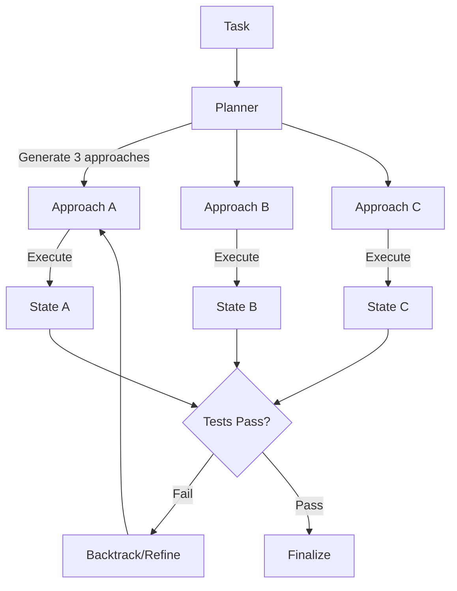
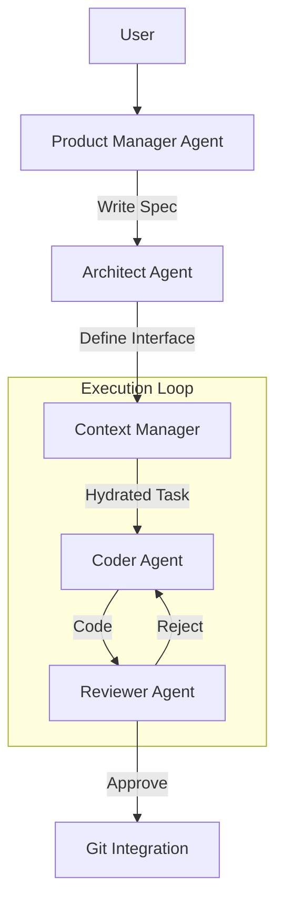

# AI Agent/Sub-Agent Workflow Exploration
## A Conceptual Deep Dive & Landscape Analysis

**Date:** February 24, 2026
**Type:** Whiteboard / Exploration Document

---

## 1. Landscape Overview

The current AI agent landscape (2025-2026) has bifurcated into two distinct architectural philosophies: **Engineering Orchestration** and **Social Simulation**.

### A. Engineering Orchestration (Control-Flow Driven)
*Focus: Deterministic execution, state machines, and explicit control over loops.*

*   **LangChain / LangGraph:** The industry standard for building "reliable" agents. It models workflows as **State Graphs** (nodes = actions/agents, edges = transitions). It excels at "human-in-the-loop" systems where a developer needs to define exactly where an agent is allowed to go.
*   **Microsoft AutoGen:** "Conversation-centric." Agents are objects that send messages to each other. While powerful for "group chats," it can be harder to control in production compared to a graph.
*   **OpenAI Agents SDK / Swarm:** A newer, lightweight approach focused on "handoffs" (transferring control) rather than complex graphs.

### B. Social Simulation (Role/Team Driven)
*Focus: High-level abstraction, role-playing, and "management" hierarchies.*

*   **CrewAI:** Models "crews" with specific roles (Researcher, Writer) and goals. Uses a "Process" class (Sequential/Hierarchical) to manage execution. Great for prototyping but often lacks the fine-grained control needed for complex software engineering.
*   **MetaGPT:** Famous for the "Software Company" metaphor. It encodes **Standard Operating Procedures (SOPs)** as agent workflows. It treats the workflow as an assembly line rather than a free-form chat.

---

## 2. Benchmark Analysis: "What Actually Works?"

Analysis of top performers on **SWE-bench Verified** (the gold standard for coding agents) reveals that "Generalist" frameworks often underperform compared to **Specialized Architectures**.

| System | Key Innovation | Why It Works |
| :--- | :--- | :--- |
| **Moatless Tools** | **Search-Based (MCTS)** | It doesn't just "try" to fix code. It uses **Monte Carlo Tree Search** to explore multiple solution paths, backtrack when stuck, and select the best trajectory. It treats coding as a search problem, not a generation problem. |
| **Aider** | **Repository Map** | Instead of RAG (which fails on code structure), Aider builds a compressed **Graph** of the codebase using Tree-sitter. It fits the *skeleton* of the entire project into the context window, giving the LLM "architectural awareness." |
| **SWE-agent** | **Agent-Computer Interface (ACI)** | It realized that LLMs are bad at using human tools (like `vim` or `ls`). ACI provides custom, simplified tools (e.g., a file viewer that shows 100 lines at a time with line numbers) designed specifically for LLM token consumption. |
| **OpenHands** | **Sandboxed Runtime** | Provides a robust **Docker-based** runtime that persists state. The agent isn't just "calling a function"; it's "living" in a terminal session. |

---

## 3. Pattern Library

These are the recurring patterns found in successful systems.

### A. Context & Memory Patterns
*   **The Repository Map (Anti-Pattern: Naive RAG):** Do not use vector search for code logic. Use static analysis (Tree-sitter) to build a graph of definitions and references. Feed the *structure* to the LLM.
*   **File Filtering:** Successful agents don't read files immediately. They use `ls -R` or `find` to build a mental map, then `read` specific files.
*   **Episodic Memory:** Storing "lessons learned" or "mistakes made" in a sidecar file (or vector store) to prevent repeating errors across tasks.

### B. Workflow Patterns
*   **Evaluator-Optimizer (Loop):**
    1.  **Generator:** Writes code.
    2.  **Evaluator:** Runs tests/linters.
    3.  **Reflector:** Analyzes the error.
    4.  **Loop:** Generator fixes based on Reflector's feedback.
*   **Plan-and-Execute:** The agent *must* write a plan (e.g., `plan.md`) before touching code. This "grounds" the reasoning and prevents "rabbit-holing."
*   **Tool-First Design:** Tools should return "observations" (stdout/stderr), not just success/fail. The *output* of a tool is the primary sensory input for the agent.

### C. Operational Patterns
*   **Lint-on-Edit:** (From SWE-agent) Run a linter *immediately* after the agent edits a file. If there's a syntax error, reject the edit and return the error message. Do not let the agent commit broken code.
*   **Sandboxing:** Every agent session runs in an ephemeral Docker container.

---

## 4. Candidate Architecture Directions (Whiteboard Proposals)

### Direction A: The "Tree Search" Solver (High Reliability)
*Concept:* Treat the task as a search problem. The agent is not a single worker, but a "Search Engine" exploring the space of possible edits.



*   **Pros:** Highest success rate for complex tasks. Self-correcting.
*   **Cons:** Expensive (tokens/time). High latency.
*   **Best For:** Async background workers fixing tricky bugs.

### Direction B: The "Hierarchical Team" (High Throughput)
*Concept:* Specialized agents with a strong "Project Manager" enforcing architectural consistency.



*   **Pros:** Mimics human teams. Good for large features.
*   **Cons:** "Too many cooks" problem. Context fragmentation (who knows what?).
*   **Best For:** Feature development from scratch.

### Direction C: The "Agent-Computer Interface" (ACI) Centric (Low Latency)
*Concept:* A single, highly capable agent (like Aider) interacting with a hyper-optimized environment.

```mermaid
graph LR
    Agent[LLM Agent] <-->|ACI Protocol| Env[Runtime Environment]
    
    subgraph Env [Optimized Runtime]
        Shell[Bash]
        Linter[Auto-Linter]
        RepoMap[Tree-Sitter Map]
        TestRunner[Test Harness]
    end
    
    Env -->|Feedback (Line numbers, Error digests)| Agent
```

*   **Pros:** Fast, token-efficient. "Feels" like a power-user tool.
*   **Cons:** Relies heavily on the intelligence of a single model (needs Claude 3.5 / GPT-4o).
*   **Best For:** Interactive "pair programming" or CLI tools.

---

## 5. Design Principles for a Future Framework

1.  **Context is King, but Structure is Queen:** Don't just dump text. Use **Repository Maps** to provide structural context.
2.  **Tools are Interfaces:** Design tools for *models*, not humans. (e.g., `edit_file` should take a search-replace block, not a `vim` command).
3.  **Fail Fast, Fail Loud:** If an agent makes a syntax error, catch it *before* the LLM sees the result. The environment should be "hostile to errors."
4.  **Traceability over Autonomy:** Every action must be logged. We need to replay the "thought process" (the trajectory) to debug the agent.
5.  **Git-Native:** The agent's unit of work is a **Branch**. Its final output is a **Pull Request**.

---

## 6. Open Questions & Research Gaps

*   **Multi-Repo Context:** How does a "Repo Map" scale to a microservices architecture with 50 repos?
*   **Human-in-the-Loop UX:** What is the right interface for a human to "steer" a Tree Search in progress? (A dashboard? A chat intervention?)
*   **Cost/Performance Curve:** At what point does the "Tree Search" become too expensive for the value of the bug fix?

---

## 7. Final Recommendation

**The "Moatless" Approach + ACI**

Do not build a generic "Team of Agents" (Direction B). It is too chatty and fragile.

Instead, build a **Search-Based Solver (Direction A)** that operates within a highly optimized **ACI (Direction C)**.

*   **Why:** This combines the *reliability* of search (backtracking from bad decisions) with the *efficiency* of optimized tooling (understanding code structure).
*   **Next Step:** Prototype a "Headless Developer" that runs in a Docker container, builds a Tree-sitter map of a repo, and uses a simple "Best-First Search" loop to solve GitHub issues.
