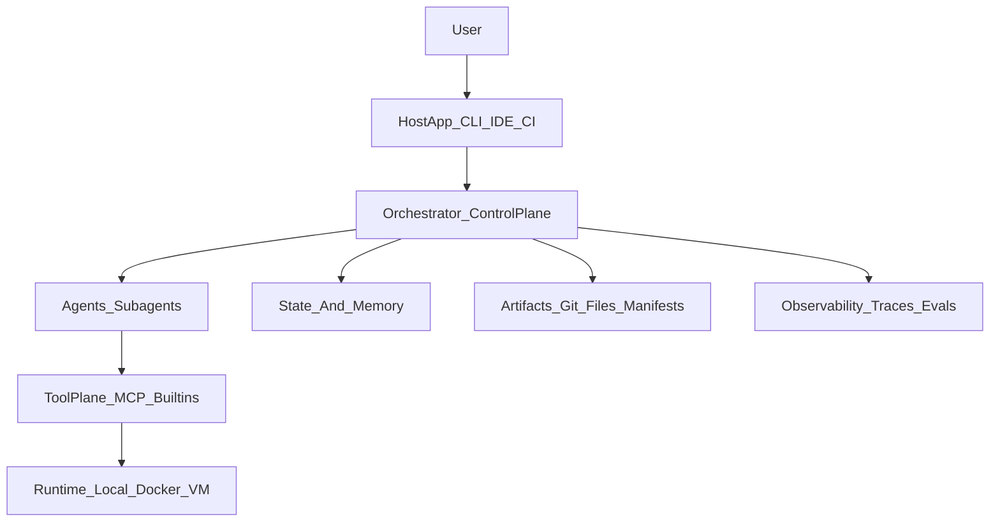
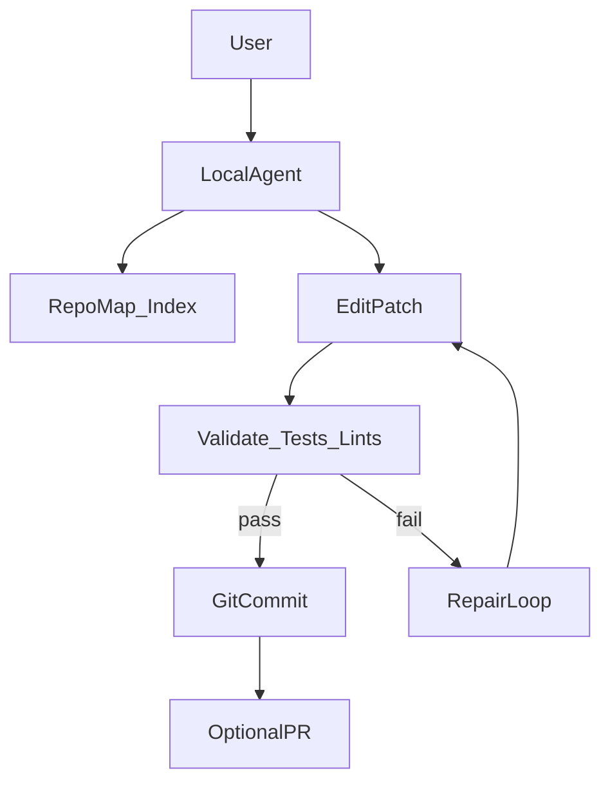
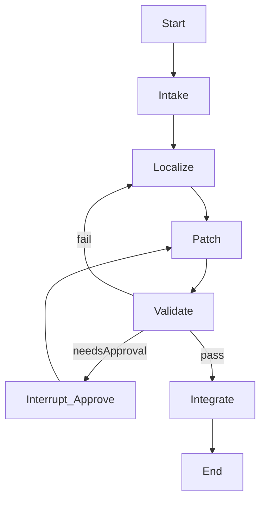
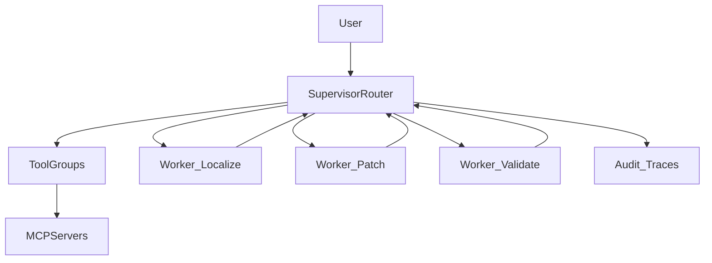
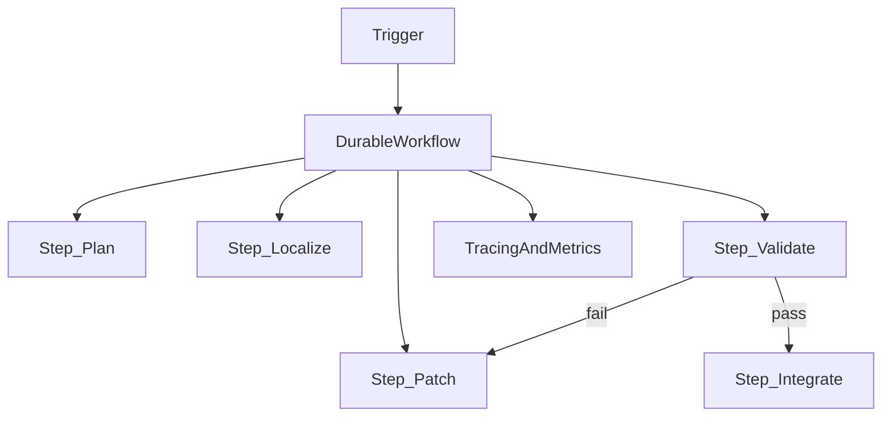

## Intent & constraints

- **Intent**: map the design space of AI agent/sub-agent software development workflows; compare successful real-world approaches; extract principles and reusable patterns; propose candidate architecture directions without assuming an existing framework.
- **Scope**: workflows that execute the software lifecycle loop (issue → plan → code → test → PR/review → ship) with tools and artifacts.
- **Method**: external-first research + benchmark cards; clearly label **Evidence**, **Inference**, **Recommendation**.

### Evidence labeling convention

- **Evidence**: backed by a cited source (paper, official docs, or repo).
- **Inference**: derived from Evidence; plausible but not directly stated by a source.
- **Recommendation**: actionable next step / design guidance.

### Source base

- Benchmark cards appendix: [Benchmarks & Source Cards](agent-subagent-workflow-benchmarks.md)
- Goal: keep the main doc readable; keep most raw source detail in the appendix.

---

## A) Landscape overview (ecosystem map)

### Primary categories in practice

- **Coding agents (productized workflows)**: CLI/IDE systems that directly operate on real repos (read/edit files, run tests, manage git, optionally open PRs).
  - **Evidence**: Continue documents an explicit tool-calling handshake and mode gating (Plan vs Agent) ([How Agent Mode Works](https://docs.continue.dev/ide-extensions/agent/how-it-works)).
  - **Evidence**: Aider documents a repository-map strategy for token-efficient repo context ([Repository map](https://aider.chat/docs/repomap.html)).
  - **Evidence**: Codex documents a “skills” system with progressive disclosure and scoped discovery paths ([Agent Skills](https://developers.openai.com/codex/skills)).

- **Agent orchestration frameworks (build-your-own runtime)**: libraries for multi-agent patterns, state management, tool routing, and governance.
  - **Evidence**: LangGraph models cyclic workflows as graphs with explicit state and supports persistence/time-travel debugging ([Multi-agent concepts](https://langchain-ai.github.io/langgraph/concepts/multi_agent/), [Time travel concepts](https://langchain-ai.github.io/langgraph/concepts/time-travel/)).
  - **Evidence**: OpenAI Agents SDK provides handoffs, sessions (memory), guardrails, and tracing ([Agents SDK docs](https://openai.github.io/openai-agents-python/)).

- **Benchmarks & evaluation harnesses**: define the task shape and objective function (often “tests pass” for SWE tasks).
  - **Evidence**: SWE-bench is “resolve a real GitHub issue by editing a repo; evaluated by running tests” ([SWE-bench repo](https://github.com/swe-bench/swe-bench)).
  - **Evidence**: SWE-bench Verified is a human-validated subset (overview) ([SWE-bench Verified](https://epoch.ai/benchmarks/swe-bench-verified)).

- **Durable execution / workflow engines**: long-lived workflows with retries, idempotency, and resumption.
  - **Evidence**: Temporal provides “durable MCP server” patterns for tool execution that survives failures ([Durable MCP Weather Server](https://docs.temporal.io/ai-cookbook/hello-world-durable-mcp-server)).
  - **Evidence**: DBOS checkpoints step outputs and resumes workflows after interruption ([How Workflows Work](https://docs.dbos.dev/explanations/how-workflows-work)).

- **Protocols and tool ecosystems**: standardize tool interfaces and consent boundaries.
  - **Evidence**: MCP defines host/client/server roles and security principles around consent/tool safety/data privacy ([MCP specification](https://modelcontextprotocol.io/specification/latest)).

- **Observability & evaluation (“LLMOps for agents”)**: tracing, debugging, evals, regression tracking.
  - **Evidence**: Agents SDK traces LLM generations, tool calls, guardrails, and handoffs as traces/spans ([Agents SDK tracing](https://openai.github.io/openai-agents-python/tracing/)).
  - **Evidence**: Langfuse can act as an OpenTelemetry backend (`/api/public/otel`) ([Langfuse OpenTelemetry](https://langfuse.com/docs/opentelemetry)).
  - **Evidence**: Phoenix provides OTEL/OTLP ingestion for LLM traces ([Phoenix tracing overview](https://docs.arize.com/phoenix/tracing/llm-traces)).

### Operational models (how agent work runs “in the wild”)

- **Interactive local session (CLI/IDE loop)**: best for human-guided work, tight feedback, and ad-hoc navigation.
  - **Evidence**: Continue’s handshake includes explicit permission gating (manual or automatic) ([How Agent Mode Works](https://docs.continue.dev/ide-extensions/agent/how-it-works)).
  - **Evidence**: Aider uses git commits as a safety mechanism (`/undo`, `/diff`) ([Git integration](https://aider.chat/docs/git.html)).

- **Event-triggered repo automation (CI/Actions)**: best for repetitive, well-defined tasks (triage, PR review, dependency upgrades).
  - **Evidence**: gh-aw runs “coding agents in GitHub Actions,” with workflows authored as markdown + frontmatter and compiled to a hardened lock file ([How They Work](https://github.github.com/gh-aw/introduction/how-they-work/)).
  - **Evidence**: Patchwork defines patchflows as well-defined, verifiable automations and calls out “automate writing a new feature” as a bad fit ([Patchflows overview](https://docs.patched.codes/patchflows/patchflows)).

- **Async cloud agent (VM/container per task)**: best for long-running tasks where you want background execution and isolation.
  - **Evidence**: Jules integrates via GitHub Action triggers for asynchronous agent runs (repo: [`jules-action`](https://github.com/google-labs-code/jules-action)).

- **Benchmark harness runs**: best for measuring capability/variance and comparing workflows on standardized tasks.
  - **Evidence**: SWE-bench provides a canonical, test-driven objective ([SWE-bench repo](https://github.com/swe-bench/swe-bench)).

### Layered view (useful mental model)

**Inference**: Most “agent workflow systems” are a composition of layers; the interesting design questions are about boundaries and control points.

### Major trends (recurring moves)

- **Trend: explicit state + replay**
  - **Evidence**: LangGraph time travel is checkpoint-based replay/forking for debugging non-deterministic workflows ([Time travel concepts](https://langchain-ai.github.io/langgraph/concepts/time-travel/)).
  - **Inference**: prompt-only state breaks down as workflows get longer; systems converge on explicit state + persistence.

- **Trend: multi-agent as routing + isolation, not free-form debate**
  - **Evidence**: Agents SDK handoffs are exposed as tools (`transfer_to_*`), enabling explicit delegation ([Handoffs](https://openai.github.io/openai-agents-python/ref/handoffs/)).
  - **Evidence**: Claude Code subagents are specialized assistants running in separate contexts ([Sub-agents](https://docs.anthropic.com/en/docs/claude-code/sub-agents)).
  - **Inference**: “multi-agent” in production often means hierarchical routing + context isolation, not group chat.

- **Trend: git and PRs as the audit/control plane**
  - **Evidence**: Aider commits changes so undo/review is just git operations (`/undo`, `/diff`) ([Git integration](https://aider.chat/docs/git.html)).
  - **Evidence**: gh-aw treats workflows as source `.md` plus compiled `.lock.yml` that should both be committed ([How They Work](https://github.github.com/gh-aw/introduction/how-they-work/)).
  - **Inference**: artifact-first workflows reduce “invisible state” and make review scalable.

---

## B) Benchmark analysis (what works in real systems)

This section uses the benchmark cards appendix as grounding. See: [Benchmarks & Source Cards](agent-subagent-workflow-benchmarks.md).

### “Success” in software-dev agents is usually multi-objective

- **Evidence**: SWE-bench evaluates fixes by running tests after repo edits ([SWE-bench repo](https://github.com/swe-bench/swe-bench)).
- **Evidence**: Patchwork frames patchflows as “well-defined, verifiable, repetitive” automations and calls out “automate writing a new feature” as a bad fit ([Patchflows overview](https://docs.patched.codes/patchflows/patchflows)).
- **Inference**: For real teams, “pass tests” is necessary but not sufficient; success includes reviewability, minimal blast radius, and reproducibility.
- **Recommendation**: Treat agent effectiveness as a vector: \(correctness, cost, latency, review burden, safety risk\).

### Comparative highlights (selected)

#### 1) SWE-agent vs Agentless vs “git-native” tooling

- **Evidence**: SWE-agent emphasizes sandboxed execution and containerized environments ([SWE-agent Docker install](https://swe-agent.com/0.7/installation/docker)).
- **Evidence**: Agentless argues for a two-phase pipeline (localize → repair) as an effective alternative to “full agent” scaffolds ([Agentless paper](https://arxiv.org/html/2407.01489v1)).
- **Inference**: A large portion of “agent performance” can come from workflow structure (localization constraints, candidate filtering, validation), not just model capability.
- **Recommendation**: Implement localization as a first-class stage and make patch candidates compete under a validator.

#### 2) LangGraph vs Agents SDK (state machine vs runner primitives)

- **Evidence**: LangGraph is a graph/state runtime with persistence, interrupts, and checkpoint-based time travel ([LangGraph docs](https://docs.langchain.com/oss/python/langgraph/), [Interrupts](https://docs.langchain.com/oss/python/langgraph/interrupts)).
- **Evidence**: OpenAI Agents SDK provides handoffs, sessions, guardrails, and built-in tracing ([Agents SDK docs](https://openai.github.io/openai-agents-python/)).
- **Inference**: A practical long-horizon architecture often combines these roles: a durable control plane (graph/workflow engine) + a well-instrumented runner/tool plane.

#### 3) MCP as ecosystem boundary and consent model

- **Evidence**: MCP defines host/client/server roles and security principles emphasizing user consent, tool safety, and data privacy ([MCP specification](https://modelcontextprotocol.io/specification/latest)).
- **Evidence**: MCP roots define boundaries for server operations ([Roots concept](https://modelcontextprotocol.io/docs/concepts/roots)).
- **Inference**: Tool safety is a property of host UX + policies + auditability, not of tool code alone.
- **Recommendation**: Design tool usage as an auditable protocol surface (schemas, approvals, roots/boundaries, logs).

### Cross-cutting synthesis (10 scope areas)

#### 1) Agent workflow architectures

- **Evidence**: Graph/state-machine control planes exist explicitly (LangGraph) ([Graph API](https://docs.langchain.com/oss/python/langgraph/)).
- **Evidence**: Handoff/routing is formalized as a first-class multi-agent mechanism (Agents SDK) ([Handoffs](https://openai.github.io/openai-agents-python/ref/handoffs/)).
- **Evidence**: Repo automation workflows can be expressed as declarative markdown compiled to hardened CI workflows (gh-aw) ([How They Work](https://github.github.com/gh-aw/introduction/how-they-work/)).
- **Inference**: There is no single “best” topology; the architecture should be chosen based on the control plane you need:
  - interactive development → session loop
  - reproducible evaluation → sandbox loop
  - long-horizon reliability → durable workflow engine
  - complex branching/HITL → explicit state machine
- **Recommendation**: Make the control plane explicit as a core abstraction (Git, Graph, or Workflow Engine) rather than implicit in prompts.

#### 2) Task decomposition and execution

- **Evidence**: Agentless advocates explicit localization→repair staging ([Agentless paper](https://arxiv.org/html/2407.01489v1)).
- **Evidence**: Patchwork frames automation as “well-defined, verifiable, repetitive” workflows rather than open-ended feature building ([Patchflows overview](https://docs.patched.codes/patchflows/patchflows)).
- **Inference**: High-performing workflows narrow the action space early (localization, constraints, bounded outputs) and rely on validators.
- **Recommendation**:
  - Bake in a canonical decomposition: **Intake → Localize → Patch → Validate → Integrate**.
  - Treat validation as the default governor (tests/lints/typechecks), not an optional step.

#### 3) Context, memory, and state management

- **Evidence**: Aider’s repo map is a symbol-level representation optimized to fit token budgets ([Repository map](https://aider.chat/docs/repomap.html)).
- **Evidence**: Codex skills use progressive disclosure (metadata first; load full instructions only if used) ([Agent Skills](https://developers.openai.com/codex/skills)).
- **Evidence**: Letta defines a context hierarchy with memory blocks, files, archival memory, and external RAG; includes recommended size/count limits ([Letta context hierarchy](https://docs.letta.com/guides/core-concepts/memory/context-hierarchy)).
- **Evidence**: Agents SDK supports persistent session memory ([Sessions](https://openai.github.io/openai-agents-python/sessions/)).
- **Inference**: Winning systems distinguish:
  - working context (tight, task-relevant)
  - structured state (typed, replayable)
  - long-term stores (retrieval-based, not always in-context)
- **Recommendation**:
  - Make context tiered: repo-map/index + selective file reads + structured state + optional long-term memory.
  - Prefer explicit state schemas (graph/workflow state) for anything that must be replayable/auditable.

#### 4) Tooling and runtime execution

- **Evidence**: Continue describes a tool handshake with explicit permission gating ([How Agent Mode Works](https://docs.continue.dev/ide-extensions/agent/how-it-works)).
- **Evidence**: gh-aw emphasizes defense-in-depth: compilation-time validation, runtime isolation, permission separation, network controls, and output sanitization ([How They Work](https://github.github.com/gh-aw/introduction/how-they-work/)).
- **Evidence**: OpenHands V1 argues for “optional isolation over mandatory sandboxing,” aligning with MCP local execution assumptions ([OpenHands design principles](https://docs.openhands.dev/sdk/arch/design)).
- **Inference**: Tooling/runtimes are where agent systems fail catastrophically (security, irreproducible environments, duplicated side effects).
- **Recommendation**:
  - Implement tool governance at three layers: allowlist policy, runtime isolation policy, post-action validation.
  - Treat sandboxing as a capability you can turn on per tool/step, not a blanket mode.

#### 5) File, artifact, and documentation management

- **Evidence**: Codex skills are filesystem artifacts (`SKILL.md` plus optional metadata and dependencies) with clear scope and triggers ([Agent Skills](https://developers.openai.com/codex/skills)).
- **Evidence**: gh-aw workflows are `.md` sources with YAML frontmatter compiled to `.lock.yml` hardened workflows; both should be committed ([How They Work](https://github.github.com/gh-aw/introduction/how-they-work/)).
- **Evidence**: OpenHands emphasizes one source of truth for state and clear boundaries between SDK/tools/workspace/agent server ([OpenHands design principles](https://docs.openhands.dev/sdk/arch/design)).
- **Inference**: “Professional” agent workflows are artifact-oriented: durable intermediate representations (plans, ledgers, diffs, traces).
- **Recommendation**: Define a canonical artifact registry:
  - Plan (intent + constraints)
  - Ledger (done/next/blocked)
  - Patch set (diffs)
  - Validation report (tests/lints)
  - Trace (observability)

#### 6) Governance, quality, and reliability

- **Evidence**: Agents SDK guardrails can halt execution via tripwires; input guardrails can run in parallel or blocking mode ([Guardrails reference](https://openai.github.io/openai-agents-python/ref/guardrail/)).
- **Evidence**: MCP emphasizes user consent/control and tool safety ([MCP specification](https://modelcontextprotocol.io/specification/latest)).
- **Evidence**: Aider uses git commits as a reversible safety mechanism ([Git integration](https://aider.chat/docs/git.html)).
- **Inference**: Reliability is layered: preconditions (guardrails), constrained actions (policies), and recovery (undo/retry).
- **Recommendation**:
  - Use input guardrails (scope/safety), tool guardrails (side effects), and output guardrails (format/contracts).
  - Make rollback (git revert / checkpoint rewind) a first-class operation.

#### 7) Git/GitHub and developer workflow integration

- **Evidence**: Aider commits dirty-file snapshots and AI edits to separate changes and enable undo/review ([Git integration](https://aider.chat/docs/git.html)).
- **Evidence**: gh-aw compiles agentic markdown workflows to GitHub Actions and emphasizes least-privilege and safe outputs ([How They Work](https://github.github.com/gh-aw/introduction/how-they-work/)).
- **Inference**: PRs and commits are the natural interface for human-in-the-loop review and auditability.
- **Recommendation**: Treat PR creation/update as an output artifact with traceability links:
  - plan/ledger → commits → validation logs → PR summary.

#### 8) Extensibility and ecosystem design

- **Evidence**: MCP provides a standardized tool server protocol ([MCP specification](https://modelcontextprotocol.io/specification/latest)).
- **Evidence**: Codex supports scoped skill discovery and policy metadata (`allow_implicit_invocation`) ([Agent Skills](https://developers.openai.com/codex/skills)).
- **Evidence**: OpenHands V1 emphasizes composable components reconfigurable without changing core code ([OpenHands design principles](https://docs.openhands.dev/sdk/arch/design)).
- **Inference**: Extensibility that scales requires declarative plugins (skills/toolsets) with explicit dependencies and boundaries.
- **Recommendation**:
  - Design plugins around stable contracts (tool schemas, artifact schemas).
  - Support “policy as data” (what tools can run, under what approvals).

#### 9) Observability and operational intelligence

- **Evidence**: Agents SDK tracing defines traces/spans and sensitive-data controls ([Agents SDK tracing](https://openai.github.io/openai-agents-python/tracing/)).
- **Evidence**: LangGraph time travel uses checkpoint history to replay/fork executions for debugging ([Time travel concepts](https://langchain-ai.github.io/langgraph/concepts/time-travel/)).
- **Evidence**: Langfuse and Phoenix can ingest OTEL traces ([Langfuse OpenTelemetry](https://langfuse.com/docs/opentelemetry), [Phoenix tracing overview](https://docs.arize.com/phoenix/tracing/llm-traces)).
- **Inference**: Without traces, “agent debugging” degenerates into anecdote; trace is the ground truth.
- **Recommendation**:
  - Define a minimal span taxonomy: `run`, `plan`, `tool_call`, `validation`, `handoff`, `approval`.
  - Link traces to artifacts (commit SHA, PR URL, dataset case ID).

#### 10) Architectural trade-offs

- **Evidence**: gh-aw contrasts deterministic workflows vs agentic workflows and emphasizes security hardening ([How They Work](https://github.github.com/gh-aw/introduction/how-they-work/)).
- **Evidence**: OpenHands V1 highlights “optional isolation” to balance safety vs friction ([OpenHands design principles](https://docs.openhands.dev/sdk/arch/design)).
- **Inference**: Many trade-offs reduce to “where does control live?” (prompt, policy, state machine, workflow engine, or git).
- **Recommendation**: Make trade-offs explicit in the architecture doc:
  - local-first vs cloud (secrets, isolation, latency)
  - flexibility vs control (free-form tool use vs constrained safe outputs)
  - generality vs specialization (general agent vs pipelines/patchflows)

---

## C) Pattern library (conceptual; when they work, failure modes)

Patterns below are **composable**. Think of them as building blocks you can mix into different workflow topologies (interactive CLI/IDE loop, CI automation, graph runtime, durable workflows).

For each pattern, ask: **where does control live?** (prompt, policy, state machine/workflow engine, or git artifacts).

### Recommended patterns

#### Pattern: Localize_patch_validate_pipeline

- **Definition**: Structure the work as **Intake → Localize → Patch → Validate → Integrate**, with validation as a hard gate (tests/lints/typechecks).
- **Evidence**: Agentless frames SWE repair as a localization→repair pipeline ([Agentless paper](https://arxiv.org/html/2407.01489v1)).
- **Evidence**: SWE-bench evaluates success by running tests after repo edits ([SWE-bench repo](https://github.com/swe-bench/swe-bench)).
- **When it works**: bugfixes with executable tests; CI-backed repos; tasks where “done” is verifiable.
- **Failure modes**: wrong localization; patch churn; validator gaps (tests don’t cover issue).
- **Mitigations**: multiple localization hypotheses; patch candidate ranking; add/extend regression tests as part of the loop.

#### Pattern: Supervisor_router_with_isolated_workers

- **Definition**: A supervisor decomposes and routes work; workers operate in narrow scopes and return structured artifacts.
- **Evidence**: Agents SDK handoffs encode delegation as tools (`transfer_to_*`) ([Handoffs](https://openai.github.io/openai-agents-python/ref/handoffs/)).
- **Evidence**: Claude Code subagents run in separate contexts with custom prompts and tool access ([Sub-agents](https://docs.anthropic.com/en/docs/claude-code/sub-agents)).
- **When it works**: multi-domain tasks (search, patch, test, PR); avoiding context bloat and role confusion.
- **Failure modes**: routing thrash; inconsistent artifact formats; duplicated work.
- **Mitigations**: explicit worker I/O schemas; “ledger” artifact as shared memory; validator stages; routing budget.

#### Pattern: Checkpointed_plan_execute_validate_loop

- **Definition**: Explicit plan artifact → execute a small step → validate → revise; persist checkpoints so you can resume/fork.
- **Evidence**: LangGraph interrupts + checkpoints enable pause/resume workflows ([Interrupts](https://docs.langchain.com/oss/python/langgraph/interrupts)).
- **Evidence**: LangGraph time travel supports replay/forking from checkpoints for debugging ([Time travel concepts](https://langchain-ai.github.io/langgraph/concepts/time-travel/)).
- **When it works**: non-deterministic workflows; HITL approvals; long-horizon tasks with retries.
- **Failure modes**: plan churn; slow iteration; “validation last.”
- **Mitigations**: enforce 2–10 minute step granularity; validator-first ordering; checkpoint every externally visible action.

#### Pattern: Permission_gated_tools_and_interrupts_for_high_risk_actions

- **Definition**: High-risk actions (writes, network, PR creation) require explicit permission, approval, or an interrupt boundary.
- **Evidence**: Continue’s tool handshake includes an explicit permission step, optionally automatic per policy ([How Agent Mode Works](https://docs.continue.dev/ide-extensions/agent/how-it-works)).
- **Evidence**: MCP security principles emphasize consent/control and tool safety ([MCP specification](https://modelcontextprotocol.io/specification/latest)).
- **When it works**: anything that can leak data, spend money, modify prod, or create irreversible changes.
- **Failure modes**: “approval fatigue”; users click through; over-broad allowlists.
- **Mitigations**: policy tiers (safe vs risky tools); batch approvals; preview diffs; default-deny for network and destructive actions.

#### Pattern: Repo_map_and_progressive_disclosure_context

- **Definition**: Maintain a compact repo-level index (symbols/relations) and only load deeper context on demand.
- **Evidence**: Aider repo map is symbol-based and graph-ranked to fit a token budget ([Repository map](https://aider.chat/docs/repomap.html)).
- **Evidence**: Codex skills use progressive disclosure: metadata first; load full `SKILL.md` only when needed ([Agent Skills](https://developers.openai.com/codex/skills)).
- **When it works**: large repos; repeated tasks in the same codebase; high token/cost sensitivity.
- **Failure modes**: stale index; missing implicit dependencies; “map confidence” blind spots.
- **Mitigations**: rebuild triggers; annotate index with freshness; allow deep reads when validators fail.

#### Pattern: Git_as_audit_log_and_undo_surface

- **Definition**: Use commits/PRs as first-class workflow artifacts; make undo/review a default operation.
- **Evidence**: Aider commits changes and exposes `/undo` and `/diff` as operational controls ([Git integration](https://aider.chat/docs/git.html)).
- **When it works**: collaborative teams; mandatory review; agents that touch many files.
- **Failure modes**: noisy history; partial commits; unclear traceability.
- **Mitigations**: “task → commit set → PR” discipline; squash on merge; link traces to SHAs.

#### Pattern: Safe_outputs_and_constrained_write_surfaces

- **Definition**: Constrain agent writes to a small set of pre-approved “safe outputs” and sanitize outputs before applying changes.
- **Evidence**: gh-aw emphasizes defense-in-depth and “safe outputs” (validated GitHub operations) ([How They Work](https://github.github.com/gh-aw/introduction/how-they-work/)).
- **Inference**: Constraining the write surface is often more reliable than trying to detect every bad write after the fact.
- **When it works**: CI/Actions automation; org-wide bots; high-risk environments.
- **Failure modes**: capability gaps; too much rigidity; “escape hatches” become unsafe.
- **Mitigations**: staged permission escalation; preview artifacts; explicit human approvals for privileged actions.

#### Pattern: Guardrails_tripwires_for_governance

- **Definition**: Run guardrails on inputs/outputs (and ideally tools) that can halt execution when a tripwire triggers.
- **Evidence**: Agents SDK guardrails halt execution when `tripwire_triggered` is true; input guardrails can run blocking or in parallel ([Guardrails reference](https://openai.github.io/openai-agents-python/ref/guardrail/)).
- **When it works**: preventing off-scope runs; blocking data exfiltration; enforcing output schemas/format.
- **Failure modes**: false positives; silent bypass; guardrails run too late.
- **Mitigations**: fast “cheap” pre-guardrails; blocking mode for high-risk; trace every guardrail decision.

#### Pattern: Tool_grouping_and_namespacing_to_reduce_tool_space_interference

- **Definition**: Actively manage tool catalogs: namespacing, grouping, and limiting tools in-context to avoid degraded tool-calling performance.
- **Evidence**: Microsoft Research describes “tool-space interference” in MCP ecosystems: collisions, large tool catalogs, and long tool responses reduce end-to-end effectiveness ([Tool-space interference blog](https://www.microsoft.com/en-us/research/blog/tool-space-interference-in-the-mcp-era-designing-for-agent-compatibility-at-scale/)).
- **Evidence**: The same source quotes OpenAI best-practice guidance to keep tool counts small (aim for fewer than ~20 tools in-context at once) ([Tool-space interference blog](https://www.microsoft.com/en-us/research/blog/tool-space-interference-in-the-mcp-era-designing-for-agent-compatibility-at-scale/)).
- **When it works**: MCP-heavy environments; marketplaces; “society of tools” settings.
- **Failure modes**: semantic confusion (`search`, `web_search`, `search-web`); tool overload; context window overflow from huge tool responses.
- **Mitigations**: hierarchical selection (choose tool-group → choose tool); dynamic tool discovery; response pagination/summarization; pre-flight tool testing (server cards).

#### Pattern: Optional_isolation_per_step

- **Definition**: Make sandboxing an opt-in capability (per tool/step) rather than a mandatory global mode.
- **Evidence**: OpenHands V1 argues for “optional isolation over mandatory sandboxing,” aligning with MCP’s local execution assumptions ([OpenHands design principles](https://docs.openhands.dev/sdk/arch/design)).
- **When it works**: hybrid environments where most steps are safe locally but some require strict isolation.
- **Failure modes**: inconsistent state between host and sandbox; security drift if isolation is turned off where it shouldn’t be.
- **Mitigations**: policy-based isolation selection; single source of truth for workflow state; explicit boundary artifacts.

#### Pattern: Durable_execution_with_idempotent_steps

- **Definition**: Wrap side-effecting operations in durable steps with retries and idempotency; resume after crashes without repeating work.
- **Evidence**: Temporal durable MCP patterns execute external calls in Activities with retry policies ([Durable MCP Weather Server](https://docs.temporal.io/ai-cookbook/hello-world-durable-mcp-server)).
- **Evidence**: DBOS persists workflow/step inputs and outputs to resume after interruption ([How Workflows Work](https://docs.dbos.dev/explanations/how-workflows-work)).
- **When it works**: multi-hour/day runs; async workflows; HITL approvals; flaky dependencies.
- **Failure modes**: duplicated side effects; complex step boundaries; higher ops overhead.
- **Mitigations**: strict idempotency keys; “effects after checkpoints”; tool wrappers that are deterministic and replay-safe.

#### Pattern: Traces_spans_and_time_travel_as_the_debug_surface

- **Definition**: Treat trace/spans (and checkpoints) as the ground truth for debugging, evaluation, and auditability.
- **Evidence**: Agents SDK traces agent runs, tool calls, guardrails, and handoffs as spans ([Agents SDK tracing](https://openai.github.io/openai-agents-python/tracing/)).
- **Evidence**: LangGraph time travel provides checkpoint-based replay/forking for debugging ([Time travel concepts](https://langchain-ai.github.io/langgraph/concepts/time-travel/)).
- **When it works**: production systems; benchmarking; regression detection; incident response.
- **Failure modes**: sensitive data leakage; inconsistent span taxonomy; traces not linked to artifacts.
- **Mitigations**: redaction policies; minimal span schema; link traces to commit SHAs/PRs and dataset case IDs.

### Anti-patterns

#### Anti-pattern: Group_chat_everything

- **Definition**: Multi-agent group chat without roles, routing, artifact formats, or validation.
- **Inference**: Increases cost/latency while decreasing determinism; lacks control points and validators.
- **Recommendation**: Prefer supervisor routing + artifact-based coordination.

#### Anti-pattern: Hidden_state_in_prompt_only

- **Definition**: Treat the entire workflow state as implicit in chat history; no explicit state schema or checkpoints.
- **Evidence**: LangGraph’s state/persistence/time-travel features exist specifically to manage non-deterministic state explicitly ([Time travel concepts](https://langchain-ai.github.io/langgraph/concepts/time-travel/)).
- **Inference**: Prompt-only state leads to drift, irreproducibility, and brittle retries.

#### Anti-pattern: Tool_sprawl_and_unbounded_tool_responses

- **Definition**: Add many overlapping tools with ambiguous names and allow huge tool responses into context unchecked.
- **Evidence**: Tool-space interference study documents collisions, large tool catalogs, and response-length overflows as common failure drivers ([Tool-space interference blog](https://www.microsoft.com/en-us/research/blog/tool-space-interference-in-the-mcp-era-designing-for-agent-compatibility-at-scale/)).
- **Recommendation**: Namespacing + grouping + response controls (paginate/summarize) should be mandatory in MCP-heavy systems.

#### Anti-pattern: Free_form_writes_without_policy_or_audit

- **Definition**: Give the agent full write power without least-privilege policies, approvals, or rollback.
- **Evidence**: MCP security emphasizes consent/control and tool safety ([MCP specification](https://modelcontextprotocol.io/specification/latest)).
- **Recommendation**: Default-deny risky actions; require approvals; ensure every write is traceable and revertible.

#### Anti-pattern: Automate_unique_features_as_if_they_are_repetitive

- **Definition**: Use “workflow automation” scaffolds for unique, open-ended feature work that lacks verifiable outputs.
- **Evidence**: Patchwork explicitly calls automating “the entire process of writing a new feature” a bad fit for patchflows ([Patchflows overview](https://docs.patched.codes/patchflows/patchflows)).
- **Recommendation**: Use automation for repetitive/verifiable tasks; keep feature building human-guided with validators.

### Foundational research patterns (useful mental models)

- **Evidence**: ReAct formalizes interleaving reasoning and tool actions ([ReAct paper](https://arxiv.org/abs/2210.03629)).
- **Evidence**: Reflexion uses feedback and reflective memory to improve subsequent attempts ([Reflexion paper](https://arxiv.org/abs/2303.11366)).
- **Evidence**: Toolformer shows self-supervised acquisition of tool-use behavior ([Toolformer paper](https://arxiv.org/abs/2302.04761)).
- **Evidence**: MRKL systems describe modular routing between LMs and specialized tools/experts ([MRKL paper](https://arxiv.org/abs/2205.00445)).

---

## D) Candidate architecture directions (whiteboard proposals)

Below are four directions that cover most of the real-world design space. They’re intentionally composable: you can start with one and adopt elements of others.

### Direction_1: Git_native_local_agent (local-first; commit-based safety)

- **Concept**: A local CLI/IDE agent that uses git commits/PRs as the unit of change, keeps context lean (repo-map + selective reads), and enforces a patch→validate loop.
- **Evidence**: Aider uses git commits as the operational safety mechanism (`/undo`, `/diff`) ([Git integration](https://aider.chat/docs/git.html)).
- **Evidence**: Aider’s repo-map provides token-efficient global context ([Repository map](https://aider.chat/docs/repomap.html)).

- **Operational complexity**: Low–medium (local setup; policies/permissions depend on host).
- **Scales well for**: human-guided development; teams that already rely on code review.
- **Breaks down when**: tasks run for hours/days, or require strict isolation/async execution.

### Direction_2: Checkpointed_graph_control_plane (state-machine core)

- **Concept**: Model the workflow as an explicit state machine with typed state, checkpoints, interrupts for HITL, and time-travel for debugging.
- **Evidence**: LangGraph interrupts + resume support pause/resume workflows ([Interrupts](https://docs.langchain.com/oss/python/langgraph/interrupts)).
- **Evidence**: LangGraph time travel supports replay/forking from checkpoints ([Time travel concepts](https://langchain-ai.github.io/langgraph/concepts/time-travel/)).

- **Operational complexity**: Medium (state schema, checkpoint storage, orchestration code).
- **Scales well for**: branching workflows; asynchronous approvals; reproducible debugging.
- **Breaks down when**: the tool/runtime layer is ungoverned (you still need policies, safe outputs, and observability).

### Direction_3: MCP_first_supervisor_router (tool ecosystem first; interference-aware)

- **Concept**: Standardize the tool plane using MCP, and build a supervisor/worker system that routes across tool groups with explicit consent boundaries.
- **Evidence**: MCP defines host/client/server roles and security principles around consent/tool safety/data privacy ([MCP specification](https://modelcontextprotocol.io/specification/latest)).
- **Evidence**: gh-aw uses MCP tools and emphasizes defense-in-depth, least privilege, and safe outputs ([How They Work](https://github.github.com/gh-aw/introduction/how-they-work/)).
- **Evidence**: Tool-space interference shows large/overlapping tool catalogs can reduce effectiveness unless you group/namespace/limit tools ([Tool-space interference blog](https://www.microsoft.com/en-us/research/blog/tool-space-interference-in-the-mcp-era-designing-for-agent-compatibility-at-scale/)).

- **Operational complexity**: Medium–high (tool governance, grouping, namespaces, response controls).
- **Scales well for**: extensibility; marketplace-driven tool ecosystems; org-wide automation.
- **Breaks down when**: tools are uncurated (collisions, redundant tools, huge responses) and you lack a grouping/selection strategy.

### Direction_4: Durable_workflow_engine_for_agents (reliability first)

- **Concept**: Put a workflow engine (Temporal/DBOS/Prefect-class) at the center; treat tool calls as durable, idempotent steps; integrate tracing from the engine.
- **Evidence**: Temporal durable MCP patterns show tool wrappers that start workflows; external calls run in retryable Activities ([Durable MCP Weather Server](https://docs.temporal.io/ai-cookbook/hello-world-durable-mcp-server)).
- **Evidence**: DBOS checkpoints workflow/step inputs and outputs to resume without repeating completed work ([How Workflows Work](https://docs.dbos.dev/explanations/how-workflows-work)).

- **Operational complexity**: High (infra + idempotency + step design), but strong reliability.
- **Scales well for**: async/background agents; multi-day runs; HITL approvals; flaky dependencies.
- **Breaks down when**: you can’t enforce idempotency or can’t afford workflow-engine overhead.

### Quick comparison (rule-of-thumb)

| Direction | ControlPlane | Durability | ToolEcosystem | BestFor |
| --- | --- | --- | --- | --- |
| 1 | GitArtifacts | Low | Small | Interactive dev + review |
| 2 | GraphState | Medium | Medium | Branching/HITL + replay |
| 3 | MCPToolPlane | Medium | High | Extensible tool ecosystems |
| 4 | WorkflowEngine | High | Medium–High | Long-horizon reliability |

---

## E) Design principles for a future framework

### Principle: Artifact-first, not chat-first

- **Evidence**: Git-native workflows (Aider) treat diffs/commits as core artifacts ([Git integration](https://aider.chat/docs/git.html)).
- **Inference**: Long-horizon reliability improves when “what we believe” and “what we did” are explicit artifacts (plans, ledgers, diffs, traces).
- **Recommendation**: Make the primary workflow state a set of versioned artifacts (plan, ledger, diffs, validation reports, traces).

### Principle: Explicit state schemas + resumability

- **Evidence**: LangGraph provides explicit state schemas and persistence/checkpointers ([LangGraph docs](https://docs.langchain.com/oss/python/langgraph/)).
- **Evidence**: OpenHands V1 argues for “stateless by default” components and a single mutable conversation state as the source of truth ([OpenHands design principles](https://docs.openhands.dev/sdk/arch/design)).
- **Recommendation**: Define a minimal internal state schema and force all nodes/agents to read/write via controlled reducers; keep exactly one mutable state object.

### Principle: Validation is a first-class node

- **Evidence**: SWE-bench’s objective is “tests pass” ([SWE-bench repo](https://github.com/swe-bench/swe-bench)).
- **Recommendation**: Encode validation and rollback/retry logic as explicit workflow steps.

### Principle: Tool safety is UX + policy + audit

- **Evidence**: MCP security principles center consent/control/tool safety ([MCP specification](https://modelcontextprotocol.io/specification/latest)).
- **Evidence**: gh-aw uses compilation-time validation, runtime isolation, permission separation, and output sanitization as defense in depth ([How They Work](https://github.github.com/gh-aw/introduction/how-they-work/)).
- **Recommendation**: Implement allowlists, tool descriptions, root boundaries, safe outputs, and structured audit logs; constrain write surfaces by default.

### Principle: Observability is part of the runtime surface

- **Evidence**: Agents SDK tracing spans cover agent runs, tools, guardrails, and handoffs ([Agents SDK tracing](https://openai.github.io/openai-agents-python/tracing/)).
- **Recommendation**: Standardize trace/span schemas and ensure every tool action emits a structured event.

### Principle: Tool catalogs must be managed (avoid tool-space interference)

- **Evidence**: Tool-space interference in MCP ecosystems (collisions, tool overload, huge responses) can reduce end-to-end effectiveness ([Tool-space interference blog](https://www.microsoft.com/en-us/research/blog/tool-space-interference-in-the-mcp-era-designing-for-agent-compatibility-at-scale/)).
- **Recommendation**: Implement namespacing + tool grouping + response controls (paginate/summarize), and keep active tool sets small.

---

## F) Open questions & research gaps

1) **What is the minimal viable state schema for long-horizon coding workflows?**  
Does it center on tasks/ledgers, patches/diffs, validation artifacts, or traces?

2) **How should we measure agent effectiveness beyond pass/fail?**  
Trace-based metrics like time-to-green, tool-call counts, diff size, revert frequency, and review load.

3) **Where should autonomy end by default?**  
Which tool categories require approval (writes, network, git push, PR creation)?

4) **What context strategies win in large repos?**  
Repo maps (Aider), retrieval benchmarks (RepoBench), and memory tiers (Letta) each help; best composition remains open.

5) **How to avoid benchmark overfitting and contamination?**  
**Evidence**: SWE-rebench proposes continuous task extraction for fresh/decontaminated evaluation (`https://huggingface.co/papers/2505.20411`).

6) **How should MCP-heavy systems prevent tool-space interference?**  
**Evidence**: Tool-space interference highlights collisions, large tool catalogs, and long tool responses as common issues ([Tool-space interference blog](https://www.microsoft.com/en-us/research/blog/tool-space-interference-in-the-mcp-era-designing-for-agent-compatibility-at-scale/)).
**Recommendation**: Add tool grouping and response controls as mandatory runtime features.

7) **What’s the right “safe output” surface for repo automation?**  
**Evidence**: gh-aw uses safe outputs and defense-in-depth layers for security ([How They Work](https://github.github.com/gh-aw/introduction/how-they-work/)).
**Open question**: How small can the safe surface be while still supporting meaningful automation?

---

## G) Final recommendation (exploration outcome)

### Recommended starting direction

**Recommendation**: Start with **Direction_2 (Checkpointed graph control plane)** as the core control plane, but adopt **Direction_1 (Git-native artifacts + repo-map)** as the default developer-facing operational model.

**Why (grounded)**:

- **Evidence**: Explicit state + replay/time-travel is a proven approach for debugging non-deterministic workflows (LangGraph) ([Time travel concepts](https://langchain-ai.github.io/langgraph/concepts/time-travel/)).
- **Evidence**: Git-native undo/review workflows provide safety and traceability (Aider) ([Git integration](https://aider.chat/docs/git.html)).
- **Inference**: Combining these yields a system that is both debuggable and aligned with how teams review and ship code.

### What to validate next (before building a full framework)

1) **Prototype the minimal workflow**: issue intake → plan artifact → patch → tests → PR artifact, with interrupts for approvals.
2) **Run against SWE-bench Verified** as a reference harness, plus a small “real repo” dataset.
3) **Instrument traces/spans** from day one and define regression metrics.
4) **Add repo-map context** and compare token/cost outcomes vs naive file reads.
5) **Add tool grouping and response controls** early if MCP tools are in scope (mitigate tool-space interference).
