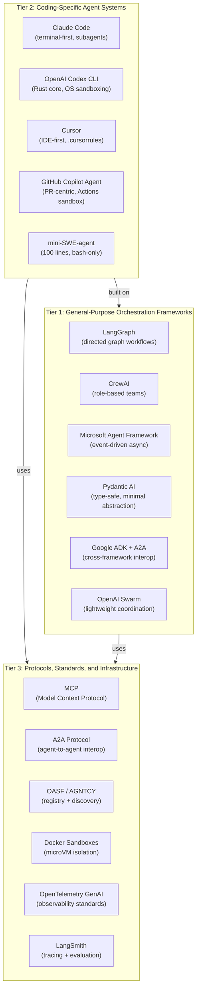
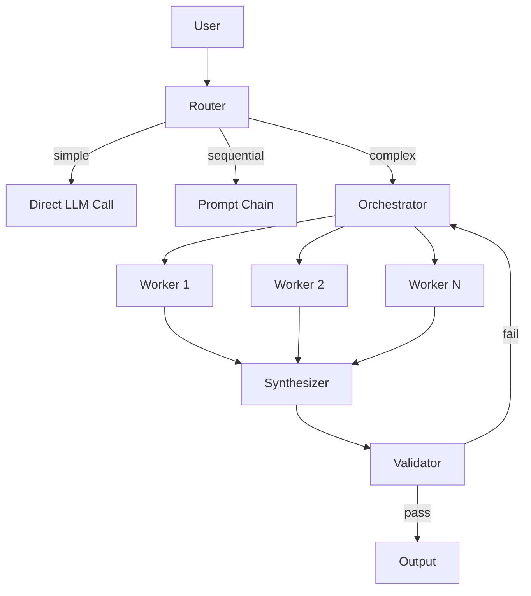
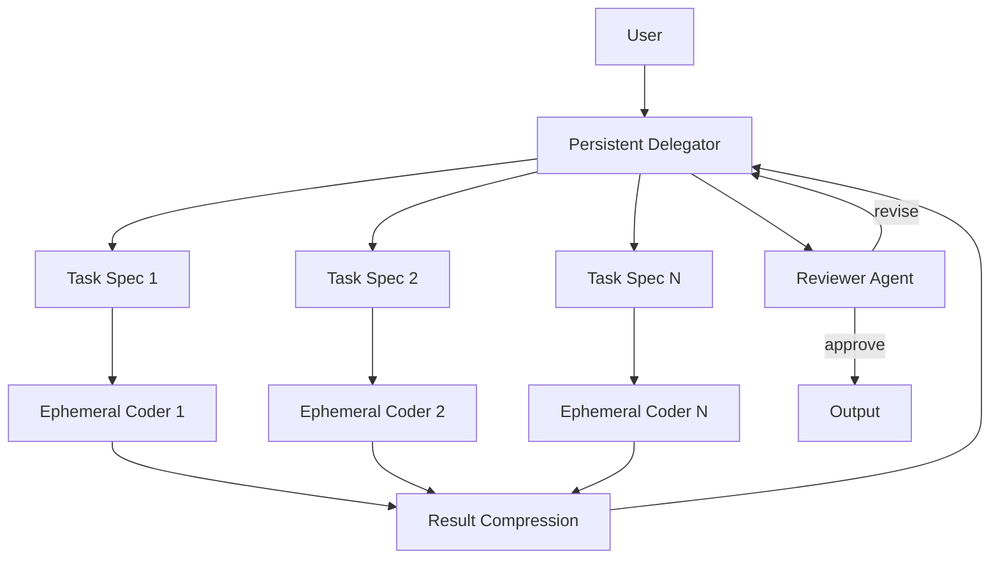
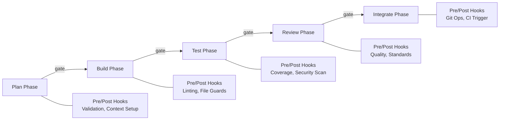
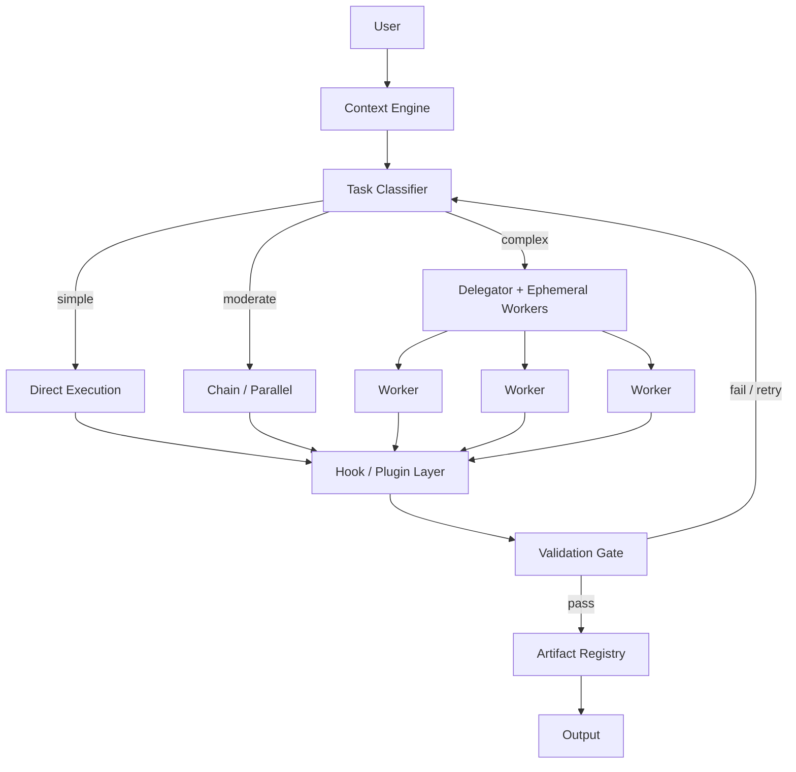
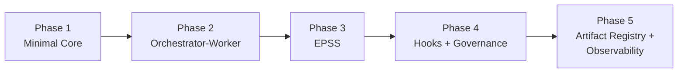

# AI Agent/Sub-Agent Workflow Exploration

> **Document type:** Whiteboard / Conceptual Exploration
> **Date:** February 2026
> **Purpose:** Greenfield exploration of the AI agent/sub-agent workflow design space for software development. This document maps the landscape, compares successful approaches, extracts reusable principles, and proposes candidate architecture directions for a future framework.

> **Evidence key:** Throughout this document, claims are tagged:
> - **[observed]** -- directly supported by benchmark data, published research, or documented production use
> - **[inferred]** -- reasoned conclusion drawn from multiple observed signals
> - **[recommended]** -- actionable suggestion based on the analysis

---

## Table of Contents

- [A) Landscape Overview](#a-landscape-overview)
- [B) Benchmark Analysis](#b-benchmark-analysis)
- [C) Pattern Library](#c-pattern-library)
- [D) Candidate Architecture Directions](#d-candidate-architecture-directions)
- [E) Design Principles for a Future Framework](#e-design-principles-for-a-future-framework)
- [F) Open Questions and Research Gaps](#f-open-questions-and-research-gaps)
- [G) Final Recommendation](#g-final-recommendation)
- [References](#references)

---

## A) Landscape Overview

The AI agent/sub-agent workflow ecosystem has matured rapidly through 2025-2026, moving from experimental prototypes to production-grade systems. This section maps the current landscape across three tiers and identifies the major trends shaping the space.

### A.1) Ecosystem Map

### A.2) Tier 1 -- General-Purpose Agent Orchestration Frameworks

**LangGraph** (LangChain team) models workflows as directed graphs with explicit state management, conditional routing, and loops. It is the most flexible framework in the space, supporting single-agent, multi-agent, hierarchical, and sequential architectures within a unified model. By late 2025, 600-800 companies had deployed LangGraph in production, including LinkedIn, Uber, and Klarna. The trade-off is a steeper learning curve and multiple abstraction layers (LangGraph -> LangChain -> LLM providers). **[observed]**

**CrewAI** organizes agents into role-based teams with personas and task assignments. It is optimized for rapid prototyping with the most intuitive design among the major frameworks and the lowest learning curve. CrewAI's strength is in declarative agent definition, where developers specify roles, goals, backstories, and delegation permissions. **[observed]**

**Microsoft Agent Framework** (formerly AutoGen + Semantic Kernel, unified in October 2025) uses a layered event-driven, asynchronous architecture where tasks are modeled as conversations between agents rather than explicit graph traversals. Both original frameworks entered maintenance mode after unification. Designed for enterprise scale and extensibility. **[observed]**

**Pydantic AI** takes a fundamentally different approach: type-safe agent construction with minimal abstraction. Agents are fully generic in their dependency and output types, enabling static type checking and IDE auto-completion. It uses Pydantic models to guarantee structured outputs, supports virtually every model/provider, and integrates with Pydantic Logfire for observability. The framework explicitly positions itself as a more engineered, lower-magic alternative to LangChain and DSPy. **[observed]**

**Google ADK** (Agent Development Kit) supports the A2A (Agent2Agent) Protocol, an open standard for cross-framework agent collaboration. A2A enables agents built with different frameworks, languages, or vendors to discover capabilities, negotiate interaction modalities, manage tasks, and exchange information securely. It is recommended when building microservices architectures or integrating third-party agent services. **[observed]**

**OpenAI Swarm** focuses on lightweight agent coordination with minimal orchestration overhead. It is a relatively newer entrant targeting simple multi-agent coordination scenarios. **[observed]**

### A.3) Tier 2 -- Coding-Specific Agent Systems

**Claude Code** (Anthropic) operates as a terminal-based agentic assistant using a three-phase loop: gather context, take action, verify results. It supports spawning parallel subagents (2-4 simultaneously), with built-in subagent types for exploration (fast, read-only), planning, and general-purpose tasks. Custom subagents can be defined via filesystem (`.claude/agents/`), configuration files, or programmatically through the SDK. Internal testing showed the multi-agent architecture delivering 90% performance gains on complex tasks compared to single-agent setups. The `AGENTS.md` convention provides hierarchical context at global, project, and directory scopes. **[observed]**

**OpenAI Codex CLI** is an open-source, local-first coding agent built in Rust. Its core is the agent loop: take user input, query the model, execute requested tool calls, append results, and repeat until a final response. It implements OS-level sandboxing (Apple Seatbelt on macOS, Landlock/seccomp on Linux, WSL2 on Windows) with defaults of read-only access. Git metadata remains read-only even when workspace writes are enabled, requiring explicit approval for commits. Configuration uses TOML with profile support, and memory guidance comes from `AGENTS.md` files. Open-source components include the CLI, SDK, App Server, and Skills system. **[observed]**

**Cursor** functions as an IDE-first tool that wraps AI around the editor, with the user driving file selection and positioning. It uses `.cursorrules` files for context management and includes Composer for multi-file edits, inline code suggestions, and built-in subagent types (explore, plan, general-purpose) with model-specific optimization (faster models for exploration, more capable models for complex reasoning). **[observed]**

**GitHub Copilot Coding Agent** takes a PR-centric approach, operating in sandboxed GitHub Actions environments. Its most distinctive innovation is markdown-defined agentic workflows -- repository automation expressed in natural language markdown files rather than complex YAML, compiled into executable GitHub Actions. Every action is traceable through pull request history with full commit logs and session visibility. Branch protections and CI/CD policies remain enforced, with human approval required for deployment workflows. **[observed]**

**mini-SWE-agent** is a 100-line Python agent that scores >74% on SWE-bench Verified, built by the Princeton and Stanford team behind SWE-bench. It uses only one tool -- bash -- and does not use language model tool-calling interfaces at all, relying entirely on standard shell commands. It uses linear message history (every step appends to messages sequentially) and independent actions via `subprocess.run` rather than stateful shell sessions. Adopted by Meta, NVIDIA, IBM, Stanford, and Princeton. Its existence is a powerful proof that radical simplicity can compete with far more complex systems. **[observed]**

### A.4) Tier 3 -- Protocols, Standards, and Infrastructure

**MCP (Model Context Protocol)** follows a client-host-server architecture where a host application manages multiple isolated client instances, each maintaining a 1:1 connection with an MCP server. Communication uses JSON-RPC 2.0 with bidirectional messaging and capability negotiation during initialization. Servers expose tools (executable functions), resources (context/data), and prompts (templated workflows). The formal extension framework uses vendor-prefix naming with extensions disabled by default. As of early 2026, MCP is the emerging standard for AI tool integration across all major coding agents and frameworks. **[observed]**

**A2A Protocol** (Google, v0.1.0) enables communication between independent agent systems built with different frameworks. Core components include Agent Cards (JSON capability metadata), Tasks (stateful work units), Messages (communication turns), Parts (content units: text, file, data), and Artifacts (tangible outputs). It is complementary to MCP -- where MCP connects agents to tools, A2A connects agents to agents. **[observed]**

**OASF / AGNTCY** provides agent registry and discovery infrastructure. The Open Agentic Schema Framework offers the foundational schema for describing agents. The Agent Directory Service uses skill taxonomies mapped to directory records via DHT routing, enabling semantic linkage for version histories, collaborative partnerships, and dependency chains. Multiple registry models exist: centralized (MCP Registry), decentralized (A2A Agent Cards, AGNTCY), enterprise (Microsoft Entra Agent ID), and verifiable credentials (NANDA Index AgentFacts). **[observed]**

**Docker Sandboxes** provide runtime isolation using lightweight microVMs with hypervisor-level boundaries (Hyper-V on Windows, virtualization.framework on macOS). Each sandbox runs a private Docker daemon, preventing access to the host system's Docker environment. Bidirectional file syncing maintains preserved absolute paths. Supported agents include Claude Code, Gemini, and GitHub Copilot. Security experts note that sandboxing addresses only where code runs, not what agents are allowed to do across systems -- a layered approach with least-privilege access, decision/permission layers, and capability controls is required. **[observed]**

**OpenTelemetry GenAI** is developing standardized semantic conventions for AI agent telemetry. The landscape remains fragmented, with various frameworks offering different built-in instrumentation. The effort aims to avoid vendor lock-in by establishing common formats for traces, metrics, and logs across agent systems. **[observed]**

**LangSmith** provides unified observability and evaluation for AI applications: step-by-step agent tracing, production monitoring with advanced filtering, automated actions on production data, and custom dashboards for costs, latency, and response quality. Works framework-agnostic and supports OpenTelemetry integration. **[observed]**

### A.5) Major Trends

1. **Shift from prompt engineering to context engineering.** Production agent failures stem primarily from context failures, not model failures. Context engineering -- structuring persistent, dynamic information environments for agents -- is emerging as a systems-level discipline distinct from prompt crafting. Stanford's ACE framework achieved 10.6% improvement on agentic tasks and 86.9% lower latency compared to model fine-tuning, without requiring labeled supervision. **[observed]**

2. **Convergence toward MCP as universal tool integration layer.** All major coding agents (Claude Code, Codex CLI, Cursor, GitHub Copilot) support MCP. The protocol's client-host-server architecture and formal extension framework position it as the HTTP of agent-tool communication. **[observed]**

3. **Architecture matters more than model choice.** Anthropic's multi-agent research system showed token usage explains 80% of performance variance, with tool calls and model choice accounting for only 15%. The SWE-bench results reinforce this: mini-SWE-agent achieves >74% with a 100-line architecture while more complex systems with larger models often perform worse. **[observed]**

4. **Movement from framework-heavy to lightweight composable patterns.** Anthropic's core guidance (December 2024, based on work with dozens of production teams): "the most successful implementations use simple, composable patterns rather than complex frameworks." Many patterns can be implemented in a few lines of code using direct LLM APIs. **[observed]**

5. **Production adoption at scale.** 67% of large enterprises were running autonomous AI agents in production as of January 2026. Over 70% of new AI projects use orchestration frameworks. The agentic AI market reached $7.55B in 2025, projected at $10.86B for 2026. **[observed]**

6. **High failure rate in AI pilots.** 95% of AI pilots fail to reach production, primarily due to architectural issues rather than model capability gaps. 40% of projects are predicted to be canceled by 2027 due to cost overruns or inadequate risk controls. This makes architectural design the primary determinant of success. **[observed]**

---

## B) Benchmark Analysis

This section compares five distinct implementations that represent different points in the design space, analyzing what makes each effective and extracting reusable lessons.

### B.1) Anthropic Multi-Agent Research System

| Dimension | Detail |
|-----------|--------|
| **Architecture** | Orchestrator (Claude Opus 4) + parallel workers (Claude Sonnet 4) |
| **Core pattern** | Orchestrator-Worker with parallel spawning |
| **Performance** | 90.2% improvement over single-agent Opus on internal research evaluations **[observed]** |
| **Token economics** | ~15x token consumption vs standard chat **[observed]** |
| **Key insight** | Token usage explains 80% of performance variance **[observed]** |
| **Best for** | Breadth-first parallel exploration of multiple independent research strands |

**How it works.** The lead agent (Opus 4) analyzes user queries, develops overall strategy, and manages memory to handle tasks exceeding token limits. It decomposes requests into subtasks and spawns parallel subagents (Sonnet 4) that search for information independently with isolated context windows. Subagents return only compressed critical findings, not intermediate processes, preventing context bloat in the lead agent.

**Why it works.** Three factors drive the performance gain:
- Context isolation prevents accumulated search results from degrading reasoning quality
- Parallel execution explores multiple directions simultaneously rather than sequentially
- Result compression keeps the lead agent's context focused on findings rather than process

**Limitations.** The system consumes approximately 15 times more tokens than standard chat, making it economically viable only where outcome value justifies the cost. It excels for problems divisible into parallel research strands but is less effective for tightly interdependent tasks like multi-file coding where changes must coordinate. **[observed]**

### B.2) mini-SWE-agent

| Dimension | Detail |
|-----------|--------|
| **Architecture** | Single agent, bash-only tool, linear message history |
| **Core pattern** | Autonomous agent loop with radical constraint |
| **Performance** | >74% on SWE-bench Verified in ~100 lines of Python **[observed]** |
| **Token economics** | Minimal overhead -- no framework layers |
| **Key insight** | Constraint is a superpower **[observed]** |
| **Best for** | Demonstrating that simplicity beats complexity for focused tasks |

**How it works.** The entire agent core is ~100 lines of Python (plus ~100 lines for environment/model/script components). It uses exactly one tool: bash. It does not use LLM tool-calling interfaces, instead relying on the model to output shell commands that are executed via `subprocess.run` (independent, non-stateful). Every step appends to messages passed to the LM sequentially (linear history), making the trajectory identical to the prompt.

**Why it works.** The architecture succeeds through constraint:
- No tool-calling API means no schema overhead and no confusion about when to use which tool
- Independent actions via `subprocess.run` make sandboxing trivial and scaling effortless
- Linear history eliminates the distinction between trajectory and prompts, simplifying debugging and fine-tuning
- Small codebase means entire system is auditable and debuggable

**Limitations.** Limited multi-file coordination capability. The linear history approach may not scale to very long-horizon tasks where context window management becomes critical. However, its performance demonstrates that agent architecture complexity is often inversely correlated with effectiveness for well-scoped tasks. **[observed]**

### B.3) CodeDelegator (EPSS Pattern)

| Dimension | Detail |
|-----------|--------|
| **Architecture** | Persistent Delegator + ephemeral Coder agents |
| **Core pattern** | Ephemeral-Persistent State Separation (EPSS) |
| **Performance** | Demonstrated improvement on long-horizon code-as-action tasks **[observed]** |
| **Key insight** | Context pollution from debugging traces is a primary failure mode **[observed]** |
| **Best for** | Long-horizon coding tasks with many sub-tasks |

**How it works.** CodeDelegator separates strategic planning from implementation through two component types. The Persistent Delegator maintains strategic oversight: decomposing tasks, writing specifications, and monitoring progress without executing code. Ephemeral Coder agents are freshly instantiated for each sub-task with clean contexts containing only their specification, completely shielded from prior failures and debugging traces.

**Why it works.** The system addresses a fundamental problem in single-agent architectures: code-as-action agents must simultaneously handle strategic planning and detailed implementation, but accumulating debugging traces and intermediate failures progressively dilute task-relevant information (context pollution). EPSS isolates each Coder's execution state while preserving global coherence through the Delegator.

**Limitations.** Coordination overhead between delegator and coders adds latency and token cost. The quality of task decomposition and specification writing by the Delegator is critical -- poor specs produce poor code. Performance on tightly interdependent tasks (where coders need awareness of each other's work) is less validated than on independently decomposable problems. **[inferred]**

### B.4) GitHub Copilot Coding Agent

| Dimension | Detail |
|-----------|--------|
| **Architecture** | PR-centric, sandboxed GitHub Actions environments |
| **Core pattern** | Declarative workflow definition + sandboxed execution |
| **Performance** | Production-grade for repository maintenance and issue resolution **[observed]** |
| **Key insight** | Natural language markdown compiled to executable workflows **[observed]** |
| **Best for** | Repository maintenance, issue resolution, CI/CD integration |

**How it works.** Developers define repository automation in natural language markdown files specifying triggers, permissions, outputs, and tools. The system compiles these into executable GitHub Actions workflows. Agents operate in isolated Actions-powered development environments, pushing commits to draft pull requests. Every action is traceable through the PR workflow with full commit history and session logs.

**Why it works.** The PR-centric approach provides built-in governance:
- Branch protections and CI/CD policies remain enforced without agent-specific security layers
- Human review is naturally integrated through the PR workflow
- Full traceability comes for free via Git history
- Markdown-based definitions are accessible to non-technical stakeholders

**Limitations.** Tightly coupled to the GitHub ecosystem. The declarative markdown approach, while intuitive, is less validated at scale for complex multi-step reasoning tasks. Best suited for well-defined repository maintenance patterns rather than open-ended development work. **[inferred]**

### B.5) OpenAI Codex CLI

| Dimension | Detail |
|-----------|--------|
| **Architecture** | Rust agent loop with OS-level sandboxing |
| **Core pattern** | Safety through constraint + local-first execution |
| **Performance** | Production-ready for local development workflows **[observed]** |
| **Key insight** | Git metadata read-only even with write access enabled **[observed]** |
| **Best for** | Local-first development with strong security boundaries |

**How it works.** The core agent loop in Rust orchestrates: (1) take user input and create a prompt, (2) query the model for inference, (3) execute tool calls, (4) append results back, (5) repeat until final response. OS-level sandboxing uses Apple Seatbelt (macOS), Landlock/seccomp (Linux), or WSL2 (Windows). The sandbox defaults to read-only and can be elevated to workspace-write or full access. Configuration uses TOML with profiles, and both interactive TUI and non-interactive (`codex exec`) modes are supported.

**Why it works.** Safety through architectural constraint:
- OS-level sandboxing is enforced by the kernel, not by the agent's compliance
- Git metadata is read-only even with workspace write access, preventing accidental commits or pushes
- Rust provides performance, strong typing, and direct system API integration
- TOML profiles enable behavior switching between contexts

**Limitations.** CLI-only interface limits accessibility for developers who prefer IDE-integrated workflows. The Rust implementation, while performant, creates a higher barrier for community contributions compared to Python-based systems. IDE extensions and the web interface remain proprietary. **[observed]**

### B.6) Cross-Cutting Lessons

These benchmarks reveal several cross-cutting patterns:

1. **Simple patterns consistently outperform complex frameworks in production.** mini-SWE-agent's 100-line architecture competing with far more sophisticated systems is the strongest signal. Anthropic's production experience with dozens of teams reinforces this. **[observed]**

2. **Context isolation between agents is more important than agent sophistication.** Both Anthropic's multi-agent system and CodeDelegator derive their primary advantage from preventing context pollution, not from using better models. **[observed]**

3. **73% of task failures stem from cascading errors, not individual mistakes.** Failed trajectories contain an average of 3.7 compounded errors. Unlike traditional software, agent errors create ripple effects that corrupt all downstream decisions rather than being isolated. **[observed]**

4. **95% of AI pilots fail to reach production, primarily due to architectural issues.** The failure mode is not "the model isn't good enough" but "the system architecture doesn't work." This makes the choice of workflow architecture the highest-leverage decision. **[observed]**

5. **Safety is an architectural property, not a behavioral promise.** The most reliable systems (Codex CLI, Docker Sandboxes) enforce safety through OS-level constraints, not through agent instructions or prompt engineering. **[inferred]**

---

## C) Pattern Library

This section catalogs the most significant patterns and anti-patterns observed across the landscape, with guidance on when each applies.

### C.1) Recommended Patterns

#### Orchestrator-Worker

An orchestrator LLM dynamically breaks down tasks, delegates to worker LLMs, and synthesizes results. The orchestrator maintains strategic oversight while workers execute independently.

- **When to use:** Complex tasks where subtask count and nature cannot be predicted in advance. Coding tasks requiring changes across multiple files. Research tasks requiring parallel exploration.
- **When to avoid:** Simple tasks where the coordination overhead exceeds the benefit. Tasks with tightly sequential dependencies where parallelization is impossible.
- **Sources:** Anthropic "Building Effective Agents," Anthropic multi-agent research system, Claude Code architecture.

#### Ephemeral-Persistent State Separation (EPSS)

A persistent agent maintains strategic state (plan, progress, decisions) while ephemeral agents handle implementation tasks with fresh contexts. Ephemeral agents receive only their task specification and return only compressed results.

- **When to use:** Long-horizon tasks where context pollution from debugging traces degrades performance. Multi-step coding tasks with many sub-tasks. Any workflow where accumulated failure history would degrade planning quality.
- **When to avoid:** Simple tasks that fit in a single context window. Tasks where maintaining full history is essential for correctness.
- **Sources:** CodeDelegator (arXiv 2601.14914), Claude Code subagent architecture.

#### Plan-Act-Check-Refine Loop

Decompose tasks into substeps, execute using tools, validate results against constraints, and adjust or retry if checks fail. This self-correcting loop prevents silent failures.

- **When to use:** Any multi-step task requiring validation. Production workflows where silent failures have consequences.
- **When to avoid:** Very simple tasks where the check step adds unnecessary latency.
- **Sources:** Anthropic patterns, production workflow guides, AGENTSAFE framework.

#### Evaluator-Optimizer

One LLM generates a response while another evaluates and provides feedback in a loop, iteratively improving quality until acceptance criteria are met.

- **When to use:** Tasks with clear evaluation criteria where iterative refinement provides measurable value. Literary translation. Complex search requiring multiple rounds. Code review workflows.
- **When to avoid:** Tasks where evaluation criteria are ambiguous or subjective. Latency-sensitive scenarios where iteration loops are unacceptable.
- **Sources:** Anthropic "Building Effective Agents."

#### Prompt Chaining

A task is decomposed into a sequence of steps where each LLM call processes the output of the previous one. Programmatic gates between steps verify intermediate results.

- **When to use:** Tasks that decompose cleanly into fixed sequential subtasks. Scenarios where trading latency for accuracy is acceptable.
- **When to avoid:** Tasks where subtask boundaries are unclear or dynamic.
- **Sources:** Anthropic "Building Effective Agents."

#### Routing

An input is classified and directed to a specialized downstream handler. Enables separation of concerns and specialized prompts per category.

- **When to use:** Complex tasks with distinct categories that benefit from specialized handling. Cost optimization by routing simple queries to smaller models and complex ones to larger models.
- **When to avoid:** Homogeneous inputs where routing adds overhead without benefit.
- **Sources:** Anthropic "Building Effective Agents."

#### Parallelization (Sectioning + Voting)

Independent subtasks run simultaneously (sectioning) or the same task runs multiple times for diverse outputs (voting).

- **When to use:** Subtasks that can be parallelized for speed. Scenarios requiring multiple perspectives for higher confidence (e.g., code vulnerability review, content moderation).
- **When to avoid:** Tightly coupled tasks where subtask outputs depend on each other.
- **Sources:** Anthropic "Building Effective Agents."

#### Agent-as-Tool

Agents are exposed as callable tools rather than autonomous conversational entities. The orchestrator calls agents as functions, receives structured results, and maintains control flow.

- **When to use:** When subagents must reliably return control to the orchestrator. When structured, predictable outputs from sub-agents are required.
- **When to avoid:** When sub-agents require extended autonomous operation or multi-turn conversation.
- **Sources:** Medium (Pradeep Jain), Microsoft Copilot Studio guidance.

#### Context Folding

Proactive context management that "folds" conversation/task history at multiple scales -- granular condensations preserving details for recent work, deep consolidations abstracting older multi-step sequences.

- **When to use:** Long-running workflows where accumulated history exceeds context windows. Any system where context window size is a binding constraint.
- **When to avoid:** Short tasks that fit comfortably within context limits.
- **Sources:** AgentFold (arXiv 2510.24699), achieving 36.2% on BrowseComp with a 30B model surpassing much larger competitors.

#### Fresh-Context-Per-Phase

Each workflow phase (planning, building, validation) operates with a fresh context containing only the relevant inputs and specifications from the prior phase, rather than carrying forward full history.

- **When to use:** Multi-phase workflows where accumulated context from earlier phases degrades later-phase performance. Software development workflows with distinct plan/build/test stages.
- **When to avoid:** Workflows where inter-phase context is essential and cannot be adequately summarized.
- **Sources:** clouatre.ca (subagent architecture for code), research showing 25-30% productivity improvements from token optimization.

#### Human-in-the-Loop Checkpoints

Deterministic intervention points where human review, approval, or correction is architecturally required before the workflow proceeds.

- **When to use:** High-risk decisions. Ambiguous requirements. Any production workflow where autonomous errors have significant consequences.
- **When to avoid:** Low-risk, high-volume tasks where human review would create bottlenecks without proportional risk reduction.
- **Sources:** AGENTSAFE (arXiv 2512.03180), MI9 (arXiv 2508.03858), all production frameworks.

#### Bash-Only Tooling

Providing agents with only a shell (bash) as their tool, rather than a suite of specialized tools. The agent uses standard shell commands for all file, search, and execution operations.

- **When to use:** Maximizing simplicity and sandboxability. Scenarios where debugging transparency is paramount. Fine-tuning pipelines where a simple tool interface reduces complexity.
- **When to avoid:** Tasks requiring specialized tool interfaces that cannot be expressed through shell commands.
- **Sources:** mini-SWE-agent (>74% SWE-bench Verified with bash as the only tool).

### C.2) Anti-Patterns

#### Over-Decomposition

Creating too many sub-agents or sub-tasks increases coordination overhead without proportional benefit. Each additional agent introduces latency, token cost, and potential for miscommunication.

- **Signal you're doing this:** More time spent on inter-agent coordination than on actual task execution. Sub-tasks that are trivial individually but expensive to coordinate.
- **Remedy:** Use bounded fan-out. Start with the minimum number of agents and add only when measurably beneficial.
- **Evidence:** Production guides emphasize KISS and single-responsibility agents over complex hierarchies. **[observed]**

#### Context Accumulation

Appending all history, debug traces, and intermediate results to a single agent's context window. This progressively dilutes task-relevant information and degrades both planning and implementation capabilities.

- **Signal you're doing this:** Agent performance degrades as conversations grow longer. Planning quality decreases after debugging cycles.
- **Remedy:** Use EPSS, context folding, or fresh-context-per-phase patterns. Compress or discard intermediate information that is no longer decision-relevant.
- **Evidence:** 31% of agent failures originate from memory-related issues. CodeDelegator showed significant improvement by preventing context pollution. **[observed]**

#### Premature Autonomy

Granting agents full autonomous operation before establishing verification loops, governance gates, and rollback mechanisms.

- **Signal you're doing this:** Agents making irreversible changes without approval. No mechanism to detect or correct erroneous autonomous actions.
- **Remedy:** Start with human-in-the-loop for all consequential actions. Gradually expand autonomy as trust is established through verified correctness.
- **Evidence:** Microsoft's failure taxonomy documents novel agent-specific failure modes. AGENTSAFE and MI9 treat human oversight as an architectural requirement. **[observed]**

#### Framework Over-Reliance

Using complex orchestration frameworks when simple API calls would suffice. Extra abstraction layers obscure underlying prompts and responses, making systems harder to debug and more brittle.

- **Signal you're doing this:** Unable to inspect or modify the exact prompts being sent to the LLM. Debugging requires understanding framework internals. "Incorrect assumptions about what's under the hood" are causing errors.
- **Remedy:** Start with direct LLM API calls. Add framework layers only when the complexity they manage exceeds the complexity they introduce.
- **Evidence:** Anthropic's explicit recommendation: "the most successful implementations weren't using complex frameworks or specialized libraries. Instead, they were building with simple, composable patterns." **[observed]**

#### Single-Agent Monolith

Attempting to handle planning, execution, debugging, and review in a single context window. The agent must simultaneously maintain strategic oversight and handle implementation details, leading to context pollution.

- **Signal you're doing this:** Agent alternates between high-level planning and low-level debugging within the same conversation. Quality of plans degrades after implementation failures.
- **Remedy:** Separate planning and execution into distinct agents or phases with isolated contexts (EPSS, fresh-context-per-phase).
- **Evidence:** CodeDelegator demonstrated that role separation prevents context pollution from degrading both planning and implementation. **[observed]**

#### Assumption Substitution

Agents substituting missing entities or requirements with assumptions rather than seeking clarification. This is an instance of "over-helpfulness" where the agent fills gaps with plausible but incorrect information.

- **Signal you're doing this:** Agents produce outputs that superficially look correct but contain fabricated or assumed details. Requirements gaps are silently resolved rather than flagged.
- **Remedy:** Configure agents to explicitly flag uncertainty and request clarification. Build verification steps that check outputs against source requirements.
- **Evidence:** Research shows agents are vulnerable to this under information overload, and it becomes especially problematic with complex, ambiguous inputs. **[observed]**

---

## D) Candidate Architecture Directions

This section proposes four candidate architecture directions for a future agent workflow system, progressing from minimal to comprehensive. Each is evaluated on its merits, trade-offs, and applicability.

### D.1) Direction 1: Minimal Composable Core

**Philosophy:** Inspired by Anthropic's guidance and mini-SWE-agent's proof that radical simplicity works.

**Core characteristics:**
- No framework dependency -- direct LLM API calls with a thin orchestration layer
- Pattern selection at runtime based on task complexity (routing)
- MCP for all tool integration
- File-based configuration (`AGENTS.md`, TOML/YAML)
- Validation gates between pattern stages

**Pros:**
- Maximum flexibility, debuggability, and low overhead
- Matches what works in production (Anthropic's strongest recommendation)
- Easiest to understand, modify, and extend
- Lowest barrier to getting started

**Cons:**
- More initial engineering effort (no out-of-box features)
- Requires discipline to avoid reinventing framework capabilities
- Limited built-in governance and observability

**Operational complexity:** Low
**Scalability:** High (add patterns as needed)

### D.2) Direction 2: Delegator-Coder with EPSS

**Philosophy:** Inspired by CodeDelegator and Claude Code's architecture. Addresses context pollution as the primary failure mode in long-horizon coding tasks.

**Core characteristics:**
- Persistent strategic agent (high-capability model) maintains plan, progress, and decisions
- Ephemeral coder agents (fast model) get clean context per sub-task with only their specification
- Result compression prevents context bloat in the delegator
- Separate reviewer agent for quality assurance
- Clear separation between strategic oversight and tactical implementation

**Pros:**
- Proven context pollution prevention (CodeDelegator research)
- Clear separation of concerns maps well to software development
- Scales naturally to long-horizon, multi-file tasks
- Model cost optimization (expensive model for planning, cheap model for coding)

**Cons:**
- Higher token cost (~15x for multi-agent overhead)
- Coordination overhead between delegator and coders
- Quality depends heavily on the delegator's specification writing
- Less validated on tightly interdependent tasks

**Operational complexity:** Medium
**Scalability:** High for complex multi-file tasks

### D.3) Direction 3: Phase-Gated Pipeline with Hooks

**Philosophy:** Inspired by SDLC integration patterns and production governance frameworks. Maps agent workflows to familiar development lifecycle stages.

**Core characteristics:**
- Explicit phases aligned to SDLC stages (Plan -> Build -> Test -> Review -> Integrate)
- Deterministic gates between phases enforcing quality/validation checkpoints
- Hook system for extensibility at every lifecycle point (pre/post execution, validation)
- Fresh context per phase prevents cross-phase pollution
- Plugin architecture for custom validators, formatters, reporters, and governance rules

**Pros:**
- Auditable and governable -- every phase transition is a recorded decision point
- Maps naturally to team workflows (Agile sprints, PR reviews, CI/CD)
- Extensible through hooks without modifying core pipeline logic
- Fresh-context-per-phase prevents accumulation-based degradation

**Cons:**
- Rigid phase structure may not fit all task types (exploration, prototyping)
- Overhead for simple tasks that don't need the full pipeline
- Phase definitions may need customization per project/team
- Risk of over-governance on low-risk tasks

**Operational complexity:** Medium-high
**Scalability:** High for team and enterprise workflows

### D.4) Direction 4: Hybrid Adaptive (Recommended Starting Point)

**Philosophy:** Combines the strongest elements from Directions 1-3. Routes tasks to the simplest sufficient execution pattern and adds governance/extensibility as a cross-cutting concern.

**Core characteristics:**
- **Adaptive complexity**: A task classifier routes inputs to the simplest sufficient pattern -- direct execution for simple tasks, prompt chaining or parallelization for moderate ones, full delegator-coder with EPSS for complex multi-file work
- **Context engine**: Manages structured knowledge (`AGENTS.md`, project context), assembled just-in-time in the right format with minimal high-signal information (context engineering, not prompt engineering)
- **EPSS for complex tasks**: Persistent delegator with ephemeral workers for long-horizon coding, direct execution for everything else
- **Universal hook/plugin layer**: Cross-cutting governance, observability, and extensibility applied uniformly regardless of which execution pattern is active
- **Artifact registry**: Every output, decision, and intermediate result is tracked with provenance metadata for traceability and reproducibility
- **MCP for all external tool integration**: Protocol-first approach to tooling avoids vendor lock-in

**Pros:**
- Right-sized complexity -- tasks get only as much orchestration as they need
- Incorporates best practices from all three other directions
- Extensible through hooks and plugins without modifying core logic
- Production-ready governance and observability from the start
- Protocol-first (MCP, hooks, file-based config) avoids framework and vendor lock-in

**Cons:**
- Most design effort upfront compared to starting with a single direction
- Risk of over-engineering if the adaptive classifier is not carefully calibrated
- Requires discipline to keep the core minimal while the extension layer grows

**Operational complexity:** Medium (starts simple, grows as needed)
**Scalability:** Highest (adapts to task complexity, team size, and governance requirements)

### D.5) Architecture Comparison Summary

| Dimension | Direction 1 (Minimal) | Direction 2 (EPSS) | Direction 3 (Phase-Gated) | Direction 4 (Hybrid) |
|-----------|----------------------|--------------------|--------------------------|--------------------|
| Initial effort | Low | Medium | Medium-High | Medium |
| Ceiling complexity | Medium | High | High | Highest |
| Context pollution risk | Medium | Low | Low | Low |
| Governance | Manual | Manual | Built-in | Built-in |
| Extensibility | Ad-hoc | Limited | Hooks + Plugins | Hooks + Plugins |
| Best for | Prototyping, small tasks | Long-horizon coding | Team workflows | All of the above |
| Production readiness | Moderate | Moderate | High | High |

---

## E) Design Principles for a Future Framework

These principles are derived from observed evidence across the benchmarked systems, academic research, and production case studies. They are ordered from most foundational to most operational.

### E.1) Start Simple, Earn Complexity

Use the simplest pattern that works. Add orchestration layers, multi-agent coordination, and governance mechanisms only when they provide measurable improvement over simpler alternatives.

**Evidence:** Anthropic's work with dozens of production teams found simple composable patterns outperform complex frameworks. mini-SWE-agent achieves >74% SWE-bench Verified in 100 lines. 95% of AI pilot failures trace to architectural over-engineering. **[observed]**

### E.2) Context Isolation Over Context Sharing

Agents should receive minimal, focused context. Prevent pollution from debug traces, intermediate failures, and irrelevant history. When agents must share information, compress and curate the shared context rather than passing raw history.

**Evidence:** CodeDelegator's EPSS pattern demonstrated significant improvement by preventing context pollution. Anthropic's multi-agent system returns only compressed findings from subagents. 31% of agent failures originate from memory-related issues. **[observed]**

### E.3) Architecture Over Model Choice

System design explains more performance variance than model selection. Invest in workflow architecture, context engineering, and tool design before pursuing model upgrades.

**Evidence:** Anthropic research: token usage explains 80% of performance variance, model choice accounts for ~15%. mini-SWE-agent competes with systems using larger, more expensive models through architecture alone. Stanford ACE framework achieved 10.6% improvement through context engineering, not model change. **[observed]**

### E.4) Canonical Organization

Every artifact, decision, and output should have a well-defined location and naming convention. File-based configuration (`AGENTS.md`, structured YAML/TOML) over database-driven config. The system should be navigable and understandable through its file structure alone.

**Evidence:** All successful coding agents use file-based conventions: `AGENTS.md` (Claude Code, Codex CLI), `.cursorrules` (Cursor), `copilot-instructions.md` (GitHub Copilot). These are version-controlled, diffable, and reviewable. **[observed]**

### E.5) Traceability End-to-End

Every task, commit, artifact, and decision should be traceable back to its origin. Immutable audit trails, not optional logging. The system should support answering "why was this decision made?" and "what produced this artifact?" at any point.

**Evidence:** GitHub Copilot Coding Agent provides full commit history and session logs per PR. MAIF embeds cryptographic provenance with hash-chained blocks for tamper-evident audit trails. MI9 implements semantic telemetry capture for continuous authorization monitoring. **[observed]**

### E.6) Modularity Through Protocols

Use MCP for tool integration, A2A for agent interop, hooks for lifecycle extension. Build against protocols, not implementations. This avoids framework lock-in while remaining compatible with the broader ecosystem.

**Evidence:** MCP has achieved near-universal adoption across coding agents (Claude Code, Codex CLI, Cursor, GitHub Copilot). A2A enables cross-framework agent collaboration. Both are open standards with growing ecosystem support. **[observed]**

### E.7) Agent-Agnostic by Default

The workflow system should work with any LLM provider or agent runtime. No hard dependencies on specific models or vendors. Model selection should be a configuration choice, not an architectural constraint.

**Evidence:** Pydantic AI supports virtually every model and provider through a unified interface. mini-SWE-agent works with any model via litellm, OpenRouter, or Portkey. Codex CLI supports multiple providers through TOML configuration. **[observed]**

### E.8) Token Efficiency as Architecture

Context engineering -- just-in-time assembly, compression, folding -- is a first-class architectural concern, not a post-hoc optimization. The system should minimize token usage per unit of useful output as a core design goal.

**Evidence:** AgentFold achieved 36.2% on BrowseComp with a 30B model (surpassing larger models) through proactive context management. ACON reduced peak tokens by 26-54% while preserving task performance. MemAct achieved 51% reduction in average context length with a 14B model matching 16x larger models. **[observed]**

### E.9) Deterministic Gates, Non-Deterministic Agents

Use deterministic validation checkpoints between non-deterministic agent phases. Never trust agent output without programmatic verification. Gates should use traditional software techniques (schema validation, test execution, linting) rather than LLM-based evaluation where possible.

**Evidence:** Production guides universally recommend tool-augmented verification over LLM-based validation. Microsoft's failure taxonomy documents fifteen hidden failure modes that emerge only under production conditions. Output variability exceeds 20-30% in multi-step reasoning tasks. **[observed]**

### E.10) Human Oversight as Architecture

Human-in-the-loop is a design requirement, not a temporary safeguard. Build escalation paths, approval gates, and intervention points into the core architecture. Define graduated autonomy levels based on verified trust.

**Evidence:** AGENTSAFE and MI9 treat human oversight as an architectural requirement with graduated containment strategies. Docker security experts note that sandboxing alone is insufficient -- capability controls and decision layers are required. All successful production frameworks include human approval mechanisms. **[observed]**

### E.11) Extensibility Through Hooks, Not Forks

Pre/post execution hooks, plugin interfaces, and event-driven extension points prevent the need to modify core logic. The system should be extendable without being fragile.

**Evidence:** Google ADK supports plugins registered globally with callback methods. Agent Factory implements hook systems that guarantee enforcement through automatic execution rather than prompt adherence. Microsoft Agent Framework has active proposals for pipeline behavior extension points. **[observed]**

### E.12) Reliability Through Constraint

Safety comes from what agents cannot do, not from what they promise not to do. Sandboxing, least-privilege access, capability controls, and bounded resource budgets are architectural properties, not behavioral guidelines.

**Evidence:** Codex CLI's OS-level sandboxing is enforced by the kernel. Docker Sandboxes use hypervisor-level isolation with private daemons. mini-SWE-agent's independent actions via `subprocess.run` make sandboxing trivial. Git metadata remaining read-only even with write access is a constraint, not a policy. **[observed]**

---

## F) Open Questions and Research Gaps

### F.1) Requires Prototyping

These questions can only be answered through hands-on experimentation:

- **Task classifier calibration.** What is the optimal threshold for routing between simple/moderate/complex execution paths in Direction 4? How should this be calibrated -- fixed rules, model-based classification, or adaptive learning?

- **Artifact registry schema design.** How should the registry be structured for maximum traceability without excessive overhead? What metadata is essential vs. nice-to-have? How does registry overhead scale with project size?

- **Hook injection point granularity.** What is the right number and placement of hook injection points? Too few creates inflexibility; too many introduces a performance tax and cognitive overhead for plugin developers.

- **EPSS on tightly interdependent tasks.** CodeDelegator and Anthropic's multi-agent system excel on independently decomposable problems. How does EPSS perform when Worker B needs awareness of Worker A's output -- for example, modifying a function signature that other files depend on?

### F.2) Requires Deeper Validation

These questions have promising initial research but lack production-scale validation:

- **Long-horizon state management at scale.** Current approaches (MemAct, AgentFold, CORAL) show strong results in controlled experiments. Production validation at scale (thousands of concurrent tasks, weeks-long projects) is absent from published literature.

- **Cost models for multi-agent systems.** The 15x token overhead of multi-agent systems needs rigorous economic analysis against developer time savings and error-rate reduction. Under what conditions does the investment pay off?

- **MCP server security.** Emerging threats include tool poisoning (malicious tool descriptions), MCP shadowing (intercepting tool calls), and secret exfiltration. Docker has published guidance, but mature, battle-tested solutions do not yet exist.

- **Standardization maturity.** OpenTelemetry GenAI conventions and the A2A Protocol are both pre-1.0. Early adoption carries risk of breaking changes, but waiting risks missing ecosystem momentum.

### F.3) Unclear

These questions are not yet well-addressed in the literature:

- **Cross-agent real-time dependency.** When Worker B needs Worker A's output mid-execution (not just at completion), how should this be handled? Polling, event subscription, and synchronization barriers each have different trade-offs.

- **Natural language workflow definitions at scale.** GitHub's markdown-defined agentic workflows are innovative but unproven at scale. What is the failure rate when workflow definitions are ambiguous, contradictory, or incomplete?

- **Governance framework adversarial robustness.** AGENTSAFE and MI9 provide theoretical governance frameworks, but their performance under adversarial conditions (prompt injection, tool poisoning, social engineering of agents) is not empirically validated.

- **Optimal model mixing strategies.** Anthropic uses Opus for orchestration and Sonnet for workers. What are the optimal model-tier assignments for different task types? How sensitive is overall system performance to this choice?

- **Agent fine-tuning economics.** mini-SWE-agent's linear history makes fine-tuning straightforward, but the economics of fine-tuning for specific workflows vs. using general-purpose models with better prompting are not well-characterized.

---

## G) Final Recommendation

### G.1) Recommended Direction

**Direction 4 (Hybrid Adaptive)** is the recommended conceptual direction, implemented incrementally starting with Direction 1's minimal composable core and progressively incorporating Direction 2's EPSS pattern and Direction 3's hook/governance layer as complexity demands.

### G.2) Rationale

The recommendation rests on four pillars, each supported by distinct evidence:

**1. Alignment with the strongest empirical signal.** Simple, composable patterns outperform complex frameworks in production. This is not a single data point but a convergent finding across Anthropic's customer work (dozens of teams), mini-SWE-agent's benchmark results (100 lines competing with complex systems), and the 95% failure rate of over-engineered AI pilots. Starting minimal is not a compromise -- it is the highest-probability path to a working system. **[observed]**

**2. Avoidance of premature architecture lock-in.** The hybrid adaptive approach does not commit to a single execution model upfront. It provides a growth path: start with direct LLM calls and routing, add orchestrator-worker when tasks demand it, introduce EPSS for long-horizon coding, and layer on governance hooks for team/enterprise workflows. Each addition is driven by demonstrated need, not speculative architecture. **[inferred]**

**3. Protocol-first, vendor-agnostic design.** By building against MCP for tools, hooks for extensibility, and file-based configuration for context, the system avoids framework and vendor lock-in. It remains compatible with every major LLM provider and coding agent ecosystem while maintaining the freedom to swap any component. **[recommended]**

**4. Empirically grounded governance model.** The hook/plugin layer provides governance, observability, and extensibility as cross-cutting concerns applied uniformly to all execution patterns. This addresses the 95% pilot failure rate by building quality gates into the architecture rather than relying on agent compliance. **[inferred]**

### G.3) Implementation Growth Path

**Phase 1: Minimal Core (Direction 1)**
- Direct LLM API calls with thin orchestration
- Router for task classification
- MCP for tool integration
- File-based configuration (`AGENTS.md`)
- Basic validation gates

**Phase 2: Add Orchestrator-Worker**
- Dynamic task decomposition for complex multi-file tasks
- Parallel worker spawning (bounded fan-out)
- Result synthesis and compression
- Model-tier routing (expensive for planning, cheap for execution)

**Phase 3: Add EPSS**
- Persistent delegator with ephemeral coders
- Fresh context per sub-task with specification-only inputs
- Result compression returning only critical findings
- Reviewer agent for quality assurance

**Phase 4: Add Hooks and Governance**
- Pre/post execution hooks at tool, model, and agent levels
- Plugin interface for custom validators, formatters, reporters
- Deterministic quality gates between workflow phases
- Human-in-the-loop checkpoints for high-risk operations

**Phase 5: Add Artifact Registry and Observability**
- Artifact tracking with provenance metadata
- OpenTelemetry integration for standardized tracing
- Cost, latency, and quality metrics dashboards
- Audit trails for compliance and reproducibility

### G.4) What to Validate Next Before Implementation

1. **Prototype the minimal core** (Phase 1) with 2-3 real coding tasks of varying complexity. Measure: task completion rate, token usage, developer experience, time-to-working-output.

2. **Validate EPSS on tightly-coupled tasks.** Current research demonstrates EPSS on independently decomposable problems. Test with tasks requiring coordinated changes across multiple interdependent files (e.g., API contract changes propagating through handlers, types, and tests).

3. **Define the artifact registry schema.** Design the minimal metadata model that supports traceability without excessive overhead. Prototype with 10-20 representative tasks and evaluate whether the schema captures the necessary provenance without becoming a maintenance burden.

4. **Benchmark context management strategies.** Compare token efficiency and task performance across three approaches: naive context accumulation, fresh-context-per-phase, and context folding. Use a standardized task set to produce comparable measurements.

5. **Establish observability baseline.** Instrument a prototype with OpenTelemetry before adding custom instrumentation. Determine what the standard telemetry captures and where custom traces/metrics are needed.

---

## References

### Primary Sources (Foundational)

1. Anthropic. "Building Effective Agents." December 2024. https://anthropic.com/research/building-effective-agents

2. Anthropic. "How we built our multi-agent research system." June 2025. https://anthropic.com/engineering/multi-agent-research-system

3. Anthropic. "When to use multi-agent systems (and when not to)." 2025. https://claude.com/blog/building-multi-agent-systems-when-and-how-to-use-them

4. SWE-agent team (Princeton/Stanford). "mini-SWE-agent." https://github.com/SWE-agent/mini-swe-agent

5. OpenAI. "Codex CLI: Open-Source Local Coding Agent." 2025. https://github.com/openai/codex

6. OpenAI. "Unrolling the Codex agent loop." 2025. https://openai.com/index/unrolling-the-codex-agent-loop/

### Academic Papers

7. "CodeDelegator: Mitigating Context Pollution via Role Separation in Code-as-Action Agents." arXiv 2601.14914. January 2026.

8. "AgentFold: Long-Horizon Web Agents with Proactive Context Management." arXiv 2510.24699. October 2025.

9. "ACON: Optimizing Context Compression for Long-horizon LLM Agents." arXiv 2510.00615. October 2025.

10. "Memory as Action: Autonomous Context Curation for Long-Horizon Agentic Tasks (MemAct)." arXiv 2510.12635. October 2025.

11. "Agentic Context Engineering: Evolving Contexts for Self-Improving Language Models (ACE)." arXiv 2510.04618. October 2025.

12. "AGENTSAFE: A Unified Framework for Ethical Assurance and Governance in Agentic AI." arXiv 2512.03180. December 2025.

13. "MI9: An Integrated Runtime Governance Framework for Agentic AI." arXiv 2508.03858. August 2025.

14. "A Practical Guide for Designing, Developing, and Deploying Production-Grade Agentic AI Workflows." arXiv 2512.08769. December 2025.

15. "SWE-bench Pro: Can AI Agents Solve Long-Horizon Software Engineering Tasks?" arXiv 2509.16941. September 2025.

16. "SWE-bench Goes Live!" arXiv 2505.23419. May 2025.

17. "Where LLM Agents Fail and How They Can Learn: Systematic Error Analysis and Remediation." 2025.

18. "How Do LLMs Fail In Agentic Scenarios? A Qualitative Analysis." arXiv 2512.07497. December 2025.

19. "Exploring Autonomous Agents: A Closer Look at Why They Fail When Completing Tasks." arXiv 2508.13143. August 2025.

20. "Context Engineering 2.0: The Context of Context Engineering." arXiv 2510.26493. October 2025.

### Protocols and Standards

21. Model Context Protocol Specification. November 2025. https://modelcontextprotocol.info/specification/2025-11-25

22. MCP Architecture. June 2025. https://modelcontextprotocol.io/specification/2025-06-18/architecture

23. Google A2A Protocol Specification. https://google.github.io/A2A/specification/

24. Google ADK Documentation. https://google.github.io/adk-docs/

25. OpenTelemetry. "AI Agent Observability: Evolving Standards and Best Practices." 2025. https://opentelemetry.io/blog/2025/ai-agent-observability

### Industry Sources

26. GitHub. "Agentic Workflows." https://github.github.io/gh-aw/

27. GitHub Blog. "GitHub Copilot: Meet the new coding agent." 2025. https://github.blog/news-insights/product-news/github-copilot-meet-the-new-coding-agent

28. Docker. "Secure AI Agents at Runtime." 2025. https://www.docker.com/blog/secure-ai-agents-runtime-security/

29. Docker Sandboxes Documentation. https://docs.docker.com/ai/sandboxes/

30. Docker. "What's Next for MCP Security?" 2025. https://www.docker.com/blog/whats-next-for-mcp-security/

31. Microsoft. "Taxonomy of Failure Modes in Agentic AI Systems." Whitepaper. 2025.

32. LangSmith Documentation. https://www.langchain.com/langsmith

33. Pydantic AI Documentation. https://github.com/pydantic/pydantic-ai

34. Vellum. "Agentic Workflows in 2026: The Ultimate Guide." https://vellum.ai/blog/agentic-workflows-emerging-architectures-and-design-patterns

35. Microsoft Learn. "Orchestrator and subagent multi-agent patterns." https://learn.microsoft.com/en-us/microsoft-copilot-studio/guidance/architecture/multi-agent-orchestrator-sub-agent

36. Clouatre. "Orchestrating AI Agents: A Subagent Architecture for Code." https://clouatre.ca/posts/orchestrating-ai-agents-subagent-architecture/

37. Softcery. "Agentic Coding with Claude Code and Cursor: Context Files, Workflows, and MCP Integration." https://softcery.com/lab/softcerys-guide-agentic-coding-best-practices

38. BIX Tech. "From Planning to Production: Integrating AI Agents into the SDLC." https://bix-tech.com/from-planning-to-production-a-practical-guide-to-integrating-ai-agents-into-the-software-development-lifecycle-sdlc/

39. MAIF: "Enforcing AI Trust and Provenance with an Artifact-Centric Agentic Paradigm." arXiv 2511.15097. November 2025.

40. AGNTCY Agent Directory Service. https://docs.agntcy.org/dir/overview/

41. GoCodeo. "Extensibility in AI Agent Frameworks: Hooks, Plugins, and Custom Logic." https://www.gocodeo.com/post/extensibility-in-ai-agent-frameworks-hooks-plugins-and-custom-logic

42. Google Cloud. "The Secret Sauce of Reliable AI: Implementing Robust Pre/Post-Processing Hooks." February 2026.

43. Firecrawl. "Context Engineering vs Prompt Engineering for AI Agents." https://www.firecrawl.dev/blog/context-engineering
