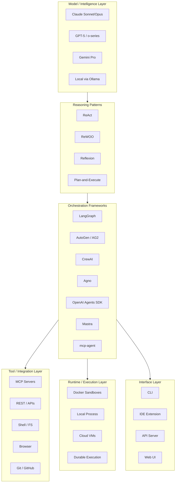
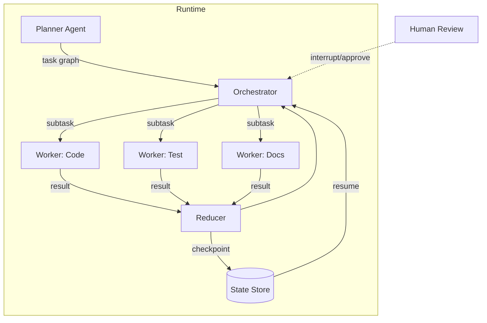
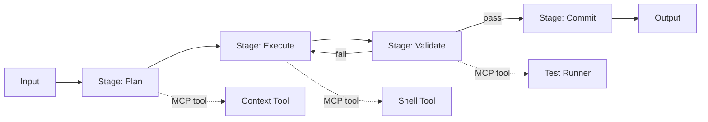
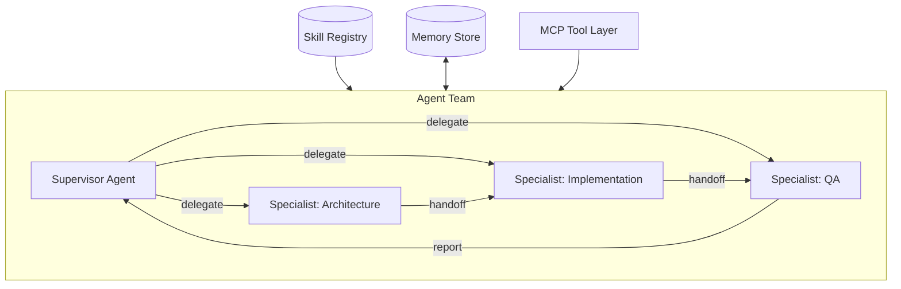
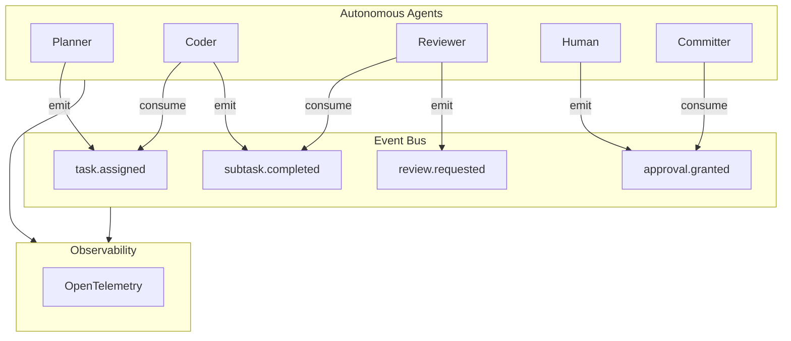
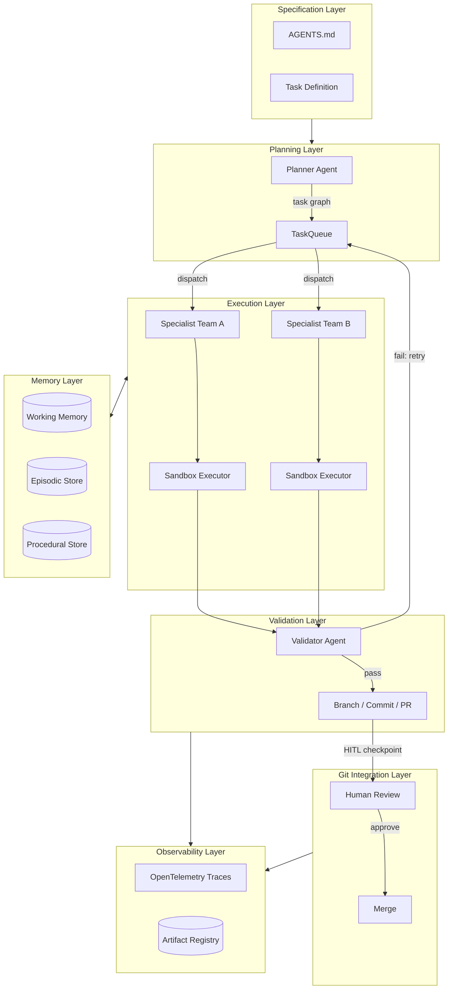

# AI Agent/Sub-Agent Workflow Design Space — Whiteboard Exploration

> **Purpose:** A greenfield conceptual exploration of AI agent/sub-agent development workflows — synthesizing benchmarks, real-world architectures, patterns, and principles to map the design landscape and define a recommended direction for a future framework system.
>
> **Scope:** Covers agent architectures, task decomposition, context/memory management, tooling, artifact management, governance, git integration, extensibility, observability, and architectural trade-offs.
>
> **Sources:** SWE-bench leaderboards; Arize AI orchestrator-worker comparison (Sep 2025); Anthropic Claude Code best practices; mini-swe-agent GitHub; Devin 2025 performance review (Cognition AI); ACON arxiv:2510.00615; MemAct arxiv:2510.12635; AWM openreview; PlanGEN arxiv:2502.16111; ALAS arxiv:2511.03094; MI9 arxiv:2508.03858; HB-Eval preprints202512.2186; MAIF arxiv:2511.15097; Docker Sandboxes docs; OpenTelemetry GenAI blog; mcp-agent docs; Agno docs; LangGraph concepts; DevOps-Gym arxiv:2411.04468; ML-Dev-Bench arxiv:2502.00964.

---

## Related Documents in This Project

| Document | Location | Relationship to This Document |
|---|---|---|
| `agents-framework-research.md` | `projects/mynd/docs/` | Prior Portuguese-language research covering the ASDLC paradigm, autonomy level taxonomy (SAE J3016-inspired), ADLC phase model, and comparative framework analysis (LangGraph, AutoGen, CrewAI, OpenAI Agents, and others). This document's benchmark comparisons and framework verdicts complement and extend that prior analysis with 2025–2026 empirical data. |
| `asdlc-framework-proposal.md` | `projects/mynd/docs/` | Proposed Claude Code ASDLC directory structure and workflow framework. Operationalizes the principles described in Section E of this document — specifically Canonical Organization (Principle 1), CLAUDE.md as repository contract (Pattern P8), and the Specialist Team model (Direction 3). The directory tree defined there is a direct implementation candidate for the hybrid architecture recommended in Section G. |
| `project-definition.md` | `projects/mynd/docs/` | Master prompt and system definition for the mynd-framework — the project within which this exploration is being conducted. Defines the overarching goals: canonical organization, agent/sub-agent orchestration, GitHub workflow integration, and Agile product management discipline. |
| `benchmarks/solatis-claude-workflow/` | `projects/mynd/benchmarks/` | A validated multi-agent benchmark workflow using Claude Code with specialist agents (architect, implementer, reviewer, tester, documenter, deployer) and skills (planner, doc-sync, decision-critic). Represents a working reference implementation of the Declarative Team-Based Orchestration pattern (Direction 3) and the CLAUDE.md context contract (Pattern P8). |

---

## Table of Contents

- [Related Documents in This Project](#related-documents-in-this-project)
- [A) Landscape Overview](#a-landscape-overview)
- [B) Benchmark Analysis](#b-benchmark-analysis)
- [C) Pattern Library](#c-pattern-library)
- [D) Candidate Architecture Directions](#d-candidate-architecture-directions)
- [E) Design Principles for a Future Framework](#e-design-principles-for-a-future-framework)
- [F) Open Questions and Research Gaps](#f-open-questions-and-research-gaps)
- [G) Final Recommendation](#g-final-recommendation)

---

## A) Landscape Overview

### The 2025–2026 Ecosystem Map

The AI agent workflow ecosystem has converged around a set of recognizable layers, with intense fragmentation at each layer. The model layer is commoditizing; the orchestration and tool layers are where differentiation — and complexity — lives.

### Major Trends — Observed Evidence

**1. MCP as the plugin layer.**
The Model Context Protocol has become the de-facto standard for tool/service exposure to agents — replacing bespoke plugin systems. 1,200+ MCP servers exist as of early 2026. Claude, Gemini, Copilot, and Cursor have all adopted it. The ecosystem is young but directionally settled.

**2. Orchestrator-worker as the dominant architectural primitive.**
Nearly every production framework has converged on this pattern regardless of implementation style (graph, chat, declarative, procedural). The specific mechanics differ; the conceptual model does not.

**3. Sandbox-first execution.**
Docker Sandboxes using microVM isolation are becoming the production standard for agent code execution. They address prompt injection, credential leakage, and host-system safety. Docker Desktop 4.58+ ships this as an experimental feature. OpenHands and Devin use comparable isolation.

**4. AGENTS.md / CLAUDE.md as repository contracts.**
Project-level specification files are emerging as a critical interface between agents and codebases — an interoperability standard in the making. AGENTS.md is supported by 20,000+ open-source projects and adopted by Codex, Amp, and Cursor. CLAUDE.md is Claude Code's variant with identical intent.

**5. Observability via OpenTelemetry.**
The GenAI semantic conventions on OTel are maturing rapidly. New spans — `execute_task`, `agent_to_agent_interaction`, `agent_planning`, `agent.state.management` — are becoming standard vocabulary. Vendors (Datadog, New Relic, Braintrust, SigNoz) now support OTLP exports for agent traces.

**6. Multi-agent systems outperform single agents significantly.**
Anthropic measured a 90.2% performance improvement for multi-agent vs single-agent on complex tasks. Benchmark leaders on SWE-bench Verified (79.2%, Claude Opus 4.5 + Live-SWE-agent) use scaffolded multi-step agent systems, not raw model invocation.

**7. Memory is a first-class engineering problem.**
ACON reduces memory usage 26–54% while preserving task quality. MemAct-RL achieves accuracy matching models 16× larger by treating context management as a learnable policy. The "lost in the middle" phenomenon and linear cost scaling make unbounded context accumulation an architectural anti-pattern.

**8. Benchmarks reveal unsolved operational gaps.**
DevOps-Gym (700+ tasks across build, monitoring, issue resolution, test generation) shows that current SOTA models still struggle with operational tasks beyond code generation. End-to-end DevOps automation remains an open problem.

---

## B) Benchmark Analysis

### Benchmark Reference Points

| Benchmark | Scope | SOTA Result | Key Agent/System |
|---|---|---|---|
| SWE-bench Verified | 500 human-filtered GitHub issues | 79.2% | Claude Opus 4.5 + Live-SWE-agent |
| SWE-bench Pro | 1,865 enterprise-level issues, 41 repos | 43.72% | SWE-Agent + Claude 4.5-Sonnet |
| SWE-bench Lite | 300 curated problems | 74%+ | mini-swe-agent (100-line Python) |
| ML-Dev-Bench | 30 ML dev tasks (dataset/train/debug/API) | Multi-agent comparison | ReAct vs OpenHands vs AIDE |
| DevOps-Gym | 700+ real DevOps tasks (Java/Go) | SOTA models still struggle | — |
| TravelPlanner | Multi-constraint planning | 42.68% | PMC (multi-agent decomposition) |
| HotpotQA | Multi-hop reasoning | ReWOO ≈ ReAct accuracy | GPT-3.5 ReWOO (2,000 tokens vs 9,795) |

### Key Observations from Benchmarks

**The simplicity signal.** mini-swe-agent (100 lines of Python, no complex tooling) achieves >74% on SWE-bench Verified. This is one of the most important data points in the landscape: complexity is not correlated with performance. The scaffolding choices that most frameworks make are often unnecessary overhead.

**Decomposition is the highest-leverage technique.** PMC achieves 42.68% on TravelPlanner vs GPT-4 direct at 2.92% — a 14× improvement from structured task decomposition alone, with no model change. This directly validates the planner/executor pattern.

**Operational automation is still hard.** DevOps-Gym reveals a category gap: current agents handle code generation well but fail at operational tasks (build debugging, monitoring interpretation, incident response). This is an unsolved problem with high commercial value.

**Dynamic tool generation is the current frontier.** Live-SWE-agent autonomously generates custom tools at runtime and currently leads SWE-bench. It suggests that static, pre-defined tool sets are a ceiling, not a floor.

**Token efficiency matters more than raw capability.** ReWOO achieves ~80% token reduction vs ReAct with equivalent accuracy on structured tasks. ACON achieves 26–54% memory reduction. At scale, token efficiency is the primary cost driver.

### Framework Comparison: Orchestrator-Worker Empirical Results

*Based on Arize AI's empirical comparison of minimal orchestrator-worker prototypes (Sep 2025):*

| Framework | Execution Model | Parallelism | Memory | Error Recovery | Best For |
|---|---|---|---|---|---|
| LangGraph | Graph traversal | Native fan-out/fan-in | Checkpointed per thread | Node retries + time travel | Precise control, complex state, durable workflows |
| AutoGen / AG2 | Conversation-driven | Sequential by default | Chat transcript + RAG | max_rounds + UserProxy | Research, chat-centric, flexible exploration |
| CrewAI | Manager-delegates | In-crew + multi-crew | Short/long/entity memory | Event bus + task retries | Production teams, structured delegation |
| OpenAI Agents | Runner + tool calls | Sequential (explicit async) | Session-based | Guardrails + tripwires | OpenAI stack, native handoffs, fast start |
| Agno | Team coordination | Concurrent agents | Persistent global + scoped | Decision metadata | Low-friction declarative orchestration |
| Mastra | Supervisor + Workflow | Parallel steps, suspend/resume | Working + semantic + history | OTel spans, structured streaming | TypeScript, streaming, operational visibility |

**Framework verdict summary (from empirical prototype analysis):**
- **LangGraph**: Best when you need precise control, parallel fan-out, recursion, durable state, and time-travel debugging. The graph model requires upfront schema design.
- **AutoGen / AG2**: Conversation-centric emergent behavior. Highly flexible for research. Long chats risk context loss without buffering.
- **CrewAI**: Event-driven manager-worker with strong guardrails and observability. Well-suited for production teams valuing transparency and controlled coordination.
- **OpenAI Agents SDK**: Easiest path to native handoffs and guardrails if already on the OpenAI stack. Tight ecosystem coupling.
- **Agno**: Declarative coordination with low custom glue. Persistent memory with minimal setup. Abstractions can obscure race conditions in complex logic.
- **Mastra**: TypeScript-native. Built-in streaming, suspend-resume, OTel. Strong defaults with flexibility for custom state management.

### Real-World Production Data

**Devin (Cognition AI, 2025 Annual Review):**
- 67% PR merge rate (up from 34% the prior year) across thousands of companies.
- 14× faster at language version migrations vs human engineers.
- 20× efficiency on security vulnerability remediation (1.5 min vs 30 min).
- 2.1 introduced confidence ratings (green/yellow/red) that correlate directly with 2× PR merge rate for high-confidence tasks.
- Insight: Narrow task specialization + confidence signaling are critical production differentiators. Devin is "senior at codebase understanding, junior at execution" — human review remains necessary.

**GitHub Copilot Coding Agent:**
- Fully automated branch → commit → PR workflow.
- Human approval required before any CI/CD runs. This is a deliberate, hard-wired HITL safety boundary.
- Best results with issues that specify exact files, acceptance criteria, and unit test requirements.
- Insight: PR-mediated integration is the production-grade safety boundary for agent code changes.

**Claude Code (Anthropic):**
- CLAUDE.md as the persistent context contract per repository.
- Hooks for pre/post execution automation (run tests after changes, lint before commits).
- Subagents enable parallel specialist workflows.
- Checkpoint/rewind for safe exploration before committing to a direction.
- Insight: Repository-level context contracts + execution hooks + checkpointing are the three pillars of a production-grade agentic coding tool.

---

## C) Pattern Library

### Recommended Patterns

#### P1: Orchestrator-Worker Decomposition

- **What:** A central orchestrator decomposes a complex task into subtasks, routes each to a specialized worker, aggregates results, and loops until the goal is met.
- **When:** Any workflow where problem structure emerges at runtime; tasks vary in type, complexity, or required tooling.
- **Trade-offs:** Strong separation of concerns; harder to debug inter-agent state; requires robust context propagation discipline to avoid bloat.
- **Evidence:** Used by all 6 major frameworks surveyed. Anthropic measured 90.2% performance improvement over single-agent for complex tasks. The worker model is also the primitive behind all SWE-bench leaders.

#### P2: Plan-then-Execute (ReWOO)

- **What:** Separate a complete planning phase (full decomposition with dependency graph and placeholders) from parallel execution (all tool calls run) and solution synthesis (final answer from results).
- **When:** Structured tasks with predictable tool dependencies; batch operations; cost-sensitive workflows; any task where the full plan can be determined before any tool is called.
- **Trade-offs:** ~80% token reduction vs ReAct on structured tasks; poor fit for dynamic workflows requiring real-time adaptation or mid-task replanning.
- **Evidence:** GPT-3.5 ReWOO: 2,000 tokens vs 9,795 for ReAct on HotpotQA with equal accuracy. Token savings compound at scale.

#### P3: Iterative ReAct with Reflexion

- **What:** Interleaved reasoning-action-observation loop (ReAct), augmented with a self-evaluation step and memory-based refinement (Reflexion) that stores insights across iterations.
- **When:** Complex, dynamic tasks; debugging; any workflow where intermediate results meaningfully change the approach; tasks requiring self-correction and metacognition.
- **Trade-offs:** Higher token cost than ReWOO; superior at real-time adaptation; Reflexion creates genuine cross-iteration learning, which is the foundation of improving agent performance over time on repeated tasks.
- **Evidence:** Standard approach for SWE-bench leaders. Reflexion-style loops are used by Devin and Claude Code's rewind/explore workflows.

#### P4: Hierarchical Supervision

- **What:** Multiple tiers of supervisors: a top-level supervisor delegates to mid-level coordinators who manage specialist workers. Control and context flow down; results flow up.
- **When:** Very large or complex workflows; monorepos with multiple domains; tasks spanning security, infrastructure, frontend, and backend simultaneously.
- **Trade-offs:** Maximum modularity and composability; higher latency from multi-hop coordination; communication overhead grows non-linearly with team depth; requires careful scope definition at each tier to avoid ambiguity.
- **Evidence:** LangGraph native hierarchical support; LangGraph Supervisor library released February 2025. Anthropic recommends hierarchical supervision for tasks exceeding single-agent context capacity.

#### P5: Tiered Memory Architecture

- **What:** Three memory tiers operating simultaneously: Working memory (active task context, in-prompt), Episodic memory (past interactions and outcomes, vector store), Procedural memory (reusable task routines and workflows, learned from trajectories).
- **When:** Long-horizon workflows; repeated task patterns where learning should accumulate; personalization requirements; any workflow running across multiple sessions.
- **Trade-offs:** Significant architectural complexity; the gains are substantial — AWM improves baseline task success 24.6–51.1%; Mem^p shows continuous improvement as procedural memory refines; LEGOMem shows orchestrator memory improves decomposition while fine-grained agent memory improves execution.
- **Evidence:** Confirmed by MIRIX, MemoryOS, LEGOMem, AWM, Mem^p across multiple benchmark domains.

#### P6: Human-in-the-Loop Checkpoints

- **What:** Declaratively defined checkpoint conditions that trigger agent pause, present context to a human reviewer, and resume with preserved state on approval or with corrective input.
- **When:** High-risk operations (destructive file/database operations, production deployments, credential access); low-confidence outputs; compliance requirements; any action that is irreversible.
- **Trade-offs:** Adds latency and manual overhead; essential for auditability, safety, and regulated environments; LangGraph's `interrupt()`/resume mechanism and Claude Code's checkpoint/rewind make the implementation cost low.
- **Evidence:** All production systems implement HITL: GitHub Copilot requires human approval before CI/CD; Claude Code provides checkpoint/rewind; Azure Agent Framework has explicit approval gates; Devin's confidence ratings are a lightweight HITL signal.

#### P7: Sandbox Isolation per Agent Execution

- **What:** Every agent execution that involves code execution, shell commands, or credential access runs inside an isolated microVM environment with a private Docker daemon, network allow/deny lists, and project-scoped filesystem access only.
- **When:** Any execution involving untrusted code (which is all agent-generated code), external API calls, or credential handling.
- **Trade-offs:** Acceptable overhead (~100ms per sandbox creation); eliminates the most dangerous failure modes: prompt injection via code execution, credential leakage, host-system modification, and lateral movement between sessions.
- **Evidence:** Docker Sandboxes (experimental, Docker Desktop 4.58+, supports Claude Code and Gemini CLI natively); OpenHands' Docker-based sandbox; Devin's sandboxed compute environment; security research confirming nearly all frontier agents exhibit policy violations within 10–100 queries without isolation.

#### P8: Repository Context Contract (AGENTS.md / CLAUDE.md)

- **What:** A project-level specification file placed at the repository root that agents automatically load at session start, providing: tech stack, common commands, directory structure, code conventions, testing patterns, and CI/CD notes.
- **When:** Any multi-session or multi-agent workflow operating on an existing codebase. Should be created before any agent is assigned to a repository.
- **Trade-offs:** Very low cost to create and maintain; very high leverage — agents with project context make dramatically fewer orientation mistakes; primary risk is stale context as the codebase evolves.
- **Evidence:** AGENTS.md supported by 20,000+ open-source projects; Claude Code, Codex, Amp, Cursor all support it. Feature request with significant community traction for cross-tool standardization.

#### P9: Artifact-Centric Provenance

- **What:** Every output artifact (code file, test suite, document, configuration) carries embedded metadata: the agent that produced it, the task ID it belongs to, the version, a cryptographic hash, and the decision rationale.
- **When:** Compliance-driven environments; auditability requirements; multi-agent pipelines where outputs flow between agents and provenance chains must be traceable end-to-end.
- **Trade-offs:** Overhead for metadata schema design and management; enables full traceability, reproducibility, and regulatory compliance (EU AI Act); transforms data from passive storage into active trust enforcement.
- **Evidence:** MAIF (Multimodal Artifact File Format, arxiv:2511.15097); Docker cagent OCI registry pattern; enterprise registry controls (Google Cloud, Harness Artifact Registry).

#### P10: MCP-First Tool Integration

- **What:** All tool and service integrations are exposed to agents through MCP servers. Agents consume tools via a uniform protocol regardless of the underlying service. No direct API coupling inside agent code.
- **When:** Any system requiring extensible tool integration where the tool set may grow over time or where portability across agent runtimes is required.
- **Trade-offs:** Long-term standardization wins; MCP ecosystem still maturing (some specialized tools lack MCP servers); adds an indirection layer that simplifies agent code significantly.
- **Evidence:** 1,200+ MCP servers as of early 2026; adopted natively by Claude, Gemini, Copilot, Cursor, mcp-agent framework; transports include stdio, HTTP, WebSocket, and SSE.

---

### Anti-Patterns

| Anti-Pattern | Problem | Supporting Evidence |
|---|---|---|
| **Single-agent monolith** | Context bloat, tool overload, degraded reasoning at scale, no specialization | Anthropic: 90.2% multi-agent improvement; all benchmark leaders use multi-agent scaffolding |
| **Unbounded context accumulation** | "Lost in the middle" phenomenon; 20–30% reasoning drift on repeated runs; 2× cost above 200K tokens | ACON, MemAct, Anthropic pricing; attention mechanism research on mid-context degradation |
| **Conversation-only memory** | No cross-session continuity; context window ceiling; no episodic or procedural recall | All production frameworks now require external vector store integration for long-horizon tasks |
| **Ignoring agent failure modes** | Silent failures, task-sequencing errors, version drift, cost-driven performance collapse go undetected in production | Microsoft failure taxonomy whitepaper; HB-Eval: 42.9 pp gap between nominal and stressed performance |
| **Framework coupling** | Agents written around specific framework primitives; locked into a single orchestrator's execution model | Open Agent Specification; AGENTS.md interoperability movement; LiteLLM-style provider abstraction |
| **Uncontrolled parallelism** | Race conditions, task collisions, state conflicts between concurrent agents | AutoGen caveat documented in Arize comparison; LangGraph requires explicit reducers to prevent conflicts |
| **Over-engineering orchestration** | Complexity without performance gains; maintenance burden without measurable accuracy improvement | mini-swe-agent: 100 lines, >74% SWE-bench Verified SOTA — the most important single data point |
| **No observability** | Inability to debug non-deterministic failures; cost blindness; no audit trail; impossible to improve what you can't measure | OTel GenAI conventions maturing; MI9 governance framework; HB-Eval reliability gap |
| **Static, pre-defined tool sets** | Agent capability is capped at design time; novel tasks requiring new tools fail silently | Live-SWE-agent (dynamic tool generation at runtime) achieves current SOTA on SWE-bench |
| **HITL as an afterthought** | Critical actions proceed without review; no state preservation when intervention is needed; compounding errors go uncorrected | GitHub Copilot, Claude Code, Azure Agent Framework all hardwire HITL as a first-class design element |

---

## D) Candidate Architecture Directions

Four candidate directions are evaluated below. They are not mutually exclusive — the final recommendation in section G synthesizes the best properties of each.

---

### Direction 1: Graph-Based Durable Workflow Engine

**Concept:** Represent every workflow as a directed graph (LangGraph-style). Each node is an agent or tool call. Edges encode dependencies and routing logic. State is checkpointed at every node, enabling time-travel, partial re-runs, and HITL interrupts at any point in the graph.

**Pros:**
- Maximum control over execution order and branching.
- Native parallel fan-out and structured fan-in via reducers.
- Checkpointing enables resumability, time-travel debugging, and granular HITL.
- Graph visualization makes complex workflows inspectable.

**Cons:**
- Steep initial design burden: graph state schema must be defined upfront.
- Requires explicit reducer logic to prevent state conflicts in concurrent branches.
- Currently Python/TypeScript-specific (LangGraph).
- Overkill for simple linear workflows.

**Operational complexity:** High. Requires graph schema design, reducer definitions, and external state store setup.

**Scalability:** Excellent. Stateless execution nodes; all state lives in external checkpointed store; horizontally scalable.

**Reference implementations:** LangGraph, LangGraph Supervisor (Feb 2025).

---

### Direction 2: Lightweight Composable Pipeline

**Concept:** Define workflows as ordered pipeline stages. Each stage is a single-responsibility function with a defined input/output contract. Agents are pure functions; orchestration is function composition. MCP provides all tool integration. Retry loops are expressed as stage re-entry.

**Pros:**
- Extremely simple to reason about, test, and extend.
- Portable across any framework or language.
- Matches the mini-swe-agent "less is more" empirical lesson.
- Easy to add new stages without touching existing ones.
- Pure-function stages are unit-testable in isolation.

**Cons:**
- Less dynamic: poor fit for workflows where task structure genuinely emerges at runtime.
- Retry and conditional branching logic becomes verbose compared to graph approaches.
- No native parallel fan-out without explicit async coordination.

**Operational complexity:** Low. No framework lock-in. No external state store required for simple cases.

**Scalability:** Moderate. Stages can be parallelized but requires explicit async coordination; graph-based approaches handle this more naturally.

**Reference implementations:** mini-swe-agent, many bespoke production pipelines.

---

### Direction 3: Declarative Team-Based Orchestration

**Concept:** Declare a team of role-specialized agents in YAML or Python. A supervisor coordinates via natural language delegation. Each agent has bounded responsibilities, scoped tool access, and per-agent memory. Team composition is data-driven — specialists can be added, removed, or swapped without touching orchestration code.

**Pros:**
- Human-readable team definitions that mirror how engineering teams are actually structured.
- Agno/CrewAI-style: well-validated in production.
- Easy to understand, onboard new contributors to, and extend with new specialist roles.
- Works naturally with AGENTS.md/CLAUDE.md context files.
- Skill Registry enables reuse of proven agent configurations.

**Cons:**
- Less precise execution control than graph-based approaches.
- "Conversation drift" risk in long handoff chains.
- Supervisor can become a bottleneck for high-parallelism workloads.
- Natural language delegation introduces non-determinism at coordination boundaries.

**Operational complexity:** Medium. Team configuration is the primary artifact. No graph schema required.

**Scalability:** Good. Teams can be composed hierarchically. Supervisor bottleneck can be addressed by hierarchical team structure.

**Reference implementations:** Agno, CrewAI, LangGraph Supervisor.

---

### Direction 4: Event-Driven Autonomous Agent Network

**Concept:** Agents subscribe to and emit typed events on a central bus. No agent calls another agent directly — coupling is only through event schemas. HITL is just a subscriber with a human approval step. The system is fully async. Every event is inherently a telemetry point, making observability nearly free.

**Pros:**
- Maximum decoupling: new agents are added by subscribing to existing events with zero changes to other agents.
- Naturally auditable: the event log is a complete, ordered, replayable record of workflow execution.
- Fully async: agents operate independently at their own pace.
- Matches real engineering team communication patterns (notifications, reviews, approvals).

**Cons:**
- Most complex to reason about holistically; debugging requires good tooling.
- Event schema management is a secondary complexity: schemas must be versioned and backward-compatible.
- Risk of event storms in recursive workflows without explicit termination conditions.
- Requires event bus infrastructure (Kafka, NATS, Redis Streams, or similar).

**Operational complexity:** Very high. Requires event bus infrastructure, schema registry, consumer group management, and dead-letter queue handling.

**Scalability:** Excellent. Agents are stateless event consumers; horizontally scalable with standard message queue patterns.

**Reference implementations:** No production-grade reference implementation for software development workflows yet identified. This direction needs prototyping.

---

### Direction Comparison Summary

| Criterion | Direction 1: Graph Engine | Direction 2: Composable Pipeline | Direction 3: Declarative Teams | Direction 4: Event-Driven |
|---|---|---|---|---|
| Simplicity | Low | High | Medium | Low |
| Dynamism | High | Low | Medium | High |
| Parallelism | Native | Manual | Good | Native |
| HITL support | Native | Manual | Possible | Native |
| Observability | Good | Manual | Good | Native |
| Framework portability | Low | High | Medium | High |
| Operational overhead | High | Low | Medium | Very High |
| Time to first prototype | Slow | Fast | Medium | Very Slow |
| Production maturity | High | High | High | Low |

---

## E) Design Principles for a Future Framework

These principles are derived from the benchmark evidence, pattern analysis, and architectural comparison above. Each is grounded in observed data, not speculation.

### 1. Canonical Organization

Every artifact, workflow definition, agent configuration, and decision record must have a single, well-known location. No scattered configurations, no implicit state. Use AGENTS.md / CLAUDE.md as the contract between any codebase and any agent operating on it. Define a canonical directory structure before writing any agent code.

*Grounded in: AGENTS.md/CLAUDE.md adoption across 20,000+ projects; all production agent systems that maintain project context explicitly.*

### 2. Traceability as a First-Class Concern

Every action must be traceable along the full chain: requirement → task → subtask → agent → tool call → artifact → git commit. Use OpenTelemetry spans for runtime traces with the emerging GenAI semantic conventions. Use structured artifact metadata (MAIF-style) for output provenance. Traceability is not optional instrumentation — it is the foundation of debugging, auditing, and improving a non-deterministic system.

*Grounded in: OTel GenAI conventions (execute_task, agent_to_agent_interaction spans); MAIF (arxiv:2511.15097); MI9 governance framework; HB-Eval reliability analysis.*

### 3. Single Responsibility per Agent

Each agent should do one thing well. Generalist agents degrade performance, increase context requirements, and produce harder-to-debug failures. Compose specialists rather than expanding a single agent's scope. When a task requires multiple domains, that is a signal to add a specialist, not to extend an existing agent.

*Grounded in: Benchmark evidence showing 90%+ improvement from specialization; nine core best practices (arxiv:2512.08769); Arize AI's orchestrator-worker analysis.*

### 4. Context as Working Memory, Not Accumulator

Treat the context window as RAM, not a log. At every step, ask: what does this agent actually need to complete its immediate task? Implement tiered memory (working / episodic / procedural) with active curation. This is the single highest-leverage optimization available — 26–54% memory reduction with preserved accuracy.

*Grounded in: ACON (arxiv:2510.00615); MemAct (arxiv:2510.12635); "lost in the middle" research; Anthropic 2× token pricing above 200K tokens.*

### 5. MCP-First Tooling

All tool integrations are MCP servers. Agents consume tools via a uniform protocol. No direct API coupling inside agent code. This achieves framework portability, future-proofs the tool layer, and enables the ecosystem's 1,200+ available servers without per-integration engineering.

*Grounded in: MCP adoption across Claude, Gemini, Copilot, Cursor; mcp-agent framework; production deployment patterns on Azure, AWS.*

### 6. Sandbox-First Execution

Any agent that executes code, runs shell commands, or accesses credentials must do so inside an isolated execution environment — Docker microVM or equivalent — with project-scoped filesystem access and network controls. This is non-negotiable for production safety.

*Grounded in: Docker Sandboxes architecture; OpenHands sandbox design; security research showing near-universal policy violations in unsandboxed agents (10–100 queries); Devin's sandboxed compute environment.*

### 7. Human-in-the-Loop by Design

Design HITL checkpoints declaratively, not as afterthoughts. Define explicitly: which operation categories trigger a checkpoint, what context the human sees, how state is preserved for resume, and what happens on rejection. Apply to: destructive operations, production deployments, credential-touching actions, and any output with a confidence score below threshold.

*Grounded in: GitHub Copilot hardwired CI/CD approval gate; Claude Code checkpoint/rewind; Azure Agent Framework; Devin confidence ratings correlating with 2× PR merge rate.*

### 8. Agent-Agnostic Core

The workflow definition layer must not depend on any specific LLM provider or orchestration framework. Use provider-agnostic interfaces (LiteLLM-style). Agent definitions must be portable across Claude, GPT, Gemini, and local models with zero code changes. This is the hedge against model and framework churn, which is currently significant.

*Grounded in: Open Agent Specification (arxiv:2510.04173); LiteLLM adoption; AGENTS.md portability across Claude Code, Codex, Amp, Cursor; framework comparison showing each framework has fundamental execution model differences.*

### 9. Minimal, Composable Primitives

Start with the simplest architecture that achieves the goal. Add complexity only when benchmarks or evidence justify it. The mini-swe-agent lesson — 100 lines of Python achieving 74% SOTA — is the most important single data point in this landscape. Resist the impulse to adopt full framework complexity before validating that simpler alternatives are insufficient.

*Grounded in: mini-swe-agent (github.com/SWE-agent/mini-swe-agent); KISS principle as one of nine production best practices (arxiv:2512.08769); every major framework offering a "simple start" path.*

### 10. Observability Before Optimization

Instrument first. Deploy with full OpenTelemetry tracing from day one. Measure token costs, latency, failure rates, retry rates, and task success before optimizing anything. "You can't optimize what you can't measure" is doubly true for non-deterministic systems where the same input can produce different outputs on consecutive runs.

*Grounded in: OTel GenAI semantic conventions (execute_task, agent_planning spans); AG2 OTel tracing; Azure AI Foundry multi-agent observability; production debugging requirements for non-deterministic workflows.*

### 11. Git Discipline as Workflow Primitive

Every agent action that modifies code must be expressed as a git operation: branch, commit, PR. Agent commits must carry task ID references for traceability. Agents must never push directly to the main branch. PR-mediated integration is the safety boundary for all code changes, not an optional best practice.

*Grounded in: GitHub Copilot agent workflow (branch→commit→PR, HITL before CI/CD); Claude Code commit/PR patterns; Devin's PR merge rate as primary KPI; GitHub Agentic Workflows spec.*

### 12. Reliability Through Correction Loops, Not Perfect Agents

Build correction loops, not perfect agents. Use retry/backoff, validation cycles, and fallback agents rather than attempting to build a single agent that never fails. HB-Eval documents a 42.9 percentage point gap between nominal success rates and stressed performance. Plan for failure at design time, not incident time.

*Grounded in: HB-Eval (preprints202512.2186); Microsoft failure taxonomy; ALAS's localized repair under explicit policies; E-valuator's sequential hypothesis testing for trajectory monitoring.*

---

## F) Open Questions and Research Gaps

### Unresolved Technical Questions

**Dynamic tool generation and governance.**
Live-SWE-agent's key innovation — generating custom tools at runtime — achieves current SOTA on SWE-bench. But the security implications of agents that modify their own capabilities at runtime are not yet well-understood. How do you govern a system that rewrites its own tool set? What are the sandboxing requirements for tool generation (as distinct from tool execution)? No published framework addresses this comprehensively.

**Optimal memory tier boundaries.**
When should information migrate from working → episodic → procedural memory? What triggers are correct? LEGOMem and AWM confirm that procedural memory dramatically improves performance, but the curation, induction, deprecation, and retrieval strategies for procedural memory at development-workflow scale are still being worked out in research. The benchmarks are primarily on web navigation and scheduling, not software development specifically.

**Multi-agent coordination overhead at scale.**
At what team size does inter-agent communication cost outweigh specialization benefits? Current public benchmarks cover small teams (2–6 agents). No published data exists on the coordination overhead crossover point for larger teams. This matters significantly for system design — it determines whether hierarchical supervision is genuinely beneficial or just overhead.

**Context compression quality-cost curves.**
ACON shows 26–54% token reduction — but which compressions are safe vs lossy is highly task-dependent. No automated quality-of-compression metric exists that is fast enough to run inline. The risk of lossy compression causing downstream task failure needs quantitative characterization.

**HITL friction vs autonomy sweet spot.**
There is no validated, empirical data on the optimal frequency of human checkpoints across different task types and risk categories. Too many checkpoints defeat the value of automation; too few allow compounding errors. Devin's confidence rating system is a step toward data-driven HITL calibration, but it is proprietary and task-specific.

### Needs Prototyping

**Event-driven autonomous agent network (Direction 4).**
Has compelling theoretical properties — maximum decoupling, natural observability, async execution — but no production-grade reference implementation exists for software development workflows. The event schema design, consumer group topology, and termination condition logic need empirical validation before this direction can be recommended for production use.

**Procedural memory induction in software development workflows.**
Mem^p and AWM have been validated on web navigation and scheduling. A prototype that induces reusable workflow scripts from successful coding task trajectories — and validates that those scripts improve future task performance — does not yet exist in the public literature. This is a high-value research gap.

**AGENTS.md as a cross-agent contract standard.**
Can an identical AGENTS.md file produce consistent behavior across Claude Code, Codex, Cursor, and OpenHands without per-tool tuning? This interoperability claim is widely assumed but not empirically validated. A structured evaluation across at least 3 runtimes on the same repository would either confirm a powerful portability story or reveal the limits of specification-file-based context.

### Requires Deeper Validation

**The 90.2% multi-agent performance improvement.**
Anthropic's measurement is compelling but the task distribution it was measured on is not fully specified. Whether this improvement holds across routine CRUD-level tasks, operational/DevOps tasks, or legacy codebase work (vs the complex research-style tasks it is likely drawn from) is unknown.

**Governance models for production multi-agent systems.**
MI9's FSM-based conformance engines and goal-conditioned drift detection are theoretically rigorous, but real-world multi-agent system deployment cases at scale remain sparse in the public literature. The failure modes that emerge in systems running thousands of concurrent agent sessions need more empirical characterization.

**Cost-per-task economics for hybrid local-cloud architectures.**
Local-first becomes economical above approximately 2,000 daily prompts (~4M tokens). But the crossover points for more complex, multi-agent workflows — where different agents might optimally run on different model tiers (local small model for context management, frontier model for planning) — are not yet well-characterized.

---

## G) Final Recommendation

### Recommended Conceptual Direction: Hybrid Composable Pipeline with Declarative Teams

This hybrid synthesizes the key strengths of all four candidate directions:

- **Direction 2** (Composable Pipeline): simplicity, testability, MCP-first tooling, portability, minimal-primitive discipline.
- **Direction 3** (Declarative Teams): role specialization, human-readable team definitions, AGENTS.md compatibility, skill registry.
- Specific mechanisms from **Direction 1** (Graph Engine): checkpointing, HITL interrupt/resume, time-travel debugging for long-running workflows.
- Specific mechanisms from **Direction 4** (Event-Driven): typed event-based observability, audit log as event stream, async HITL via event subscription.

### Why This Direction

**1. It matches the evidence.**
The most performant real-world systems — Claude Code, mini-swe-agent, Devin — are not maximally complex. They are simple, disciplined, and well-instrumented. The composable pipeline + specialist teams pattern matches this empirical signal directly. The hybrid avoids the over-engineering anti-pattern while preserving the structural discipline that distinguishes production systems from prototypes.

**2. It is framework-portable.**
By using MCP for all tooling and AGENTS.md for repository context, the core workflow definition is portable across any orchestration framework and any LLM provider. This is the most important property for a system being designed now, when both the model and framework landscape will continue to shift significantly.

**3. It addresses the two hardest unsolved problems as first-class design elements.**
Context management (tiered memory + active curation) and reliability (validation loops + HITL checkpoints + sandbox isolation) are both first-class concerns in the architecture, not extensions to be added later. These are precisely the two areas where production deployments most commonly fail.

**4. It scales incrementally without re-architecture.**
Start with a single planner + 2–3 specialists + validator. The pipeline works at this minimal scale. Add specialist teams as task complexity grows. Introduce durable checkpointing (Direction 1 mechanisms) only when long-running workflows require resumability across failures. Add procedural memory induction when repeated task patterns justify the engineering investment.

**5. It is operationally transparent.**
Every task is traced from AGENTS.md specification through planning, execution, validation, and git commit via OpenTelemetry. Every code change is a PR with task ID traceability. Every high-risk action is a HITL checkpoint. Every artifact carries provenance metadata. Nothing significant happens without a trace.

### What to Validate Next — Ordered by Priority

**Priority 1: Minimal end-to-end prototype.**
Build the Planner → Specialist Teams → Validator → Git pipeline for a real codebase task (e.g., a multi-file refactor with test suite). Validate that the pipeline structure works before adding any memory, observability, or advanced tooling layers. This is the mini-swe-agent discipline applied to the full pipeline.

**Priority 2: Context management benchmarking.**
On real development tasks: compare full-context (baseline), naive summarization, and tiered-memory approaches for token cost vs task success rate. Generate concrete data on the cost-quality tradeoff for this specific workflow domain before committing to a memory architecture.

**Priority 3: AGENTS.md cross-runtime validation.**
Test an identical AGENTS.md file on the same repository across Claude Code + OpenHands (or Codex). Document where behavior diverges and what specification additions are needed to achieve consistent behavior. Either confirm portability or quantify the specification debt.

**Priority 4: OTel instrumentation from day one.**
Instrument the prototype immediately. Measure baseline: tokens per task, task success rate, retry rate, HITL intervention frequency, and cost per task type. This data drives every subsequent optimization decision. Do not optimize before measuring.

**Priority 5: Sandbox overhead characterization.**
Test Docker microVM sandbox creation overhead in the target execution environment. If overhead is acceptable (<200ms per sandbox), adopt sandbox-first as the default. If not, evaluate whether process-level isolation with strict filesystem controls is a sufficient interim measure.

---

*This document represents a synthesis of external research, benchmark analysis, and architectural reasoning as of February 2026. It is intended as a living reference to be updated as the prototype validation in section G produces empirical data to confirm, refute, or refine the findings presented here.*
