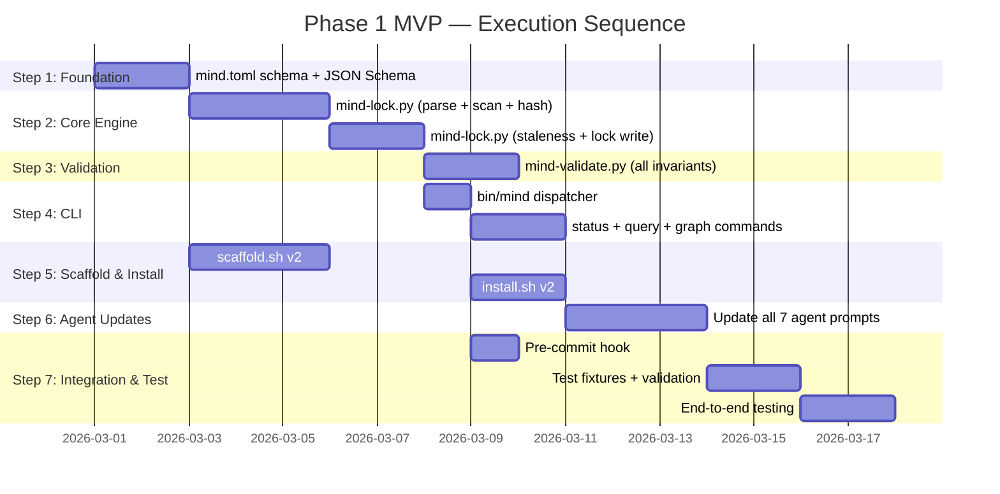

# Phase 1 MVP — Delivery Plan

> **Document**: 3 of 3 in the Phase 1 Blueprint  
> **Covers**: Delivery plan and execution sequence, risks and trade-offs, Phase 1 exit criteria  
> **Audience**: Implementing engineer or coding agent  
> **Status**: Implementation-ready  
> **Date**: 2026-02-24

---

## Table of Contents

10. [Delivery Plan and Execution Sequence](#10-delivery-plan-and-execution-sequence)
11. [Risks, Gaps, and MVP Trade-offs](#11-risks-gaps-and-mvp-trade-offs)
12. [Phase 1 Exit Criteria](#12-phase-1-exit-criteria)

---

## 10. Delivery Plan and Execution Sequence

### 10.1 Phase Overview

Phase 1 is organized into **7 implementation steps**, executed sequentially. Each step has clear prerequisites, deliverables, and a validation checklist.



**Estimated total duration**: 2-3 weeks with 1 developer. Steps 1 and 5a can run in parallel. Steps 2-4 are sequential (each builds on the previous).

---

### 10.2 Step 1: Foundation — Schema & Contracts

**Objective**: Lock down the `mind.toml` schema and JSON Schema validation before any implementation begins.

**Prerequisites**: None (first step).

**Deliverables**:

| Deliverable | Location | Description |
|------------|----------|-------------|
| `mind.toml` reference file | `tests/fixtures/valid-project/mind.toml` | Complete example with all sections populated |
| JSON Schema for mind.toml | `schemas/mind-toml.schema.json` | Validates manifest structure |
| JSON Schema for mind.lock | `schemas/mind-lock.schema.json` | Validates lock file structure |
| CLI output schemas | Documented in `phase1-mvp-specification.md` §5.4 | Already defined |

**Risks**:
- Schema design error discovered in Step 2 forces revision → mitigate by testing with 3+ diverse project shapes (backend, frontend, library).

**Validation checklist**:
- [ ] Reference mind.toml is valid TOML (parseable by Python `tomllib`)
- [ ] Reference mind.toml passes JSON Schema validation
- [ ] JSON Schema covers all required and optional fields
- [ ] Schema handles minimal manifest (just `[manifest]` + `[project]`)
- [ ] Schema handles maximal manifest (all sections populated)
- [ ] 3 test fixture projects created (valid, minimal, backend)

---

### 10.3 Step 2: Core Engine — Lock File Generation

**Objective**: Implement the complete `mind lock` command: TOML parsing, filesystem scanning, hash computation, staleness detection, and lock file generation.

**Prerequisites**: Step 1 complete (schema finalized, test fixtures available).

**Deliverables**:

| Deliverable | Location | Description |
|------------|----------|-------------|
| `mind-lock.py` | `lib/mind-lock.py` | Complete lock generation script |
| Lock verify mode | `mind lock --verify` | Check-only mode for hooks |
| JSON output mode | `mind lock --json` | Machine-readable output |
| Test fixtures | `tests/fixtures/*/expected-lock.json` | Expected lock files for each fixture |

**Implementation order** (within this step):

1. **TOML parsing + document extraction** (FR-01, FR-02) — parse manifest, extract flat document list.
2. **Filesystem scanning** (FR-03) — stat, hash, mtime for each declared artifact.
3. **Lock file assembly** (FR-06) — assemble the JSON structure, atomic write.
4. **Staleness computation** (FR-04) — upstream hash comparison, transitive propagation.
5. **Completeness metrics** (FR-05) — requirement and iteration counts.
6. **Verify mode** (FR-07) — compare in-memory lock with existing lock.
7. **Audit logging** (FR-17) — append entry on completion.

**Risks**:
- Hash computation for directory artifacts (iterations) may be inconsistent across platforms → mitigate by sorting files before concatenation, using consistent encoding.
- Large files cause slow hashing → acceptable in Phase 1 (Python SHA-256 handles ~500MB/s; projects rarely have multi-MB docs).

**Validation checklist**:
- [ ] `mind lock` generates valid JSON from valid-project fixture
- [ ] Generated lock file passes `mind-lock.schema.json` validation
- [ ] Running `mind lock` twice produces byte-identical output
- [ ] Modifying a tracked file → `mind lock --verify` exits 1
- [ ] No changes → `mind lock --verify` exits 0
- [ ] Missing manifest → exits 2 with clear message
- [ ] Invalid TOML → exits 1 with line/column error
- [ ] Staleness propagates transitively (change project-brief → requirements goes stale → domain-model goes stale)
- [ ] Missing declared artifacts appear with `exists: false`, `stale: true`
- [ ] Integrity hash is correct (SHA-256 of full JSON minus integrity field)
- [ ] `--json` output matches documented schema

---

### 10.4 Step 3: Validation — Manifest Invariant Checks

**Objective**: Implement `mind validate` to catch structural problems in the manifest.

**Prerequisites**: Step 2 complete (lock generation works, TOML parsing code can be reused/imported).

**Deliverables**:

| Deliverable | Location | Description |
|------------|----------|-------------|
| `mind-validate.py` | `lib/mind-validate.py` | Invariant checker |
| Test fixtures | `tests/fixtures/circular-deps/`, `tests/fixtures/orphan-deps/` | Deliberately broken manifests |

**Implementation order**:

1. **Schema check** — verify `manifest.schema` format and `manifest.generation`.
2. **Owner check** — every document has an owner matching an agent key.
3. **Orphan dependency check** — every `depends-on` target exists in the registry.
4. **Cycle detection** — Kahn's algorithm on `[[graph]]` edges.
5. **Iteration validation check** — completed iterations have validation.md.

**Risks**:
- Cycle detection algorithm implementation error → mitigate with explicit test cases (A→B→C→A cycle, self-reference, multi-node cycle).

**Validation checklist**:
- [ ] Valid project → exit 0, no violations
- [ ] Missing owner → caught, reported with artifact URI
- [ ] Orphan dependency → caught, reported with source and target URI
- [ ] Circular dependency → caught, reported with cycle path
- [ ] Missing validation in completed iteration → caught
- [ ] `--json` output matches documented schema
- [ ] Multiple violations in one manifest → all reported (not just first)

---

### 10.5 Step 4: CLI — Dispatcher and Display Commands

**Objective**: Implement the `bin/mind` dispatcher and all remaining subcommands (status, query, graph, init, clean).

**Prerequisites**: Step 2 complete (lock file exists to read), Step 3 complete (validate integrated).

**Deliverables**:

| Deliverable | Location | Description |
|------------|----------|-------------|
| `bin/mind` | `bin/mind` | Bash CLI dispatcher |
| Status display | Integrated in `bin/mind` | Human-readable + JSON status |
| Query function | Integrated in `bin/mind` | Artifact search with filters |
| Graph command | Delegates to `lib/mind-graph.py` | Dependency tree |
| Init command | Integrated in `bin/mind` | Create .mind/ directory |
| Clean command | Integrated in `bin/mind` | Prune logs, archive iterations |

**Implementation order**:

1. **Dispatcher skeleton** — subcommand routing, project root resolution, help.
2. **Init command** — create `.mind/` directory tree.
3. **Status command** — read `mind.lock`, format dashboard output.
4. **Query command** — search artifacts by term, URI, filters.
5. **Graph command** — delegate to `mind-graph.py`.
6. **Clean command** — basic log pruning and tmp cleanup.
7. **Audit logging wrapper** — append log entry at end of every command.

**Risks**:
- `jq` not available for JSON formatting → mitigate with Python fallback function.
- Bash portability issues on older macOS → mitigate by testing on macOS 13+ and using `/usr/bin/env bash`.

**Validation checklist**:
- [ ] `mind status` displays correct project state from lock file
- [ ] `mind status --json` produces valid JSON matching schema
- [ ] `mind query "FR-3"` finds relevant artifacts
- [ ] `mind query --stale` lists only stale artifacts
- [ ] `mind query --zone=spec` lists only spec documents
- [ ] `mind graph` displays correct dependency tree
- [ ] `mind graph --json` produces valid JSON with nodes and edges
- [ ] `mind init` creates `.mind/` directory tree
- [ ] `mind clean` removes `.mind/tmp/` contents
- [ ] `mind help` displays usage for all subcommands
- [ ] Unknown subcommand → exit 3 with usage
- [ ] All commands work from subdirectories (project root resolution)

---

### 10.6 Step 5: Scaffold & Install

**Objective**: Update `scaffold.sh` and `install.sh` for v2 (4-zone structure, mind.toml, .mind/ directory, CLI installation).

**Prerequisites**: Step 1 complete (schema finalized). Can run in parallel with Steps 2-4.

**Deliverables**:

| Deliverable | Location | Description |
|------------|----------|-------------|
| `scaffold.sh` v2 | `scripts/scaffold.sh` | Full project bootstrapping |
| `install.sh` v2 | `scripts/install.sh` | Framework + CLI installation |

**Implementation order**:

1. **Scaffold v2** — 4-zone docs, mind.toml generation, .mind/ creation, .gitignore update.
2. **Install v2** — copy agents/conventions/skills/commands/specialists/templates, install bin/mind and lib/*.py, install pre-commit hook.

**Risks**:
- Existing v1 projects need migration → mitigate by documenting migration path (already in MIND-FRAMEWORK.md §15).

**Validation checklist**:
- [ ] Scaffolded project passes `mind validate` with zero violations
- [ ] Scaffolded project has correct directory structure
- [ ] `mind.toml` is valid TOML with correct sections
- [ ] `.mind/` directory tree created with all subdirectories
- [ ] `.gitignore` includes `.mind/` and scratch patterns
- [ ] `--with-framework` installs all framework files
- [ ] `--backend` adds backend profile and domain-model template
- [ ] `--name=custom-name` sets project name correctly
- [ ] Idempotent: running scaffold twice doesn't break anything
- [ ] Install correctly copies all file categories
- [ ] `bin/mind` is executable after install
- [ ] Pre-commit hook is installed and functional

---

### 10.7 Step 6: Agent Prompt Updates

**Objective**: Update all 7 agent prompts and 2 command files for v2 (4-zone paths, manifest awareness, `mind` CLI usage).

**Prerequisites**: Step 4 complete (CLI exists for agents to invoke).

**Deliverables**:

| Deliverable | Changes |
|------------|---------|
| `agents/orchestrator.md` | Add `mind status --json` at workflow start, iteration registration in mind.toml, generation bumping, `mind lock` after changes |
| `agents/analyst.md` | Update paths to `docs/spec/`, add domain model extraction, GIVEN/WHEN/THEN acceptance criteria |
| `agents/architect.md` | Update paths, add API contracts deliverable, domain model alignment |
| `agents/developer.md` | Update paths, add `mind lock` instruction after implementation |
| `agents/tester.md` | Update paths, add domain model test derivation |
| `agents/reviewer.md` | Update paths, add `mind status --json` for evidence, mention deterministic gates |
| `agents/discovery.md` | Update output path to `docs/spec/project-brief.md`, enhanced stakeholder mapping |
| `commands/workflow.md` | Reference updated orchestrator behavior |
| `commands/discover.md` | Reference updated discovery behavior |
| `conventions/documentation.md` | Add 4-zone model documentation |
| `conventions/git-discipline.md` | Add lock file commit rule, branch naming |

**Risks**:
- Prompt changes increase total framework token footprint → mitigate by measuring before/after, keeping additions lean.
- Agents ignore new instructions → mitigate by testing with real workflows after update.

**Validation checklist**:
- [ ] All path references updated from `docs/` to `docs/spec/`, `docs/state/`, etc.
- [ ] Orchestrator mentions `mind status --json` and `mind lock`
- [ ] Developer mentions `mind lock` after implementation
- [ ] Reviewer mentions `mind status --json` for evidence
- [ ] Total agent line count < 1,500 lines (currently ~1,076)
- [ ] All agent prompts are valid markdown
- [ ] No references to deprecated paths remain

---

### 10.8 Step 7: Integration Testing & Validation

**Objective**: Verify the complete system works end-to-end. Run all test fixtures. Validate with a real project workflow.

**Prerequisites**: All prior steps complete.

**Deliverables**:

| Deliverable | Description |
|------------|-------------|
| Test fixture validation | All fixtures produce expected outputs |
| Integration test script | Automated test runner for all fixtures |
| Real project validation | Run a scaffold → workflow → lock → status cycle on a real project |
| Documentation review | All documents reference correct paths, commands, and schemas |

**Implementation order**:

1. **Run all test fixtures** — verify lock, status, query, validate, graph outputs.
2. **Cross-reference check** — ensure all JSON schemas match actual outputs.
3. **Real project test** — scaffold a project, run a mock workflow, verify all commands work.
4. **Pre-commit hook test** — verify hook blocks stale commits, allows current commits.
5. **Documentation audit** — verify all Phase 1 docs reference the correct commands and paths.

**Validation checklist**:
- [ ] `valid-project` fixture: lock generation, status, query, validate, graph all produce correct output
- [ ] `missing-artifacts` fixture: staleness correctly detected, warnings generated
- [ ] `circular-deps` fixture: cycle detected by validate
- [ ] `orphan-deps` fixture: orphan dependency detected by validate
- [ ] `minimal` fixture: minimal manifest works correctly
- [ ] Pre-commit hook blocks stale commit
- [ ] Pre-commit hook allows current commit
- [ ] Scaffolded project passes full test cycle
- [ ] Agent prompts work with updated paths (manual or agent-assisted test)
- [ ] All `--json` outputs are valid JSON
- [ ] All exit codes are correct per convention

---

## 11. Risks, Gaps, and MVP Trade-offs

### 11.1 Implementation Risks

| # | Risk | Likelihood | Impact | Mitigation |
|---|------|:---:|:---:|-----------|
| R1 | Python 3.11+ not available on target machine | Low | High | Document requirement clearly. Provide a check in `bin/mind` that exits with a helpful message. Consider vendoring `tomli` (backport) as fallback. |
| R2 | TOML schema design requires revision after Step 2 | Medium | Medium | Use 3+ diverse test fixtures in Step 1. Design for extensibility (optional sections). |
| R3 | Hash computation inconsistency across platforms | Low | Medium | Use Python `hashlib` exclusively (not shell `sha256sum`). Sort directory contents before hashing. Normalize line endings. |
| R4 | Pre-commit hook too slow (Python startup) | Medium | Low | Accept ~200ms in Phase 1. Phase 2 Rust binary will be < 5ms. Document the known limitation. |
| R5 | Agent prompts become too long after updates | Medium | Low | Measure total lines before/after. Keep additions lean. Use "read this file for details" pattern instead of inline content. |
| R6 | `jq` not available for status/query formatting | Medium | Low | Python fallback function already planned. `jq` is optional. |
| R7 | Atomic file write fails on certain filesystems | Low | Medium | Use `os.replace()` (POSIX atomic) with fallback to write-then-rename. |

### 11.2 Intentional Simplifications

| Simplification | What's Missing | Why Acceptable | When Fixed |
|---------------|---------------|----------------|:---:|
| **No context budgeting** | Agents manually choose what to read | Context budgeting is an optimization, not a requirement for correctness | Phase 2 |
| **No summary cache** | Large documents read in full | Documents are typically < 500 lines in early projects | Phase 2 |
| **No output capture** | Gate results not saved to `.mind/outputs/` | Agents can capture output directly in validation.md | Phase 2 |
| **No run logs** | Workflow events not logged to `.mind/logs/runs/` | Audit log provides basic observability | Phase 2 |
| **No container health checks** | Infrastructure status not in lock file | Agents run container commands directly | Phase 2 |
| **No lifecycle hooks** | No pre/post-workflow hooks | Only pre-commit hook needed for MVP | Phase 2 |
| **No MCP server** | Agents use bash commands, not MCP tools | Bash commands work in all agent CLIs | Phase 2-3 |
| **Python performance** | ~10x slower than Rust target | Acceptable for validation; correctness matters more than speed | Phase 2 |
| **Single-platform prompts** | Only Claude Code agent format | Claude Code is the primary platform for development | Phase 3 |
| **No plugin system** | No extensibility beyond conventions | Conventions cover 90% of customization needs | Phase 3 |

### 11.3 Deferred Capabilities (Phase 2+)

| Capability | Phase | Dependency |
|-----------|:-----:|-----------|
| Rust CLI binary | 2 | Phase 1 contracts validated and stable |
| MCP server | 2-3 | Rust CLI exists as foundation |
| WASM plugins | 3 | Rust runtime with wasmtime |
| Context budgeting | 2 | Lock file provides file sizes for estimation |
| Summary cache | 2 | Requires content processing pipeline |
| Container integration | 2 | Docker API (bollard crate in Rust) |
| Platform shim generator | 3 | Template system for Codex/Gemini formats |
| Standalone orchestration | 4-5 | LLM API adapters, full workflow engine |
| Web dashboard | 4+ | Not essential for CLI-first tool |

### 11.4 Trade-off Analysis

| Trade-off | Choice | Alternative | Rationale |
|-----------|--------|-------------|-----------|
| **Speed vs. simplicity** | Python (slower) over Rust (faster) | Start with Rust | Validate contracts before investing in compiled code. Phase 1 scripts are disposable. |
| **Completeness vs. time** | Ship 7 commands, defer 5 capabilities | Build everything at once | Each deferred capability has a clear Phase 2 home. MVP proves the core value. |
| **Automation vs. manual** | Agents manually call CLI | Automated context loading | Manual invocation is explicit, debuggable, and works in all agent CLIs. |
| **Portability vs. features** | stdlib-only Python | Rich Python libraries | Zero `pip install` means zero friction. Features can wait for Rust. |
| **Strictness vs. flexibility** | Optional invariants (can be disabled) | Mandatory invariants | New projects shouldn't be blocked by invariants they haven't satisfied yet. |

---

## 12. Phase 1 Exit Criteria

### 12.1 Definition of "Phase 1 Complete"

Phase 1 is complete when all of the following are true:

1. **All 17 functional requirements** (FR-01 through FR-17) are implemented and pass their acceptance criteria.
2. **All 10 success criteria** (S1 through S10) are met.
3. **All 7 implementation steps** pass their validation checklists.
4. **The data contracts are validated** against 3+ diverse test fixtures.
5. **The migration contract is established**: Python and future Rust implementations produce identical JSON output for the same inputs.

### 12.2 Measurable Exit Criteria

| # | Criterion | How to Measure | Pass Threshold |
|---|----------|---------------|:---:|
| E1 | Lock file generation | `mind lock` on valid-project fixture → `diff expected-lock.json mind.lock` | Zero diff |
| E2 | Lock verification | Modify file → `mind lock --verify` → check exit code | Exit 1 |
| E3 | Status output | `mind status --json` → validate against schema | Valid JSON, correct data |
| E4 | Query results | `mind query "FR-3" --json` → check matches | All expected matches found |
| E5 | Invariant detection | `mind validate` on broken fixtures → check violations | All violations caught |
| E6 | Cycle detection | `mind validate` on circular-deps fixture | Cycle reported |
| E7 | Graph output | `mind graph --json` → validate structure | All edges present |
| E8 | Pre-commit hook | Commit with stale lock → check blocked | Commit blocked |
| E9 | Scaffold completeness | `scaffold.sh` → `mind validate` | Zero violations |
| E10 | Agent prompt validity | All agents reference correct v2 paths | No deprecated paths |
| E11 | Total footprint | `wc -l bin/mind lib/*.py scripts/*.sh hooks/*` | ≤ 2,000 lines |
| E12 | Performance | `time mind lock` on 20-artifact project | < 2 seconds |
| E13 | JSON determinism | `mind lock && mind lock && diff` | Byte-identical |

### 12.3 Phase 2 Readiness Checklist

Before starting Phase 2 (Rust implementation), verify:

- [ ] **Schema stability**: `mind.toml` schema has been used with 3+ real projects without needing changes.
- [ ] **Output contract**: All `--json` outputs are documented, stable, and tested.
- [ ] **Exit code contract**: All exit codes are documented and tested.
- [ ] **Test fixtures**: At least 5 test fixtures exist covering valid, minimal, broken, and edge-case manifests.
- [ ] **Migration test suite**: A script exists that runs both Python and future Rust implementations against the same fixtures and diffs the output.
- [ ] **Lock format stable**: `lockVersion: 1` has not needed revision.
- [ ] **Agent prompts working**: At least 2 real workflows have been executed with the updated agent prompts.
- [ ] **Pre-commit hook adopted**: The hook has been used in at least 1 real project without false positives or false negatives.
- [ ] **No blockers**: No open issues that would force a schema change in Phase 2.

### 12.4 Handoff Artifacts

When Phase 1 is complete, the following artifacts exist and are ready for the Phase 2 team:

| Artifact | Purpose |
|----------|---------|
| `schemas/mind-toml.schema.json` | Reference for Rust serde derive structs |
| `schemas/mind-lock.schema.json` | Reference for Rust lock file serialization |
| `tests/fixtures/` | Shared test suite for Python ↔ Rust compatibility |
| `phase1-mvp-specification.md` | Data contracts and functional requirements |
| `phase1-mvp-implementation-guide.md` | File structure and governance rules |
| `phase1-mvp-delivery-plan.md` | This document (risks and lessons learned) |
| Working Python implementation | Reference behavior for Rust reimplementation |
| Working agent prompts | Stable prompt files that Rust MCP server will complement |

---

## Appendix: Quick Reference Card

### Commands Available in Phase 1

```bash
mind init                    # Create .mind/ directory tree
mind lock                    # Generate mind.lock from mind.toml + filesystem
mind lock --verify           # Check if lock is current (exit 0/1)
mind lock --json             # Lock with JSON output
mind status                  # Display project state dashboard
mind status --json           # JSON status for agents
mind query <term>            # Search artifacts by term
mind query --stale           # List stale artifacts
mind query --zone=<zone>     # Filter by zone
mind query --json            # JSON query results
mind validate                # Check manifest invariants
mind validate --json         # JSON validation results
mind graph                   # Display dependency tree
mind graph --json            # JSON graph structure
mind clean                   # Prune logs, clean tmp
mind help                    # Show usage
```

### Exit Codes

```
0 — Success
1 — Failure (stale lock, validation error, command error)
2 — Missing prerequisite (no mind.toml, no mind.lock)
3 — Invalid input (bad arguments)
```

### Key File Locations

```
mind.toml                    ← Manifest (committed)
mind.lock                    ← Computed state (committed)
.mind/logs/audit.jsonl       ← CLI audit log (gitignored)
.mind/tmp/                   ← Agent scratch (gitignored)
docs/spec/                   ← Zone 1: Specifications
docs/state/                  ← Zone 2: Runtime state
docs/iterations/             ← Zone 3: History
docs/knowledge/              ← Zone 4: Reference
```

---

*This completes the Phase 1 MVP Blueprint (3 documents). Together, they provide everything needed to begin implementation with minimal ambiguity:*

*1. `phase1-mvp-specification.md` — What to build (scope, requirements, contracts)*  
*2. `phase1-mvp-implementation-guide.md` — How to build it (structure, scripts, integration)*  
*3. `phase1-mvp-delivery-plan.md` — When to build it (sequence, risks, exit criteria)*
