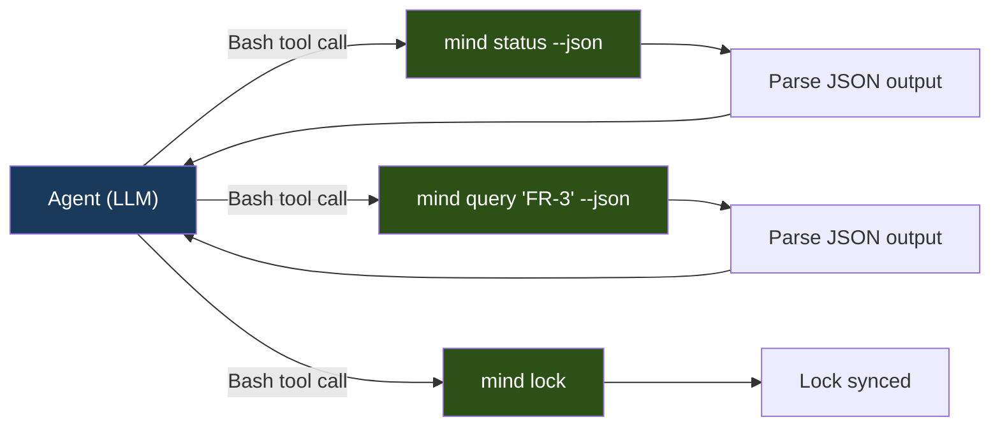

# Phase 1 MVP — Implementation Guide

> **Document**: 2 of 3 in the Phase 1 Blueprint  
> **Covers**: File/directory structure, scripts and automation blueprint, CLI and agent integration strategy, governance and workflow rules  
> **Audience**: Implementing engineer or coding agent  
> **Status**: Implementation-ready  
> **Date**: 2026-02-24

---

## Table of Contents

6. [File/Directory Structure for MVP](#6-filedirectory-structure-for-mvp)
7. [Scripts and Automation Blueprint](#7-scripts-and-automation-blueprint)
8. [CLI and Agent Integration Strategy](#8-cli-and-agent-integration-strategy)
9. [Governance and Workflow Rules](#9-governance-and-workflow-rules)

---

## 6. File/Directory Structure for MVP

### 6.1 Framework Repository Layout (what we build)

```
mind-framework/                        ← Framework source repository
│
├── bin/
│   └── mind                           ← Bash CLI dispatcher (~150 lines)
│
├── lib/
│   ├── mind-lock.py                   ← Lock generation + verify (~250 lines)
│   ├── mind-validate.py               ← Manifest invariant checks (~120 lines)
│   └── mind-graph.py                  ← Dependency graph operations (~100 lines)
│
├── hooks/
│   └── pre-commit.sh                  ← Git pre-commit hook (~15 lines)
│
├── scripts/
│   ├── scaffold.sh                    ← Project bootstrapping (~350 lines)
│   └── install.sh                     ← Framework installation (~150 lines)
│
├── agents/                            ← Agent prompt files (v2 updated)
│   ├── orchestrator.md
│   ├── analyst.md
│   ├── architect.md
│   ├── developer.md
│   ├── tester.md
│   ├── reviewer.md
│   └── discovery.md
│
├── conventions/                       ← Universal rules
│   ├── CLAUDE.md
│   ├── code-quality.md
│   ├── documentation.md               ← Updated for 4-zone model
│   ├── git-discipline.md              ← Updated for commit protocol
│   ├── severity.md
│   ├── temporal.md
│   └── backend-patterns.md            ← New (optional profile)
│
├── skills/                            ← On-demand deep dives
│   ├── CLAUDE.md
│   ├── planning/SKILL.md
│   ├── debugging/SKILL.md
│   ├── refactoring/SKILL.md
│   └── quality-review/SKILL.md
│
├── commands/
│   ├── discover.md
│   └── workflow.md
│
├── specialists/
│   ├── _contract.md                   ← New: specialist creation guide
│   └── examples/
│       └── database-specialist.md     ← New: reference example
│
├── templates/                         ← New directory
│   ├── domain-model.md
│   ├── api-contract.md
│   ├── iteration-overview.md
│   └── retrospective.md
│
├── schemas/                           ← New directory
│   ├── mind-toml.schema.json          ← JSON Schema for mind.toml validation
│   └── mind-lock.schema.json          ← JSON Schema for mind.lock validation
│
├── tests/                             ← Test fixtures
│   └── fixtures/
│       ├── valid-project/             ← Complete valid project for testing
│       │   ├── mind.toml
│       │   ├── expected-lock.json
│       │   └── docs/...
│       ├── missing-artifacts/         ← Project with missing declared files
│       ├── circular-deps/             ← Project with circular dependencies
│       ├── orphan-deps/               ← Project with orphan depends-on
│       └── minimal/                   ← Smallest valid project
│
├── CLAUDE.md                          ← Framework index (updated)
├── README.md                          ← Framework documentation (updated)
└── documents/                         ← Design documents (this file lives here)
```

### 6.2 Target Project Layout (what scaffold.sh creates)

```
my-project/                            ← User's project root
│
├── mind.toml                          ← Declarative manifest (created by scaffold)
├── mind.lock                          ← Computed state (created by mind lock)
├── CLAUDE.md                          ← Project-level routing table
├── README.md
├── .gitignore                         ← Updated with .mind/ entry
│
├── .claude/                           ← Agent framework (created by install.sh)
│   ├── CLAUDE.md
│   ├── agents/                        ← All 7 agent definitions
│   ├── conventions/                   ← All convention files
│   ├── skills/                        ← All skill directories
│   ├── commands/                      ← All command files
│   ├── specialists/                   ← Project-specific specialists
│   └── templates/                     ← Document templates
│
├── .mind/                             ← Runtime state (gitignored)
│   ├── cache/                         ← Reserved for Phase 2 (summaries, hashes)
│   ├── logs/
│   │   └── audit.jsonl                ← CLI invocation log
│   ├── outputs/                       ← Reserved for Phase 2 (gate output capture)
│   └── tmp/                           ← Agent scratch files (PLAN.md, WIP.md)
│
├── docs/
│   ├── spec/                          ← ZONE 1: Stable specifications
│   │   ├── project-brief.md
│   │   ├── requirements.md
│   │   └── decisions/
│   │       └── _template.md
│   ├── state/                         ← ZONE 2: Volatile runtime
│   │   └── current.md
│   ├── iterations/                    ← ZONE 3: Immutable history
│   │   └── .gitkeep
│   └── knowledge/                     ← ZONE 4: Domain reference
│       └── glossary.md
│
└── src/                               ← Application source code
```

### 6.3 Directory Purpose Reference

| Directory | Purpose | Who Writes | Git Status |
|-----------|---------|-----------|:---:|
| `bin/` | CLI entry point | Framework developer | Framework repo only |
| `lib/` | Python implementation scripts | Framework developer | Framework repo only |
| `hooks/` | Git hook templates | Framework developer | Framework repo only |
| `scripts/` | Scaffold and install automation | Framework developer | Framework repo only |
| `agents/` | Agent prompt definitions | Framework developer | Copied to `.claude/agents/` |
| `conventions/` | Universal rules | Framework developer | Copied to `.claude/conventions/` |
| `templates/` | Reusable document templates | Framework developer | Copied to `.claude/templates/` |
| `schemas/` | JSON Schema validation files | Framework developer | Framework repo only |
| `tests/fixtures/` | Test projects for validation | Framework developer | Framework repo only |
| `.mind/` | Runtime state (in target project) | CLI tools | Gitignored |
| `docs/spec/` | Stable specifications | Agents (analyst, architect, discovery) | Committed |
| `docs/state/` | Volatile runtime state | Orchestrator agent | Committed |
| `docs/iterations/` | Per-change history | All agents (within iteration) | Committed |
| `docs/knowledge/` | Domain reference | Discovery, analyst | Committed |

---

## 7. Scripts and Automation Blueprint

### 7.1 Script Inventory

| Script | Language | Location | Lines (est.) | Purpose |
|--------|:--------:|----------|:---:|---------|
| `mind` | Bash | `bin/mind` | ~150 | CLI dispatcher and built-in subcommands |
| `mind-lock.py` | Python | `lib/mind-lock.py` | ~250 | Lock file generation and verification |
| `mind-validate.py` | Python | `lib/mind-validate.py` | ~120 | Manifest invariant checks |
| `mind-graph.py` | Python | `lib/mind-graph.py` | ~100 | Dependency graph rendering |
| `scaffold.sh` | Bash | `scripts/scaffold.sh` | ~350 | Project bootstrapping |
| `install.sh` | Bash | `scripts/install.sh` | ~150 | Framework installation |
| `pre-commit.sh` | Bash | `hooks/pre-commit.sh` | ~15 | Git pre-commit hook |

---

### 7.2 `bin/mind` — CLI Dispatcher

**Purpose**: Single entry point for all `mind` operations. Routes subcommands to implementations.

**When it runs**: Every time a user or agent invokes `mind <command>`.

**Inputs**: Command-line arguments (`$1` = subcommand, `$@` = remaining args).

**Outputs**: Delegates to implementation; returns implementation's exit code.

**Dependencies**: Bash 4.0+, Python 3.11+ (for Python subcommands).

**Failure behavior**: Unknown subcommand → print usage, exit 3. Missing Python → print "Python 3.11+ required", exit 2.

**Structure**:

```
bin/mind
├── _mind_resolve_root()      ← Find project root (walk up for mind.toml, fallback to git root)
├── _mind_check_python()      ← Verify Python 3.11+ available
├── _mind_init()              ← Create .mind/ directory tree
├── _mind_status()            ← Read mind.lock, format output (bash + jq or Python fallback)
├── _mind_query()             ← Search mind.lock by term/filters
├── _mind_clean()             ← Archive old iterations, prune logs
├── _mind_audit_log()         ← Append audit entry to .mind/logs/audit.jsonl
├── main dispatch (case $1)   ← Route subcommands
└── _mind_help()              ← Print usage
```

**Key behaviors**:
- Resolves `MIND_ROOT` before dispatching (all paths relative to this).
- Passes `--json` flag through to implementations.
- Wraps every invocation with `_mind_audit_log()` (at end of command).
- Sets `MIND_LIB` environment variable pointing to `lib/` directory.

---

### 7.3 `lib/mind-lock.py` — Lock Generator

**Purpose**: The core operation. Reads `mind.toml`, scans the filesystem, computes hashes and staleness, writes `mind.lock`.

**When it runs**: `mind lock` (generate) or `mind lock --verify` (check only).

**Inputs**:
- `sys.argv[1]`: Project root path.
- `sys.argv[2:]`: Flags (`--verify`, `--json`, `--quiet`).
- Reads: `mind.toml` (manifest), filesystem (declared artifact paths), `mind.lock` (previous state, if exists).

**Outputs**:
- Generate mode: Writes `mind.lock` to project root. Prints summary to stdout (or JSON with `--json`).
- Verify mode: Prints nothing (exit code only) or JSON diff with `--json`.

**Dependencies**: Python 3.11+ stdlib only (`tomllib`, `hashlib`, `json`, `pathlib`, `os`, `sys`, `datetime`).

**Failure behavior**:
- `mind.toml` not found → exit 2 with message "mind.toml not found at {path}".
- `mind.toml` parse error → exit 1 with line/column from `tomllib.TOMLDecodeError`.
- File permission errors → skip file, add to warnings, continue.
- Atomic write failure → exit 1 with message "failed to write mind.lock".

**Internal structure**:

```
mind-lock.py
├── parse_manifest(path) → dict
│   └── tomllib.load(), extract [documents.*] sections
├── extract_documents(manifest) → list[dict]
│   └── Flatten nested documents into [{id, path, zone, status, owner, depends_on, ...}]
├── scan_filesystem(documents, root) → dict[uri, {exists, hash, size, mtime}]
│   └── For each document: stat, sha256, mtime
├── compute_staleness(current_scan, previous_lock, graph_edges) → dict[uri, {stale, reason}]
│   └── Compare upstream hashes, propagate transitively
├── compute_completeness(manifest) → {requirements: {...}, iterations: {...}}
│   └── Count requirement sections by status, iterations by status
├── generate_warnings(scan, staleness) → list[str]
│   └── Missing artifacts, stale chains, orphaned references
├── build_lock(manifest, scan, staleness, completeness, warnings) → dict
│   └── Assemble the LockFile structure, compute integrity hash
├── write_lock(lock_dict, path) → None
│   └── Atomic write: .mind.lock.tmp → mind.lock
├── verify_lock(current_lock, existing_lock) → {current: bool, changes: [...]}
│   └── Compare resolved hashes
└── main()
    └── Parse args, dispatch generate or verify
```

---

### 7.4 `lib/mind-validate.py` — Manifest Validator

**Purpose**: Check manifest invariants. Catch structural problems before they cause runtime failures.

**When it runs**: `mind validate` (explicit) or as part of CI pipeline.

**Inputs**: Project root path, reads `mind.toml` and optionally `mind.lock`.

**Outputs**: List of violations (text or JSON). Exit 0 if valid, exit 1 if violations found.

**Dependencies**: Python 3.11+ stdlib only.

**Failure behavior**: Parse errors → same as mind-lock.py. Lock file missing → skip lock-dependent checks, warn.

**Checks implemented**:

| Check | Invariant Key | What It Verifies |
|-------|:---:|---------|
| Owner check | `every-document-has-owner` | Every `[documents.*.*]` has an `owner` field that matches an `[agents.*]` key |
| Validation check | `every-iteration-has-validation` | Every iteration with `status = "complete"` lists `validation.md` in `artifacts` |
| Orphan check | `no-orphan-dependencies` | Every URI in any `depends-on` list exists as an `id` in the document registry |
| Cycle check | `no-circular-dependencies` | The `[[graph]]` edges form a DAG (topological sort succeeds) |
| Schema check | (always) | `manifest.schema` starts with `"mind/v"` |
| Generation check | (always) | `manifest.generation` is a positive integer |

---

### 7.5 `lib/mind-graph.py` — Dependency Graph

**Purpose**: Visualize artifact dependencies as a text tree or JSON structure.

**When it runs**: `mind graph` (text output) or `mind graph --json` (structured output).

**Inputs**: Project root path, reads `mind.toml` and optionally `mind.lock` (for staleness annotations).

**Outputs**: Indented text tree (stdout) or JSON adjacency list.

**Dependencies**: Python 3.11+ stdlib only.

**Failure behavior**: No graph edges → print "No dependency graph defined" and exit 0.

**Text output format**:

```
doc:spec/project-brief
├── doc:spec/requirements
│   ├── doc:spec/domain-model
│   │   ├── doc:spec/architecture
│   │   └── doc:spec/api-contracts [MISSING]
│   └── doc:spec/architecture [STALE]
│       └── doc:spec/api-contracts [MISSING]
└── doc:knowledge/glossary
```

---

### 7.6 `scripts/scaffold.sh` — Project Bootstrapper

**Purpose**: Create a new project with the complete Mind Framework structure.

**When it runs**: Once at project creation. `./scaffold.sh /path/to/project [flags]`.

**Inputs**: Target directory, flags: `--name=<name>`, `--with-framework`, `--backend`, `--help`.

**Outputs**: Complete directory structure with mind.toml, docs/, .mind/, .gitignore.

**Dependencies**: Bash 4.0+, optional `install.sh` (if `--with-framework`).

**Failure behavior**: Target exists and contains mind.toml → warn "project already scaffolded" and exit 0 (idempotent).

**What it creates**:

| Item | Generated Content |
|------|------------------|
| `mind.toml` | Minimal manifest with `[manifest]`, `[project]`, `[profiles]`, `[project.commands]` |
| `docs/spec/project-brief.md` | Template with placeholder sections |
| `docs/spec/requirements.md` | Template with FR/NFR sections |
| `docs/spec/decisions/_template.md` | ADR template |
| `docs/state/current.md` | Initial state: "Project scaffolded" |
| `docs/iterations/.gitkeep` | Empty placeholder |
| `docs/knowledge/glossary.md` | Empty glossary template |
| `.mind/cache/` | Empty directory |
| `.mind/logs/` | Empty directory |
| `.mind/outputs/` | Empty directory |
| `.mind/tmp/` | Empty directory |
| `.gitignore` | Append `.mind/` and scratch file patterns |
| `CLAUDE.md` | Project routing table |
| `README.md` | Project readme template |

**If `--backend` flag**: Sets `profiles.active = ["backend-api"]`, adds `docs/spec/domain-model.md` template, adds database-related command placeholders to `[project.commands]`.

---

### 7.7 `scripts/install.sh` — Framework Installer

**Purpose**: Copy framework files into a target project's `.claude/` directory. Install `bin/mind` and `lib/*.py`.

**When it runs**: `./install.sh /path/to/project [--update]`.

**Inputs**: Target project directory, optional `--update` flag.

**Outputs**: Framework installed in `.claude/`, CLI installed in `.claude/bin/`, lib installed in `.claude/lib/`.

**Dependencies**: Bash 4.0+.

**Failure behavior**: Target doesn't exist → exit 1. `.claude/` exists without `--update` → skip framework files, install CLI and lib only.

**What it copies**:

```
agents/*.md           → .claude/agents/
conventions/*.md      → .claude/conventions/
skills/               → .claude/skills/
commands/*.md         → .claude/commands/
specialists/          → .claude/specialists/
templates/            → .claude/templates/
bin/mind              → .claude/bin/mind
lib/*.py              → .claude/lib/
hooks/pre-commit.sh   → .claude/hooks/pre-commit.sh
```

**Post-install**: Updates PATH instruction, symlinks `.git/hooks/pre-commit` → `.claude/hooks/pre-commit.sh` (if git repo).

---

### 7.8 `hooks/pre-commit.sh` — Git Pre-Commit Hook

**Purpose**: Block commits when `mind.lock` is out of sync.

**When it runs**: Automatically on every `git commit`.

**Inputs**: None (reads filesystem).

**Outputs**: Exit 0 (allow commit) or exit 1 (block with message).

**Dependencies**: `mind` CLI on PATH (or at `.claude/bin/mind`).

**Failure behavior**: `mind.toml` not found → exit 0 (framework not active, don't block). `mind` not found → exit 0 (framework not installed, don't block).

---

## 8. CLI and Agent Integration Strategy

### 8.1 How Agents Invoke the Framework

In Phase 1, agents interact with the framework through **Bash tool calls**. This is the simplest integration — all agent CLIs support shell command execution.



### 8.2 What Each Agent Reads and Writes

| Agent | Reads (via `mind` CLI) | Reads (direct file access) | Writes |
|-------|----------------------|---------------------------|--------|
| **Orchestrator** | `mind status --json` (project state) | `mind.toml` (workflow definitions), `docs/state/current.md` | `docs/state/current.md`, iteration `overview.md`, `mind.toml` (register iteration) |
| **Analyst** | `mind query --zone=spec --json` (spec documents) | `docs/spec/project-brief.md`, `docs/spec/requirements.md` | `docs/spec/requirements.md`, `docs/spec/domain-model.md` |
| **Architect** | `mind query --zone=spec --json` | `docs/spec/requirements.md`, `docs/spec/domain-model.md` | `docs/spec/architecture.md`, `docs/spec/api-contracts.md` |
| **Developer** | `mind status --json` (for active iteration) | Iteration `overview.md`, spec documents, source code | Source code, iteration `changes.md` |
| **Tester** | — | Iteration `changes.md`, spec documents, source code | Test files |
| **Reviewer** | `mind status --json` (completeness, warnings) | Iteration artifacts, `git diff`, `git log` | Iteration `validation.md` |
| **Discovery** | — | Existing `docs/spec/project-brief.md` (if any) | `docs/spec/project-brief.md` |

### 8.3 Manifest Updates During Workflow

When the orchestrator creates an iteration, it must update `mind.toml`. In Phase 1, the orchestrator does this by **directly editing the file** (agents can write files). The changes are:

1. **Add iteration entry** to `[documents.iterations.*]`
2. **Add graph edge** to `[[graph]]` (implements relationship)
3. **Add generation entry** to `[[generations]]`
4. **Increment** `manifest.generation`
5. **Update** `manifest.updated`

After these edits, the orchestrator runs `mind lock` to regenerate the lock file.

### 8.4 Agent Prompt Updates (v1 → v2)

Each agent prompt needs these additions for Phase 1:

| Agent | Additions |
|-------|----------|
| **All agents** | Update `docs/` path references to `docs/spec/`, `docs/state/`, etc. |
| **Orchestrator** | Add: "Run `mind status --json` at workflow start. Use the output to understand project state, staleness, and completeness." Add iteration registration instructions. |
| **Analyst** | Add: "Read `docs/spec/` for existing specifications. Produce `domain-model.md` for backend projects." |
| **Developer** | Add: "After completing implementation, run `mind lock` to update the lock file before committing." |
| **Reviewer** | Add: "Run `mind status --json` to check for stale artifacts and completeness metrics as part of evidence gathering." |
| **Discovery** | Update output path to `docs/spec/project-brief.md`. |

### 8.5 Context Optimization in Phase 1

Without automated context budgeting (deferred to Phase 2), agents optimize context manually:

1. **Orchestrator reads `mind status --json`** (~500 tokens) instead of parsing multiple files.
2. **Agents read `mind query --zone=spec --json`** to discover which spec documents exist and their status, then read only relevant ones.
3. **Agent prompts specify which manifest sections to read** per role (table in MIND-FRAMEWORK.md §6.4).
4. **The `--json` flag ensures structured output** that agents can parse efficiently (no regex on formatted text).

### 8.6 Future Integration Points (Documented but Not Implemented in Phase 1)

| Integration Point | Phase | Description |
|-------------------|:-----:|-------------|
| MCP server | 2-3 | Expose `mind` operations as MCP tools; agents call tools instead of bash commands |
| Context budgeting | 2 | Automated read-set computation per agent role based on dependency graph |
| Summary cache | 2 | Pre-computed summaries of large documents for agents with limited context |
| Platform shims | 3 | Generate agent prompts for Codex CLI and Gemini CLI from universal definitions |

---

## 9. Governance and Workflow Rules

### 9.1 Naming Conventions (Mandatory from Day 1)

| Entity | Convention | Enforced By | Examples |
|--------|-----------|:---:|---------|
| Project name | `kebab-case` | `mind validate` (if set in manifest) | `inventory-api`, `user-auth-service` |
| Iteration folder | `NNN-type-descriptor/` | Orchestrator agent | `001-new-inventory-api/`, `003-enhancement-barcode/` |
| Iteration number | 3-digit zero-padded, monotonic | Orchestrator (reads existing, increments) | `001`, `002`, `015` |
| Git branch | `type/descriptor` | `git-discipline.md` convention | `feature/barcode-scanning`, `bugfix/login-500` |
| Commit message | `type: description` | `git-discipline.md` convention | `feat: add barcode scanning endpoint` |
| Canonical URI | `type:zone/name` | Manifest schema | `doc:spec/requirements`, `agent:analyst` |
| Document file | `kebab-case.md` | Convention | `project-brief.md`, `domain-model.md` |
| Tag | `lowercase-kebab` | Manifest schema | `core`, `api`, `domain` |

### 9.2 Documentation Rules

| Rule | Description | Enforced By |
|------|-------------|:---:|
| **4-zone structure** | All project docs go under `docs/spec/`, `docs/state/`, `docs/iterations/`, `docs/knowledge/` | `scaffold.sh`, agent prompts |
| **No docs in root** | No markdown files in project root except `CLAUDE.md` and `README.md` | Convention |
| **Incremental updates** | Living documents (`requirements.md`, `architecture.md`) are updated incrementally, never regenerated | Agent prompts |
| **Current state = current.md** | Active work, known issues, priorities go in `docs/state/current.md` only | Orchestrator prompt |
| **One source of truth** | If it's in `mind.toml`, don't duplicate it in markdown. Reference via `@` shorthand. | Convention |

### 9.3 Commit and Branch Discipline

| Rule | Description |
|------|-------------|
| **Known-good increment** | Every commit leaves the codebase in a working state |
| **Conventional commits** | `type: description` format. Types: `feat`, `fix`, `refactor`, `test`, `docs`, `chore` |
| **Branch per iteration** | Each iteration gets its own branch: `feature/descriptor`, `bugfix/descriptor` |
| **Commit at checkpoints** | Developer commits after each logical unit of work, not at the end |
| **WIP commits on interrupt** | `wip: description` when workflow is interrupted |
| **No secrets** | Never commit `.env`, credentials, API keys |
| **Lock file committed** | `mind.lock` is committed (like `package-lock.json`); `.mind/` is not |

### 9.4 Change Tracking

| Artifact | What It Tracks | Updated By |
|----------|---------------|:---:|
| `mind.toml` | Declared system state (what SHOULD exist) | Orchestrator (iterations, generations) + human (project config) |
| `mind.lock` | Actual system state (what DOES exist) | `mind lock` command |
| `docs/state/current.md` | Active work, known issues, priorities | Orchestrator |
| `docs/iterations/NNN-*/overview.md` | What this iteration is, its scope and chain | Orchestrator |
| `docs/iterations/NNN-*/changes.md` | What was changed and why | Developer |
| `docs/iterations/NNN-*/validation.md` | Review findings and verdict | Reviewer |
| `[[generations]]` | Strategic state transitions | Orchestrator (on iteration start/complete) |
| `.mind/logs/audit.jsonl` | Every CLI invocation | `mind` CLI (automated) |

### 9.5 Decision Logging

| Decision Type | Where Recorded | Format |
|--------------|---------------|--------|
| Architecture decisions | `docs/spec/decisions/NNN-title.md` | ADR format (context, decision, consequences) |
| Framework decisions | `[[governance.decisions]]` in `mind.toml` | TOML entry with id, title, status, date, document path |
| Iteration decisions | Iteration `overview.md` or `changes.md` | Inline rationale in the relevant section |
| Configuration decisions | `mind.toml` comments | Inline TOML comments explaining non-obvious choices |

### 9.6 Artifact Traceability

Phase 1 establishes the traceability chain that Phase 2+ will automate:

```
Requirement (doc:spec/requirements#FR-3)
    ↓ [implements]
Iteration (doc:iteration/003)
    ↓ [contains]
Changes (docs/iterations/003-*/changes.md)
    ↓ [references]
Code commits (git log)
    ↓ [validated by]
Validation (docs/iterations/003-*/validation.md)
```

In Phase 1, this traceability is maintained by:
- Iterations declaring `implements = ["doc:spec/requirements#FR-3"]` in mind.toml
- `changes.md` referencing `@spec/requirements#FR-3` in prose
- `validation.md` verifying that each implemented requirement has evidence
- `mind query "FR-3"` finding all artifacts that reference this requirement

### 9.7 What Must Be Standardized in Phase 1

These conventions **cannot change after Phase 1** without breaking the Phase 2 migration:

| Standard | Reason |
|----------|--------|
| `mind.toml` section names and field names | Rust parser will use serde derive with these exact names |
| `mind.lock` JSON structure and key names | Output compatibility contract between Python and Rust |
| Exit code semantics (0, 1, 2, 3) | Scripts, hooks, and CI depend on these |
| `--json` output schemas | Agent prompts and CI scripts parse this output |
| `.mind/` directory layout | File paths are referenced in documentation and agent prompts |
| Canonical URI format (`type:zone/name#fragment`) | Used in manifest, agent prose, queries — foundational |
| 4-zone docs structure | Agent prompts, scaffold, and all documentation reference these paths |

---

*End of Document 2. Continue to Document 3 (`phase1-mvp-delivery-plan.md`) for execution sequence, risks, and exit criteria.*
