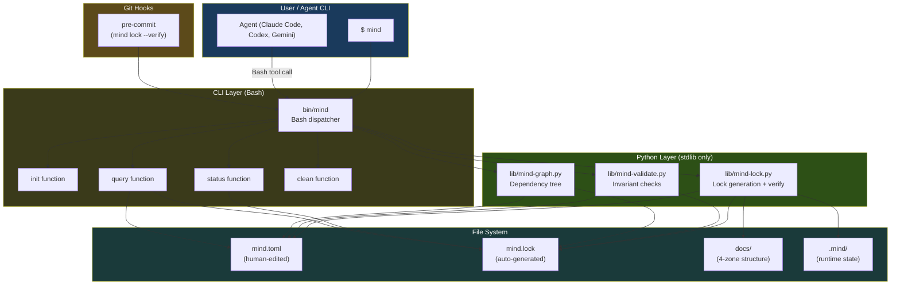
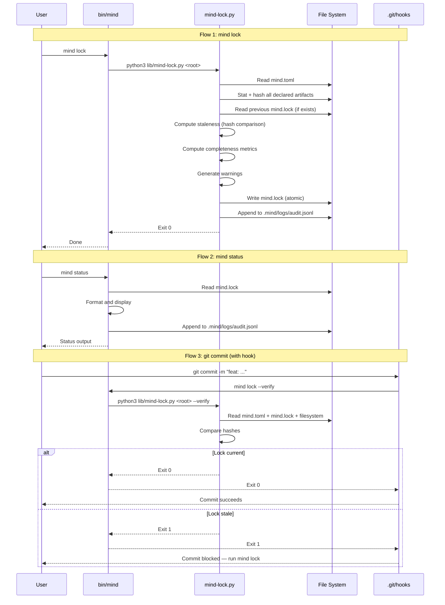

# Phase 1 MVP — Specification

> **Document**: 1 of 3 in the Phase 1 Blueprint  
> **Covers**: Scope definition, functional requirements, non-functional requirements, architecture blueprint, data contracts and schemas  
> **Audience**: Implementing engineer or coding agent  
> **Status**: Implementation-ready  
> **Date**: 2026-02-24

---

## Table of Contents

1. [MVP Scope Definition](#1-mvp-scope-definition)
2. [Functional Requirements](#2-functional-requirements)
3. [Non-Functional Requirements](#3-non-functional-requirements)
4. [MVP Architecture Blueprint](#4-mvp-architecture-blueprint)
5. [Data Contracts and Schemas](#5-data-contracts-and-schemas)

---

## 1. MVP Scope Definition

### 1.1 What Phase 1 Is

Phase 1 validates the Mind Framework's manifest system end-to-end using **Bash + Python (stdlib only)**. It produces a working `mind` CLI that generates lock files, reports project status, validates manifests, queries artifacts, and integrates with git hooks — all without compiled tooling.

Phase 1 is **disposable by design**. Every script will be replaced by Rust in Phase 2. The value is in validating the **data contracts** (mind.toml schema, mind.lock format, CLI output schemas, .mind/ directory layout), not in the scripts themselves.

### 1.2 In Scope

| Capability | Deliverable | Description |
|-----------|------------|-------------|
| **Manifest schema** | `mind.toml` JSON Schema + reference file | Complete schema with all sections defined in MIND-FRAMEWORK.md |
| **Lock file generation** | `mind lock` command | Scan filesystem against manifest, compute hashes, detect staleness, write mind.lock |
| **Lock verification** | `mind lock --verify` | Check if lock is current (exit 1 if stale) — for pre-commit hooks |
| **Project status** | `mind status` command | Display project state: documents, iterations, requirements, warnings |
| **Artifact query** | `mind query <term>` command | Search artifacts by term, URI, tag, or status filter |
| **Manifest validation** | `mind validate` command | Check manifest invariants (every doc has owner, no orphan deps, no cycles) |
| **Dependency graph** | `mind graph` command | Print dependency tree as indented text |
| **Project scaffold** | `scaffold.sh` v2 | Create mind.toml, 4-zone docs structure, .mind/ directory |
| **Framework install** | `install.sh` v2 | Install bin/mind, lib/*.py, hooks, updated agent prompts |
| **Git hook** | Pre-commit hook | Run `mind lock --verify` before every commit |
| **Runtime directory** | `.mind/` structure | Create cache/, logs/, outputs/, tmp/ directories |
| **Agent prompt updates** | All 7 agents + 2 commands | Update to reference 4-zone docs, manifest-aware context loading |
| **JSON output mode** | `--json` flag on all commands | Machine-readable output for agents and CI |
| **Audit logging** | `.mind/logs/audit.jsonl` | Append one line per CLI invocation |

### 1.3 Out of Scope (Deferred)

| Capability | Deferred To | Reason |
|-----------|------------|--------|
| Rust CLI binary | Phase 2 | Validate contracts before investing in compiled implementation |
| MCP server | Phase 2-3 | Requires Rust infrastructure; agents use CLI fallback in Phase 1 |
| WASM plugins | Phase 3 | Premature; bash hooks cover 80% of extensibility need |
| Context budgeting engine | Phase 2 | Requires token estimation heuristics; agents manually select context in Phase 1 |
| Summary cache (`mind summarize`) | Phase 2 | Requires content processing; not critical for MVP validation |
| Container health checks | Phase 2 | Docker API integration; agents run container commands directly in Phase 1 |
| Standalone orchestration | Phase 4-5 | Requires LLM API adapters; out of scope entirely for MVP |
| Multi-platform shim generator | Phase 3 | Focus on Claude Code in Phase 1 |
| Lifecycle hooks (pre/post-workflow) | Phase 2 | Only pre-commit git hook in Phase 1 |
| Output capture (`.mind/outputs/`) | Phase 2 | Agents capture output directly in Phase 1 |
| Run logs (`.mind/logs/runs/`) | Phase 2 | Only audit log in Phase 1 |

### 1.4 Assumptions

| # | Assumption | Impact if Wrong |
|---|-----------|----------------|
| A1 | Python 3.11+ is available on target machines | `tomllib` (stdlib) unavailable; must vendor a TOML parser or require `pip install tomli` |
| A2 | `jq` is optionally available (Python fallback used if absent) | Status/query commands work but run slower (~80ms vs ~50ms) |
| A3 | Git is available and the project is a git repository | Pre-commit hook and branch operations fail gracefully |
| A4 | Target projects use conventional file structures | Manifest paths resolve correctly; exotic structures need manual `path` overrides |
| A5 | Agents can invoke Bash commands | All agent CLIs support shell command execution |

### 1.5 Constraints

| # | Constraint | Source |
|---|-----------|--------|
| C1 | Zero external Python dependencies — stdlib only | Design principle: no `pip install` required |
| C2 | All scripts must be non-interactive — no prompts | Safe for agent and CI execution |
| C3 | `--json` output must match the Phase 2 Rust output byte-for-byte | Migration contract: scripts and Rust binary are interchangeable |
| C4 | `mind.toml` schema must be forwards-compatible with Phase 2+ | No breaking changes when Rust CLI adopts the same schema |
| C5 | Total script footprint < 2,000 lines | Lean philosophy; scripts are disposable |

### 1.6 Dependencies

| Dependency | Version | Purpose | Required? |
|-----------|---------|---------|:---------:|
| Python | 3.11+ | `tomllib` for TOML parsing, `hashlib` for SHA-256, `json` for output | Yes |
| Bash | 4.0+ | CLI dispatcher, scaffold, install, hooks | Yes |
| Git | 2.0+ | Pre-commit hook installation, `rev-parse` for project root | Yes |
| jq | 1.6+ | JSON formatting in status/query (Python fallback if absent) | No |
| sha256sum | any | File hashing (coreutils) — Python `hashlib` used as primary | No |

### 1.7 Success Criteria

| # | Criterion | Measurement |
|---|----------|-------------|
| S1 | `mind lock` generates a valid `mind.lock` from `mind.toml` + filesystem | Lock file passes JSON Schema validation; all declared artifacts resolved |
| S2 | `mind status` displays correct project state | Document status, iteration progress, requirement completion match manual verification |
| S3 | `mind validate` catches all defined invariant violations | Test fixtures with intentional violations all detected |
| S4 | `mind lock --verify` correctly identifies stale locks | Modified file → exit code 1; no changes → exit code 0 |
| S5 | Pre-commit hook blocks commits when lock is stale | Commit with stale lock fails; commit after `mind lock` succeeds |
| S6 | `mind query` returns correct artifact matches | URI queries, tag queries, status filters all return expected results |
| S7 | `--json` output is valid JSON and matches documented schema | All commands produce parseable JSON that matches the schema |
| S8 | `scaffold.sh` creates a complete, valid project structure | Scaffolded project passes `mind validate` with zero violations |
| S9 | Agent prompts correctly reference 4-zone paths | Agents find docs at `docs/spec/`, `docs/state/`, `docs/iterations/`, `docs/knowledge/` |
| S10 | Total script footprint ≤ 2,000 lines | `wc -l bin/mind lib/*.py scripts/*.sh hooks/*` |

---

## 2. Functional Requirements

### 2.1 Module: Manifest Parser (`lib/mind-lock.py`)

#### FR-01: Parse `mind.toml` into structured data

| Field | Value |
|-------|-------|
| **Purpose** | Read the project manifest and produce a structured Python dictionary for all downstream operations |
| **Inputs** | Path to `mind.toml` file |
| **Outputs** | Python dictionary with typed sections: `manifest`, `project`, `profiles`, `framework`, `agents`, `workflows`, `documents`, `graph`, `governance`, `generations`, `operations`, `hooks` |
| **Behavior** | Use `tomllib.load()` to parse. Validate `manifest.schema` starts with `"mind/v"`. Return the complete dictionary. On parse error, print error to stderr and exit 1. |
| **Acceptance** | Given a valid `mind.toml`, the parser returns all sections accessible by key. Given invalid TOML, the parser exits 1 with a human-readable error message. |

#### FR-02: Extract document registry from manifest

| Field | Value |
|-------|-------|
| **Purpose** | Flatten the nested `[documents.*.*]` sections into a list of artifact entries for scanning |
| **Inputs** | Parsed manifest dictionary |
| **Outputs** | List of `{id, path, zone, status, owner, depends_on, tags}` dictionaries |
| **Behavior** | Walk `documents.spec.*`, `documents.state.*`, `documents.iterations.*`, `documents.knowledge.*`. For each entry, extract the canonical `id` field and resolved `path`. Normalize `depends-on` to a list (empty if absent). |
| **Acceptance** | All document entries across all zones are extracted. No document is silently skipped. Zone is correctly identified from the TOML section name. |

---

### 2.2 Module: Lock File Generator (`lib/mind-lock.py`)

#### FR-03: Scan filesystem for declared artifacts

| Field | Value |
|-------|-------|
| **Purpose** | For each artifact declared in the manifest, check whether it exists on disk and compute its metadata |
| **Inputs** | List of artifact entries (from FR-02), project root path |
| **Outputs** | For each artifact: `{exists: bool, hash: str|null, size: int|null, last_modified: str|null}` |
| **Behavior** | For each artifact path: (1) check `os.path.exists()`, (2) if exists and is file: compute SHA-256 hash via `hashlib`, get size via `os.stat()`, get mtime via `os.stat().st_mtime`. If path is a directory (iteration folders), hash the concatenation of all `.md` files within. |
| **Acceptance** | Existing files have valid SHA-256 hashes. Missing files are marked `exists: false`. Directory artifacts (iterations) are hashed consistently. |

#### FR-04: Compute staleness via upstream hash comparison

| Field | Value |
|-------|-------|
| **Purpose** | Determine which artifacts are stale because their upstream dependencies changed since last lock |
| **Inputs** | Current artifact hashes, previous `mind.lock` (if exists), dependency graph edges |
| **Outputs** | For each artifact: `stale: bool`, `stale_reason: str|null` |
| **Behavior** | (1) Build adjacency map from `[[graph]]` edges. (2) For each artifact with `depends-on`, check if any upstream artifact's current hash differs from the hash stored in the previous lock's `upstreamHashes`. (3) If hash mismatch → mark stale with reason "upstream {uri} changed". (4) Propagate staleness transitively: if an artifact is stale, all its downstream artifacts are also stale. (5) Missing artifacts are always stale with reason "declared but missing on disk". |
| **Acceptance** | Changed upstream → downstream marked stale. Transitive staleness propagates correctly. No false positives on unchanged files. |

#### FR-05: Compute completeness metrics

| Field | Value |
|-------|-------|
| **Purpose** | Calculate requirement implementation progress and iteration status counts |
| **Inputs** | Document registry (iterations with `implements` field, spec documents with `sections` containing `status`) |
| **Outputs** | `{requirements: {total, implemented, in_progress, pending, percentage}, iterations: {total, complete, active}}` |
| **Behavior** | Count requirement sections by their `status` field. Count iteration documents by their `status` field (`complete` vs `active`). Calculate percentage as `implemented / total * 100`. |
| **Acceptance** | Counts match manual verification. Projects with no requirements return `{total: 0, percentage: 0}`. |

#### FR-06: Generate `mind.lock` JSON file

| Field | Value |
|-------|-------|
| **Purpose** | Write the computed state as a deterministic JSON file |
| **Inputs** | Resolved artifacts, staleness data, completeness metrics, manifest generation number |
| **Outputs** | `mind.lock` file at project root |
| **Behavior** | (1) Assemble the LockFile structure (see Data Contracts §5.2). (2) Sort all keys alphabetically for deterministic output. (3) Write to a temporary file first, then atomic rename to `mind.lock`. (4) Compute integrity hash (SHA-256 of the full JSON content). |
| **Acceptance** | Running `mind lock` twice with no filesystem changes produces byte-identical output. JSON is valid and parseable. Integrity hash is correct. |

#### FR-07: Verify lock currency (`--verify` mode)

| Field | Value |
|-------|-------|
| **Purpose** | Check if the existing `mind.lock` matches the current filesystem state without writing |
| **Inputs** | `mind.toml`, existing `mind.lock`, filesystem |
| **Outputs** | Exit code: 0 (current) or 1 (stale) |
| **Behavior** | (1) Generate a new lock in memory. (2) Compare the `resolved` section's hashes with the existing lock's hashes. (3) If any hash differs, any artifact is missing, or any new artifact is declared, exit 1. (4) If all match, exit 0. (5) On `--json`, output `{"current": true/false, "changes": [...]}`. |
| **Acceptance** | After `mind lock`, immediately running `mind lock --verify` exits 0. After modifying any tracked file, `mind lock --verify` exits 1. |

---

### 2.3 Module: Manifest Validator (`lib/mind-validate.py`)

#### FR-08: Validate manifest invariants

| Field | Value |
|-------|-------|
| **Purpose** | Check that the manifest satisfies all declared invariants |
| **Inputs** | Parsed manifest, resolved lock file |
| **Outputs** | List of violations (empty if valid), exit code 0 (valid) or 1 (violations found) |
| **Behavior** | Check each invariant declared in `[manifest.invariants]`: (1) `every-document-has-owner`: every `[documents.*.*]` entry has an `owner` field matching an `[agents.*]` key. (2) `every-iteration-has-validation`: every completed iteration has `validation.md` in its `artifacts` list. (3) `no-orphan-dependencies`: every URI in any `depends-on` list exists as an `id` in the document registry. (4) `no-circular-dependencies`: the dependency graph has no cycles (topological sort succeeds). |
| **Acceptance** | A valid manifest produces zero violations. A manifest with a missing owner, orphan dependency, or circular dependency is correctly flagged. |

#### FR-09: Detect dependency graph cycles

| Field | Value |
|-------|-------|
| **Purpose** | Verify the dependency graph is a DAG (no circular dependencies) |
| **Inputs** | List of `[[graph]]` edges |
| **Outputs** | `{has_cycle: bool, cycle: [uri1, uri2, ...] | null}` |
| **Behavior** | Implement Kahn's algorithm for topological sorting. If the sort does not consume all nodes, a cycle exists. Return the participating nodes. |
| **Acceptance** | Acyclic graphs pass. A → B → C → A is detected. Self-referencing edges (A → A) are detected. |

---

### 2.4 Module: Status Display (`bin/mind` — `status` subcommand)

#### FR-10: Display project status dashboard

| Field | Value |
|-------|-------|
| **Purpose** | Present a human-readable project state summary |
| **Inputs** | `mind.lock` (JSON) |
| **Outputs** | Formatted text to stdout (or JSON with `--json`) |
| **Behavior** | Read `mind.lock`. Display: (1) project header (name, generation, profile, schema). (2) Documents table (URI, status indicator, last modified, stale reason). (3) Iterations table (ID, status, implements). (4) Requirements progress bar and list. (5) Warning count and list. |
| **Acceptance** | Output matches the format specified in operational layer §3.4. JSON output matches the StatusOutput schema (§5.4). |

#### FR-11: Query artifacts by term

| Field | Value |
|-------|-------|
| **Purpose** | Search the artifact registry for matches by URI, tag, status, or free text |
| **Inputs** | Search term (string), optional filters: `--stale`, `--missing`, `--zone=<zone>`, `--tag=<tag>` |
| **Outputs** | Matching artifacts with their status and path |
| **Behavior** | Read `mind.lock` and `mind.toml`. Match the search term against: (1) canonical URI (substring match). (2) Tags (exact match). (3) Status values. (4) Path (substring match). Apply filters if specified. Sort by relevance (exact URI match first, then tag, then path). |
| **Acceptance** | `mind query "FR-3"` finds artifacts referencing FR-3. `mind query --stale` lists all stale artifacts. `mind query --zone=spec` lists all spec documents. |

---

### 2.5 Module: Dependency Graph (`lib/mind-graph.py`)

#### FR-12: Display dependency tree

| Field | Value |
|-------|-------|
| **Purpose** | Visualize the artifact dependency graph as an indented text tree |
| **Inputs** | `mind.toml` (`[[graph]]` edges and `[documents.*]` entries) |
| **Outputs** | Indented text tree to stdout (or JSON adjacency list with `--json`) |
| **Behavior** | (1) Build adjacency map from edges. (2) Find root nodes (no incoming edges). (3) DFS from each root, printing each node with indentation proportional to depth. (4) Annotate stale nodes with `[STALE]` if lock file shows staleness. (5) Annotate missing nodes with `[MISSING]`. |
| **Acceptance** | Tree correctly represents all dependency relationships. Circular dependencies (if present despite validation) are marked `[CYCLE]` and traversal stops. |

---

### 2.6 Module: CLI Dispatcher (`bin/mind`)

#### FR-13: Route subcommands to implementations

| Field | Value |
|-------|-------|
| **Purpose** | Provide a single `mind` entry point that dispatches to Python scripts or bash functions |
| **Inputs** | Command-line arguments: `mind <subcommand> [flags] [args]` |
| **Outputs** | Delegates to the appropriate implementation |
| **Behavior** | Parse the first argument as the subcommand. Route: `init` → bash function, `lock` → `python3 lib/mind-lock.py`, `status` → bash/python function, `query` → bash/python function, `graph` → `python3 lib/mind-graph.py`, `validate` → `python3 lib/mind-validate.py`, `clean` → bash function, `help` / no args → print usage. Pass all remaining arguments to the implementation. |
| **Acceptance** | All subcommands route correctly. Unknown subcommands print usage and exit 1. `--help` works for each subcommand. |

#### FR-14: Resolve project root

| Field | Value |
|-------|-------|
| **Purpose** | Find the project root directory (location of `mind.toml`) from any subdirectory |
| **Inputs** | Current working directory |
| **Outputs** | Absolute path to project root |
| **Behavior** | Walk up from CWD looking for `mind.toml`. If not found, try `git rev-parse --show-toplevel`. If neither found, use CWD and warn "no mind.toml found". |
| **Acceptance** | Running `mind status` from `src/app/models/` correctly finds `mind.toml` at the project root. |

---

### 2.7 Module: Scaffold (`scripts/scaffold.sh`)

#### FR-15: Create new project structure with mind.toml

| Field | Value |
|-------|-------|
| **Purpose** | Bootstrap a new project with the 4-zone docs structure, starter mind.toml, and .mind/ directory |
| **Inputs** | Target directory, optional flags: `--name=<name>`, `--with-framework`, `--backend` |
| **Outputs** | Complete directory structure (see §5.6 in Implementation Guide) |
| **Behavior** | (1) Create `docs/spec/`, `docs/state/`, `docs/iterations/`, `docs/knowledge/` with template files. (2) Generate `mind.toml` with `[manifest]`, `[project]`, `[profiles]` based on flags. (3) Create `.mind/` directory tree. (4) Update `.gitignore` with `.mind/` entry. (5) If `--with-framework`, invoke `install.sh`. (6) If `--backend`, set `profiles.active = ["backend-api"]` and add backend-specific templates. |
| **Acceptance** | Scaffolded project passes `mind validate`. All expected directories and files exist. `mind.toml` is valid TOML and contains all required sections. |

---

### 2.8 Module: Git Integration

#### FR-16: Pre-commit hook

| Field | Value |
|-------|-------|
| **Purpose** | Block commits when `mind.lock` is out of sync with `mind.toml` and filesystem |
| **Inputs** | Staged files (implicit from git) |
| **Outputs** | Exit 0 (allow commit) or exit 1 (block commit with message) |
| **Behavior** | If `mind.toml` exists AND `mind.lock` exists, run `mind lock --verify`. If exit 1, print instruction to run `mind lock`. If `mind.toml` does not exist, exit 0 (framework not active). |
| **Acceptance** | Commit blocked when lock is stale. Commit allowed when lock is current. Commit allowed when no manifest exists (framework not adopted). Hook adds < 500ms to commit time (Python startup + verify). |

---

### 2.9 Module: Audit Logging

#### FR-17: Append audit log entry on every CLI invocation

| Field | Value |
|-------|-------|
| **Purpose** | Maintain an append-only log of all `mind` CLI invocations for diagnostics |
| **Inputs** | Command name, arguments, start time |
| **Outputs** | One JSONL line appended to `.mind/logs/audit.jsonl` |
| **Behavior** | At the end of every successful CLI invocation, append: `{"ts": "<ISO8601>", "command": "mind <subcommand>", "duration": "<seconds>", "exit_code": <N>}`. For `mind lock`, also include `"artifacts_scanned"`, `"stale"`, `"missing"` counts. Create the `.mind/logs/` directory if it doesn't exist. |
| **Acceptance** | After running 5 `mind` commands, `.mind/logs/audit.jsonl` contains exactly 5 lines of valid JSON. |

---

## 3. Non-Functional Requirements

### 3.1 Performance

| Metric | Target | Measurement Method |
|--------|:------:|-------------------|
| `mind lock` (full scan, 50 artifacts) | < 2 seconds | `time mind lock` on reference project |
| `mind lock --verify` | < 1 second | `time mind lock --verify` (pre-commit hook budget) |
| `mind status` | < 500ms | `time mind status` (reads pre-computed JSON) |
| `mind query` | < 500ms | `time mind query "FR-3"` |
| `mind validate` | < 1 second | `time mind validate` |
| `mind graph` | < 500ms | `time mind graph` |

Note: Phase 1 targets are 5-10x slower than Phase 2 (Rust). This is acceptable for MVP validation. The Python startup overhead (~80ms) is the dominant cost.

### 3.2 Maintainability & Extensibility

- All Python scripts use only stdlib modules (no external packages).
- Each script is a standalone file with no cross-script imports (disposable by design).
- All output schemas are documented in JSON Schema format and versioned.
- The `bin/mind` dispatcher is < 100 lines and trivially readable.
- Phase 2 can replace any script independently without affecting others.

### 3.3 Reliability & Fault Tolerance

- All file writes use atomic operations (write to `.tmp`, rename).
- If `mind.toml` is missing, commands exit gracefully with a clear message (not a stack trace).
- If `mind.lock` is missing, `mind status` and `mind query` report "no lock file — run `mind lock`" and exit 2.
- If a declared artifact path is invalid (outside project root), it is reported as a warning, not a crash.
- All Python scripts catch `tomllib.TOMLDecodeError` and report line/column of the parse error.

### 3.4 Logging & Observability

- Every CLI invocation produces an audit log entry (FR-17).
- All error messages go to stderr; all data output goes to stdout.
- `--verbose` flag (optional in MVP) adds debug messages to stderr.
- Exit codes are semantically meaningful and documented (see §5.5).

### 3.5 Portability

- Primary platforms: Linux (x86_64, aarch64), macOS (x86_64, aarch64).
- Secondary platform: Windows via WSL (native Windows not tested in Phase 1).
- All scripts use `/usr/bin/env bash` and `/usr/bin/env python3` shebangs.
- No GNU-specific extensions in bash scripts (POSIX-compatible where possible).
- No hardcoded paths (all paths relative to project root or `$HOME`).

### 3.6 Security

- No network access in any Phase 1 script.
- No credential handling or secret management.
- No file access outside the project root directory.
- The pre-commit hook does not modify files — it only reads and reports.

### 3.7 Token & Context Efficiency

- Agent prompts updated to reference `mind.toml` and `mind.lock` for context loading.
- Agents read `mind status --json` output (~500 tokens) instead of parsing multiple files.
- Each agent prompt specifies which manifest sections are relevant to its role.
- The `mind query` command reduces the need for agents to `grep` across the project.

---

## 4. MVP Architecture Blueprint

### 4.1 High-Level Component Diagram



### 4.2 Component Responsibilities

| Component | Responsibility | Language | Lines (est.) |
|-----------|---------------|:--------:|:---:|
| `bin/mind` | Subcommand dispatch, project root resolution, `init`/`status`/`query`/`clean` functions | Bash | ~150 |
| `lib/mind-lock.py` | TOML parsing, filesystem scanning, hash computation, staleness detection, lock file generation, verify mode | Python | ~250 |
| `lib/mind-validate.py` | Invariant checking, cycle detection, orphan dependency detection | Python | ~120 |
| `lib/mind-graph.py` | Graph construction, DFS traversal, text tree rendering | Python | ~100 |
| `scripts/scaffold.sh` | Project bootstrapping, mind.toml generation, directory creation | Bash | ~350 |
| `scripts/install.sh` | Framework installation into target project | Bash | ~150 |
| `hooks/pre-commit.sh` | Lock verification for git pre-commit | Bash | ~15 |
| **Total** | | | **~1,135** |

### 4.3 Data Flow



### 4.4 Modularity Boundaries

These boundaries must be respected in Phase 1 to ensure clean Phase 2 migration:

| Boundary | Rule | Rationale |
|----------|------|-----------|
| **TOML parsing** | Only `mind-lock.py` and `mind-validate.py` and `mind-graph.py` parse TOML | Single parsing implementation per language |
| **Lock file reading** | Status and query read `mind.lock` (JSON), never `mind.toml` directly | Lock file is the pre-computed index; avoid re-parsing TOML |
| **File writes** | Only `mind-lock.py` writes `mind.lock`; only `scaffold.sh` writes `mind.toml` | Single writer per file type |
| **Stdout vs stderr** | Data → stdout, messages → stderr | Enables `mind status --json | jq .completeness` |
| **Exit codes** | Semantic exit codes (see §5.5) | Enables `mind lock --verify && git commit` |

---

## 5. Data Contracts and Schemas

### 5.1 `mind.toml` — Manifest Schema

The complete TOML schema for Phase 1. All fields marked `[required]` must be present for `mind validate` to pass. Fields marked `[optional]` may be absent.

```toml
# ═══════════════════════════════════════════════════════════════
# SECTION 1: MANIFEST METADATA [required]
# ═══════════════════════════════════════════════════════════════
[manifest]
schema     = "mind/v2.0"         # [required] Schema version string
generation = 1                    # [required] Monotonic counter (integer ≥ 1)
updated    = 2026-02-24T14:30:00Z # [optional] Last update timestamp (RFC 3339)

# ═══════════════════════════════════════════════════════════════
# SECTION 2: PROJECT IDENTITY [required]
# ═══════════════════════════════════════════════════════════════
[project]
name        = "my-project"        # [required] Project name (kebab-case)
description = ""                  # [optional] One-line description
domain      = ""                  # [optional] Business domain
type        = "backend"           # [optional] backend | frontend | fullstack | library | cli
created     = 2026-02-24          # [optional] Creation date

[project.stack]                   # [optional] Technology stack
language  = "python@3.12"        # [optional] Primary language + version
framework = ""                    # [optional] Primary framework
database  = ""                    # [optional] Primary database
testing   = ""                    # [optional] Test framework

[project.commands]                # [optional] Project commands
dev       = ""                    # [optional] Development server command
test      = ""                    # [optional] Test command
lint      = ""                    # [optional] Lint command
typecheck = ""                    # [optional] Type checking command
build     = ""                    # [optional] Build command

# ═══════════════════════════════════════════════════════════════
# SECTION 3: PROFILES [optional]
# ═══════════════════════════════════════════════════════════════
[profiles]
active = []                       # [optional] List of active profile names

# ═══════════════════════════════════════════════════════════════
# SECTION 4: AGENTS [optional in Phase 1]
# ═══════════════════════════════════════════════════════════════
# [agents.<name>]
# id     = "agent:<name>"         # [required per entry] Canonical URI
# path   = ".claude/agents/<name>.md" # [required per entry] Relative path
# role   = "dispatch"             # [required per entry] Role identifier
# loads  = "always"               # [optional] always | on-demand | conditional

# ═══════════════════════════════════════════════════════════════
# SECTION 5: WORKFLOWS [optional in Phase 1]
# ═══════════════════════════════════════════════════════════════
# [workflows.<name>]
# chain = ["analyst", "developer", "reviewer"]  # [required per entry]

# ═══════════════════════════════════════════════════════════════
# SECTION 6: DOCUMENT REGISTRY [core of Phase 1]
# ═══════════════════════════════════════════════════════════════
# [documents.<zone>.<name>]
# id          = "doc:<zone>/<name>"  # [required] Canonical URI
# path        = "docs/<zone>/<name>.md" # [required] Relative path from root
# zone        = "spec"               # [required] spec | state | iteration | knowledge
# status      = "active"             # [required] active | draft | complete | archived
# owner       = "agent:analyst"      # [optional*] Agent URI (*required if invariant enabled)
# depends-on  = []                   # [optional] List of upstream artifact URIs
# tags        = []                   # [optional] List of string tags
# consumed-by = []                   # [optional] List of consumer agent URIs

# For iterations specifically:
# type        = "enhancement"        # [required for iterations] new-project | bug-fix | enhancement | refactor
# branch      = "feature/name"       # [optional] Git branch name
# implements  = ["doc:spec/requirements#FR-1"]  # [optional] Requirement URIs
# artifacts   = ["overview.md", "changes.md"]   # [optional] Files within iteration directory

# ═══════════════════════════════════════════════════════════════
# SECTION 7: DEPENDENCY GRAPH [core of Phase 1]
# ═══════════════════════════════════════════════════════════════
# [[graph]]
# from = "doc:spec/requirements"     # [required] Source URI
# to   = "doc:spec/project-brief"    # [required] Target URI
# type = "derives-from"              # [required] derives-from | implements | validates | supersedes | informs

# ═══════════════════════════════════════════════════════════════
# SECTION 8: GOVERNANCE [optional in Phase 1]
# ═══════════════════════════════════════════════════════════════
[governance]
max-retries     = 2               # [optional] Default: 2
review-policy   = "evidence-based" # [optional]
commit-policy   = "conventional"   # [optional]
branch-strategy = "type-descriptor" # [optional]

# ═══════════════════════════════════════════════════════════════
# SECTION 9: MANIFEST INVARIANTS [optional but recommended]
# ═══════════════════════════════════════════════════════════════
[manifest.invariants]
every-document-has-owner       = true   # [optional] Default: false
every-iteration-has-validation = true   # [optional] Default: false
no-orphan-dependencies         = true   # [optional] Default: false
no-circular-dependencies       = true   # [optional] Default: false

# ═══════════════════════════════════════════════════════════════
# SECTION 10: GENERATIONS [optional]
# ═══════════════════════════════════════════════════════════════
# [[generations]]
# number = 1                        # [required per entry] Monotonic integer
# date   = 2026-02-24               # [required per entry] Date
# event  = "project-initialized"    # [required per entry] Event description
# detail = "..."                    # [optional] Additional detail
```

### 5.2 `mind.lock` — Lock File Schema

```json
{
  "$schema": "https://json-schema.org/draft/2020-12/schema",
  "title": "mind.lock",
  "type": "object",
  "required": ["lockVersion", "generatedAt", "generation", "resolved", "warnings", "completeness", "integrity"],
  "properties": {
    "lockVersion": { "type": "integer", "const": 1 },
    "generatedAt": { "type": "string", "format": "date-time" },
    "generation": { "type": "integer", "minimum": 1 },
    "resolved": {
      "type": "object",
      "additionalProperties": {
        "type": "object",
        "required": ["path", "exists", "stale"],
        "properties": {
          "path": { "type": "string" },
          "exists": { "type": "boolean" },
          "hash": { "type": ["string", "null"] },
          "size": { "type": ["integer", "null"] },
          "lastModified": { "type": ["string", "null"], "format": "date-time" },
          "stale": { "type": "boolean" },
          "staleReason": { "type": ["string", "null"] },
          "upstreamHashes": {
            "type": "object",
            "additionalProperties": { "type": "string" }
          },
          "archived": { "type": "boolean", "default": false }
        }
      }
    },
    "warnings": { "type": "array", "items": { "type": "string" } },
    "completeness": {
      "type": "object",
      "properties": {
        "requirements": {
          "type": "object",
          "properties": {
            "total": { "type": "integer" },
            "implemented": { "type": "integer" },
            "inProgress": { "type": "integer" },
            "pending": { "type": "integer" },
            "percentage": { "type": "integer" }
          }
        },
        "iterations": {
          "type": "object",
          "properties": {
            "total": { "type": "integer" },
            "complete": { "type": "integer" },
            "active": { "type": "integer" }
          }
        }
      }
    },
    "integrity": { "type": "string" }
  }
}
```

### 5.3 Audit Log Schema (JSONL)

Each line in `.mind/logs/audit.jsonl`:

```json
{
  "ts": "2026-02-24T14:30:00Z",
  "command": "mind lock",
  "args": [],
  "duration": "0.18s",
  "exitCode": 0,
  "artifacts_scanned": 12,
  "stale": 2,
  "missing": 1
}
```

Fields `artifacts_scanned`, `stale`, `missing` are only present for the `lock` command. All other commands include only `ts`, `command`, `args`, `duration`, `exitCode`.

### 5.4 CLI Output Schemas (`--json` mode)

#### Status Output

```json
{
  "project": { "name": "string", "generation": 0, "schema": "string", "profile": "string" },
  "documents": [
    { "uri": "string", "status": "ok|stale|missing", "lastModified": "string|null", "staleReason": "string|null" }
  ],
  "iterations": [
    { "id": "string", "status": "active|complete", "implements": ["string"] }
  ],
  "requirements": { "total": 0, "implemented": 0, "inProgress": 0, "pending": 0, "percentage": 0 },
  "warnings": ["string"]
}
```

#### Query Output

```json
{
  "query": "string",
  "matches": [
    { "uri": "string", "path": "string", "status": "ok|stale|missing", "zone": "string", "tags": ["string"] }
  ]
}
```

#### Validate Output

```json
{
  "valid": true,
  "violations": [
    { "invariant": "string", "detail": "string", "artifact": "string|null" }
  ]
}
```

#### Lock Verify Output

```json
{
  "current": true,
  "changes": [
    { "uri": "string", "type": "hash_changed|added|removed", "detail": "string" }
  ]
}
```

#### Graph Output

```json
{
  "nodes": [
    { "uri": "string", "zone": "string", "status": "ok|stale|missing" }
  ],
  "edges": [
    { "from": "string", "to": "string", "type": "string" }
  ]
}
```

### 5.5 Exit Code Convention

| Code | Meaning | Used By |
|:---:|---------|---------|
| 0 | Success | All commands |
| 1 | Failure (stale lock, validation violation, command error) | `lock --verify`, `validate`, parse errors |
| 2 | Missing prerequisite (no mind.toml, no mind.lock) | `status`, `query`, `graph` when lock missing |
| 3 | Invalid input (bad arguments, unknown flags) | CLI dispatcher |

### 5.6 Naming Conventions

| Entity | Convention | Example |
|--------|-----------|---------|
| Project name | `kebab-case` | `inventory-api` |
| Iteration folder | `NNN-type-descriptor` | `003-enhancement-barcode-scan` |
| Iteration number | 3-digit zero-padded | `001`, `012`, `100` |
| Branch name | `type/descriptor` | `feature/barcode-scanning` |
| Canonical URI | `type:zone/name` | `doc:spec/requirements` |
| Fragment | `#identifier` | `doc:spec/requirements#FR-3` |
| Document tags | `lowercase-kebab` | `core`, `domain`, `api` |
| Generation events | `past-tense-kebab` | `project-initialized`, `iteration-complete` |

### 5.7 Version Strategy

| Artifact | Versioning | Storage |
|----------|-----------|---------|
| `mind.toml` schema | `manifest.schema = "mind/v2.0"` | In the manifest itself |
| `mind.lock` format | `lockVersion: 1` | In the lock file itself |
| CLI output schemas | Implicit v1 (breaking changes bump the major) | Not versioned in Phase 1; documented in this spec |
| Framework version | `framework.version = "2.0.0"` | In the manifest |
| Generation counter | Monotonic integer, never resets | `manifest.generation` field |

---

*End of Document 1. Continue to Document 2 (`phase1-mvp-implementation-guide.md`) for file structure, scripts, CLI integration, and governance.*
