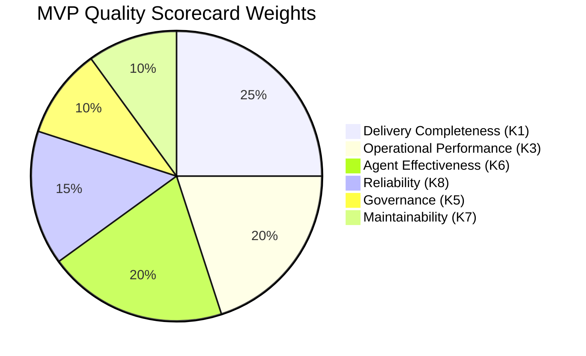
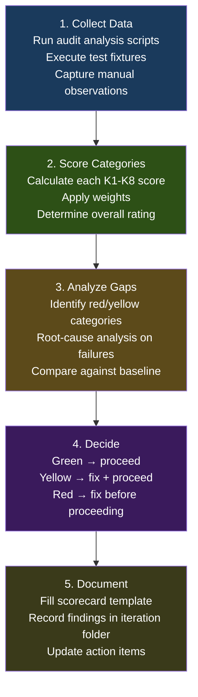
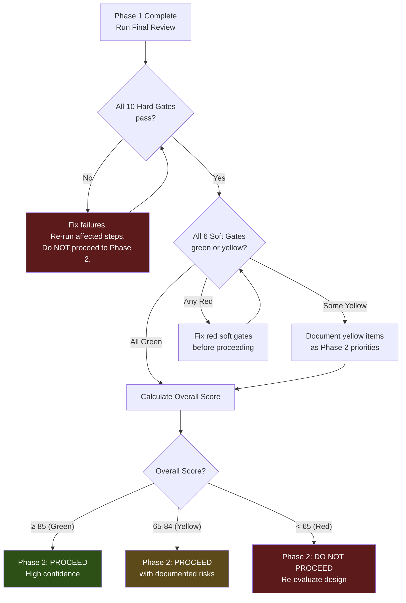

# Phase 1 MVP — Success Measurement Blueprint

> **Purpose**: Defines how to measure whether the Mind Framework MVP is successful, which metrics to track, how to collect data, and what conditions must be true to declare Phase 1 complete and ready for Phase 2.
>
> **Status**: Measurement framework — ready for adoption
> **Date**: 2026-02-24
> **Upstream**: `phase1-mvp-specification.md`, `phase1-mvp-delivery-plan.md`, `mvp-blueprint-scope-and-requirements.md`

---

## Table of Contents

1. [MVP Success Definition](#1-mvp-success-definition)
2. [Success Dimensions and KPI Categories](#2-success-dimensions-and-kpi-categories)
3. [Metric Definitions](#3-metric-definitions)
4. [Baseline vs Target Model](#4-baseline-vs-target-model)
5. [Instrumentation and Data Collection](#5-instrumentation-and-data-collection)
6. [MVP Quality Scorecard](#6-mvp-quality-scorecard)
7. [Review Cadence and Decision Rituals](#7-review-cadence-and-decision-rituals)
8. [Measurement Risks and Pitfalls](#8-measurement-risks-and-pitfalls)
9. [MVP Exit Criteria Based on Metrics](#9-mvp-exit-criteria-based-on-metrics)
10. [Phase 2 Measurement Evolution](#10-phase-2-measurement-evolution)

---

## 1. MVP Success Definition

### 1.1 What "Success" Means for Phase 1

Phase 1 has a precise strategic purpose: **validate the data contracts and operational design** before investing in a Rust implementation. Success is not about building a production-grade tool — it is about proving that the manifest system, lock file, dependency graph, staleness detection, and CLI interface work correctly across real project scenarios.

Success is therefore measured across two axes:

1. **Contract validation**: Do the schemas, output formats, exit codes, and file structures work correctly and remain stable across diverse projects?
2. **Operational value**: Does the framework measurably improve workflow clarity, artifact traceability, and project state visibility for both humans and agents?

### 1.2 Three Success Tiers

| Tier | Name | Description | Implication |
|:---:|------|-------------|-------------|
| **T1** | Minimum Viable Success | All functional requirements pass. Contracts are validated against 3+ test fixtures. No critical bugs. | Proceed to Phase 2 with low confidence. Schema may still need changes. |
| **T2** | Target Success | T1 + the framework has been dogfooded on 2+ real projects with updated agent prompts. Schema is stable (no changes needed after initial validation). At least one workflow executed end-to-end with agents using `mind status --json`. | Proceed to Phase 2 with high confidence. Rust implementation can begin. |
| **T3** | Stretch Success | T2 + quantified improvements in workflow efficiency (artifact lookup time, staleness catch rate). Agent workflows demonstrably shorter (fewer redundant file reads). Pre-commit hook prevents at least 1 real stale-lock commit. External feedback from another user or project. | Proceed to Phase 2 with strong validation. Potential for early community interest. |

### 1.3 Dimensions of Success

```mermaid
graph TD
    MVP["MVP Success"]
    
    MVP --> D1["Delivery Completeness<br/><i>Did we build what we planned?</i>"]
    MVP --> D2["Workflow Efficiency<br/><i>Is it faster to work with the framework?</i>"]
    MVP --> D3["Operational Performance<br/><i>Are commands fast and reliable?</i>"]
    MVP --> D4["Documentation Quality<br/><i>Is the project state clear?</i>"]
    MVP --> D5["Governance Compliance<br/><i>Are rules followed consistently?</i>"]
    MVP --> D6["Agent Effectiveness<br/><i>Can agents use the CLI productively?</i>"]
    MVP --> D7["Maintainability<br/><i>Is the code clean and replaceable?</i>"]
    MVP --> D8["Reliability<br/><i>Does it fail gracefully?</i>"]

    style MVP fill:#2d5016,color:#fff
    style D1 fill:#1a3a5c,color:#fff
    style D2 fill:#1a3a5c,color:#fff
    style D3 fill:#1a3a5c,color:#fff
    style D4 fill:#1a3a5c,color:#fff
    style D5 fill:#1a3a5c,color:#fff
    style D6 fill:#1a3a5c,color:#fff
    style D7 fill:#1a3a5c,color:#fff
    style D8 fill:#1a3a5c,color:#fff
```



---

## 2. Success Dimensions and KPI Categories

### 2.1 KPI Category Map

| # | Category | Why It Matters for MVP | Primary Data Source |
|---|----------|----------------------|---------------------|
| **K1** | Delivery Completeness | The MVP must deliver all planned capabilities. Missing features invalidate the contract validation. | Test fixture results, FR checklist |
| **K2** | Workflow Efficiency | The framework exists to make workflows faster. If it doesn't, the design is wrong (catch it now). | Manual timing comparisons, audit log timestamps |
| **K3** | Operational Performance | Commands must be fast enough for git hooks and agent invocations. Slowness kills adoption. | `time` command outputs, audit log durations |
| **K4** | Documentation Quality | The framework's core value is structured, traceable documentation. Quality must be measurable. | `mind status --json` completeness metrics, manual scoring |
| **K5** | Governance & Compliance | Naming, branching, commit, and invariant rules must be enforced from day one. | `mind validate` results, git log analysis |
| **K6** | Agent Effectiveness | Agents are the primary consumers. If they can't parse output or find context, the design fails. | Agent workflow observations, `--json` parsability |
| **K7** | Maintainability & Extensibility | Phase 1 code is disposable — but the contracts must be clean enough for Phase 2 Rust replacement. | Line counts, module coupling analysis |
| **K8** | Operational Reliability | Crashes, silent data loss, or incorrect output destroy trust immediately. | Error logs, test fixture pass rates |

---

## 3. Metric Definitions

### 3.1 K1 — Delivery Completeness Metrics

#### M-DC-01: Functional Requirement Coverage

| Field | Value |
|-------|-------|
| **Definition** | Percentage of defined functional requirements (FR-01 through FR-17) that pass their acceptance criteria |
| **Purpose** | Confirms all planned capabilities are delivered |
| **Formula** | `(FRs passing / total FRs) × 100` |
| **Data source** | Test fixture execution results |
| **Frequency** | At end of each implementation step, and at Phase 1 completion |
| **Target** | T1: 100%. No partial credit — all FRs must pass. |
| **Interpretation** | Any FR below 100% blocks Phase 2 transition. Identify which FR failed and prioritize. |

#### M-DC-02: Test Fixture Pass Rate

| Field | Value |
|-------|-------|
| **Definition** | Percentage of test fixtures (valid-project, missing-artifacts, circular-deps, orphan-deps, minimal) that produce expected output |
| **Purpose** | Validates contract correctness across diverse scenarios |
| **Formula** | `(fixtures passing / total fixtures) × 100` |
| **Data source** | `diff expected-output.json actual-output.json` for each fixture |
| **Frequency** | After every change to lock/validate/graph logic |
| **Target** | T1: 100%. T3: 7+ fixtures (including edge cases added during development). |
| **Interpretation** | Failing fixtures indicate contract instability. Do not freeze schemas until 100%. |

#### M-DC-03: Schema Stability Index

| Field | Value |
|-------|-------|
| **Definition** | Number of breaking changes to `mind.toml` or `mind.lock` schemas after initial freeze |
| **Purpose** | Measures whether the design was right the first time |
| **Formula** | Count of commits modifying `schemas/*.schema.json` after the "schema freeze" commit |
| **Data source** | `git log --oneline -- schemas/` |
| **Frequency** | Weekly during development, at Phase 1 completion |
| **Target** | T1: ≤ 3 breaking changes. T2: ≤ 1. T3: 0. |
| **Interpretation** | High change count means the design wasn't validated early enough. Each change risks breaking downstream consumers. |

---

### 3.2 K2 — Workflow Efficiency Metrics

#### M-WE-01: Time to Initialize Project

| Field | Value |
|-------|-------|
| **Definition** | Wall-clock time from running `scaffold.sh` to having a valid `mind.lock` |
| **Purpose** | Measures onboarding friction — faster setup = faster adoption |
| **Formula** | `time (scaffold.sh /tmp/test-project --with-framework && cd /tmp/test-project && mind lock)` |
| **Data source** | Manual measurement (scripted) |
| **Frequency** | At scaffold completion, at Phase 1 end |
| **Target** | T1: < 10 seconds. T2: < 5 seconds. |
| **Interpretation** | If initialization is slow, developers won't adopt. Most time should be in `mind lock` (hash computation). |

#### M-WE-02: Time to Locate Artifact

| Field | Value |
|-------|-------|
| **Definition** | Time to find a specific artifact's path and status using the framework vs manual exploration |
| **Purpose** | Quantifies the value of the artifact index |
| **Formula** | `time mind query "doc:spec/requirements" --json` vs `time find docs/ -name "requirements*"` |
| **Data source** | Manual comparison on reference project |
| **Frequency** | Once during dogfooding |
| **Target** | Framework query ≤ 200ms. Manual search varies (2-10 seconds for unfamiliar projects). |
| **Interpretation** | The framework should be at least 5x faster than manual exploration for artifact lookup. |

#### M-WE-03: Staleness Catch Rate

| Field | Value |
|-------|-------|
| **Definition** | Percentage of intentionally introduced staleness that `mind lock` correctly detects |
| **Purpose** | Validates the reactive dependency graph — the framework's core innovation |
| **Formula** | `(detected stale artifacts / total actually stale artifacts) × 100` |
| **Data source** | Test scenarios: modify upstream artifact, run `mind lock`, check staleness propagation |
| **Frequency** | During Step 2 testing, during dogfooding |
| **Target** | 100%. Zero false negatives on staleness. |
| **Interpretation** | Any missed staleness means the dependency graph traversal has a bug. Critical to fix before Phase 2. |

#### M-WE-04: Manual Steps Eliminated

| Field | Value |
|-------|-------|
| **Definition** | Count of workflow actions that were previously manual and are now automated or information-accessible via CLI |
| **Purpose** | Quantifies operational value added by the framework |
| **Formula** | Enumeration: list each manual step replaced by a `mind` command |
| **Data source** | Before/after comparison (see §4 Baseline Model) |
| **Frequency** | At Phase 1 completion |
| **Target** | T1: ≥ 5 manual steps eliminated. T2: ≥ 8. T3: ≥ 12. |
| **Interpretation** | Each eliminated manual step reduces cognitive load and error risk. |

---

### 3.3 K3 — Operational Performance Metrics

#### M-OP-01: Command Latency (P95)

| Field | Value |
|-------|-------|
| **Definition** | 95th percentile execution time for each `mind` subcommand |
| **Purpose** | Ensures the CLI is fast enough for interactive use and git hooks |
| **Formula** | Run each command 20 times, sort durations, take the 95th percentile |
| **Data source** | `.mind/logs/audit.jsonl` (duration field) |
| **Frequency** | After each implementation step, at Phase 1 completion |
| **Targets** | |

| Command | T1 Target | T2 Target |
|---------|:---------:|:---------:|
| `mind status` | ≤ 500ms | ≤ 200ms |
| `mind status --json` | ≤ 300ms | ≤ 150ms |
| `mind lock` (20 artifacts) | ≤ 2000ms | ≤ 1000ms |
| `mind lock --verify` | ≤ 1000ms | ≤ 500ms |
| `mind query` | ≤ 500ms | ≤ 200ms |
| `mind validate` | ≤ 1000ms | ≤ 300ms |
| `mind graph` | ≤ 500ms | ≤ 200ms |

| **Interpretation** | Commands exceeding T1 targets are acceptable but should be profiled. Commands exceeding 2x T1 indicate a performance bug. |

#### M-OP-02: Lock Determinism

| Field | Value |
|-------|-------|
| **Definition** | Whether running `mind lock` twice without filesystem changes produces byte-identical output |
| **Purpose** | Deterministic output is a migration contract requirement |
| **Formula** | `mind lock && cp mind.lock a.json && mind lock && diff a.json mind.lock` |
| **Data source** | Manual test (scriptable) |
| **Frequency** | After any change to mind-lock.py |
| **Target** | 100% deterministic. Zero byte difference. |
| **Interpretation** | Non-determinism means the JSON serialization has unstable ordering. Fix immediately. |

#### M-OP-03: Script Execution Success Rate

| Field | Value |
|-------|-------|
| **Definition** | Percentage of `mind` CLI invocations that exit with the expected exit code (not crash with unhandled exception) |
| **Purpose** | Measures basic operational reliability |
| **Formula** | `(invocations with expected exit code / total invocations) × 100` |
| **Data source** | `.mind/logs/audit.jsonl` — count exit codes 0-3 vs unexpected |
| **Frequency** | Continuously from audit log |
| **Target** | T1: ≥ 99%. T2: ≥ 99.9%. |
| **Interpretation** | Any unhandled Python traceback (exit code ≠ 0-3) is a reliability bug. |

---

### 3.4 K4 — Documentation Quality Metrics

#### M-DQ-01: Documentation Completeness Score

| Field | Value |
|-------|-------|
| **Definition** | Percentage of documents declared in `mind.toml` that exist on disk and are non-empty |
| **Purpose** | Measures whether the framework drives complete documentation |
| **Formula** | From `mind.lock`: `(artifacts with exists=true AND size > 0) / total declared artifacts × 100` |
| **Data source** | `mind status --json` → `.completeness` field |
| **Frequency** | At every `mind lock` invocation (automatic) |
| **Target** | T1: ≥ 80% for dogfood projects. T3: ≥ 95%. |
| **Interpretation** | Low completeness means the manifest declares more than the team produces — either prune the manifest or fill the gaps. |

#### M-DQ-02: Requirement Traceability Coverage

| Field | Value |
|-------|-------|
| **Definition** | Percentage of defined requirements (FR-*) that have at least one `implements` edge from an iteration |
| **Purpose** | Measures end-to-end traceability from requirement to implementation |
| **Formula** | `(requirements with at least one implements edge / total requirements) × 100` |
| **Data source** | `mind.toml` — cross-reference `[documents.spec.requirements]` sections with `[[graph]]` implements edges |
| **Frequency** | At each iteration completion |
| **Target** | T2: ≥ 80% for dogfood projects. |
| **Interpretation** | Untraceable requirements are a governance failure. Either they haven't been implemented or the traceability wasn't recorded. |

#### M-DQ-03: Staleness Resolution Time

| Field | Value |
|-------|-------|
| **Definition** | Average time between `mind lock` reporting an artifact as stale and that artifact being updated (staleness cleared) |
| **Purpose** | Measures how quickly the team responds to dependency changes |
| **Formula** | Measure timestamps from audit log: when stale first appeared vs when `mind lock` no longer reports it stale |
| **Data source** | Sequential `mind.lock` files in git history |
| **Frequency** | At Phase 1 completion (retrospective analysis) |
| **Target** | Informational in Phase 1 (baseline). Target in Phase 2. |
| **Interpretation** | Long staleness duration means the reactive model isn't driving behavior change yet. |

---

### 3.5 K5 — Governance & Compliance Metrics

#### M-GC-01: Manifest Invariant Compliance Rate

| Field | Value |
|-------|-------|
| **Definition** | Percentage of `mind validate` runs that return zero violations |
| **Purpose** | Measures governance adherence across the project lifecycle |
| **Formula** | `(validate runs with 0 violations / total validate runs) × 100` |
| **Data source** | `.mind/logs/audit.jsonl` — filter `command: "mind validate"`, check `exitCode` |
| **Frequency** | Continuously from audit log |
| **Target** | T1: ≥ 90% (some violations expected during development). T2: ≥ 95%. |
| **Interpretation** | Persistent violations mean the team isn't maintaining manifest integrity. Review which invariants are failing. |

#### M-GC-02: Commit Policy Compliance

| Field | Value |
|-------|-------|
| **Definition** | Percentage of commits that follow the conventional commit format (`type: description`) |
| **Purpose** | Measures git discipline adherence |
| **Formula** | `git log --oneline | grep -cP '^[a-f0-9]+ (feat|fix|refactor|test|docs|chore|wip):' / total commits × 100` |
| **Data source** | `git log` |
| **Frequency** | At Phase 1 completion |
| **Target** | T1: ≥ 80%. T2: ≥ 95%. |
| **Interpretation** | Non-compliant commits indicate the convention isn't habitual yet. |

#### M-GC-03: Pre-Commit Hook Effectiveness

| Field | Value |
|-------|-------|
| **Definition** | Number of stale-lock commits prevented by the pre-commit hook |
| **Purpose** | Measures whether the hook is providing real value |
| **Formula** | Count of hook invocations where `mind lock --verify` returned exit 1 (commit blocked) |
| **Data source** | Manual count or git hook log (if instrumented) |
| **Frequency** | At Phase 1 completion |
| **Target** | T2: ≥ 1 blocked commit (proves the hook works in practice). T3: ≥ 3. |
| **Interpretation** | Zero blocked commits could mean: (a) the hook wasn't installed, (b) the developer always runs `mind lock` before committing, or (c) no one is using the framework yet. Investigate. |

---

### 3.6 K6 — Agent Effectiveness Metrics

#### M-AE-01: Agent JSON Parse Success Rate

| Field | Value |
|-------|-------|
| **Definition** | Percentage of `--json` outputs that an agent successfully parses without error |
| **Purpose** | Validates the agent integration contract |
| **Formula** | `(successful agent parses / total --json invocations by agents) × 100` |
| **Data source** | Agent workflow observations (manual in Phase 1) |
| **Frequency** | During dogfooding workflows |
| **Target** | 100%. Any unparseable output is a contract violation. |
| **Interpretation** | Parse failures mean the JSON schema has an edge case not covered by test fixtures. |

#### M-AE-02: Agent Context Reduction

| Field | Value |
|-------|-------|
| **Definition** | Reduction in tokens loaded by agents using `mind status --json` vs reading all project files directly |
| **Purpose** | Measures the token efficiency value of the framework |
| **Formula** | `(tokens from mind status --json) / (tokens from reading all docs/*.md files) × 100` — lower is better |
| **Data source** | Estimate: `wc -c` on `mind status --json` output vs `cat docs/**/*.md | wc -c` |
| **Frequency** | Once during dogfooding |
| **Target** | Status output ≤ 10% of total doc size (90% reduction). |
| **Interpretation** | If status output is nearly as large as the raw docs, it's not providing compression value. |

#### M-AE-03: Agent Task Completion with Framework

| Field | Value |
|-------|-------|
| **Definition** | Whether an agent can complete a standard workflow (scaffold → analyze → implement → review) using `mind` CLI commands |
| **Purpose** | End-to-end validation that the agent integration pattern works |
| **Formula** | Binary: pass/fail. The agent smoke test from `mvp-blueprint-scope-and-requirements.md` §6.2 completes without errors. |
| **Data source** | Manual execution of the smoke test with a real agent CLI |
| **Frequency** | At least twice during Phase 1 (once mid-phase, once at completion) |
| **Target** | T1: Pass. |
| **Interpretation** | Failure means the agent integration strategy has a fundamental problem. Investigate immediately. |

---

### 3.7 K7 — Maintainability Metrics

#### M-MA-01: Codebase Size

| Field | Value |
|-------|-------|
| **Definition** | Total lines of code across all Phase 1 scripts |
| **Purpose** | Enforces the lean philosophy. Phase 1 code is disposable — it must be small enough to reason about entirely. |
| **Formula** | `wc -l bin/mind lib/*.py hooks/*.sh` (exclude scaffold.sh and install.sh — those are operational, not CLI) |
| **Data source** | Filesystem |
| **Frequency** | At each implementation step completion |
| **Target** | T1: ≤ 800 lines. T2: ≤ 700 lines. Constraint: ≤ 2,000 lines including scaffold/install. |
| **Interpretation** | Exceeding the target means the implementation is over-engineered for an MVP. Refactor or defer features. |

#### M-MA-02: Module Independence

| Field | Value |
|-------|-------|
| **Definition** | Whether each Python script can be tested independently (no cross-script imports) |
| **Purpose** | Ensures Phase 2 Rust can replace scripts one at a time |
| **Formula** | Binary check: `grep -rn "^from mind_\|^import mind_" lib/*.py` should return zero matches |
| **Data source** | Source code |
| **Frequency** | At Phase 1 completion |
| **Target** | Zero cross-script imports. |
| **Interpretation** | Any coupling between scripts complicates the Phase 2 migration. Refactor immediately. |

#### M-MA-03: External Dependency Count

| Field | Value |
|-------|-------|
| **Definition** | Number of Python packages required beyond stdlib |
| **Purpose** | Enforces zero-dependency constraint |
| **Formula** | Count of `pip install` or non-stdlib `import` statements |
| **Data source** | Source code |
| **Frequency** | At Phase 1 completion |
| **Target** | Exactly 0. |
| **Interpretation** | Any external dependency violates the design constraint. Remove it. |

---

### 3.8 K8 — Operational Reliability Metrics

#### M-OR-01: Graceful Failure Rate

| Field | Value |
|-------|-------|
| **Definition** | Percentage of error conditions that produce a structured error message (not a Python traceback) |
| **Purpose** | Measures robustness for agent and human consumption |
| **Formula** | Test each error scenario (missing mind.toml, invalid TOML, missing lock, permission error, etc.) — count structured errors vs tracebacks |
| **Data source** | Manual testing against error scenario catalog |
| **Frequency** | At Phase 1 completion |
| **Target** | T1: ≥ 95%. T2: 100%. |
| **Interpretation** | Every unhandled traceback is a reliability bug. Wrap with try/except and produce actionable messages. |

#### M-OR-02: Atomic Write Safety

| Field | Value |
|-------|-------|
| **Definition** | Whether `mind lock` preserves the previous `mind.lock` if the write operation is interrupted |
| **Purpose** | Prevents data loss on crash |
| **Formula** | Kill `mind lock` mid-write (e.g., `timeout 0.01 mind lock`), verify `mind.lock` is either the old version or the complete new version — never partial |
| **Data source** | Manual stress test |
| **Frequency** | Once during Step 2, once at Phase 1 completion |
| **Target** | 100% safe. No partial lock files ever. |
| **Interpretation** | Partial lock files corrupt project state. Use atomic rename (write temp, rename). |

---

## 4. Baseline vs Target Model

### 4.1 Establishing the Baseline (Pre-MVP)

Before Phase 1 changes anything, record the current state of the workflow for the metrics that involve before/after comparison:

| Baseline Measurement | How to Capture | Current Expected Value |
|---------------------|----------------|:---:|
| Time to understand project state | Manually read `docs/current.md`, check `git log`, browse `docs/` | 2-5 minutes |
| Time to find a specific artifact | `find docs/ -name "requirements*"`, `grep -r "FR-3" docs/` | 5-30 seconds |
| Time to check if documentation is up to date | Manual comparison: read upstream doc, read downstream doc, compare | 5-15 minutes |
| Number of manual steps in a typical workflow | Count: read current.md, classify request, check for conflicts, create branch, create iteration folder, etc. | ~15 manual steps |
| Agent context loaded (tokens) | Estimate: agent reads all docs, all prompts, all conventions | ~40,000+ tokens |
| Stale document detection | Manual (developer remembers which docs need updating) | Unreliable, often missed |
| Invariant enforcement | Manual (reviewer checks naming, ownership, etc.) | Inconsistent |

### 4.2 Post-MVP Comparison

After Phase 1 is deployed, re-measure the same items:

| Metric | Baseline | Post-MVP Target | Improvement |
|--------|:--------:|:----------------:|:-----------:|
| Time to understand project state | 2-5 min | < 5 sec (`mind status`) | 20-60x |
| Time to find artifact | 5-30 sec | < 0.5 sec (`mind query`) | 10-60x |
| Time to check documentation currency | 5-15 min | < 2 sec (`mind lock --verify`) | 150-450x |
| Manual workflow steps | ~15 | ~8 (7 eliminated by CLI) | 47% reduction |
| Agent context loaded | ~40K tokens | ~2K tokens (`mind status --json`) | 95% reduction |
| Stale document detection | Unreliable | Automated + transitive | Qualitative leap |
| Invariant enforcement | Inconsistent | Automated (`mind validate`) | Qualitative leap |

### 4.3 Avoiding Vanity Metrics

| Vanity Metric | Why It's Misleading | What to Measure Instead |
|--------------|--------------------|-----------------------|
| "Number of CLI commands implemented" | More commands ≠ more value | Test fixture pass rate (contract correctness) |
| "Lines of code written" | More code ≠ better tool | Lines of code ≤ target (less is better) |
| "Number of mind.toml sections supported" | Supporting unused sections adds no value | Number of sections actually used in dogfood projects |
| "Speed improvement over baseline" | Baseline may not be measured consistently | Absolute command latency (ms) |
| "Number of projects using the framework" | Adoption without effectiveness is meaningless | Agent task completion rate with the framework |

---

## 5. Instrumentation and Data Collection

### 5.1 Automatic Collection (Built into MVP)

| Data Point | Collected By | Storage | Available In Phase 1 |
|-----------|-------------|---------|:---:|
| Command name, args, duration, exit code | `bin/mind` audit wrapper | `.mind/logs/audit.jsonl` | Yes |
| Artifact count, stale count, missing count | `mind lock` | `.mind/logs/audit.jsonl` (lock entries) | Yes |
| Completeness metrics | `mind lock` | `mind.lock` → `completeness` field | Yes |
| Warnings list | `mind lock` | `mind.lock` → `warnings` field | Yes |
| Validation violations | `mind validate` | stdout/stderr (JSON with `--json`) | Yes |

### 5.2 Semi-Automatic Collection (Scripted but manual trigger)

| Data Point | How to Collect | Storage |
|-----------|---------------|---------|
| Command latency P95 | `for i in $(seq 20); do time mind status --json; done` (parse timing) | Manual capture or script output |
| Schema change count | `git log --oneline -- schemas/` | Manual count |
| Commit policy compliance | `git log --format='%s' | grep -cP '^(feat|fix|refactor|test|docs|chore|wip):'` | Manual count |
| Codebase line count | `wc -l bin/mind lib/*.py` | Manual capture |
| Test fixture pass rate | Run test script, count passes/failures | Script output |
| Lock determinism | `mind lock && cp mind.lock a && mind lock && diff a mind.lock` | Manual (pass/fail) |

### 5.3 Manual Collection (Observation-based)

| Data Point | How to Collect | When |
|-----------|---------------|------|
| Agent JSON parse success | Observe agent workflow, note any parse failures | During dogfooding |
| Agent task completion | Run smoke test (§6.2 of scope doc), record pass/fail | At least twice |
| Baseline workflow measurements | Time yourself doing tasks before using `mind` CLI | Before implementation |
| Manual steps eliminated | Compare pre/post workflow step lists | At Phase 1 completion |
| Pre-commit hook blocked commits | Note when the hook fires | During dogfooding |

### 5.4 Collection Automation Roadmap

| Phase 1 (Now) | Phase 2 (Planned) |
|--------------|-------------------|
| Audit log with basic fields | Structured run logs with agent dispatch events |
| Manual latency measurement | Automated benchmark suite in CI |
| Manual agent observation | MCP tool call telemetry |
| Manual fixture testing | CI integration test pipeline |
| Git log analysis for compliance | Pre-commit hook with compliance checking |

---

## 6. MVP Quality Scorecard

### 6.1 Scorecard Design

The scorecard combines the most important metrics into a single, reviewable evaluation. Each category gets a weighted score contributing to an overall MVP health rating.



### 6.2 Scoring Rules

Each category is scored 0-100 based on its component metrics:

| Category | Score Components | 100 (Green) | 70 (Yellow) | <50 (Red) |
|----------|-----------------|:-----------:|:-----------:|:---------:|
| **K1: Delivery** | FR coverage, fixture pass rate, schema stability | 100% FR, 100% fixtures, ≤ 1 schema change | 100% FR, ≥ 80% fixtures | Any FR failing |
| **K3: Performance** | Command latency P95 | All commands ≤ T2 targets | All commands ≤ T1 targets | Any command > 2× T1 |
| **K6: Agents** | JSON parse rate, context reduction, smoke test | 100% parse, ≥ 90% reduction, smoke pass | 100% parse, ≥ 70% reduction | Parse failures or smoke fail |
| **K8: Reliability** | Graceful failure rate, atomic write, success rate | 100% graceful, atomic safe, ≥ 99.9% success | ≥ 95% graceful, atomic safe, ≥ 99% | Atomic write unsafe or < 95% graceful |
| **K5: Governance** | Invariant compliance, commit policy | ≥ 95% compliance, ≥ 95% commits | ≥ 90% compliance, ≥ 80% commits | < 80% on either |
| **K7: Maintainability** | Codebase size, independence, zero deps | ≤ 700 LOC, zero imports, zero deps | ≤ 800 LOC, zero imports, zero deps | > 800 LOC or external deps |

### 6.3 Overall Rating Calculation

```
Overall Score = (K1 × 0.25) + (K3 × 0.20) + (K6 × 0.20) + (K8 × 0.15) + (K5 × 0.10) + (K7 × 0.10)
```

| Rating | Score Range | Interpretation | Action |
|--------|:----------:|----------------|--------|
| **Green** | ≥ 85 | MVP is healthy. Ready for Phase 2. | Proceed with confidence. |
| **Yellow** | 65-84 | MVP has weaknesses. Phase 2 can proceed with documented risks. | Address yellow categories before Phase 2 starts. |
| **Red** | < 65 | MVP has critical problems. Phase 2 should not start. | Fix red categories. Re-evaluate design if needed. |

### 6.4 Scorecard Template

```
╔══════════════════════════════════════════════════════════════╗
║                MVP QUALITY SCORECARD                         ║
║  Date: ________    Reviewer: ________                        ║
╠══════════════════════════════════════════════════════════════╣
║                                                              ║
║  K1  Delivery Completeness    [___] / 100   ×0.25 = [___]   ║
║  K3  Operational Performance  [___] / 100   ×0.20 = [___]   ║
║  K6  Agent Effectiveness      [___] / 100   ×0.20 = [___]   ║
║  K8  Operational Reliability  [___] / 100   ×0.15 = [___]   ║
║  K5  Governance Compliance    [___] / 100   ×0.10 = [___]   ║
║  K7  Maintainability          [___] / 100   ×0.10 = [___]   ║
║                                              ──────────────  ║
║                              OVERALL SCORE:  [___] / 100     ║
║                              RATING:         [GREEN/YELLOW/RED] ║
║                                                              ║
╠══════════════════════════════════════════════════════════════╣
║  Critical Issues:                                            ║
║  1. ________________________________________________________║
║  2. ________________________________________________________║
║                                                              ║
║  Action Items:                                               ║
║  1. ________________________________________________________║
║  2. ________________________________________________________║
║                                                              ║
║  Phase 2 Readiness:   [ ] Ready   [ ] Conditional   [ ] No  ║
╚══════════════════════════════════════════════════════════════╝
```

---

## 7. Review Cadence and Decision Rituals

### 7.1 Review Schedule

| Review Point | When | What's Reviewed | Who Reviews |
|-------------|------|-----------------|-------------|
| **Step Checkpoint** | After each implementation step (7 total) | Step validation checklist, relevant metrics | Framework developer (self-review) |
| **Mid-Phase Review** | After Step 4 (CLI complete) | K1, K3, K8 scores; fixture pass rates; latency benchmarks | Framework developer + optional peer |
| **Dogfood Review** | After first real project workflow | K2, K4, K6 scores; baseline comparisons; agent observations | Framework developer |
| **Phase 1 Final Review** | After Step 7 (all testing complete) | Full scorecard; all metrics; Phase 2 readiness checklist | Framework developer + stakeholders |

### 7.2 Review Process



### 7.3 Documenting Findings

Findings are recorded in a structured format within the project's iteration folder:

```markdown
# Phase 1 Review — [date]

## Scorecard Summary
- Overall: [score]/100 ([rating])
- K1 Delivery: [score]  K3 Performance: [score]
- K6 Agents: [score]    K8 Reliability: [score]
- K5 Governance: [score] K7 Maintainability: [score]

## Key Findings
1. [finding — what was observed]
2. [finding]

## Action Items
- [ ] [action — what to do about the finding]
- [ ] [action]

## Metrics Snapshot
[Paste relevant metric values]

## Phase 2 Implications
[What these findings mean for the Rust implementation]
```

### 7.4 Converting Metrics to Action Items

| Metric Signal | Action |
|--------------|--------|
| Any **Red** category | Stop Phase 1 progress on other steps. Fix the red category first. |
| Latency > 2× T1 target | Profile the slow command. Identify bottleneck (TOML parse? hash? JSON serialize?). |
| Schema change needed | Freeze development. Update schema. Regenerate all test fixtures. Resume. |
| Agent parse failure | Fix the JSON output edge case. Add the scenario to test fixtures. |
| Fixture failure | Diagnose: is the fixture wrong or the implementation? Fix. Re-run all fixtures. |
| Low governance compliance | Review: are invariants too strict? Are naming conventions unclear? Adjust rules or enforcement. |

---

## 8. Measurement Risks and Pitfalls

### 8.1 Identified Pitfalls

| # | Pitfall | Risk | Mitigation |
|---|--------|:---:|-----------|
| P1 | **Over-measuring too early** — spending more time measuring than building | Medium | Limit Phase 1 to 22 metrics (this document). Automate 5 via audit log. Defer the rest to scorecard reviews. |
| P2 | **Measuring outputs, not outcomes** — "100% FRs pass" doesn't mean the framework is useful | Medium | Include K2 (workflow efficiency) and K6 (agent effectiveness) which measure outcomes, not outputs. |
| P3 | **Lack of instrumentation** — some metrics can't be collected automatically in MVP | High | Accept manual collection for K2 and K6 metrics. Plan automation in Phase 2. |
| P4 | **Biased manual evaluation** — the framework author evaluating their own work | Medium | Use objective measures (fixture pass rates, latency benchmarks) wherever possible. Use the agent smoke test as an independent validator. |
| P5 | **Optimizing for metrics instead of quality** — hitting targets by gaming measurements | Low | Metrics are designed to be hard to game (determinism test, fixture pass rate, atomic write safety). |
| P6 | **Baseline not captured** — forgetting to measure the "before" state | Medium | Capture baselines in Step 1 before any implementation begins. The baseline table (§4.1) provides the template. |
| P7 | **Survivor bias in dogfooding** — only testing with projects that work well | Medium | Include at least one "adversarial" test: a project with unusual structure, many artifacts, or edge-case naming. |
| P8 | **Performance measurements on different hardware** — comparing times across machines | Low | Always report hardware context (CPU, disk type). Use relative comparisons (2× threshold) rather than absolute ms. |

### 8.2 Mitigations Summary

- Automate what can be automated (audit log, fixture testing).
- Use binary pass/fail where possible (determinism, atomic write, parse success).
- Always capture baselines before implementation.
- Test with adversarial scenarios, not just happy paths.
- Review metrics at defined cadence, not continuously.

---

## 9. MVP Exit Criteria Based on Metrics

### 9.1 Hard Gates (All Must Pass)

These are non-negotiable. Any failure blocks Phase 2:

| # | Gate | Metric | Threshold |
|---|------|--------|:---------:|
| G1 | All functional requirements pass | M-DC-01 | 100% |
| G2 | All test fixtures produce expected output | M-DC-02 | 100% |
| G3 | Lock file is deterministic | M-OP-02 | Pass |
| G4 | Atomic write is safe | M-OR-02 | Pass |
| G5 | JSON output is parseable by agents | M-AE-01 | 100% |
| G6 | Agent smoke test passes | M-AE-03 | Pass |
| G7 | Zero external Python dependencies | M-MA-03 | 0 |
| G8 | Zero cross-script imports | M-MA-02 | 0 |
| G9 | Codebase ≤ 2,000 lines (including scaffold/install) | M-MA-01 | Pass |
| G10 | Staleness detection is correct | M-WE-03 | 100% |

### 9.2 Soft Gates (Must Be Green or Yellow)

These should pass but can proceed with documented concerns:

| # | Gate | Metric | Green | Yellow (proceed with note) |
|---|------|--------|:-----:|:-------------------------:|
| S1 | Command latency | M-OP-01 | All ≤ T2 | All ≤ T1 |
| S2 | Graceful failure rate | M-OR-01 | 100% | ≥ 95% |
| S3 | Invariant compliance | M-GC-01 | ≥ 95% | ≥ 90% |
| S4 | Commit policy compliance | M-GC-02 | ≥ 95% | ≥ 80% |
| S5 | Schema stability | M-DC-03 | ≤ 1 change | ≤ 3 changes |
| S6 | Documentation completeness | M-DQ-01 | ≥ 95% | ≥ 80% |

### 9.3 Exit Decision Matrix



---

## 10. Phase 2 Measurement Evolution

### 10.1 What Changes in Phase 2

| Phase 1 (Current) | Phase 2 (Planned) |
|-------------------|-------------------|
| Manual latency measurement | Automated benchmark suite (`mind benchmark` command) |
| Manual agent observation | MCP tool call telemetry (structured request/response logs) |
| Audit log with basic fields | Structured run logs with agent dispatch events, gate results |
| 5 auto-collected data points | 15+ auto-collected data points |
| Manual scorecard | `mind health` command generating scorecard from telemetry |
| Fixture-based testing | CI pipeline with automated fixture + integration tests |
| Git log analysis for compliance | Pre-commit hook with conventional commit enforcement |
| Manual baseline comparison | `mind report --compare` showing trend over time |

### 10.2 New Metrics for Phase 2

| Metric | Why Needed | Instrumentation |
|--------|-----------|-----------------|
| **MCP tool call latency** | MCP is the primary integration surface in Phase 2 | MCP server telemetry |
| **Context budget utilization** | Measures whether agents use optimal context | MCP `mind_context` response metadata |
| **Gate execution time** (not just overhead) | End-to-end gate performance with real commands | Gate runner telemetry |
| **Lock generation time (incremental vs full)** | Validates mtime-based optimization | Lock engine telemetry |
| **Summary cache hit rate** | Measures cache effectiveness | Cache module telemetry |
| **Plugin hook execution time** | Ensures hooks don't slow down workflows | Hook runner telemetry |
| **Cross-platform compatibility** | Rust binary on Linux/macOS/Windows | CI matrix |

### 10.3 Scorecard Evolution

Phase 2 adds three new KPI categories to the scorecard:

| Category | Weight (Phase 2) |
|----------|:---:|
| K1 Delivery Completeness | 15% (↓ from 25%) |
| K3 Operational Performance | 20% (same) |
| K6 Agent Effectiveness | 15% (↓ from 20%) |
| K8 Operational Reliability | 15% (same) |
| K5 Governance | 10% (same) |
| K7 Maintainability | 5% (↓ from 10%) |
| **K9 Integration (new)** | **10%** — MCP compatibility, multi-CLI support |
| **K10 Performance at Scale (new)** | **5%** — 100+ artifact projects, incremental lock speed |
| **K11 Adoption (new)** | **5%** — projects using it, community feedback |

---

*This document defines the official measurement framework for the Mind Framework Phase 1 MVP. It should be adopted at the start of implementation and referenced at each review checkpoint. The scorecard template (§6.4) is the primary decision-making tool for Phase 2 readiness.*
