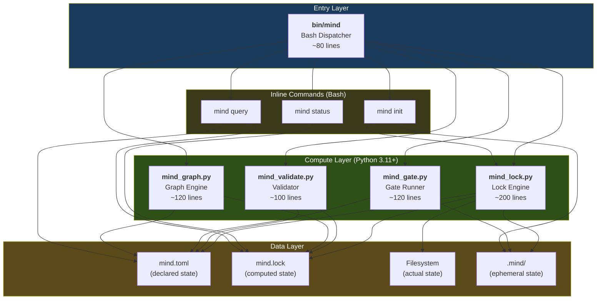
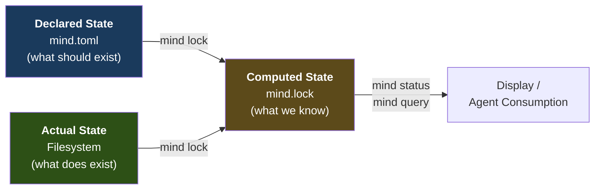
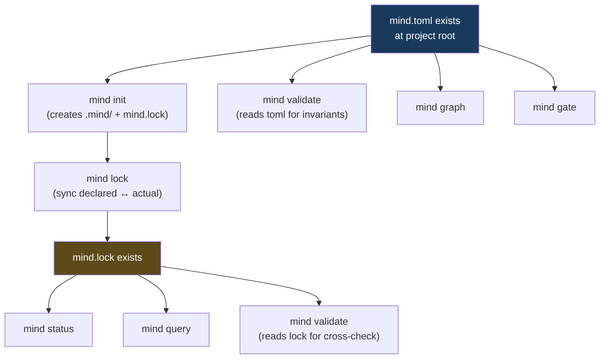

# Phase 1 MVP Blueprint — Architecture & Data Contracts

> **Purpose**: Defines the MVP's component architecture, data schemas (mind.toml, mind.lock, JSON outputs), the CLI contract (commands, flags, exit codes), and the file/directory structures for both the framework installation and target projects.
>
> **Status**: Blueprint — execution guide for Phase 1
> **Date**: 2026-02-25
> **Series**: MVP Blueprint 2 of 4
> **Upstream**: `MIND-FRAMEWORK.md` (canonical spec), `mvp-blueprint-scope-and-requirements.md` (scope)

---

## Table of Contents

1. [Architecture Blueprint](#1-architecture-blueprint)
2. [Data Contract: `mind.toml` Manifest](#2-data-contract-mindtoml-manifest)
3. [Data Contract: `mind.lock` Lock File](#3-data-contract-mindlock-lock-file)
4. [Data Contract: CLI JSON Output Schemas](#4-data-contract-cli-json-output-schemas)
5. [CLI Contract](#5-cli-contract)
6. [File & Directory Structure](#6-file--directory-structure)

---

## 1. Architecture Blueprint

### 1.1 Component Architecture



### 1.2 Design Principles

| Principle | Implication for MVP |
|-----------|-------------------|
| **CLI is a state management engine** | Never makes decisions about what to do next. Computes state, reports state, executes commanded operations. |
| **Agents are the decision engine** | Agents read CLI JSON output and decide workflow progression. CLI doesn't know about agent chains. |
| **Filesystem is the API** | No database, no daemon, no IPC. Everything is files: TOML, JSON, markdown. |
| **stdout = output, stderr = diagnostics** | Agents capture stdout; humans read stderr for context. Never mix. |
| **Committed vs. ephemeral** | `mind.toml` + `mind.lock` → git. `.mind/` → local, disposable, `.gitignore`d. |

### 1.3 Responsibility Boundaries

| Concern | Owner | NOT Owned By |
|---------|-------|-------------|
| Parsing `mind.toml` | `mind_lock.py`, `mind_validate.py`, `mind_gate.py`, `mind_graph.py` | Bash dispatcher |
| Reading `mind.lock` (JSON) | Bash (via `jq` or Python fallback) | — |
| Writing `mind.lock` | `mind_lock.py` (exclusively) | No other module writes lock |
| Running subprocesses (gates) | `mind_gate.py` | Lock engine never spawns subprocesses |
| Filesystem scanning + hashing | `mind_lock.py` | Other modules read lock results |
| Graph construction | `mind_graph.py` (primary), `mind_lock.py` (for staleness propagation) | Gate runner has no graph awareness |
| CLI argument parsing | `bin/mind` + each Python module's `if __name__ == "__main__"` | No shared argument parsing library |

### 1.4 Data Flow: Three States

The entire system computes the relationship between three states:



- **Declared state** (`mind.toml`): Human-authored TOML describing what the project should contain.
- **Actual state** (filesystem): What files actually exist, their sizes, hashes, and modification times.
- **Computed state** (`mind.lock`): The reconciliation of declared vs. actual, with staleness, completeness, and warnings.

### 1.5 Module Interaction Matrix

| Source Module | Calls / Reads | Target |
|:---:|:---:|:---:|
| `bin/mind` | invokes | All Python modules, inline bash functions |
| `mind_lock.py` | reads | `mind.toml`, filesystem, previous `mind.lock` |
| `mind_lock.py` | writes | `mind.lock`, `.mind/cache/hashes.json`, `.mind/logs/audit.jsonl` |
| `mind_lock.py` | uses | Internal graph traversal (staleness propagation) |
| `mind_validate.py` | reads | `mind.toml`, `mind.lock` |
| `mind_gate.py` | reads | `mind.toml` (`[project.commands]`) |
| `mind_gate.py` | writes | `.mind/outputs/{gate}/`, `.mind/logs/audit.jsonl` |
| `mind_gate.py` | spawns | Subprocess per gate command |
| `mind_graph.py` | reads | `mind.toml` (`[[graph]]`, `[documents.*]`), optionally `mind.lock` |
| `mind status` (bash) | reads | `mind.lock` |
| `mind query` (bash) | reads | `mind.lock`, optionally `mind.toml` |

---

## 2. Data Contract: `mind.toml` Manifest

### 2.1 Canonical Schema

The MVP reads but never writes `mind.toml`. The schema below defines which fields the MVP must parse and which it ignores.

#### Section: `[manifest]` — Required

```toml
[manifest]
schema     = "mind/v2.0"   # Required. String. Exact version.
generation = 1              # Required. Integer ≥ 1. Bumped by agents, not CLI.
```

| Field | Type | Required | MVP Reads | Validation |
|-------|------|:--------:|:---------:|------------|
| `schema` | String | Yes | Yes | Must equal `"mind/v2.0"` |
| `generation` | Integer | Yes | Yes | Must be ≥ 1 |

#### Section: `[manifest.invariants]` — Optional

```toml
[manifest.invariants]
every-document-has-owner       = true
every-iteration-has-validation = true
no-orphan-dependencies         = true
no-circular-dependencies       = true
```

| Field | Type | Required | MVP Reads | Used By |
|-------|------|:--------:|:---------:|---------|
| `every-document-has-owner` | Boolean | No | Yes | `mind validate` |
| `every-iteration-has-validation` | Boolean | No | Yes | `mind validate` |
| `no-orphan-dependencies` | Boolean | No | Yes | `mind validate` |
| `no-circular-dependencies` | Boolean | No | Yes | `mind validate` |

#### Section: `[project]` — Required

```toml
[project]
name        = "inventory-api"           # Required. String. Project identifier.
description = "Warehouse inventory..."  # Optional. String.
domain      = "logistics"               # Optional. String.
type        = "backend"                 # Optional. Enum: backend, frontend, fullstack, library, data-pipeline, cli.
```

| Field | Type | Required | MVP Reads | Validation |
|-------|------|:--------:|:---------:|------------|
| `name` | String | Yes | Yes | Non-empty |
| `description` | String | No | Yes | — |
| `domain` | String | No | No | — |
| `type` | String | No | Yes | Informational; no enum enforcement in MVP |

#### Section: `[project.stack]` — Optional

```toml
[project.stack]
language  = "python@3.12"
framework = "fastapi"
runtime   = "uvicorn"
database  = "postgresql@16"
orm       = "sqlalchemy@2"
```

| Field | Type | Required | MVP Reads | Validation |
|-------|------|:--------:|:---------:|------------|
| `language` | String | No | Yes | Informational |
| `framework` | String | No | Yes | Informational |
| All others | String | No | No | Ignored in MVP |

#### Section: `[project.commands]` — Optional (Required for `mind gate`)

```toml
[project.commands]
build     = "python -m build"
lint      = "ruff check src/"
typecheck = "mypy src/"
test      = "pytest -v --tb=short"
```

| Field | Type | Required | MVP Reads | Used By |
|-------|------|:--------:|:---------:|---------|
| `build` | String | No | Yes | `mind gate build` / `mind gate all` |
| `lint` | String | No | Yes | `mind gate lint` / `mind gate all` |
| `typecheck` | String | No | Yes | `mind gate typecheck` / `mind gate all` |
| `test` | String | No | Yes | `mind gate test` / `mind gate all` |

Custom gate names are allowed. Any key under `[project.commands]` becomes a valid gate target.

#### Section: `[profiles]` — Optional (MVP: Read-Only)

```toml
[profiles]
active = ["backend-api"]
```

| Field | Type | Required | MVP Reads | Used By |
|-------|------|:--------:|:---------:|---------|
| `active` | Array of Strings | No | Yes | `mind status` (display only) |

#### Section: `[framework]` — Optional (MVP: Ignored)

```toml
[framework.orchestration]
session-split = "new-project"
specialist-threshold = 2

[framework.quality-gates]
micro-gate-a = true
micro-gate-b = true
deterministic = true
```

The `[framework]` section is consumed by agents, not the CLI. The MVP ignores it during parsing (no validation).

#### Section: `[agents.*]` — Optional (MVP: Read-Only)

```toml
[agents.orchestrator]
id       = "agent:orchestrator"
path     = ".claude/agents/orchestrator.md"
role     = "supervisor"
loads    = ["doc:state/workflow", "doc:state/current"]
produces = ["doc:state/workflow"]

[agents.analyst]
id       = "agent:analyst"
path     = ".claude/agents/analyst.md"
role     = "requirements"
loads    = ["doc:spec/project-brief", "doc:spec/requirements"]
produces = ["doc:spec/requirements", "doc:spec/domain-model"]
triggers = ["database", "sql", "data model"]
```

| Field | Type | Required | MVP Reads | Used By |
|-------|------|:--------:|:---------:|---------|
| `id` | String (URI) | Per entry | Yes | `mind status` (display) |
| `path` | String (path) | Per entry | Yes | `mind validate` (file existence) |
| `role` | String | Per entry | No | — |
| `loads` | Array of Strings | No | No | Agent-consumed |
| `produces` | Array of Strings | No | No | Agent-consumed |
| `triggers` | Array of Strings | No | No | Agent-consumed |

#### Section: `[workflows.*]` — Optional (MVP: Ignored)

```toml
[workflows.new-project]
chain             = ["analyst", "architect", "developer", "tester", "reviewer"]
session-split-after = "architect"
gates             = ["micro-a", "micro-b", "deterministic"]
```

The `[workflows]` section is consumed by agents. The MVP ignores it.

#### Section: `[documents.{zone}.{name}]` — Optional (Core for `mind lock`)

```toml
[documents.spec.project-brief]
id          = "doc:spec/project-brief"
path        = "docs/spec/project-brief.md"
zone        = "spec"
status      = "approved"
owner       = "agent:analyst"
depends-on  = []
consumed-by = ["agent:analyst", "agent:architect"]
tags        = ["foundation"]

[documents.spec.requirements]
id          = "doc:spec/requirements"
path        = "docs/spec/requirements.md"
zone        = "spec"
status      = "approved"
owner       = "agent:analyst"
depends-on  = ["doc:spec/project-brief"]
consumed-by = ["agent:architect", "agent:developer"]
tags        = ["requirements"]
```

| Field | Type | Required | MVP Reads | Used By |
|-------|------|:--------:|:---------:|---------|
| `id` | String (URI) | Yes | Yes | Lock file key, graph endpoint |
| `path` | String (relative) | Yes | Yes | Filesystem scanning |
| `zone` | String | Yes | Yes | `mind query --zone`, `mind status` |
| `status` | String | No | Yes | `mind status` display |
| `owner` | String | No | Yes | `mind validate` (invariant) |
| `depends-on` | Array of Strings | No | Yes | Staleness propagation |
| `consumed-by` | Array of Strings | No | No | Agent-consumed |
| `tags` | Array of Strings | No | No | Future filtering |

**Iteration documents** use the same schema with additional fields:

```toml
[documents.iterations.003-enhancement-dashboard]
id         = "doc:iteration/003"
path       = "docs/iterations/003-enhancement-dashboard/"
zone       = "iteration"
status     = "active"
type       = "enhancement"
branch     = "feature/dashboard"
implements = ["doc:spec/requirements#FR-3"]
created    = 2026-02-24
artifacts  = ["overview.md", "changes.md"]
```

| Extra Field | Type | Required | MVP Reads | Used By |
|-------------|------|:--------:|:---------:|---------|
| `type` | String | No | Yes | Classification (display) |
| `branch` | String | No | No | Agent-consumed (git) |
| `implements` | Array of Strings | No | Yes | Completeness computation |
| `created` | Date | No | Yes | Display |
| `artifacts` | Array of Strings | No | Yes | Existence check in lock |

#### Section: `[[graph]]` — Optional (Core for Staleness)

```toml
[[graph]]
from = "doc:spec/project-brief"
to   = "doc:spec/requirements"
type = "informs"

[[graph]]
from = "doc:spec/requirements"
to   = "doc:spec/architecture"
type = "informs"

[[graph]]
from = "doc:iteration/003"
to   = "doc:spec/requirements#FR-3"
type = "implements"
```

| Field | Type | Required | MVP Reads | Validation |
|-------|------|:--------:|:---------:|------------|
| `from` | String (URI) | Yes | Yes | Should reference a declared document (warn if not) |
| `to` | String (URI) | Yes | Yes | Should reference a declared document (warn if not) |
| `type` | String | Yes | Yes | One of: `informs`, `implements`, `requires`, `validates`, `references` |

**Edge types and staleness propagation**:

| Edge Type | Semantic | Propagates Staleness |
|-----------|----------|:---:|
| `informs` | Source provides context for target | Yes |
| `implements` | Target implements requirements from source | Yes |
| `requires` | Target requires source to be current | Yes |
| `validates` | Target validates claims in source | No |
| `references` | Target references source (informational) | No |

#### Section: `[governance]` — Optional (MVP: Partial Read)

```toml
[governance]
max-retries     = 2
review-policy   = "evidence-based"
commit-policy   = "conventional"
branch-strategy = "type-prefix"

[[governance.decisions]]
id       = "ADR-001"
title    = "FastAPI over Django"
status   = "accepted"
date     = 2026-02-20
document = "docs/spec/decisions/001-fastapi.md"
```

| Field | Type | Required | MVP Reads | Used By |
|-------|------|:--------:|:---------:|---------|
| `max-retries` | Integer | No | No | Agent-consumed |
| `review-policy` | String | No | No | Agent-consumed |
| `commit-policy` | String | No | No | Agent-consumed |
| `branch-strategy` | String | No | No | Agent-consumed |
| `decisions` | Array of Tables | No | Yes | `mind validate` (document existence), `mind status` (count) |

#### Section: `[[generations]]` — Optional (MVP: Display Only)

```toml
[[generations]]
number = 5
date   = 2026-02-24
event  = "iteration-start"
detail = "004-enhancement-barcode created"
```

| Field | Type | Required | MVP Reads | Used By |
|-------|------|:--------:|:---------:|---------|
| `number` | Integer | Per entry | Yes | Display (latest generation) |
| `date` | Date | Per entry | Yes | Display |
| `event` | String | Per entry | No | — |
| `detail` | String | Per entry | No | — |

### 2.2 Manifest Parsing Rules

1. **Strict TOML**: Use `tomllib` (Python 3.11+). No preprocessing, no custom extensions.
2. **Unknown sections are ignored**: The MVP silently skips sections it doesn't understand. This enables forward compatibility.
3. **Missing optional sections default to empty**: `documents = {}`, `graph = []`, etc.
4. **Path resolution**: All `path` values are relative to the project root. Absolute paths generate a warning.
5. **URI uniqueness**: No two documents may share the same `id`. Duplicates → validation error.

---

## 3. Data Contract: `mind.lock` Lock File

### 3.1 Overview

The lock file is the **computed reconciliation** of declared state (mind.toml) and actual filesystem state. It is:

- **Generated**: By `mind lock` (never hand-edited).
- **Committed**: To git (enables CI validation, team synchronization).
- **Format**: JSON, 2-space indent, sorted keys (for stable diffs).
- **Read by**: `mind status`, `mind query`, `mind validate`, `mind graph` (for stale annotations).

### 3.2 Complete Schema

```json
{
  "lockVersion": "1",
  "generatedAt": "2026-02-25T14:30:00Z",
  "generation": 5,
  "manifestHash": "a3f2...9c1d",
  "resolved": {
    "doc:spec/project-brief": {
      "path": "docs/spec/project-brief.md",
      "zone": "spec",
      "exists": true,
      "hash": "e3b0c44298fc1c149afbf4c8996fb92427ae41e4649b934ca495991b7852b855",
      "size": 1847,
      "lastModified": "2026-02-20T10:00:00Z",
      "stale": false,
      "upstreamHashes": {}
    },
    "doc:spec/requirements": {
      "path": "docs/spec/requirements.md",
      "zone": "spec",
      "exists": true,
      "hash": "d7a8fbb307d7809469ca9abcb0082e4f8d5651e46d3cdb762d02d0bf37c9e592",
      "size": 3256,
      "lastModified": "2026-02-24T09:30:00Z",
      "stale": false,
      "upstreamHashes": {
        "doc:spec/project-brief": "e3b0c44298fc1c149afbf4c8996fb92427ae41e4649b934ca495991b7852b855"
      }
    },
    "doc:spec/architecture": {
      "path": "docs/spec/architecture.md",
      "zone": "spec",
      "exists": true,
      "hash": "5e884898da28047151d0e56f8dc6292773603d0d6aabbdd62a11ef721d1542d8",
      "size": 2891,
      "lastModified": "2026-02-22T14:00:00Z",
      "stale": true,
      "upstreamHashes": {
        "doc:spec/requirements": "abc123...previous_hash"
      }
    },
    "doc:spec/api-contracts": {
      "path": "docs/spec/api-contracts.md",
      "zone": "spec",
      "exists": false,
      "hash": null,
      "size": null,
      "lastModified": null,
      "stale": true,
      "upstreamHashes": {}
    }
  },
  "warnings": [
    "doc:spec/architecture is stale: upstream doc:spec/requirements changed (hash mismatch)",
    "doc:spec/api-contracts: declared but missing on disk"
  ],
  "completeness": {
    "requirements": 0.5,
    "iterations": {
      "active": 1,
      "completed": 2
    }
  }
}
```

### 3.3 Field Reference

#### Top-Level Fields

| Field | Type | Description | Computed By |
|-------|------|-------------|-------------|
| `lockVersion` | String | Lock file format version. Always `"1"` for MVP. | Hardcoded |
| `generatedAt` | String (ISO 8601 UTC) | Timestamp of lock generation | `datetime.utcnow()` |
| `generation` | Integer | Copied from `manifest.generation` | Read from `mind.toml` |
| `manifestHash` | String (SHA-256 hex) | Hash of `mind.toml` itself | SHA-256 of the manifest file |
| `resolved` | Object (URI → Entry) | Per-artifact reconciliation | Lock engine |
| `warnings` | Array of Strings | Human-readable issue descriptions | Lock engine |
| `completeness` | Object | Project progress metrics | Lock engine |

#### Per-Artifact Entry (`resolved[uri]`)

| Field | Type | When Null | Description |
|-------|------|-----------|-------------|
| `path` | String | Never | Declared path (from `mind.toml`) |
| `zone` | String | Never | Document zone: `spec`, `state`, `iteration`, `knowledge` |
| `exists` | Boolean | Never | Whether the file exists on disk |
| `hash` | String \| null | `exists: false` | SHA-256 hex digest of file contents |
| `size` | Integer \| null | `exists: false` | File size in bytes |
| `lastModified` | String \| null | `exists: false` | File mtime as ISO 8601 UTC |
| `stale` | Boolean | Never | Whether this artifact needs attention |
| `upstreamHashes` | Object (URI → hash) | Never (empty `{}` if no upstreams) | Hash of each upstream dependency at lock time |

#### Staleness Rules

An artifact is `stale: true` when any of these conditions hold:

| Condition | Trigger |
|-----------|---------|
| **Missing** | `exists: false` (declared but not on disk) |
| **Self-changed** | Hash differs from previous lock (content modified) |
| **Upstream changed** | An upstream dependency's current hash differs from the `upstreamHashes` snapshot |
| **Propagated** | A transitive upstream is stale (via `informs`, `implements`, `requires` edges) |

#### Completeness Object

```json
{
  "requirements": 0.5,
  "iterations": {
    "active": 1,
    "completed": 2
  }
}
```

| Field | Type | Computation |
|-------|------|-------------|
| `requirements` | Float (0.0–1.0) | `count(completed iterations with implements) / count(unique requirements referenced)` |
| `iterations.active` | Integer | Count of `documents.iterations.*` where `status = "active"` |
| `iterations.completed` | Integer | Count of `documents.iterations.*` where `status = "completed"` or `"done"` |

**Simplification note**: In MVP, requirement counting is best-effort. The denominator is the number of unique `implements` targets across all iterations. This may undercount requirements that have no iteration yet. Phase 2 will add explicit requirement enumeration.

### 3.4 Lock File Diff Friendliness

To produce stable diffs when committed to git:

1. **Sorted keys**: `json.dumps(lock, sort_keys=True, indent=2)`
2. **Deterministic timestamps**: Truncated to seconds (no microseconds)
3. **Sorted `resolved` entries**: By URI alphabetical order
4. **Sorted `upstreamHashes` entries**: By URI alphabetical order
5. **Sorted `warnings`**: Alphabetical

---

## 4. Data Contract: CLI JSON Output Schemas

### 4.1 `mind lock --json` — Lock Sync Result

Emitted to stdout after a successful lock sync.

```json
{
  "changed": 1,
  "unchanged": 3,
  "stale": 2,
  "missing": 1,
  "total": 5,
  "warnings": [
    "doc:spec/architecture is stale: upstream doc:spec/requirements changed"
  ],
  "completeness": {
    "requirements": 0.5,
    "iterations": { "active": 1, "completed": 2 }
  }
}
```

| Field | Type | Description |
|-------|------|-------------|
| `changed` | Integer | Artifacts whose hash changed since last lock |
| `unchanged` | Integer | Artifacts with identical hash |
| `stale` | Integer | Total stale artifacts (changed + propagated + missing) |
| `missing` | Integer | Declared but not on disk |
| `total` | Integer | Total declared artifacts |
| `warnings` | Array of Strings | Same as lock file warnings |
| `completeness` | Object | Same as lock file completeness |

### 4.2 `mind status --json` — Project Status

```json
{
  "project": "inventory-api",
  "generation": 5,
  "schema": "mind/v2.0",
  "profiles": ["backend-api"],
  "artifacts": [
    {
      "uri": "doc:spec/project-brief",
      "path": "docs/spec/project-brief.md",
      "zone": "spec",
      "status": "current",
      "size": 1847,
      "lastModified": "2026-02-20T10:00:00Z"
    },
    {
      "uri": "doc:spec/architecture",
      "path": "docs/spec/architecture.md",
      "zone": "spec",
      "status": "stale",
      "size": 2891,
      "lastModified": "2026-02-22T14:00:00Z",
      "staleReason": "upstream doc:spec/requirements changed"
    },
    {
      "uri": "doc:spec/api-contracts",
      "path": "docs/spec/api-contracts.md",
      "zone": "spec",
      "status": "missing"
    }
  ],
  "iterations": [
    {
      "uri": "doc:iteration/003",
      "name": "003-enhancement-dashboard",
      "status": "active",
      "type": "enhancement",
      "implements": ["doc:spec/requirements#FR-3"]
    }
  ],
  "completeness": {
    "requirements": 0.5,
    "iterations": { "active": 1, "completed": 2 }
  },
  "warnings": [
    "doc:spec/architecture is stale: upstream doc:spec/requirements changed",
    "doc:spec/api-contracts: declared but missing on disk"
  ]
}
```

| Field | Type | Description |
|-------|------|-------------|
| `project` | String | From `project.name` |
| `generation` | Integer | From `manifest.generation` |
| `schema` | String | From `manifest.schema` |
| `profiles` | Array of Strings | From `profiles.active` (empty if not set) |
| `artifacts` | Array | Non-iteration documents with display status |
| `artifacts[].status` | String | One of: `"current"`, `"stale"`, `"missing"` |
| `artifacts[].staleReason` | String \| absent | Only present when `status = "stale"` |
| `iterations` | Array | Iteration documents grouped separately |
| `completeness` | Object | Same structure as lock file |
| `warnings` | Array of Strings | Same as lock file |

### 4.3 `mind gate --json` — Gate Execution Result

#### Single Gate

```json
{
  "gate": "test",
  "status": "PASS",
  "duration": "8.4s",
  "command": "pytest -v --tb=short",
  "exitCode": 0,
  "logFile": ".mind/outputs/test/2026-02-25T14-30-00Z.log"
}
```

#### All Gates

```json
{
  "gates": [
    {
      "gate": "build",
      "status": "PASS",
      "duration": "12.1s",
      "command": "python -m build",
      "exitCode": 0,
      "logFile": ".mind/outputs/build/2026-02-25T14-30-00Z.log"
    },
    {
      "gate": "lint",
      "status": "FAIL",
      "duration": "1.1s",
      "command": "ruff check src/",
      "exitCode": 1,
      "logFile": ".mind/outputs/lint/2026-02-25T14-30-01Z.log"
    }
  ],
  "overallStatus": "FAIL",
  "totalDuration": "13.2s",
  "failedGate": "lint"
}
```

| Field | Type | Description |
|-------|------|-------------|
| `gates` | Array | Per-gate results in execution order |
| `gates[].gate` | String | Gate name |
| `gates[].status` | String | `"PASS"`, `"FAIL"`, `"TIMEOUT"`, `"SKIP"` |
| `gates[].duration` | String | Human-readable duration (e.g., `"8.4s"`) |
| `gates[].command` | String | The shell command that was executed |
| `gates[].exitCode` | Integer | Process exit code |
| `gates[].logFile` | String | Path to captured output |
| `overallStatus` | String | `"PASS"` only if all gates pass |
| `totalDuration` | String | Sum of all gate durations |
| `failedGate` | String \| null | Name of first failed gate (null if all passed) |

### 4.4 `mind validate --json` — Validation Result

```json
{
  "valid": false,
  "errors": [
    {
      "code": "ORPHAN_DEPENDENCY",
      "message": "doc:spec/requirements depends on 'doc:spec/nonexistent' which is not registered",
      "location": "documents.spec.requirements.depends-on"
    }
  ],
  "warnings": [
    {
      "code": "ABSOLUTE_PATH",
      "message": "doc:spec/project-brief uses absolute path '/home/user/docs/spec/brief.md'",
      "location": "documents.spec.project-brief.path"
    }
  ],
  "invariants": {
    "every-document-has-owner": { "status": "PASS" },
    "no-orphan-dependencies": { "status": "FAIL", "violations": ["doc:spec/requirements"] },
    "no-circular-dependencies": { "status": "PASS" },
    "every-iteration-has-validation": { "status": "SKIP", "reason": "no completed iterations" }
  }
}
```

| Field | Type | Description |
|-------|------|-------------|
| `valid` | Boolean | `true` if zero errors |
| `errors` | Array | Blocking issues |
| `errors[].code` | String | Machine-readable error code |
| `errors[].message` | String | Human-readable description |
| `errors[].location` | String | Dotted path in `mind.toml` |
| `warnings` | Array | Non-blocking issues (same structure as errors) |
| `invariants` | Object | Per-invariant results |
| `invariants[].status` | String | `"PASS"`, `"FAIL"`, `"SKIP"` |
| `invariants[].violations` | Array | Only present on FAIL |
| `invariants[].reason` | String | Only present on SKIP |

### 4.5 `mind query --json` — Query Result

```json
{
  "query": "requirements",
  "matchCount": 2,
  "matches": [
    {
      "uri": "doc:spec/requirements",
      "path": "docs/spec/requirements.md",
      "zone": "spec",
      "exists": true,
      "stale": false,
      "size": 3256,
      "lastModified": "2026-02-24T09:30:00Z"
    },
    {
      "uri": "doc:iteration/003",
      "path": "docs/iterations/003-enhancement-dashboard/",
      "zone": "iteration",
      "exists": true,
      "stale": false,
      "implements": ["doc:spec/requirements#FR-3"]
    }
  ]
}
```

### 4.6 Error Response (All Commands)

When a command fails (exit code ≠ 0) with `--json`, stderr contains:

```json
{
  "error": true,
  "code": "MANIFEST_PARSE_ERROR",
  "message": "Failed to parse mind.toml: Expected '=' after key at line 15",
  "exitCode": 3
}
```

**Error codes**:

| Code | Exit | Trigger |
|------|:----:|---------|
| `MANIFEST_PARSE_ERROR` | 3 | TOML syntax error in `mind.toml` |
| `MANIFEST_NOT_FOUND` | 3 | No `mind.toml` at project root |
| `LOCK_NOT_FOUND` | 4 | No `mind.lock` (suggest `mind init`) |
| `LOCK_PARSE_ERROR` | 1 | Malformed `mind.lock` JSON |
| `LOCK_OUT_OF_SYNC` | 4 | `mind lock --verify` detects drift |
| `INVALID_ARGUMENTS` | 2 | Unknown command/flags |
| `GATE_NOT_FOUND` | 2 | `mind gate <name>` for undefined gate |
| `INTERNAL_ERROR` | 1 | Unexpected Python exception |

---

## 5. CLI Contract

### 5.1 Command Reference

| Command | Flags | Exit Codes | stdout | stderr |
|---------|-------|:----------:|--------|--------|
| `mind` (no args) | — | 0, 4 | Status dashboard | — |
| `mind init` | — | 0, 1 | "Initialized .mind/" | Warnings |
| `mind lock` | `--json`, `--full`, `--verify` | 0, 1, 3, 4 | Sync summary / verification result | Diagnostics |
| `mind status` | `--json` | 0, 4 | Dashboard / JSON | — |
| `mind query <term>` | `--json`, `--stale`, `--zone=Z`, `--missing` | 0, 4 | Matching artifacts | — |
| `mind validate` | `--json` | 0, 1, 3 | Validation report | — |
| `mind graph` | `--format mermaid\|text`, `--upstream URI`, `--downstream URI` | 0, 3 | Graph visualization | — |
| `mind gate <name\|all>` | `--json` | 0, 1, 2, 3 | Gate results | Gate command stderr |
| `mind --help` | — | 0 | Usage text | — |
| `mind <cmd> --help` | — | 0 | Command-specific usage | — |

### 5.2 Exit Code Semantics

| Code | Meaning | Agent Action |
|:----:|---------|-------------|
| 0 | Success | Proceed |
| 1 | Operational failure | Read stderr, report to user |
| 2 | Invalid arguments | Fix invocation |
| 3 | Manifest error | Report `mind.toml` issue |
| 4 | Lock out of sync / missing | Run `mind lock` or `mind init` |

### 5.3 Output Protocol

```
┌──────────────────────────────────────────────────────────┐
│                    Output Protocol                        │
├────────────┬─────────────────────────────────────────────┤
│ stdout     │ Command output: human-readable OR JSON       │
│ stderr     │ Diagnostics, progress info, warnings         │
│ --json     │ Switch stdout from human to JSON format      │
│ No mixing  │ A single invocation never produces both      │
│            │ human and JSON on stdout                     │
│ No color   │ JSON mode never includes ANSI escape codes   │
│ No banner  │ No version/branding text in any mode         │
│ No prompts │ Never reads stdin; fully non-interactive     │
└────────────┴─────────────────────────────────────────────┘
```

### 5.4 Stability Guarantees (MVP)

| Aspect | Stable | May Change |
|--------|:------:|:----------:|
| Command names | Yes | — |
| Exit code meanings | Yes | — |
| JSON output field names | Yes | — |
| JSON output field types | Yes | — |
| Human-readable output format | — | Yes (cosmetic) |
| Additional JSON fields | — | May be added (never removed) |
| New commands | — | May be added |
| New flags on existing commands | — | May be added |

The JSON schemas are **append-only contracts**. Fields are never renamed or removed once released. New fields may be added. Agents must ignore unknown fields.

---

## 6. File & Directory Structure

### 6.1 Framework Installation (`install.sh` output)

After `install.sh` installs the framework into a target project:

```
project-root/
├── .claude/
│   ├── CLAUDE.md                    ← Project-level framework index
│   ├── bin/
│   │   └── mind                     ← Bash dispatcher (new in v2)
│   ├── lib/
│   │   ├── mind_lock.py            ← Lock engine (new in v2)
│   │   ├── mind_validate.py        ← Manifest validator (new in v2)
│   │   ├── mind_gate.py            ← Gate runner (new in v2)
│   │   └── mind_graph.py           ← Graph engine (new in v2)
│   ├── agents/
│   │   ├── orchestrator.md
│   │   ├── analyst.md
│   │   ├── architect.md
│   │   ├── developer.md
│   │   ├── tester.md
│   │   ├── reviewer.md
│   │   └── discovery.md
│   ├── conventions/
│   │   ├── CLAUDE.md
│   │   ├── code-quality.md
│   │   ├── documentation.md
│   │   ├── git-discipline.md
│   │   ├── severity.md
│   │   └── temporal.md
│   ├── skills/
│   │   ├── CLAUDE.md
│   │   ├── debugging/SKILL.md
│   │   ├── planning/SKILL.md
│   │   ├── quality-review/SKILL.md
│   │   └── refactoring/SKILL.md
│   └── commands/
│       ├── discover.md
│       └── workflow.md
├── mind.toml                        ← Manifest (created by scaffold.sh or user)
├── mind.lock                        ← Lock file (created by mind init)
└── .mind/                           ← Runtime directory (created by mind init)
    ├── cache/
    │   ├── summaries/
    │   └── hashes.json
    ├── logs/
    │   ├── runs/
    │   ├── gates/
    │   └── audit.jsonl
    ├── outputs/
    │   ├── build/
    │   ├── lint/
    │   ├── typecheck/
    │   └── test/
    └── tmp/
```

### 6.2 Target Project Documentation Structure (4-Zone)

```
docs/
├── spec/                            ← Zone: Stable specifications
│   ├── project-brief.md            ← Project overview and goals
│   ├── requirements.md             ← Functional & non-functional requirements
│   ├── domain-model.md             ← Entity registry, business rules
│   ├── architecture.md             ← System design decisions
│   ├── api-contracts.md            ← API endpoint specifications
│   └── decisions/                   ← Architecture Decision Records
│       ├── 001-fastapi.md
│       └── 002-postgresql.md
│
├── state/                           ← Zone: Volatile workflow state
│   ├── current.md                  ← What's happening right now
│   └── workflow.md                 ← Active workflow state (for resume)
│
├── iterations/                      ← Zone: Append-only iteration history
│   ├── 001-new-barcode/
│   │   ├── overview.md
│   │   ├── changes.md
│   │   └── validation.md
│   ├── 002-enhancement-reorder/
│   │   ├── overview.md
│   │   ├── changes.md
│   │   └── validation.md
│   ├── 003-enhancement-dashboard/   ← Active iteration
│   │   └── overview.md
│   └── .archive/                    ← Archived old iterations (mind clean)
│
└── knowledge/                       ← Zone: Stable reference material
    ├── glossary.md                 ← Domain terminology
    └── runbook.md                  ← Operational procedures
```

### 6.3 Mind Framework Source Structure (What Lives in This Repo)

```
mind-framework/
├── CLAUDE.md                        ← Framework index
├── README.md                        ← Documentation
├── install.sh                       ← Framework installer
├── scaffold.sh                      ← Project structure creator
│
├── bin/
│   └── mind                         ← Bash dispatcher (NEW)
│
├── lib/
│   ├── mind_lock.py                ← Lock engine (NEW)
│   ├── mind_validate.py            ← Manifest validator (NEW)
│   ├── mind_gate.py                ← Gate runner (NEW)
│   └── mind_graph.py               ← Graph engine (NEW)
│
├── agents/                          ← 7 core agents
│   ├── orchestrator.md
│   ├── analyst.md
│   ├── architect.md
│   ├── developer.md
│   ├── tester.md
│   ├── reviewer.md
│   └── discovery.md
│
├── conventions/                     ← Quality conventions
│   ├── CLAUDE.md
│   ├── code-quality.md
│   ├── documentation.md
│   ├── git-discipline.md
│   ├── severity.md
│   └── temporal.md
│
├── skills/                          ← On-demand agent skills
│   ├── CLAUDE.md
│   └── {skill}/SKILL.md
│
├── commands/                        ← Slash commands
│   ├── discover.md
│   └── workflow.md
│
├── templates/                       ← Document templates (NEW, Phase 1.5)
│   ├── domain-model.md
│   ├── api-contract.md
│   └── iteration-overview.md
│
└── documents/                       ← Design documents (not installed)
    ├── MIND-FRAMEWORK.md
    ├── implementation-architecture.md
    ├── mvp-blueprint-*.md
    └── ...
```

### 6.4 Critical Path Dependencies



**Implication**: Commands that read `mind.lock` require `mind init` or `mind lock` to have run first. Commands that only read `mind.toml` (validate, graph, gate) work without a lock file.

---

*Previous: [MVP Blueprint — Scope & Requirements](mvp-blueprint-scope-and-requirements.md)*
*Next: [MVP Blueprint — Scripts & Integration](mvp-blueprint-scripts-and-integration.md)*
