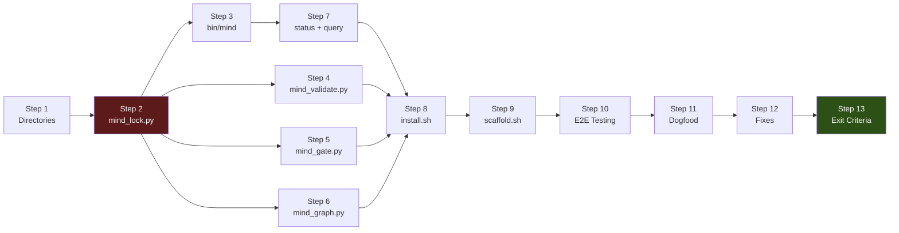

# Phase 1 MVP Blueprint — Delivery & Governance

> **Purpose**: Defines the execution sequence for building the MVP, naming/documentation/commit conventions, the risk register with mitigations, and the measurable exit criteria that determine when Phase 1 is complete.
>
> **Status**: Blueprint — execution guide for Phase 1
> **Date**: 2026-02-25
> **Series**: MVP Blueprint 4 of 4
> **Upstream**: `mvp-blueprint-scope-and-requirements.md`, `mvp-blueprint-architecture-and-schemas.md`, `mvp-blueprint-scripts-and-integration.md`

---

## Table of Contents

1. [Governance & Conventions](#1-governance--conventions)
2. [Delivery Plan & Execution Sequence](#2-delivery-plan--execution-sequence)
3. [Risks, Gaps & Trade-offs](#3-risks-gaps--trade-offs)
4. [Phase 1 Exit Criteria](#4-phase-1-exit-criteria)

---

## 1. Governance & Conventions

### 1.1 Naming Conventions

#### Files

| Type | Convention | Examples |
|------|-----------|---------|
| Python modules | `snake_case.py` | `mind_lock.py`, `mind_validate.py` |
| Bash scripts | `snake_case` (no extension) | `mind` |
| TOML config | `mind.toml` (fixed name) | — |
| Lock file | `mind.lock` (fixed name) | — |
| Log files | `{ISO-timestamp}.{ext}` | `2026-02-25T14-30-00Z.jsonl` |
| Gate output files | `{ISO-timestamp}.log` | `2026-02-25T14-30-00Z.log` |
| Blueprint docs | `mvp-blueprint-{topic}.md` | `mvp-blueprint-scope-and-requirements.md` |

#### Variables & Functions

| Language | Convention | Examples |
|----------|-----------|---------|
| Python functions | `snake_case` | `parse_manifest()`, `compute_staleness()` |
| Python classes/dataclasses | `PascalCase` | `DocumentInfo`, `ResolvedEntry`, `SyncResult` |
| Python constants | `UPPER_SNAKE_CASE` | `DEFAULT_GATE_TIMEOUT`, `LOCK_VERSION` |
| Bash variables | `UPPER_SNAKE_CASE` | `MIND_ROOT`, `LIB_DIR` |
| Bash functions | `_mind_snake_case` | `_mind_init`, `_mind_status` |

#### URIs

| Type | Pattern | Examples |
|------|---------|---------|
| Document | `doc:{zone}/{name}` | `doc:spec/requirements`, `doc:iteration/003` |
| Agent | `agent:{name}` | `agent:orchestrator`, `agent:analyst` |
| Gate | `gate:{name}` | `gate:build`, `gate:test` |
| Workflow | `workflow:{type}` | `workflow:new-project`, `workflow:bug-fix` |
| Fragment ref | `{uri}#{ref}` | `doc:spec/requirements#FR-3` |

### 1.2 Documentation Rules

| Rule | Specification |
|------|--------------|
| **Docstrings** | Every Python module, class, and public function gets a docstring (Google style) |
| **Module header** | Each `.py` file starts with `"""Module purpose in one line."""` |
| **Type hints** | All function signatures include type hints (Python 3.11+ syntax) |
| **Inline comments** | Only for non-obvious logic. No commenting obvious code. |
| **README** | `bin/` and `lib/` each get a 10-line README explaining the module |
| **Error messages** | Must be actionable: state what's wrong + how to fix it |

#### Error Message Pattern

```
"Error: {what happened}. {how to fix}."
```

Examples:
- `"Error: No mind.toml found at /path/to/project. Create one or run: scaffold.sh"`
- `"Error: Failed to parse mind.toml at line 15: expected '=' after key. Fix the TOML syntax."`
- `"Error: Python 3.11+ required (for tomllib support). Current: 3.9. Upgrade Python."`

### 1.3 Commit Discipline

#### Branch Strategy

| Branch | Purpose | Pattern |
|--------|---------|---------|
| `main` | Production-ready framework | Protected |
| `feature/mind-cli-mvp` | All Phase 1 work | Single feature branch |
| (Optional sub-branches) | If needed for parallel work | `feature/mind-cli-mvp/{component}` |

#### Commit Message Format

Conventional commits: `{type}({scope}): {description}`

| Type | When |
|------|------|
| `feat` | New functionality |
| `fix` | Bug fix |
| `docs` | Documentation only |
| `refactor` | Code restructure without behavior change |
| `test` | Test additions/changes |
| `chore` | Build/tooling/config changes |

**Scope values for Phase 1**:

| Scope | Covers |
|-------|--------|
| `cli` | `bin/mind` dispatcher |
| `lock` | `lib/mind_lock.py` |
| `validate` | `lib/mind_validate.py` |
| `gate` | `lib/mind_gate.py` |
| `graph` | `lib/mind_graph.py` |
| `install` | `install.sh` changes |
| `scaffold` | `scaffold.sh` changes |
| `blueprint` | Blueprint documentation |

**Examples**:
- `feat(cli): add bash dispatcher with command routing`
- `feat(lock): implement manifest parsing and hash computation`
- `feat(gate): add deterministic gate runner with output capture`
- `fix(lock): handle missing files gracefully in staleness propagation`
- `docs(blueprint): add Phase 1 MVP blueprint documents`
- `chore(install): add bin/ and lib/ to installation`

#### Commit Cadence

| Milestone | Commit |
|-----------|--------|
| Each script file completed and manually tested | One commit per file |
| Integration between scripts working | Integration commit |
| `install.sh` / `scaffold.sh` updated | Separate commit per script |
| Blueprint documents created | One commit for all 4 docs |

### 1.4 Intent Markers

Use intent markers in code to prevent false-positive review findings:

| Marker | Meaning | Example |
|--------|---------|---------|
| `:TEMP:` | Temporary implementation to be replaced | `# :TEMP: Sequential hashing; will parallelize in Rust` |
| `:PERF:` | Known performance trade-off | `# :PERF: Full hash on every run; mtime cache in Phase 2` |
| `:SCHEMA:` | Schema-sensitive code | `# :SCHEMA: Lock file v1 format — changes require migration` |

### 1.5 Quality Rules

| Rule | Enforcement |
|------|------------|
| No `print()` to stdout from library code | All output through dedicated format functions |
| stderr for diagnostics only | Libraries write to stderr; only the entry point writes to stdout |
| Exit codes are explicit | `sys.exit(N)` with documented code; never fall-through |
| No bare `except:` | Always catch specific exceptions |
| No hardcoded paths | All paths derived from project root argument |
| No global mutable state | Functions receive parameters; no module-level variables mutated at runtime |

---

## 2. Delivery Plan & Execution Sequence

### 2.1 Execution Overview

```mermaid
gantt
    title Phase 1 MVP — Execution Sequence
    dateFormat  X
    axisFormat  Step %s

    section Foundation
    Create bin/ and lib/ directories           :s1, 0, 1
    Implement mind_lock.py (core engine)       :s2, 1, 4
    Implement bin/mind dispatcher              :s3, 4, 2

    section Modules
    Implement mind_validate.py                 :s4, 6, 2
    Implement mind_gate.py                     :s5, 6, 2
    Implement mind_graph.py                    :s6, 8, 2

    section Integration
    Wire mind status and query (bash)          :s7, 10, 1
    Update install.sh                          :s8, 11, 1
    Update scaffold.sh                         :s9, 12, 1

    section Validation
    End-to-end testing on test project         :s10, 13, 2
    Dogfood on a real project                  :s11, 15, 2
    Fix issues from dogfooding                 :s12, 17, 1

    section Finalize
    Exit criteria checklist                    :s13, 18, 1
```



### 2.2 Step-by-Step Execution

#### Step 1: Foundation — Directory Structure

**Prerequisites**: None.
**Deliverables**: `bin/`, `lib/` directories in framework.
**Validation**: Directories exist.

```bash
mkdir -p bin lib
```

---

#### Step 2: Core — `lib/mind_lock.py`

**Prerequisites**: Step 1.
**Deliverables**: Working lock engine.
**Estimated effort**: ~200 lines, 2-3 hours.

**Build order** (incremental, test after each):

1. **Manifest reader** (~40 lines): Parse `mind.toml` with `tomllib`, extract documents and graph edges.
   - Test: Parse a sample `mind.toml`, print extracted documents.

2. **Filesystem scanner** (~40 lines): For each declared document, check existence, compute SHA-256, record mtime/size.
   - Test: Scan against a test directory, verify hashes.

3. **Staleness engine** (~50 lines): Compare current vs. previous hashes, propagate through graph.
   - Test: Modify a file, re-scan, verify staleness propagates.

4. **Completeness calculator** (~20 lines): Count iterations and requirement coverage.
   - Test: Manifest with 3 iterations → correct counts.

5. **Lock file writer** (~30 lines): Assemble and write `mind.lock` (JSON, sorted keys, 2-space indent).
   - Test: Generate lock file, verify valid JSON, verify diff-stable.

6. **CLI interface** (~20 lines): `if __name__ == "__main__"` argument parsing, `--json`, `--full`, `--verify` flags.
   - Test: Run from command line, verify all flags work.

**Key design decisions during implementation**:

| Decision Point | Recommendation |
|----------------|---------------|
| How to handle `depends-on` vs `[[graph]]` edges | Use **both**: `depends-on` for direct dependencies in lock (upstream hashes), `[[graph]]` for transitive propagation |
| Where to put graph traversal for staleness | **Inside** `mind_lock.py` (duplicated simpler version, not imported from `mind_graph.py`) — keeps the module self-contained |
| Hash computation approach | `hashlib.sha256(path.read_bytes()).hexdigest()` — simple, reads whole file into memory. Acceptable for doc files (< 1MB) |
| Timestamp format | `datetime.utcnow().strftime("%Y-%m-%dT%H:%M:%SZ")` — always UTC, no microseconds |

**Commit**: `feat(lock): implement lock engine with manifest parsing, hashing, and staleness propagation`

---

#### Step 3: Entry Point — `bin/mind`

**Prerequisites**: Step 2 (lock engine).
**Deliverables**: Working bash dispatcher.
**Estimated effort**: ~80 lines, 1 hour.

**Build order**:

1. **Shebang and setup** (~10 lines): `set -euo pipefail`, project root detection, lib path resolution.
2. **Python version check** (~5 lines): `python3 -c "import tomllib"` test.
3. **Command routing case statement** (~20 lines): Route to handlers.
4. **Inline functions** (~40 lines): `_mind_init`, `_mind_help`. Status and query are stubs at this point.
5. **Manifest check** (~5 lines): Verify `mind.toml` exists (except for init).

**Test**: `mind init` on a test project with `mind.toml` → creates `.mind/` and `mind.lock`.

**Commit**: `feat(cli): add bash dispatcher with init, lock routing, and help`

---

#### Step 4: Validator — `lib/mind_validate.py`

**Prerequisites**: Step 2 (shares manifest parsing logic).
**Deliverables**: Working manifest validator.
**Estimated effort**: ~100 lines, 1-1.5 hours.

**Build order**:

1. **Structural checks** (~30 lines): Required sections, schema version, URI uniqueness.
2. **Invariant checks** (~40 lines): Per-invariant logic.
3. **Cycle detection** (~20 lines): Kahn's algorithm.
4. **Output formatting** (~10 lines): Human and JSON modes.

**Note on code sharing**: The manifest parsing in `mind_validate.py` should **duplicate** the minimal parsing code from `mind_lock.py` rather than importing from it. This avoids creating cross-module dependencies in the MVP. In Phase 3 (Rust), both will share well-defined types.

**Commit**: `feat(validate): implement manifest validation with invariant checks and cycle detection`

---

#### Step 5: Gate Runner — `lib/mind_gate.py`

**Prerequisites**: Step 2 (reads `mind.toml`).
**Deliverables**: Working gate runner with output capture.
**Estimated effort**: ~120 lines, 1-1.5 hours.
**Can be parallelized with**: Step 4 (no dependency).

**Build order**:

1. **Gate command loading** (~20 lines): Parse `[project.commands]` from manifest.
2. **Single gate execution** (~40 lines): `subprocess.run()`, capture, timing.
3. **All gates execution** (~20 lines): Loop with stop-on-first-failure.
4. **Output capture** (~25 lines): Write to `.mind/outputs/`, manage `latest.log`.
5. **Result formatting** (~15 lines): Human and JSON output.

**Test**: Create a `mind.toml` with `test = "echo ok"` and `lint = "false"`. Run `mind gate all` → build passes, lint fails, test is skipped.

**Commit**: `feat(gate): implement gate runner with output capture and stop-on-first-failure`

---

#### Step 6: Graph Engine — `lib/mind_graph.py`

**Prerequisites**: Step 2 (reads `mind.toml`).
**Deliverables**: Graph visualization (text + Mermaid).
**Estimated effort**: ~120 lines, 1-1.5 hours.

**Build order**:

1. **Graph parsing** (~20 lines): Parse `[[graph]]` → adjacency lists.
2. **Traversal functions** (~30 lines): BFS upstream/downstream.
3. **Text renderer** (~30 lines): Indented tree output.
4. **Mermaid renderer** (~30 lines): Flowchart syntax with zone coloring.
5. **Stale annotation** (~10 lines): Read `mind.lock` for stale markers.

**Commit**: `feat(graph): implement graph engine with text and mermaid rendering`

---

#### Step 7: Inline Commands — `mind status` + `mind query`

**Prerequisites**: Steps 2-3 (lock engine + dispatcher).
**Deliverables**: Working status dashboard and query in bash.
**Estimated effort**: ~60 lines (additions to `bin/mind`), 1 hour.

**Build `_mind_status`** (~30 lines):

1. Read `mind.lock` with `jq` (if available) or `python3 -c "import json; ..."` fallback.
2. Extract project name, generation, artifact list.
3. Format as aligned table with status icons.
4. With `--json`: cat the relevant portion of `mind.lock` restructured as status JSON.

**Build `_mind_query`** (~30 lines):

1. Take search term from `$2`.
2. Read `mind.lock`, grep/filter for matching URIs.
3. Apply flags: `--stale`, `--zone`, `--missing`.
4. Format results.

**Decision**: For the MVP, `_mind_status --json` can delegate to a small Python one-liner that reads `mind.lock` and transforms it into the status JSON schema. This avoids complex `jq` pipelines while keeping the bash dispatcher thin.

**Commit**: `feat(cli): implement status dashboard and query commands`

---

#### Step 8: Installation — `install.sh` Update

**Prerequisites**: All scripts (Steps 2-7).
**Deliverables**: Updated installer copies `bin/` + `lib/`.
**Estimated effort**: ~15 lines of additions, 30 minutes.

**Changes**:
1. Add `mkdir -p "$TARGET/.claude/bin"` and `mkdir -p "$TARGET/.claude/lib"`.
2. Copy `bin/mind` and `lib/*.py`.
3. `chmod +x "$TARGET/.claude/bin/mind"`.
4. Print PATH instruction.

**Test**: Run `install.sh /tmp/test-project`. Verify `.claude/bin/mind` exists and is executable.

**Commit**: `chore(install): add bin/ and lib/ to framework installation`

---

#### Step 9: Scaffolding — `scaffold.sh` Update

**Prerequisites**: Step 8 (installer works).
**Deliverables**: Updated scaffolder creates 4-zone docs + `mind.toml`.
**Estimated effort**: ~30 lines of additions/changes, 30 minutes.

**Changes**:
1. Replace flat `docs/` with `docs/spec/`, `docs/state/`, `docs/iterations/`, `docs/knowledge/`.
2. Generate starter `mind.toml` from template (interpolate project name, type).
3. Invoke `mind init` if `.claude/bin/mind` exists.

**Test**: Run `scaffold.sh /tmp/new-project --with-framework`. Verify 4-zone structure, `mind.toml`, `.mind/`, and `mind.lock` exist.

**Commit**: `chore(scaffold): add 4-zone docs, mind.toml generation, and mind init invocation`

---

#### Step 10: End-to-End Testing

**Prerequisites**: All scripts (Steps 2-9).
**Deliverables**: All 12 functional scenarios verified.
**Estimated effort**: 1-2 hours.

**Test sequence** (on a purpose-built test project):

1. Create a test project with `scaffold.sh`
2. Manually populate a rich `mind.toml` (10+ documents, graph edges, commands)
3. Create the declared documentation files
4. Run through all 12 scenarios from the scope document:
   - `mind init` ✓
   - `mind lock` ✓ (verify lock file content)
   - Edit a file → `mind lock` ✓ (verify stale detection)
   - `mind status` ✓ (verify dashboard)
   - `mind status --json` ✓ (verify JSON)
   - `mind query "requirements"` ✓
   - `mind gate test` ✓ (with a real test command)
   - `mind gate all` ✓
   - `mind graph` ✓
   - `mind graph --format mermaid` ✓
   - `mind validate` ✓
   - `mind lock --verify` ✓

5. Run agent integration smoke test
6. Measure performance (timing for each command)

**Commit**: `test(cli): verify all 12 MVP scenarios end-to-end`

---

#### Step 11: Dogfooding

**Prerequisites**: Step 10 (tests pass).
**Deliverables**: MVP used on a real project workflow.
**Estimated effort**: 2-3 hours.

**Approach**:
- Use the Mind Framework itself as the dogfood project
- Create a `mind.toml` for the framework's own documents
- Register the 7 agent files, 5 conventions, 4 skills, 2 commands, and design docs
- Run a real workflow (BUG_FIX or ENHANCEMENT) with the agent orchestrator querying `mind status --json`
- Validate the CLI works in a realistic agent interaction pattern

**Key things to observe**:
- Is the JSON output useful for the orchestrator?
- Are the error messages actionable?
- Is the lock file diff-friendly in git?
- Does `mind gate all` work with real test commands?

---

#### Step 12: Issue Fixes

**Prerequisites**: Step 11 (dogfooding reveals issues).
**Deliverables**: All blocking issues fixed.
**Estimated effort**: 1-2 hours (depends on issues found).

---

#### Step 13: Exit Criteria Check

**Prerequisites**: Step 12.
**Deliverables**: Completed exit criteria checklist (see §4).

---

### 2.3 Critical Path



**Critical path**: Steps 1 → 2 → 3 → 7 → 8 → 9 → 10 → 11 → 12 → 13.

**Parallelizable**: Steps 4, 5, 6 can be built in parallel once Step 2 is complete. They share no dependencies with each other.

### 2.4 Estimated Total Effort

| Category | Steps | Hours |
|----------|:-----:|:-----:|
| Foundation | 1-3 | 4-5 |
| Modules | 4-6 | 3-4 |
| Integration | 7-9 | 2-3 |
| Validation | 10-12 | 4-7 |
| Finalize | 13 | 0.5 |
| **Total** | **1-13** | **~14-20 hours** |

---

## 3. Risks, Gaps & Trade-offs

### 3.1 Risk Register

| # | Risk | Probability | Impact | Mitigation | Owner |
|---|------|:-----------:|:------:|-----------|:-----:|
| R-01 | Python 3.11+ not available on target machine | Medium | High | Check at dispatcher startup; provide clear error message with install instructions. Phase 3 Rust removes this risk entirely. | CLI |
| R-02 | `tomllib` parsing edge cases with complex nested TOML | Low | Medium | Use only well-documented TOML features. Test with the canonical `mind.toml` from the spec. | Lock |
| R-03 | Performance budget missed (commands > 200ms) | Medium | Medium | Profile Python startup time. Minimize imports (lazy-load modules). If budget is tight, defer some features to Phase 2. | CLI |
| R-04 | Staleness propagation infinite loop on malformed graph | Low | High | BFS visited set prevents infinite loops. Test with intentional cycles. | Lock |
| R-05 | Lock file grows large for projects with many artifacts | Low | Low | 50 artifacts = ~30KB JSON. Even 200 artifacts = ~120KB. Not a problem for MVP scale. | Lock |
| R-06 | `jq` not available for bash-inline status/query | Medium | Low | Python fallback (`python3 -c "..."`) works everywhere Python works. Slightly slower but functional. | CLI |
| R-07 | Gate command timeout not respected | Low | Medium | Use `subprocess.run(timeout=N)`. Python 3.x handles this well. | Gate |
| R-08 | SHA-256 hash collision | Negligible | High | Statistically impossible for this use case. No mitigation needed. | — |
| R-09 | `git rev-parse` fails in non-git project | Medium | Low | Fallback to `$PWD`. Works correctly but may detect wrong root if running from a deep subdirectory. | CLI |
| R-10 | Lock file concurrent write corruption | Low | Low | MVP: no protection. Phase 2: write to `.tmp` then rename (atomic on most filesystems). | Lock |

### 3.2 Intentional Gaps (Phase 1 → Phase 2)

These are known limitations that are **deliberately accepted** for the MVP:

| Gap | Accepted Impact | Phase 2 Solution |
|-----|----------------|------------------|
| No mtime cache across invocations | Every `mind lock` rehashes all files (~800ms for 50 files instead of ~200ms) | Persistent `.mind/cache/hashes.json` with mtime-based cache invalidation |
| No atomic lock file writes | Crash during write could corrupt `mind.lock` (recoverable via `mind lock`) | Write to `mind.lock.tmp` then `os.rename()` |
| No generation auto-bump | `manifest.generation` must be manually incremented by agents | CLI auto-increments on significant state changes |
| No structured warnings in JSON | Warnings are plain strings, not objects with codes | Structured warning objects with code, severity, location |
| No `--quiet` flag | Status output always printed | Suppress output for agent automation |
| No summary cache | `mind summarize` not implemented | Pre-computed summaries in `.mind/cache/summaries/` |
| No shell completions | Tab completion not available | Phase 3 Rust: `clap` generates completions |
| Duplicate TOML parsing code | `mind_lock.py` and `mind_validate.py` each parse `mind.toml` independently | Phase 3 Rust: shared `manifest/parser.rs` module |
| No audit log rotation | `audit.jsonl` grows unbounded | Phase 2: automatic rotation |
| No lock file integrity hash | Lock file can be manually edited without detection | Phase 2: `integrity` field |

### 3.3 Trade-off Decisions

| Trade-off | Option A (Chosen) | Option B (Rejected) | Why A |
|-----------|-------------------|---------------------|-------|
| **Code sharing** | Duplicate TOML parsing in each module | Shared `mind_utils.py` import | Avoids import path issues in the bash-dispatched Python model. Self-contained modules are easier to test independently. |
| **status/query in bash** | Bash reads JSON (with jq/python fallback) | Python module for status/query | Faster startup (~30ms bash vs ~80ms python). These commands only read JSON, no TOML needed. |
| **stop-on-first-failure** | Default behavior for `mind gate all` | Run all gates even on failure | Faster feedback. Failed build makes lint/test results meaningless. Match CI behavior. |
| **Fixed gate order** | build → lint → typecheck → test | User-configurable order | Simplifies MVP. Standard order matches CI best practices. Phase 2 adds `[operations.gate-order]`. |
| **No shared Python package** | Each `.py` file is a standalone script | `mind` Python package with `__init__.py` | Avoids `PYTHONPATH` management. Each script runs directly via `python3 path/to/script.py`. |

---

## 4. Phase 1 Exit Criteria

### 4.1 Functional Completeness Checklist

| # | Criterion | Verification Method | Status |
|---|-----------|-------------------|:------:|
| FC-01 | `mind init` creates `.mind/` directory structure | `ls -la .mind/` shows cache/, logs/, outputs/, tmp/ | ☐ |
| FC-02 | `mind init` generates `mind.lock` from `mind.toml` | `cat mind.lock` is valid JSON with all declared documents | ☐ |
| FC-03 | `mind init` appends `.mind/` to `.gitignore` | `grep '.mind/' .gitignore` succeeds | ☐ |
| FC-04 | `mind lock` produces correct hashes | SHA-256 of a known file matches the lock entry | ☐ |
| FC-05 | `mind lock` detects file changes | Modify a file → `mind lock` shows `changed: 1` | ☐ |
| FC-06 | `mind lock` propagates staleness | Change upstream → downstream marked stale | ☐ |
| FC-07 | `mind lock --verify` exits 0 when current | Run `mind lock`, then `mind lock --verify` → exit 0 | ☐ |
| FC-08 | `mind lock --verify` exits 4 when stale | Modify a file → `mind lock --verify` → exit 4 | ☐ |
| FC-09 | `mind lock --json` produces valid JSON | `mind lock --json \| python3 -m json.tool` succeeds | ☐ |
| FC-10 | `mind status` shows project dashboard | Human-readable output with artifact statuses | ☐ |
| FC-11 | `mind status --json` produces valid JSON | JSON matches the status schema from blueprint doc 2 | ☐ |
| FC-12 | `mind query "term"` finds matching artifacts | Returns entries with URIs containing the term | ☐ |
| FC-13 | `mind query --stale` filters to stale only | Returns only stale entries | ☐ |
| FC-14 | `mind validate` reports invariant violations | Test with an ownerless document → reports violation | ☐ |
| FC-15 | `mind validate` detects cycles | Test with circular `[[graph]]` → reports cycle | ☐ |
| FC-16 | `mind validate --json` produces valid JSON | JSON matches the validation schema from blueprint doc 2 | ☐ |
| FC-17 | `mind gate test` executes the test command | Runs `project.commands.test`, reports PASS/FAIL | ☐ |
| FC-18 | `mind gate all` stops on first failure | Configure build=pass, lint=fail → test is skipped | ☐ |
| FC-19 | `mind gate` captures output to `.mind/outputs/` | Output file exists after gate execution | ☐ |
| FC-20 | `mind gate --json` produces valid JSON | JSON matches the gate result schema from blueprint doc 2 | ☐ |
| FC-21 | `mind graph` renders text dependency tree | Output shows edges between declared documents | ☐ |
| FC-22 | `mind graph --format mermaid` renders valid Mermaid | Output pasteable into a Mermaid renderer | ☐ |
| FC-23 | `mind graph` annotates stale nodes | Stale nodes get `⚠` marker (text) or red fill (Mermaid) | ☐ |
| FC-24 | Unknown command → exit 2 | `mind foo` → exit code 2 | ☐ |
| FC-25 | Missing `mind.toml` → exit 3 | Remove `mind.toml`, run `mind lock` → exit 3 | ☐ |
| FC-26 | Missing `mind.lock` → exit 4 | Remove `mind.lock`, run `mind status` → exit 4 | ☐ |
| FC-27 | All `--json` outputs include no ANSI codes | Pipe through `cat -v` → no escape sequences | ☐ |

### 4.2 Performance Checklist

| # | Criterion | Target | Measurement | Status |
|---|-----------|:------:|-------------|:------:|
| PF-01 | `mind status` latency | ≤ 200ms | `time mind status > /dev/null` | ☐ |
| PF-02 | `mind lock` latency (20 artifacts) | ≤ 1000ms | `time mind lock` on test project | ☐ |
| PF-03 | `mind lock --verify` latency | ≤ 500ms | `time mind lock --verify` | ☐ |
| PF-04 | `mind query` latency | ≤ 150ms | `time mind query "test" > /dev/null` | ☐ |
| PF-05 | `mind gate` overhead (excluding command) | ≤ 100ms | `test = "true"`, measure total time | ☐ |

### 4.3 Quality Checklist

| # | Criterion | Verification | Status |
|---|-----------|-------------|:------:|
| QA-01 | Total codebase ≤ 800 lines | `wc -l bin/mind lib/*.py` | ☐ |
| QA-02 | Zero external Python dependencies | `grep -r "import" lib/ \| grep -v "from \." \| grep -v stdlib` | ☐ |
| QA-03 | All Python modules have docstrings | `grep -L '"""' lib/*.py` returns nothing | ☐ |
| QA-04 | All functions have type hints | Visual inspection / `mypy --strict` | ☐ |
| QA-05 | `mind.lock` is valid JSON and diff-friendly | `git diff` after two consecutive `mind lock` → no changes | ☐ |
| QA-06 | No hardcoded paths in any module | `grep -rn "/.claude\|/home\|/Users" lib/` returns nothing | ☐ |

### 4.4 Integration Checklist

| # | Criterion | Verification | Status |
|---|-----------|-------------|:------:|
| IN-01 | `install.sh` copies `bin/mind` + `lib/*.py` | Run on test project, verify files exist | ☐ |
| IN-02 | `bin/mind` is executable after install | `test -x .claude/bin/mind` | ☐ |
| IN-03 | `scaffold.sh` creates 4-zone docs structure | `ls docs/spec docs/state docs/iterations docs/knowledge` | ☐ |
| IN-04 | `scaffold.sh` generates `mind.toml` | `test -f mind.toml` | ☐ |
| IN-05 | Agent integration smoke test passes | Full sequence from §6.2 of scope document | ☐ |
| IN-06 | At least one real project dogfooded | Framework itself used with `mind` CLI | ☐ |

### 4.5 Phase Transition Gate

**Phase 1 is COMPLETE when all of the following are true**:

1. ✅ All FC-* functional checks pass (27/27)
2. ✅ All PF-* performance checks pass (5/5)
3. ✅ All QA-* quality checks pass (6/6)
4. ✅ All IN-* integration checks pass (6/6)
5. ✅ Committed to `feature/mind-cli-mvp` branch
6. ✅ Blueprint documents committed alongside implementation
7. ✅ No known blocking bugs

**Total validation points: 44**

Upon completion, Phase 1 transitions to Phase 2 (dogfooding and validation on multiple projects).

---

## Appendix A: Document Cross-Reference

| Blueprint Document | Sections Covered |
|-------------------|-----------------|
| [1. Scope & Requirements](mvp-blueprint-scope-and-requirements.md) | MVP vision, scope boundary, assumptions, functional requirements (all modules), non-functional requirements, success criteria |
| [2. Architecture & Data Contracts](mvp-blueprint-architecture-and-schemas.md) | Component architecture, mind.toml schema, mind.lock schema, CLI JSON outputs, CLI contract, file/directory structure |
| [3. Scripts & Integration](mvp-blueprint-scripts-and-integration.md) | Script inventory, per-script contracts (purpose, interface, internals, edge cases), agent integration patterns, existing script updates |
| [4. Delivery & Governance](mvp-blueprint-delivery-and-governance.md) | Naming conventions, documentation rules, commit discipline, delivery plan (13 steps), risk register, gaps, trade-offs, exit criteria (44 checkpoints) |

## Appendix B: Quick Reference — What to Build

| # | File | Lines | Language | Purpose |
|---|------|:-----:|----------|---------|
| 1 | `bin/mind` | ~80 | Bash | CLI dispatcher |
| 2 | `lib/mind_lock.py` | ~200 | Python | Lock engine (core) |
| 3 | `lib/mind_validate.py` | ~100 | Python | Manifest validator |
| 4 | `lib/mind_gate.py` | ~120 | Python | Gate runner |
| 5 | `lib/mind_graph.py` | ~120 | Python | Graph engine |
| — | `install.sh` | +15 | Bash | Add bin/lib installation |
| — | `scaffold.sh` | +30 | Bash | Add 4-zone + mind.toml |
| | **Total new** | **~620** | | |
| | **Total modified** | **~45** | | |
| | **Grand total** | **~665** | | |

---

*Previous: [MVP Blueprint — Scripts & Integration](mvp-blueprint-scripts-and-integration.md)*
*Series: Phase 1 MVP Blueprint (4 of 4)*
