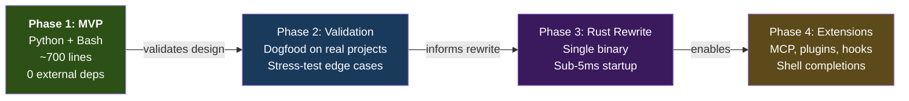
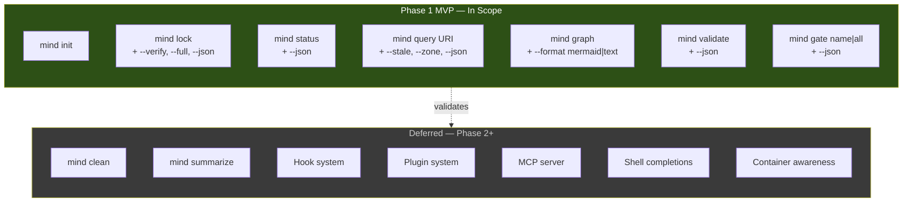
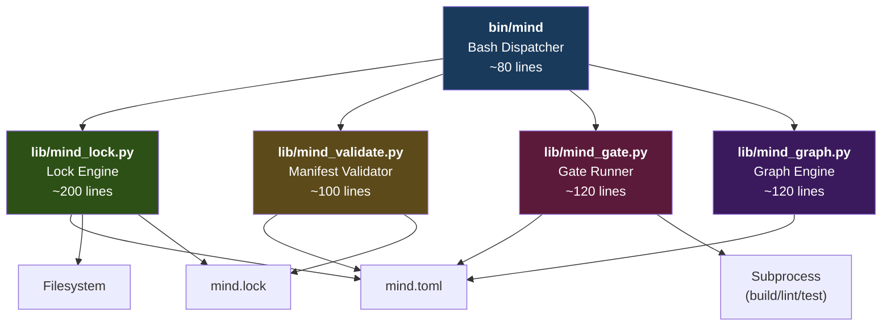

# Phase 1 MVP Blueprint — Scope & Requirements

> **Purpose**: Defines exactly what the Phase 1 MVP delivers, what it excludes, and the measurable functional and non-functional requirements each module must satisfy.
>
> **Status**: Blueprint — execution guide for Phase 1
> **Date**: 2026-02-25
> **Series**: MVP Blueprint 1 of 4
> **Upstream**: `MIND-FRAMEWORK.md` (canonical spec), `implementation-architecture.md` (stack decisions)

---

## Table of Contents

1. [MVP Vision](#1-mvp-vision)
2. [Scope Boundary](#2-scope-boundary)
3. [Assumptions & Prerequisites](#3-assumptions--prerequisites)
4. [Functional Requirements by Module](#4-functional-requirements-by-module)
5. [Non-Functional Requirements](#5-non-functional-requirements)
6. [MVP Success Criteria](#6-mvp-success-criteria)

---

## 1. MVP Vision

### 1.1 One-Sentence Goal

Deliver a working `mind` CLI (Bash dispatcher + Python modules) that synchronizes a `mind.toml` manifest with the filesystem, produces a `mind.lock` state snapshot, answers project state queries, runs deterministic quality gates, and visualizes the dependency graph — sufficient for an LLM agent orchestrator to consume as structured context.

### 1.2 What the MVP Proves

| Thesis | How the MVP Proves It |
|--------|----------------------|
| A TOML manifest can serve as single source of truth for project structure | `mind lock` reconciles declared vs actual state |
| Staleness detection enables reactive workflows | `mind status --json` reports stale artifacts that agents can prioritize |
| Deterministic gates catch failures before the reviewer | `mind gate all` runs build/lint/test/typecheck in sequence |
| A dependency graph adds value for context loading | `mind graph` shows which documents affect which |
| The CLI ↔ Agent interface works through JSON + exit codes | Every command supports `--json` and returns semantic exit codes |

### 1.3 Strategic Position

The MVP is **Phase 1 of 4** in the implementation architecture:



The MVP's primary job is to **validate the design** before investing in a Rust implementation. Every design decision in the canonical spec should be exercised by at least one CLI command.

---

## 2. Scope Boundary

### 2.1 In Scope (MVP Delivers)

| Capability | CLI Command | Adoption Level |
|------------|-------------|:--------------:|
| Project initialization (`.mind/` directory + first lock) | `mind init` | L3 |
| Manifest parsing and validation | `mind validate` | L2 |
| Lock file generation with SHA-256 hashing | `mind lock` | L3 |
| Lock file verification (is it current?) | `mind lock --verify` | L3 |
| Mtime fast path (skip unchanged files) | `mind lock` (automatic) | L3 |
| Staleness propagation through dependency graph | `mind lock` (automatic) | L3 |
| Project state dashboard (human + JSON) | `mind status` | L3 |
| Artifact lookup by URI or pattern | `mind query` | L2 |
| Dependency graph visualization (text + Mermaid) | `mind graph` | L2 |
| Deterministic quality gate execution | `mind gate` | L2 |
| Gate output capture to `.mind/outputs/` | `mind gate` (automatic) | L2 |
| Completeness metrics (requirement implementation %) | `mind status` | L3 |
| Dual output mode: human-readable + `--json` | All commands | — |
| Semantic exit codes (0-4) | All commands | — |
| Audit logging to `.mind/logs/audit.jsonl` | All commands | — |

### 2.2 Out of Scope (Deferred to Phase 2+)

| Capability | Target Phase | Why Deferred |
|------------|:------------:|-------------|
| Document summarization / context budgeting | Phase 2 | Requires token estimation heuristics — needs real usage data |
| Shell completions (bash, zsh, fish) | Phase 3 (Rust) | Clap derive macros generate these automatically; manual effort not justified in MVP |
| MCP server (`mind mcp-serve`) | Phase 4 | Depends on MCP SDK maturity; shell execution is the universal baseline |
| Plugin system (`.mind/plugins/`) | Phase 4 | No plugin consumers exist yet |
| Hook system (`.mind/hooks/`) | Phase 4 | Pre/post hooks need real workflow patterns first |
| Container health awareness (L2) | Phase 3 | Adds complexity; MVP assumes local/simple execution |
| Environment detection (CI, container, etc.) | Phase 3 | Behavioral adjustments can be hard-coded for MVP |
| Git hook installation (`mind init --hooks`) | Phase 2 | Generated hooks need workflow validation first |
| `mind clean` (archival, log rotation) | Phase 2 | Low priority; manual cleanup is acceptable during validation |
| `mind summarize` (document compression) | Phase 2 | Depends on token estimation heuristics |
| Lock integrity field (hash-of-lock) | Phase 2 | Defense-in-depth — not needed when only framework author uses it |
| Completeness by iteration (iteration-level progress) | Phase 2 | Adds schema complexity; overall completeness is sufficient |
| `--quiet` flag (suppress human output) | Phase 1.5 | Trivial addition after core works; but not required for MVP validation |

### 2.3 Scope Diagram



### 2.4 Intentional Simplifications

These are **deliberate design shortcuts** for the MVP that will be addressed in later phases:

| Simplification | Impact | When to Revisit |
|----------------|--------|-----------------|
| No mtime caching across invocations | Full hash on every `mind lock` (still < 1s for 50 files) | Phase 2 after measuring real performance |
| No atomic lock file writes | Tiny corruption risk on crash during write | Phase 2 |
| Warnings printed to stderr, not structured | Agent must parse stderr strings for warnings | Phase 2 (add `--json` warnings to stdout) |
| No generation bump on `mind lock` | Generation counter is manifest-only; CLI doesn't auto-increment | Phase 2 when agent integration patterns stabilize |
| No parallel file hashing | Sequential SHA-256; IO-bound anyway for < 50 files | Phase 3 (Rust with rayon) |
| Python startup overhead (~80ms) | Leaves < 120ms margin for actual work in 200ms budget | Phase 3 (Rust: 1-3ms startup) |

> **Design decision**: Every simplification must have a documented "when to revisit" trigger. No permanent shortcuts.

---

## 3. Assumptions & Prerequisites

### 3.1 Runtime Environment

| Requirement | Minimum Version | Check Command | Why |
|-------------|:---------------:|---------------|-----|
| **Python** | 3.11+ | `python3 -c "import tomllib"` | `tomllib` in stdlib since 3.11 — the only reason for this version floor |
| **Bash** | 4.0+ | `bash --version` | Associative arrays, `readarray`, process substitution |
| **Git** | 2.0+ | `git --version` | Project root detection via `git rev-parse --show-toplevel` |
| **sha256sum** | Any | `sha256sum --version` | Lock file hashing (fallback: Python `hashlib`) |
| **jq** | 1.6+ (optional) | `jq --version` | JSON pretty-printing in status/query (fallback: Python `json`) |

> **Zero external Python packages**. The MVP uses only stdlib: `tomllib`, `pathlib`, `hashlib`, `json`, `os`, `sys`, `datetime`, `subprocess`.

### 3.2 Project Structure Assumptions

The MVP assumes the target project follows the Mind Framework v2 documentation structure:

```
project-root/
├── mind.toml                    ← Manifest (required)
├── mind.lock                    ← Lock file (generated by mind lock)
├── .mind/                       ← Runtime directory (generated by mind init)
├── docs/
│   ├── spec/                    ← Zone: stable specifications
│   ├── state/                   ← Zone: volatile workflow state
│   ├── iterations/              ← Zone: append-only iteration history
│   └── knowledge/               ← Zone: stable reference material
└── .claude/                     ← Framework agents (installed by install.sh)
    ├── agents/
    ├── conventions/
    ├── skills/
    └── commands/
```

### 3.3 Manifest Assumptions

The MVP requires a valid `mind.toml` at the project root. The minimum viable manifest:

```toml
[manifest]
schema = "mind/v2.0"
generation = 1

[project]
name = "my-project"
type = "backend"

[project.stack]
language = "python@3.12"
```

All other sections (`[documents.*]`, `[[graph]]`, `[governance]`, `[agents.*]`, `[workflows.*]`, `[profiles]`) are optional. Commands degrade gracefully:

| Section Missing | Effect |
|-----------------|--------|
| `[documents.*]` | `mind lock` produces an empty `resolved` map. `mind status` shows project metadata only. |
| `[[graph]]` | No staleness propagation. Each artifact is independent. |
| `[project.commands]` | `mind gate` skips undefined gates (e.g., no `build` command → skip build gate). |
| `[governance]` | No governance-related warnings. |
| `[agents.*]` | Status doesn't show agent registry. |
| `[workflows.*]` | No workflow chain information in status. |
| `[profiles]` | No profile activation. |

### 3.4 Installation Assumptions

The MVP CLI is installed as part of the Mind Framework via `install.sh`:

```
.claude/
├── bin/
│   └── mind                ← Bash dispatcher (added to PATH or aliased)
├── lib/
│   ├── mind_lock.py        ← Lock engine
│   ├── mind_validate.py    ← Manifest validator
│   ├── mind_gate.py        ← Gate runner
│   └── mind_graph.py       ← Graph engine
├── agents/
├── conventions/
├── skills/
└── commands/
```

The user adds `.claude/bin` to `PATH` (or creates an alias: `alias mind='.claude/bin/mind'`).

---

## 4. Functional Requirements by Module

### 4.1 Module Map



---

### 4.2 Module: Bash Dispatcher (`bin/mind`)

**Purpose**: Entry point for all `mind` commands. Routes to the correct Python module or handles simple commands inline.

**Size estimate**: ~80 lines.

#### FR-DISP-01: Command Routing

| ID | Requirement | Acceptance Criteria |
|----|-------------|---------------------|
| FR-DISP-01a | Route known commands to their handlers | `mind lock` → `mind_lock.py`, `mind validate` → `mind_validate.py`, `mind gate` → `mind_gate.py`, `mind graph` → `mind_graph.py` |
| FR-DISP-01b | Handle inline commands (init, status, query) in bash | `mind init`, `mind status`, `mind query` execute without calling Python |
| FR-DISP-01c | Reject unknown commands with exit code 2 | `mind foo` → stderr: "Unknown command: foo", exit 2 |
| FR-DISP-01d | Default to `mind status` when no command given | `mind` (no args) → equivalent to `mind status` |

#### FR-DISP-02: Project Root Detection

| ID | Requirement | Acceptance Criteria |
|----|-------------|---------------------|
| FR-DISP-02a | Detect project root via `git rev-parse --show-toplevel` | Works in any subdirectory of a git repo |
| FR-DISP-02b | Fall back to `$PWD` if not in a git repo | Works outside git repos (uses current directory) |
| FR-DISP-02c | Verify `mind.toml` exists at project root | If missing: stderr "No mind.toml found at {root}", exit 3. Exception: `mind init` may create it. |

#### FR-DISP-03: Library Path Resolution

| ID | Requirement | Acceptance Criteria |
|----|-------------|---------------------|
| FR-DISP-03a | Resolve `lib/` relative to the dispatcher script's location | Works regardless of where the user invokes `mind` from |
| FR-DISP-03b | Verify Python 3.11+ is available | If `python3` is missing or < 3.11: stderr "Python 3.11+ required", exit 1 |

#### FR-DISP-04: Global Flags

| ID | Requirement | Acceptance Criteria |
|----|-------------|---------------------|
| FR-DISP-04a | `--json` flag passed through to Python modules | `mind lock --json` → Python receives `--json` argument |
| FR-DISP-04b | `--help` flag shows usage for any command | `mind --help`, `mind lock --help` both produce usage text |

---

### 4.3 Module: `mind init` (Bash, inline in dispatcher)

**Purpose**: Initialize the `.mind/` runtime directory and generate the first `mind.lock`.

#### FR-INIT-01: Directory Scaffolding

| ID | Requirement | Acceptance Criteria |
|----|-------------|---------------------|
| FR-INIT-01a | Create `.mind/` directory structure | Creates: `.mind/cache/`, `.mind/logs/runs/`, `.mind/logs/gates/`, `.mind/outputs/`, `.mind/tmp/` |
| FR-INIT-01b | Create `.mind/cache/summaries/` | Directory exists after init |
| FR-INIT-01c | Idempotent — safe to run multiple times | Running `mind init` twice doesn't error or duplicate |

#### FR-INIT-02: Lock File Bootstrap

| ID | Requirement | Acceptance Criteria |
|----|-------------|---------------------|
| FR-INIT-02a | Generate initial `mind.lock` by calling `mind lock` | `mind.lock` exists at project root after init |
| FR-INIT-02b | Skip lock generation if `mind.toml` doesn't exist | Warns on stderr, creates `.mind/` but not `mind.lock` |

#### FR-INIT-03: Gitignore

| ID | Requirement | Acceptance Criteria |
|----|-------------|---------------------|
| FR-INIT-03a | Append `.mind/` to `.gitignore` if not already present | `.mind/` appears in `.gitignore` after init |
| FR-INIT-03b | Do not duplicate the entry | Running init twice doesn't add `.mind/` twice |

---

### 4.4 Module: Lock Engine (`lib/mind_lock.py`)

**Purpose**: The core computational module. Parses `mind.toml`, scans the filesystem, computes hashes, propagates staleness, and writes `mind.lock`.

**Size estimate**: ~200 lines.

#### FR-LOCK-01: Manifest Parsing

| ID | Requirement | Acceptance Criteria |
|----|-------------|---------------------|
| FR-LOCK-01a | Parse `mind.toml` using `tomllib` (stdlib) | Successfully parses all valid `mind.toml` structures per canonical spec |
| FR-LOCK-01b | Extract all `[documents.*.*]` entries | Produces a dict of URI → {path, zone, status, owner, depends-on, consumed-by, tags} |
| FR-LOCK-01c | Extract `[[graph]]` edges | Produces a list of {from, to, type} tuples |
| FR-LOCK-01d | Report parse errors with line context | TOML syntax errors → stderr with file:line if possible, exit 3 |

#### FR-LOCK-02: Filesystem Scanning

| ID | Requirement | Acceptance Criteria |
|----|-------------|---------------------|
| FR-LOCK-02a | For each declared document, check if the file exists at its declared path | `exists: true/false` in lock entry |
| FR-LOCK-02b | Compute SHA-256 hash for existing files | `hash` field is a lowercase hex string (64 chars) |
| FR-LOCK-02c | Record file size in bytes | `size` field is an integer |
| FR-LOCK-02d | Record last modified time (ISO 8601) | `lastModified` field is a UTC ISO 8601 string |
| FR-LOCK-02e | Mark missing files as stale | `exists: false` → `stale: true` |

#### FR-LOCK-03: Staleness Detection

| ID | Requirement | Acceptance Criteria |
|----|-------------|---------------------|
| FR-LOCK-03a | Compare current hash against previous lock file's hash for the same URI | Changed hash → stale |
| FR-LOCK-03b | If no previous lock file exists, treat all entries as new (not stale) | First `mind lock` → all entries `stale: false` |
| FR-LOCK-03c | Record upstream hashes for dependency tracking | `upstreamHashes` maps upstream URIs to their hashes at lock time |

#### FR-LOCK-04: Staleness Propagation

| ID | Requirement | Acceptance Criteria |
|----|-------------|---------------------|
| FR-LOCK-04a | When an artifact's hash changes, mark all downstream dependents as stale | Transitive closure through `[[graph]]` edges |
| FR-LOCK-04b | Only propagate through edge types: `informs`, `implements`, `requires` | `validates` and `references` edges are informational, not staleness-propagating |
| FR-LOCK-04c | Handle cycles gracefully | Log a warning, do not infinite-loop, mark cycle participants as stale |
| FR-LOCK-04d | Record propagation reason in warnings | e.g., "doc:spec/architecture is stale: upstream doc:spec/requirements changed" |

#### FR-LOCK-05: Completeness Metrics

| ID | Requirement | Acceptance Criteria |
|----|-------------|---------------------|
| FR-LOCK-05a | Count iterations by status (active, completed) | `completeness.iterations` = `{active: N, completed: M}` |
| FR-LOCK-05b | Count requirements by implementation status | `completeness.requirements` = fraction of implemented requirements (0.0–1.0) |
| FR-LOCK-05c | Derive requirement implementation from iteration `implements` fields | An iteration with `status = "completed"` and `implements = ["doc:spec/requirements#FR-1"]` marks FR-1 as implemented |

#### FR-LOCK-06: Lock File Output

| ID | Requirement | Acceptance Criteria |
|----|-------------|---------------------|
| FR-LOCK-06a | Write `mind.lock` as formatted JSON (2-space indent) | Human-readable, diff-friendly |
| FR-LOCK-06b | Include `lockVersion`, `generatedAt`, `generation` metadata | Top-level fields present in every lock file |
| FR-LOCK-06c | Include `resolved` map (URI → entry) | Every declared document has an entry |
| FR-LOCK-06d | Include `warnings` array | String descriptions of issues (stale, missing, cycle) |
| FR-LOCK-06e | Include `completeness` object | `{requirements: float, iterations: {active: int, completed: int}}` |
| FR-LOCK-06f | Exit code 0 on success | Always, even when stale artifacts exist |

#### FR-LOCK-07: JSON Output Mode

| ID | Requirement | Acceptance Criteria |
|----|-------------|---------------------|
| FR-LOCK-07a | With `--json`, write sync summary to stdout as JSON | `{"changed": N, "unchanged": M, "stale": K, "missing": P, "warnings": [...]}` |
| FR-LOCK-07b | Without `--json`, write human-readable summary to stdout | "3 unchanged, 1 changed, 1 stale" |

#### FR-LOCK-08: Full Scan Mode

| ID | Requirement | Acceptance Criteria |
|----|-------------|---------------------|
| FR-LOCK-08a | With `--full`, skip mtime fast path and hash every file | Forces complete re-hash |
| FR-LOCK-08b | Default behavior uses mtime fast path when previous lock exists | Unchanged mtime+size → reuse previous hash |

#### FR-LOCK-09: Verify Mode

| ID | Requirement | Acceptance Criteria |
|----|-------------|---------------------|
| FR-LOCK-09a | With `--verify`, check if lock is current without writing | Read-only operation |
| FR-LOCK-09b | Exit 0 if lock is current | All hashes match, no stale artifacts |
| FR-LOCK-09c | Exit 4 if lock is out of sync | At least one hash mismatch or missing artifact |

---

### 4.5 Module: `mind status` (Bash, inline in dispatcher)

**Purpose**: Human-readable project dashboard. Reads `mind.lock` (JSON) and presents project state.

#### FR-STAT-01: Dashboard Display

| ID | Requirement | Acceptance Criteria |
|----|-------------|---------------------|
| FR-STAT-01a | Show project name, generation, schema version | Header line with project metadata |
| FR-STAT-01b | List all artifacts with status indicators | `✓ OK`, `⚠ STALE`, `✗ MISSING` per artifact |
| FR-STAT-01c | Show active iteration (if any) | Iteration name with `◎ active` marker |
| FR-STAT-01d | Show completeness percentage | `Requirements: NN% (X/Y implemented)` |
| FR-STAT-01e | Show warning count and details | `Warnings: N` with details below |

#### FR-STAT-02: JSON Mode

| ID | Requirement | Acceptance Criteria |
|----|-------------|---------------------|
| FR-STAT-02a | With `--json`, output full status as JSON | Same data as human mode, structured as JSON object |
| FR-STAT-02b | JSON matches schema defined in data contracts document | Schema-compliant output |

#### FR-STAT-03: Graceful Degradation

| ID | Requirement | Acceptance Criteria |
|----|-------------|---------------------|
| FR-STAT-03a | If `mind.lock` doesn't exist, suggest running `mind init` | stderr: "No mind.lock found. Run: mind init", exit 4 |
| FR-STAT-03b | If `mind.lock` is malformed JSON, report error | stderr: "mind.lock is not valid JSON", exit 1 |

---

### 4.6 Module: `mind query` (Bash, inline in dispatcher)

**Purpose**: Fast lookup of artifacts by URI, pattern, or filter.

#### FR-QUERY-01: URI Lookup

| ID | Requirement | Acceptance Criteria |
|----|-------------|---------------------|
| FR-QUERY-01a | Exact URI match: `mind query "doc:spec/requirements"` | Returns full entry for that URI |
| FR-QUERY-01b | Partial match: `mind query "requirements"` | Returns all URIs containing "requirements" |
| FR-QUERY-01c | No match: descriptive message | "No artifacts matching 'foo'" |

#### FR-QUERY-02: Filter Flags

| ID | Requirement | Acceptance Criteria |
|----|-------------|---------------------|
| FR-QUERY-02a | `--stale`: show only stale artifacts | Filters to entries where `stale: true` |
| FR-QUERY-02b | `--zone=spec`: show only artifacts in a specific zone | Filters to entries where zone matches |
| FR-QUERY-02c | `--missing`: show only missing artifacts | Filters to entries where `exists: false` |

#### FR-QUERY-03: Output

| ID | Requirement | Acceptance Criteria |
|----|-------------|---------------------|
| FR-QUERY-03a | Human mode: tabular display with URI, status, path | Aligned columns |
| FR-QUERY-03b | JSON mode: array of matching entries | `[{"uri": "...", "path": "...", "status": "...", ...}]` |

---

### 4.7 Module: Manifest Validator (`lib/mind_validate.py`)

**Purpose**: Check manifest invariants as declared in `[manifest.invariants]`.

**Size estimate**: ~100 lines.

#### FR-VAL-01: Invariant Checks

| ID | Requirement | Acceptance Criteria |
|----|-------------|---------------------|
| FR-VAL-01a | `every-document-has-owner`: every `[documents.*.*]` entry has a non-empty `owner` field | Violation lists the ownerless document URIs |
| FR-VAL-01b | `every-iteration-has-validation`: completed iterations have a `validation.md` artifact | Violation lists iterations missing validation |
| FR-VAL-01c | `no-orphan-dependencies`: every `depends-on` target resolves to a registered document | Violation lists orphan references |
| FR-VAL-01d | `no-circular-dependencies`: the `[[graph]]` defines a DAG | Violation lists the cycle participants |

#### FR-VAL-02: Structural Checks (Always Run)

| ID | Requirement | Acceptance Criteria |
|----|-------------|---------------------|
| FR-VAL-02a | `[manifest]` section exists with `schema` and `generation` fields | Error if missing |
| FR-VAL-02b | `[project]` section exists with `name` field | Error if missing |
| FR-VAL-02c | All document paths are relative (not absolute) | Warning for absolute paths |
| FR-VAL-02d | No duplicate URIs across all document sections | Error listing duplicates |
| FR-VAL-02e | `[[graph]]` `from` and `to` values reference declared URIs | Warning for dangling references |

#### FR-VAL-03: Output

| ID | Requirement | Acceptance Criteria |
|----|-------------|---------------------|
| FR-VAL-03a | Human mode: list violations grouped by severity | Errors first, then warnings |
| FR-VAL-03b | JSON mode: `{"valid": bool, "errors": [...], "warnings": [...]}` | Structured for agent consumption |
| FR-VAL-03c | Exit 0 if all invariants pass, exit 1 if any error | Warnings alone → exit 0 |

---

### 4.8 Module: Gate Runner (`lib/mind_gate.py`)

**Purpose**: Execute deterministic quality gates (build, lint, typecheck, test) as configured in `mind.toml`.

**Size estimate**: ~120 lines.

#### FR-GATE-01: Gate Resolution

| ID | Requirement | Acceptance Criteria |
|----|-------------|---------------------|
| FR-GATE-01a | Read gate commands from `[project.commands]` in `mind.toml` | Maps gate name → shell command |
| FR-GATE-01b | Default gate order: build → lint → typecheck → test | Unless overridden by explicit configuration |
| FR-GATE-01c | Skip undefined gates silently | If `project.commands.typecheck` is not defined, skip typecheck without error |

#### FR-GATE-02: Single Gate Execution

| ID | Requirement | Acceptance Criteria |
|----|-------------|---------------------|
| FR-GATE-02a | `mind gate test` runs only the `test` gate | Executes `project.commands.test` |
| FR-GATE-02b | Capture stdout + stderr of the gate command | Available for agent/human inspection |
| FR-GATE-02c | Measure execution duration | Reported in output |
| FR-GATE-02d | Report PASS (exit 0) or FAIL (non-zero exit) | Clear status indication |

#### FR-GATE-03: All Gates Execution

| ID | Requirement | Acceptance Criteria |
|----|-------------|---------------------|
| FR-GATE-03a | `mind gate all` runs all defined gates in order | Respects gate order |
| FR-GATE-03b | Stop on first failure (default) | Remaining gates are skipped |
| FR-GATE-03c | Report per-gate status and duration | Individual results for each gate |
| FR-GATE-03d | Report overall status (PASS only if all pass) | `overallStatus: "PASS"` or `"FAIL"` |

#### FR-GATE-04: Output Capture

| ID | Requirement | Acceptance Criteria |
|----|-------------|---------------------|
| FR-GATE-04a | Save gate output to `.mind/outputs/{gate}/` | Timestamped file per execution |
| FR-GATE-04b | Maintain `latest.log` symlink/copy | Points to most recent result for each gate |
| FR-GATE-04c | Include output path in JSON result | `"logFile": ".mind/outputs/test/2026-02-25T14-30-00Z.log"` |

#### FR-GATE-05: JSON Output

| ID | Requirement | Acceptance Criteria |
|----|-------------|---------------------|
| FR-GATE-05a | `--json` flag produces structured gate results | See data contracts document for schema |
| FR-GATE-05b | Per-gate: `{name, status, duration, logFile}` | Individual gate detail |
| FR-GATE-05c | Overall: `{gates: [...], overallStatus, totalDuration}` | Aggregate result |

#### FR-GATE-06: Error Handling

| ID | Requirement | Acceptance Criteria |
|----|-------------|---------------------|
| FR-GATE-06a | Unknown gate name → exit 2 | `mind gate deploy` → "Unknown gate: deploy", exit 2 |
| FR-GATE-06b | No gates defined at all → warn and exit 0 | "No gate commands defined in mind.toml" |
| FR-GATE-06c | Gate command timeout (30s default) | Kill subprocess after timeout, report TIMEOUT status |

---

### 4.9 Module: Graph Engine (`lib/mind_graph.py`)

**Purpose**: Build and visualize the dependency graph from `[[graph]]` edges in `mind.toml`.

**Size estimate**: ~120 lines.

#### FR-GRAPH-01: Graph Construction

| ID | Requirement | Acceptance Criteria |
|----|-------------|---------------------|
| FR-GRAPH-01a | Parse all `[[graph]]` entries from `mind.toml` | Produces adjacency list |
| FR-GRAPH-01b | Validate edge endpoints reference declared URIs | Warn on dangling references (don't fail) |
| FR-GRAPH-01c | Classify edges by type: `informs`, `implements`, `requires`, `validates`, `references` | Type available for filtering |

#### FR-GRAPH-02: Text Output (Default)

| ID | Requirement | Acceptance Criteria |
|----|-------------|---------------------|
| FR-GRAPH-02a | Default format: indented text tree | Root nodes at left, dependents indented |
| FR-GRAPH-02b | Show edge types | `doc:spec/requirements --[informs]--> doc:spec/architecture` |
| FR-GRAPH-02c | Mark stale nodes (if `mind.lock` exists) | `⚠` marker on stale nodes |

#### FR-GRAPH-03: Mermaid Output

| ID | Requirement | Acceptance Criteria |
|----|-------------|---------------------|
| FR-GRAPH-03a | `--format mermaid` produces valid Mermaid flowchart | Pasteable into Mermaid renderer |
| FR-GRAPH-03b | Edge labels show type | `A -->|"informs"| B` |
| FR-GRAPH-03c | Color-code nodes by zone | spec=blue, state=green, iteration=purple, knowledge=orange |

#### FR-GRAPH-04: Query Mode

| ID | Requirement | Acceptance Criteria |
|----|-------------|---------------------|
| FR-GRAPH-04a | `mind graph --upstream doc:spec/architecture` | Shows all transitive upstream dependencies |
| FR-GRAPH-04b | `mind graph --downstream doc:spec/requirements` | Shows all transitive downstream dependents |

---

## 5. Non-Functional Requirements

### 5.1 Performance

| ID | Metric | Target | Measurement |
|----|--------|:------:|-------------|
| NFR-PERF-01 | `mind status` latency (cold) | ≤ 200ms | `time mind status > /dev/null` |
| NFR-PERF-02 | `mind status --json` latency (cold) | ≤ 150ms | Excludes terminal formatting overhead |
| NFR-PERF-03 | `mind lock` latency (50 artifacts) | ≤ 1000ms | Full hash, no mtime cache |
| NFR-PERF-04 | `mind lock --verify` latency (50 artifacts) | ≤ 500ms | Read-only check |
| NFR-PERF-05 | `mind query` latency | ≤ 150ms | JSON parse + grep |
| NFR-PERF-06 | `mind validate` latency | ≤ 300ms | TOML parse + graph cycle check |
| NFR-PERF-07 | `mind graph` latency | ≤ 200ms | TOML parse + graph construction |
| NFR-PERF-08 | `mind gate` latency (overhead) | ≤ 100ms | Excluding the actual gate command execution time |

### 5.2 Reliability

| ID | Requirement | Target |
|----|-------------|-------|
| NFR-REL-01 | No data loss on crash during `mind lock` | Lock file unchanged if write fails partway |
| NFR-REL-02 | Graceful handling of malformed `mind.toml` | Descriptive error message + exit 3 |
| NFR-REL-03 | Graceful handling of malformed `mind.lock` | Descriptive error message + suggest `mind lock` |
| NFR-REL-04 | Read-only commands never modify filesystem | `status`, `query`, `validate`, `graph` are pure reads |
| NFR-REL-05 | Lock file is self-consistent | All URIs in `resolved` are also in `mind.toml`; no orphans in lock |

### 5.3 Maintainability

| ID | Requirement | Target |
|----|-------------|-------|
| NFR-MAINT-01 | Total codebase size | ≤ 800 lines (target ~700) |
| NFR-MAINT-02 | Module cohesion | Each `.py` file has a single responsibility |
| NFR-MAINT-03 | No external dependencies | Pure stdlib Python + Bash |
| NFR-MAINT-04 | Type hints on all public functions | `mypy --strict` passes (best-effort, not blocking gate) |
| NFR-MAINT-05 | Docstrings on all modules and public functions | Purpose, parameters, return value |

### 5.4 Portability

| ID | Requirement | Target |
|----|-------------|-------|
| NFR-PORT-01 | Runs on Linux | Ubuntu 22.04+, Debian 12+, NixOS |
| NFR-PORT-02 | Runs on macOS | macOS 13+ (Ventura) with Homebrew Python |
| NFR-PORT-03 | Runs on Windows (WSL) | WSL2 with Ubuntu |
| NFR-PORT-04 | Runs in GitHub Codespaces | Default Python image |
| NFR-PORT-05 | Runs in Dev Containers | Any image with Python 3.11+ and Bash |
| NFR-PORT-06 | No platform-specific code paths | No `os.name` branching in MVP |

### 5.5 Agent Compatibility

| ID | Requirement | Target |
|----|-------------|-------|
| NFR-AGENT-01 | All commands produce parseable JSON with `--json` | Valid JSON on stdout |
| NFR-AGENT-02 | Exit codes follow documented semantics (0-4) | Agents can branch on exit code |
| NFR-AGENT-03 | No interactive prompts ever | All commands are non-interactive |
| NFR-AGENT-04 | No ANSI color codes in JSON mode | Clean JSON without escape sequences |
| NFR-AGENT-05 | Diagnostics on stderr only | stdout reserved for command output |

### 5.6 Token Efficiency

| ID | Requirement | Target |
|----|-------------|-------|
| NFR-TOKEN-01 | `mind status --json` output ≤ 2KB for 20-artifact project | Compact JSON without redundancy |
| NFR-TOKEN-02 | `mind gate all --json` output ≤ 1KB (excluding log paths) | Minimal per-gate metadata |
| NFR-TOKEN-03 | Error messages ≤ 200 characters | Actionable without verbosity |
| NFR-TOKEN-04 | No banner/version/branding in output | Zero wasted tokens per invocation |

---

## 6. MVP Success Criteria

### 6.1 Functional Completeness

All of the following must work end-to-end:

| # | Scenario | Commands | Expected Outcome |
|---|----------|----------|------------------|
| SC-01 | Fresh project initialization | `mind init` | `.mind/` created, `mind.lock` generated |
| SC-02 | Lock file reflects manifest | `mind lock` | All declared docs appear in `mind.lock` with hashes |
| SC-03 | Stale detection on file change | Edit a spec file → `mind lock` | Changed file marked stale; downstream deps marked stale |
| SC-04 | Status dashboard | `mind status` | Human-readable table showing all artifacts and status |
| SC-05 | JSON output for agents | `mind status --json` | Valid JSON parseable by any LLM agent |
| SC-06 | Artifact query | `mind query "requirements"` | Returns matching entries |
| SC-07 | Gate execution | `mind gate test` | Runs test command, captures output, reports PASS/FAIL |
| SC-08 | All gates | `mind gate all` | Runs all defined gates in order, stops on first failure |
| SC-09 | Graph visualization | `mind graph` | Displays dependency tree |
| SC-10 | Mermaid export | `mind graph --format mermaid` | Valid Mermaid diagram |
| SC-11 | Manifest validation | `mind validate` | Reports invariant violations |
| SC-12 | Lock verification | `mind lock --verify` | Exit 0 if current, exit 4 if stale |

### 6.2 Agent Integration Smoke Test

A single end-to-end scenario proving the agent integration pattern works:

```bash
# 1. Agent (orchestrator) starts workflow
mind status --json                      # → JSON with project state
# 2. Agent processes, creates/modifies files
echo "# Updated" >> docs/spec/requirements.md
# 3. Agent syncs lock
mind lock --json                        # → JSON with changes
# 4. Agent runs gates
mind gate all --json                    # → JSON with gate results
# 5. Agent queries specific artifact
mind query "doc:spec/requirements" --json  # → JSON with artifact detail
# 6. Agent checks graph impact
mind graph --downstream doc:spec/requirements  # → affected artifacts
```

Each step must produce valid, parseable output with correct exit codes.

### 6.3 Performance Gate

| Command | Must Complete In | Test Method |
|---------|:----------------:|-------------|
| `mind status` | ≤ 200ms | `time mind status > /dev/null` on a 20-artifact project |
| `mind lock` | ≤ 1000ms | `time mind lock` on a 50-artifact project |
| `mind lock --verify` | ≤ 500ms | `time mind lock --verify` on a 50-artifact project |
| `mind query` | ≤ 150ms | `time mind query "requirements" > /dev/null` |
| `mind gate` (overhead only) | ≤ 100ms | Gate command = `true`; measure total time |

### 6.4 Phase 1 → Phase 2 Transition Criteria

Phase 1 is complete when:

- [ ] All 12 scenarios in §6.1 pass
- [ ] Agent integration smoke test (§6.2) passes end-to-end
- [ ] All performance gates (§6.3) pass
- [ ] Total codebase is ≤ 800 lines
- [ ] Zero external Python dependencies
- [ ] `mind.lock` is valid, committed to git, and diff-friendly
- [ ] `install.sh` installs `bin/mind` + `lib/` alongside agents
- [ ] At least one real project dogfooded through a full workflow with the CLI

---

*Next document: [MVP Blueprint — Architecture & Data Contracts](mvp-blueprint-architecture-and-schemas.md)*
