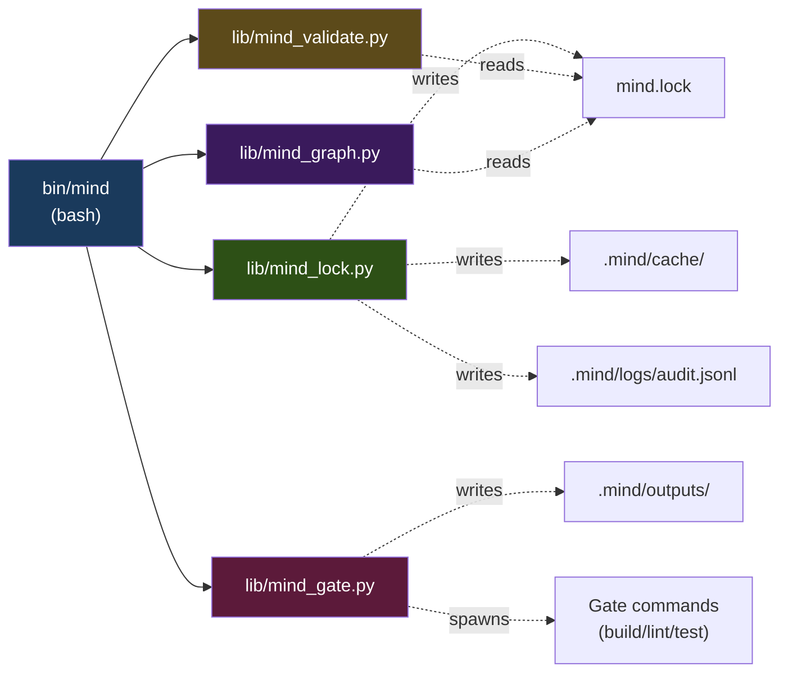
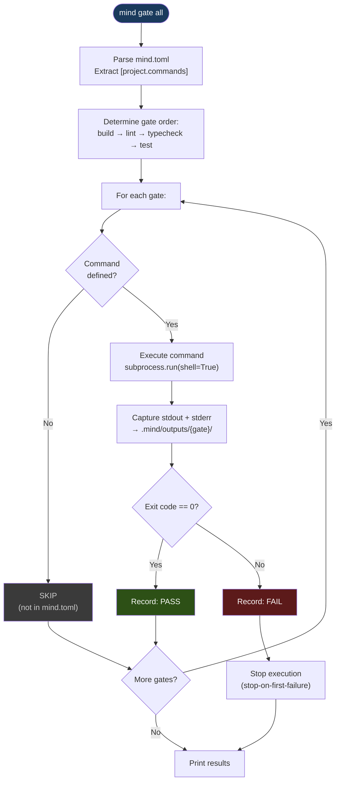
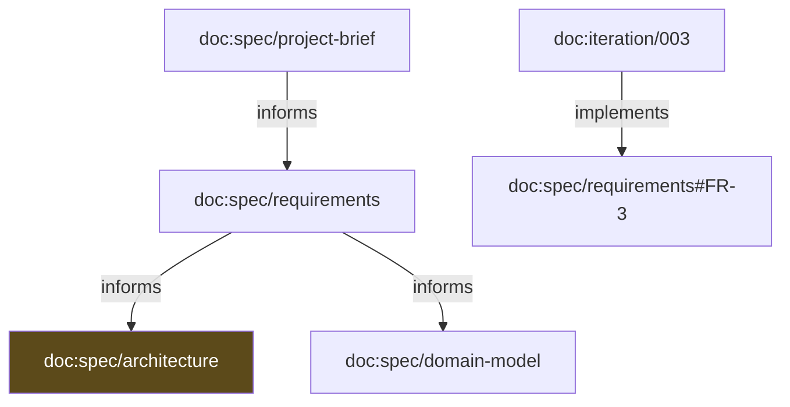
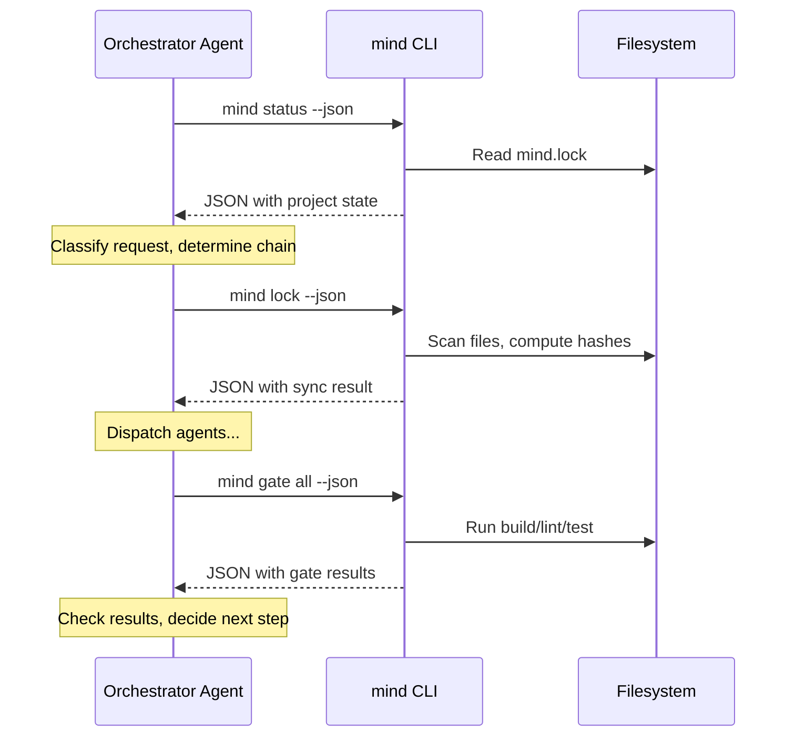

# Phase 1 MVP Blueprint — Scripts & Integration

> **Purpose**: Defines every script and module the MVP requires — purpose, interface contract, inputs/outputs, dependencies, failure behavior — plus the strategy for integrating the CLI with LLM agent workflows.
>
> **Status**: Blueprint — execution guide for Phase 1
> **Date**: 2026-02-25
> **Series**: MVP Blueprint 3 of 4
> **Upstream**: `mvp-blueprint-scope-and-requirements.md` (scope), `mvp-blueprint-architecture-and-schemas.md` (schemas)

---

## Table of Contents

1. [Script Inventory](#1-script-inventory)
2. [Script Definitions](#2-script-definitions)
3. [Agent Integration Strategy](#3-agent-integration-strategy)
4. [Existing Script Updates](#4-existing-script-updates)

---

## 1. Script Inventory

### 1.1 New Scripts (To Be Created)

| Script | Language | Lines (est.) | Purpose |
|--------|----------|:------------:|---------|
| `bin/mind` | Bash | ~80 | CLI entry point and dispatcher |
| `lib/mind_lock.py` | Python | ~200 | Lock engine: manifest parsing, hashing, staleness |
| `lib/mind_validate.py` | Python | ~100 | Manifest invariant checking |
| `lib/mind_gate.py` | Python | ~120 | Deterministic gate runner |
| `lib/mind_graph.py` | Python | ~120 | Dependency graph builder and renderer |

**Total new code**: ~620 lines.

### 1.2 Existing Scripts (To Be Modified)

| Script | Current Lines | Changes |
|--------|:------------:|---------|
| `install.sh` | ~130 | Add `bin/` and `lib/` to installation |
| `scaffold.sh` | ~410 | Add `mind.toml` generation, 4-zone docs, `mind init` invocation |

### 1.3 Dependency Graph



---

## 2. Script Definitions

### 2.1 `bin/mind` — Bash Dispatcher

#### Contract

| Aspect | Detail |
|--------|--------|
| **Purpose** | Entry point for all `mind` CLI commands |
| **When Runs** | User or agent invokes `mind <command>` |
| **Inputs** | Command name + flags from `$@` |
| **Outputs** | Routes to appropriate handler; passes through handler's stdout/stderr/exit code |
| **Dependencies** | Python 3.11+, Bash 4+, `git` (optional, for project root), `jq` (optional, for status/query) |
| **Failure Behavior** | Missing Python → exit 1 with message. Unknown command → exit 2. Missing `mind.toml` → exit 3. |

#### Interface

```
bin/mind [--help]
bin/mind <command> [<args>] [--json] [--help]
```

#### Internal Structure

```bash
#!/usr/bin/env bash
# mind — Mind Framework CLI dispatcher
# Requires: Python 3.11+, Bash 4+
# Optional: git (project root detection), jq (JSON formatting)
set -euo pipefail
```

**Responsibilities**:

1. **Project root detection**:
   - Try `git rev-parse --show-toplevel`
   - Fallback to `$PWD`
   - Verify `mind.toml` exists (except for `mind init` which may not need it yet)

2. **Library path resolution**:
   - `LIB_DIR` = directory of the script + `/../lib`
   - Resolve symlinks: `readlink -f` (Linux) or `readlink` + fallback (macOS)

3. **Python version check**:
   - Run `python3 -c "import sys; assert sys.version_info >= (3, 11)"`
   - If fails → "Python 3.11+ required (tomllib support)", exit 1

4. **Command routing**:

   | Command | Handler |
   |---------|---------|
   | `init` | Inline bash function `_mind_init` |
   | `lock` | `python3 "$LIB_DIR/mind_lock.py" "$MIND_ROOT" "$@"` |
   | `status` | Inline bash function `_mind_status` |
   | `query` | Inline bash function `_mind_query` |
   | `validate` | `python3 "$LIB_DIR/mind_validate.py" "$MIND_ROOT" "$@"` |
   | `graph` | `python3 "$LIB_DIR/mind_graph.py" "$MIND_ROOT" "$@"` |
   | `gate` | `python3 "$LIB_DIR/mind_gate.py" "$MIND_ROOT" "$@"` |
   | (no args) | Redirects to `_mind_status` |
   | `--help` | `_mind_help` |
   | Unknown | stderr: "Unknown command: $1", exit 2 |

5. **Inline functions** (read JSON, no TOML parsing needed):

   - `_mind_init`: Creates `.mind/` tree, appends to `.gitignore`, calls `mind lock`
   - `_mind_status`: Reads `mind.lock`, formats dashboard (uses `jq` if available, Python fallback if not)
   - `_mind_query`: Reads `mind.lock`, filters by term/flags (uses `jq` or Python)
   - `_mind_help`: Prints usage text

#### Error Handling

| Condition | stderr Message | Exit Code |
|-----------|---------------|:---------:|
| Python not found or < 3.11 | `"Error: Python 3.11+ required (for tomllib support)"` | 1 |
| `mind.toml` not found | `"Error: No mind.toml found at {root}. Run: mind init"` | 3 |
| `mind.lock` not found (status/query) | `"Error: No mind.lock found. Run: mind init"` | 4 |
| Unknown command | `"Error: Unknown command: {cmd}. Run: mind --help"` | 2 |
| Python module crashes | Passes through Python's exit code and stderr | varies |

---

### 2.2 `lib/mind_lock.py` — Lock Engine

#### Contract

| Aspect | Detail |
|--------|--------|
| **Purpose** | Parse `mind.toml`, scan filesystem, compute hashes, detect staleness, write `mind.lock` |
| **When Runs** | `mind lock`, `mind lock --full`, `mind lock --verify`, `mind lock --json` |
| **Inputs** | arg[1]: project root path. Optional flags: `--json`, `--full`, `--verify` |
| **Outputs** | Writes `mind.lock` (JSON). Stdout: sync summary (human or JSON). Stderr: diagnostics. |
| **Dependencies** | `tomllib` (stdlib 3.11+), `hashlib`, `pathlib`, `json`, `os`, `sys`, `datetime` |
| **Failure Behavior** | TOML parse error → exit 3. Filesystem I/O error → exit 1. Always writes complete lock or no lock (no partial writes). |

#### Interface

```
python3 lib/mind_lock.py <project_root> [--json] [--full] [--verify]
```

#### Internal Modules / Functions

| Function | Purpose | Inputs | Returns |
|----------|---------|--------|---------|
| `main(args)` | Entry point, argument parsing | sys.argv | exit code |
| `parse_manifest(path)` | Parse `mind.toml` → dict | Path to `mind.toml` | Parsed manifest dict |
| `extract_documents(manifest)` | Extract all `[documents.*.*]` → URI map | Manifest dict | `dict[str, DocumentInfo]` |
| `extract_graph(manifest)` | Extract `[[graph]]` → edge list | Manifest dict | `list[Edge]` |
| `scan_artifact(uri, doc_info, project_root)` | Check existence, hash, mtime for one artifact | URI + config + root | `ResolvedEntry` |
| `compute_staleness(resolved, edges, prev_lock)` | Propagate staleness through graph | Resolved map + edges + previous | Updated resolved map |
| `compute_completeness(manifest, resolved)` | Calculate requirement/iteration metrics | Manifest + resolved | Completeness dict |
| `generate_warnings(resolved)` | Produce warning strings | Resolved map | `list[str]` |
| `write_lock(lock_data, project_root)` | Write `mind.lock` as sorted JSON | Lock dict + root | None |
| `print_summary(sync_result, json_mode)` | Output human or JSON summary to stdout | Sync result + flag | None |

#### Data Structures

```python
# Internal types (not persisted — used during computation)

@dataclass
class DocumentInfo:
    uri: str
    path: str            # relative path from mind.toml
    zone: str            # spec, state, iteration, knowledge
    status: str          # from mind.toml (approved, active, etc.)
    owner: str           # agent URI
    depends_on: list[str]  # upstream URIs
    implements: list[str]  # for iterations: which requirements

@dataclass
class Edge:
    from_uri: str
    to_uri: str
    edge_type: str       # informs, implements, requires, validates, references

@dataclass
class ResolvedEntry:
    path: str
    zone: str
    exists: bool
    hash: str | None
    size: int | None
    last_modified: str | None  # ISO 8601
    stale: bool
    upstream_hashes: dict[str, str]

@dataclass
class SyncResult:
    changed: int
    unchanged: int
    stale: int
    missing: int
    total: int
    warnings: list[str]
    completeness: dict
```

#### Algorithm: `compute_staleness`

```
function compute_staleness(resolved, edges, prev_lock):
    # Step 1: Determine directly changed artifacts
    for each uri in resolved:
        if prev_lock exists and uri in prev_lock.resolved:
            if resolved[uri].hash != prev_lock.resolved[uri].hash:
                mark resolved[uri] as self_changed = true

    # Step 2: Build adjacency list (downstream direction)
    # edge.from → [edge.to] for staleness-propagating types only
    downstream_map = {}
    for each edge in edges:
        if edge.type in ("informs", "implements", "requires"):
            downstream_map[edge.from].append(edge.to)

    # Step 3: Check upstream hashes
    for each uri in resolved:
        for each upstream_uri in resolved[uri].depends_on:
            # Snapshot current upstream hash
            resolved[uri].upstream_hashes[upstream_uri] = resolved[upstream_uri].hash
            # Compare against previous snapshot
            if prev_lock and uri in prev_lock.resolved:
                old_upstream_hash = prev_lock.resolved[uri].upstream_hashes.get(upstream_uri)
                if old_upstream_hash and old_upstream_hash != resolved[upstream_uri].hash:
                    mark resolved[uri].stale = true
                    add warning: "{uri} is stale: upstream {upstream_uri} changed"

    # Step 4: Transitive propagation via BFS
    queue = [uri for uri in resolved if self_changed or stale]
    visited = set()
    while queue:
        current = queue.pop(0)
        if current in visited: continue
        visited.add(current)
        for downstream_uri in downstream_map.get(current, []):
            if downstream_uri in resolved:
                resolved[downstream_uri].stale = true
                queue.append(downstream_uri)

    return resolved
```

#### Edge Cases

| Case | Behavior |
|------|----------|
| `mind.toml` has no `[documents]` | Lock file has empty `resolved: {}`, `completeness: {requirements: 0, iterations: {active: 0, completed: 0}}` |
| `mind.toml` has no `[[graph]]` | No staleness propagation; each artifact stale only if self-changed or missing |
| File path in `mind.toml` doesn't exist | `exists: false`, `stale: true`, warning generated |
| Circular dependency in `[[graph]]` | BFS `visited` set prevents infinite loop; all cycle members marked stale; warning generated |
| `mind.lock` doesn't exist yet (first run) | No previous hashes to compare; all entries `stale: false` (new, not stale); full lock generated |
| `mind.toml` can't be read | stderr: parse error with detail, exit 3 |
| Filesystem permission error on a file | `exists: true`, hash: null, stale: true, warning with file path |

#### Performance Contract

| Metric | Budget |
|--------|:------:|
| TOML parsing | ≤ 50ms (tomllib is fast even for large manifests) |
| SHA-256 per file (1MB) | ≤ 5ms (hashlib uses OpenSSL) |
| 50-artifact full scan | ≤ 800ms total |
| Lock file write (50 entries) | ≤ 50ms (json.dumps + file write) |
| Total `mind lock` (50 artifacts) | ≤ 1000ms |

---

### 2.3 `lib/mind_validate.py` — Manifest Validator

#### Contract

| Aspect | Detail |
|--------|--------|
| **Purpose** | Check manifest structural validity and declared invariants |
| **When Runs** | `mind validate`, `mind validate --json` |
| **Inputs** | arg[1]: project root path. Optional: `--json` |
| **Outputs** | Stdout: validation report (human or JSON). Exit 0 if valid, exit 1 if errors. |
| **Dependencies** | `tomllib`, `json`, `pathlib`, `sys` |
| **Failure Behavior** | TOML parse error → exit 3. I/O error → exit 1. |

#### Interface

```
python3 lib/mind_validate.py <project_root> [--json]
```

#### Internal Functions

| Function | Purpose |
|----------|---------|
| `main(args)` | Entry point |
| `parse_manifest(path)` | Same as lock engine (consider shared import) |
| `check_structural(manifest)` | Required fields, schema version, URI uniqueness |
| `check_invariants(manifest, lock)` | Per-invariant checks based on `[manifest.invariants]` |
| `detect_cycles(edges)` | Topological sort; returns cycle participants if DAG is violated |
| `format_results(errors, warnings, invariants, json_mode)` | Output formatting |

#### Validation Checks

**Structural (always run)**:

| Check | Error/Warning | Message Pattern |
|-------|:---:|-------|
| `[manifest]` section exists | Error | `"Missing required section: [manifest]"` |
| `manifest.schema` exists and equals `"mind/v2.0"` | Error | `"Unsupported schema: {value}. Expected: mind/v2.0"` |
| `manifest.generation` exists and is integer ≥ 1 | Error | `"Invalid generation: {value}. Must be integer ≥ 1"` |
| `[project]` section exists | Error | `"Missing required section: [project]"` |
| `project.name` exists and is non-empty | Error | `"project.name is required"` |
| All document URIs are unique | Error | `"Duplicate URI: {uri} in {loc1} and {loc2}"` |
| All document paths are relative | Warning | `"Absolute path in {uri}: {path}"` |
| `[[graph]]` from/to reference declared URIs | Warning | `"Graph edge references undeclared URI: {uri}"` |
| `[[graph]]` type is one of the 5 valid types | Warning | `"Unknown graph edge type: {type}"` |

**Invariant checks (only if declared in `[manifest.invariants]`)**:

| Invariant | Logic |
|-----------|-------|
| `every-document-has-owner` | For each `[documents.*.*]`: `owner` field must be non-empty |
| `every-iteration-has-validation` | For each completed iteration: `"validation.md"` in `artifacts` or a `validation` document registered |
| `no-orphan-dependencies` | For each `depends-on` entry: the referenced URI must exist in the document registry |
| `no-circular-dependencies` | Topological sort of `[[graph]]` edges succeeds (Kahn's algorithm) |

#### Cycle Detection Algorithm

```
function detect_cycles(edges):
    # Kahn's algorithm for topological sort
    in_degree = {node: 0 for node in all_nodes(edges)}
    for edge in edges:
        in_degree[edge.to] += 1

    queue = [node for node in in_degree if in_degree[node] == 0]
    sorted_nodes = []

    while queue:
        node = queue.pop(0)
        sorted_nodes.append(node)
        for edge in edges where edge.from == node:
            in_degree[edge.to] -= 1
            if in_degree[edge.to] == 0:
                queue.append(edge.to)

    if len(sorted_nodes) < len(all_nodes):
        cycle_nodes = [n for n in all_nodes if n not in sorted_nodes]
        return cycle_nodes  # These are in a cycle
    return []  # DAG is valid
```

---

### 2.4 `lib/mind_gate.py` — Gate Runner

#### Contract

| Aspect | Detail |
|--------|--------|
| **Purpose** | Execute deterministic quality gates (build, lint, typecheck, test) |
| **When Runs** | `mind gate <name>`, `mind gate all`, with optional `--json` |
| **Inputs** | arg[1]: project root path. arg[2]: gate name or `"all"`. Optional: `--json` |
| **Outputs** | Stdout: gate results (human or JSON). Writes output to `.mind/outputs/`. Exit 0 if pass, exit 1 if fail. |
| **Dependencies** | `tomllib`, `json`, `subprocess`, `pathlib`, `datetime`, `sys`, `os` |
| **Failure Behavior** | Unknown gate → exit 2. Manifest error → exit 3. Gate command failure → exit 1 (with results). |

#### Interface

```
python3 lib/mind_gate.py <project_root> <gate_name|all> [--json]
```

#### Internal Functions

| Function | Purpose |
|----------|---------|
| `main(args)` | Entry point and argument parsing |
| `load_gate_commands(manifest)` | Extract `[project.commands]` → dict of name → command |
| `run_single_gate(name, command, project_root, output_dir)` | Execute one gate, capture output, record result |
| `run_all_gates(gates, project_root, output_dir)` | Execute all defined gates in order, stop on first failure |
| `capture_output(name, stdout, stderr, output_dir)` | Write captured output to `.mind/outputs/{name}/` |
| `format_results(results, json_mode)` | Format and print results |

#### Gate Execution Sequence



#### Gate Command Execution Details

| Aspect | Specification |
|--------|--------------|
| Shell | `subprocess.run(command, shell=True, cwd=project_root)` |
| Timeout | 300 seconds (default). TIMEOUT status on expiry. |
| Working directory | Project root |
| Environment | Inherits current environment |
| stdout/stderr capture | `subprocess.PIPE` for both |
| Output encoding | UTF-8, errors='replace' |

#### Default Gate Order

When `mind gate all` is invoked, gates execute in this fixed order:

1. `build` (if defined)
2. `lint` (if defined)
3. `typecheck` (if defined)
4. `test` (if defined)

Any additional custom commands (e.g., `format`, `coverage`) are appended **after** the default four, in the order they appear in the TOML file.

#### Output Capture

For each gate execution:

1. Create directory: `.mind/outputs/{gate_name}/` (if not exists)
2. Write captured output to: `.mind/outputs/{gate_name}/{timestamp}.log`
   - Timestamp format: `YYYY-MM-DDTHH-MM-SSZ`
   - Content: stdout + stderr concatenated, with a header line showing command, exit code, duration
3. Create/update: `.mind/outputs/{gate_name}/latest.log` (copy, not symlink — symlinks complicate some tools)

#### Output File Format

```
# Gate: test
# Command: pytest -v --tb=short
# Exit Code: 0
# Duration: 8.4s
# Timestamp: 2026-02-25T14:30:00Z
==========================================================
{stdout content}
{stderr content if any}
```

---

### 2.5 `lib/mind_graph.py` — Graph Engine

#### Contract

| Aspect | Detail |
|--------|--------|
| **Purpose** | Build dependency graph from `[[graph]]`, render as text or Mermaid |
| **When Runs** | `mind graph`, `mind graph --format mermaid`, `mind graph --upstream URI`, `mind graph --downstream URI` |
| **Inputs** | arg[1]: project root path. Optional: `--format mermaid|text`, `--upstream URI`, `--downstream URI`, `--json` |
| **Outputs** | Stdout: graph visualization. Exit 0. |
| **Dependencies** | `tomllib`, `json`, `pathlib`, `sys` |
| **Failure Behavior** | Missing `mind.toml` → exit 3. No `[[graph]]` → "No graph edges defined", exit 0. |

#### Interface

```
python3 lib/mind_graph.py <project_root> [--format mermaid|text] [--upstream URI] [--downstream URI] [--json]
```

#### Internal Functions

| Function | Purpose |
|----------|---------|
| `main(args)` | Entry point |
| `parse_graph(manifest)` | Extract `[[graph]]` → adjacency lists (both directions) |
| `get_stale_nodes(lock_path)` | Read `mind.lock` → set of stale URIs (for annotation) |
| `traverse_upstream(uri, adj_reverse)` | BFS/DFS upstream from a given node |
| `traverse_downstream(uri, adj_forward)` | BFS/DFS downstream from a given node |
| `render_text(nodes, edges, stale_set)` | Render as indented text tree |
| `render_mermaid(nodes, edges, stale_set)` | Render as Mermaid flowchart |
| `render_json(nodes, edges)` | Render as JSON (nodes + edges) |

#### Text Output Format

```
doc:spec/project-brief
  --[informs]--> doc:spec/requirements
    --[informs]--> doc:spec/architecture ⚠ STALE
    --[informs]--> doc:spec/domain-model
  --[informs]--> doc:spec/domain-model

doc:iteration/003
  --[implements]--> doc:spec/requirements#FR-3
```

#### Mermaid Output Format



Stale nodes get a distinctive style (amber fill). Zone-based coloring:

| Zone | Mermaid Style |
|------|---------------|
| spec | `fill:#1a3a5c,color:#fff` (blue) |
| state | `fill:#2d5016,color:#fff` (green) |
| iteration | `fill:#3a1a5c,color:#fff` (purple) |
| knowledge | `fill:#5c4a1a,color:#fff` (orange) |
| stale (override) | `fill:#5c1a1a,color:#fff` (red) |

#### JSON Output Format

```json
{
  "nodes": [
    {"uri": "doc:spec/project-brief", "zone": "spec", "stale": false},
    {"uri": "doc:spec/requirements", "zone": "spec", "stale": false},
    {"uri": "doc:spec/architecture", "zone": "spec", "stale": true}
  ],
  "edges": [
    {"from": "doc:spec/project-brief", "to": "doc:spec/requirements", "type": "informs"},
    {"from": "doc:spec/requirements", "to": "doc:spec/architecture", "type": "informs"}
  ]
}
```

---

## 3. Agent Integration Strategy

### 3.1 Integration Overview

The `mind` CLI serves as the **state layer** that LLM agents query and act upon. The integration model is simple:



### 3.2 Pattern 1: Orchestrator Startup

**When**: The orchestrator agent begins a session (new or resumed).

**Sequence**:

1. Agent runs `mind status --json`
2. Agent parses the JSON to determine:
   - Is there an active iteration? → Check `iterations[].status == "active"`
   - Is there a workflow to resume? → Check if `docs/state/workflow.md` exists
   - Are any artifacts stale? → Check `artifacts[].status == "stale"`
   - What's the completeness? → Read `completeness.requirements`
3. Agent decides:
   - Resume (if interrupted workflow) or classify new request
   - Prioritize stale artifact rebuilds
   - Load only relevant context

**Agent instruction fragment** (for `orchestrator.md`):

```markdown
### First Action
Run: `mind status --json`
Parse the JSON output.
- If an artifact has `"status": "stale"` → note for context: this document needs updating
- If `iterations[].status == "active"` → check `docs/state/workflow.md` for resume info
- If `completeness.requirements` < 1.0 → report progress to user
```

### 3.3 Pattern 2: Post-Agent Lock Sync

**When**: After each agent in the chain completes its work (creates/modifies files).

**Sequence**:

1. Agent (developer) writes files to disk
2. Orchestrator runs `mind lock --json`
3. Orchestrator parses the sync result:
   - `changed > 0` confirms the agent actually wrote something
   - `stale` count shows propagation effects
   - `warnings` may reveal issues
4. Orchestrator records sync state before dispatching next agent

**Agent instruction fragment**:

```markdown
### After Each Agent Completes
Run: `mind lock --json`
Verify `changed > 0` — if the agent produced no file changes, investigate.
Note any new `stale` artifacts for downstream agent awareness.
```

### 3.4 Pattern 3: Gate Execution

**When**: Before the reviewer agent, the orchestrator runs deterministic gates.

**Sequence**:

1. Orchestrator runs `mind gate all --json`
2. Orchestrator parses the JSON:
   - If `overallStatus == "PASS"` → proceed to reviewer
   - If `overallStatus == "FAIL"` → return to developer agent with gate results
3. On failure: orchestrator reads the `logFile` path from the failed gate's result and provides the log content to the developer agent

**Agent instruction fragment**:

```markdown
### Deterministic Gates (Before Reviewer)
Run: `mind gate all --json`
If `overallStatus` is `"FAIL"`:
  1. Read the `logFile` from the first failed gate
  2. Provide the log content (first 100 lines) to the developer agent
  3. Return to developer with: "Gate {failedGate} failed. Fix the issues and rerun."
If `overallStatus` is `"PASS"`:
  Proceed to reviewer.
```

### 3.5 Pattern 4: Targeted Graph Query

**When**: An agent needs to understand the impact of a change.

**Sequence**:

1. Agent runs `mind graph --downstream doc:spec/requirements`
2. Output shows all artifacts that depend on requirements
3. Agent uses this to determine scope of updates needed

**Use cases**:
- Analyst updates requirements → orchestrator checks downstream impact
- Developer modifies architecture → orchestrator identifies affected iterations
- Reviewer wants to verify all dependent docs were updated

### 3.6 Context Optimization for Agents

The `mind` CLI helps agents minimize token consumption:

| Mechanism | CLI Feature | Token Savings |
|-----------|-------------|--------------|
| **Selective reading** | `mind query --zone=spec --json` returns only spec docs | Agent reads only relevant documents |
| **Staleness awareness** | `mind query --stale --json` returns only stale docs | Agent focuses effort on what needs updating |
| **Status summary** | `mind status --json` provides complete project picture in ~2KB | One command replaces scanning dozens of files |
| **Gate results** | `mind gate all --json` provides structured pass/fail | Agent doesn't need to parse build/test output manually |
| **Graph queries** | `mind graph --downstream URI` scopes impact | Agent updates only affected documents |

### 3.7 Error Recovery Patterns

| CLI Error | Agent Response |
|-----------|---------------|
| Exit 3 (manifest error) | Report to user: "mind.toml has a syntax error: {stderr}" |
| Exit 4 (lock out of sync) | Auto-recover: run `mind lock` then retry |
| Exit 1 (operational failure) | Read stderr, attempt recovery based on message |
| Exit 2 (invalid arguments) | Bug in agent's CLI invocation; log and report |
| Gate FAIL | Route back to developer with log content |
| Gate TIMEOUT | Report timeout to user; suggest increasing timeout or debugging the command |

### 3.8 Integration Test Script

A script agents can use to verify the CLI is working:

```bash
#!/usr/bin/env bash
# mind-integration-test.sh — verify mind CLI is operational
set -euo pipefail

echo "Testing mind CLI integration..."

# Test 1: Status
mind status --json > /dev/null 2>&1
echo "  ✓ mind status --json"

# Test 2: Lock
mind lock --verify 2>/dev/null
LOCK_EXIT=$?
if [ $LOCK_EXIT -eq 0 ]; then
    echo "  ✓ mind lock --verify (lock is current)"
elif [ $LOCK_EXIT -eq 4 ]; then
    echo "  ⚠ mind lock --verify (lock needs sync)"
fi

# Test 3: Validate
mind validate --json > /dev/null 2>&1
echo "  ✓ mind validate --json"

# Test 4: Graph
mind graph > /dev/null 2>&1
echo "  ✓ mind graph"

echo "All integration tests passed."
```

---

## 4. Existing Script Updates

### 4.1 `install.sh` — Changes Required

Currently `install.sh` copies agents, conventions, skills, and commands from the framework to the target project's `.claude/` directory.

**New behavior**:

| Step | Current | After Update |
|------|---------|-------------|
| Copy agents | Yes | Yes (unchanged) |
| Copy conventions | Yes | Yes (unchanged) |
| Copy skills | Yes | Yes (unchanged) |
| Copy commands | Yes | Yes (unchanged) |
| **Copy `bin/`** | No | **Yes — copies `bin/mind` to `.claude/bin/`** |
| **Copy `lib/`** | No | **Yes — copies `lib/*.py` to `.claude/lib/`** |
| **Set executable** | No | **Yes — `chmod +x .claude/bin/mind`** |
| **PATH hint** | No | **Yes — prints "Add to PATH" instruction** |

**New install steps** (appended to existing logic):

```bash
# Install CLI dispatcher and library
mkdir -p "$TARGET/.claude/bin" "$TARGET/.claude/lib"
cp "$FRAMEWORK/bin/mind" "$TARGET/.claude/bin/mind"
chmod +x "$TARGET/.claude/bin/mind"
cp "$FRAMEWORK/lib/"*.py "$TARGET/.claude/lib/"

echo ""
echo "CLI installed. To use 'mind' commands, add to your shell config:"
echo "  export PATH=\"\$PWD/.claude/bin:\$PATH\""
echo "Or create an alias:"
echo "  alias mind='.claude/bin/mind'"
```

**Update mode** (`--update` flag):
- Overwrites `bin/mind` and `lib/*.py` (framework-owned)
- Does not touch `mind.toml`, `mind.lock`, or `.mind/` (project-owned)

### 4.2 `scaffold.sh` — Changes Required

Currently `scaffold.sh` creates the project documentation structure and optionally installs the framework.

**New behavior**:

| Step | Current | After Update |
|------|---------|-------------|
| Create `docs/` structure | Yes (flat) | **Yes (4-zone: spec/, state/, iterations/, knowledge/)** |
| Create template files | Yes | Yes (updated for zone paths) |
| **Create `mind.toml`** | No | **Yes — generates starter manifest** |
| **Run `mind init`** | No | **Yes — creates `.mind/` and first `mind.lock`** |

**New scaffold steps**:

1. Create 4-zone directory structure:
   ```bash
   mkdir -p docs/spec docs/state docs/iterations docs/knowledge
   ```

2. Create starter `mind.toml`:
   ```toml
   [manifest]
   schema = "mind/v2.0"
   generation = 1

   [project]
   name = "{project_name}"
   description = "{project_description}"
   type = "{type}"  # from --backend, --frontend, etc.

   [project.stack]
   language = "{language}"

   [project.commands]
   # Uncomment and configure:
   # build = ""
   # lint = ""
   # typecheck = ""
   # test = ""

   [profiles]
   active = []

   # Register documents as you create them:
   # [documents.spec.project-brief]
   # id = "doc:spec/project-brief"
   # path = "docs/spec/project-brief.md"
   # zone = "spec"
   # owner = "agent:analyst"
   ```

3. Run `mind init` if framework is installed:
   ```bash
   if [ -x ".claude/bin/mind" ]; then
       .claude/bin/mind init
   fi
   ```

---

*Previous: [MVP Blueprint — Architecture & Data Contracts](mvp-blueprint-architecture-and-schemas.md)*
*Next: [MVP Blueprint — Delivery & Governance](mvp-blueprint-delivery-and-governance.md)*
