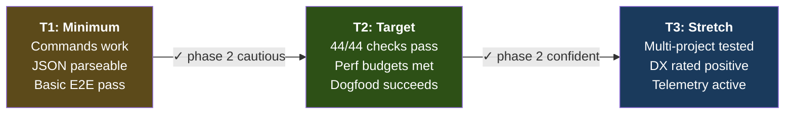
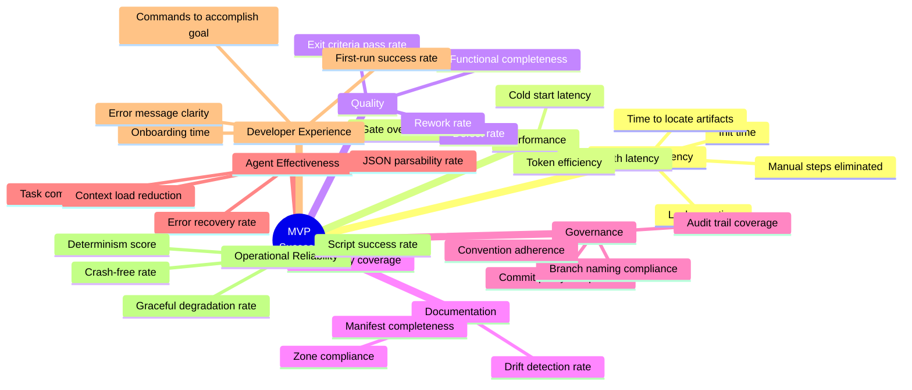
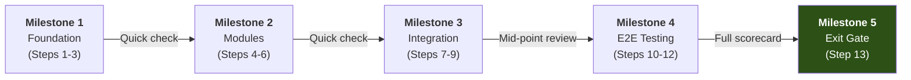
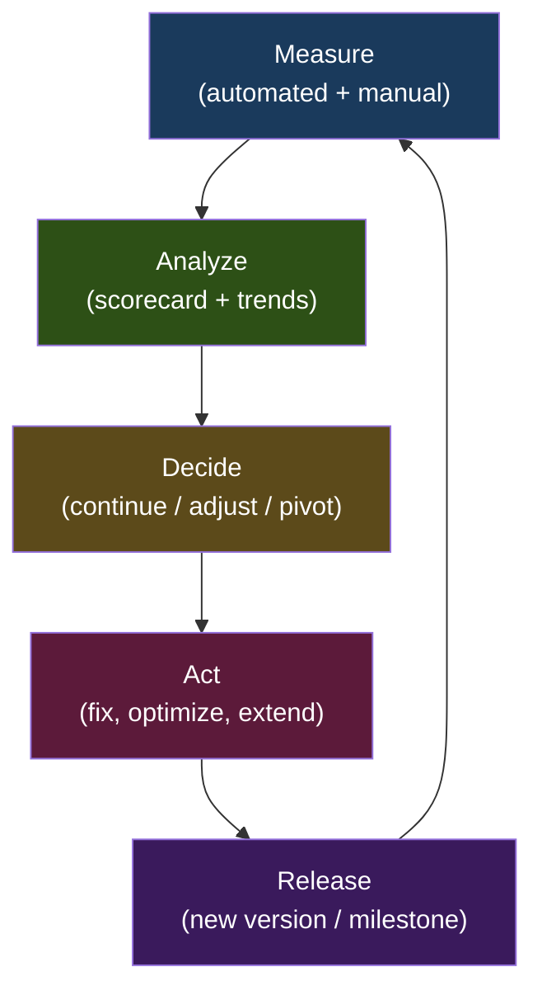

# MVP Success Measurement Blueprint

> **Purpose**: Defines what success means for the Phase 1 MVP, which metrics to track, how to measure them, what thresholds indicate readiness for Phase 2, and how to evolve the measurement framework over time.
>
> **Status**: Active — adopted alongside MVP implementation
> **Date**: 2026-02-24
> **Upstream**: `mvp-blueprint-scope-and-requirements.md`, `mvp-blueprint-delivery-and-governance.md`, `MIND-FRAMEWORK.md`

---

## Table of Contents

1. [MVP Success Definition](#1-mvp-success-definition)
2. [Success Dimensions and KPI Categories](#2-success-dimensions-and-kpi-categories)
3. [Metric Definitions](#3-metric-definitions)
4. [Baseline vs Target Model](#4-baseline-vs-target-model)
5. [Instrumentation and Data Collection Strategy](#5-instrumentation-and-data-collection-strategy)
6. [MVP Quality Scorecard](#6-mvp-quality-scorecard)
7. [Review Cadence and Decision Rituals](#7-review-cadence-and-decision-rituals)
8. [Risks and Measurement Pitfalls](#8-risks-and-measurement-pitfalls)
9. [MVP Exit Criteria Based on Metrics](#9-mvp-exit-criteria-based-on-metrics)
10. [Phase 2 Measurement Evolution](#10-phase-2-measurement-evolution)

---

## 1. MVP Success Definition

### 1.1 What "Success" Means for Phase 1

The Phase 1 MVP succeeds when a developer (or coding agent) can:

1. **Initialize** a structured project with a `mind.toml` manifest and 4-zone documentation layout
2. **Synchronize** declared artifacts with filesystem reality into a `mind.lock` state snapshot
3. **Query** project state — staleness, completeness, dependency impact — through a CLI that produces human-readable and machine-readable output
4. **Execute** deterministic quality gates (build/lint/typecheck/test) with output capture
5. **Validate** manifest consistency (invariants, cycles, structural integrity)
6. **Visualize** the dependency graph as text or Mermaid

And critically: that an **LLM agent orchestrator can consume all of this through JSON + exit codes** without human intervention.

The MVP's job is not to be a polished product. Its job is to **validate the core design** — proving that a TOML manifest, a JSON lock file, a dependency graph, and deterministic gates produce enough structure to make agent-driven workflows measurably better than unstructured ones.

### 1.2 Success Tiers

| Tier | Label | Description | Implications |
|:----:|-------|-------------|-------------|
| **T1** | **Minimum Viable Success** | All 7 CLI commands execute without errors. JSON output is parseable. Exit codes are correct. At least one full workflow (init → lock → gate → status) completes end-to-end on a test project. | Phase 2 can start cautiously. Design is sound but needs hardening. |
| **T2** | **Target Success** | T1 + all 44 exit criteria pass. Performance budgets met. Dogfooding on the framework itself succeeds. Agent integration smoke test passes. Lock file is diff-friendly in git. Error messages are actionable. | Phase 2 proceeds with confidence. No architectural pivots needed. |
| **T3** | **Stretch Success** | T2 + tested on 2+ real projects. Developer experience rated positively (qualitative). CLI is intuitive enough that agents use it without custom instruction fragments. Measurement telemetry produces its first useful insights. | Phase 2 scope can be more ambitious. Community adoption possible earlier. |



### 1.3 Dimensions of Success

Success is not a single axis. The MVP must deliver across **eight dimensions** simultaneously:

| Dimension | What It Measures | Why It Matters for MVP |
|-----------|-----------------|----------------------|
| **Delivery Completeness** | Did we build what was scoped? | Prevents scope creep and proves discipline |
| **Workflow Usability** | Can users/agents achieve their goals? | Validates the CLI design against real needs |
| **Execution Efficiency** | How fast are operations? | Python startup overhead is a known risk; must prove viability |
| **Documentation Quality** | Are artifacts tracked, complete, and current? | The framework's entire thesis is that structured docs enable better workflows |
| **Governance Compliance** | Do conventions hold under real usage? | Validates naming, commit, branching, and quality rules |
| **Agent Compatibility** | Can LLM agents use the CLI effectively? | The primary consumer — if agents can't use it, the design fails |
| **Maintainability** | Is the code simple and extensible? | Must be replaceable by Rust in Phase 3 without rewriting concepts |
| **Operational Reliability** | Does it work consistently without surprises? | Trust requires predictability |

---

## 2. Success Dimensions and KPI Categories

### 2.1 KPI Category Model



### 2.2 Category Descriptions

#### WE — Workflow Efficiency

**Why it matters**: The MVP's core value proposition is making workflows faster and more structured. If `mind lock` takes longer than manually checking files, or `mind status` is slower than grepping the filesystem, the tool adds friction instead of removing it.

**MVP focus**: Measure time savings and step reduction compared to manual alternatives.

---

#### PM — Performance Metrics

**Why it matters**: Python startup overhead (~80ms) leaves narrow margins for the 200ms budget on fast commands. Performance failures at MVP scale would indicate the Python-first strategy is wrong and the Rust rewrite must be prioritized.

**MVP focus**: Every command must meet its latency budget under realistic artifact counts (20-50).

---

#### QM — Quality Metrics

**Why it matters**: A framework that preaches quality must itself be high quality. Low defect rates and minimal rework validate the blueprint-driven approach and demonstrate that detailed specification reduces surprises.

**MVP focus**: Track functional completeness (44 exit criteria), defects found during testing, and corrections needed.

---

#### DM — Documentation Metrics

**Why it matters**: The mind-framework's foundational thesis is that structured documentation drives better software outcomes. The MVP must demonstrate this by keeping its own documentation complete, current, and traceable.

**MVP focus**: Manifest completeness (declared vs actual), drift detection accuracy, and traceability from requirements to artifacts.

---

#### GM — Governance/Compliance Metrics

**Why it matters**: Without governance validation, the framework becomes another set of ignored guidelines. The MVP must prove that conventions (commits, branches, naming) can be measured and enforced — even if enforcement is manual in Phase 1.

**MVP focus**: Compliance rates for commit messages, branch naming, and code quality rules during MVP development itself.

---

#### AE — Agent Effectiveness Metrics

**Why it matters**: The primary consumer of `mind` CLI output is an LLM agent orchestrator. If the JSON output is unparseable, the exit codes are misleading, or the context is too large, agent integration fails — which means the entire design premise fails.

**MVP focus**: JSON parsability, agent smoke test pass rate, and context token usage per operation.

---

#### DX — Developer Experience Metrics

**Why it matters**: Even though agents are the primary consumer, humans set up projects, debug issues, and review agent output. A poor developer experience creates friction that discourages adoption.

**MVP focus**: Onboarding time, first-run success rate, error message actionability.

---

#### OR — Operational Reliability Metrics

**Why it matters**: A CLI tool that crashes, hangs, or silently corrupts data loses trust immediately. The MVP must be boring in its reliability — every command either succeeds cleanly or fails informatively.

**MVP focus**: Zero crashes, deterministic output (same input → same output), graceful degradation on invalid input.

---

## 3. Metric Definitions

### 3.1 Workflow Efficiency (WE)

#### WE-01: Project Initialization Time

| Property | Value |
|----------|-------|
| **Definition** | Wall-clock time from running `mind init` to having a complete `.mind/` directory and first `mind.lock`. |
| **Purpose** | Validates that bootstrapping a new project is fast enough to be routine — not a ceremony. |
| **Formula** | $t_{\text{init}} = t_{\text{end}}(\texttt{mind init}) - t_{\text{start}}(\texttt{mind init})$ |
| **Data source** | `time mind init` on a project with 10-20 declared artifacts |
| **Frequency** | Per milestone (Steps 3, 10, 11 in delivery plan) |
| **Owner** | CLI module |
| **Target** | T1: ≤ 3s · T2: ≤ 2s · T3: ≤ 1s |
| **Interpretation** | Dominated by filesystem operations + first `mind lock`. If > 3s, something is wrong (unnecessary work, redundant hashing). |

#### WE-02: Lock Sync Cycle Time

| Property | Value |
|----------|-------|
| **Definition** | Wall-clock time for a full `mind lock` cycle on a project with *N* declared artifacts. |
| **Purpose** | The most frequent operation — run after every agent action. Must be fast enough to be invisible. |
| **Formula** | $t_{\text{lock}} = t_{\text{end}}(\texttt{mind lock}) - t_{\text{start}}(\texttt{mind lock})$ |
| **Data source** | `time mind lock` on test projects of varying sizes |
| **Frequency** | Per milestone + per artifact count bracket (10, 20, 50) |
| **Owner** | Lock module |
| **Target** | T1: ≤ 2s (50 artifacts) · T2: ≤ 1s (50 artifacts) · T3: ≤ 500ms (50 artifacts) |
| **Interpretation** | Linear with *N*. If superlinear, graph propagation has a bug. If > 2s at 50 artifacts, the Python approach may be too slow. |

#### WE-03: Time to Locate an Artifact

| Property | Value |
|----------|-------|
| **Definition** | Wall-clock time for `mind query "search-term"` to return matching results. |
| **Purpose** | Measures the value of having a structured index vs manual `find`/`grep`. |
| **Formula** | $t_{\text{query}} = t_{\text{end}}(\texttt{mind query}) - t_{\text{start}}(\texttt{mind query})$ |
| **Data source** | `time mind query "requirements" > /dev/null` |
| **Frequency** | Per milestone |
| **Owner** | CLI module |
| **Target** | T1: ≤ 500ms · T2: ≤ 150ms · T3: ≤ 100ms |
| **Interpretation** | If > 500ms, JSON parsing is too slow (malformed `jq` pipeline or Python fallback issue). |

#### WE-04: Manual Steps Eliminated

| Property | Value |
|----------|-------|
| **Definition** | Count of manual operations that were previously required in a standard workflow but are now automated by the CLI. |
| **Purpose** | Quantifies the direct value-add of the MVP tooling over manual procedures. |
| **Formula** | $S_{\text{eliminated}} = S_{\text{pre-MVP}} - S_{\text{post-MVP}}$ where each *S* counts the distinct human steps in a workflow |
| **Data source** | Manual enumeration: compare a full NEW_PROJECT workflow with and without the CLI |
| **Frequency** | Once (baseline) + once after dogfooding |
| **Owner** | Framework owner |
| **Target** | T1: ≥ 5 steps · T2: ≥ 10 steps · T3: ≥ 15 steps |
| **Interpretation** | Each eliminated step is a potential source of error or inconsistency removed. Quality matters more than raw count — eliminating "verify manifest against filesystem" is more valuable than "create a directory." |

#### WE-05: Workflow Completion Time (End-to-End)

| Property | Value |
|----------|-------|
| **Definition** | Total wall-clock time for a complete workflow cycle: init → develop → lock → gate → status. |
| **Purpose** | Holistic measure of whether the tooling makes the overall workflow faster. |
| **Formula** | $T_{\text{workflow}} = \sum_{c \in \text{commands}} t_{c}$ (total CLI time in a standard workflow) |
| **Data source** | Timed execution of the agent integration smoke test (6-step sequence from scope document §6.2) |
| **Frequency** | Per milestone |
| **Owner** | Integration |
| **Target** | T1: ≤ 10s (excluding gate command execution) · T2: ≤ 5s · T3: ≤ 3s |
| **Interpretation** | Total overhead of the framework itself. If > 10s, the tool is overhead rather than accelerator. |

---

### 3.2 Performance Metrics (PM)

#### PM-01: Cold Start Latency (per command)

| Property | Value |
|----------|-------|
| **Definition** | Time from command invocation to first output byte, on a fresh system (no warm caches). |
| **Purpose** | Validates Python startup overhead is within budget. The most critical performance metric. |
| **Formula** | $t_{\text{cold}} = t_{\text{first-output}} - t_{\text{invocation}}$ |
| **Data source** | `time mind {command}` after `sync && echo 3 > /proc/sys/vm/drop_caches` (Linux) or after a fresh terminal |
| **Frequency** | Per milestone, for all 7 commands |
| **Owner** | CLI module |
| **Target** | See table below |
| **Interpretation** | If any command misses its budget, profile Python imports first. Most startup time is `import` statements. |

**Per-command cold start targets**:

| Command | T1 (min) | T2 (target) | T3 (stretch) | Budget source |
|---------|:--------:|:-----------:|:------------:|--------------|
| `mind status` | ≤ 400ms | ≤ 200ms | ≤ 100ms | NFR-PERF-01 |
| `mind status --json` | ≤ 300ms | ≤ 150ms | ≤ 80ms | NFR-PERF-02 |
| `mind lock` (20 artifacts) | ≤ 2000ms | ≤ 1000ms | ≤ 500ms | NFR-PERF-03 |
| `mind lock --verify` | ≤ 1000ms | ≤ 500ms | ≤ 250ms | NFR-PERF-04 |
| `mind query` | ≤ 300ms | ≤ 150ms | ≤ 80ms | NFR-PERF-05 |
| `mind validate` | ≤ 600ms | ≤ 300ms | ≤ 150ms | NFR-PERF-06 |
| `mind graph` | ≤ 400ms | ≤ 200ms | ≤ 100ms | NFR-PERF-07 |
| `mind gate` (overhead) | ≤ 200ms | ≤ 100ms | ≤ 50ms | NFR-PERF-08 |

#### PM-02: Warm Path Latency

| Property | Value |
|----------|-------|
| **Definition** | Time for a command when Python and OS caches are warm (second consecutive invocation). |
| **Purpose** | Represents the realistic performance during an active workflow session. |
| **Formula** | Run command twice; measure the second invocation. |
| **Data source** | `mind {command}; time mind {command}` |
| **Frequency** | Per milestone |
| **Owner** | CLI module |
| **Target** | 60-80% of cold start times |
| **Interpretation** | If warm ≈ cold, there's no OS cache benefit (unlikely for file-heavy operations). Expected ~30% improvement. |

#### PM-03: Token Efficiency (JSON Output Size)

| Property | Value |
|----------|-------|
| **Definition** | Size in bytes and estimated token count of JSON output for standard operations. |
| **Purpose** | LLM agents pay per token. Bloated JSON wastes context window and money. |
| **Formula** | $\text{tokens} \approx \frac{\text{bytes}}{4}$ (rough estimate for JSON) |
| **Data source** | `mind {command} --json \| wc -c` |
| **Frequency** | Per milestone |
| **Owner** | All modules |
| **Target** | `mind status --json` ≤ 2KB for 20 artifacts (NFR-TOKEN-01); `mind gate all --json` ≤ 1KB (NFR-TOKEN-02) |
| **Interpretation** | If output exceeds budget, audit for redundancy (duplicate URIs, verbose field names, unnecessary fields). |

#### PM-04: Lock Latency Scaling Factor

| Property | Value |
|----------|-------|
| **Definition** | How lock time scales as artifact count increases. |
| **Purpose** | Ensures the lock algorithm is $O(n)$ not $O(n^2)$ or worse. |
| **Formula** | $\alpha = \frac{t_{\text{lock}}(50)}{t_{\text{lock}}(10)}$ — ideally ≈ 5 (linear) |
| **Data source** | Run `mind lock` on test projects with 10, 20, 50 artifacts |
| **Frequency** | Once during E2E testing (Step 10) |
| **Owner** | Lock module |
| **Target** | $\alpha \leq 6$ (slightly superlinear acceptable due to graph propagation) |
| **Interpretation** | $\alpha > 8$ indicates a performance bug (quadratic traversal, redundant hashing, unbounded BFS). |

---

### 3.3 Quality Metrics (QM)

#### QM-01: Functional Completeness Score

| Property | Value |
|----------|-------|
| **Definition** | Fraction of the 44 exit criteria (27 FC + 5 PF + 6 QA + 6 IN) that pass. |
| **Purpose** | The single most important quality metric. Directly maps to the Phase 1 exit gate. |
| **Formula** | $\text{FC} = \frac{\text{passing checks}}{44}$ |
| **Data source** | Exit criteria checklist from delivery blueprint §4 |
| **Frequency** | At each milestone: after core build (Step 3), after modules (Step 6), after integration (Step 9), after E2E (Step 10), final check (Step 13) |
| **Owner** | Framework owner |
| **Target** | T1: ≥ 0.80 (35/44) · T2: 1.00 (44/44) · T3: 1.00 + all stretch targets |
| **Interpretation** | < 0.80 at final check → Phase 2 is blocked. 0.80-0.99 → Phase 2 with documented gaps. 1.00 → clean transition. |

#### QM-02: Defect Discovery Rate

| Property | Value |
|----------|-------|
| **Definition** | Number of bugs found per phase of testing: E2E testing vs dogfooding vs post-release. |
| **Purpose** | Measures whether the blueprint-driven approach catches issues early. Most defects should appear during structured E2E testing, not during dogfooding. |
| **Formula** | $D_{\text{phase}} = \text{count of bugs found in that phase}$ |
| **Data source** | Bug tracking (manual log or git issue) |
| **Frequency** | After each testing phase |
| **Owner** | Framework owner |
| **Target** | T2: ≥ 70% of all defects found during E2E (Step 10), ≤ 30% during dogfooding (Step 11) |
| **Interpretation** | If most defects appear during dogfooding, the E2E scenarios are insufficient — add more scenarios for Phase 2. |

#### QM-03: Rework Rate

| Property | Value |
|----------|-------|
| **Definition** | Fraction of implemented components that required significant modification after initial implementation. |
| **Purpose** | Measures blueprint quality. A good blueprint means the first implementation is close to correct. |
| **Formula** | $R = \frac{\text{components with post-impl rework}}{\text{total components}}$ where components = {dispatcher, lock, validate, gate, graph, install, scaffold} |
| **Data source** | Git history: count components with `fix(scope):` commits |
| **Frequency** | Once after Phase 1 completion |
| **Owner** | Framework owner |
| **Target** | T1: ≤ 0.50 · T2: ≤ 0.30 · T3: ≤ 0.15 |
| **Interpretation** | Rework rate ≤ 0.30 validates the blueprint-first methodology. > 0.50 suggests blueprints are too abstract. |

#### QM-04: Codebase Size Compliance

| Property | Value |
|----------|-------|
| **Definition** | Total lines of code across all new files (bin/mind + lib/*.py). |
| **Purpose** | The MVP targets ~620-700 lines. Exceeding 800 lines suggests scope creep or poor abstraction. |
| **Formula** | `wc -l bin/mind lib/*.py` |
| **Data source** | Source code |
| **Frequency** | After each component completion |
| **Owner** | Developer |
| **Target** | T1: ≤ 800 lines · T2: ≤ 700 lines · T3: ≤ 620 lines |
| **Interpretation** | Staying under budget validates the "minimal viable" approach. If over 800, audit for unnecessary complexity. |

---

### 3.4 Documentation Metrics (DM)

#### DM-01: Manifest-Filesystem Drift Rate

| Property | Value |
|----------|-------|
| **Definition** | Fraction of artifacts declared in `mind.toml` that do not exist on the filesystem. |
| **Purpose** | Measures how well the manifest reflects reality — the core problem the framework solves. |
| **Formula** | $\text{drift} = \frac{\text{missing artifacts}}{\text{total declared artifacts}}$ |
| **Data source** | `mind lock --json` → count entries where `exists: false` |
| **Frequency** | After every `mind lock` during dogfooding |
| **Owner** | Lock module |
| **Target** | T2: ≤ 0.10 (10% drift at any given moment during active development); 0.00 at workflow completion |
| **Interpretation** | > 0.20 indicates the manifest is aspirational rather than reflective. Some drift is normal during active work; the metric should converge to 0 at workflow boundaries. |

#### DM-02: Staleness Detection Accuracy

| Property | Value |
|----------|-------|
| **Definition** | Fraction of file changes that `mind lock` correctly identifies as stale (true positive rate). |
| **Purpose** | Validates the hash-comparison + graph-propagation algorithm. False negatives (missed staleness) are dangerous. |
| **Formula** | $\text{accuracy} = \frac{\text{true stale detections}}{\text{actual stale files}}$ |
| **Data source** | Controlled experiment: modify known files, run `mind lock`, compare expected vs actual stale set |
| **Frequency** | Once during E2E testing |
| **Owner** | Lock module |
| **Target** | T1: ≥ 0.90 · T2: 1.00 · T3: 1.00 |
| **Interpretation** | Must be 1.00 for T2. Any false negative is a correctness bug — not a performance issue. |

#### DM-03: Traceability Coverage

| Property | Value |
|----------|-------|
| **Definition** | Fraction of the requirements → design → implementation chain covered by `[[graph]]` edges and document entries in the manifest. |
| **Purpose** | Measures whether the manifest captures enough structure to enable impact analysis via `mind graph`. |
| **Formula** | $\text{traceability} = \frac{\text{artifacts with at least one graph edge}}{\text{total artifacts}}$ |
| **Data source** | Parse `mind.toml`: count documents with at least one `[[graph]]` edge (as source or target) |
| **Frequency** | During dogfooding |
| **Owner** | Framework owner |
| **Target** | T1: ≥ 0.50 · T2: ≥ 0.70 · T3: ≥ 0.90 |
| **Interpretation** | < 0.50 means the graph is too sparse to be useful. 1.00 is not expected in MVP (some artifacts are standalone). |

#### DM-04: Documentation Zone Compliance

| Property | Value |
|----------|-------|
| **Definition** | Fraction of artifacts placed in the correct documentation zone (spec, state, iterations, knowledge) according to Mind Framework v2 rules. |
| **Purpose** | Validates the 4-zone model in practice. Misplaced artifacts indicate the zone model is confusing or the scaffolding doesn't guide users properly. |
| **Formula** | $\text{compliance} = \frac{\text{correctly-zoned artifacts}}{\text{total artifacts}}$ |
| **Data source** | Manual audit + `mind validate` checks for path-zone consistency |
| **Frequency** | During dogfooding |
| **Owner** | Framework owner |
| **Target** | T2: ≥ 0.90 · T3: 1.00 |
| **Interpretation** | < 0.80 → zone definitions need clearer documentation or the scaffolder needs better defaults. |

---

### 3.5 Governance/Compliance Metrics (GM)

#### GM-01: Commit Message Compliance Rate

| Property | Value |
|----------|-------|
| **Definition** | Fraction of commits on `feature/mind-cli-mvp` that follow the conventional commit format: `{type}({scope}): {description}`. |
| **Purpose** | Validates that the commit discipline defined in the governance conventions works in practice. |
| **Formula** | $\text{compliance} = \frac{\text{commits matching regex}\ \texttt{^(feat\|fix\|docs\|refactor\|test\|chore)\textbackslash(.*\textbackslash):}}{\text{total commits}}$ |
| **Data source** | `git log --oneline feature/mind-cli-mvp \| grep -cP '^[a-f0-9]+ (feat\|fix\|docs\|refactor\|test\|chore)\('` |
| **Frequency** | End of each delivery step |
| **Owner** | Developer |
| **Target** | T1: ≥ 0.80 · T2: ≥ 0.95 · T3: 1.00 |
| **Interpretation** | Occasional deviation is human. Systematic non-compliance means the convention is too rigid or poorly documented. |

#### GM-02: Branch Naming Compliance

| Property | Value |
|----------|-------|
| **Definition** | Whether all branches follow the `{type}/` prefix convention. |
| **Purpose** | Validates branch strategy execution. |
| **Formula** | Boolean: all branches match `^(feature\|bugfix\|refactor)/` |
| **Data source** | `git branch -a` |
| **Frequency** | End of Phase 1 |
| **Owner** | Developer |
| **Target** | 1.00 (binary: compliant or not) |
| **Interpretation** | Simple check. Failure indicates oversight. |

#### GM-03: Quality Rule Adherence

| Property | Value |
|----------|-------|
| **Definition** | Number of quality rule violations found in the codebase (per §1.5 of delivery blueprint: no bare except, no print(), no hardcoded paths, etc.). |
| **Purpose** | Measures whether the quality rules defined in governance are maintainable and followed. |
| **Formula** | $V = \sum_{\text{rule}} \text{violations}(r)$ |
| **Data source** | `grep -rn` checks per rule (see delivery blueprint §4.3 QA-02 through QA-06) |
| **Frequency** | After each component completion |
| **Owner** | Developer |
| **Target** | T1: ≤ 5 violations · T2: 0 violations · T3: 0 violations |
| **Interpretation** | Non-zero at T2 means rules are too strict or code needs cleanup before Phase 2. |

#### GM-04: Audit Trail Coverage

| Property | Value |
|----------|-------|
| **Definition** | Fraction of CLI commands that produce an audit log entry in `.mind/logs/audit.jsonl`. |
| **Purpose** | Validates the audit logging implementation. Audit trails enable later analysis and debugging. |
| **Formula** | $\text{coverage} = \frac{\text{commands with audit entries}}{\text{total commands executed}}$ |
| **Data source** | Cross-reference `audit.jsonl` with known command invocations |
| **Frequency** | During E2E testing |
| **Owner** | CLI module |
| **Target** | T1: ≥ 0.50 · T2: ≥ 0.90 · T3: 1.00 |
| **Interpretation** | < 0.50 means audit logging is incomplete. 1.00 may be aspirational for MVP if some bash-inline commands don't log. |

---

### 3.6 Agent Effectiveness Metrics (AE)

#### AE-01: JSON Parsability Rate

| Property | Value |
|----------|-------|
| **Definition** | Fraction of `--json` command invocations that produce valid, schema-compliant JSON on stdout. |
| **Purpose** | Agents parse this output programmatically. Invalid JSON causes agent workflow failures. |
| **Formula** | $\text{parsability} = \frac{\text{invocations with valid JSON stdout}}{\text{total --json invocations}}$ |
| **Data source** | `mind {command} --json \| python3 -m json.tool` for each command during E2E |
| **Frequency** | Per milestone |
| **Owner** | All modules |
| **Target** | T1: ≥ 0.95 · T2: 1.00 · T3: 1.00 |
| **Interpretation** | Must be 1.00 for T2. Any invalid JSON is a blocking bug. Common causes: error messages mixed into stdout, ANSI codes in JSON mode. |

#### AE-02: Agent Task Completion Rate

| Property | Value |
|----------|-------|
| **Definition** | Fraction of agent workflow steps that complete successfully when using `mind` CLI output for decisions. Measured during the agent integration smoke test. |
| **Purpose** | End-to-end validation of the agent ↔ CLI interface. |
| **Formula** | $\text{completion} = \frac{\text{smoke test steps passing}}{6}$ (6-step smoke test from scope §6.2) |
| **Data source** | Execute the full smoke test script; count passing steps |
| **Frequency** | Per milestone after integration is complete |
| **Owner** | Integration |
| **Target** | T1: ≥ 4/6 · T2: 6/6 · T3: 6/6 + tested with ≥ 2 different agent models |
| **Interpretation** | < 4/6 → fundamental interface issue (likely exit codes or JSON schema mismatch). |

#### AE-03: Context Load Reduction

| Property | Value |
|----------|-------|
| **Definition** | Estimated token count of `mind status --json` output compared to the equivalent information gathered by reading raw files. |
| **Purpose** | Quantifies the context window savings for agents. The whole point of JSON output is that agents don't need to read raw files. |
| **Formula** | $\text{reduction} = 1 - \frac{\text{tokens}(\texttt{mind status --json})}{\text{tokens}(\text{reading all artifact files directly})}$ |
| **Data source** | Compare `wc -c` of `mind status --json` vs `cat` of all artifact files |
| **Frequency** | Once during dogfooding |
| **Owner** | CLI module |
| **Target** | T2: ≥ 0.80 (80% reduction) · T3: ≥ 0.90 |
| **Interpretation** | The status JSON should be a compact summary (2KB) while the raw files might be 50-200KB. If reduction < 0.80, the JSON is too verbose or includes unnecessary data. |

#### AE-04: Error Recovery Rate

| Property | Value |
|----------|-------|
| **Definition** | Fraction of error conditions where the error message alone is sufficient for an agent (or human) to diagnose and fix the issue without additional investigation. |
| **Purpose** | Validates the "actionable error messages" principle. |
| **Formula** | Qualitative assessment: for each error scenario, can the fix be derived from the error message alone? |
| **Data source** | Review all unique error messages produced during testing |
| **Frequency** | Once during E2E testing |
| **Owner** | All modules |
| **Target** | T1: ≥ 0.70 · T2: ≥ 0.90 · T3: 1.00 |
| **Interpretation** | Error messages must follow the pattern: "Error: {what happened}. {how to fix}." Messages missing the fix suggestion fail this metric. |

---

### 3.7 Developer Experience Metrics (DX)

#### DX-01: Onboarding Time

| Property | Value |
|----------|-------|
| **Definition** | Time for a new user to install the framework, create a `mind.toml` for an existing project, and run their first successful `mind status`. |
| **Purpose** | Measures adoption friction. If onboarding takes > 30 minutes, the framework won't be adopted. |
| **Formula** | $t_{\text{onboard}} = t_{\text{first-success}} - t_{\text{start}}$ |
| **Data source** | Timed walkthrough (self or recruited tester) |
| **Frequency** | Once (T3 only, or during dogfooding with a fresh perspective) |
| **Owner** | Framework owner |
| **Target** | T2: ≤ 30min · T3: ≤ 15min |
| **Interpretation** | Includes reading docs, running `install.sh`, writing `mind.toml`, and running first commands. If > 30min, the onboarding docs or the scaffolder need improvement. |

#### DX-02: Commands to Accomplish Goal

| Property | Value |
|----------|-------|
| **Definition** | Average number of CLI commands needed for standard workflows: "check project health", "verify before commit", "run quality gates". |
| **Purpose** | Fewer steps = better UX. The agent integration relies on predictable command sequences. |
| **Formula** | Count commands per workflow. |
| **Data source** | Manual workflow walkthroughs |
| **Frequency** | Once after all commands are wired |
| **Owner** | CLI module |
| **Target** | "Check health": 1 (`mind status`). "Pre-commit check": 2 (`mind lock --verify && mind gate all`). "Full sync": 1 (`mind lock`). |
| **Interpretation** | If any standard workflow requires > 3 commands, consider adding a compound command in Phase 2. |

#### DX-03: First-Run Success Rate

| Property | Value |
|----------|-------|
| **Definition** | Fraction of first-time command invocations that succeed or produce an actionable error (as opposed to stack traces, cryptic failures, or hangs). |
| **Purpose** | First impressions matter. A stack trace on first use destroys confidence. |
| **Formula** | $\text{success} = \frac{\text{clean outcomes (success or actionable error)}}{\text{total first-run attempts}}$ |
| **Data source** | Dogfooding observations |
| **Frequency** | During dogfooding |
| **Owner** | All modules |
| **Target** | T2: ≥ 0.95 · T3: 1.00 |
| **Interpretation** | A "clean outcome" means either the command succeeded OR it failed with a human-readable error message (no Python tracebacks). |

#### DX-04: Error Message Clarity Score

| Property | Value |
|----------|-------|
| **Definition** | Qualitative score (1-5) of error message usefulness, averaged across all unique error paths. |
| **Purpose** | Validates the "Error: {what}. {fix}." pattern produces genuinely helpful messages. |
| **Formula** | Rate each unique error message: 1=cryptic, 2=describes problem, 3=describes problem+context, 4=describes problem+context+suggestion, 5=describes problem+context+exact fix command. Average. |
| **Data source** | Manual review of all error paths |
| **Frequency** | Once during E2E testing |
| **Owner** | All modules |
| **Target** | T1: ≥ 3.0 · T2: ≥ 4.0 · T3: ≥ 4.5 |
| **Interpretation** | < 3.0 → error messages need rewriting. ≥ 4.0 → messages follow the pattern consistently. |

---

### 3.8 Operational Reliability Metrics (OR)

#### OR-01: Script Execution Success Rate

| Property | Value |
|----------|-------|
| **Definition** | Fraction of CLI command invocations that exit cleanly (no crashes, no hangs, no unexpected behavior). Includes both success (exit 0) and expected failures (exit 1-4). |
| **Purpose** | Measures basic reliability. Every invocation must either succeed or fail cleanly. |
| **Formula** | $\text{success} = \frac{\text{clean exits (0-4)}}{\text{total invocations}}$ |
| **Data source** | Run all commands in E2E test suite; count exits that are 0-4 vs unexpected |
| **Frequency** | Per milestone |
| **Owner** | All modules |
| **Target** | T1: ≥ 0.95 · T2: 1.00 · T3: 1.00 |
| **Interpretation** | < 1.00 at T2 → there's a crash bug. Common causes: unhandled exceptions, infinite loops in graph traversal, subprocess hangs. |

#### OR-02: Determinism Score

| Property | Value |
|----------|-------|
| **Definition** | Fraction of commands that produce identical output when run twice with the same input. |
| **Purpose** | Reproducibility is essential for agent integration. Non-deterministic output means agents can't build reliable logic on top of CLI results. |
| **Formula** | Run each command twice with same input, `diff` the output. $\text{determinism} = \frac{\text{identical pairs}}{\text{total pairs}}$ |
| **Data source** | Controlled test: for each command, run twice, diff stdout |
| **Frequency** | Once during E2E testing |
| **Owner** | All modules |
| **Target** | T2: 1.00 (excluding timestamps in lock file) · T3: 1.00 |
| **Interpretation** | Timestamps are inherently non-deterministic but should be the ONLY varying element. Any other variation is a bug. |

#### OR-03: Graceful Degradation Rate

| Property | Value |
|----------|-------|
| **Definition** | Fraction of invalid-input scenarios where the CLI produces a helpful error rather than crashing. |
| **Purpose** | Measures robustness against bad input (missing files, malformed TOML, corrupt JSON). |
| **Formula** | Test with known invalid inputs; $\text{graceful} = \frac{\text{actionable error responses}}{\text{total invalid-input tests}}$ |
| **Data source** | Targeted invalid-input testing: missing `mind.toml`, malformed TOML, corrupt `mind.lock`, missing Python, etc. |
| **Frequency** | Once during E2E testing |
| **Owner** | All modules |
| **Target** | T1: ≥ 0.80 · T2: ≥ 0.95 · T3: 1.00 |
| **Interpretation** | Each unhandled crash is a candidate for a try/except wrapper with an actionable error message. |

#### OR-04: Idempotency Compliance

| Property | Value |
|----------|-------|
| **Definition** | Fraction of commands that are safe to run multiple times without side effects (beyond the intended effect). |
| **Purpose** | Agents may retry commands. Non-idempotent commands cause data corruption or duplicate entries. |
| **Formula** | For each command: run once, record state. Run again, verify state matches. |
| **Data source** | Controlled test |
| **Frequency** | Once during E2E testing |
| **Owner** | All modules |
| **Target** | T2: 1.00 for all commands |
| **Interpretation** | `mind init` must be idempotent (no duplicate `.gitignore` entries). `mind lock` must be idempotent (same lock if files unchanged). `mind gate` is inherently non-idempotent (re-runs commands) but should produce identical gate results. |

---

### 3.9 Metric Summary Table

| ID | Metric | Category | T1 (Min) | T2 (Target) | T3 (Stretch) | Frequency |
|----|--------|:--------:|:--------:|:-----------:|:------------:|:---------:|
| WE-01 | Project init time | WE | ≤ 3s | ≤ 2s | ≤ 1s | Milestone |
| WE-02 | Lock sync cycle time | WE | ≤ 2s | ≤ 1s | ≤ 500ms | Milestone |
| WE-03 | Time to locate artifact | WE | ≤ 500ms | ≤ 150ms | ≤ 100ms | Milestone |
| WE-04 | Manual steps eliminated | WE | ≥ 5 | ≥ 10 | ≥ 15 | Once |
| WE-05 | Workflow completion time | WE | ≤ 10s | ≤ 5s | ≤ 3s | Milestone |
| PM-01 | Cold start latency | PM | See table | See table | See table | Milestone |
| PM-02 | Warm path latency | PM | — | 60-80% cold | — | Milestone |
| PM-03 | Token efficiency | PM | — | ≤ 2KB/status | — | Milestone |
| PM-04 | Lock scaling factor | PM | — | α ≤ 6 | — | Once |
| QM-01 | Functional completeness | QM | ≥ 80% | 100% | 100%+ | Milestone |
| QM-02 | Defect discovery rate | QM | — | ≥ 70% in E2E | — | Per phase |
| QM-03 | Rework rate | QM | ≤ 0.50 | ≤ 0.30 | ≤ 0.15 | Once |
| QM-04 | Codebase size | QM | ≤ 800 | ≤ 700 | ≤ 620 | Per step |
| DM-01 | Manifest-filesystem drift | DM | — | ≤ 10% | 0% | Continuous |
| DM-02 | Staleness detection accuracy | DM | ≥ 0.90 | 1.00 | 1.00 | Once |
| DM-03 | Traceability coverage | DM | ≥ 0.50 | ≥ 0.70 | ≥ 0.90 | Dogfood |
| DM-04 | Zone compliance | DM | — | ≥ 0.90 | 1.00 | Dogfood |
| GM-01 | Commit compliance | GM | ≥ 0.80 | ≥ 0.95 | 1.00 | Per step |
| GM-02 | Branch naming | GM | — | 1.00 | 1.00 | Once |
| GM-03 | Quality rule adherence | GM | ≤ 5 | 0 | 0 | Per step |
| GM-04 | Audit trail coverage | GM | ≥ 0.50 | ≥ 0.90 | 1.00 | E2E |
| AE-01 | JSON parsability | AE | ≥ 0.95 | 1.00 | 1.00 | Milestone |
| AE-02 | Agent task completion | AE | ≥ 4/6 | 6/6 | 6/6 | Milestone |
| AE-03 | Context load reduction | AE | — | ≥ 80% | ≥ 90% | Once |
| AE-04 | Error recovery rate | AE | ≥ 0.70 | ≥ 0.90 | 1.00 | E2E |
| DX-01 | Onboarding time | DX | — | ≤ 30min | ≤ 15min | Once |
| DX-02 | Commands per goal | DX | — | 1-2 | 1 | Once |
| DX-03 | First-run success rate | DX | — | ≥ 0.95 | 1.00 | Dogfood |
| DX-04 | Error message clarity | DX | ≥ 3.0 | ≥ 4.0 | ≥ 4.5 | E2E |
| OR-01 | Execution success rate | OR | ≥ 0.95 | 1.00 | 1.00 | Milestone |
| OR-02 | Determinism | OR | — | 1.00* | 1.00* | Once |
| OR-03 | Graceful degradation | OR | ≥ 0.80 | ≥ 0.95 | 1.00 | E2E |
| OR-04 | Idempotency | OR | — | 1.00 | 1.00 | Once |

*\* Excluding timestamps*

---

## 4. Baseline vs Target Model

### 4.1 Establishing the Baseline (Pre-MVP)

Before the MVP exists, the "framework" consists of:

- A set of agent markdown files (`.claude/agents/`)
- Convention documents (`.claude/conventions/`)
- A bash `install.sh` + `scaffold.sh`
- No CLI, no manifest, no lock file, no state tracking

The baseline is measured by documenting a **standard workflow** under the current system:

| Workflow Step | Pre-MVP Method | Estimated Time | Manual Steps |
|---------------|---------------|:--------------:|:------------:|
| Initialize project documentation | Manually create `docs/` and write first files | 15-30 min | 8-12 |
| Check documentation completeness | Manually scan `docs/` for expected files | 5-10 min | 3-5 |
| Detect stale documentation | Re-read files, mentally compare with requirements | 10-30 min | 5-10+ |
| Verify requirements traceability | Manually cross-reference docs | 15-60 min | 10-20+ |
| Run quality checks | Manually invoke build/lint/test; interpret output | 2-5 min | 4-6 |
| Generate project status summary for agent | Describe project state in plain text prompt | 5-15 min | 3-5 |
| Detect dependency impact of changes | Mentally trace through related documents | 10-30 min | 5-15+ |
| **Totals** | | **62-180 min** | **38-73** |

### 4.2 Post-MVP Comparison

The same workflow with `mind` CLI:

| Workflow Step | Post-MVP Method | Estimated Time | Manual Steps |
|---------------|----------------|:--------------:|:------------:|
| Initialize project documentation | `scaffold.sh` + `mind init` | < 1 min | 2 |
| Check documentation completeness | `mind status` | < 1s | 1 |
| Detect stale documentation | `mind lock` + `mind query --stale` | < 2s | 2 |
| Verify requirements traceability | `mind graph` + `mind validate` | < 1s | 2 |
| Run quality checks | `mind gate all` | Time of tests + < 1s overhead | 1 |
| Generate project status summary for agent | `mind status --json` | < 200ms | 1 (or 0 if agent invokes) |
| Detect dependency impact of changes | `mind graph --downstream doc:changed` | < 200ms | 1 |
| **Totals** | | **< 1 min + test time** | **10** |

### 4.3 Improvement Thresholds

| Comparison | Formula | Must Improve? | T2 Target |
|-----------|---------|:-------------:|:---------:|
| Time reduction | $\frac{t_{\text{pre}} - t_{\text{post}}}{t_{\text{pre}}}$ | **Yes** | ≥ 80% reduction |
| Step reduction | $\frac{S_{\text{pre}} - S_{\text{post}}}{S_{\text{pre}}}$ | **Yes** | ≥ 70% reduction |
| Accuracy improvement (drift detection) | $\text{accuracy}_{\text{post}} - \text{accuracy}_{\text{pre}}$ | **Yes** | Pre: ~60% (human); Post: 100% (automated) |
| Agent enablement | Boolean: can agent query project state via CLI? | **Yes** | Pre: No. Post: Yes. |

### 4.4 Avoiding Vanity Metrics

| Vanity Metric | Why It's Misleading | Better Alternative |
|--------------|--------------------|--------------------|
| "Number of commands available" | More commands ≠ more value; could indicate bloat | WE-04: Manual steps eliminated |
| "Lines of code written" | More code ≠ more quality | QM-04: Codebase stays ≤ 800 lines |
| "Number of tests passing" | Tests can be trivial | QM-01: Exit criteria completeness (44 specific checks) |
| "Percentage of code covered" | Coverage ≠ correctness | DM-02: Staleness detection accuracy (correctness) |
| "Number of features" | Features without users are waste | AE-02: Agent task completion (proves features work) |
| "Commits per day" | Velocity metric divorced from value | QM-03: Rework rate (quality of each commit) |

**Rule**: Every metric in this blueprint must map to a real user capability or system property. If a metric doesn't change a decision, remove it.

---

## 5. Instrumentation and Data Collection Strategy

### 5.1 Data Source Inventory

```mermaid
flowchart TD
    subgraph Automated["Automatically Collected"]
        CLI["CLI Execution<br/>Exit codes, JSON output,<br/>execution timing"]
        LOCK["mind.lock<br/>Artifact counts, hashes,<br/>staleness, completeness"]
        AUDIT[".mind/logs/audit.jsonl<br/>Command history,<br/>timestamps"]
        GIT["Git Metadata<br/>Commit messages,<br/>branch names, diff stats"]
        GATE[".mind/outputs/<br/>Gate execution results,<br/>pass/fail, duration"]
    end

    subgraph Manual["Manually Collected (MVP)"]
        CHECKLIST["Exit Criteria Checklist<br/>44 checkbox items"]
        TIMING["Timing Measurements<br/>time command runs"]
        REVIEW["Qualitative Review<br/>Error message clarity,<br/>DX observations"]
        BASELINE["Baseline Capture<br/>Pre-MVP workflow timing"]
    end

    subgraph Derived["Derived from Other Sources"]
        WC["Code Size<br/>wc -l bin/mind lib/*.py"]
        GREP["Quality Checks<br/>grep for violations"]
        DIFF["Diff Analysis<br/>git diff for determinism"]
        JQ["JSON Validation<br/>python3 -m json.tool"]
    end

    CLI --> METRICS["Metric<br/>Computation"]
    LOCK --> METRICS
    AUDIT --> METRICS
    GIT --> METRICS
    GATE --> METRICS
    CHECKLIST --> METRICS
    TIMING --> METRICS
    REVIEW --> METRICS
    BASELINE --> METRICS
    WC --> METRICS
    GREP --> METRICS
    DIFF --> METRICS
    JQ --> METRICS

    style Automated fill:#2d5016,color:#fff
    style Manual fill:#5c4a1a,color:#fff
    style Derived fill:#1a3a5c,color:#fff
```



### 5.2 Automatic Collection (Available in MVP)

These sources produce data as a side-effect of normal CLI operation:

| Source | Data Produced | Metrics It Feeds | Collection Mechanism |
|--------|--------------|-----------------|---------------------|
| `mind lock --json` | `changed`, `unchanged`, `stale`, `missing` counts | DM-01, DM-02, WE-02 | Redirect stdout to file |
| `mind status --json` | Full project state as JSON | PM-03, AE-01, AE-03 | Redirect stdout to file |
| `mind gate all --json` | Per-gate status, duration, log paths | PM-01 (gate overhead), OR-01 | Redirect stdout to file |
| `mind validate --json` | Errors, warnings arrays | QM-01 (partial), GM-03 (partial) | Redirect stdout to file |
| `.mind/logs/audit.jsonl` | Command, timestamp, exit code, duration per invocation | GM-04, OR-01, WE-05 | Written automatically by CLI |
| `.mind/outputs/{gate}/*.log` | Gate stdout/stderr capture | OR-01 | Written automatically by gate runner |
| Exit codes (`$?`) | 0-4 semantic exit | AE-01 (implicit), OR-01 | Shell variable |
| `mind.lock` | Resolved map with hashes, staleness, completeness | DM-01, DM-02, DM-03 | File on disk |

### 5.3 Semi-Automatic Collection (Shell Scripts)

These require a small wrapper script but no modification to the CLI:

```bash
#!/usr/bin/env bash
# measure.sh — Lightweight telemetry collector for MVP metrics
# Run after each milestone to capture a snapshot

set -euo pipefail

PROJECT_ROOT="${1:-.}"
MEASUREMENT_DIR="$PROJECT_ROOT/.mind/measurements"
TIMESTAMP=$(date -u +"%Y-%m-%dT%H:%M:%SZ")
OUTFILE="$MEASUREMENT_DIR/$TIMESTAMP.json"

mkdir -p "$MEASUREMENT_DIR"

echo "=== MVP Metric Snapshot: $TIMESTAMP ==="

# PM-01: Cold start latency
measure_time() {
    local cmd="$1"
    local label="$2"
    local start end elapsed
    start=$(date +%s%N)
    eval "$cmd" > /dev/null 2>&1 || true
    end=$(date +%s%N)
    elapsed=$(( (end - start) / 1000000 ))
    echo "  $label: ${elapsed}ms"
    echo "$elapsed"
}

echo "{" > "$OUTFILE"
echo "  \"timestamp\": \"$TIMESTAMP\"," >> "$OUTFILE"
echo "  \"performance\": {" >> "$OUTFILE"

t_status=$(measure_time "mind status" "mind status")
t_lock=$(measure_time "mind lock" "mind lock")
t_verify=$(measure_time "mind lock --verify" "mind lock --verify")
t_query=$(measure_time "mind query test" "mind query")
t_validate=$(measure_time "mind validate" "mind validate")
t_graph=$(measure_time "mind graph" "mind graph")
t_gate=$(measure_time "mind gate test" "mind gate (overhead)")

echo "    \"status_ms\": $t_status," >> "$OUTFILE"
echo "    \"lock_ms\": $t_lock," >> "$OUTFILE"
echo "    \"verify_ms\": $t_verify," >> "$OUTFILE"
echo "    \"query_ms\": $t_query," >> "$OUTFILE"
echo "    \"validate_ms\": $t_validate," >> "$OUTFILE"
echo "    \"graph_ms\": $t_graph," >> "$OUTFILE"
echo "    \"gate_overhead_ms\": $t_gate" >> "$OUTFILE"
echo "  }," >> "$OUTFILE"

# QM-04: Codebase size
total_lines=$(wc -l bin/mind lib/*.py 2>/dev/null | tail -1 | awk '{print $1}')
echo "  \"codebase_lines\": $total_lines," >> "$OUTFILE"

# PM-03: JSON output sizes
status_bytes=$(mind status --json 2>/dev/null | wc -c)
echo "  \"status_json_bytes\": $status_bytes," >> "$OUTFILE"

# AE-01: JSON parsability
json_valid=0
for cmd in "mind status --json" "mind lock --json" "mind validate --json"; do
    if eval "$cmd" 2>/dev/null | python3 -m json.tool > /dev/null 2>&1; then
        json_valid=$((json_valid + 1))
    fi
done
echo "  \"json_parsable\": $json_valid," >> "$OUTFILE"
echo "  \"json_total\": 3" >> "$OUTFILE"

echo "}" >> "$OUTFILE"
echo ""
echo "Snapshot saved to: $OUTFILE"
```

### 5.4 Manual Collection (Checklists and Observations)

These metrics require human judgment and cannot yet be automated:

| Metric | Collection Method | Template |
|--------|------------------|----------|
| QM-01: Exit criteria | Walk through the 44-item checklist | Checkboxes in delivery blueprint §4 |
| QM-03: Rework rate | Review git log for `fix()` commits per component | `git log --oneline \| grep '^.*fix('` |
| DX-01: Onboarding time | Timed walkthrough with fresh perspective | Stopwatch + notes |
| DX-04: Error message clarity | Rate each unique error path 1-5 | Spreadsheet or markdown table |
| WE-04: Manual steps eliminated | Compare pre-MVP vs post-MVP workflow step count | Before/after table (§4.1 vs §4.2) |
| DM-04: Zone compliance | Audit artifact placement against zone rules | Manual review |
| AE-04: Error recovery rate | Test each error scenario, judge actionability | Scenario-by-scenario checklist |

**Manual measurement template** (copy to `.mind/measurements/manual-{date}.md`):

```markdown
# Manual Measurement — {date}

## Exit Criteria (QM-01)
- FC passing: __/27
- PF passing: __/5
- QA passing: __/6
- IN passing: __/6
- Total: __/44

## Rework Assessment (QM-03)
| Component | Needed rework? | Why? |
|-----------|:--------------:|------|
| bin/mind  | ☐ | |
| mind_lock | ☐ | |
| mind_validate | ☐ | |
| mind_gate | ☐ | |
| mind_graph | ☐ | |
| install.sh | ☐ | |
| scaffold.sh | ☐ | |
Rework rate: __/7 = __

## Error Message Clarity (DX-04)
| Error scenario | Message | Rating (1-5) | Notes |
|----------------|---------|:------------:|-------|
| Missing mind.toml | | | |
| Malformed TOML | | | |
| Missing Python 3.11 | | | |
| Unknown command | | | |
| Corrupt mind.lock | | | |
| ... | | | |
Average: __

## Observations
- ...
```

### 5.5 Phase 2 Automation Roadmap

| Currently Manual | Phase 2 Automation |
|-----------------|-------------------|
| Performance timing (shell script) | Built into CLI: `mind --timing` flag adds `"timing_ms": N` to all JSON output |
| Exit criteria checklist | `mind self-check` command that runs all 44 checks programmatically |
| JSON validation | CI pipeline validates all `--json` output on every commit |
| Error message review | Automated error scenario test suite |
| Codebase size check | CI gate: fail if `wc -l` > 800 |
| Measurement snapshots | `mind measure` command that generates the full snapshot |

---

## 6. MVP Quality Scorecard

### 6.1 Scorecard Design

The scorecard combines the 8 KPI categories into a single evaluation using weighted scoring.

**Weighting rationale**: Categories are weighted by their importance to the MVP's **design validation mission** (the primary job of Phase 1).

| Category | Weight | Justification |
|----------|:------:|--------------|
| Functional Completeness (QM-01) | 25% | Binary: does the thing work? Highest weight. |
| Agent Compatibility (AE) | 20% | Primary consumer. If agents can't use it, Phase 2 is pointless. |
| Performance (PM) | 15% | Python viability is a known risk. Must prove budgets are achievable. |
| Operational Reliability (OR) | 15% | Trust requires predictability. |
| Documentation Quality (DM) | 10% | Validates the framework's own thesis. |
| Governance Compliance (GM) | 5% | Important but secondary to core functionality. |
| Developer Experience (DX) | 5% | Agents are primary; DX is secondary in MVP. |
| Workflow Efficiency (WE) | 5% | Time savings follow from correctness. |

### 6.2 Scoring Method

Each category receives a **normalized score from 0.0 to 1.0** based on its metrics:

$$S_{\text{category}} = \frac{\sum_{m \in \text{metrics}} w_m \cdot \text{score}(m)}{\sum_{m \in \text{metrics}} w_m}$$

Where $\text{score}(m)$ is:

| Metric result | Score |
|:----------:|:-----:|
| Meets T3 (stretch) | 1.0 |
| Meets T2 (target) | 0.8 |
| Meets T1 (minimum) | 0.5 |
| Below T1 | 0.0 |

**Composite score**:

$$S_{\text{total}} = \sum_{c \in \text{categories}} W_c \cdot S_c$$

### 6.3 Classification Thresholds

| Range | Classification | Label | Meaning |
|:-----:|:-----------:|:-----:|---------|
| $S \geq 0.85$ | 🟢 | **Green** | Phase 2 proceeds with full confidence |
| $0.70 \leq S < 0.85$ | 🟡 | **Yellow** | Phase 2 proceeds with documented concerns |
| $0.50 \leq S < 0.70$ | 🟠 | **Orange** | Phase 2 requires specific remediation items first |
| $S < 0.50$ | 🔴 | **Red** | Phase 1 needs significant rework before transition |

### 6.4 Minimum Category Thresholds (Veto Power)

Even if the composite score is Green, individual categories can **block** Phase 2:

| Category | Minimum Score to Proceed | Rationale |
|----------|:------------------------:|-----------|
| Functional Completeness (QM-01) | ≥ 0.80 (35/44 checks) | Can't proceed with fundamental breakage |
| Agent Compatibility (AE) | ≥ 0.50 (3/6 smoke test + valid JSON) | Primary consumer must work at least basically |
| Operational Reliability (OR) | ≥ 0.50 (no crashes on valid input) | Crashes destroy trust immediately |

**Veto rule**: If any category with a minimum threshold scores below that threshold, the overall classification is **Red** regardless of composite score.

### 6.5 Scorecard Template

```
╔══════════════════════════════════════════════════════════════╗
║                   MVP QUALITY SCORECARD                      ║
║                   Date: ___________                          ║
║                   Evaluator: ___________                     ║
╠══════════════════════════════════════════════════════════════╣
║                                                              ║
║  Category               Weight    Score    Weighted          ║
║  ─────────────────────── ──────── ──────── ────────          ║
║  Functional Completeness  25%     [ ____ ] [ ____ ]          ║
║  Agent Compatibility      20%     [ ____ ] [ ____ ]          ║
║  Performance              15%     [ ____ ] [ ____ ]          ║
║  Operational Reliability  15%     [ ____ ] [ ____ ]          ║
║  Documentation Quality    10%     [ ____ ] [ ____ ]          ║
║  Governance Compliance     5%     [ ____ ] [ ____ ]          ║
║  Developer Experience      5%     [ ____ ] [ ____ ]          ║
║  Workflow Efficiency        5%     [ ____ ] [ ____ ]          ║
║                           ─────           ────────           ║
║                           100%     Total: [ ____ ]           ║
║                                                              ║
║  Classification: [ 🟢 🟡 🟠 🔴 ]                            ║
║                                                              ║
║  Veto checks:                                                ║
║    QM-01 ≥ 0.80? [ ☐ ]                                      ║
║    AE    ≥ 0.50? [ ☐ ]                                      ║
║    OR    ≥ 0.50? [ ☐ ]                                      ║
║                                                              ║
║  Decision: [ PROCEED / REMEDIATE / REWORK ]                  ║
║                                                              ║
║  Notes:                                                      ║
║  ___________________________________________________________║
║  ___________________________________________________________║
║                                                              ║
╚══════════════════════════════════════════════════════════════╝
```

### 6.6 Example Scored Scenario

**Scenario**: MVP is mostly complete. All commands work, but `mind graph` has a minor rendering bug and one performance budget is slightly missed.

| Category | Score | Weighted |
|----------|:-----:|:--------:|
| Functional Completeness | 0.73 (42/44 checks × mapped to score: ~T2 for most, T1 for graph) | 0.183 |
| Agent Compatibility | 0.80 (6/6 smoke, valid JSON, good errors) | 0.160 |
| Performance | 0.65 (7/8 budgets met, `mind validate` at 350ms > 300ms target) | 0.098 |
| Operational Reliability | 0.80 (no crashes, deterministic, minor degradation gap) | 0.120 |
| Documentation Quality | 0.70 (drift low, staleness accurate, traceability ok) | 0.070 |
| Governance Compliance | 0.90 (good commits, one branch slip) | 0.045 |
| Developer Experience | 0.60 (good messages, onboarding not tested) | 0.030 |
| Workflow Efficiency | 0.80 (all timings good) | 0.040 |
| **Total** | | **0.746** |

**Classification**: 🟡 Yellow — Phase 2 proceeds with documented concerns.
**Veto checks**: QM-01 = 0.73 < 0.80 → **VETO**. The graph bug must be fixed before Phase 2.

---

## 7. Review Cadence and Decision Rituals

### 7.1 Review Points



| Review Point | Timing | Type | What to Evaluate | Who |
|-------------|--------|------|-----------------|-----|
| **Quick Check 1** | After Steps 1-3 | Lightweight | PM-01 (status, lock timing), OR-01 (basic execution), QM-04 (lines so far) | Developer (self-review) |
| **Quick Check 2** | After Steps 4-6 | Lightweight | PM-01 (all commands), AE-01 (JSON validity), GM-01 (commit messages) | Developer (self-review) |
| **Mid-Point Review** | After Steps 7-9 | Moderate | All PM metrics, full AE suite, GM-01 through GM-04, partial QM-01 | Developer + framework owner |
| **Full Scorecard** | After Steps 10-12 | Comprehensive | All 32 metrics, complete scorecard, baseline comparison | Framework owner + agent test |
| **Exit Gate** | Step 13 | Decision | 44 exit criteria, composite score, veto checks, Phase 2 readiness | Framework owner |

### 7.2 Quick Check Protocol (5-10 minutes)

1. Run `measure.sh` to capture performance snapshot
2. Review performance numbers against PM targets
3. Run `wc -l bin/mind lib/*.py` for codebase size
4. Check `git log --oneline -10` for commit message compliance
5. Note any blockers or concerns
6. Log in `.mind/measurements/quick-check-{step}.md`

**Template**:
```markdown
# Quick Check — Step {N}

**Date**: {date}
**Step completed**: {description}

## Performance
| Command | Latency | Budget | Status |
|---------|:-------:|:------:|:------:|
| mind status | ___ms | 200ms | ☐ |
| mind lock | ___ms | 1000ms | ☐ |
| ... | | | |

## Code Size
Total: ___ lines (budget: 800)

## Commit Compliance
Last 10 commits: __/10 follow convention

## Concerns
- ...

## Decision: [ CONTINUE / ADJUST ]
```

### 7.3 Mid-Point Review Protocol (30-45 minutes)

1. Run full `measure.sh`
2. Execute agent integration smoke test (6 steps)
3. Check JSON parsability for all commands
4. Review audit log coverage
5. Preliminary exit criteria check (count how many pass)
6. Review code quality rules (grep checks)
7. Document findings + action items

### 7.4 Full Scorecard Protocol (1-2 hours)

1. Run the complete 44-item exit criteria checklist
2. Run `measure.sh` for performance snapshot
3. Run baseline comparison (§4.1 vs §4.2)
4. Run the semi-automated measurement script
5. Complete the manual measurement template (§5.4)
6. Fill in the scorecard (§6.5)
7. Compute composite score and classification
8. Check veto conditions
9. Document decision and action items

### 7.5 Decision Framework

After each review, one of three decisions:

| Decision | Condition | Action |
|----------|-----------|--------|
| **CONTINUE** | All checked metrics meet T1+ | Proceed to next milestone |
| **ADJUST** | Some metrics below T1 but fixable within current step | Fix issues before moving on; add note to concerns log |
| **ESCALATE** | Metrics indicate architectural issue (e.g., Python too slow, design mismatch) | Stop and reassess — may need design revision, scope reduction, or early Rust transition |

### 7.6 How to Convert Metrics into Action Items

Each metric that falls below T2 generates an action item:

| Metric State | Action |
|:----------:|--------|
| **Below T1** | **Blocking** — must fix before Phase 2. Create a specific remediation task with a target date. |
| **T1 but below T2** | **Tracked** — document as a known gap. Add to Phase 2 backlog with priority. |
| **T2 but below T3** | **Noted** — record for Phase 2 target-setting. No immediate action. |
| **At or above T3** | **Celebrated** — note as evidence the approach works. |

**Action item template**:
```
[{metric-id}] {metric name} at {value} (target: {T2 value})
Impact: {what goes wrong if not fixed}
Fix: {specific remediation steps}
Owner: {who}
Deadline: {when}
```

---

## 8. Risks and Measurement Pitfalls

### 8.1 Measurement Pitfalls

| # | Pitfall | Description | Mitigation |
|---|--------|-------------|-----------|
| MP-01 | **Over-measuring too early** | Spending more time measuring than building. The MVP is ~700 lines — a 32-metric framework feels heavy. | Limit active measurement to 5-6 key metrics during build. Full scorecard only at milestones. Quick checks are 5-10 minutes. |
| MP-02 | **Measuring what's easy, not what matters** | `wc -l` is easy; agent effectiveness is hard. Bias toward automated metrics. | The scorecard weights hard-to-measure categories (AE 20%, DX 5%) explicitly. Some qualitative metrics are better than no coverage. |
| MP-03 | **Vanity metrics** | "100% of tests pass" sounds good but says nothing about what the tests test. | §4.4 explicitly lists vanity metrics to avoid. Every metric maps to a real capability. |
| MP-04 | **Gaming the metric** | Splitting code to reduce per-file line count while total lines grow. Writing trivial commits to inflate compliance. | Multiple overlapping metrics catch gaming: codebase size + rework rate + functional completeness. No single metric controls Phase 2 decision. |
| MP-05 | **Biased self-evaluation** | The developer evaluating their own work will rate it favorably. | Qualitative metrics (DX-04 error clarity) should use a structured rubric, not gut feeling. Where possible, have a second person or agent verify. |
| MP-06 | **Optimizing for metric scores instead of system quality** | Adding hacks to hit a performance number (e.g., caching in a way that sacrifices correctness) that hurt overall quality. | Veto conditions prevent passing on metrics alone. Correctness metrics (DM-02 staleness accuracy = 1.00) are non-negotiable. |
| MP-07 | **Measurement overhead corrupts results** | If the measurement script itself takes 30 seconds, it discourages measurement. | `measure.sh` is designed to run in < 60 seconds. Performance measurements use simple `time` commands. |
| MP-08 | **Stale metrics** | Measuring once and never updating. The numbers become fiction. | Review cadence (§7.1) embeds measurement into the delivery flow. Measurement is a step, not an afterthought. |
| MP-09 | **Missing baseline** | Without a pre-MVP baseline, you can't measure improvement. | §4.1 defines the baseline before any code is written. Capture it FIRST. |
| MP-10 | **Single data point decisions** | One measurement with high variance leads to wrong conclusions. | Performance measurements: take 3 samples, use the median. Exit criteria: binary (works or doesn't). |

### 8.2 Risk to Measurement Integrity

| Risk | Impact | Mitigation |
|------|--------|-----------|
| Audit log not implemented in MVP | GM-04 (audit trail) metric always scores 0 | Treat as a T1 target: ≥ 0.50 is acceptable. Phase 2 adds robust logging. |
| No CI pipeline in Phase 1 | Can't automate measurement runs | Manual `measure.sh` invocations. Automated CI is a Phase 2 goal. |
| Single-developer bias | Only one person measures, builds, and evaluates | For T3, recruit a second person for the dogfooding walkthrough. Agent-assisted review of output quality. |
| Test project too simple | Metrics pass on 5 artifacts but would fail on 50 | E2E test project must have ≥ 20 artifacts with realistic graph edges. Scale test includes 50 artifacts. |
| Performance varies by hardware | Developer machine ≠ CI ≠ production | Document hardware specs with each measurement. Use relative comparisons (warm/cold ratio, scaling factor) rather than absolute times when possible. |

### 8.3 What Not to Measure (Yet)

| Metric | Why Not Now | When to Add |
|--------|-----------|-------------|
| Code coverage percentage | No automated test suite in MVP (manual E2E only) | Phase 2 when test infrastructure exists |
| User satisfaction score (NPS) | Only one user (the developer). Sample size = 1. | Phase 2 after 3+ project dogfoods |
| Agent token cost per operation | Requires real LLM billing data from agent invocations | Phase 2 with live agent workflows |
| Mean time to recovery (MTTR) | Not enough failure scenarios in MVP to measure | Phase 3 with operational maturity |
| Feature adoption rate | Only one deployment. No telemetry. | Phase 3 with anonymized optional telemetry |

---

## 9. MVP Exit Criteria Based on Metrics

### 9.1 The Exit Decision

The Phase 1 exit criteria answer one question:

> **"Do measurable results prove the design is sound enough to invest in Phase 2?"**

### 9.2 Mandatory Criteria (All Must Pass)

| # | Criterion | Metric Source | Threshold | How to Verify |
|---|-----------|:------------:|:---------:|--------------|
| EX-01 | All 7 CLI commands execute without crashing on valid input | OR-01 | 1.00 | Run each command on test project |
| EX-02 | All `--json` outputs produce valid, parseable JSON | AE-01 | 1.00 | `python3 -m json.tool` for each |
| EX-03 | Exit codes follow 0-4 semantics for all commands | OR-01 | 100% correct | Test each exit code path |
| EX-04 | `mind lock` correctly detects file changes + propagates staleness | DM-02 | 1.00 accuracy | Controlled mutation test |
| EX-05 | `mind gate all` executes gates in order, stops on first failure | QM-01 (FC-18) | Pass | Configure pass+fail gates |
| EX-06 | `mind validate` detects cycles | QM-01 (FC-15) | Pass | Inject circular graph |
| EX-07 | `mind graph` produces valid Mermaid output | QM-01 (FC-22) | Pass | Render in Mermaid viewer |
| EX-08 | No ANSI color codes in any `--json` output | AE-01 | 0 violations | `cat -v` on all JSON output |
| EX-09 | Lock file is deterministic (same input → same output, excluding timestamps) | OR-02 | 1.00 | Run twice, diff |
| EX-10 | `install.sh` successfully installs `bin/mind` + `lib/` | QM-01 (IN-01, IN-02) | Pass | Fresh install test |

### 9.3 Performance Criteria (Must Meet T2 Targets)

| # | Criterion | T2 Target | How to Verify |
|---|-----------|:---------:|--------------|
| EX-11 | `mind status` latency | ≤ 200ms | `time mind status > /dev/null` |
| EX-12 | `mind lock` latency (20 artifacts) | ≤ 1000ms | `time mind lock` on test project |
| EX-13 | `mind lock --verify` latency | ≤ 500ms | `time mind lock --verify` |
| EX-14 | `mind query` latency | ≤ 150ms | `time mind query "test" > /dev/null` |
| EX-15 | `mind gate` overhead | ≤ 100ms | Gate command = `true` |
| EX-16 | Lock latency scaling factor | α ≤ 6 (10→50 artifacts) | Measured on test projects |
| EX-17 | `mind status --json` output size | ≤ 2KB for 20 artifacts | `wc -c` |

### 9.4 Quality Criteria (Must Meet T2 Targets)

| # | Criterion | T2 Target | How to Verify |
|---|-----------|:---------:|--------------|
| EX-18 | Functional completeness score | 44/44 exit criteria | Full checklist walkthrough |
| EX-19 | Total codebase size | ≤ 800 lines | `wc -l bin/mind lib/*.py` |
| EX-20 | Zero external Python dependencies | 0 | Import audit |
| EX-21 | Rework rate | ≤ 0.30 | Git history analysis |

### 9.5 Integration Criteria

| # | Criterion | Threshold | How to Verify |
|---|-----------|:---------:|--------------|
| EX-22 | Agent integration smoke test | 6/6 steps pass | Execute smoke test script |
| EX-23 | At least one real project dogfooded | ≥ 1 project | Framework self-dogfood |
| EX-24 | `scaffold.sh` generates valid 4-zone structure + `mind.toml` | Pass | Run on fresh directory |

### 9.6 Scorecard Criteria

| # | Criterion | Threshold | How to Verify |
|---|-----------|:---------:|--------------|
| EX-25 | Composite scorecard score | ≥ 0.70 (Yellow or better) | Full scorecard evaluation |
| EX-26 | No veto conditions triggered | All minimums met | Check QM-01 ≥ 0.80, AE ≥ 0.50, OR ≥ 0.50 |

### 9.7 Exit Criteria Summary

```
Phase 1 Exit Gate — Checklist

Mandatory (10):     EX-01 through EX-10     All must PASS
Performance (7):    EX-11 through EX-17     All must meet T2
Quality (4):        EX-18 through EX-21     All must meet T2
Integration (3):    EX-22 through EX-24     All must PASS
Scorecard (2):      EX-25 through EX-26     Both must PASS

TOTAL: 26 exit criteria

Phase 1 is COMPLETE when: 26/26 criteria pass.
Phase 1 is CONDITIONALLY COMPLETE when: ≥ 22/26 pass AND no mandatory failures.
Phase 1 REQUIRES REWORK when: < 22/26 OR any mandatory failure.
```

### 9.8 Exit Decision Matrix

| Mandatory | Performance | Quality | Integration | Scorecard | Decision |
|:---------:|:----------:|:-------:|:-----------:|:---------:|----------|
| 10/10 | 7/7 | 4/4 | 3/3 | 2/2 | **PROCEED** to Phase 2 |
| 10/10 | ≥ 5/7 | ≥ 3/4 | 3/3 | ≥ 1/2 | **PROCEED** with documented gaps |
| 10/10 | < 5/7 | * | * | * | **ADJUST** — performance remediation needed |
| < 10/10 | * | * | * | * | **REWORK** — mandatory criteria not met |

---

## 10. Phase 2 Measurement Evolution

### 10.1 What Changes in Phase 2

Phase 2 ("dogfooding and validation on multiple projects") shifts the measurement focus from **"does it work?"** to **"does it help?"**.

| Phase 1 Focus | Phase 2 Focus |
|--------------|--------------|
| Binary: commands execute correctly | Nuanced: commands improve real workflows |
| Test project with known structure | Multiple real projects with diverse structures |
| Single evaluator (developer) | Multiple evaluators (developers, agents, possible contributors) |
| Manual measurement with shell scripts | Automated CI-based telemetry |
| Performance: meets budget? | Performance: trends over time |
| Correctness: accurate? | Effectiveness: useful for decision-making? |

### 10.2 New Metrics for Phase 2

| Metric | Description | Why Wait for Phase 2 |
|--------|------------|---------------------|
| **Workflow failure rate** | Fraction of agent workflow runs that encounter a `mind` CLI error | Requires real agent workflows |
| **Time saved per workflow** | Measured time difference between `mind`-assisted and manual workflows | Requires baseline from multiple real projects |
| **Agent autonomy score** | Fraction of workflow decisions an agent can make using only `mind` CLI output, without human prompts | Requires real agent observation |
| **Cross-project consistency** | Variance of metric scores across different projects using the framework | Requires ≥ 3 dogfooded projects |
| **Lock file merge conflict rate** | How often `mind.lock` generates merge conflicts in git | Requires real git collaboration |
| **Manifest evolution rate** | How frequently `mind.toml` needs to be updated during development | Requires sustained real usage |

### 10.3 Better Telemetry

| Enhancement | Description |
|-------------|------------|
| **`--timing` flag** | All commands include `"timing_ms": N` in JSON output. Enables automated performance tracking. |
| **`mind measure`** | Dedicated measurement command that runs the full metric suite and produces a structured report. |
| **CI integration** | GitHub Actions workflow runs `measure.sh` on every push. Performance regressions fail the build. |
| **`.mind/telemetry/`** | Opt-in local telemetry directory: command invocation counts, timing distributions, error frequencies. |
| **Agent feedback loop** | Agent reports which `mind` outputs it used, which it ignored. Informs JSON schema optimization. |

### 10.4 MCP Integration Measurement

When Phase 4 adds MCP server capabilities, measurement expands to:

| Metric | Description |
|--------|------------|
| **MCP request latency** | p50/p95 latency for `mind mcp-serve` requests |
| **MCP adoption rate** | Fraction of agent interactions using MCP vs CLI exec |
| **Context window utilization** | Token usage per MCP session |
| **Tool call efficiency** | Number of MCP tool calls per workflow step |

### 10.5 Scorecard Evolution

The Phase 2 scorecard:
- Adds a **"User Impact"** category (weight: 20%, taken from Functional Completeness which drops to 10%)
- Adds **cross-project normalization** (scores averaged across 3+ projects)
- Shifts from manual to **automated scoring** (CI generates scorecard on demand)
- Tracks **trends** (is the score improving sprint over sprint?)

### 10.6 Continuous Improvement Loop



---

## Appendix A: Metric Quick Reference

| ID | Metric | Category | Formula/Method | T2 Target |
|----|--------|:--------:|---------------|:---------:|
| WE-01 | Init time | WE | `time mind init` | ≤ 2s |
| WE-02 | Lock sync time | WE | `time mind lock` | ≤ 1s |
| WE-03 | Artifact lookup time | WE | `time mind query` | ≤ 150ms |
| WE-04 | Steps eliminated | WE | Pre/post comparison | ≥ 10 |
| WE-05 | E2E workflow time | WE | Sum of all commands | ≤ 5s |
| PM-01 | Cold start latency | PM | `time mind {cmd}` | Per-command table |
| PM-02 | Warm path latency | PM | Second invocation | 60-80% of cold |
| PM-03 | Token efficiency | PM | `wc -c` on JSON | ≤ 2KB/status |
| PM-04 | Lock scaling | PM | $t(50)/t(10)$ | α ≤ 6 |
| QM-01 | Functional completeness | QM | Checklist | 44/44 |
| QM-02 | Defect discovery rate | QM | Bugs per phase | ≥ 70% in E2E |
| QM-03 | Rework rate | QM | fix commits / components | ≤ 0.30 |
| QM-04 | Codebase size | QM | `wc -l` | ≤ 700 lines |
| DM-01 | Manifest drift | DM | missing / total | ≤ 10% |
| DM-02 | Staleness accuracy | DM | Controlled test | 1.00 |
| DM-03 | Traceability | DM | Graph edge coverage | ≥ 0.70 |
| DM-04 | Zone compliance | DM | Audit | ≥ 0.90 |
| GM-01 | Commit compliance | GM | Regex match rate | ≥ 0.95 |
| GM-02 | Branch naming | GM | Pattern match | 1.00 |
| GM-03 | Quality rules | GM | grep violations | 0 |
| GM-04 | Audit coverage | GM | Log analysis | ≥ 0.90 |
| AE-01 | JSON parsability | AE | json.tool validation | 1.00 |
| AE-02 | Agent completion | AE | Smoke test | 6/6 |
| AE-03 | Context reduction | AE | Size comparison | ≥ 80% |
| AE-04 | Error recovery | AE | Qualitative review | ≥ 0.90 |
| DX-01 | Onboarding time | DX | Timed walkthrough | ≤ 30min |
| DX-02 | Commands per goal | DX | Count | 1-2 |
| DX-03 | First-run success | DX | Observation | ≥ 0.95 |
| DX-04 | Error clarity | DX | 1-5 rating | ≥ 4.0 |
| OR-01 | Execution success | OR | Clean exit rate | 1.00 |
| OR-02 | Determinism | OR | Diff test | 1.00* |
| OR-03 | Graceful degradation | OR | Invalid input test | ≥ 0.95 |
| OR-04 | Idempotency | OR | Repeat test | 1.00 |

## Appendix B: Related Documents

| Document | Relationship |
|----------|-------------|
| [MVP Blueprint — Scope & Requirements](mvp-blueprint-scope-and-requirements.md) | Source for functional requirements, NFRs, performance targets, and 44 exit criteria |
| [MVP Blueprint — Architecture & Data Contracts](mvp-blueprint-architecture-and-schemas.md) | Source for CLI JSON schemas, output protocol, and exit code semantics |
| [MVP Blueprint — Scripts & Integration](mvp-blueprint-scripts-and-integration.md) | Source for agent integration patterns and script contracts |
| [MVP Blueprint — Delivery & Governance](mvp-blueprint-delivery-and-governance.md) | Source for delivery steps, commit conventions, risk register, and phase transition gate |
| [MIND-FRAMEWORK.md](MIND-FRAMEWORK.md) | Canonical specification — authoritative source for all framework design decisions |

---

*MVP Success Measurement Blueprint — mind-framework Phase 1*
