# Mind Framework v2 — Operational Layer Specification

> **Purpose**: Deepens the canonical design (`mind-framework-canonical-design.md`) with the operational mechanics that govern file management, CLI tooling, performance optimization, logging, container integration, and automation in real-world workflow execution.
>
> **Status**: Final design — companion to canonical design
> **Date**: 2026-02-24
> **Extends**: Sections 5, 6, 9, 10, 11 of `mind-framework-canonical-design.md`

---

## Table of Contents

1. [Design Rationale](#1-design-rationale)
2. [The `.mind/` Runtime Directory](#2-the-mind-runtime-directory)
3. [The `mind` CLI](#3-the-mind-cli)
4. [Operational Artifact Registry](#4-operational-artifact-registry)
5. [Context Budgeting Engine](#5-context-budgeting-engine)
6. [File Lifecycle Management](#6-file-lifecycle-management)
7. [Structured Operational Logging](#7-structured-operational-logging)
8. [Container & Infrastructure Integration](#8-container--infrastructure-integration)
9. [Automation Layer](#9-automation-layer)
10. [Performance Architecture](#10-performance-architecture)
11. [CLI Workflow Examples](#11-cli-workflow-examples)
12. [Implementation Reference](#12-implementation-reference)

---

## 1. Design Rationale

### The Gap

The canonical design specifies **what** the framework tracks (manifest, lock file, dependency graph, reconciliation engine). This document specifies **how** those mechanisms operate at the filesystem level — where the actual performance, traceability, and automation gains live.

### Core Problem

LLM agent frameworks have a unique performance bottleneck: **context window consumption**. Every file read, every unnecessary document loaded, every redundant scan costs tokens. In a CLI environment, this translates to:

- **Slower responses** — more tokens to process means longer wait times
- **Lost context** — hitting the window limit means losing earlier reasoning
- **Wasted work** — re-reading unchanged files across agents in the same workflow

The operational layer addresses this with three mechanisms:

1. **Selective loading** — the dependency graph computes the minimum read set per agent
2. **Incremental operations** — hashes detect unchanged artifacts, skipping re-reads
3. **Structured caching** — pre-computed summaries substitute for full reads on secondary artifacts

### Principles

| Principle | Meaning |
|-----------|---------|
| **Filesystem is the API** | No database, no daemon — plain files that `bash`, `jq`, and Python can query |
| **Agents read, CLI writes** | Agents consume the operational state; CLI commands and hooks produce it |
| **Committed vs. ephemeral** | `mind.toml` and `mind.lock` are committed; `.mind/` contents are local and disposable |
| **Progressive cost** | Operations scale with project complexity — a 5-file project costs almost nothing |

---

## 2. The `.mind/` Runtime Directory

### 2.1 Purpose

Like `.git/` for version control, `.mind/` is the framework's local operational state directory. It stores everything that is machine-generated, ephemeral, or session-scoped. The entire directory is `.gitignore`d.

### 2.2 Directory Layout

```
.mind/
│
├── cache/
│   ├── summaries/                     ← Pre-computed document summaries
│   │   ├── doc-spec-requirements.md   ← Summary of requirements.md (~200 tokens)
│   │   ├── doc-spec-architecture.md   ← Summary of architecture.md
│   │   └── doc-spec-domain-model.md   ← Summary of domain-model.md
│   ├── hashes.json                    ← File hash cache (avoids recomputation)
│   └── resolved.json                  ← Last lock resolution (for incremental updates)
│
├── logs/
│   ├── runs/                          ← Per-workflow-run structured logs
│   │   ├── 2026-02-24T14-30-00Z.jsonl
│   │   └── 2026-02-24T16-00-00Z.jsonl
│   ├── gates/                         ← Quality gate result snapshots
│   │   ├── micro-a-iter004.json
│   │   ├── deterministic-iter004.json
│   │   └── reviewer-iter004.json
│   └── audit.jsonl                    ← Append-only audit trail
│
├── outputs/                           ← Captured build/test/lint outputs
│   ├── test/
│   │   ├── latest.json                ← Symlink to most recent result
│   │   └── 2026-02-24T14-35-00Z.json
│   ├── lint/
│   │   └── latest.json
│   ├── coverage/
│   │   └── latest.json
│   └── build/
│       └── latest.json
│
├── tmp/                               ← Ephemeral working files (agent scratch)
│   ├── PLAN.md
│   ├── WIP.md
│   └── LEARNINGS.md
│
└── hooks/                             ← Generated git hook scripts
    ├── pre-commit
    └── post-merge
```

### 2.3 Lifecycle Rules

| Directory | Created By | Retention | Committed to Git |
|-----------|-----------|-----------|:---:|
| `cache/` | `mind lock`, `mind summarize` | Rebuilt on demand, disposable | No |
| `logs/runs/` | Orchestrator at workflow start | Last 20 runs, older auto-pruned | No |
| `logs/gates/` | Gate execution | Kept for active + last completed iteration | No |
| `logs/audit.jsonl` | Every `mind` CLI invocation | Rotated monthly, archived | No |
| `outputs/` | Deterministic gate commands | Last 5 per type, `latest` always points to newest | No |
| `tmp/` | Agent skills (planning, debugging) | Deleted at workflow completion | No |
| `hooks/` | `mind init --hooks` | Regenerated on `mind init` | No |

### 2.4 `.gitignore` Addition

```gitignore
# Mind Framework — runtime state
.mind/
```

### 2.5 Initialization

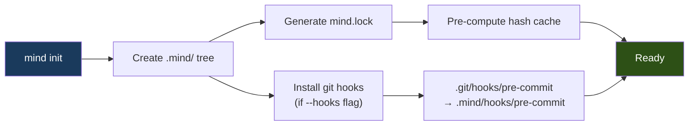

---

## 3. The `mind` CLI

### 3.1 Architecture

The `mind` CLI is a thin bash dispatcher that delegates to Python for TOML parsing and to `jq` for JSON queries. It requires Python 3.11+ (for `tomllib` in stdlib) and optionally `jq` (falls back to Python for JSON if absent).

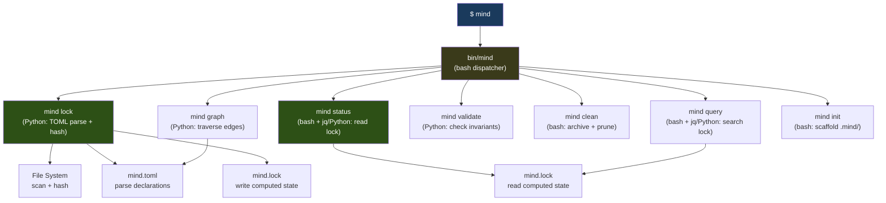

### 3.2 Command Reference

| Command | Does | Reads | Writes | Typical Time |
|---------|------|-------|--------|:---:|
| `mind init` | Scaffold `.mind/`, generate first `mind.lock` | `mind.toml` | `.mind/`, `mind.lock` | ~0.3s |
| `mind lock` | Sync lock file with filesystem state | `mind.toml`, filesystem | `mind.lock`, `.mind/cache/hashes.json` | ~0.2s |
| `mind lock --verify` | Check lock is current (exit 1 if stale) | `mind.toml`, `mind.lock`, filesystem | Nothing | ~0.1s |
| `mind status` | Display project state, staleness, completeness | `mind.lock` | Nothing | ~0.05s |
| `mind query <term>` | Find artifacts matching a term or URI | `mind.lock`, `mind.toml` | Nothing | ~0.05s |
| `mind graph` | Print dependency tree as text | `mind.toml` | Nothing | ~0.1s |
| `mind graph --dot` | Export dependency graph as DOT | `mind.toml` | stdout | ~0.1s |
| `mind validate` | Check manifest invariants | `mind.toml`, `mind.lock` | Nothing | ~0.15s |
| `mind clean` | Archive old iterations, prune logs/outputs | `mind.toml`, `.mind/` | filesystem, `.mind/logs/` | ~0.2s |
| `mind summarize` | Generate summaries for all registered documents | `mind.toml`, docs | `.mind/cache/summaries/` | ~1-5s |

### 3.3 `mind lock` — The Core Operation

This is the most important CLI command. It bridges the declared state (`mind.toml`) with the actual filesystem state.

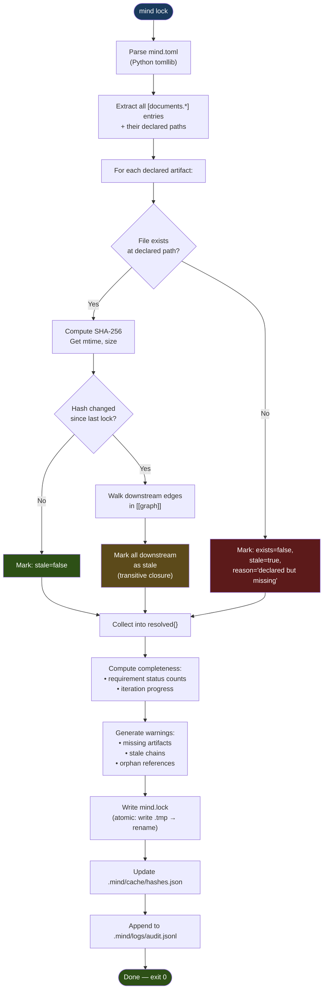

#### Incremental Lock Update

Full scans on every invocation waste time for large projects. The hash cache enables incremental updates:

```
1. Read .mind/cache/hashes.json (previous hashes + mtimes)
2. For each declared artifact:
   a. Check mtime against cached mtime
   b. If mtime unchanged → reuse cached hash (skip SHA-256)
   c. If mtime changed → recompute hash, update cache
3. Compare new hashes against mind.lock hashes
4. Only recompute staleness for changed entries
```

**Performance**: A project with 30 tracked artifacts where 2 changed: ~0.05s (vs ~0.2s full scan). The mtime check avoids expensive hash computation for unchanged files.

### 3.4 `mind status` — The Dashboard

Reads `mind.lock` (JSON, pre-computed) and renders a human-readable dashboard.

**Example output:**

```
$ mind status

Mind Framework — inventory-api
Generation: 4 │ Profile: backend-api │ Schema: mind/v2.0

Documents                         Status    Modified         
─────────────────────────────────────────────────────────────
  spec/project-brief              ✓ OK      2026-02-20       
  spec/requirements               ✓ OK      2026-02-24       
  spec/domain-model               ✓ OK      2026-02-24       
  spec/architecture               ⚠ STALE   2026-02-22       upstream: requirements changed
  spec/api-contracts              ✗ MISSING  -               declared but not created
  state/current                   ✓ OK      2026-02-24       
  knowledge/glossary              ✓ OK      2026-02-20       

Iterations                        Status    Implements       
─────────────────────────────────────────────────────────────
  001-new-barcode                 ✓ done    FR-1             
  002-enhancement-reorder         ✓ done    FR-2             
  003-enhancement-dashboard       ◎ active  FR-3             

Requirements    ██████████░░░░░░░░░░  50%  (2/4 implemented)
─────────────────────────────────────────────────────────────
  FR-1  ✓ implemented   Barcode scanning
  FR-2  ✓ implemented   Reorder points
  FR-3  ◎ in-progress   Dashboard
  FR-4  ○ pending        Reporting

Warnings: 2
  ⚠ spec/architecture — stale (upstream dependency changed)
  ✗ spec/api-contracts — declared but missing on disk
```

**JSON mode** (`mind status --json`) outputs the same data as structured JSON, suitable for piping to other tools or CI reporting.

### 3.5 `mind query` — Artifact Search

Fast lookup against the pre-computed `mind.lock`.

```bash
$ mind query "FR-3"
doc:spec/requirements#FR-3
  status: in-progress
  implemented-by: iter.003
  
  References found in:
    docs/iterations/003-enhancement-dashboard/overview.md:12
    docs/spec/requirements.md:47

$ mind query --stale
doc:spec/architecture
  stale since: 2026-02-24T09:00:00Z
  reason: upstream doc:spec/requirements changed (hash mismatch)
  downstream impact: doc:spec/api-contracts

doc:spec/api-contracts
  missing: declared but not yet created
  owner: agent:architect

$ mind query --zone=spec
doc:spec/project-brief     ✓ OK       docs/spec/project-brief.md
doc:spec/requirements       ✓ OK       docs/spec/requirements.md
doc:spec/domain-model       ✓ OK       docs/spec/domain-model.md
doc:spec/architecture       ⚠ STALE    docs/spec/architecture.md
doc:spec/api-contracts      ✗ MISSING  docs/spec/api-contracts.md
```

### 3.6 `mind clean` — Lifecycle Maintenance

```bash
$ mind clean
Archiving completed iterations older than threshold (10)...
  → moved 001-new-barcode to docs/iterations/.archive/
  → moved 002-enhancement-reorder to docs/iterations/.archive/

Pruning operational logs...
  → removed 3 run logs older than 30 days
  → removed 8 gate results from archived iterations
  → rotated audit.jsonl (14,392 lines → archived)

Pruning output captures...
  → removed 12 old test/lint/build outputs (keeping last 5 each)

Cleaning tmp/...
  → removed PLAN.md, WIP.md, LEARNINGS.md

Summary: freed 847KB, archived 2 iterations
```

### 3.7 Implementation Strategy

The `mind` CLI is distributed as part of the framework and installed via `install.sh`.

```
mind-framework/
├── bin/
│   └── mind                    ← Bash dispatcher (~80 lines)
├── lib/
│   ├── mind-lock.py            ← Lock file generation (~200 lines, stdlib only)
│   ├── mind-validate.py        ← Manifest invariant checks (~100 lines)
│   ├── mind-graph.py           ← Dependency graph operations (~120 lines)
│   └── mind-summarize.py       ← Document summarization (~80 lines)
├── install.sh                  ← Updated to install bin/ and lib/
└── scaffold.sh                 ← Updated to create mind.toml
```

**Total CLI implementation: ~600 lines** (bash + Python, zero external dependencies).

The bash dispatcher pattern:

```bash
#!/usr/bin/env bash
set -euo pipefail

MIND_ROOT="$(git rev-parse --show-toplevel 2>/dev/null || pwd)"
LIB_DIR="$(dirname "$(readlink -f "$0")")/../lib"

case "${1:-}" in
    init)     shift; _mind_init "$@" ;;
    lock)     shift; python3 "$LIB_DIR/mind-lock.py" "$MIND_ROOT" "$@" ;;
    status)   shift; _mind_status "$@" ;;
    query)    shift; _mind_query "$@" ;;
    graph)    shift; python3 "$LIB_DIR/mind-graph.py" "$MIND_ROOT" "$@" ;;
    validate) shift; python3 "$LIB_DIR/mind-validate.py" "$MIND_ROOT" "$@" ;;
    clean)    shift; _mind_clean "$@" ;;
    help|"")  _mind_help ;;
    *)        echo "Unknown command: $1" >&2; _mind_help; exit 1 ;;
esac
```

Simple bash functions handle `init`, `status`, `query`, and `clean` (they read JSON, no TOML parsing needed). Python handles `lock`, `validate`, `graph`, and `summarize` (they parse TOML).

---

## 4. Operational Artifact Registry

### 4.1 The Gap

The canonical design's `[documents.*]` registry tracks knowledge artifacts (specs, iterations, decisions). But real workflows produce operational artifacts that are equally important for traceability:

| Category | Examples | Tracked in v2 Canonical? |
|----------|---------|:---:|
| Spec documents | requirements.md, architecture.md | Yes |
| Iteration artifacts | overview.md, changes.md, validation.md | Yes |
| Build outputs | compiled binaries, bundled assets | No |
| Test results | pass/fail counts, coverage percentages | No |
| Lint results | error counts, warning counts, files affected | No |
| Gate verdicts | micro-gate pass/fail, deterministic results | No |
| Agent scratch | PLAN.md, WIP.md, LEARNINGS.md | No |
| Container state | running services, port mappings | No |
| Logs | workflow run history, audit trail | No |

### 4.2 Extended Manifest — `[operations]` Section

Add a new top-level section to `mind.toml` for operational configuration:

```toml
# ─────────────────────────────────────────────────────────────
# OPERATIONS — Runtime behavior and infrastructure
# ─────────────────────────────────────────────────────────────

[operations]
runtime-dir = ".mind"

[operations.commands]
test        = "pytest -v --tb=short"
lint        = "ruff check src/"
typecheck   = "mypy src/"
build       = "docker compose build"
dev         = "docker compose up -d && uvicorn app.main:app --reload"
db-migrate  = "alembic upgrade head"
db-seed     = "python scripts/seed.py"

[operations.capture]
test-output     = "json"      # "json" | "text" | "none"
lint-output     = "json"
coverage-output = "json"
build-output    = "text"

[operations.retention]
max-iterations-active = 10    # older completed iterations → .archive/
max-run-logs          = 20    # keep last N workflow run logs
max-output-snapshots  = 5     # keep last N per output type
audit-rotate-lines    = 10000 # rotate audit.jsonl after N lines
tmp-cleanup           = "on-workflow-complete"  # "on-workflow-complete" | "manual"

[operations.infrastructure]
compose-file = "docker-compose.yml"
services     = ["postgres", "redis"]
healthcheck  = "docker compose ps --format json"
```

### 4.3 Extended Lock File — `operations` Block

The `mind.lock` gains an `operations` block that snapshots runtime state:

```json
{
  "lockVersion": 1,
  "generation": 4,
  "resolved": { "..." : "..." },

  "operations": {
    "lastRun": "2026-02-24T14:30:00Z",
    "runtimeDir": ".mind",
    "runtimeExists": true,

    "commands": {
      "test": {
        "command": "pytest -v --tb=short",
        "lastRun": "2026-02-24T14:35:00Z",
        "lastExitCode": 0,
        "lastDuration": "12.4s",
        "outputPath": ".mind/outputs/test/latest.json"
      },
      "lint": {
        "command": "ruff check src/",
        "lastRun": "2026-02-24T14:34:00Z",
        "lastExitCode": 0,
        "lastDuration": "1.2s",
        "outputPath": ".mind/outputs/lint/latest.json"
      }
    },

    "infrastructure": {
      "composeFile": "docker-compose.yml",
      "services": {
        "postgres": { "status": "running", "port": 5432 },
        "redis": { "status": "running", "port": 6379 }
      },
      "lastHealthcheck": "2026-02-24T14:30:00Z"
    },

    "cache": {
      "summariesGenerated": 5,
      "summariesStale": 1,
      "hashCacheEntries": 12,
      "lastSummarized": "2026-02-24T12:00:00Z"
    }
  }
}
```

### 4.4 How Agents Use Operational Data

The extended lock gives agents immediate access to operational state without running commands:

| Agent | Reads from `operations` | Avoids |
|-------|------------------------|--------|
| Orchestrator | `commands.test.lastExitCode` — knows if tests are currently passing | Running `pytest` just to check status |
| Developer | `commands.lint.lastExitCode` — knows lint state before starting | Redundant lint check at start of session |
| Tester | `commands.test.outputPath` — reads last test results directly | Re-running full test suite to understand current state |
| Reviewer | All command results — evidence-based review without re-execution | Running every gate command again |

---

## 5. Context Budgeting Engine

### 5.1 The Performance Problem

In a NEW_PROJECT workflow with 8 spec documents, 3 active iterations, and operational state, the total context across all artifacts can exceed 50,000 tokens. A single agent reading everything wastes 60-70% of its context on irrelevant material.

### 5.2 Budget Allocation Strategy

Each agent has a **context budget** derived from its role and the token limits of the model being used:

```toml
# In mind.toml — optional overrides (defaults from framework)
[agents.analyst]
context-budget = 30000    # tokens (default: 40% of model capacity)

[agents.developer]
context-budget = 50000    # tokens (developer gets more — needs code + specs)
```

### 5.3 The Loading Pipeline

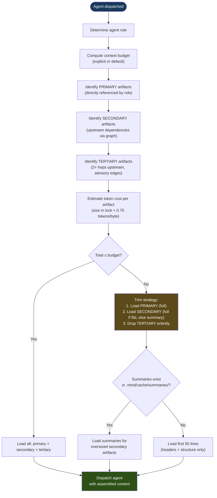

### 5.4 Agent Loading Profiles

Pre-computed from the dependency graph for each agent role:

| Agent | Primary Artifacts | Secondary Artifacts | Typically Skipped |
|-------|-------------------|--------------------|--------------------|
| **Analyst** | `doc:spec/project-brief`, active iteration overview | `doc:state/current`, `doc:knowledge/glossary` | Other iterations, architecture |
| **Architect** | `doc:spec/requirements`, `doc:spec/domain-model` | `doc:spec/project-brief` | Iterations, state, knowledge |
| **Developer** | Active iteration specs, `doc:spec/architecture`, `doc:spec/api-contracts` | `doc:spec/domain-model`, `doc:spec/requirements` (summary) | Project brief, other iterations |
| **Tester** | `doc:spec/domain-model`, active iteration `changes.md` | `doc:spec/requirements` (for acceptance criteria) | Architecture, project brief |
| **Reviewer** | Active iteration `changes.md` + `validation.md`, `mind.lock` | `doc:spec/requirements` (summary) | Everything else |

### 5.5 Summary Cache Format

Summaries are generated by `mind summarize` and stored in `.mind/cache/summaries/`:

```
# .mind/cache/summaries/doc-spec-requirements.md
# Auto-generated summary — do not edit
# Source: docs/spec/requirements.md
# Hash: sha256:d4e7f0a3
# Generated: 2026-02-24T12:00:00Z
# Lines: 247 → 35 (86% reduction)

## Requirements Summary

4 functional requirements defined:
- FR-1: Barcode scanning adds inventory (implemented)
- FR-2: Automatic reorder points (implemented)
- FR-3: Real-time dashboard (in-progress)
- FR-4: Monthly reporting (pending)

3 non-functional requirements: <100ms p95 latency, 99.9% uptime, WCAG 2.1 AA.
Key constraints: PostgreSQL required, REST API, no external auth provider.
5 acceptance criteria defined, 2 verified.
```

**Staleness**: Summaries include the source hash. When `mind lock` detects a hash change, corresponding summaries are marked stale in `.mind/cache/resolved.json` and regenerated on next `mind summarize` run.

### 5.6 Token Estimation

Approximate token count from file size without tokenizer dependency:

```
tokens ≈ file_size_bytes × 0.75
```

This heuristic works within 15% accuracy for English markdown, sufficient for budget decisions. Exact counts aren't needed — the budget is a soft limit.

---

## 6. File Lifecycle Management

### 6.1 Artifact State Machine

Every tracked artifact progresses through a defined lifecycle:

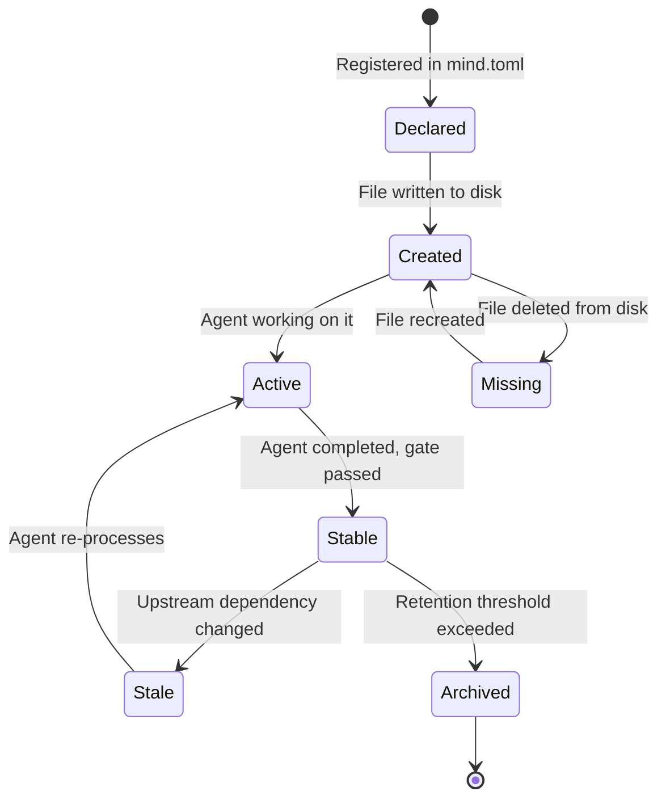

### 6.2 File Categories and Policies

| Category | Location | Lifecycle | Retention | Git Status |
|----------|----------|-----------|-----------|:---:|
| **Manifest** | `mind.toml` | Permanent, human-edited | Forever | Committed |
| **Lock file** | `mind.lock` | Permanent, auto-generated | Forever (overwritten each sync) | Committed |
| **Spec documents** | `docs/spec/` | Long-lived, incremental updates | Forever | Committed |
| **State documents** | `docs/state/` | Volatile, frequently overwritten | Forever (current content only) | Committed |
| **Active iterations** | `docs/iterations/NNN-*/` | Medium-lived, append-only | While active + buffer (configurable) | Committed |
| **Archived iterations** | `docs/iterations/.archive/` | Long-lived, immutable | Forever | Committed |
| **Knowledge documents** | `docs/knowledge/` | Long-lived, updated as domain evolves | Forever | Committed |
| **Agent scratch** | `.mind/tmp/` | Ephemeral, session-scoped | Deleted on workflow completion | Ignored |
| **Run logs** | `.mind/logs/runs/` | Short-lived, diagnostic | Last 20 (configurable) | Ignored |
| **Gate results** | `.mind/logs/gates/` | Short-lived, per-iteration | Active + last completed iteration | Ignored |
| **Output captures** | `.mind/outputs/` | Short-lived, per-command | Last 5 per type (configurable) | Ignored |
| **Cache** | `.mind/cache/` | Disposable, rebuilt on demand | No explicit retention | Ignored |

### 6.3 Iteration Archival

When active iterations exceed the configured threshold (`operations.retention.max-iterations-active`), older completed iterations are moved to `.archive/`:

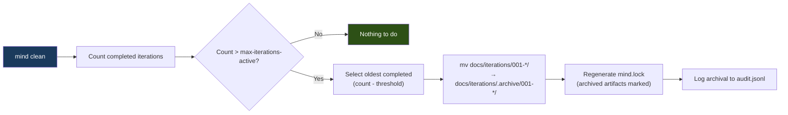

**Archived iterations remain in `mind.lock`** with `"archived": true`. The dependency graph preserves their edges. They're accessible for historical queries but excluded from agent context loading.

```json
{
  "doc:iteration/001": {
    "path": "docs/iterations/.archive/001-new-barcode/",
    "exists": true,
    "archived": true,
    "archivedAt": "2026-03-15T10:00:00Z",
    "hash": "sha256:abc123"
  }
}
```

### 6.4 Ephemeral File Cleanup

The planning skill creates `PLAN.md`, `WIP.md`, and `LEARNINGS.md` during complex work. Under the operational layer, these move to `.mind/tmp/` instead of the iteration directory:

| Before (v1) | After (v2) |
|-------------|-----------|
| `docs/iterations/003-*/PLAN.md` (gitignored) | `.mind/tmp/PLAN.md` (never near committed files) |
| `docs/iterations/003-*/WIP.md` (gitignored) | `.mind/tmp/WIP.md` |
| `docs/iterations/003-*/LEARNINGS.md` (gitignored) | `.mind/tmp/LEARNINGS.md` |

Cleanup trigger: `operations.retention.tmp-cleanup` controls when `.mind/tmp/` is cleared:

- `"on-workflow-complete"` — orchestrator deletes at Step 7 (default)
- `"manual"` — only deleted by `mind clean`

### 6.5 Output Rotation

Build/test/lint outputs in `.mind/outputs/` follow a fixed rotation:

```
.mind/outputs/test/
├── latest.json → 2026-02-24T14-35-00Z.json  (symlink)
├── 2026-02-24T14-35-00Z.json                 (newest)
├── 2026-02-24T12-00-00Z.json
├── 2026-02-24T09-00-00Z.json
├── 2026-02-23T16-00-00Z.json
└── 2026-02-23T14-00-00Z.json                 (oldest, 5th)
```

When a 6th output is captured, the oldest is deleted. The `latest` symlink always points to the newest. This gives agents instant access to the most recent results without re-running commands.

---

## 7. Structured Operational Logging

### 7.1 Log Types

| Log | Format | Location | Purpose |
|-----|--------|----------|---------|
| **Run log** | JSONL | `.mind/logs/runs/{timestamp}.jsonl` | Per-workflow-run event stream |
| **Gate log** | JSON | `.mind/logs/gates/{gate}-{iter}.json` | Per-gate structured result |
| **Audit log** | JSONL | `.mind/logs/audit.jsonl` | Append-only operational audit trail |

### 7.2 Run Log Schema

Each workflow invocation produces a JSONL file. One line per event:

```jsonl
{"ts":"2026-02-24T14:30:00Z","event":"workflow-start","type":"ENHANCEMENT","descriptor":"003-enhancement-dashboard","chain":["analyst","developer","tester","reviewer"]}
{"ts":"2026-02-24T14:30:01Z","event":"agent-dispatch","agent":"analyst","context_tokens":12400,"artifacts_loaded":["doc:spec/project-brief","doc:spec/requirements","doc:state/current"]}
{"ts":"2026-02-24T14:32:15Z","event":"agent-complete","agent":"analyst","duration":"134s","artifacts_produced":["doc:iteration/003/overview.md"],"artifacts_updated":["doc:spec/requirements"]}
{"ts":"2026-02-24T14:32:16Z","event":"gate-start","gate":"micro-a","iteration":"003"}
{"ts":"2026-02-24T14:32:17Z","event":"gate-result","gate":"micro-a","verdict":"PASS","checks":{"acceptance-criteria":true,"scope-boundaries":true,"no-ambiguous-terms":true}}
{"ts":"2026-02-24T14:32:18Z","event":"agent-dispatch","agent":"developer","context_tokens":28900}
{"ts":"2026-02-24T14:45:30Z","event":"command-run","command":"pytest","exit_code":0,"duration":"12.4s","output_path":".mind/outputs/test/2026-02-24T14-45-30Z.json"}
{"ts":"2026-02-24T14:50:00Z","event":"workflow-complete","duration":"20m","generation":5}
```

### 7.3 Gate Log Schema

```json
{
  "gate": "deterministic",
  "iteration": "003-enhancement-dashboard",
  "timestamp": "2026-02-24T14:45:00Z",
  "verdict": "PASS",
  "results": {
    "build": { "command": "docker compose build", "exitCode": 0, "duration": "34.2s" },
    "lint":  { "command": "ruff check src/", "exitCode": 0, "duration": "1.1s", "warnings": 0, "errors": 0 },
    "typecheck": { "command": "mypy src/", "exitCode": 0, "duration": "4.7s" },
    "test": { "command": "pytest -v", "exitCode": 0, "duration": "12.4s", "passed": 47, "failed": 0, "skipped": 2 }
  },
  "outputPaths": {
    "test": ".mind/outputs/test/2026-02-24T14-45-00Z.json",
    "lint": ".mind/outputs/lint/2026-02-24T14-45-00Z.json"
  }
}
```

### 7.4 Audit Log Schema

Every `mind` CLI invocation appends one line:

```jsonl
{"ts":"2026-02-24T14:30:00Z","command":"mind lock","duration":"0.18s","artifacts_scanned":12,"stale":2,"missing":1}
{"ts":"2026-02-24T14:30:05Z","command":"mind status","duration":"0.04s"}
{"ts":"2026-02-24T14:31:00Z","command":"mind validate","duration":"0.12s","invariants_checked":4,"violations":0}
```

### 7.5 Querying Logs

```bash
# Last 5 workflow runs
jq -s '[.[] | select(.event=="workflow-complete")] | .[-5:]' .mind/logs/runs/*.jsonl

# Average test duration over last 10 runs
jq -s '[.[] | select(.event=="command-run" and .command=="pytest")] | .[-10:] | map(.duration | rtrimstr("s") | tonumber) | add / length' .mind/logs/runs/*.jsonl

# All gate failures
jq 'select(.verdict != "PASS")' .mind/logs/gates/*.json

# Commands run today
jq 'select(.ts | startswith("2026-02-24"))' .mind/logs/audit.jsonl
```

---

## 8. Container & Infrastructure Integration

### 8.1 Design Principle

The framework does NOT replace container tooling (Docker, Podman, docker-compose). It **integrates** by:

1. Declaring infrastructure requirements in `mind.toml`
2. Providing health-aware commands through the CLI
3. Surfacing infrastructure state in the lock file for agents

### 8.2 Infrastructure Declaration

```toml
[operations.infrastructure]
compose-file   = "docker-compose.yml"
services       = ["postgres", "redis", "app"]
healthcheck    = "docker compose ps --format json"
startup        = "docker compose up -d"
shutdown       = "docker compose down"
logs           = "docker compose logs --tail=50"

[operations.infrastructure.ports]
postgres = 5432
redis    = 6379
app      = 8000
```

### 8.3 Infrastructure-Aware Workflow

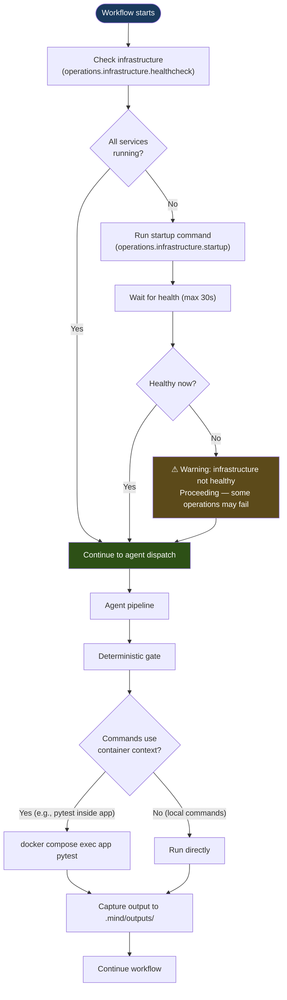

### 8.4 Container-Aware Commands

The `[operations.commands]` section supports container prefixes:

```toml
[operations.commands]
test       = "docker compose exec app pytest -v --tb=short"
lint       = "ruff check src/"                                  # runs locally
db-migrate = "docker compose exec app alembic upgrade head"
db-shell   = "docker compose exec postgres psql -U app"
logs       = "docker compose logs --tail=100 --follow"
```

Agents read `[operations.commands]` to know exactly how to invoke each operation, whether containerized or local. No guessing.

### 8.5 Infrastructure State in Lock File

```json
"operations": {
  "infrastructure": {
    "composeFile": "docker-compose.yml",
    "composeExists": true,
    "services": {
      "postgres": { "declared": true, "port": 5432 },
      "redis": { "declared": true, "port": 6379 },
      "app": { "declared": true, "port": 8000 }
    },
    "lastHealthcheck": "2026-02-24T14:30:00Z",
    "healthy": true
  }
}
```

The orchestrator reads this at workflow start. If `healthy: false` and the workflow requires database access (inferred from profile or commands), the orchestrator runs the startup command before dispatching agents.

---

## 9. Automation Layer

### 9.1 Git Hooks

The `mind init --hooks` command generates git hooks in `.mind/hooks/` and symlinks them to `.git/hooks/`.

#### Pre-Commit Hook

```bash
#!/usr/bin/env bash
# .mind/hooks/pre-commit — generated by mind init
# Validates mind.lock is current before allowing commit

set -euo pipefail

if [ -f "mind.toml" ] && [ -f "mind.lock" ]; then
    if ! mind lock --verify 2>/dev/null; then
        echo "✗ mind.lock is out of sync with mind.toml or filesystem"
        echo "  Run 'mind lock' to update, then commit again."
        exit 1
    fi
fi
```

#### Post-Merge Hook

```bash
#!/usr/bin/env bash
# .mind/hooks/post-merge — generated by mind init
# Regenerates lock file after merging changes

set -euo pipefail

if [ -f "mind.toml" ]; then
    mind lock --quiet
fi
```

### 9.2 CI Integration

The `mind` CLI supports non-interactive CI usage:

```yaml
# .github/workflows/mind-validate.yml
name: Mind Framework Validation
on: [pull_request]

jobs:
  validate:
    runs-on: ubuntu-latest
    steps:
      - uses: actions/checkout@v4
      
      - name: Validate manifest
        run: mind validate
      
      - name: Verify lock file
        run: mind lock --verify
      
      - name: Check status
        run: mind status --json > $GITHUB_STEP_SUMMARY
```

### 9.3 Automation Flow

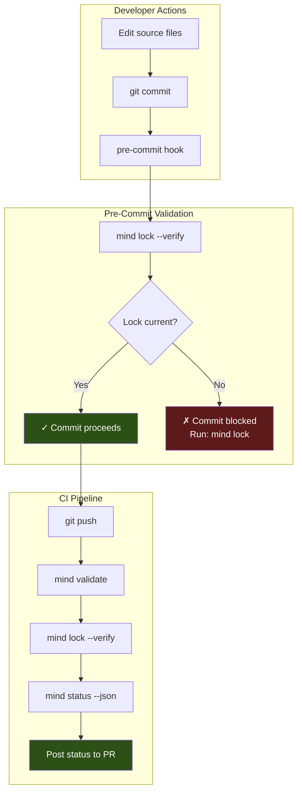

### 9.4 Workflow Trigger Automation

The orchestrator can read operational state to make smarter dispatch decisions:

| Condition | Automated Action |
|-----------|-----------------|
| `mind.lock` has stale artifacts | Orchestrator prioritizes stale artifacts in rebuild plan |
| Last test run failed (`.mind/outputs/test/latest.json`) | Developer agent runs tests before making changes |
| Infrastructure unhealthy | Orchestrator runs startup before agent dispatch |
| Coverage dropped below threshold | Tester agent gets explicit coverage gap context |
| Lint errors present | Developer agent fixes lint before starting feature work |

---

## 10. Performance Architecture

### 10.1 Performance Budget

Every framework operation has a time budget:

| Operation | Target | Implementation |
|-----------|--------|----------------|
| `mind lock` (full) | < 0.5s for 50 artifacts | Python, SHA-256, file scan |
| `mind lock` (incremental) | < 0.1s for 50 artifacts, 2 changed | Mtime-based skip + cached hashes |
| `mind status` | < 0.1s | Read pre-computed JSON |
| `mind query` | < 0.1s | Filter pre-computed JSON |
| `mind validate` | < 0.2s | TOML parse + invariant checks |
| Agent context loading | < 2s | Read selected files from disk |
| Pre-commit hook | < 1s | `mind lock --verify` |

### 10.2 Optimization Strategies

```mermaid
flowchart LR
    subgraph L1["Layer 1: Avoid Work"]
        MTIME["Mtime check<br/>skip unchanged files"]
        HASH_CACHE["Hash cache<br/>reuse computed hashes"]
        SELECTIVE["Selective loading<br/>graph-based read set"]
    end
    
    subgraph L2["Layer 2: Reduce Work"]
        SUMMARY["Summary cache<br/>200 tokens vs 5000"]
        INCREMENTAL["Incremental lock<br/>delta, not full scan"]
        BUDGET["Context budgeting<br/>fit within limits"]
    end
    
    subgraph L3["Layer 3: Defer Work"]
        LAZY_SUMMARY["Lazy summarization<br/>generate on first need"]
        ARCHIVE["Lazy archival<br/>archive on clean, not every run"]
        PRUNE["Background pruning<br/>logs/outputs rotate on threshold"]
    end
    
    L1 -->|"if not enough"| L2
    L2 -->|"if not enough"| L3

    style L1 fill:#2d5016,color:#fff
    style L2 fill:#1a3a5c,color:#fff
    style L3 fill:#3a3a1a,color:#fff
```

### 10.3 Context Window Efficiency

The primary performance metric for an LLM agent framework is **useful tokens per total tokens loaded**.

| Mode | Total Tokens Loaded | Useful Tokens | Efficiency |
|------|:---:|:---:|:---:|
| **No manifest (v1)** — agent reads everything | ~45,000 | ~15,000 | 33% |
| **Level 2 — registry-based loading** | ~22,000 | ~15,000 | 68% |
| **Level 3 — graph + summaries** | ~18,000 | ~15,000 | 83% |

Useful tokens = content directly relevant to the agent's task. The difference is what the agent DOESN'T have to read.

### 10.4 Scaling Characteristics

| Project Scale | Artifacts | Lock Time (full) | Lock Time (incr.) | Status Time |
|:---:|:---:|:---:|:---:|:---:|
| Small (MVP) | 5-10 | ~0.1s | ~0.03s | ~0.02s |
| Medium (feature-complete) | 20-40 | ~0.2s | ~0.05s | ~0.03s |
| Large (mature product) | 50-100 | ~0.5s | ~0.1s | ~0.05s |
| Very large (monorepo) | 100+ | ~1.0s | ~0.2s | ~0.05s |

Lock time scales linearly with artifact count. Status time is constant (reads pre-computed JSON). Incremental lock time scales with changed artifacts, not total.

### 10.5 Parallel Agent Operations

Where the dependency graph allows, agents can operate in parallel within a workflow:

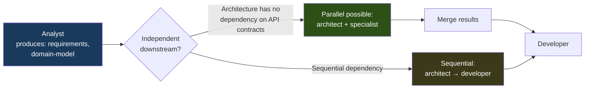

The orchestrator computes parallelism opportunities from the `[[graph]]` edges. If two downstream artifacts have no mutual dependency, their producing agents can run concurrently.

---

## 11. CLI Workflow Examples

### 11.1 New Project — Full Lifecycle

```bash
# 1. Initialize project with framework
scaffold.sh --with-framework --name=inventory-api

# 2. Create the manifest (scaffold.sh v2 does this)
#    → mind.toml created with [project], [profiles], [operations.commands]

# 3. Initialize runtime
mind init --hooks
#    → .mind/ created, git hooks installed, first mind.lock generated

# 4. Check initial state
mind status
#    → Shows empty project, no documents, no iterations

# 5. Start development workflow (in Claude/LLM session)
#    User: /workflow "Create inventory management API with barcode scanning"
#    → Orchestrator reads mind.toml + mind.lock
#    → Dispatches: analyst → architect → developer → tester → reviewer

# 6. During workflow — agent produces artifacts
#    → mind.toml updated with new [documents.*] entries
#    → Iteration created in docs/iterations/001-new-inventory-api/
#    → mind.lock regenerated at checkpoints

# 7. After workflow — verify state
mind status
#    → Shows all documents, active iteration, completeness %

mind validate
#    → Checks invariants: every document has owner, no orphan deps, etc.

# 8. Commit and push
git add -A && git commit -m "feat: initial inventory API implementation"
#    → pre-commit hook runs: mind lock --verify ✓
```

### 11.2 Resuming After a Break

```bash
# 1. Return to project
cd ~/projects/inventory-api

# 2. Check where things stand
mind status
#    ⚠ spec/architecture — STALE (you edited requirements yesterday)
#    ◎ 003-enhancement-dashboard — active
#    50% requirements implemented

# 3. Sync after pulling changes
git pull
mind lock
#    → Lock regenerated with updated hashes

# 4. Resume workflow (in Claude/LLM session)
#    User: /workflow "Continue dashboard implementation"
#    → Orchestrator reads state/workflow.md → finds interrupted workflow
#    → Resumes from last completed agent
```

### 11.3 Investigating a Problem

```bash
# 1. Check what's broken
mind status
#    ✗ MISSING: spec/api-contracts
#    ⚠ STALE: spec/architecture, spec/domain-model

# 2. Understand the dependency chain
mind graph
#    project-brief → requirements → domain-model (STALE) → architecture (STALE) → api-contracts (MISSING)
#    requirements → architecture (STALE)

# 3. Find what references the stale artifact
mind query "architecture"
#    doc:spec/architecture — STALE
#    Referenced by: 3 iterations, api-contracts
#    Depends on: requirements (changed), domain-model

# 4. Check last gate results
cat .mind/logs/gates/deterministic-iter003.json | jq '.verdict'
#    "PASS"

# 5. Check recent test runs
jq '.passed, .failed' .mind/outputs/test/latest.json
#    47, 0
```

### 11.4 CI Pipeline Integration

```bash
# In CI: validate framework state on PR
mind validate || exit 1
mind lock --verify || { echo "Lock file out of date"; exit 1; }

# Generate PR status comment
mind status --json | jq '{
  completeness: .completeness.requirements.percentage,
  stale: [.warnings[] | select(contains("stale"))],
  missing: [.warnings[] | select(contains("missing"))]
}'
```

---

## 12. Implementation Reference

### 12.1 File Inventory — What Changes

| File | Change Type | Description |
|------|:---:|-------------|
| `scaffold.sh` | Modified | Generates `mind.toml`, creates `.mind/`, updates `.gitignore` |
| `install.sh` | Modified | Installs `bin/mind` and `lib/*.py`, sets PATH |
| `bin/mind` | **New** | Bash CLI dispatcher (~80 lines) |
| `lib/mind-lock.py` | **New** | Lock file generation (Python, ~200 lines, stdlib only) |
| `lib/mind-validate.py` | **New** | Manifest invariant checker (Python, ~100 lines) |
| `lib/mind-graph.py` | **New** | Dependency graph operations (Python, ~120 lines) |
| `lib/mind-summarize.py` | **New** | Document summary generator (Python, ~80 lines) |
| `agents/orchestrator.md` | Modified | Reads `[operations]`, uses context budgeting, writes run logs |
| `conventions/documentation.md` | Modified | References 4-zone structure, `.mind/` conventions |
| `.gitignore` template | Modified | Adds `.mind/` ignore |

**Total new code: ~600 lines** (bash + Python, zero external dependencies).

### 12.2 Dependency Requirements

| Dependency | Version | Purpose | Availability |
|-----------|---------|---------|:---:|
| Python | 3.11+ | `tomllib` (stdlib) for TOML parsing | Installed on most dev machines |
| bash | 4.0+ | CLI dispatcher, hooks | Universal on Linux/macOS |
| jq | 1.6+ | JSON queries in bash (optional, Python fallback) | Common, `apt install jq` / `brew install jq` |
| sha256sum | any | File hashing (coreutils) | Universal |
| git | 2.0+ | Hook installation, rev-parse | Universal for this context |

No `pip install`, no virtual environments, no package managers required.

### 12.3 Integration with Canonical Design

This operational layer plugs into the canonical design at specific extension points:

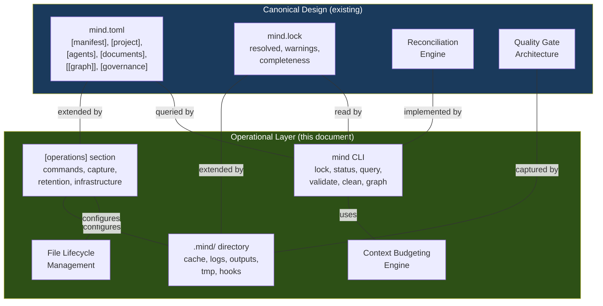

### 12.4 Phased Delivery (extending canonical roadmap)

| Phase | Deliverables | Depends On |
|-------|-------------|-----------|
| **Phase 1** (from canonical) | `mind.toml` schema, scaffold updates | — |
| **Phase 1.5** — Operational Foundation | `.mind/` directory, `bin/mind` dispatcher, `mind init`, `mind lock` | Phase 1 |
| **Phase 2** (from canonical) | Agent manifest awareness, micro-gates | Phase 1 |
| **Phase 2.5** — Operational Intelligence | `mind status`, `mind query`, context budgeting in orchestrator, output capture | Phase 1.5 + Phase 2 |
| **Phase 3** (from canonical) | Staleness detection, reconciliation engine | Phase 2 |
| **Phase 3.5** — Automation & Lifecycle | Git hooks, `mind validate`, `mind clean`, CI integration, log rotation | Phase 1.5 + Phase 3 |
| **Phase 4** (from canonical) | Profiles, specialists, backend conventions | Phase 3 |
| **Phase 4.5** — Performance Polish | Summary cache, incremental lock, parallel agent detection, `mind summarize` | Phase 2.5 + Phase 4 |

### 12.5 Success Metrics

| Metric | Measurement | Target |
|--------|-------------|:---:|
| CLI response time | `mind status` execution time | < 100ms |
| Lock generation time | `mind lock` on 50-artifact project | < 500ms |
| Context efficiency | Useful tokens / total tokens loaded per agent | > 70% |
| Zero external deps | pip install count for CLI | 0 |
| Hook non-interference | Pre-commit hook adds to commit time | < 1s |
| Framework size | Total lines across all CLI scripts | < 800 |
| Agent token savings | Documents loaded per agent vs v1 | ≥ 40% reduction |

---

*This document is the operational layer companion to `mind-framework-canonical-design.md`. Together, they form the complete v2 specification: the canonical design defines what the framework tracks and how artifacts relate; this document defines how those mechanisms perform at the filesystem, CLI, and automation level.*
