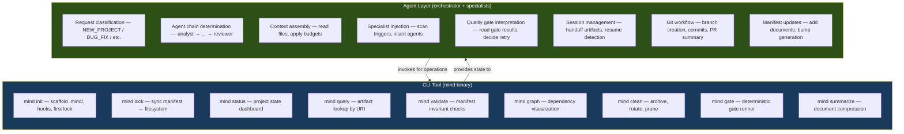
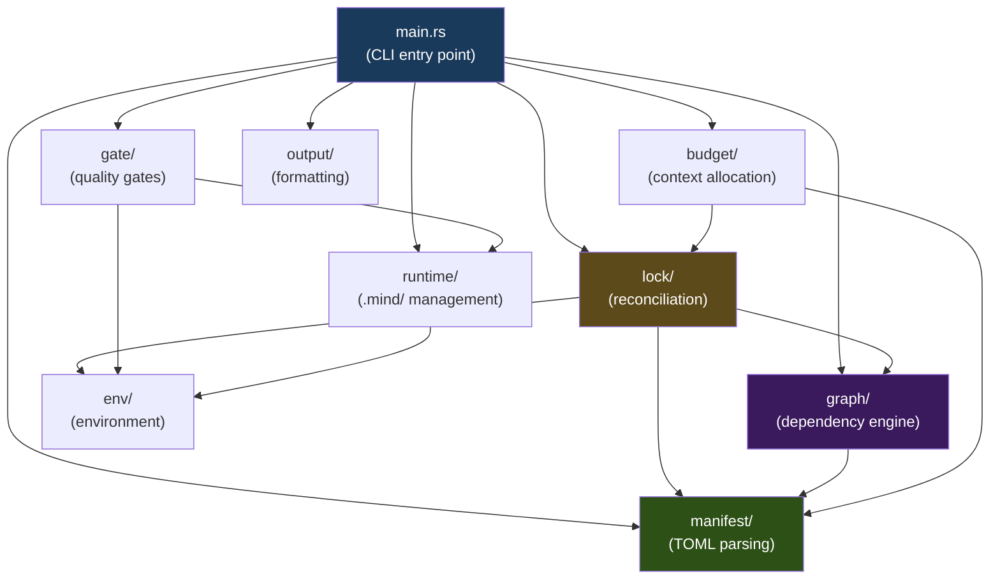
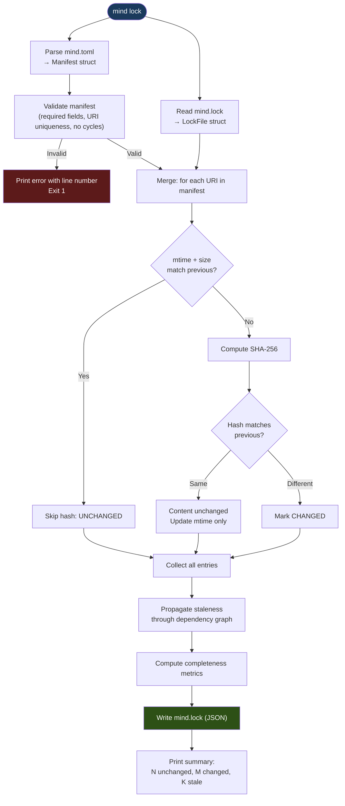
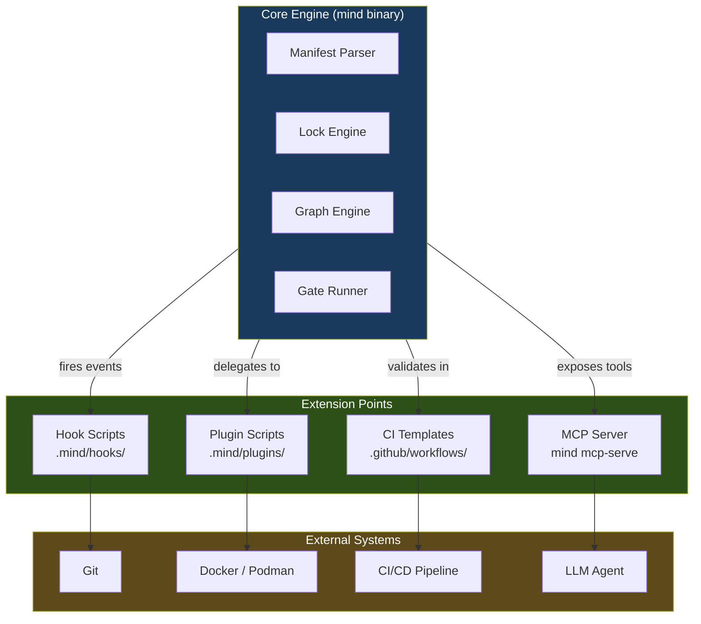
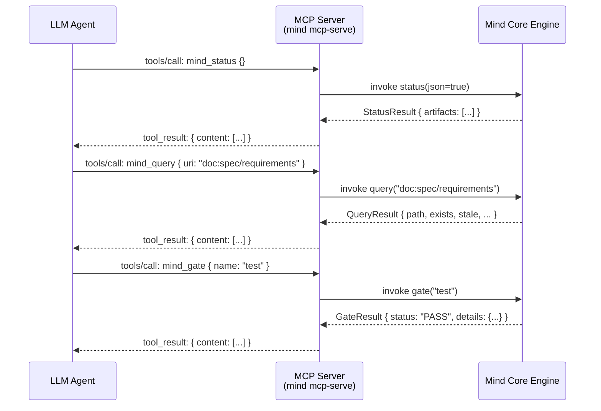
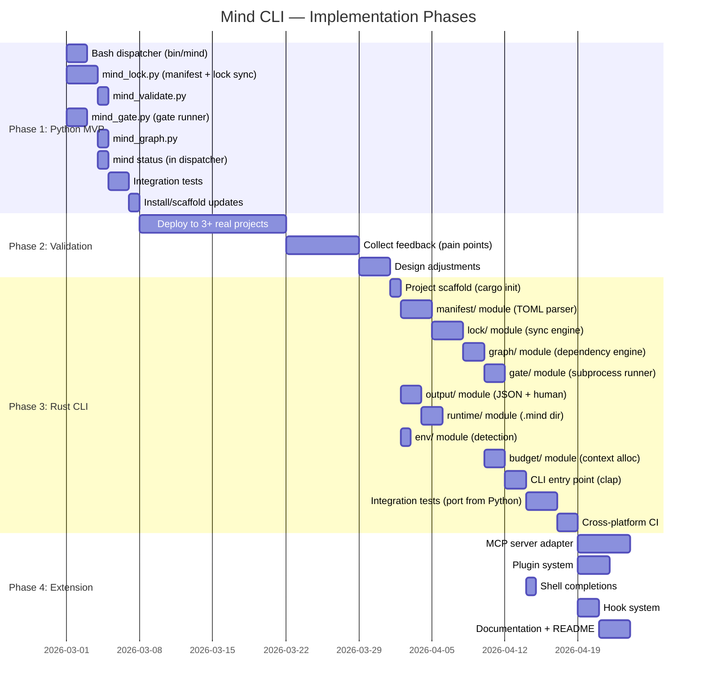
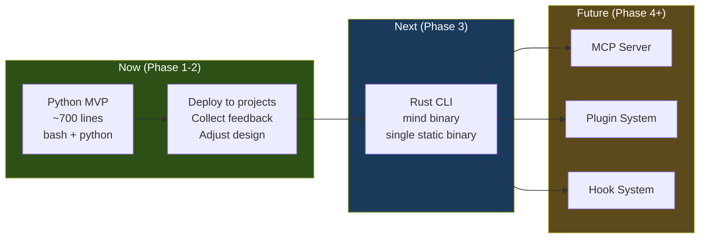

# Mind Framework — Implementation Architecture

> **Date**: 2026-02-25
> **Scope**: Executable implementation architecture — from conceptual design to buildable system
> **Audience**: Framework author, contributors, future maintainers
> **Prerequisites**: `MIND-FRAMEWORK.md` (canonical spec), `mind-framework-operational-layer.md` (operational mechanics), `operational-layer-design.md` (filesystem & performance)
> **Deliverables**: Architecture proposal, recommended stack, trade-offs, workflow model, integration strategy, implementation roadmap, final recommendation

---

## Table of Contents

1. [Executive Summary](#1-executive-summary)
2. [End-to-End Workflow Architecture](#2-end-to-end-workflow-architecture)
3. [Technology Stack Analysis](#3-technology-stack-analysis)
4. [Component Organization](#4-component-organization)
5. [CLI Integration for Agent Environments](#5-cli-integration-for-agent-environments)
6. [Extension & Integration Layer](#6-extension--integration-layer)
7. [Container & Infrastructure Support](#7-container--infrastructure-support)
8. [Multi-Language Backend Compatibility](#8-multi-language-backend-compatibility)
9. [Architectural Path Evaluation](#9-architectural-path-evaluation)
10. [Implementation Roadmap](#10-implementation-roadmap)
11. [Final Recommendation](#11-final-recommendation)

---

## 1. Executive Summary

### 1.1 The Implementation Question

The Mind Framework has a complete conceptual layer: `mind.toml` declares intent, `mind.lock` captures state, agents reconcile the delta, quality gates verify results. Three companion documents define **what** the system tracks and **how** agents interact.

This document answers: **How do we build it?**

Specifically:
- What technology stack produces the best CLI tool for this problem domain?
- How do the components organize into a buildable, testable, extensible system?
- How does the tool integrate with coding agent CLIs (Claude Code, Codex CLI, Gemini CLI)?
- What is the implementation path from MVP to mature product?

### 1.2 Key Architectural Decisions (Preview)

| Decision | Recommendation | Rationale |
|----------|---------------|-----------|
| **Primary language** | Rust for core engine | Sub-millisecond startup, single binary, zero runtime dependencies |
| **Secondary language** | Python for scripting hooks | Near-universal availability, rapid extension development |
| **CLI framework** | `clap` (Rust) | Industry standard for Rust CLIs, derive macros, shell completions |
| **Distribution** | Single static binary | `cargo install mind-cli` or download from GitHub Releases |
| **Architectural path** | Hybrid incremental (Path D) | Bash MVP → Rust CLI, coexisting with agent-native commands |
| **Extension model** | Hook scripts + MCP server | Git-style hook directories + optional MCP protocol adapter |

### 1.3 Design Constraints

These are non-negotiable requirements derived from the operational context:

| Constraint | Source | Impact |
|-----------|--------|--------|
| **< 100ms for status/query** | Performance budget (operational-layer §10.1) | Rules out JIT languages with cold-start penalty |
| **< 500ms for full lock sync** | Performance budget | Must handle 50+ artifacts with SHA-256 |
| **Zero runtime dependencies** in production | Design principle (operational-layer §12.2) | Rules out `npm`, `pip install`, package managers |
| **Works in containers, CI, local** | Environment matrix (operational-layer-design §7) | Must detect environment, degrade gracefully |
| **Cross-platform** | Framework agnosticism | Linux, macOS, Windows (WSL minimum) |
| **Coexists with agents** | Agent-first architecture | Tool assists agents, never replaces them |
| **TOML in, JSON out** | Manifest design | Must parse TOML natively, emit JSON for agent consumption |

---

## 2. End-to-End Workflow Architecture

### 2.1 Workflow Phases

Every Mind Framework workflow passes through five phases. Each phase has distinct computational requirements that inform the technology choice.

```mermaid
flowchart LR
    subgraph P1["Phase 1: Planning"]
        PARSE["Parse manifest<br/>(TOML → internal model)"]
        LOCK["Sync lock file<br/>(stat + hash + staleness)"]
        GRAPH["Compute dependency graph<br/>(topological sort)"]
        BUDGET["Allocate context budgets<br/>(per-agent token estimates)"]
    end

    subgraph P2["Phase 2: Dispatch"]
        CHAIN["Determine agent chain<br/>(request type → agents)"]
        SPEC["Scan specialists<br/>(keyword trigger matching)"]
        CTX["Assemble context<br/>(primary + secondary + summaries)"]
    end

    subgraph P3["Phase 3: Execution"]
        AGENT["Agent operates<br/>(LLM reads context, writes files)"]
        GATE["Run quality gates<br/>(subprocess: build/lint/test)"]
        CAPTURE["Capture outputs<br/>(structured JSON + log rotation)"]
    end

    subgraph P4["Phase 4: Validation"]
        VERIFY["Verify deliverables<br/>(files exist, scope adherence)"]
        REVIEW["Reviewer assessment<br/>(git diff, test evidence)"]
        RETRY["Retry loop<br/>(max 2, targeted)"]
    end

    subgraph P5["Phase 5: Governance"]
        BUMP["Bump generation<br/>(manifest + lock)"]
        ARCHIVE["Archive iteration<br/>(state → history)"]
        LOG["Write audit log<br/>(JSONL append)"]
        COMMIT["Final commit<br/>(git integration)"]
    end

    P1 --> P2 --> P3 --> P4 --> P5

    style P1 fill:#1a3a5c,color:#fff
    style P2 fill:#2d5016,color:#fff
    style P3 fill:#5c4a1a,color:#fff
    style P4 fill:#3a1a5c,color:#fff
    style P5 fill:#5c1a3a,color:#fff
```



### 2.2 Computational Profile per Phase

| Phase | Operations | Compute Class | Hot Path |
|-------|-----------|:---:|:---:|
| **Planning** | TOML parse, file stat, SHA-256, graph traversal | CPU-bound, I/O-bound | Yes — runs on every `mind lock`, `mind status` |
| **Dispatch** | Pattern matching, context assembly, file reading | I/O-bound | No — runs once per workflow |
| **Execution** | Subprocess management, output streaming, log rotation | I/O-bound, process-bound | No — dominated by external commands |
| **Validation** | File existence checks, scope comparison | I/O-bound | No — lightweight checks |
| **Governance** | File writes, git operations, JSONL append | I/O-bound | No — runs once at workflow end |

**Key insight**: Only Phase 1 (Planning) is performance-critical and runs frequently. Phases 2-5 are orchestrated by agents within LLM sessions, not by the CLI tool. The CLI tool owns Phase 1; agents own Phases 2-5 with CLI assistance for gate execution and state queries.

### 2.3 Responsibility Boundary: CLI vs Agents



**Design principle**: The CLI is a **state management engine**. Agents are the **decision engine**. The CLI never makes decisions about what to do next — it computes state and executes commanded operations. Agents read CLI output and decide workflow progression.

### 2.4 Invocation Model

The CLI is invoked in two modes:

| Mode | Invoked By | Examples | Latency Target |
|------|-----------|---------|:---:|
| **Interactive** | Human at terminal | `mind status`, `mind graph` | < 100ms |
| **Agent-mediated** | LLM via Bash tool | `mind lock --json`, `mind gate test` | < 500ms |

Both modes produce the same output. The `--json` flag enables machine-readable output for agent consumption. Human-readable formatting is the default.

---

## 3. Technology Stack Analysis

### 3.1 Evaluation Criteria

Each candidate is evaluated against seven dimensions critical to this problem domain:

| Dimension | Weight | Why It Matters |
|-----------|:------:|---------------|
| **CLI startup time** | Critical | Invoked repeatedly by agents; cold-start > 200ms breaks flow |
| **Single-binary distribution** | Critical | Zero dependency installation; `curl | sh` or `cargo install` |
| **TOML parsing** | High | Core operation; must handle nested tables, arrays of tables |
| **SHA-256 performance** | High | Hashing 50-100 files per lock sync |
| **Cross-platform** | High | Linux, macOS, Windows (WSL + native) |
| **Developer experience** | Medium | Maintainability, refactoring confidence, onboarding speed |
| **Ecosystem maturity** | Medium | Libraries for JSON, TOML, filesystem, subprocess management |

### 3.2 Candidate: Rust

**Profile**: Systems language with zero-cost abstractions, ownership model, no garbage collector.

| Dimension | Score | Evidence |
|-----------|:-----:|---------|
| CLI startup | ★★★★★ | Native binary. Measured startup: ~1-3ms. `clap` adds negligible overhead. |
| Single-binary | ★★★★★ | `cargo build --release` produces a single static binary. `musl` target for fully static Linux binaries. |
| TOML parsing | ★★★★★ | `toml` crate is mature, feature-complete. Serde integration enables direct deserialization into typed structs. |
| SHA-256 | ★★★★★ | `sha2` crate: hardware-accelerated SHA-256 via SHA-NI instructions. ~500 MB/s on modern CPUs. |
| Cross-platform | ★★★★★ | First-class support for Windows, macOS, Linux. Cross-compilation via `cross` or `cargo-zigbuild`. |
| Developer experience | ★★★☆☆ | Steep learning curve (ownership, lifetimes). Excellent refactoring (compiler catches regressions). Long compile times (~30s incremental). |
| Ecosystem | ★★★★★ | `clap` (CLI), `serde` + `serde_json` (serialization), `walkdir` (filesystem), `tokio` (async, if needed). |

**Rust-specific advantages**:
- `clap` derive macros generate shell completions (bash, zsh, fish, PowerShell) from the type definitions.
- `serde` enables deserializing `mind.toml` directly into Rust structs with validation at parse time — no separate validation pass needed.
- Error handling via `Result<T, E>` with `thiserror`/`anyhow` produces precise, actionable error messages for users.
- Binary size: ~2-5MB for a CLI of this scope (with LTO and stripping).

**Rust-specific risks**:
- **Contributor barrier**: Framework author and potential contributors may not know Rust. Onboarding time: 2-4 weeks for productive Rust development.
- **Compile time**: Full build ~1-3 minutes. Incremental: ~5-30 seconds. Acceptable for a CLI tool, but painful for rapid iteration during initial development.
- **Async complexity**: Not needed for this use case (all operations are synchronous I/O). Using `tokio` would be over-engineering.

**Reference implementations** (proof of concept):

```rust
// mind.toml deserialization — zero-cost type safety
#[derive(Debug, Deserialize)]
struct Manifest {
    project: Project,
    #[serde(default)]
    agents: HashMap<String, AgentConfig>,
    #[serde(default)]
    documents: HashMap<String, HashMap<String, DocumentConfig>>,
    #[serde(default)]
    graph: Vec<GraphEdge>,
    #[serde(default)]
    governance: Governance,
    #[serde(default)]
    operations: Operations,
    #[serde(default)]
    profiles: HashMap<String, Vec<String>>,
}

#[derive(Debug, Deserialize)]
struct DocumentConfig {
    path: PathBuf,
    owner: String,
    #[serde(rename = "depends-on")]
    depends_on: Option<Vec<String>>,
}

// Usage: the entire manifest parsed and validated in one call
let manifest: Manifest = toml::from_str(&fs::read_to_string("mind.toml")?)?;
```

```rust
// Lock sync with mtime fast path — core hot path
fn sync_artifact(
    uri: &str,
    config: &DocumentConfig,
    prev_lock: &LockEntry,
) -> Result<LockEntry> {
    let metadata = fs::metadata(&config.path);

    match metadata {
        Err(_) => Ok(LockEntry::missing(uri)),
        Ok(meta) => {
            let mtime = meta.modified()?.into();
            let size = meta.len();

            // Fast path: mtime + size unchanged → skip hash
            if mtime == prev_lock.mtime && size == prev_lock.size {
                return Ok(prev_lock.clone());
            }

            // Slow path: compute hash
            let hash = sha256_file(&config.path)?;
            let stale = hash != prev_lock.hash;

            Ok(LockEntry {
                path: config.path.clone(),
                exists: true,
                hash,
                size,
                mtime,
                stale,
                ..prev_lock.clone()
            })
        }
    }
}
```

### 3.3 Candidate: C# (.NET 8+ with NativeAOT)

**Profile**: Managed language with NativeAOT compilation for ahead-of-time native binaries. Strong type system, excellent tooling.

| Dimension | Score | Evidence |
|-----------|:-----:|---------|
| CLI startup | ★★★★☆ | NativeAOT: ~10-30ms cold start. JIT (standard): ~100-300ms. NativeAOT is required for acceptable performance. |
| Single-binary | ★★★★☆ | NativeAOT `PublishSingleFile` + `PublishTrimmed` produces single binary. Size: ~15-30MB (3-10× Rust). Trimming can break reflection-dependent code. |
| TOML parsing | ★★★☆☆ | `Tomlyn` (community) or `Tommy` libraries. Less mature than Rust's `toml` crate. No serde-equivalent auto-mapping; manual property binding. |
| SHA-256 | ★★★★★ | `System.Security.Cryptography.SHA256` is hardware-accelerated. Comparable to Rust's `sha2`. |
| Cross-platform | ★★★★☆ | .NET 8+ runs on Windows, macOS, Linux. NativeAOT requires per-platform builds (no cross-compilation from a single host without Docker). |
| Developer experience | ★★★★★ | Excellent IDE support (VS, Rider, VS Code + C# Dev Kit). Fast iteration. Familiar OOP patterns. Strong refactoring tools. |
| Ecosystem | ★★★★☆ | `System.CommandLine` (CLI, Microsoft-backed), `System.Text.Json`, extensive NuGet ecosystem. Less CLI-specific culture than Rust. |

**C#-specific advantages**:
- **Developer familiarity**: C# developers are abundant. Lower contributor barrier than Rust.
- **Rapid prototyping**: Faster development cycle than Rust. LINQ for data manipulation. String interpolation.
- **NativeAOT maturity**: .NET 8-9 NativeAOT is production-ready. Trimming + AOT produces viable CLI binaries.
- **Source generators**: Can generate CLI argument parsing at compile time (similar to Rust's derive macros).

**C#-specific risks**:
- **Binary size**: NativeAOT binaries are 15-30MB vs 2-5MB for Rust. Not a functional issue but aesthetically large for a CLI tool.
- **NativeAOT limitations**: No dynamic code loading, limited reflection, some NuGet packages incompatible. Must verify all dependencies are AOT-compatible.
- **Cross-compilation friction**: Building Linux NativeAOT from macOS requires Docker. Rust's `cross` is more mature.
- **Cold start variance**: NativeAOT cold start is ~10-30ms (good) but JIT fallback is ~200ms+ (unacceptable for the performance budget). Must enforce NativeAOT in CI.
- **CLI ecosystem**: `System.CommandLine` is capable but less ergonomic than Rust's `clap`. No built-in shell completion generation.

**Reference implementation**:

```csharp
// mind.toml deserialization — manual binding required
public record Manifest(
    ProjectConfig Project,
    Dictionary<string, AgentConfig> Agents,
    Dictionary<string, Dictionary<string, DocumentConfig>> Documents,
    List<GraphEdge> Graph,
    GovernanceConfig Governance,
    OperationsConfig Operations
);

// Parsing requires Tomlyn + manual property mapping
var tomlContent = File.ReadAllText("mind.toml");
var model = Toml.ToModel(tomlContent);
// Then map TomlTable to Manifest manually — no serde equivalent
```

```csharp
// Lock sync with mtime fast path
static LockEntry SyncArtifact(string uri, DocumentConfig config, LockEntry prev)
{
    var info = new FileInfo(config.Path);
    if (!info.Exists) return LockEntry.Missing(uri);

    var mtime = info.LastWriteTimeUtc;
    var size = info.Length;

    // Fast path
    if (mtime == prev.Mtime && size == prev.Size)
        return prev;

    // Slow path
    using var sha = SHA256.Create();
    using var stream = File.OpenRead(config.Path);
    var hash = Convert.ToHexString(sha.ComputeHash(stream));
    var stale = hash != prev.Hash;

    return prev with { Hash = hash, Size = size, Mtime = mtime, Stale = stale };
}
```

### 3.4 Candidate: Python 3.11+ (Baseline)

**Profile**: Interpreted language with `tomllib` in stdlib since 3.11. Currently proposed in the operational-layer document as the pragmatic MVP stack.

| Dimension | Score | Evidence |
|-----------|:-----:|---------|
| CLI startup | ★★☆☆☆ | ~30-80ms for simple scripts. With imports: ~50-150ms. Acceptable for the 100ms budget but leaves no margin. |
| Single-binary | ★★☆☆☆ | `PyInstaller`/`Shiv` produce bundles, not true single binaries. Or require Python pre-installed (operational-layer's approach). |
| TOML parsing | ★★★★★ | `tomllib` in stdlib since 3.11. Zero dependencies. Battle-tested (adopted from `tomli`). |
| SHA-256 | ★★★★☆ | `hashlib.sha256` uses OpenSSL under the hood. Hardware-accelerated. ~300 MB/s. Slightly slower than Rust's `sha2`. |
| Cross-platform | ★★★★☆ | Runs everywhere Python runs. But requires Python 3.11+ installed — not guaranteed in minimal containers or older CI images. |
| Developer experience | ★★★★★ | Fastest development speed. No compilation. REPL-driven development. |
| Ecosystem | ★★★★★ | `click`/`typer` for CLI, `json` stdlib, `pathlib` stdlib, `subprocess` stdlib. |

**Python-specific advantages**:
- **Zero development overhead**: Write, run, iterate. No compile step.
- **Framework already designed in Python**: Operational-layer document specifies ~600 lines of bash+python. Implementing this is weeks away, not months.
- **Universal contributor access**: Every developer knows enough Python.
- **Adequate for the performance budget**: 50-100ms for status/query is within the 100ms target if the code is clean.

**Python-specific risks**:
- **Runtime dependency**: Requires Python 3.11+ on the target machine. This is the single largest deployment risk.
- **Startup time variance**: Import-heavy scripts can push startup to 200ms. Must minimize imports.
- **No single binary**: Users must install Python first. `pipx` helps but adds a step.
- **Type safety**: `mypy` helps but doesn't catch everything. Refactoring confidence is lower than Rust/C#.
- **Performance ceiling**: For projects with 100+ artifacts, Python's lock sync may exceed 500ms. The mtime fast path helps but Python's file I/O overhead is higher.
- **Distribution story**: No equivalent to `cargo install mind-cli`. Users must clone the repo or install via `pip`/`pipx`.

### 3.5 Candidate: Hybrid (Bash Dispatcher + Rust Core)

**Profile**: Thin Bash dispatcher delegates to Rust binary for compute-heavy operations. Python as an optional scripting layer for hooks/extensions.

| Dimension | Score | Evidence |
|-----------|:-----:|---------|
| CLI startup | ★★★★★ | Bash dispatch adds ~5ms. Rust core: ~1-3ms. Total: < 10ms. |
| Single-binary | ★★★★☆ | Bash script + Rust binary. Two files, but the bash script is a thin wrapper. |
| TOML/Hash | ★★★★★ | Rust core handles all parsing and hashing. |
| Cross-platform | ★★★★☆ | Bash requires bash 4+. Windows needs Git Bash or WSL. Rust binary is native. |
| Developer experience | ★★★★☆ | Bash is familiar. Rust core is isolated. Extension hooks in Python/Bash. |
| Complexity | ★★★☆☆ | Three languages in one tool increases cognitive load. |

### 3.6 Comparative Matrix

| Dimension | Rust | C# (NativeAOT) | Python 3.11+ | Hybrid (Bash+Rust) |
|-----------|:---:|:---:|:---:|:---:|
| CLI startup (ms) | 1-3 | 10-30 | 50-150 | 5-10 |
| Binary size (MB) | 2-5 | 15-30 | N/A (requires runtime) | 3-6 |
| Distribution | `cargo install` / binary download | `dotnet tool` / binary download | `pip install` / clone | binary + script |
| TOML parsing quality | Excellent (serde) | Adequate (manual) | Excellent (tomllib) | Excellent (Rust core) |
| Lock sync (50 artifacts) | ~50ms | ~80ms | ~200-400ms | ~50ms |
| Contributor onboarding | 2-4 weeks | 1-2 weeks | 1-3 days | Mixed |
| Refactoring confidence | Very high (compiler) | High (type system) | Medium (mypy) | Mixed |
| Extension development | Moderate (compile cycle) | Moderate | Fast (scripting) | Fast (hooks in any language) |
| Runtime dependencies | None | None (NativeAOT) | Python 3.11+ | Bash 4+ |
| Cross-compilation | Excellent (cross, zig) | Needs Docker | N/A | Excellent for Rust part |

### 3.7 Stack Recommendation

**Primary recommendation: Rust for the core CLI engine.**

Rationale:
1. **Performance with zero trade-offs**: The 100ms performance budget for `mind status` and `mind query` is trivially met. Rust doesn't just meet the budget — it leaves 95% headroom for future features.
2. **Single binary distribution**: `cargo install mind-cli` or download from GitHub Releases. No Python version negotiation, no .NET runtime questions, no package manager dependencies.
3. **TOML-native ecosystem**: The `toml` crate + `serde` deserializes `mind.toml` into typed Rust structs in one line. Validation happens at parse time. This eliminates an entire class of runtime errors.
4. **Long-term investment**: A CLI tool written in Rust today will work without changes for years. No runtime upgrades, no deprecation churn, no compatibility breaks.
5. **The right tool for the job**: This is a filesystem-centric, performance-sensitive CLI tool that reads TOML, computes hashes, traverses graphs, and emits JSON. This is precisely what Rust excels at.

**Secondary recommendation: Python for the MVP and for extension hooks.**

Rationale:
1. **Pragmatic MVP path**: The operational-layer document already designs a ~600-line bash+python implementation. This can ship in days, not weeks.
2. **Extension hooks**: User-defined pre-commit validation, custom gate runners, and project-specific automation are best written in Python/Bash — not compiled Rust.
3. **Bridge period**: Python MVP validates the design before investing in the Rust implementation.

**Why not C#?**

C# with NativeAOT is a technically viable option. However:
- Binary size (15-30MB) is 5-10× Rust with no functional benefit.
- Cross-compilation story is weaker (requires Docker for Linux builds from macOS).
- TOML library ecosystem is less mature (no serde equivalent).
- The framework's problem domain (filesystem ops, hashing, graph traversal, JSON emission) maps more naturally to Rust's strengths than C#'s.
- C#'s primary advantages (rapid OOP development, LINQ, rich class libraries) aren't differential for a CLI tool of this scope.

C# would be the right choice if the framework included a web dashboard, API server, or rich GUI — none of which are in scope.

### 3.8 Language Role Assignment

| Component | Language | Justification |
|-----------|---------|---------------|
| **Core CLI** (`mind` binary) | Rust | Performance, single binary, type-safe TOML |
| **MVP prototype** | Python 3.11+ / Bash | Rapid validation of design before Rust investment |
| **Git hooks** | Bash | Universal, simple, no compilation |
| **Extension hooks** | Python / Bash (user's choice) | Fastest development, no build step |
| **MCP server adapter** | Rust or Python | Depends on MCP SDK maturity at implementation time |
| **CI integration scripts** | Bash | Shell-native in CI environments |

---

## 4. Component Organization

### 4.1 Crate/Module Architecture (Rust)

```
mind-cli/
├── Cargo.toml
├── src/
│   ├── main.rs                     # CLI entry point (clap argument parsing)
│   │
│   ├── manifest/                   # Manifest layer
│   │   ├── mod.rs
│   │   ├── types.rs                # Serde-derived types for mind.toml
│   │   ├── parser.rs               # TOML parsing + validation
│   │   └── uri.rs                  # Canonical URI resolution (doc:, agent:, etc.)
│   │
│   ├── lock/                       # Lock file reconciliation engine
│   │   ├── mod.rs
│   │   ├── sync.rs                 # mtime fast path + SHA-256 hashing
│   │   ├── staleness.rs            # Dependency graph staleness propagation
│   │   ├── types.rs                # Lock file JSON schema types
│   │   └── verify.rs               # Lock file integrity verification
│   │
│   ├── graph/                      # Dependency graph engine
│   │   ├── mod.rs
│   │   ├── build.rs               # Graph construction from [[graph]] edges
│   │   ├── traverse.rs            # Topological sort, staleness propagation
│   │   ├── query.rs               # Upstream/downstream queries
│   │   └── render.rs             # Mermaid and text graph output
│   │
│   ├── gate/                      # Quality gate runner
│   │   ├── mod.rs
│   │   ├── runner.rs              # Subprocess execution with timeout
│   │   ├── capture.rs            # Output capture + rotation
│   │   └── report.rs             # Gate result JSON generation
│   │
│   ├── budget/                    # Context budgeting engine
│   │   ├── mod.rs
│   │   ├── estimate.rs           # Token estimation (bytes × 0.75)
│   │   ├── profiles.rs           # Per-agent loading profiles
│   │   └── trim.rs               # Context trimming strategy
│   │
│   ├── output/                    # Output formatting
│   │   ├── mod.rs
│   │   ├── json.rs               # JSON output (--json flag)
│   │   ├── human.rs              # Human-readable terminal output
│   │   └── table.rs              # Aligned table rendering
│   │
│   ├── runtime/                   # .mind/ directory management
│   │   ├── mod.rs
│   │   ├── init.rs               # .mind/ scaffolding, hook installation
│   │   ├── cache.rs              # Summary cache, manifest cache
│   │   ├── logs.rs               # Run/gate/audit log management
│   │   └── clean.rs              # Rotation, archival, pruning
│   │
│   └── env/                       # Environment detection
│       ├── mod.rs
│       ├── detect.rs              # Container, CI, devcontainer, local
│       └── git.rs                 # Git operations (branch, commit, hooks)
│
├── tests/                         # Integration tests
│   ├── lock_sync.rs
│   ├── gate_runner.rs
│   ├── graph_queries.rs
│   └── fixtures/                  # Test mind.toml + directory structures
│       ├── small_project/
│       ├── large_project/
│       └── broken_manifest/
│
└── scripts/                       # Non-Rust supporting files
    ├── hooks/
    │   ├── pre-commit             # Git pre-commit hook template
    │   └── post-merge             # Git post-merge hook template
    └── completions/               # Generated shell completions
        ├── mind.bash
        ├── mind.zsh
        ├── mind.fish
        └── _mind.ps1
```

### 4.2 Component Dependency Graph



### 4.3 CLI Command Structure

```
mind                            # Alias for `mind status`
mind init [--hooks]             # Initialize .mind/, install git hooks
mind lock [--full] [--verify] [--json] [--quiet]
                                # Sync lock file (default: mtime fast path)
mind status [--json]            # Project state dashboard
mind query <uri-or-pattern>     # Artifact lookup
mind graph [--format=mermaid|text]
                                # Dependency graph visualization
mind validate                   # Manifest invariant checks
mind gate <name|all>            # Run quality gate(s)
mind clean [--archive] [--prune-logs]
                                # Archive iterations, rotate outputs
mind summarize [<uri>]          # Generate/regenerate document summaries
mind completions <shell>        # Generate shell completions
```

### 4.4 Data Flow: `mind lock`

The most complex and performance-critical command:



### 4.5 External Dependencies (Rust Crate Selection)

| Crate | Version | Purpose | Size Impact | Alternatives Considered |
|-------|---------|---------|:---:|---|
| `clap` + `clap_derive` | 4.x | CLI argument parsing + completions | ~200KB | `argh` (simpler but no completions) |
| `serde` + `serde_json` | 1.x | JSON serialization | ~150KB | `simd-json` (faster but larger) |
| `toml` | 0.8.x | TOML parsing with serde | ~80KB | `toml_edit` (preserves formatting, needed for writes) |
| `sha2` | 0.10.x | SHA-256 hashing | ~30KB | `ring` (more features, much larger) |
| `chrono` | 0.4.x | Timestamp handling | ~100KB | `time` (smaller, less feature-rich) |
| `walkdir` | 2.x | Recursive directory traversal | ~20KB | `std::fs` (manual recursion) |
| `colored` | 2.x | Terminal color output | ~15KB | `ansi_term` (unmaintained) |
| `thiserror` | 1.x | Error type derivation | ~5KB | Manual `impl Display` |

**Total estimated binary size**: ~3-4MB (with LTO, stripped).

### 4.6 MVP Module Subset

For the Python MVP, the same logical components exist but as modules:

```
lib/
├── mind_lock.py        # manifest + lock + sync (≈ manifest/ + lock/)
├── mind_graph.py       # graph/ equivalent
├── mind_validate.py    # subset of manifest validation
├── mind_gate.py        # gate/ equivalent
├── mind_summarize.py   # budget/ + summarize logic
└── mind_utils.py       # env/ + output/ + runtime/ combined

bin/
└── mind                # Bash dispatcher → delegates to lib/*.py
```

This is the ~600-line implementation described in the operational-layer document. It serves as:
1. A functional prototype validating the architecture.
2. A benchmark for the Rust implementation (verify feature parity).
3. A fallback for environments where Rust binaries aren't available.

---

## 5. CLI Integration for Agent Environments

### 5.1 Target Environments

| Environment | Agent Tool for Shell | How `mind` is Invoked | Output Handling |
|-------------|---------------------|----------------------|----------------|
| **Claude Code** | Bash (tool_use) | `mind status --json` via Bash tool | JSON parsed by Claude |
| **Codex CLI** | Shell execution | `mind lock` via shell tool | stdout captured |
| **Gemini CLI** | Shell / function call | `mind query "doc:spec/requirements"` | stdout captured |
| **Aider** | Shell execution | `mind gate test` | stdout captured |
| **Continue.dev** | Shell execution | `mind status` | stdout captured |
| **Cursor** | Terminal / shell | `mind graph` | stdout displayed |

**Universal interface**: All agent environments support shell command execution and stdout capture. The `mind` CLI communicates exclusively through stdout/stderr and exit codes — no interactive prompts, no TUI, no cursor positioning. This is the lowest common denominator that works everywhere.

### 5.2 Output Protocol

```
┌─────────────────────────────────────────┐
│           Output Protocol               │
├──────────┬──────────────────────────────┤
│ stdout   │ Command output (human or JSON)│
│ stderr   │ Diagnostics, warnings, errors │
│ Exit 0   │ Success                       │
│ Exit 1   │ Failure (operational error)   │
│ Exit 2   │ Invalid arguments             │
│ Exit 3   │ Manifest error (parse/valid.) │
│ Exit 4   │ Lock file out of sync         │
└──────────┴──────────────────────────────┘
```

Agents read exit codes programmatically. A non-zero exit with specific codes tells the agent exactly what failed, enabling automated recovery without parsing error messages.

### 5.3 JSON Output Mode

Every command supports `--json` for machine-readable output:

```bash
# Human mode (default)
$ mind status
Mind Framework — inventory-api (generation 5)

  ● spec/project-brief     ✓ current     (267 lines)
  ● spec/requirements      ✓ current     (523 lines)
  ● spec/architecture      ⚠ STALE       (412 lines)
  ◎ 003-dashboard          ACTIVE

  Completeness: 68% requirements implemented
  Warnings: 1 stale artifact

# JSON mode (for agents)
$ mind status --json
{
  "project": "inventory-api",
  "generation": 5,
  "artifacts": [
    {"uri": "doc:spec/project-brief", "status": "current", "lines": 267},
    {"uri": "doc:spec/requirements", "status": "current", "lines": 523},
    {"uri": "doc:spec/architecture", "status": "stale", "lines": 412}
  ],
  "activeIteration": "003-dashboard",
  "completeness": {"requirements": 0.68},
  "warnings": ["doc:spec/architecture is stale (upstream doc:spec/requirements changed)"]
}
```

### 5.4 Agent Integration Patterns

**Pattern 1: Orchestrator startup**

The orchestrator invokes `mind status --json` as its first action, parsing the result to determine:
- Whether a workflow is in progress (resume vs new)
- Which artifacts are stale (prioritize rebuilds)
- What the current iteration is
- Whether infrastructure is healthy

```markdown
### First Action (Orchestrator v2)
Run: `mind status --json`
Parse the JSON output. Based on the result:
- If `activeIteration` is non-null and `docs/state/workflow.md` exists → RESUME workflow
- If any artifact has status "stale" → note for agent context assembly
- If any artifact has status "missing" → report to user before proceeding
```

**Pattern 2: Post-agent lock sync**

After each agent completes, the orchestrator syncs the lock file to capture newly created/modified artifacts:

```markdown
### After Each Agent Completes
Run: `mind lock --quiet`
This updates hashes for files the agent wrote, detects new staleness, and advances the generation counter.
```

**Pattern 3: Gate execution**

The developer/tester agent invokes gates through the CLI:

```markdown
### Deterministic Gate
Run: `mind gate all --json`
Parse the JSON output. If `overallStatus` is "FAIL":
- Read the specific gate's logFile path from the output
- Show the relevant log section to the developer agent
```

### 5.5 MCP Integration

The `mind` CLI can expose its functionality as an MCP (Model Context Protocol) server, enabling direct tool-call integration without shell execution:

```json
{
  "mcpServers": {
    "mind": {
      "command": "mind",
      "args": ["mcp-serve"],
      "tools": [
        {"name": "mind_status", "description": "Get project state"},
        {"name": "mind_query", "description": "Look up artifact by URI"},
        {"name": "mind_lock", "description": "Sync lock file"},
        {"name": "mind_gate", "description": "Run quality gate"},
        {"name": "mind_graph", "description": "Get dependency graph"}
      ]
    }
  }
}
```

The `mind mcp-serve` subcommand starts a stdio-based MCP server that agents can invoke directly as tool calls rather than shell commands. This eliminates shell parsing overhead and enables richer structured responses.

**Implementation priority**: MCP integration is Phase 3 (post-MVP). Shell execution is the universal baseline that works with every agent environment today.

---

## 6. Extension & Integration Layer

### 6.1 Extension Architecture Overview



### 6.2 Hook System

Hooks are executable scripts in `.mind/hooks/` that fire at specific lifecycle points. Modeled after Git hooks.

| Hook | Trigger | Purpose | Exit Code Semantics |
|------|---------|---------|:---:|
| `pre-lock` | Before `mind lock` | Custom validation before sync | Non-zero → abort lock |
| `post-lock` | After `mind lock` | Notify external systems, update dashboards | Ignored |
| `pre-gate` | Before `mind gate` | Environment preparation (start services, etc.) | Non-zero → abort gate |
| `post-gate` | After `mind gate` | Custom reporting, coverage upload | Ignored |
| `pre-workflow` | Before orchestrator dispatches first agent | Session setup, resource allocation | Non-zero → abort workflow |
| `post-workflow` | After workflow completes | Cleanup, notification, metrics | Ignored |
| `on-stale` | When `mind lock` detects staleness | Custom staleness response (e.g., auto-rebuild) | Ignored |

**Hook execution model**:

```bash
# mind internally executes hooks as:
if [ -x ".mind/hooks/$HOOK_NAME" ]; then
    MIND_EVENT="$HOOK_NAME" \
    MIND_PROJECT_ROOT="$PROJECT_ROOT" \
    MIND_GENERATION="$GENERATION" \
    .mind/hooks/$HOOK_NAME "$@"
fi
```

Hooks receive context via environment variables:

| Variable | Always Set | Value |
|----------|:---:|-------|
| `MIND_EVENT` | Yes | Hook name (e.g., `pre-gate`) |
| `MIND_PROJECT_ROOT` | Yes | Absolute path to project root |
| `MIND_GENERATION` | Yes | Current manifest generation |
| `MIND_GATE_NAME` | Gate hooks only | Name of gate being run |
| `MIND_GATE_RESULT` | `post-gate` only | "PASS" or "FAIL" |
| `MIND_STALE_URIS` | `on-stale` only | Space-separated list of stale URIs |

### 6.3 Plugin System

Plugins extend CLI functionality with custom commands. A plugin is a script in `.mind/plugins/` that follows a naming convention:

```
.mind/plugins/
├── mind-coverage.sh     # Adds `mind coverage` command
├── mind-deploy.py       # Adds `mind deploy` command
└── mind-notify.sh       # Adds `mind notify` command
```

**Discovery**: When `mind <subcommand>` doesn't match a built-in command, the CLI searches `.mind/plugins/mind-<subcommand>.*` and executes the first match. This follows the Git plugin model (`git-<subcommand>`).

**Plugin contract**:
- Receives all flags and arguments after the subcommand name.
- Must support `--help` for documentation.
- Must write to stdout (output) and stderr (diagnostics).
- Must return standard exit codes (0 = success, 1 = failure).
- Can read `mind.toml` and `mind.lock` for project state.
- Can invoke `mind lock`, `mind status`, etc. for state updates.

### 6.4 MCP Server Design

The MCP server adapter translates between MCP protocol messages and `mind` CLI operations:



**MCP tool definitions**:

| Tool | Input Schema | Output |
|------|-------------|--------|
| `mind_status` | `{}` (no params) | Full project state (artifacts, iterations, completeness) |
| `mind_query` | `{ uri: string }` | Artifact details (path, hash, stale, dependencies) |
| `mind_lock` | `{ full?: bool, verify?: bool }` | Sync result (changed, stale, warnings) |
| `mind_gate` | `{ name: string }` or `{ name: "all" }` | Gate execution results |
| `mind_graph` | `{ format?: "mermaid" \| "json" }` | Dependency graph |
| `mind_validate` | `{}` | Validation results (violations list) |

### 6.5 Local Pipeline Integration

The `mind gate` command serves as a lightweight local CI pipeline:

```toml
# mind.toml — gate configuration
[operations.commands]
build     = "docker compose exec app python -m build"
lint      = "ruff check src/"
typecheck = "mypy src/"
test      = "pytest -v --tb=short"
format    = "ruff format --check src/"

[operations.gate-order]
# Explicit ordering (default: build → lint → typecheck → test)
sequence = ["format", "lint", "typecheck", "build", "test"]

[operations.gate-options]
timeout = 300                # Per-gate timeout in seconds
stop-on-first-failure = true # Default: true
capture = true               # Save outputs to .mind/outputs/
```

```bash
# Run all gates in sequence
$ mind gate all
── format ── PASS (0.3s)
── lint ── PASS (1.1s)
── typecheck ── PASS (4.2s)
── build ── PASS (12.1s)
── test ── PASS (8.4s)

All gates passed (26.1s)

# Run a single gate
$ mind gate test
── test ── PASS (8.4s)

# Run gates with JSON output (for agent parsing)
$ mind gate all --json
{"gates":[{"name":"format","status":"PASS","duration":"0.3s"}, ...], "overall":"PASS"}
```

---

## 7. Container & Infrastructure Support

### 7.1 Container Strategy

The CLI integrates with containers at three levels:

| Level | Description | Implementation |
|:---:|---|---|
| **L0** | No container awareness | CLI runs all commands locally |
| **L1** | Declared infrastructure | `[operations.infrastructure]` in mind.toml declares services |
| **L2** | Health-aware workflow | CLI checks infrastructure health before gate execution |

### 7.2 Container-Aware Gate Execution

When `[operations.infrastructure]` is configured, the gate runner:

1. Checks service health via the configured healthcheck command.
2. Starts services if unhealthy (with configurable timeout).
3. Executes gate commands (which may include `docker compose exec` prefixes).
4. Captures output regardless of whether the command ran locally or in a container.

```rust
// Gate runner with container awareness (Rust)
fn run_gate_with_infra(
    gate: &GateConfig,
    infra: &Option<InfraConfig>,
) -> Result<GateResult> {
    // Check and start infrastructure if configured
    if let Some(infra) = infra {
        ensure_infrastructure(infra)?;
    }

    // Execute gate command (may be containerized)
    let output = Command::new("sh")
        .args(["-c", &gate.command])
        .timeout(Duration::from_secs(gate.timeout))
        .output()?;

    // Capture and rotate output
    let result = GateResult::from_output(&output, gate);
    capture_output(&result)?;

    Ok(result)
}
```

### 7.3 Environment Detection in CLI

The Rust binary detects the runtime environment at startup:

```rust
enum Environment {
    Local,
    Container,     // Docker, Podman
    Codespaces,    // GitHub Codespaces
    DevContainer,  // VS Code devcontainer
    CI,            // GitHub Actions, GitLab CI, etc.
    RemoteSSH,     // SSH session
}

fn detect_environment() -> Environment {
    if std::path::Path::new("/.dockerenv").exists() {
        return Environment::Container;
    }
    if std::env::var("CODESPACES").is_ok() {
        return Environment::Codespaces;
    }
    if std::env::var("REMOTE_CONTAINERS").is_ok() {
        return Environment::DevContainer;
    }
    if std::env::var("CI").is_ok() || std::env::var("GITHUB_ACTIONS").is_ok() {
        return Environment::CI;
    }
    if std::env::var("SSH_CONNECTION").is_ok() {
        return Environment::RemoteSSH;
    }
    Environment::Local
}
```

Environment detection adjusts behavior:

| Behavior | Local | Container | CI |
|----------|:-----:|:---------:|:--:|
| Color output | Auto-detect TTY | Auto-detect TTY | Disabled |
| Git branch creation | Yes | Yes | No |
| Interactive prompts | Yes | Yes | Never |
| Infrastructure startup | Via compose | Skip (already in container) | Skip |
| Lock file write | Yes | Yes | Yes |
| Hook execution | Yes | Yes | Configurable |

---

## 8. Multi-Language Backend Compatibility

### 8.1 Design Principle

The Mind Framework is backend-agnostic. The CLI tool operates on markdown documents and TOML manifests — it never touches source code directly. Backend compatibility is achieved through:

1. **Profiles** that activate stack-specific conventions: `backend-api`, `frontend-spa`, `data-pipeline`.
2. **Configurable gate commands**: Each project defines its own build/lint/test/typecheck commands in `mind.toml`.
3. **Template selection**: Templates for domain models, API contracts, and architecture vary by profile.

### 8.2 Stack-Specific Profiles

```toml
# mind.toml — Python backend profile
[profiles]
active = ["backend-api"]

# Profile activates:
# - conventions/backend-patterns.md (API design, validation, data access)
# - templates/api-contract.md (REST/GraphQL endpoint spec)
# - templates/domain-model.md (entity + business rules)
# - specialists/database-specialist.md (if database patterns detected)

[operations.commands]
build     = "python -m build"
lint      = "ruff check src/"
typecheck = "mypy src/"
test      = "pytest -v --tb=short --cov=app"
format    = "ruff format --check src/"
```

```toml
# mind.toml — Rust backend profile
[profiles]
active = ["backend-api"]

[operations.commands]
build     = "cargo build"
lint      = "cargo clippy -- -D warnings"
typecheck = "cargo check"    # Rust typechecks at build time
test      = "cargo test"
format    = "cargo fmt -- --check"
```

```toml
# mind.toml — C# / .NET backend profile
[profiles]
active = ["backend-api"]

[operations.commands]
build     = "dotnet build --no-restore"
lint      = "dotnet format --verify-no-changes"
typecheck = "dotnet build --no-restore"    # C# typechecks at build time
test      = "dotnet test --no-build --verbosity normal"
format    = "dotnet format --verify-no-changes"
```

```toml
# mind.toml — Node.js / TypeScript frontend profile
[profiles]
active = ["frontend-spa"]

[operations.commands]
build     = "npm run build"
lint      = "npx eslint src/"
typecheck = "npx tsc --noEmit"
test      = "npx vitest run"
format    = "npx prettier --check src/"
```

### 8.3 What Stays Universal

| Concern | Backend-Independent | Why |
|---------|:---:|---|
| Document structure (4-zone `docs/`) | Yes | Markdown is universal |
| Agent definitions | Yes | Agents work with specs, not code |
| Quality gate *execution* | Yes | All commands return exit codes |
| Dependency graph | Yes | Graph edges are between documents |
| Lock file format | Yes | JSON with file hashes |
| Manifest format | Yes | TOML with per-project command config |
| Context budgeting | Yes | Token estimation is language-independent |

| Concern | Backend-Specific | Why |
|---------|:---:|---|
| Gate commands | Yes | `pytest` vs `cargo test` vs `dotnet test` |
| Output parsing | Optional | Coverage report formats vary |
| Container commands | Yes | `docker compose exec app pytest` vs local |
| Specialist agents | Yes | Database specialist relevant only for data-heavy projects |

---

## 9. Architectural Path Evaluation

### 9.1 Path A: Framework Inside Existing CLIs

**Description**: Embed Mind Framework functionality directly into agent CLI configurations (Claude Code's `CLAUDE.md`, Codex CLI's prompts, etc.)

**Implementation**:
- All framework logic lives in agent prompt instructions.
- Agents use Bash tool calls to run shell scripts (the current `scaffold.sh`/`install.sh` model).
- No dedicated `mind` binary.
- The orchestrator acts as the "CLI" — reading manifests, computing state, dispatching agents.

**Strengths**:
- Zero additional tooling.
- Works today with existing infrastructure.
- No installation step for users.

**Weaknesses**:
- **Token overhead**: Every agent must re-read and re-parse `mind.toml` via tool calls. No caching across agents.
- **Performance**: Shell-based TOML parsing is fragile. SHA-256 in Bash is slow.
- **Vendor lock-in**: Tightly coupled to specific agent CLIs. Moving from Claude Code to Codex requires rewriting all shell interactions.
- **No offline capabilities**: Can't check project state without an active LLM session.
- **Scalability ceiling**: Shell scripts break down at 100+ artifacts.

**Verdict**: Viable as the current state (v1). Not suitable for v2's performance and reliability requirements.

| Criterion | Score |
|-----------|:---:|
| Implementation effort | ★★★★★ (already done) |
| Performance | ★★☆☆☆ |
| Portability | ★★☆☆☆ |
| Scalability | ★★☆☆☆ |
| User experience | ★★☆☆☆ |
| **Overall** | **★★★☆☆** |

### 9.2 Path B: Framework with Plugin/Hook Layer

**Description**: Agent CLIs gain awareness of Mind Framework through a plugin/hook mechanism. The framework registers callbacks that fire during the agent's own lifecycle.

**Implementation**:
- A Mind Framework plugin for Claude Code (via `settings.json` `PreToolUse`/`PostToolUse` hooks).
- Similar plugins for other agent CLIs.
- The plugin intercepts tool calls to inject context, validate operations, and update state.

**Strengths**:
- Deep integration with agent workflows — can intercept file writes, gate tool calls.
- Agents don't need to explicitly invoke the framework; it runs transparently.

**Weaknesses**:
- **Coupling**: Each agent CLI has a different hook mechanism (or none at all). Plugin must be rewritten per platform.
- **Fragility**: `PreToolUse` hooks can interfere with legitimate operations (noted in MIND-FRAMEWORK.md §13.2 as explicitly rejected).
- **Maintenance burden**: N plugins for N agent CLIs, all diverging as CLIs evolve.
- **Limited to agent sessions**: Plugin only runs when an agent is active. No standalone use for humans.
- **Black-box behavior**: Implicit framework actions confuse users who don't understand why writes are being intercepted.

**Verdict**: Attractive in theory but impractical given the fragmentation of agent CLI hook mechanisms. The MIND-FRAMEWORK.md §13.2 rejection of `PreToolUse` hooks stands.

| Criterion | Score |
|-----------|:---:|
| Implementation effort | ★★☆☆☆ (per-platform) |
| Performance | ★★★★☆ |
| Portability | ★☆☆☆☆ |
| Scalability | ★★★☆☆ |
| User experience | ★★★☆☆ |
| **Overall** | **★★☆☆☆** |

### 9.3 Path C: Standalone CLI Tool

**Description**: A dedicated `mind` binary that handles all framework operations. Agents invoke it as a tool. Humans invoke it directly.

**Implementation**:
- Rust binary distributed via `cargo install`, Homebrew, or GitHub Releases.
- Complete feature set: init, lock, status, query, validate, gate, graph, clean, summarize.
- MCP server mode for direct agent-tool integration.
- Shell completions for interactive use.

**Strengths**:
- **Performance**: Native binary meets all performance budgets with margin.
- **Portability**: Works with any agent CLI (universal shell invocation) and directly by humans.
- **Single source of truth**: One implementation, one behavior, everywhere.
- **Offline capability**: Humans can run `mind status`, `mind validate` without an LLM session.
- **Testable**: Comprehensive integration tests against fixture projects.
- **Evolvable**: MCP adapter, plugins, hooks — all extensible without rewriting the core.

**Weaknesses**:
- **Installation barrier**: Users must install the binary. Mitigated by multiple distribution channels.
- **Development investment**: 2-4 weeks to build the Rust CLI. Months including polish and testing.
- **Premature if wrong**: If the framework design needs major changes, a Rust CLI is harder to pivot than Python scripts.

**Verdict**: The correct long-term architecture. But building the full Rust CLI before validating the design with real users is premature.

| Criterion | Score |
|-----------|:---:|
| Implementation effort | ★★☆☆☆ (2-4 weeks) |
| Performance | ★★★★★ |
| Portability | ★★★★★ |
| Scalability | ★★★★★ |
| User experience | ★★★★★ |
| **Overall** | **★★★★☆** |

### 9.4 Path D: Hybrid Incremental

**Description**: Start with a Python/Bash MVP (already designed in operational-layer docs). Validate with real usage. Rewrite to Rust once the design stabilizes.

**Implementation**:
- **Phase 1 (MVP)**: Bash dispatcher + Python modules (~600 lines). Ships in days.
- **Phase 2 (Validation)**: Use the MVP on 3-5 real projects. Collect feedback. Adjust the design.
- **Phase 3 (Rewrite)**: Build the Rust CLI. Python MVP becomes the reference implementation.
- **Phase 4 (Extension)**: Add MCP server, plugin system, shell completions.

The key insight: **the CLI interface (command names, flags, JSON output schema) is defined once and never changes.** The implementation underneath can migrate from Python to Rust without any change to agent prompts, hook scripts, or user workflows.

**Strengths**:
- **Validates before investing**: Python MVP proves the design works. Rust rewrite is informed by real usage.
- **Continuous delivery**: Users get value immediately (Python MVP), not after months of Rust development.
- **Clean migration**: The CLI contract (commands + JSON schema) is stable across implementations.
- **Risk mitigation**: If the framework design changes significantly, pivoting Python is cheap.

**Weaknesses**:
- **Temporary dependency on Python 3.11+**: MVP requires Python. Mitigated by near-universal availability.
- **Two implementations**: During the transition, both Python and Rust exist. But the Python code is only ~600 lines — maintenance is minimal.
- **Performance gap during MVP**: Python meets the budget marginally. Large projects may exceed 500ms for lock sync.

**Verdict**: The optimal path. Combines the pragmatism of immediate delivery with the architectural quality of a Rust CLI.

| Criterion | Score |
|-----------|:---:|
| Implementation effort | ★★★★★ (MVP immediate) |
| Performance | ★★★★☆ (Rust after validation) |
| Portability | ★★★★☆ (Python initially, Rust later) |
| Scalability | ★★★★★ (Rust path ensures this) |
| User experience | ★★★★☆ (progressive improvement) |
| **Overall** | **★★★★★** |

### 9.5 Path Comparison Summary

```mermaid
quadrantChart
    title Architectural Paths — Effort vs Quality
    x-axis Low Effort --> High Effort
    y-axis Low Quality --> High Quality

    Path A (Inside CLIs): [0.1, 0.3]
    Path B (Plugin Layer): [0.6, 0.35]
    Path C (Standalone Rust): [0.8, 0.9]
    Path D (Hybrid Incremental): [0.45, 0.85]
```

**Path D (Hybrid Incremental) is recommended.** It achieves 85-90% of Path C's quality at roughly half the upfront effort, while delivering value immediately.

---

## 10. Implementation Roadmap

### 10.1 Phase Overview



### 10.2 Phase 1: Python MVP (Target: 1-2 weeks)

**Goal**: Functional `mind` CLI that validates the full design.

| Deliverable | Lines (est.) | Description |
|-------------|:---:|---|
| `bin/mind` | ~80 | Bash dispatcher. Routes commands to Python modules. |
| `lib/mind_lock.py` | ~200 | TOML parsing (tomllib), file stat + SHA-256, lock JSON emission, mtime fast path. |
| `lib/mind_validate.py` | ~100 | URI uniqueness, no graph cycles, required fields present, no orphan deps. |
| `lib/mind_gate.py` | ~120 | Read `[operations.commands]`, execute in sequence, capture output, write summary.json. Timeout support. |
| `lib/mind_graph.py` | ~120 | Build graph from `[[graph]]` edges. Topological sort. Staleness propagation. Mermaid + text output. |
| `lib/mind_summarize.py` | ~80 | Token estimation. Summary generation (first 50 lines + structure extraction). |
| **Total** | **~700** | Zero external dependencies. Python 3.11+ stdlib only. |

**Test strategy**:
- Fixture directories with known `mind.toml` + file structures.
- Expected `mind.lock` output for each fixture.
- Gate runner test with mock commands (echo-based scripts).
- Graph test with known topological orders.

**Installation**: `install.sh` copies `bin/mind` and `lib/*.py` into the project's `.claude/` directory. The `bin/mind` script is added to PATH (or invoked as `.claude/bin/mind`).

### 10.3 Phase 2: Validation (Target: 3 weeks)

**Goal**: Prove the design works on real projects. Identify friction points.

| Activity | Output |
|----------|--------|
| Deploy MVP to 3+ projects of varying size | Installation scripts tested |
| Run full NEW_PROJECT workflow on each | Workflow coverage verified |
| Run ENHANCEMENT and BUG_FIX workflows | Staleness detection, gate execution tested |
| Time all CLI operations | Performance baseline established |
| Document pain points | Design adjustment inputs |

**Success criteria for Phase 2**:
- `mind status` < 200ms on all projects (Python target, relaxed from 100ms Rust target).
- `mind lock` < 1s on largest project.
- Zero manual interventions needed for lock sync during a standard workflow.
- At least 3 users (including framework author) have completed full workflows.

### 10.4 Phase 3: Rust CLI (Target: 3-4 weeks)

**Goal**: Production-quality `mind` binary that replaces the Python MVP.

| Module | Effort | Priority |
|--------|:------:|:---:|
| `manifest/` (TOML → typed structs) | 3 days | P0 |
| `lock/` (sync engine + mtime) | 3 days | P0 |
| `graph/` (build + traverse + query) | 2 days | P0 |
| `gate/` (subprocess + timeout + capture) | 2 days | P0 |
| `output/` (JSON + human) | 2 days | P0 |
| `runtime/` (.mind/ management) | 2 days | P1 |
| `env/` (detection) | 1 day | P1 |
| `budget/` (context allocation) | 2 days | P1 |
| CLI entry point + completions | 2 days | P0 |
| Integration tests | 3 days | P0 |
| Cross-platform CI (Linux, macOS, Windows) | 2 days | P1 |

**Test strategy**: Port Python integration tests to Rust. Same fixtures, same expected outputs. The Python MVP output is the spec for the Rust implementation.

**Distribution**:
- `cargo install mind-cli` (primary channel)
- GitHub Releases with pre-built binaries (Linux x86_64, Linux aarch64, macOS x86_64, macOS aarch64, Windows x86_64)
- Homebrew formula (via tap)
- Nix package (for NixOS users)

### 10.5 Phase 4: Extension (Target: 2-3 weeks)

**Goal**: Rich integration capabilities.

| Deliverable | Effort | Impact |
|-------------|:------:|:---:|
| MCP server adapter (`mind mcp-serve`) | 5 days | High — native agent integration |
| Plugin system (`mind <plugin>`) | 3 days | Medium — extensibility |
| Shell completions (bash, zsh, fish, PowerShell) | 1 day | Medium — DX |
| Hook system (`.mind/hooks/`) | 2 days | Medium — automation |
| Documentation + README + examples | 3 days | High — adoption |

### 10.6 Ongoing: Maintenance & Evolution

| Cadence | Activity |
|---------|---------|
| Weekly | Dependency updates (Dependabot), CI green verification |
| Monthly | Performance benchmarking against fixture projects |
| Quarterly | Feature review — collect user requests, prioritize |
| Per adoption milestone | 10 projects → review manifest schema, 50 → review performance, 100 → review extension API |

---

## 11. Final Recommendation

### 11.1 Recommended Architecture

**Path D: Hybrid Incremental** — Python MVP now, Rust CLI after validation.



### 11.2 Stack Summary

| Layer | Technology | When |
|-------|-----------|------|
| **Core engine** | Python 3.11+ → Rust | Phase 1 → Phase 3 |
| **CLI dispatcher** | Bash → Rust (clap) | Phase 1 → Phase 3 |
| **Manifest parsing** | tomllib → toml crate (serde) | Phase 1 → Phase 3 |
| **Extension hooks** | Bash/Python scripts | Phase 1+ (permanent) |
| **Git hooks** | Bash | Phase 1+ (permanent) |
| **MCP adapter** | Rust (or Python) | Phase 4 |
| **CI templates** | YAML (GitHub Actions) | Phase 2+ |

### 11.3 Key Design Principles

1. **CLI is a state engine, agents are the decision engine.** The `mind` binary computes state (hashes, staleness, graphs, budgets). Agents decide what to do with that state.

2. **JSON as the universal interface.** Every command supports `--json`. Agents parse JSON. Humans read formatted output. The contract is the JSON schema — not the terminal formatting.

3. **Progressive disclosure.** `mind status` shows a simple dashboard. `mind status --json` shows full state. `mind query` drills into specifics. Users start simple and go deeper as needed.

4. **The CLI never blocks the agent.** All operations are fast (< 500ms) and non-interactive. No confirmation prompts. No TTY requirements. Agents invoke commands via Bash tool with confidence.

5. **Extension, not replacement.** Hooks and plugins extend the CLI — they never modify core behavior. The core is a stable, tested foundation. Extensions are per-project customizations.

6. **Validate before investing.** The Python MVP proves the design. The Rust CLI is informed by real usage. Architecture decisions are evidence-based, not speculative.

### 11.4 Reconciling the CLI Rejection

The canonical spec (MIND-FRAMEWORK.md §13.2) explicitly rejected a `mind` CLI as "premature tooling" with "zero users outside the author." The operational-layer document then designed a full CLI. This appears contradictory.

**Resolution**: Both positions are correct at different time horizons.

- **§13.2 was correct at time of writing**: Building a Rust CLI before validating the manifest design would be premature optimization.
- **The operational-layer design is correct for what comes next**: The design complexity (mtime fast paths, staleness propagation, context budgeting, structured logging) exceeds what can be reliably implemented in agent prompts alone.

The hybrid incremental path (Path D) reconciles this tension:
1. The Python MVP is ~600 lines of stdlib-only code — barely more complex than the shell scripts rejected by §13.2.
2. It ships as part of the framework (installed by `install.sh`), not as a separate tool requiring external installation.
3. The Rust rewrite happens **after** the design is validated with real users — exactly when §13.2's "revisit at >20 adopter projects" trigger would fire.

### 11.5 Success Metrics

| Metric | MVP Target | Rust CLI Target |
|--------|:---:|:---:|
| `mind status` latency | < 200ms | < 50ms |
| `mind lock` latency (50 artifacts) | < 1s | < 200ms |
| `mind lock --verify` latency | < 500ms | < 100ms |
| Binary/script size | ~700 lines | ~3MB binary |
| Runtime dependencies | Python 3.11+ | None |
| Shell completion | No | Yes (bash/zsh/fish/PS) |
| MCP integration | No | Yes (Phase 4) |
| Plugin support | No | Yes (Phase 4) |
| Cross-platform CI | No | Yes (Linux/macOS/Windows) |
| Distribution channels | install.sh only | cargo, GitHub Releases, Homebrew, Nix |

### 11.6 What to Build First

In order of immediate execution:

1. **Define the CLI contract** — command names, flags, JSON output schemas, exit codes. This is stable across Python and Rust implementations.
2. **Build `mind lock`** — the core operation that everything else depends on. TOML parsing, file scanning, hash computation, JSON emission.
3. **Build `mind status`** — reads the lock file and formats a dashboard. Simplest command with highest user value.
4. **Build `mind gate`** — subprocess execution with capture. Enables deterministic quality gates.
5. **Build `mind validate`** — manifest invariant checking. Catches errors before they propagate.
6. **Update `install.sh`** — install `bin/mind` and `lib/*.py` into projects.
7. **Update agent prompts** — orchestrator invokes `mind status --json` on startup, `mind lock` after each agent.
8. **Deploy to a real project** — validate the full workflow end-to-end.

---

## Appendix A: CLI Contract (Stable Interface)

This is the contract that both Python MVP and Rust CLI must implement identically.

### A.1 Command Reference

| Command | Arguments | Flags | Exit Codes | JSON Output Key |
|---------|----------|-------|:---:|---|
| `mind init` | — | `--hooks` | 0, 1, 3 | `{"initialized": bool, "hooks": bool}` |
| `mind lock` | — | `--full`, `--verify`, `--json`, `--quiet` | 0, 1, 3, 4 | `{"generation": int, "artifacts": [...], "changed": int, "stale": int}` |
| `mind status` | — | `--json` | 0, 1, 3 | `{"project": str, "generation": int, "artifacts": [...], "warnings": [...]}` |
| `mind query` | `<uri>` | `--json` | 0, 1 | `{"uri": str, "path": str, "exists": bool, "stale": bool, ...}` |
| `mind validate` | — | `--json` | 0, 1, 3 | `{"valid": bool, "violations": [...]}` |
| `mind graph` | — | `--format=mermaid\|text\|json` | 0, 1, 3 | Graph structure |
| `mind gate` | `<name\|all>` | `--json`, `--no-capture` | 0, 1 | `{"gates": [...], "overall": str}` |
| `mind clean` | — | `--archive`, `--prune-logs`, `--dry-run` | 0, 1 | `{"archived": int, "pruned": int}` |
| `mind summarize` | `[uri]` | `--force` | 0, 1 | `{"summarized": [...]}` |

### A.2 JSON Schema: Lock Sync Result

```json
{
  "$schema": "mind-lock-result",
  "generation": 5,
  "generatedAt": "2026-02-24T14:35:00Z",
  "artifacts": [
    {
      "uri": "doc:spec/requirements",
      "path": "docs/spec/requirements.md",
      "exists": true,
      "hash": "sha256:d4e7f0a3...",
      "size": 5231,
      "stale": false,
      "status": "current"
    }
  ],
  "summary": {
    "total": 12,
    "current": 9,
    "stale": 2,
    "missing": 1,
    "changed": 3
  },
  "warnings": [
    "doc:spec/architecture is stale (upstream doc:spec/requirements changed)",
    "doc:spec/api-contracts is MISSING"
  ]
}
```

### A.3 JSON Schema: Gate Result

```json
{
  "$schema": "mind-gate-result",
  "timestamp": "2026-02-24T14:45:00Z",
  "gates": [
    {
      "name": "lint",
      "command": "ruff check src/",
      "status": "PASS",
      "exitCode": 0,
      "duration": "1.1s",
      "outputPath": ".mind/outputs/lint/2026-02-24T14-45-00Z.log"
    },
    {
      "name": "test",
      "command": "pytest -v --tb=short",
      "status": "PASS",
      "exitCode": 0,
      "duration": "8.4s",
      "outputPath": ".mind/outputs/test/2026-02-24T14-45-00Z.log",
      "details": {
        "passed": 47,
        "failed": 0,
        "skipped": 2
      }
    }
  ],
  "overall": "PASS",
  "totalDuration": "26.1s"
}
```

### A.4 JSON Schema: Status

```json
{
  "$schema": "mind-status",
  "project": {
    "name": "inventory-api",
    "generation": 5,
    "branch": "feature/barcode-scanning",
    "detectedStack": "python"
  },
  "artifacts": [
    {
      "uri": "doc:spec/project-brief",
      "status": "current",
      "lines": 267,
      "owner": "analyst"
    },
    {
      "uri": "doc:spec/architecture",
      "status": "stale",
      "lines": 412,
      "owner": "architect",
      "staleReason": "upstream doc:spec/requirements changed"
    }
  ],
  "activeIteration": {
    "id": "003-dashboard",
    "type": "ENHANCEMENT",
    "status": "active",
    "agents": {
      "completed": ["analyst", "architect"],
      "remaining": ["developer", "tester", "reviewer"]
    }
  },
  "completeness": {
    "requirements": {
      "total": 4,
      "implemented": 2,
      "percentage": 50
    }
  },
  "warnings": [
    "doc:spec/architecture is stale (upstream doc:spec/requirements changed)"
  ],
  "infrastructure": {
    "healthy": true,
    "services": ["postgres", "redis", "app"]
  }
}
```

---

## Appendix B: Rust Crate Evaluation Details

### B.1 TOML: `toml` vs `toml_edit`

| Feature | `toml` (0.8.x) | `toml_edit` (0.22.x) |
|---------|:-----------:|:-----------------:|
| Parse to typed structs | Yes (serde) | Yes (serde) |
| Preserve formatting on write | No | Yes |
| Round-trip editing | No | Yes |
| Performance | Faster | Slightly slower |
| Use case fit | Read-only (lock sync, validate) | Read-write (if CLI edits mind.toml) |

**Decision**: Use `toml` for reading (faster, simpler). If `mind init` or `mind` needs to write/modify `mind.toml`, add `toml_edit` as an optional dependency.

### B.2 CLI: `clap` vs `argh` vs `bpaf`

| Feature | `clap` | `argh` | `bpaf` |
|---------|:---:|:---:|:---:|
| Shell completions | Yes (clap_complete) | No | No |
| Derive macros | Yes | Yes | Yes |
| Subcommand support | Excellent | Good | Good |
| Help formatting | Excellent | Minimal | Good |
| Ecosystem adoption | Dominant | Google-internal | Niche |

**Decision**: `clap`. Shell completions and ecosystem dominance are decisive.

### B.3 Hashing: `sha2` vs `ring` vs `blake3`

| Feature | `sha2` | `ring` | `blake3` |
|---------|:---:|:---:|:---:|
| SHA-256 | Yes | Yes | No (BLAKE3 only) |
| Performance | ~500 MB/s | ~500 MB/s | ~3 GB/s |
| Binary size | ~30KB | ~200KB | ~100KB |
| Platform support | All (pure Rust) | Most (C/asm core) | All |

**Decision**: `sha2`. SHA-256 is required for git compatibility and cross-tool interoperability. BLAKE3 is faster but would produce incompatible hashes. `ring` is overkill — we only need hashing, not TLS.

---

## Appendix C: Migration Path — Python MVP to Rust CLI

### C.1 Seamless Transition

The migration is transparent to users because:

1. **Same command names**: `mind lock`, `mind status`, etc.
2. **Same JSON schemas**: Output is identical (tested via shared integration test fixtures).
3. **Same exit codes**: 0, 1, 2, 3, 4 — semantics preserved.
4. **Same file locations**: `mind.toml`, `mind.lock`, `.mind/` — unchanged.

### C.2 Migration Sequence

```
1. Publish Rust binary to GitHub Releases and cargo
2. Update install.sh to prefer Rust binary if available, fall back to Python
3. Users who `cargo install mind-cli` get the Rust binary
4. Users who don't get the Python fallback (no change for them)
5. After adoption threshold, deprecate Python fallback
6. Remove Python files from install.sh
```

### C.3 Compatibility Testing

```bash
# Run same integration tests against both implementations
for impl in python rust; do
    for fixture in tests/fixtures/*/; do
        cd "$fixture"
        mind-$impl lock --json > actual-lock.json
        diff expected-lock.json actual-lock.json || fail "$impl: lock mismatch on $fixture"
        
        mind-$impl status --json > actual-status.json
        diff expected-status.json actual-status.json || fail "$impl: status mismatch on $fixture"
    done
done
```

Both implementations must produce byte-identical JSON output for the same inputs. This is the migration contract.

---

*This document is the implementation architecture companion to `MIND-FRAMEWORK.md` (canonical design) and `mind-framework-operational-layer.md` (operational mechanics). Together, the three documents form the complete v2 specification: what the framework tracks, how it operates, and how it's built.*
