# Mind Framework — Final Specification

> **Version**: 2.0  
> **Date**: 2026-02-24  
> **Status**: Canonical — supersedes all documents in `reasoning/`  
> **Purpose**: Complete specification for the Mind Agent Framework: architecture, manifest system, agents, workflows, governance, and implementation guide.

---

## Table of Contents

1. [Design Philosophy](#1-design-philosophy)
2. [Architectural Overview](#2-architectural-overview)
3. [The Mind Manifest](#3-the-mind-manifest)
4. [Framework File Organization](#4-framework-file-organization)
5. [Project File Organization](#5-project-file-organization)
6. [Agent Orchestration](#6-agent-orchestration)
7. [Data Flows & Dependencies](#7-data-flows--dependencies)
8. [Iteration Lifecycle](#8-iteration-lifecycle)
9. [Quality Gate Architecture](#9-quality-gate-architecture)
10. [Governance & Versioning](#10-governance--versioning)
11. [Session & Context Management](#11-session--context-management)
12. [Profiles & Extensibility](#12-profiles--extensibility)
13. [Design Decisions & Rationale](#13-design-decisions--rationale)
14. [Implementation Guide](#14-implementation-guide)
15. [Migration Strategy](#15-migration-strategy)

---

## 1. Design Philosophy

### 1.1 The NixOS Parallel

NixOS's power comes from three properties: **declarative** (describe what should exist), **reactive** (change one input and the system computes the minimum rebuild set), and **single-entry-point** (the configuration is the only way to change system state).

Applied to the Mind Framework:

> **`mind.toml` declares the desired project state. `mind.lock` captures actual state. The orchestrator computes the delta and dispatches the minimum agent set to converge.**

This is `nixos-rebuild` for knowledge artifacts.

### 1.2 Core Principles

| # | Principle | Rationale |
|---|-----------|-----------|
| P1 | **Declarative over imperative** | The manifest describes WHAT should exist. Agents determine HOW. |
| P2 | **Reactive dependency tracking** | Change one artifact; staleness propagates transitively through the graph. |
| P3 | **Single source of truth** | If it is not in `mind.toml`, agents do not know about it. |
| P4 | **Data, not code** | The manifest is pure data (TOML). Computed state lives in the lock file. No runtime dependency. |
| P5 | **Layered adoption** | Works at Level 0 with no manifest. Each level adds optional capability. |
| P6 | **Agents read, orchestrator writes** | Only the orchestrator modifies `mind.toml`. Agents consume it for context. |
| P7 | **Git is version control** | The manifest tracks current state. Full history lives in `git log -- mind.toml`. |
| P8 | **Add governance, not complexity** | Every addition must pass: "Does this improve outcomes enough to justify its token cost in every session that loads it?" |

### 1.3 Competitive Position

| Dimension | Mind v1 | Mind v2 | Skynet Benchmark | Spec-Agent Benchmark |
|-----------|---------|---------|------------------|---------------------|
| Tech agnosticism | Strong | Strong | Weak (.NET) | Moderate (TS) |
| Adaptive routing | Yes | Yes | Yes | No (always full chain) |
| Evidence-based review | Yes | Yes | No (numerical scores) | No (numerical scores) |
| Declarative manifest | No | Yes (`mind.toml`) | No | No |
| Dependency graph | No | Yes (reactive) | No | No |
| Domain model artifact | No | Yes | Partial (C#-specific) | No |
| Semantic doc zones | No | Yes (4 zones) | Partial (hierarchical) | No (flat) |
| GitHub integration | Advisory | Embedded | CI templates | No |
| Deterministic quality gates | No | Yes | No | No |
| Specialist injection | Sketched | Formalized | database-specialist | No |
| Context budget management | No | Yes | No | No |
| Temporal contamination detection | Yes | Yes | No | No |
| Intent markers | Yes | Yes | No | No |
| Total token footprint | ~2,058 lines | ~2,500 lines | ~7,000+ lines | ~7,200 lines |

---

## 2. Architectural Overview

### 2.1 System Architecture

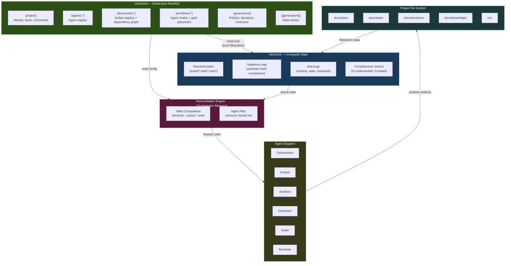

### 2.2 Request Lifecycle

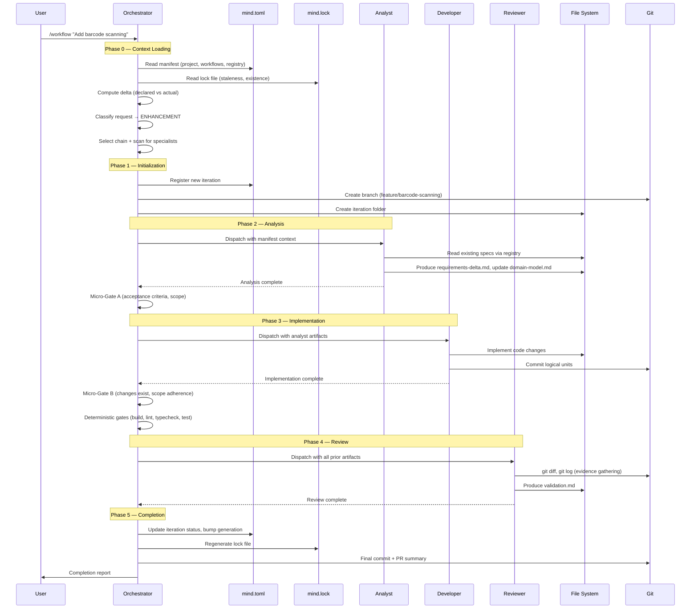

---

## 3. The Mind Manifest

### 3.1 Format Decision: TOML

The manifest format was evaluated against five constraints: LLM-parseable, human-editable, machine-parseable, comment-friendly, and diff-friendly.

| Property | TOML | YAML | JSON | Lua |
|----------|:----:|:----:|:----:|:---:|
| Explicit typing | Excellent | Poor (`NO`→`false`, `3.10`→`3.1`) | Good | N/A (code) |
| Structure visibility | Section headers → scannable | Indentation-dependent | Brace-matching | Good |
| Merge conflicts | Line-oriented, sections independent | Indentation-sensitive | Noisy (braces) | Good |
| Comments | Native | Native | None | Native |
| LLM fluency | Good | Excellent | Excellent | Good |
| Deep nesting | Moderate (3-level limit) | Excellent | Good | Excellent |
| Ecosystem | Strong (Cargo, pyproject) | Massive (DevOps) | Universal | Moderate |

**Decision**: TOML. For a governance file where a subtle type coercion could cause an agent to misinterpret project configuration, TOML's explicitness is a safety feature. YAML's `enable: no` silently becoming `enable: false` is exactly the class of bug a single source of truth must prevent.

**Precedent**: Cargo.toml, pyproject.toml, Hugo config.toml — build-system manifests have converged on TOML.

**Nesting mitigation**: Maximum 3 levels. Dotted keys for leaf properties. URI-based IDs carry hierarchy in the string, not in TOML structure.

### 3.2 Manifest Structure: `mind.toml`

```toml
# ╔══════════════════════════════════════════════════════════════════╗
# ║  MIND MANIFEST — Single Source of Truth                         ║
# ║                                                                 ║
# ║  Declares the complete system state.                            ║
# ║  Agents read it. Orchestrator enforces it. Git versions it.     ║
# ╚══════════════════════════════════════════════════════════════════╝

# ─── MANIFEST METADATA ───────────────────────────────────────────

[manifest]
schema     = "mind/v2.0"
generation = 4                      # Monotonic counter (NixOS-style)
updated    = 2026-02-24T14:30:00Z

# ─── PROJECT IDENTITY ────────────────────────────────────────────

[project]
name        = "inventory-api"
description = "Warehouse inventory management with barcode scanning"
domain      = "manufacturing"
type        = "backend"              # backend | frontend | fullstack | library | cli
created     = 2026-02-20

[project.stack]
language  = "python@3.12"
framework = "fastapi"
database  = "postgresql"
testing   = "pytest"

[project.commands]
dev       = "uvicorn app.main:app --reload"
test      = "pytest --cov=app"
lint      = "ruff check ."
typecheck = "mypy app/"
build     = "docker build -t inventory ."

# ─── PROFILES ─────────────────────────────────────────────────────

[profiles]
active = ["backend-api"]
# backend-api activates:
#   - conventions: backend-patterns
#   - templates:   domain-model, api-contract
#   - specialists: database (available, not auto-included)

# ─── FRAMEWORK CONFIGURATION ─────────────────────────────────────

[framework]
version = "2.0.0"
path    = ".claude"

[framework.orchestration]
max-retries      = 2
session-strategy = "split"            # single | split | manual

[framework.quality-gates]
deterministic = true                  # Enable build/lint/type-check/test gates
micro-gates   = true                  # Enable per-agent verification (A + B)

# ─── AGENT REGISTRY ──────────────────────────────────────────────

[agents.orchestrator]
id     = "agent:orchestrator"
path   = ".claude/agents/orchestrator.md"
role   = "dispatch"
loads  = "always"

[agents.analyst]
id       = "agent:analyst"
path     = ".claude/agents/analyst.md"
role     = "analysis"
loads    = "on-demand"
produces = ["doc:spec/requirements", "doc:spec/domain-model"]

[agents.architect]
id       = "agent:architect"
path     = ".claude/agents/architect.md"
role     = "design"
loads    = "conditional"              # Only for NEW_PROJECT or structural ENHANCEMENT
produces = ["doc:spec/architecture", "doc:spec/api-contracts"]

[agents.developer]
id       = "agent:developer"
path     = ".claude/agents/developer.md"
role     = "implementation"
loads    = "on-demand"
produces = ["doc:iteration/changes"]

[agents.tester]
id       = "agent:tester"
path     = ".claude/agents/tester.md"
role     = "verification"
loads    = "on-demand"

[agents.reviewer]
id       = "agent:reviewer"
path     = ".claude/agents/reviewer.md"
role     = "verification"
loads    = "on-demand"
produces = ["doc:iteration/validation"]

[agents.discovery]
id       = "agent:discovery"
path     = ".claude/agents/discovery.md"
role     = "exploration"
loads    = "on-demand"
produces = ["doc:spec/project-brief"]

# ─── SPECIALIST AGENTS (project-specific) ────────────────────────

[agents.database-specialist]
id            = "specialist:database"
path          = ".claude/specialists/database-specialist.md"
role          = "analysis"
loads         = "conditional"
triggers      = ["database", "schema", "migration", "SQL", "query", "index"]
inserts-after = "analyst"

# ─── WORKFLOW DEFINITIONS ─────────────────────────────────────────

[workflows.new-project]
chain               = ["analyst", "architect", "developer", "tester", "reviewer"]
session-split-after = "architect"
gates.after-analyst   = "gate:micro-a"
gates.after-developer = "gate:micro-b"
gates.before-reviewer = "gate:deterministic"

[workflows.bug-fix]
chain = ["analyst", "developer", "tester", "reviewer"]
gates.after-developer = "gate:micro-b"
gates.before-reviewer = "gate:deterministic"

[workflows.enhancement]
chain = ["analyst", "developer", "tester", "reviewer"]
# architect inserted dynamically if structural change detected
gates.after-analyst   = "gate:micro-a"
gates.after-developer = "gate:micro-b"
gates.before-reviewer = "gate:deterministic"

[workflows.refactor]
chain = ["analyst", "developer", "reviewer"]
gates.after-developer = "gate:micro-b"
gates.before-reviewer = "gate:deterministic"

# ─── DOCUMENT REGISTRY ────────────────────────────────────────────
# Every artifact gets a canonical URI: doc:{zone}/{name}
# Physical paths are resolved relative to project root.

# ── Zone 1: Specifications (stable, versioned intent) ──

[documents.spec.project-brief]
id          = "doc:spec/project-brief"
path        = "docs/spec/project-brief.md"
zone        = "spec"
status      = "active"
owner       = "agent:discovery"
depends-on  = []
tags        = ["core", "planning"]

[documents.spec.requirements]
id          = "doc:spec/requirements"
path        = "docs/spec/requirements.md"
zone        = "spec"
status      = "active"
owner       = "agent:analyst"
depends-on  = ["doc:spec/project-brief"]
consumed-by = ["agent:architect", "agent:developer", "agent:tester"]
tags        = ["core"]

[documents.spec.domain-model]
id          = "doc:spec/domain-model"
path        = "docs/spec/domain-model.md"
zone        = "spec"
status      = "active"
owner       = "agent:analyst"
depends-on  = ["doc:spec/requirements"]
consumed-by = ["agent:architect", "agent:developer", "agent:tester"]
tags        = ["core", "domain", "entities"]

[documents.spec.architecture]
id          = "doc:spec/architecture"
path        = "docs/spec/architecture.md"
zone        = "spec"
status      = "active"
owner       = "agent:architect"
depends-on  = ["doc:spec/requirements", "doc:spec/domain-model"]
consumed-by = ["agent:developer"]
tags        = ["core", "design"]

[documents.spec.api-contracts]
id          = "doc:spec/api-contracts"
path        = "docs/spec/api-contracts.md"
zone        = "spec"
status      = "draft"
owner       = "agent:architect"
depends-on  = ["doc:spec/domain-model", "doc:spec/architecture"]
consumed-by = ["agent:developer", "agent:tester"]
tags        = ["api", "contracts"]

# ── Zone 2: Runtime State (volatile) ──

[documents.state.current]
id     = "doc:state/current"
path   = "docs/state/current.md"
zone   = "state"
status = "active"
owner  = "agent:orchestrator"

[documents.state.workflow]
id     = "doc:state/workflow"
path   = "docs/state/workflow.md"
zone   = "state"
status = "active"
owner  = "agent:orchestrator"

# ── Zone 3: Iterations (append-only history) ──

[documents.iterations.001-new-barcode-scanning]
id         = "doc:iteration/001"
path       = "docs/iterations/001-new-barcode-scanning/"
zone       = "iteration"
status     = "complete"
type       = "new-project"
branch     = "feature/barcode-scanning"
implements = ["doc:spec/requirements#FR-1"]
created    = 2026-02-20
artifacts  = ["overview.md", "changes.md", "validation.md"]

# ── Zone 4: Domain Knowledge (stable reference) ──

[documents.knowledge.glossary]
id     = "doc:knowledge/glossary"
path   = "docs/knowledge/glossary.md"
zone   = "knowledge"
status = "active"
owner  = "agent:discovery"
tags   = ["domain", "reference"]

# ─── DEPENDENCY GRAPH ──────────────────────────────────────────────

[[graph]]
from = "doc:spec/requirements"
to   = "doc:spec/project-brief"
type = "derives-from"

[[graph]]
from = "doc:spec/domain-model"
to   = "doc:spec/requirements"
type = "derives-from"

[[graph]]
from = "doc:spec/architecture"
to   = "doc:spec/requirements"
type = "derives-from"

[[graph]]
from = "doc:spec/architecture"
to   = "doc:spec/domain-model"
type = "derives-from"

[[graph]]
from = "doc:spec/api-contracts"
to   = "doc:spec/domain-model"
type = "derives-from"

[[graph]]
from = "doc:iteration/001"
to   = "doc:spec/requirements#FR-1"
type = "implements"

# ─── GOVERNANCE ────────────────────────────────────────────────────

[governance]
max-retries     = 2
review-policy   = "evidence-based"
commit-policy   = "conventional"
branch-strategy = "type-descriptor"

[governance.gates.micro-a]
type   = "probabilistic"
checks = ["acceptance-criteria-present", "scope-boundaries-defined", "no-ambiguous-terms"]

[governance.gates.micro-b]
type   = "probabilistic"
checks = ["changes-md-exists", "all-files-exist", "scope-adherence"]

[governance.gates.deterministic]
type     = "deterministic"
commands = ["build", "lint", "typecheck", "test"]

[[governance.decisions]]
id       = "ADR-001"
title    = "FastAPI over Django"
status   = "accepted"
date     = 2026-02-20
document = "docs/spec/decisions/001-fastapi.md"

# ─── MANIFEST INVARIANTS ──────────────────────────────────────────

[manifest.invariants]
every-document-has-owner       = true
every-iteration-has-validation = true
no-orphan-dependencies         = true
no-circular-dependencies       = true

# ─── GENERATIONS ───────────────────────────────────────────────────

[[generations]]
number = 4
date   = 2026-02-24
event  = "iteration-start"
detail = "003-enhancement-dashboard created"

[[generations]]
number = 3
date   = 2026-02-23
event  = "iteration-complete"
detail = "002-enhancement-reorder completed"
```

### 3.3 Lock File: `mind.lock`

Auto-generated JSON snapshot of actual filesystem state. Committed to git. Never hand-edited.

```json
{
  "lockVersion": 1,
  "generatedAt": "2026-02-24T14:35:00Z",
  "generation": 4,
  "resolved": {
    "doc:spec/project-brief": {
      "path": "docs/spec/project-brief.md",
      "exists": true,
      "hash": "sha256:a3f2b1c8",
      "size": 2847,
      "lastModified": "2026-02-20T10:00:00Z",
      "stale": false
    },
    "doc:spec/requirements": {
      "path": "docs/spec/requirements.md",
      "exists": true,
      "hash": "sha256:d4e7f0a3",
      "size": 5231,
      "lastModified": "2026-02-24T09:00:00Z",
      "stale": false,
      "upstreamHashes": {
        "doc:spec/project-brief": "sha256:a3f2b1c8"
      }
    },
    "doc:spec/api-contracts": {
      "path": "docs/spec/api-contracts.md",
      "exists": false,
      "stale": true,
      "reason": "declared but not yet created"
    }
  },
  "warnings": [
    "doc:spec/api-contracts — declared but missing on disk"
  ],
  "completeness": {
    "requirements": { "total": 4, "implemented": 2, "in-progress": 1, "pending": 1, "percentage": 50 },
    "iterations": { "total": 3, "complete": 2, "active": 1 }
  },
  "integrity": "sha256:full-lock-hash"
}
```

**Staleness detection**: Each resolved artifact records the hashes of its dependencies at the time it was last updated. When a dependency's hash changes, everything downstream becomes stale.

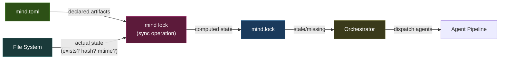

### 3.4 Canonical URI Scheme

Every artifact gets a stable, path-independent identifier.

**Format**: `{type}:{zone}/{name}` — optionally `#{fragment}` for sub-artifact precision.

| Prefix | Scope | Example |
|--------|-------|---------|
| `doc:spec/` | Stable specifications | `doc:spec/requirements`, `doc:spec/domain-model` |
| `doc:state/` | Volatile runtime state | `doc:state/current`, `doc:state/workflow` |
| `doc:iteration/` | Immutable history | `doc:iteration/003` |
| `doc:knowledge/` | Domain reference | `doc:knowledge/glossary` |
| `agent:` | Agent definitions | `agent:analyst`, `agent:architect` |
| `specialist:` | Specialist agents | `specialist:database` |
| `gate:` | Quality gates | `gate:micro-a`, `gate:deterministic` |
| `workflow:` | Workflow definitions | `workflow:enhancement` |

**Fragment addressing**: `doc:spec/requirements#FR-3` points to a specific requirement. Iterations declare `implements = ["doc:spec/requirements#FR-3"]` — enabling full requirement traceability from business need through implementation and validation.

**`@`-shorthand for prose**: In markdown documents, authors use `@`-prefixed shorthand for readability:

```markdown
This component implements @spec/requirements#FR-3 (real-time dashboard).
The data model follows @spec/domain-model#StockLevel.
See @spec/architecture#ADR-001 for the framework choice rationale.
```

Resolution: `@{zone}/{name}` → `doc:{zone}/{name}` → look up `path` in `mind.toml` registry.

**Why path-independent IDs matter**: If `docs/spec/requirements.md` moves to `docs/specifications/requirements.md`, only the manifest's `path` field changes. Every cross-reference, every dependency edge, every `@` shorthand still resolves correctly. Zero broken links.

---

## 4. Framework File Organization

What ships with the Mind Framework:

```
mind-framework/
├── CLAUDE.md                       # Framework index (~200 tokens, pure routing)
├── MIND-FRAMEWORK.md               # This document
├── README.md                       # Framework documentation
├── install.sh                      # Install framework into project's .claude/
├── scaffold.sh                     # Bootstrap project structure + mind.toml
│
├── agents/                         # Core agents (7)
│   ├── orchestrator.md             # Dispatch + git + micro-gates + reconciliation
│   ├── analyst.md                  # Requirements + domain model extraction
│   ├── architect.md                # System design + API contracts
│   ├── developer.md                # Implementation + commit discipline
│   ├── tester.md                   # Test strategy + domain model derivation
│   ├── reviewer.md                 # Evidence-based review + deterministic gates
│   └── discovery.md                # Product management depth exploration
│
├── conventions/                    # Universal rules (6)
│   ├── CLAUDE.md                   # Convention index
│   ├── code-quality.md             # Structure, naming, complexity, DRY
│   ├── documentation.md            # 4-zone model, doc hierarchy
│   ├── git-discipline.md           # Commit protocol, branch strategy, PR flow
│   ├── severity.md                 # MUST/SHOULD/COULD + intent markers
│   ├── temporal.md                 # Temporal contamination heuristic
│   └── backend-patterns.md         # [Optional] API, data model, validation
│
├── skills/                         # On-demand deep dives (4)
│   ├── CLAUDE.md                   # Skill index
│   ├── planning/SKILL.md           # 3-doc model: PLAN, WIP, LEARNINGS
│   ├── debugging/SKILL.md          # 5-step systematic protocol
│   ├── refactoring/SKILL.md        # Priority classification
│   └── quality-review/SKILL.md     # 6 cognitive-mode questions
│
├── commands/                       # User entry points (2)
│   ├── discover.md                 # /discover — interactive exploration
│   └── workflow.md                 # /workflow — full agent pipeline
│
├── specialists/                    # Optional domain specialists
│   ├── _contract.md                # Specialist creation guide + contract
│   └── examples/
│       └── database-specialist.md  # Reference example (not installed by default)
│
└── templates/                      # Reusable document templates
    ├── domain-model.md             # Entity registry, business rules, constraints
    ├── api-contract.md             # API endpoint specification
    ├── iteration-overview.md       # Iteration tracking template
    └── retrospective.md            # Lessons learned template
```

**Delta from v1**: +1 convention (`backend-patterns.md`), +1 directory (`specialists/`), +1 directory (`templates/`), +`mind.toml`/`mind.lock` system. Agent count, command count, and skill count unchanged.

---

## 5. Project File Organization

What `scaffold.sh` creates in a target project:

```
project-root/
│
├── mind.toml                          # Declarative manifest (human-authored + orchestrator-managed)
├── mind.lock                          # Computed state (auto-generated, committed)
├── CLAUDE.md                          # Project constitution (routing table)
├── README.md
├── .gitignore
│
├── .claude/                           # Agent framework (installed by install.sh)
│   ├── CLAUDE.md                      # Framework index
│   ├── agents/                        # All 7 agent definitions
│   ├── conventions/                   # All convention files
│   ├── skills/                        # All skill directories
│   ├── commands/                      # All command files
│   ├── specialists/                   # Project-specific specialists
│   └── templates/                     # Document templates
│
├── docs/
│   ├── spec/                          # ZONE 1: Stable specifications
│   │   ├── project-brief.md           # Vision, deliverables, scope
│   │   ├── requirements.md            # Living requirements document
│   │   ├── domain-model.md            # Entity registry, business rules
│   │   ├── architecture.md            # System design, component boundaries
│   │   ├── api-contracts.md           # Endpoint specs, schemas
│   │   └── decisions/                 # Architecture Decision Records
│   │       └── _template.md
│   │
│   ├── state/                         # ZONE 2: Volatile runtime state
│   │   ├── current.md                 # Active work, known issues, priorities
│   │   └── workflow.md                # Active workflow state for session resume
│   │
│   ├── iterations/                    # ZONE 3: Immutable history (append-only)
│   │   └── {NNN}-{type}-{descriptor}/
│   │       ├── overview.md            # Classification, scope, agent chain
│   │       ├── changes.md             # What was modified and why
│   │       ├── validation.md          # Review findings and sign-off
│   │       └── retrospective.md       # Lessons learned (optional per type)
│   │
│   └── knowledge/                     # ZONE 4: Domain reference (stable)
│       ├── glossary.md                # Business terms, domain language
│       └── integrations.md            # External systems, APIs, MCP servers
│
└── src/                               # Application source code
```

### 5.1 Zone Architecture

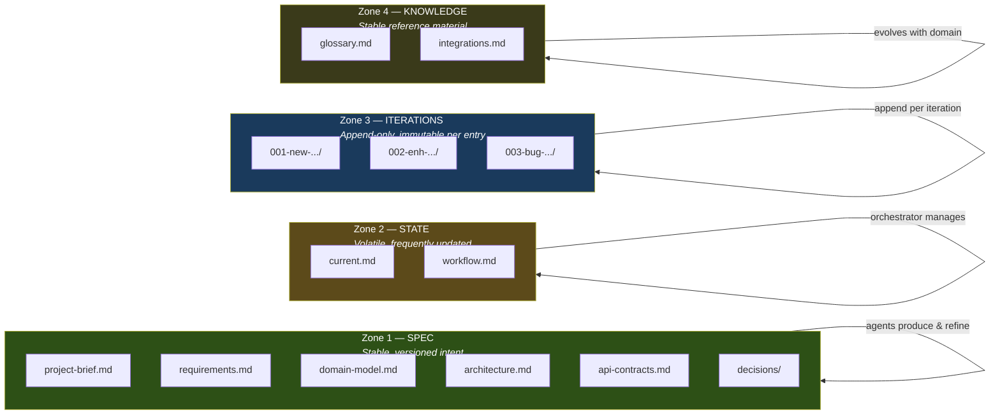

**Zone semantics**:

| Zone | Mutability | Who Writes | When to Read | Staleness Tracked |
|------|-----------|------------|-------------|-------------------|
| **spec/** | Stable — updated by agents after analysis | Analyst, Architect, Discovery | Before any implementation work | Yes (via `mind.lock`) |
| **state/** | Volatile — changes every session | Orchestrator | At workflow start to check for interrupted work | No (always current) |
| **iterations/** | Append-only — immutable once complete | All agents (within their iteration) | When reviewing history or resuming | No (historical) |
| **knowledge/** | Stable — evolves with business understanding | Discovery, Analyst | When needing domain context | Yes (via `mind.lock`) |

---

## 6. Agent Orchestration

### 6.1 Agent Registry

| Agent | Role | Loads | Produces | Key Enhancement in v2 |
|-------|------|-------|----------|----------------------|
| **Orchestrator** | Dispatch | Always | `doc:state/workflow`, iteration registration | Git integration, micro-gates, reconciliation, session splits |
| **Analyst** | Analysis | On-demand | `doc:spec/requirements`, `doc:spec/domain-model` | Domain model extraction, GIVEN/WHEN/THEN acceptance criteria |
| **Architect** | Design | Conditional | `doc:spec/architecture`, `doc:spec/api-contracts` | API contracts deliverable, domain model alignment |
| **Developer** | Implementation | On-demand | `doc:iteration/changes` | Commit discipline protocol, scope cross-reference |
| **Tester** | Verification | On-demand | — | Domain model test derivation |
| **Reviewer** | Verification | On-demand | `doc:iteration/validation` | Deterministic gates, git discipline check |
| **Discovery** | Exploration | On-demand | `doc:spec/project-brief` | Stakeholder mapping, business rules, MVP scoping |

### 6.2 Workflow Chains by Request Type

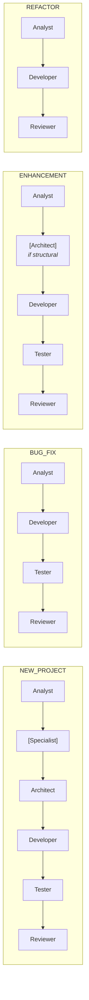

### 6.3 Specialist Injection

Specialists are project-specific agents that activate conditionally based on keyword triggers.

**Contract** (from `specialists/_contract.md`):

```markdown
---
name: {specialist-name}
description: {when this specialist activates}
type: specialist
triggers: [{keyword1}, {keyword2}, ...]
inserts-after: analyst
model: claude-sonnet-4-5
tools: [Read, Write, Bash]
---

# {Specialist Name}

## Activation Conditions
{Keywords and context that trigger inclusion}

## Input
{What artifacts this specialist reads}

## Output
{What artifacts this specialist produces}

## Rules
{Specialist-specific constraints}
```

**Orchestrator behavior** (Step 3.5):
1. For each file in `specialists/*.md`, read frontmatter `triggers`
2. Match triggers against user's request description (case-insensitive)
3. If >= 2 trigger words match: insert specialist after the agent in `inserts-after`
4. Log activation in iteration overview

**Design constraint**: Zero specialists ship by default. The framework stays lean. Users create specialists as project needs demand.

### 6.4 Agent Context Loading

Each agent loads only what it needs from the manifest:

| Agent | Reads from mind.toml | Reads from mind.lock |
|-------|---------------------|---------------------|
| Orchestrator | `[project]`, `[workflows]`, `[agents]`, `[governance]`, `[[generations]]` | Full: staleness, completeness, warnings |
| Analyst | `[documents.spec.*]`, `[[graph]]` | Staleness of spec documents |
| Architect | `[documents.spec.*]`, `[project.stack]` | Staleness of architecture |
| Developer | `[project.commands]`, active iteration | — (reads code directly) |
| Tester | Active iteration, `[documents.spec.domain-model]` | — |
| Reviewer | `[governance]`, active iteration | Staleness, completeness |

---

## 7. Data Flows & Dependencies

### 7.1 Reactive Dependency Graph

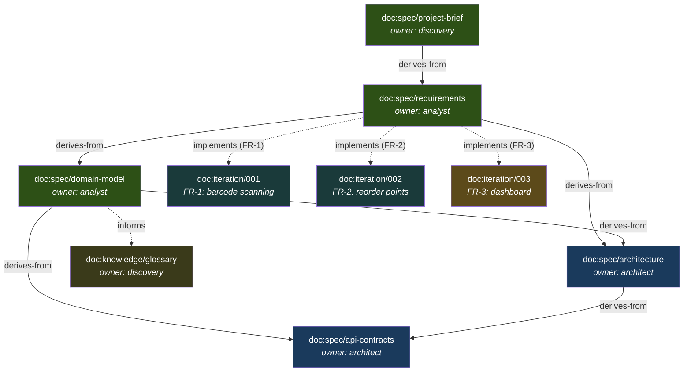

### 7.2 Edge Types

| Edge | Direction | Meaning | Staleness Propagation |
|------|-----------|---------|----------------------|
| `derives-from` | downstream → upstream | Created based on upstream content | Yes — upstream change = downstream stale |
| `implements` | iteration → requirement | Work that fulfills a requirement | Advisory — flagged but not auto-stale |
| `validates` | test → requirement | Test that proves a requirement | Advisory — flagged for review |
| `supersedes` | new → old | Replaces a prior decision/artifact | Old marked as superseded |
| `informs` | knowledge → spec | Reference context | No propagation (advisory only) |

### 7.3 Reconciliation Engine

The reconciliation engine is the orchestrator's core behavior — computing the delta between declared and actual state:

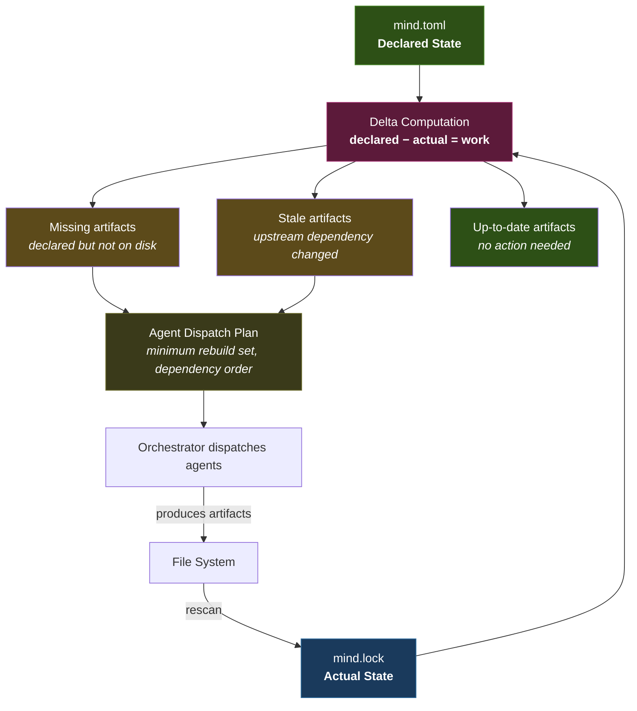

**Change propagation example**:

```
1. User edits docs/spec/project-brief.md
2. mind.lock detects hash change: a3f2b1c8 → b7c3d2e9
3. Staleness propagation:
   └─ doc:spec/project-brief        → CHANGED
      └─ doc:spec/requirements      → STALE (upstream changed)
         ├─ doc:spec/domain-model   → STALE (transitive)
         ├─ doc:spec/architecture   → STALE (transitive)
         │   └─ doc:spec/api-contracts → STALE (transitive)
         └─ doc:iteration/003       → FLAGGED (implements stale req)

4. Orchestrator rebuild plan:
   Step 1: agent:analyst   → refresh requirements + domain-model
   Step 2: agent:architect → refresh architecture + api-contracts

   Skipped: doc:knowledge/glossary (no dependency edge to project-brief)
```

### 7.4 Graph Queries Available to Agents

| Query | Use Case |
|-------|----------|
| "What is stale?" | Orchestrator decides what to rebuild |
| "What implements FR-3?" | Reviewer traces requirement → implementation |
| "What breaks if domain-model changes?" | Impact analysis before modifications |
| "Is FR-4 tested?" | Tester gap analysis |
| "What should analyst read?" | Smart context loading from `depends-on` edges |
| "Project completion %" | Status reporting from `completeness` in lock file |

---

## 8. Iteration Lifecycle

### 8.1 State Machine

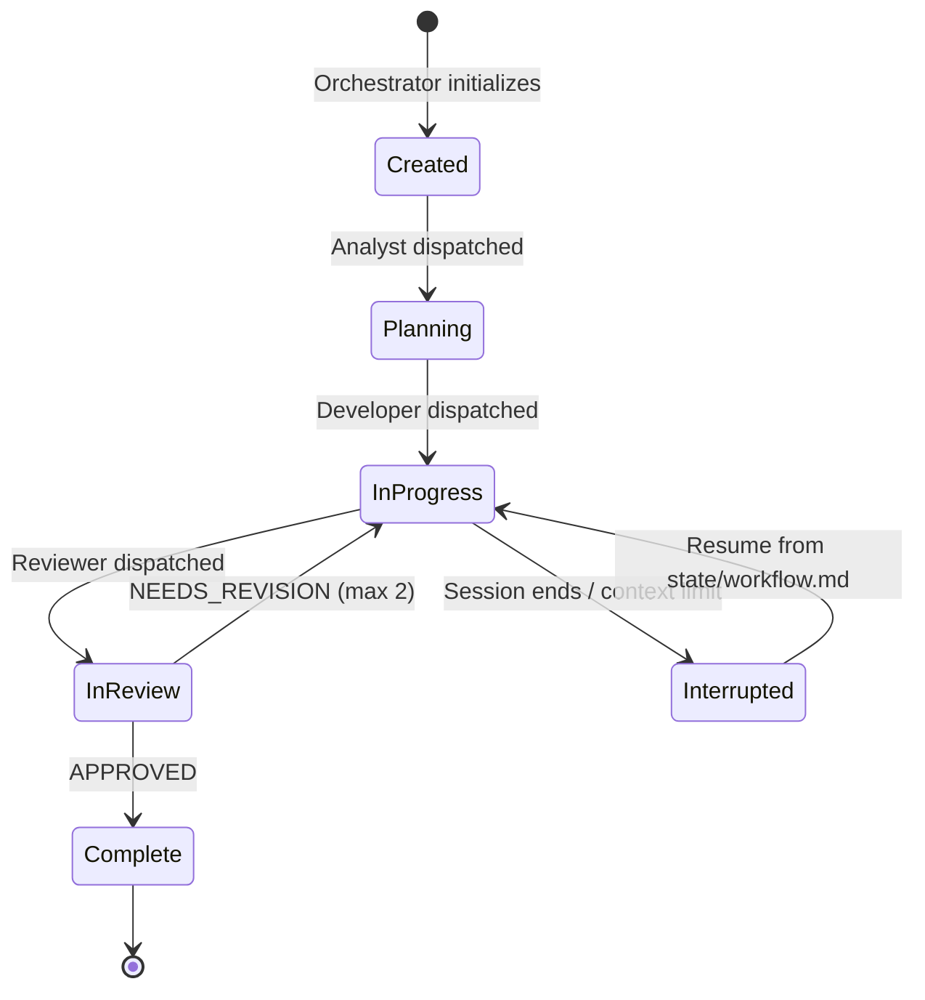

### 8.2 Initialization

When the orchestrator creates an iteration:

1. **Create iteration folder**: `docs/iterations/{NNN}-{type}-{descriptor}/`
2. **Create git branch**: `{type}/{descriptor}` (e.g., `feature/barcode-scanning`)
3. **Register in manifest**:
   ```toml
   [documents.iterations.004-enhancement-barcode]
   id         = "doc:iteration/004"
   path       = "docs/iterations/004-enhancement-barcode/"
   zone       = "iteration"
   status     = "active"
   type       = "enhancement"
   branch     = "feature/barcode-scanning"
   implements = ["doc:spec/requirements#FR-1"]
   created    = 2026-02-24
   artifacts  = ["overview.md"]
   ```
4. **Add graph edge**:
   ```toml
   [[graph]]
   from = "doc:iteration/004"
   to   = "doc:spec/requirements#FR-1"
   type = "implements"
   ```
5. **Bump generation**:
   ```toml
   [[generations]]
   number = 5
   date   = 2026-02-24
   event  = "iteration-start"
   detail = "004-enhancement-barcode created"
   ```

### 8.3 Artifact Scaling by Request Type

Not every iteration needs the same number of files:

| Type | overview.md | changes.md | validation.md | retrospective.md |
|:---:|:---:|:---:|:---:|:---:|
| NEW_PROJECT | Required | Required | Required | Recommended |
| BUG_FIX | Required | Required | Required | — |
| ENHANCEMENT | Required | Required | Required | — |
| REFACTOR | Required | Required | Required | — |

### 8.4 Branch Strategy

| Request Type | Branch Prefix | Example |
|:---:|---|---|
| NEW_PROJECT | `feature/` | `feature/inventory-api` |
| BUG_FIX | `bugfix/` | `bugfix/login-500-error` |
| ENHANCEMENT | `feature/` | `feature/barcode-scanning` |
| REFACTOR | `refactor/` | `refactor/data-layer` |

### 8.5 Commit Protocol

Commits are workflow events, not afterthoughts:

| Checkpoint | Message Format | Example |
|---|---|---|
| Iteration created | `docs: initialize iteration {descriptor}` | `docs: initialize iteration barcode-scanning` |
| Each logical implementation unit | `{type}({scope}): {description}` | `feat(inventory): add barcode scan endpoint` |
| Test additions | `test({scope}): {description}` | `test(inventory): validate barcode format` |
| Review artifacts | `docs: add validation for {descriptor}` | `docs: add validation for barcode-scanning` |
| Planning complete (session split) | `wip: planning complete for {descriptor}` | `wip: planning complete for barcode-scanning` |

---

## 9. Quality Gate Architecture

### 9.1 Gate Placement

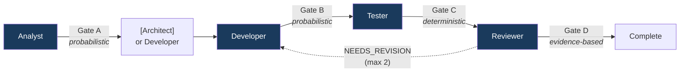

### 9.2 Gate Definitions

| Gate | Type | When | Checks | On Failure |
|------|------|------|--------|------------|
| **Micro-Gate A** | Probabilistic | After analyst | Acceptance criteria present, scope boundaries defined, no ambiguous unquantified terms | Retry analyst (counts toward limit) |
| **Micro-Gate B** | Probabilistic | After developer | `changes.md` exists, all listed files exist on disk, scope matches analyst's boundaries | Retry developer (counts toward limit) |
| **Deterministic** | Deterministic | Before reviewer | Build passes, lint clean, type-check passes, all tests pass | Return to developer with errors |
| **Reviewer** | Evidence-based | After reviewer | MUST/SHOULD/COULD findings via git diff + test results + requirement traceability | If MUST findings: return to developer (max 2 total retries) |

### 9.3 Gate Failure Flow

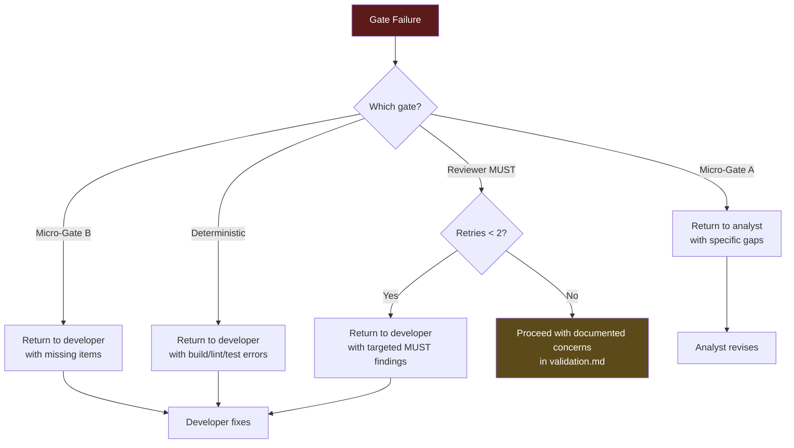

### 9.4 Deterministic Gate Commands

Commands are resolved from `project.commands` in `mind.toml`. Run in order; stop at first failure:

1. **Build**: `project.commands.build` — must exit 0
2. **Lint**: `project.commands.lint` — must produce zero errors (warnings acceptable)
3. **Type-check**: `project.commands.typecheck` — must exit 0
4. **Test**: `project.commands.test` — all tests must pass

If any command is not defined in the manifest, that check is skipped.

---

## 10. Governance & Versioning

### 10.1 Governance Model

| Aspect | Policy | Source |
|--------|--------|--------|
| **Review** | Evidence-based (git diff, git log, test results) — no self-assessed scores | `governance.review-policy` |
| **Commits** | Conventional format: `{type}({scope}): {description}` | `governance.commit-policy` |
| **Branches** | `{type}/{descriptor}` per request classification | `governance.branch-strategy` |
| **Retries** | Max 2 per workflow, with targeted feedback to specific agent | `governance.max-retries` |
| **Severity** | MUST/SHOULD/COULD with dual-path verification for blocking findings | `conventions/severity.md` |
| **Intent markers** | `:PERF:`, `:UNSAFE:`, `:SCHEMA:`, `:TEMP:` — prevent false-positive findings | `conventions/severity.md` |
| **Temporal contamination** | 5-question heuristic to detect reliance on outdated knowledge | `conventions/temporal.md` |

### 10.2 Generations (NixOS-Inspired State History)

Every significant state transition is recorded as a generation in the manifest:

```toml
[[generations]]
number = 5
date   = 2026-02-24
event  = "iteration-start"           # iteration-start | iteration-complete | spec-update | decision-made
detail = "004-enhancement-barcode created"
```

Generations provide a strategic changelog within the manifest itself. The last 5-10 are kept inline; full history lives in `git log -- mind.toml`.

**Generation events**:
- `iteration-start` — new iteration folder + branch created
- `iteration-complete` — reviewer-approved, iteration archived
- `spec-update` — specification document materially changed
- `decision-made` — ADR accepted or deprecated

### 10.3 Architecture Decision Records

ADRs are registered in the manifest and stored as files:

```toml
[[governance.decisions]]
id       = "ADR-001"
title    = "FastAPI over Django"
status   = "accepted"                # proposed | accepted | deprecated | superseded
date     = 2026-02-20
document = "docs/spec/decisions/001-fastapi.md"
```

### 10.4 Manifest Self-Validation

The manifest declares invariants that must hold:

```toml
[manifest.invariants]
every-document-has-owner       = true   # No orphan documents in registry
every-iteration-has-validation = true   # Complete iterations must have validation.md
no-orphan-dependencies         = true   # Every depends-on target exists in registry
no-circular-dependencies       = true   # Graph is a DAG
```

These are checked by the orchestrator at workflow start and by `mind lock` during sync.

---

## 11. Session & Context Management

### 11.1 Session Split Strategy

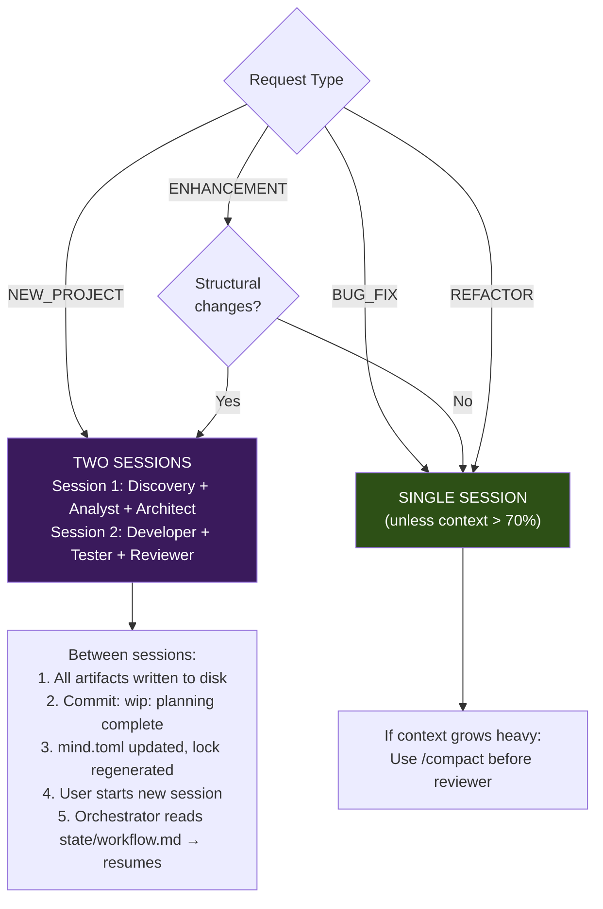

### 11.2 Workflow Resume Protocol

When a workflow is interrupted (session end, context limit, user choice):

1. Orchestrator writes current state to `docs/state/workflow.md`:
   ```markdown
   ## Workflow State
   - **Type**: ENHANCEMENT
   - **Descriptor**: barcode-scanning
   - **Last Agent**: architect
   - **Remaining Chain**: [developer, tester, reviewer]
   - **Iteration**: docs/iterations/004-enhancement-barcode/
   - **Branch**: feature/barcode-scanning
   ```

2. On next session start, orchestrator:
   - Reads `mind.toml` for project context
   - Reads `docs/state/workflow.md` for interrupted state
   - Offers to resume or start fresh
   - If resume: skips completed agents, loads iteration artifacts for context

### 11.3 Token Efficiency Design

| Mechanism | How It Saves Tokens |
|-----------|-------------------|
| Adaptive routing | BUG_FIX loads 4 agents, not 7. Saves ~40-60% agent tokens. |
| On-demand skill loading | Skills are reference docs loaded only when agent needs guidance. |
| Separate conventions | Update one convention; all agents inherit. No duplication. |
| Manifest context loading | Each agent reads only relevant manifest sections (see §6.4). |
| Lean agents | ~200 lines average per agent. Total framework ~2,500 lines vs Skynet's 7,000+. |
| Session splits | Long workflows split across sessions to prevent context exhaustion. |
| `@`-shorthand | Compact cross-references in prose: `@spec/requirements#FR-3` vs full paths. |

---

## 12. Profiles & Extensibility

### 12.1 Profile Concept

Profiles are NixOS module-like activation bundles. Activating a profile enables a coherent set of conventions, templates, and specialist availability.

```toml
[profiles]
active = ["backend-api"]
```

### 12.2 Available Profiles

| Profile | Activates | Use When |
|---------|-----------|----------|
| `backend-api` | `conventions/backend-patterns.md`, `templates/domain-model.md`, `templates/api-contract.md`, `specialist:database` (available) | Project type is `backend` or `fullstack` |
| `event-driven` | Messaging patterns guidance, async workflow awareness | Project uses message queues, event sourcing |
| `minimal` | Core agents + conventions only, no specialists, no optional templates | Small scripts, utilities, documentation |

### 12.3 Layered Adoption

The manifest system is designed for gradual adoption:

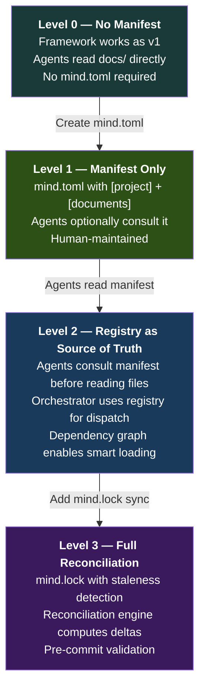

| Capability | L0 | L1 | L2 | L3 |
|:---|:---:|:---:|:---:|:---:|
| Framework agents work | Yes | Yes | Yes | Yes |
| Artifact registry | — | Yes | Yes | Yes |
| Dependency graph | — | Optional | Yes | Yes |
| Smart context loading | — | — | Yes | Yes |
| Staleness detection | — | — | — | Yes |
| Completeness metrics | — | — | — | Yes |
| Reconciliation engine | — | — | — | Yes |
| **Tooling required** | None | None | None | `mind lock` script |

**Minimal Level 1 manifest** (~20 lines):

```toml
[manifest]
schema = "mind/v2.0"
generation = 1

[project]
name = "my-project"
type = "backend"

[project.stack]
language = "python@3.12"
framework = "fastapi"

[project.commands]
test = "pytest"
lint = "ruff check ."

[profiles]
active = ["backend-api"]
```

---

## 13. Design Decisions & Rationale

### 13.1 What This Specification Adopts

| Decision | Source | Rationale |
|----------|--------|-----------|
| TOML manifest format | NixOS analysis, canonical design | Unambiguous types, section-navigable, Cargo precedent. YAML's implicit coercion is a governance risk. |
| `doc:` URI scheme in manifest | Canonical design | Systematic, typed namespaces. Path-independent references survive file moves. |
| `@`-shorthand in prose | Prior brainstorm | Ergonomic for humans. `@spec/requirements#FR-3` is readable in any markdown paragraph. |
| Lock file as core (committed to git) | Canonical design | Upstream hash tracking enables reactive staleness detection — the key NixOS innovation. |
| Reconciliation as orchestrator behavior | Canonical design | Orchestrator reads manifest + lock → computes delta → dispatches. The `mind lock` CLI computes the lock file; the orchestrator consumes it. |
| Hybrid incremental CLI path | implementation-architecture.md, operational-layer docs | Python MVP (~700 lines, stdlib-only) validates the design. Rust CLI follows after real-project validation. CLI contract (Appendix A) defines the stable interface both must implement. |
| Layered adoption (L0-L3) | Prior brainstorm | Framework works without manifest. Projects grow into it. Zero barrier to entry. |
| Profiles (NixOS modules) | Canonical design | Clean modularity. `backend-api` activates a coherent bundle of conventions + templates. |
| 4-zone documentation | v2 analysis, v2 improvement | Separates stable specs from volatile state from immutable history from reference material. |
| Domain model artifact | v2 analysis | Eliminates the #1 backend quality gap. Structured entity + business rule registry. |
| Deterministic gates before reviewer | v2 improvement | Build/lint/test failures should never reach the reviewer. |
| Evidence-based review (no scores) | Mind v1 (preserve) | `git diff` + test results > self-assessed "95% quality". Both benchmarks use scores; both are unreliable. |
| 7 core agents (unchanged count) | v2 improvement | Current agents cover all workflow needs. Adding `documenter`/`deployer`/`researcher` would bloat context. |
| Generations (NixOS-style) | Canonical design | Strategic changelog within the manifest. Combined with git history for full audit trail. |

### 13.2 What This Specification Explicitly Rejects

| Proposal | Source | Why Rejected |
|----------|--------|-------------|
| `mind` CLI tool (full Rust binary at v2 launch) | framework-architecture.md | **Superseded by hybrid incremental path (v2.1).** The original rejection was correct at time of writing: building a Rust CLI before validating the manifest design would be premature optimization. However, the operational complexity now exceeds what agent prompts alone can handle (mtime fast paths, staleness propagation, context budgeting, structured gate output). **Resolution**: Phase 1 ships a ~700-line Python MVP (stdlib-only, installed via `install.sh`, barely more complex than shell scripts). Phase 2 validates on real projects. Phase 3 rewrites in Rust only after design validation — honoring the original ">20 adopter projects" trigger. See `documents/implementation-architecture.md` §11.4. |
| Content-addressable IDs (CIDs) | framework-architecture.md | Git already provides content-addressable storage. CIDs for markdown documents add complexity with no practical benefit. |
| YAML format | framework-architecture.md | Implicit typing (`NO` → `false`, `3.10` → `3.1`), whitespace-sensitivity, and merge-conflict pain outweigh YAML's readability advantage for a governance file. |
| `.agent/` directory alongside `.claude/` | asdlc-framework-proposal.md | Two knowledge locations confuses agents about where to read/write. Use `docs/` with zones instead. |
| 8 slash commands | asdlc-framework-proposal.md | `/discover` + `/workflow` sufficient. Agents handle phases internally. Command proliferation adds surface area with no proportional benefit. |
| Pre/PostToolUse hooks | asdlc-framework-proposal.md | Fragile. A `PreToolUse` hook blocking writes on main branch is clever but will interfere with legitimate operations. Defer until extensively tested. |
| Numerical quality scores (95%, 90%, 85%) | Skynet, Spec-Agent benchmarks | Self-assessed scores are unreliable. Evidence-based review is strictly superior. |
| Technology-specific examples in agents | Skynet (.NET), Spec-Agent (TypeScript) | Violates agnosticism. Adds 1,000+ lines per agent with no portable value. |
| Autonomy levels as runtime config | framework-architecture.md | Academic taxonomy with no runtime value. Useful only as a documentation concept. |
| Codegen pipeline from manifest | framework-architecture.md | Deterministic configuration of probabilistic agents provides false confidence. The manifest should inform agents, not generate them. |
| Web dashboard from manifest | framework-architecture.md | Product-level feature for a framework with zero external adoption. Far premature. |
| `documenter`, `deployer`, `researcher` agents | asdlc-framework-proposal.md | 7 agents cover all needs. Each additional agent adds permanent token cost to every workflow. |

### 13.3 Risk Assessment

| # | Risk | Probability | Impact | Mitigation |
|---|------|:---:|:---:|-----------|
| R-01 | Agent growth reduces token efficiency | Medium | Medium | Monitor line counts. If any agent > 300 lines, split into agent + loadable supplement. |
| R-02 | 4-zone migration breaks existing projects | Low | High | Agents check both old and new paths during transition. Migration script provided. |
| R-03 | Manifest becomes maintenance burden | Medium | Medium | Orchestrator maintains most sections automatically. Human edits only `[project]` + `[profiles]`. |
| R-04 | Domain model becomes over-engineered ritual | Medium | Medium | Template is optional. Created only for NEW_PROJECT and structural ENHANCEMENT. |
| R-05 | Git integration conflicts with user's workflow | Low | Medium | Operations are recommendations, not enforced. Orchestrator suggests but doesn't fail. |
| R-06 | Lock file adds complexity | Low | Low | Level 0-2 work without it. Lock file is purely additive at Level 3. |
| R-07 | TOML unfamiliar to some users | Low | Low | Manifest is mostly orchestrator-managed. Users edit ~20 lines. Syntax is self-explanatory. |

---

## 14. Implementation Guide

### 14.1 Complete Workflow — NEW_PROJECT

```mermaid
flowchart TD
    START(["/workflow 'Create inventory API'"]) --> READ["Orchestrator reads<br/>mind.toml + mind.lock"]
    READ --> CHECK["Check for interrupted workflow<br/>(state/workflow.md)"]
    CHECK -->|"No interrupted"| CLASSIFY["Classify → NEW_PROJECT"]
    CHECK -->|"Interrupted"| RESUME["Resume from last agent"]

    CLASSIFY --> CHAIN["Chain: analyst → architect →<br/>developer → tester → reviewer"]
    CHAIN --> SPEC_SCAN["Scan specialists/ for trigger matches"]
    SPEC_SCAN -->|"'database' matched"| INSERT["Insert specialist:database<br/>after analyst"]
    SPEC_SCAN -->|"No match"| SKIP["Continue with core chain"]

    INSERT --> INIT
    SKIP --> INIT

    INIT["Initialize iteration<br/>• Create folder + git branch<br/>• Register in mind.toml<br/>• Bump generation"]

    INIT --> ANA["ANALYST<br/>• Read @spec/project-brief<br/>• Produce requirements.md<br/>• Produce domain-model.md"]
    ANA --> GA["GATE A<br/>✓ Acceptance criteria?<br/>✓ Scope boundaries?<br/>✓ No ambiguous terms?"]
    GA -->|PASS| DB_SPEC["DATABASE SPECIALIST<br/>(if activated)"]
    GA -->|FAIL| ANA

    DB_SPEC --> ARCH["ARCHITECT<br/>• Read requirements + domain model<br/>• Produce architecture.md<br/>• Produce api-contracts.md"]

    ARCH --> SPLIT{{"SESSION SPLIT<br/>Commit: wip: planning complete<br/>Resume in new session"}}

    SPLIT --> DEV["DEVELOPER<br/>• Read all specs<br/>• Implement code<br/>• Commit at checkpoints"]
    DEV --> GB["GATE B<br/>✓ changes.md exists?<br/>✓ Files exist on disk?<br/>✓ Scope adherence?"]
    GB -->|PASS| TEST
    GB -->|FAIL| DEV

    TEST["TESTER<br/>• Derive from domain model<br/>• Coverage verification"]
    TEST --> DET["DETERMINISTIC GATES<br/>✓ Build? ✓ Lint? ✓ Types? ✓ Tests?"]
    DET -->|PASS| REV
    DET -->|FAIL| DEV

    REV["REVIEWER<br/>• git diff evidence<br/>• Requirement traceability<br/>• Validation report"]
    REV -->|APPROVED| COMPLETE
    REV -->|NEEDS_REVISION<br/>max 2| DEV

    COMPLETE["COMPLETION<br/>• Update iteration → complete<br/>• Bump generation<br/>• Regenerate mind.lock<br/>• Final commit + PR summary"]

    style START fill:#1a3a5c,color:#fff
    style GA fill:#5c4a1a,color:#fff
    style GB fill:#5c4a1a,color:#fff
    style DET fill:#5c1a1a,color:#fff
    style SPLIT fill:#3a1a5c,color:#fff
    style COMPLETE fill:#2d5016,color:#fff
```

### 14.2 Agent Enhancement Summary

| Agent | v1 Lines | v2 Target | Key Additions |
|-------|:--------:|:---------:|---------------|
| **Orchestrator** | 198 | ~260 | Git branch creation, micro-gates A/B, specialist injection, session split, workflow state, PR summary, manifest reads |
| **Analyst** | 174 | ~225 | Domain model extraction (entities, relationships, business rules, constraints), GIVEN/WHEN/THEN acceptance criteria, read from `docs/spec/` |
| **Architect** | 140 | ~170 | API contracts deliverable, domain model alignment check, migration strategy for enhancements, read from `docs/spec/` |
| **Developer** | 117 | ~145 | Commit discipline protocol (stage + commit per logical unit), changes.md with hashes, scope cross-reference against domain model |
| **Tester** | 150 | ~170 | Derive tests from domain model business rules and state machines, verify domain invariants |
| **Reviewer** | 162 | ~195 | Deterministic gates as pre-conditions (build/lint/type/test), git discipline check, domain model traceability |
| **Discovery** | 135 | ~170 | Stakeholder mapping, business rule extraction, core entity identification, workflow mapping, compliance, MVP scoping |
| **Total** | **1,076** | **~1,335** | **+24%** |

Framework total (agents + conventions + skills + commands): ~2,058 → ~2,500 lines (+21%).

### 14.3 New Files to Create

| File | Purpose | Effort |
|------|---------|:------:|
| `conventions/backend-patterns.md` | API design, data model, validation conventions (optional) | 2h |
| `specialists/_contract.md` | Specialist agent creation guide | 1h |
| `specialists/examples/database-specialist.md` | Reference example (not installed) | 1.5h |
| `templates/domain-model.md` | Entity registry, business rules, constraints | 30m |
| `templates/api-contract.md` | API endpoint specification template | 30m |
| `templates/iteration-overview.md` | Iteration tracking template | 15m |
| `templates/retrospective.md` | Lessons learned template | 15m |

### 14.4 Files to Modify

| File | Changes | Effort |
|------|---------|:------:|
| `agents/orchestrator.md` | Git integration, micro-gates, session mgmt, manifest reads, specialist injection, PR summary | 3h |
| `agents/analyst.md` | Domain model extraction, GIVEN/WHEN/THEN, path updates | 2h |
| `agents/architect.md` | API contracts, domain model reference, path updates | 1h |
| `agents/developer.md` | Commit discipline, path updates | 1h |
| `agents/tester.md` | Domain model test derivation, path updates | 30m |
| `agents/reviewer.md` | Deterministic gates, git discipline check, path updates | 1.5h |
| `agents/discovery.md` | Stakeholder mapping, business rules, MVP, entities | 1.5h |
| `conventions/documentation.md` | 4-zone model | 1h |
| `conventions/git-discipline.md` | Commit protocol, branch strategy, PR flow | 1.5h |
| `conventions/CLAUDE.md` | Index update | 10m |
| `commands/discover.md` | Reference enhanced discovery | 15m |
| `commands/workflow.md` | Session management guidance | 15m |
| `install.sh` | Copy templates/, specialists/ | 1h |
| `scaffold.sh` | 4-zone structure, mind.toml creation, `--backend` flag | 2h |
| `CLAUDE.md` | Update routing table | 30m |
| `README.md` | v2 documentation | 1.5h |

### 14.5 Phased Delivery

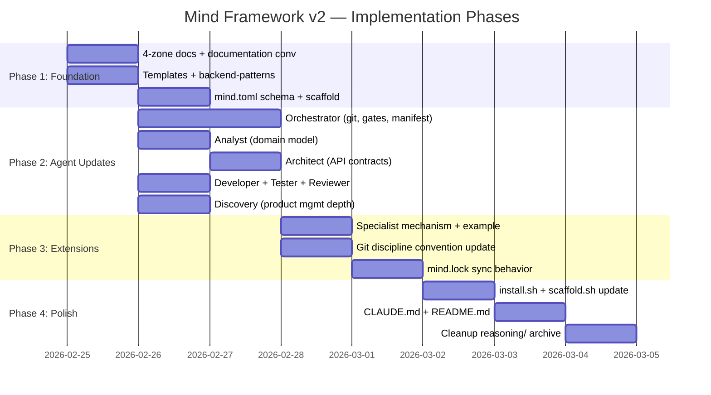

**Total estimated effort**: ~24 hours across 4 phases.

**If time-constrained**, priority order:
1. **Must-first**: Agent path updates (`docs/` → `docs/spec/`), documentation convention, domain model template
2. **Must-second**: Orchestrator git + micro-gates, reviewer deterministic gates
3. **Should**: Analyst domain model extraction, discovery enhancement, backend conventions
4. **Nice-to-have**: Specialist mechanism, mind.toml schema, lock file

---

## 15. Migration Strategy

### 15.1 New Projects

Run updated `scaffold.sh` — creates 4-zone structure + starter `mind.toml` automatically.

```bash
# Full setup: docs structure + framework + mind.toml
./scaffold.sh /path/to/project --with-framework

# Backend project (activates backend profile)
./scaffold.sh /path/to/project --with-framework --backend
```

### 15.2 Existing Projects (v1 → v2)

**Non-breaking**: All agent changes are additive. Agents check both old and new paths during transition.

**Documentation migration**:

```bash
# Create new zone directories
mkdir -p docs/spec docs/state docs/knowledge

# Move stable specs
[ -f docs/project-brief.md ] && mv docs/project-brief.md docs/spec/
[ -f docs/requirements.md ]  && mv docs/requirements.md docs/spec/
[ -f docs/architecture.md ]  && mv docs/architecture.md docs/spec/

# Move volatile state
[ -f docs/current.md ] && mv docs/current.md docs/state/

# iterations/ stays in place
# Create knowledge zone stubs
touch docs/knowledge/glossary.md
```

**Framework update**:

```bash
./install.sh /path/to/project --update
```

Overwrites agent files while preserving project-specific configurations (specialists, project-level CLAUDE.md).

### 15.3 Compatibility Period

During transition, agents check both paths:
- `docs/requirements.md` AND `docs/spec/requirements.md`
- `docs/current.md` AND `docs/state/current.md`

After migration completes, old paths can be removed.

### 15.4 Manifest Adoption

Projects can adopt the manifest at any adoption level (L0-L3) at any time. The manifest is purely additive — it never gates basic framework functionality.

---

## Appendix A: Domain Model Template

```markdown
# Domain Model

## Entity Registry

| Entity | Type | Description | Owned By |
|--------|------|-------------|----------|
| {name} | Aggregate / Entity / Value Object | {what it represents} | {bounded context} |

## Relationship Map

| From | Relationship | To | Cardinality | Constraint |
|------|-------------|-----|-------------|-----------|
| {entity} | {verb phrase} | {entity} | 1:1 / 1:N / M:N | {business rule} |

## Business Rules Registry

| ID | Rule | Entities | Enforcement | Priority |
|----|------|----------|-------------|----------|
| BR-1 | {natural language rule} | {affected} | Domain / Application / Database | Critical / Standard |

## Constraint Catalog

| Constraint | Type | Description | Validation |
|-----------|------|-------------|-----------|
| {name} | Uniqueness / Range / Format / Referential / Temporal | {detail} | {how to verify} |

## State Machines

### {Entity}: {state machine name}
| Current State | Event | Next State | Guard | Side Effects |
|--------------|-------|-----------|-------|-------------|
```

## Appendix B: Retrospective Template

```markdown
# Retrospective: {descriptor}

## What Worked
- {practice or approach that produced good results}

## What Didn't Work
- {practice or issue that caused friction}

## Discoveries
- {unexpected finding — technical, process, or domain}

## Action Items
- {concrete change for next iteration}
```

## Appendix C: Convention Hierarchy

When rules conflict, this hierarchy resolves:

1. **User instruction** (explicit override)
2. **Project docs** (`docs/spec/`, `docs/knowledge/`, project `CLAUDE.md`)
3. **Codebase patterns** (existing code conventions)
4. **Framework conventions** (`conventions/*.md`)
5. **Best practices** (community standards)

## Appendix D: Research Cross-Reference

| Research Concept | Mind v2 Implementation |
|-----------------|----------------------|
| ASDLC Three Layers (Context/Agents/Gates) | Context = `docs/spec/` + `docs/knowledge/`; Agents = `.claude/agents/`; Gates = deterministic + reviewer |
| Spec-Driven Development ("no spec, no build") | Analyst always produces spec artifacts before developer. Domain model enforces this. |
| Context as Code | All agent prompts, conventions, templates are version-controlled markdown. |
| State vs Delta distinction | `docs/spec/` = State (how system works); `docs/iterations/` = Delta (what changed) |
| Autonomy Level 3 | Maintained — human as instructor, intervention at quality gates. |
| Deterministic + Probabilistic Gates | Build/lint/test (deterministic) before reviewer (probabilistic). Micro-gates as lightweight checks. |
| .agent paradigm | Adapted as `docs/` with 4 semantic zones. Not `.agent/` to avoid confusion with `.claude/`. |
| NixOS declarative model | `mind.toml` declares desired state; lock file captures actual; orchestrator reconciles. |
| NixOS generations | `[[generations]]` in manifest tracks strategic state transitions. |
| NixOS modules | `[profiles]` activates coherent bundles (conventions + templates + specialists). |
| Reactive rebuilds | Staleness propagation through dependency graph — minimum rebuild set. |
| MCP integration | Project-level `.mcp.json` — framework guides, doesn't enforce. |
| Sequential + Supervisor topology | Orchestrator as supervisor dispatching sequential chain with conditional architect. |
| Critic Loop | Reviewer as critic with max 2 targeted retries. |

---

*This document is the canonical specification for the Mind Framework v2. It supersedes all documents in `reasoning/`. After implementation, archive reasoning files and retain only this specification.*
