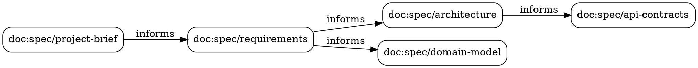

# Blueprint: Reconciliation Engine

> How does hash-based staleness tracking work, end to end?

**Status**: Active
**Date**: 2026-03-11
**Depends on**: [01-mind-cli.md](01-mind-cli.md), [03-architecture.md](03-architecture.md)

---

## 1. Problem Statement

Static validation can answer structural questions: "Does `architecture.md` exist?", "Does it have the required sections?", "Is it a stub?" What static validation cannot answer is **temporal coherence**: "Is `architecture.md` still accurate given that `requirements.md` changed three commits ago?"

In documentation-heavy projects, documents form an implicit dependency chain:

```
project-brief  →  requirements  →  architecture  →  domain-model  →  api-contracts
```

When an upstream document changes, every downstream document *may* be outdated. Without a mechanism to detect this, the only way to discover staleness is for a human to notice inconsistencies during review — by which point the damage is already done. Consider:

1. A developer edits `requirements.md` to add FR-12.
2. `architecture.md` still describes the old component layout (no component covers FR-12).
3. `domain-model.md` is missing the entity FR-12 introduces.
4. An AI agent reads `architecture.md` and generates code that doesn't account for FR-12.

Nobody flagged the inconsistency because nothing tracked the relationship between those files.

**The reconciliation engine makes staleness visible and machine-detectable.** It answers three questions that static validation cannot:

- **What changed?** — Which documents have different content since the last reconciliation.
- **What's stale?** — Which documents depend on something that changed and may need updating.
- **What's the dependency chain?** — Why is a document stale, traced back to the root change.

This is critical for AI agents. When an agent reads project documentation, it needs to know which documents it can trust and which to re-examine. The reconciliation engine provides that signal via `mind.lock`.

### Why Not Just Use Git?

Git tracks *every* change but provides no semantic layer. `git log -- docs/spec/architecture.md` tells you when a file was modified, but not whether that modification invalidated downstream documents. The reconciliation engine adds the missing semantic layer: typed dependency edges between documents, with automated staleness propagation.

---

## 2. Hash Computation

### Algorithm

SHA-256 of raw file content. Not the filename. Not the file metadata (permissions, ownership). Not the git blob hash. Pure content hashing ensures that two files with identical content produce identical hashes regardless of how they arrived on disk.

### Hash Format

```
sha256:{64-character lowercase hex digest}
```

Example:

```
sha256:a3f2b1c8d4e5f6a7b8c9d0e1f2a3b4c5d6e7f8a9b0c1d2e3f4a5b6c7d8e9f0a1
```

The `sha256:` prefix is a type tag that allows future algorithm migration without ambiguity.

### What Gets Hashed

Raw file bytes as read from disk. No normalization, no line-ending conversion, no BOM stripping. This is intentional: any change to the file, including formatting-only changes, produces a different hash. Formatting changes *can* indicate semantic changes (e.g., restructuring markdown headings), and the false-positive cost of re-examining a document is low compared to the false-negative cost of missing a real change.

### Fast Path: mtime Check

Before computing the hash, the engine checks the file's modification time (`mtime`) against the value stored in the lock entry:

```
┌─────────────┐     ┌──────────────────┐     ┌──────────────────┐
│ Read mtime  │────→│ Compare to lock  │────→│ mtime unchanged? │
│ from disk   │     │ entry mtime      │     │                  │
└─────────────┘     └──────────────────┘     └────────┬─────────┘
                                                      │
                                               ┌──────┴──────┐
                                               │             │
                                              Yes           No
                                               │             │
                                               ▼             ▼
                                         ┌──────────┐  ┌──────────────┐
                                         │ Skip hash │  │ Compute hash │
                                         │ (fast)    │  │ (SHA-256)    │
                                         └──────────┘  └──────────────┘
```

This makes repeat reconciliation runs O(changed files) instead of O(all files). In a 50-document project where 1 file changed, only 1 hash is computed instead of 50.

**Why mtime is safe here**: The fast path is an optimization, not a correctness mechanism. If mtime lies (e.g., `touch` without actual content change), the engine computes a hash and discovers the content is identical — a wasted hash but no incorrect result. If the file content changed but mtime didn't (a pathological case that doesn't occur in normal filesystem operations), the change would be caught on the next run where mtime does differ, or on `mind reconcile --force`.

### Edge Cases

| Case | Behavior |
|------|----------|
| **Empty file** | Hash of empty string: `sha256:e3b0c44298fc1c149afbf4c8996fb92427ae41e4649b934ca495991b7852b855` |
| **Binary file** | Hashed normally. Warning logged: `"warning: binary file detected: {path}"` |
| **Symlink** | Resolved to target. Target content is hashed. If target is outside project root, warning logged. |
| **File > 10MB** | Hashed normally. Performance warning logged: `"warning: large file ({size}): {path}"` |
| **File not readable** | Marked as MISSING with error reason. Not treated as a hash computation failure. |

### Go Implementation Sketch

```go
// internal/reconcile/hash.go

const HashPrefix = "sha256:"

func HashFile(path string) (string, error) {
    f, err := os.Open(path)
    if err != nil {
        return "", fmt.Errorf("open %s: %w", path, err)
    }
    defer f.Close()

    h := sha256.New()
    if _, err := io.Copy(h, f); err != nil {
        return "", fmt.Errorf("hash %s: %w", path, err)
    }

    return HashPrefix + hex.EncodeToString(h.Sum(nil)), nil
}

func NeedsRehash(entry *LockEntry, stat os.FileInfo) bool {
    if entry == nil {
        return true // no prior entry
    }
    return !stat.ModTime().Equal(entry.ModTime)
}
```

---

## 3. Dependency Graph

### Edge Declaration in mind.toml

Dependencies between documents are declared as `[[graph]]` entries in the manifest:

```toml
[[graph]]
from = "doc:spec/requirements"
to   = "doc:spec/architecture"
type = "informs"

[[graph]]
from = "doc:spec/architecture"
to   = "doc:spec/domain-model"
type = "informs"

[[graph]]
from = "doc:spec/domain-model"
to   = "doc:spec/api-contracts"
type = "informs"

[[graph]]
from = "doc:spec/requirements"
to   = "doc:spec/domain-model"
type = "informs"
```

Each edge says: "a change in `from` may invalidate `to`." The `from` document is upstream; the `to` document is downstream.

### Edge Types

| Type | Semantics | Staleness Propagation |
|------|-----------|----------------------|
| `informs` | Upstream content informs downstream content. Most common edge type. A change in `from` means `to` may contain outdated information. | **Yes** — change in `from` marks `to` as stale. |
| `requires` | Upstream is a prerequisite for downstream. If `from` is missing, `to` cannot be valid. | **Yes** — change or absence of `from` marks `to` as stale. Missing `from` additionally blocks `to`. |
| `validates` | Upstream validates downstream correctness. A change in `from` means `to` needs re-validation (but `to`'s content may still be correct). | **Yes** — change in `from` marks `to` as needing re-validation. |

All three edge types propagate staleness. The type distinction matters for reporting: `informs` produces "may be outdated", `requires` produces "prerequisite changed", `validates` produces "needs re-validation".

### Graph Data Structure

Adjacency list stored as `map[string][]Edge`. Reconstructed from `mind.toml` on every reconciliation run. Not persisted separately — the manifest is the source of truth.

```go
// internal/reconcile/graph.go

type EdgeType string

const (
    EdgeInforms   EdgeType = "informs"
    EdgeRequires  EdgeType = "requires"
    EdgeValidates EdgeType = "validates"
)

type Edge struct {
    From string   // source document URI
    To   string   // target document URI
    Type EdgeType
}

type Graph struct {
    // Forward edges: from → []Edge (downstream dependents)
    Forward map[string][]Edge
    // Reverse edges: to → []Edge (upstream dependencies)
    Reverse map[string][]Edge
    // All known nodes
    Nodes   map[string]bool
}

func BuildGraph(edges []Edge) *Graph {
    g := &Graph{
        Forward: make(map[string][]Edge),
        Reverse: make(map[string][]Edge),
        Nodes:   make(map[string]bool),
    }
    for _, e := range edges {
        g.Forward[e.From] = append(g.Forward[e.From], e)
        g.Reverse[e.To] = append(g.Reverse[e.To], e)
        g.Nodes[e.From] = true
        g.Nodes[e.To] = true
    }
    return g
}
```

### Example Graph

A typical mind-cli project produces a graph like this:

```
doc:spec/project-brief
    │
    ▼ informs
doc:spec/requirements
    │            \
    ▼ informs     ▼ informs
doc:spec/          doc:spec/
architecture       domain-model
    │
    ▼ informs
doc:spec/api-contracts
```

ASCII representation of the adjacency list:

```
Forward edges:
  doc:spec/project-brief  → [doc:spec/requirements (informs)]
  doc:spec/requirements   → [doc:spec/architecture (informs),
                              doc:spec/domain-model (informs)]
  doc:spec/architecture   → [doc:spec/api-contracts (informs)]

Reverse edges:
  doc:spec/requirements   → [doc:spec/project-brief (informs)]
  doc:spec/architecture   → [doc:spec/requirements (informs)]
  doc:spec/domain-model   → [doc:spec/requirements (informs)]
  doc:spec/api-contracts  → [doc:spec/architecture (informs)]
```

### Cycle Detection

Cycles in the dependency graph are invalid. If A informs B and B informs A, staleness propagation would loop infinitely.

The engine runs depth-first search on graph construction. If a back edge is found, reconciliation aborts with an error reporting the full cycle path:

```
error: circular dependency detected
  doc:spec/architecture → doc:spec/domain-model → doc:spec/architecture
```

This is enforced as a hard error. The `no-circular-dependencies` invariant in `mind.toml` (`[manifest.invariants]`) governs this check.

```go
func DetectCycle(g *Graph) []string {
    visited := map[string]bool{}
    inStack := map[string]bool{}

    var cycle []string
    var dfs func(node string) bool

    dfs = func(node string) bool {
        visited[node] = true
        inStack[node] = true

        for _, edge := range g.Forward[node] {
            if !visited[edge.To] {
                if dfs(edge.To) {
                    cycle = append([]string{edge.To}, cycle...)
                    return true
                }
            } else if inStack[edge.To] {
                cycle = []string{edge.To}
                return true
            }
        }

        inStack[node] = false
        return false
    }

    for node := range g.Nodes {
        if !visited[node] {
            if dfs(node) {
                cycle = append([]string{cycle[0]}, cycle...) // close the cycle
                return cycle
            }
        }
    }
    return nil
}
```

### Graph Visualization

`mind reconcile --graph` outputs a DOT-format graph or an ASCII dependency tree:

**DOT output** (pipe to `dot -Tpng` or `dot -Tsvg`):



**ASCII tree output** (default when no `--format` flag):

```
doc:spec/project-brief
└── doc:spec/requirements [informs]
    ├── doc:spec/architecture [informs]
    │   └── doc:spec/api-contracts [informs]
    └── doc:spec/domain-model [informs]
```

---

## 4. Staleness Propagation Algorithm

### Overview

Staleness propagation answers: "Given that document X changed, which other documents are now potentially outdated?" It walks the dependency graph forward (downstream) from every changed document, marking dependents as stale.

### Step-by-Step Algorithm

```
Input:  manifest (mind.toml), lock file (mind.lock), filesystem
Output: updated lock file with staleness annotations

PHASE 1 — LOAD
  1. Parse mind.toml → extract [documents] and [[graph]] sections
  2. Load mind.lock → if file not found, create empty lock (all entries nil)
  3. Build dependency graph from [[graph]] edges
  4. Run cycle detection on graph → abort if cycle found

PHASE 2 — SCAN
  5. For each declared document in manifest:
     a. Check if file exists on disk
        → If missing: mark entry status = MISSING, continue to next
     b. Read file stat (mtime, size)
     c. Compare mtime to lock entry (fast path)
        → If mtime unchanged AND lock entry exists: skip hash, status = UNCHANGED
        → If mtime changed OR no lock entry:
           i.  Compute SHA-256 of file content
           ii. Compare hash to lock entry hash
               → If different (or no prior hash): status = CHANGED
               → If same: status = UNCHANGED (mtime changed but content didn't)
     d. Update lock entry: hash, size, mod_time

PHASE 3 — DETECT UNDECLARED
  6. Scan docs/ directory recursively for all files
  7. Subtract manifest-declared paths from scan results
  8. Remaining files are undeclared → collect as warnings

PHASE 4 — PROPAGATE
  9. Collect all CHANGED document IDs into a set
  10. For each CHANGED document:
      a. Walk forward edges in the dependency graph
      b. For each downstream dependent:
         → If already marked CHANGED: skip (it changed itself; it's fresh)
         → If already marked STALE: skip (already reached via another path)
         → Mark as STALE with reason: "dependency changed: {changed doc ID}"
         → Recurse into the dependent's own downstream dependents (transitive)
         → Track propagation depth
  11. Clear staleness on documents that were themselves CHANGED
      (A document that changed is now fresh — it may make others stale,
       but it is not itself stale)

PHASE 5 — WRITE
  12. Update lock file:
      → Set entry hashes, sizes, mod_times for all scanned documents
      → Set stale flags and stale_reason strings
      → Compute stats: total, changed, stale, missing, undeclared, clean
      → Set generated_at timestamp
  13. Write lock file atomically (write to temp file, then rename)

PHASE 6 — REPORT
  14. Output results:
      → Changed documents (with old hash → new hash)
      → Stale documents with dependency chain explaining why
      → Missing documents
      → Undeclared files
      → Overall status: CLEAN | STALE | DIRTY
```

### Transitive Propagation

If the graph contains A → B → C and A changes:

```
A changes
├── B is stale (reason: "dependency changed: doc:spec/A")
│   └── C is stale (reason: "dependency changed: doc:spec/A (via doc:spec/B)")
```

Both B and C become stale. The reason string for C includes the transitive path so the user can trace why a seemingly unrelated document was flagged.

### Propagation Depth Limit

Maximum propagation depth: **10 levels**. This prevents pathological cases in large graphs with deep chains. If the limit is reached, a warning is logged:

```
warning: staleness propagation depth limit (10) reached at doc:spec/deep-nested
         some downstream documents may not be marked as stale
```

In practice, document dependency chains rarely exceed 4-5 levels. A depth limit of 10 provides generous headroom while preventing runaway propagation in misconfigured graphs.

### Directionality: No Reverse Propagation

Staleness flows **downstream only**. If the graph declares A → B and B changes, A does NOT become stale. This is by design:

- A informs B. If A changes, B may be outdated (it was written based on A's old content).
- If B changes, A is unaffected. B's content derived from A, not the other way around.

This matches how document dependencies work in practice: requirements inform architecture, not vice versa.

### Propagation Pseudocode

```
func PropagateDownstream(graph, changedID, staleMap, changedSet, depth):
    if depth > MAX_DEPTH (10):
        log warning "depth limit reached at {changedID}"
        return

    for each edge in graph.Forward[changedID]:
        targetID = edge.To

        // Skip if target was itself changed (it's fresh, not stale)
        if targetID in changedSet:
            continue

        // Skip if already marked stale (reached via another path)
        if targetID in staleMap:
            continue

        // Build reason string with transitive path
        if depth == 0:
            reason = "dependency changed: " + changedID
        else:
            reason = "dependency changed: " + changedID + " (via transitive chain)"

        staleMap[targetID] = reason

        // Recurse into target's dependents
        PropagateDownstream(graph, targetID, staleMap, changedSet, depth + 1)
```

---

## 5. Lock File Lifecycle

The lock file (`mind.lock`) has four lifecycle operations. Each operation corresponds to a specific use case.

### Create — First Run

```
mind reconcile          (no mind.lock exists yet)
```

- Hashes every declared document in the manifest.
- Builds the initial lock file with all entries and their current hashes.
- No staleness is possible on first run (no prior state to compare against).
- All entries start with `stale: false`.

This is the baseline. Every subsequent reconciliation compares against this snapshot.

### Update — Subsequent Runs

```
mind reconcile          (mind.lock already exists)
```

- Uses the mtime fast path to skip unchanged files.
- Re-hashes files with changed mtime.
- Compares new hashes against lock entries.
- Propagates staleness through the dependency graph for changed documents.
- Writes the updated lock file.

This is the normal operation. Run after editing documents, after AI agent runs, or as part of `mind check all`.

### Verify — CI / Read-Only Check

```
mind reconcile --check
```

- Performs the same scan and propagation as Update.
- Does **not** write the lock file.
- Exit code 0 if all documents are clean (no staleness).
- Exit code 4 if any documents are stale.
- Designed for CI pipelines: fail the build if documentation is out of sync.

```
$ mind reconcile --check
2 stale documents detected:
  doc:spec/architecture    — dependency changed: doc:spec/requirements
  doc:spec/api-contracts   — dependency changed: doc:spec/requirements (via doc:spec/architecture)
exit 4
```

### Reset — Force Refresh

```
mind reconcile --force
```

- Discards the existing lock file entirely.
- Re-hashes every declared document from scratch.
- Clears all staleness flags.
- Use case: after manually reviewing and updating stale documents, reset the lock to acknowledge that everything is now current.

```
$ mind reconcile --force
Forced reconciliation: 12 documents hashed, all clean.
```

### Lifecycle Diagram

```
                 ┌──────────────────────────────────────┐
                 │         No mind.lock exists           │
                 └──────────────────┬───────────────────┘
                                    │
                              mind reconcile
                                    │
                                    ▼
                 ┌──────────────────────────────────────┐
                 │     Lock file created (baseline)      │
                 │     All entries: stale = false         │
                 └──────────────────┬───────────────────┘
                                    │
                        ┌───────────┼───────────┐
                        │           │           │
                  mind reconcile    │    mind reconcile
                                    │       --force
                        │           │           │
                        ▼           │           ▼
                 ┌──────────────┐   │   ┌──────────────┐
                 │ Incremental  │   │   │ Full reset   │
                 │ update       │   │   │ (re-baseline)│
                 │ (fast path)  │   │   │              │
                 └──────────────┘   │   └──────────────┘
                                    │
                          mind reconcile --check
                                    │
                                    ▼
                         ┌──────────────────┐
                         │ Read-only verify  │
                         │ Exit 0 or Exit 4  │
                         │ (no write)        │
                         └──────────────────┘
```

---

## 6. Reconciliation Algorithm (Full Pseudocode)

```
func Reconcile(projectRoot string, opts ReconcileOpts) (*ReconcileResult, error):
    //
    // PHASE 1: Load inputs
    //
    manifest, err = ParseManifest(projectRoot + "/mind.toml")
    if err != nil:
        return error("invalid manifest: " + err)

    var lock *LockFile
    if opts.Force:
        lock = NewEmptyLock()
    else:
        lock = LoadLockOrEmpty(projectRoot + "/mind.lock")

    //
    // PHASE 2: Build and validate graph
    //
    edges = ParseGraphEdges(manifest.Graph)
    graph = BuildGraph(edges)

    if cycle = DetectCycle(graph); cycle != nil:
        return error("circular dependency: " + FormatCycle(cycle))

    //
    // PHASE 3: Scan filesystem and compute hashes
    //
    changed  = []string{}
    missing  = []string{}
    scanned  = 0

    for doc in manifest.Documents:
        path = projectRoot + "/" + doc.Path
        entry = lock.Entries[doc.ID]

        // Check existence
        stat, err = os.Stat(path)
        if err != nil (file not found):
            lock.Entries[doc.ID] = LockEntry{
                ID:     doc.ID,
                Path:   doc.Path,
                Status: STATUS_MISSING,
            }
            missing = append(missing, doc.ID)
            continue

        scanned++

        // Fast path: mtime check
        if entry != nil && stat.ModTime == entry.ModTime && stat.Size == entry.Size:
            // mtime and size unchanged — skip hash computation
            continue

        // Slow path: compute hash
        hash, err = HashFile(path)
        if err != nil:
            log.Warn("hash failed for %s: %v", path, err)
            continue

        // Check for large or binary files (warnings only)
        if stat.Size > 10 * 1024 * 1024:
            log.Warn("large file (%s): %s", FormatSize(stat.Size), path)
        if IsBinary(path):
            log.Warn("binary file detected: %s", path)

        // Compare to previous hash
        if entry == nil || hash != entry.Hash:
            changed = append(changed, doc.ID)

        // Update entry
        lock.Entries[doc.ID] = LockEntry{
            ID:      doc.ID,
            Path:    doc.Path,
            Hash:    hash,
            Size:    stat.Size,
            ModTime: stat.ModTime,
            Status:  STATUS_PRESENT,
        }

    //
    // PHASE 4: Detect undeclared files
    //
    allDocsFiles = ScanDirectory(projectRoot + "/docs")
    declaredPaths = set(manifest.DocumentPaths())
    undeclared = allDocsFiles - declaredPaths

    //
    // PHASE 5: Propagate staleness
    //
    changedSet = set(changed)
    staleMap   = map[string]string{}   // docID → reason

    for _, docID in changed:
        PropagateDownstream(graph, docID, staleMap, changedSet, 0)

    // Apply staleness to lock entries
    for docID, reason in staleMap:
        entry = lock.Entries[docID]
        if entry != nil:
            entry.Stale = true
            entry.StaleReason = reason

    // Documents that changed are fresh, not stale
    for _, docID in changed:
        entry = lock.Entries[docID]
        if entry != nil:
            entry.Stale = false
            entry.StaleReason = ""

    //
    // PHASE 6: Compute stats and write
    //
    lock.GeneratedAt = time.Now().UTC()
    lock.Stats = Stats{
        Total:      len(manifest.Documents),
        Changed:    len(changed),
        Stale:      len(staleMap),
        Missing:    len(missing),
        Undeclared: len(undeclared),
        Clean:      len(manifest.Documents) - len(changed) - len(staleMap) - len(missing),
    }

    // Determine overall status
    if len(staleMap) > 0:
        lock.Status = "STALE"
    else if len(missing) > 0:
        lock.Status = "DIRTY"
    else:
        lock.Status = "CLEAN"

    // Write (unless --check mode)
    if !opts.CheckOnly:
        WriteLockAtomic(projectRoot + "/mind.lock", lock)

    return &ReconcileResult{
        Changed:    changed,
        Stale:      staleMap,
        Missing:    missing,
        Undeclared: undeclared,
        Status:     lock.Status,
        Stats:      lock.Stats,
    }


func PropagateDownstream(graph *Graph, sourceID string,
                         staleMap map[string]string,
                         changedSet map[string]bool,
                         depth int):
    if depth > 10:
        log.Warn("staleness propagation depth limit (10) reached at %s", sourceID)
        return

    for _, edge in graph.Forward[sourceID]:
        targetID = edge.To

        // Skip self-changed documents (they're fresh)
        if changedSet[targetID]:
            continue

        // Skip already-marked documents (reached via another path)
        if _, exists = staleMap[targetID]; exists:
            continue

        // Build reason with transitive context
        if depth == 0:
            staleMap[targetID] = "dependency changed: " + sourceID
        else:
            staleMap[targetID] = "dependency changed: " + sourceID + " (via transitive chain)"

        // Recurse
        PropagateDownstream(graph, targetID, staleMap, changedSet, depth + 1)


func WriteLockAtomic(path string, lock *LockFile):
    tmpPath = path + ".tmp"
    data = json.MarshalIndent(lock, "", "  ")
    os.WriteFile(tmpPath, data, 0644)
    os.Rename(tmpPath, path)   // atomic on POSIX
```

### Worked Example

Given this manifest graph and filesystem state:

```
Graph edges:
  project-brief → requirements (informs)
  requirements  → architecture (informs)
  requirements  → domain-model (informs)
  architecture  → api-contracts (informs)

Previous lock (from last reconcile):
  project-brief:  sha256:aaaa...  mtime: 2026-03-08T10:00:00Z
  requirements:   sha256:bbbb...  mtime: 2026-03-08T11:00:00Z
  architecture:   sha256:cccc...  mtime: 2026-03-08T12:00:00Z
  domain-model:   sha256:dddd...  mtime: 2026-03-08T12:30:00Z
  api-contracts:  sha256:eeee...  mtime: 2026-03-08T13:00:00Z

Current filesystem:
  project-brief:  content unchanged, mtime unchanged
  requirements:   content CHANGED,   mtime: 2026-03-10T09:00:00Z  → new hash: sha256:ffff...
  architecture:   content unchanged, mtime unchanged
  domain-model:   content unchanged, mtime unchanged
  api-contracts:  content unchanged, mtime unchanged
```

Reconciliation proceeds:

```
SCAN:
  project-brief  → mtime match → skip hash → UNCHANGED
  requirements   → mtime differs → hash → sha256:ffff ≠ sha256:bbbb → CHANGED
  architecture   → mtime match → skip hash → UNCHANGED
  domain-model   → mtime match → skip hash → UNCHANGED
  api-contracts  → mtime match → skip hash → UNCHANGED

PROPAGATE from requirements (CHANGED):
  → architecture: STALE (dependency changed: doc:spec/requirements)
    → api-contracts: STALE (dependency changed: doc:spec/requirements (via transitive chain))
  → domain-model: STALE (dependency changed: doc:spec/requirements)

RESULT:
  Changed: [requirements]
  Stale:   {architecture: "dependency changed: doc:spec/requirements",
            api-contracts: "dependency changed: doc:spec/requirements (via transitive chain)",
            domain-model: "dependency changed: doc:spec/requirements"}
  Status:  STALE
```

---

## 7. Integration Points

The reconciliation engine is a subsystem consumed by multiple CLI commands. It never runs in isolation — it feeds data into the broader project intelligence layer.

### `mind reconcile`

The dedicated command for running reconciliation directly.

```
mind reconcile              Run reconciliation, update mind.lock
mind reconcile --check      Verify without writing (CI mode, exit 0 or 4)
mind reconcile --force      Discard lock, re-hash everything, clear staleness
mind reconcile --graph      Output dependency graph (DOT or ASCII)
```

> Note: The specific CLI flags, argument parsing, and output formatting are defined in BP-04 (CLI Specification). This blueprint covers the engine behavior, not the command interface.

### `mind status`

Reads the lock file (if present) and includes staleness information in the project health dashboard:

```
╭─ Mind Framework ────────────────────────────────────────────────╮
│                                                                  │
│  Documentation Health                                            │
│  spec/         ████████░░  4/5   reqs ✓  arch ⚠  domain ⚠      │
│                                                                  │
│  Staleness (2 documents)                                         │
│  ────────────────────────                                        │
│  ⚠ architecture.md    — stale: requirements.md changed           │
│  ⚠ domain-model.md    — stale: requirements.md changed           │
│                                                                  │
╰──────────────────────────────────────────────────────────────────╯
```

If no lock file exists, the staleness panel is omitted. `mind status` does not trigger reconciliation — it only reads existing lock data.

### `mind check all`

Includes reconciliation as an additional validation suite alongside docs, refs, and config checks:

```
$ mind check all

╭─ Reconciliation (staleness) ────────────────────────────────────╮
│  Changed: 1   Stale: 2   Missing: 0   Clean: 9                  │
│  ⚠ doc:spec/architecture    — dependency changed: requirements   │
│  ⚠ doc:spec/domain-model    — dependency changed: requirements   │
╰──────────────────────────────────────────────────────────────────╯
```

In normal mode, stale documents produce warnings. With `--strict`, they produce failures (exit code 1).

### `mind doctor`

Reports staleness as a diagnostic finding with an actionable remediation:

```
⚠ 2 stale documents detected:
  → doc:spec/architecture — stale because doc:spec/requirements changed
  → doc:spec/domain-model — stale because doc:spec/requirements changed
  Fix: Review and update these documents, then run 'mind reconcile --force'
```

### MCP Server

The `mind_status` and `mind_validate_docs` MCP tools include staleness data in their JSON responses:

```json
{
  "staleness": {
    "status": "STALE",
    "changed": ["doc:spec/requirements"],
    "stale": {
      "doc:spec/architecture": "dependency changed: doc:spec/requirements",
      "doc:spec/domain-model": "dependency changed: doc:spec/requirements"
    },
    "stats": {
      "total": 12,
      "changed": 1,
      "stale": 2,
      "missing": 0,
      "clean": 9
    }
  }
}
```

AI agents consuming MCP tools can use this data to decide which documents to re-read before generating content.

### TUI Status Tab

The TUI adds a staleness panel to the Status tab when staleness is detected:

```
┌─ Staleness ──────────────────────────────────────────────────────┐
│  2 stale documents (requirements changed 2026-03-10)             │
│                                                                  │
│  doc:spec/architecture   ← doc:spec/requirements                 │
│  doc:spec/domain-model   ← doc:spec/requirements                 │
│                                                                  │
│  Press 'r' to run reconciliation    'f' to force-reset           │
└──────────────────────────────────────────────────────────────────┘
```

### Watch Mode

When `mind watch` is active, reconciliation runs automatically on relevant file changes (debounced at 500ms). The watch event pipeline:

```
File change detected (fsnotify)
    │
    ▼
Is file in manifest [documents]?
    │
 ┌──┴──┐
Yes    No → ignore (or flag as undeclared)
 │
 ▼
Debounce (500ms)
 │
 ▼
Run incremental reconciliation
 │
 ▼
Update TUI staleness panel / emit notification
```

---

## 8. Performance Targets

| Operation | Target | Notes |
|-----------|--------|-------|
| Full reconciliation (50 documents) | < 200ms | All hashes computed, graph traversed, lock written |
| Incremental reconciliation (1 file changed) | < 50ms | mtime fast path skips 49 hashes |
| Lock file read | < 5ms | JSON parse of typical lock (~20KB) |
| Lock file write | < 5ms | JSON marshal + atomic rename |
| Graph construction | < 1ms | Adjacency list from ~50 edges |
| Graph traversal (staleness propagation) | < 1ms | O(V + E), negligible for document-scale graphs |
| Cycle detection | < 1ms | DFS over document-scale graph |
| mtime stat call (per file) | < 0.1ms | Single syscall per file |
| SHA-256 hash (100KB file) | < 1ms | CPU-bound, no I/O bottleneck |

**Bottleneck analysis**: The dominant cost is I/O — reading files from disk for hashing. The mtime fast path eliminates this for unchanged files. On NVMe storage, hashing 50 files of average 10KB each takes ~5ms. The 200ms budget provides a 40x safety margin for slower disks, large files, or cold caches.

**Scaling**: The algorithm is O(D + E) where D is the number of declared documents and E is the number of graph edges. For the anticipated scale (< 100 documents, < 200 edges), this is effectively constant time. The depth limit (10) bounds the worst-case propagation to O(10 * E).

---

## 9. Edge Cases

### Missing Files

A document declared in the manifest but not present on disk.

- **Status**: MISSING (not STALE — "stale" implies the document exists but is outdated).
- **Propagation**: Missing documents do not trigger downstream staleness. A file that was never present has no "previous state" to compare against. However, `requires`-type edges where the `from` document is missing will flag the `to` document as blocked.
- **Remediation**: `mind doctor` reports missing documents and suggests creating them.

### New Undeclared Files

Files in `docs/` that are not registered in the manifest's `[documents]` section.

- **Reported as**: Warnings (not errors). The file may be intentional but unregistered, or it may be accidental.
- **Not included in**: Staleness propagation. Only manifest-declared documents participate in the dependency graph.
- **Remediation**: Register the file in `mind.toml` or remove it.

### Renamed Files

Treated as delete + create:

- The old path becomes MISSING in the lock file (the manifest still references the old path, but the file is gone).
- The new path appears as an undeclared file (it exists on disk but isn't in the manifest).
- After the user updates `mind.toml` to reflect the rename and runs `mind reconcile`, the new path is hashed fresh and the old entry is removed.

### Empty Files

- Hash computed normally: `sha256:e3b0c44298fc1c149afbf4c8996fb92427ae41e4649b934ca495991b7852b855`.
- Empty files may also be flagged as stubs by the separate stub-detection logic in `mind check docs`. Reconciliation does not duplicate that check.

### Binary Files

- Hash computed normally. Binary content produces a valid SHA-256 hash.
- Warning logged: `"warning: binary file detected: {path}"`. Documentation repositories typically contain markdown, not binaries. A binary in `docs/` is unusual and worth flagging.

### Symlinks

- Resolved to their target using `filepath.EvalSymlinks()`.
- Target content is hashed (not the symlink itself).
- If the target is outside the project root, a warning is logged: `"warning: symlink target outside project root: {path} → {target}"`.

### Lock File Missing

- Treated as a fresh start. Equivalent to `--force`.
- All documents are hashed, no staleness is possible (no baseline to compare against).
- This happens on first run or if someone deletes `mind.lock`.

### No `[[graph]]` Edges in Manifest

- The graph is empty. Documents are tracked individually (hashes, existence, mtime) but no staleness propagation occurs.
- This is a valid configuration. Not every project needs dependency tracking — some just want hash-based change detection.

### Concurrent Modification

- The lock file is written atomically: write to `mind.lock.tmp`, then `os.Rename()` to `mind.lock`. On POSIX systems, `rename` is atomic within the same filesystem.
- No file locking is required because mind-cli is a single-writer CLI tool. Two concurrent `mind reconcile` invocations would race on the rename, but the last writer wins with a consistent state.

### Large Projects (100+ Documents)

- The algorithm remains O(D + E) and fits well within the 200ms budget.
- The mtime fast path ensures that incremental runs are fast regardless of project size.
- Memory usage is bounded: the entire lock file and graph fit in a few KB for even the largest anticipated projects.

---

## Scope Boundaries

This blueprint covers the **reconciliation engine** — the subsystem that computes hashes, builds the dependency graph, propagates staleness, and manages the lock file lifecycle.

**This blueprint does NOT define:**

- The `mind.lock` JSON schema (field names, nesting, versioning) — see Data Contracts (BP-03).
- The `mind reconcile` CLI flags, argument parsing, output formatting, or exit codes — see CLI Specification (BP-04).
- How AI agents interpret staleness data to make workflow decisions — see AI Workflow Bridge (BP-02).
- The `mind.toml` manifest schema or `[documents]` section format — see the manifest specification.

---

> **See also:**
> - [01-mind-cli.md](01-mind-cli.md) — CLI foundation and command tree
> - [02-ai-workflow-bridge.md](02-ai-workflow-bridge.md) — How AI agents consume staleness data via MCP
> - [03-architecture.md](03-architecture.md) — 4-layer architecture where reconciliation lives in the Service layer
